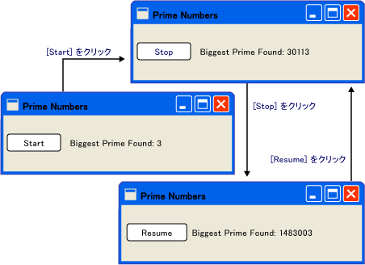
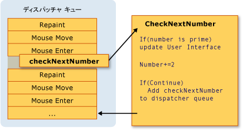
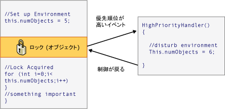

# スレッド モデル
[!INCLUDE[TLA#tla_winclient](../../../../includes/tlasharptla-winclient-md.md)]スレッド処理の難しさから開発者を保存する設計されています。 その結果、ほとんどの[!INCLUDE[TLA2#tla_winclient](../../../../includes/tla2sharptla-winclient-md.md)]開発者は、1 つ以上のスレッドを使用するインターフェイスを作成する必要はありません。 マルチ スレッド プログラムは複雑で、デバッグが困難であるため、シングル スレッドのソリューションが存在する場合、避けてください。  
  
 関係なくどの程度設計、ただし、いいえ[!INCLUDE[TLA2#tla_ui](../../../../includes/tla2sharptla-ui-md.md)]フレームワークが問題のすべての種類のシングル スレッドのソリューションを提供できることもできます。              [!INCLUDE[TLA2#tla_winclient](../../../../includes/tla2sharptla-winclient-md.md)]閉じるには複数のスレッドを向上させるような状況はまだあります[!INCLUDE[TLA#tla_ui](../../../../includes/tlasharptla-ui-md.md)]応答性またはアプリケーションのパフォーマンス。 いくつかの背景情報の資料を紹介した後は、このホワイト ペーパーは、このような状況をいくつか解説しでいくつかの低レベルの詳細に説明し、終了します。  
  
   
  
> [!NOTE]
>  このトピックでは、スレッドを使用して、 <xref:System.Windows.Threading.Dispatcher.BeginInvoke%2A>非同期呼び出しのメソッドです。 呼び出して、非同期呼び出しを作成することも、 <xref:System.Windows.Threading.Dispatcher.InvokeAsync%2A>メソッドで、実行、<xref:System.Action>または<xref:System.Func%601>をパラメーターとして。  <xref:System.Windows.Threading.Dispatcher.InvokeAsync%2A>メソッドが返される、 <xref:System.Windows.Threading.DispatcherOperation>または<xref:System.Windows.Threading.DispatcherOperation%601>を持つ、<xref:System.Windows.Threading.DispatcherOperation.Task%2A>プロパティです。 使用することができます、`await`いずれかのキーワード、 <xref:System.Windows.Threading.DispatcherOperation>または関連付けられた<xref:System.Threading.Tasks.Task>します。 同期的に待機する必要がある場合、<xref:System.Threading.Tasks.Task>によって返される、 <xref:System.Windows.Threading.DispatcherOperation>または<xref:System.Windows.Threading.DispatcherOperation%601>を呼び出す、 <xref:System.Windows.Threading.TaskExtensions.DispatcherOperationWait%2A>拡張メソッド。  呼び出す<xref:System.Threading.Tasks.Task.Wait%2A?displayProperty=fullName>デッドロックが発生します。 使用の詳細については、<xref:System.Threading.Tasks.Task>非同期操作を実行するタスクの並列化を参照してください。  <xref:System.Windows.Threading.Dispatcher.Invoke%2A>メソッドも使用するオーバー ロードを持つ、<xref:System.Action>または<xref:System.Func%601>をパラメーターとして。  使用することができます、 <xref:System.Windows.Threading.Dispatcher.Invoke%2A> 、デリゲートを渡すことによって同期するメソッドを呼び出す<xref:System.Action>または<xref:System.Func%601>します。  
  
   
## 概要と、ディスパッチャー  
 通常、[!INCLUDE[TLA2#tla_winclient](../../../../includes/tla2sharptla-winclient-md.md)]アプリケーションは&2; つのスレッドで開始: レンダリングおよび管理するための別の処理に&1; つずつ、[!INCLUDE[TLA2#tla_ui](../../../../includes/tla2sharptla-ui-md.md)]です。 レンダリング スレッドが効率的に実行中にバック グラウンドで非表示、[!INCLUDE[TLA2#tla_ui](../../../../includes/tla2sharptla-ui-md.md)]スレッドの入力を受け取り、イベントを処理、画面の描画およびアプリケーション コードを実行します。 ほとんどのアプリケーションは、1 つを使用して[!INCLUDE[TLA2#tla_ui](../../../../includes/tla2sharptla-ui-md.md)]スレッドがいくつかの状況ではいくつかの使用を推奨します。 この例を使用して後で説明します。  
  
 [!INCLUDE[TLA2#tla_ui](../../../../includes/tla2sharptla-ui-md.md)]スレッドのキューの作業と呼ばれるオブジェクト内の項目、<xref:System.Windows.Threading.Dispatcher>します。 <xref:System.Windows.Threading.Dispatcher>優先度ごとに作業項目を選択し、完了までの&1; つずつ実行します。  すべて[!INCLUDE[TLA2#tla_ui](../../../../includes/tla2sharptla-ui-md.md)]スレッドは少なくとも&1; つである必要があります<xref:System.Windows.Threading.Dispatcher>、および各<xref:System.Windows.Threading.Dispatcher>ただ&1; つのスレッドでの作業項目を実行することができます。  
  
 応答性の高い、使いやすいアプリケーションを構築する秘訣は最大化する、<xref:System.Windows.Threading.Dispatcher>小さな作業項目を保持することでスループットです。 により、この項目は達しません内に留まっている古い、<xref:System.Windows.Threading.Dispatcher>キュー処理待機しています。 入力と応答の間に遅延は、ユーザーに不満ことができます。  
  
 どのような方法は[!INCLUDE[TLA2#tla_winclient](../../../../includes/tla2sharptla-winclient-md.md)]アプリケーションが大規模な操作を処理することになっているでしょうか。 場合、コードを使用するか、大規模な計算では、または、リモート サーバー上のデータベースを照会する必要がありますか。 通常は、それには、大規模なまま、別のスレッドで操作を処理、[!INCLUDE[TLA2#tla_ui](../../../../includes/tla2sharptla-ui-md.md)]スレッド内の項目に傾向が無料、<xref:System.Windows.Threading.Dispatcher>キューです。 その結果を報告できる大きな操作が完了したらに戻す、[!INCLUDE[TLA2#tla_ui](../../../../includes/tla2sharptla-ui-md.md)]スレッドを表示するためです。  
  
 従来、[!INCLUDE[TLA#tla_mswin](../../../../includes/tlasharptla-mswin-md.md)]により[!INCLUDE[TLA2#tla_ui](../../../../includes/tla2sharptla-ui-md.md)]を作成したスレッドのみがアクセスする要素。 つまりが完了すると、いくつかの実行時間の長いタスクを担当するバック グラウンド スレッドにテキスト ボックスを更新できません。                  [!INCLUDE[TLA#tla_mswin](../../../../includes/tlasharptla-mswin-md.md)]これは、整合性を保つため[!INCLUDE[TLA2#tla_ui](../../../../includes/tla2sharptla-ui-md.md)]コンポーネントです。 リスト ボックスは、その内容が描画中にバック グラウンド スレッドによって更新された場合は奇妙に見える可能性があります。  
  
 [!INCLUDE[TLA2#tla_winclient](../../../../includes/tla2sharptla-winclient-md.md)]この調整を適用する組み込みの相互排除メカニズムを備えています。 ほとんどのクラス[!INCLUDE[TLA2#tla_winclient](../../../../includes/tla2sharptla-winclient-md.md)]から派生<xref:System.Windows.Threading.DispatcherObject>します。 構築時、 <xref:System.Windows.Threading.DispatcherObject>への参照を格納、<xref:System.Windows.Threading.Dispatcher>現在実行中のスレッドにリンクします。 実際には、 <xref:System.Windows.Threading.DispatcherObject>が作成したスレッドに関連付けられます。 プログラムの実行中、 <xref:System.Windows.Threading.DispatcherObject>そのパブリックを呼び出すことができます<xref:System.Windows.Threading.DispatcherObject.VerifyAccess%2A>メソッドです。                  <xref:System.Windows.Threading.DispatcherObject.VerifyAccess%2A>を調べ、<xref:System.Windows.Threading.Dispatcher> 、現在のスレッドに関連付けられているし、比較、<xref:System.Windows.Threading.Dispatcher>構築中に格納されている参照します。 ハッシュが一致しない場合<xref:System.Windows.Threading.DispatcherObject.VerifyAccess%2A>例外をスローします。                  <xref:System.Windows.Threading.DispatcherObject.VerifyAccess%2A>に属するすべてのメソッドの開始時に呼び出されるものでは、 <xref:System.Windows.Threading.DispatcherObject>します。  
  
 1 つのスレッドを変更できるだけの場合、 [!INCLUDE[TLA2#tla_ui](../../../../includes/tla2sharptla-ui-md.md)]、方法はバック グラウンド スレッドと対話するユーザーですか? バック グラウンド スレッドを問い合わせることができます、[!INCLUDE[TLA2#tla_ui](../../../../includes/tla2sharptla-ui-md.md)]スレッドの代わりに操作を実行します。 これは作業項目を登録することによって、<xref:System.Windows.Threading.Dispatcher>の[!INCLUDE[TLA2#tla_ui](../../../../includes/tla2sharptla-ui-md.md)]スレッドです。 <xref:System.Windows.Threading.Dispatcher>クラスは作業項目を登録するための&2; つのメソッドを提供します。 <xref:System.Windows.Threading.Dispatcher.Invoke%2A>と<xref:System.Windows.Threading.Dispatcher.BeginInvoke%2A>します。 どちらの方法では、デリゲートの実行をスケジュールします。                  <xref:System.Windows.Threading.Dispatcher.Invoke%2A>– の同期呼び出しは、まで返されなくては、[!INCLUDE[TLA2#tla_ui](../../../../includes/tla2sharptla-ui-md.md)]スレッドが実際にはデリゲートの実行を終了します。                  <xref:System.Windows.Threading.Dispatcher.BeginInvoke%2A>は非同期制御を戻しません。  
  
 <xref:System.Windows.Threading.Dispatcher>優先順位によって、キューに要素を並べ替えます。 要素を追加するときに指定できる&10; のレベルがある、<xref:System.Windows.Threading.Dispatcher>キューです。 これらの優先順位を管理、 <xref:System.Windows.Threading.DispatcherPriority>列挙します。 に関する詳細情報<xref:System.Windows.Threading.DispatcherPriority>レベルを参照して、[!INCLUDE[TLA2#tla_winfxsdk](../../../../includes/tla2sharptla-winfxsdk-md.md)]ドキュメントです。  
  
   
## 実際のスレッド: サンプル  
  
   
### 実行時間の長い計算をシングル スレッド アプリケーション  
 ほとんど[!INCLUDE[TLA#tla_gui#plural](../../../../includes/tlasharptla-guisharpplural-md.md)]のユーザーの操作への応答で生成されるイベントの待機中にアイドル時間の大部分を費やしています。 慎重なプログラミング アイドル時間する建設的に使用できますの応答性に影響を与えず、[!INCLUDE[TLA2#tla_ui](../../../../includes/tla2sharptla-ui-md.md)]です。 [!INCLUDE[TLA2#tla_winclient](../../../../includes/tla2sharptla-winclient-md.md)]で起こっているか、操作を中断する入力を許可しないスレッド モデル、[!INCLUDE[TLA2#tla_ui](../../../../includes/tla2sharptla-ui-md.md)]スレッドです。 つまりに戻ることを確認する必要があります、<xref:System.Windows.Threading.Dispatcher>古いに到達する前に、入力イベントの保留中の処理を定期的にします。  
  
 次に例を示します。  
  
   
  
 このシンプルなアプリケーションは、素数を検索して&3; から上方向にカウントします。 ユーザーがクリックしたとき、**開始** ボタンをクリック、検索を開始します。 プログラムは、素数を検出すると、その探索でユーザー インターフェイスを更新します。 任意の時点では、ユーザーは、検索を停止できます。  
  
 単純なので、素数の検索はいくつかの問題について説明する無限に移動でした。  ボタンのクリック イベント ハンドラー内全体の検索、処理した場合は与えられません、[!INCLUDE[TLA2#tla_ui](../../../../includes/tla2sharptla-ui-md.md)]スレッドが他のイベントを処理します。 [!INCLUDE[TLA2#tla_ui](../../../../includes/tla2sharptla-ui-md.md)]入力やプロセスに対応できないというメッセージです。 再描画し、ボタンのクリックに応答しません。  
  
 別のスレッドでの素数の検索を実際に実行できますが、同期の問題に対処する必要がありますが。 シングル スレッドのアプローチで検出された最大の素数を一覧表示するラベルを直接更新ことができます。  
  
 管理しやすいチャンクに計算のタスクを分割して定期的に戻ることが、<xref:System.Windows.Threading.Dispatcher>およびイベントを処理します。 紹介[!INCLUDE[TLA2#tla_winclient](../../../../includes/tla2sharptla-winclient-md.md)]を再描画し、入力を処理することです。  
  
 計算とイベント処理の間での処理時間を分割する最善の方法は、計算を管理する、<xref:System.Windows.Threading.Dispatcher>します。 使用して、 <xref:System.Windows.Threading.Dispatcher.BeginInvoke%2A>メソッド内の素数のチェックはスケジュールを同じキュー[!INCLUDE[TLA2#tla_ui](../../../../includes/tla2sharptla-ui-md.md)]からイベントを描画します。 この例では、一度に&1; つの素数のチェックのみをスケジュールします。 素数のチェックが完了したら、すぐに次のチェックをスケジュールします。 このチェックが保留中の実行後にのみ[!INCLUDE[TLA2#tla_ui](../../../../includes/tla2sharptla-ui-md.md)]イベントが処理されました。  
  
   
  
 [!INCLUDE[TLA#tla_word](../../../../includes/tlasharptla-word-md.md)]このメカニズムを使用してのスペル チェックは実行できます。 スペル チェックのアイドル時間を使用してバック グラウンドで行われますが、[!INCLUDE[TLA2#tla_ui](../../../../includes/tla2sharptla-ui-md.md)]スレッドです。 コードを見てみましょう。  
  
 次の例では、ユーザー インターフェイスを作成する XAML を示します。  
  
 [!code-xml[ThreadingPrimeNumbers#ThreadingPrimeNumberXAML](../../../../samples/snippets/csharp/VS_Snippets_Wpf/ThreadingPrimeNumbers/CSharp/Window1.xaml#threadingprimenumberxaml)]  
  
 次の例では、分離コードを示します。  
  
 [!code-csharp[ThreadingPrimeNumbers#ThreadingPrimeNumberCodeBehind](../../../../samples/snippets/csharp/VS_Snippets_Wpf/ThreadingPrimeNumbers/CSharp/Window1.xaml.cs#threadingprimenumbercodebehind)]
 [!code-vb[ThreadingPrimeNumbers#ThreadingPrimeNumberCodeBehind](../../../../samples/snippets/visualbasic/VS_Snippets_Wpf/ThreadingPrimeNumbers/visualbasic/mainwindow.xaml.vb#threadingprimenumbercodebehind)]  
  
 次の例では、対応するイベント ハンドラー、<xref:System.Windows.Controls.Button>します。  
  
 [!code-csharp[ThreadingPrimeNumbers#ThreadingPrimeNumberStartOrStop](../../../../samples/snippets/csharp/VS_Snippets_Wpf/ThreadingPrimeNumbers/CSharp/Window1.xaml.cs#threadingprimenumberstartorstop)]
 [!code-vb[ThreadingPrimeNumbers#ThreadingPrimeNumberStartOrStop](../../../../samples/snippets/visualbasic/VS_Snippets_Wpf/ThreadingPrimeNumbers/visualbasic/mainwindow.xaml.vb#threadingprimenumberstartorstop)]  
  
 上のテキストを更新するだけでなく、<xref:System.Windows.Controls.Button>、デリゲートを追加することで、最初の素数のチェックをスケジュールするため、このハンドラは、<xref:System.Windows.Threading.Dispatcher>キューです。 このイベント ハンドラーには、その作業が完了した後、<xref:System.Windows.Threading.Dispatcher>このデリゲートの実行を選択します。  
  
 前に述べたよう<xref:System.Windows.Threading.Dispatcher.BeginInvoke%2A>は、<xref:System.Windows.Threading.Dispatcher>メンバー デリゲートの実行をスケジュールするために使用します。 この場合は、選択、 <xref:System.Windows.Threading.DispatcherPriority>優先度。 <xref:System.Windows.Threading.Dispatcher>を処理する重要なイベントがない場合にのみこのデリゲートを実行します。                          [!INCLUDE[TLA2#tla_ui](../../../../includes/tla2sharptla-ui-md.md)]応答性は番号チェックよりも重要です。 番号のチェックのルーチンを表す新しいデリゲートを渡します。  
  
 [!code-csharp[ThreadingPrimeNumbers#ThreadingPrimeNumberCheckNextNumber](../../../../samples/snippets/csharp/VS_Snippets_Wpf/ThreadingPrimeNumbers/CSharp/Window1.xaml.cs#threadingprimenumberchecknextnumber)]
 [!code-vb[ThreadingPrimeNumbers#ThreadingPrimeNumberCheckNextNumber](../../../../samples/snippets/visualbasic/VS_Snippets_Wpf/ThreadingPrimeNumbers/visualbasic/mainwindow.xaml.vb#threadingprimenumberchecknextnumber)]  
  
 このメソッドでは、次の数が奇数の素数を確認します。 メソッドを直接更新を準備している場合、 `bigPrime` <xref:System.Windows.Controls.TextBlock>探索を反映するようにします。 これは、コンポーネントの作成に使用された同じスレッドで計算が行われているため実行できます。 計算用の個別のスレッドの使用を選択したより複雑な同期メカニズムを使用し、更新プログラムを実行する必要が、[!INCLUDE[TLA2#tla_ui](../../../../includes/tla2sharptla-ui-md.md)]スレッドです。 次に、このような状況を紹介します。  
  
 このサンプルの完全なソース コードについては、[シングル スレッド アプリケーションの実行時間の長い計算のサンプル](http://go.microsoft.com/fwlink/?LinkID=160038)  
  
   
### バック グラウンド スレッドでブロック操作の処理  
 グラフィカル アプリケーションでのブロック操作の処理は難しくなります。 停止したように、アプリケーションが表示されますので、イベント ハンドラーからブロッキング メソッドを呼び出すたくはありません。 別のスレッドを使用してこれらの操作の処理しますが、完了したら、私たちと同期する、[!INCLUDE[TLA2#tla_ui](../../../../includes/tla2sharptla-ui-md.md)]スレッドの直接変更できないため、[!INCLUDE[TLA2#tla_gui](../../../../includes/tla2sharptla-gui-md.md)]ワーカー スレッドからです。 使用して<xref:System.Windows.Threading.Dispatcher.Invoke%2A>または<xref:System.Windows.Threading.Dispatcher.BeginInvoke%2A>にデリゲートを挿入する、<xref:System.Windows.Threading.Dispatcher>の[!INCLUDE[TLA2#tla_ui](../../../../includes/tla2sharptla-ui-md.md)]スレッドです。 変更する権限を持つこれらのデリゲートを実行する最終的には、[!INCLUDE[TLA2#tla_ui](../../../../includes/tla2sharptla-ui-md.md)]要素。  
  
 この例では、天気予報を取得するリモート プロシージャ コールを模倣します。 この呼び出しを実行する別のワーカー スレッドを使用し、スケジュールで更新メソッド、<xref:System.Windows.Threading.Dispatcher>の[!INCLUDE[TLA2#tla_ui](../../../../includes/tla2sharptla-ui-md.md)]スレッドの構成が完了します。  
  
   
  
 [!code-csharp[ThreadingWeatherForecast#ThreadingWeatherCodeBehind](../../../../samples/snippets/csharp/VS_Snippets_Wpf/ThreadingWeatherForecast/CSharp/Window1.xaml.cs#threadingweathercodebehind)]
 [!code-vb[ThreadingWeatherForecast#ThreadingWeatherCodeBehind](../../../../samples/snippets/visualbasic/VS_Snippets_Wpf/ThreadingWeatherForecast/visualbasic/window1.xaml.vb#threadingweathercodebehind)]  
  
 記録する詳細情報の一部を次に示します。  
  
-   ボタンのハンドラーを作成します。  
  
     [!code-csharp[ThreadingWeatherForecast#ThreadingWeatherButtonHandler](../../../../samples/snippets/csharp/VS_Snippets_Wpf/ThreadingWeatherForecast/CSharp/Window1.xaml.cs#threadingweatherbuttonhandler)]
     [!code-vb[ThreadingWeatherForecast#ThreadingWeatherButtonHandler](../../../../samples/snippets/visualbasic/VS_Snippets_Wpf/ThreadingWeatherForecast/visualbasic/window1.xaml.vb#threadingweatherbuttonhandler)]  
  
 ボタンをクリックすると、時計の図を表示し、起動してアニメーション化します。 私たちには、ボタンが無効にします。 `FetchWeatherFromServer`メソッドで新しいスレッドとし、戻り値を許可する、<xref:System.Windows.Threading.Dispatcher>天気予報を収集するを待つためにイベントを処理します。  
  
-   天気の取得  
  
     [!code-csharp[ThreadingWeatherForecast#ThreadingWeatherFetchWeather](../../../../samples/snippets/csharp/VS_Snippets_Wpf/ThreadingWeatherForecast/CSharp/Window1.xaml.cs#threadingweatherfetchweather)]
     [!code-vb[ThreadingWeatherForecast#ThreadingWeatherFetchWeather](../../../../samples/snippets/visualbasic/VS_Snippets_Wpf/ThreadingWeatherForecast/visualbasic/window1.xaml.vb#threadingweatherfetchweather)]  
  
 わかりやすく、この例ではネットワーク用のコードでは、実際がありません。 代わりに、新しいスレッドを&4; 秒間スリープ状態に配置することでネットワーク アクセスの遅延をシミュレートします。 このとき、元の[!INCLUDE[TLA2#tla_ui](../../../../includes/tla2sharptla-ui-md.md)]スレッドがまだ実行していると、イベントに応答しています。 アニメーションの実行と、最小化したまま、このメッセージを表示し、最大化するには、ボタンも引き続き機能します。  
  
 遅延時間が完了したら、際、天気予報をランダムに選択しましたに時間を報告するは、[!INCLUDE[TLA2#tla_ui](../../../../includes/tla2sharptla-ui-md.md)]スレッドです。 呼び出しをスケジュールすることによって、これを行って`UpdateUserInterface`で、[!INCLUDE[TLA2#tla_ui](../../../../includes/tla2sharptla-ui-md.md)]そのスレッドを使用してスレッド<xref:System.Windows.Threading.Dispatcher>します。 このスケジュールされたメソッド呼び出しに天気予報を記述する文字列を渡します。  
  
-   更新、[!INCLUDE[TLA2#tla_ui](../../../../includes/tla2sharptla-ui-md.md)]  
  
     [!code-csharp[ThreadingWeatherForecast#ThreadingWeatherUpdateUI](../../../../samples/snippets/csharp/VS_Snippets_Wpf/ThreadingWeatherForecast/CSharp/Window1.xaml.cs#threadingweatherupdateui)]
     [!code-vb[ThreadingWeatherForecast#ThreadingWeatherUpdateUI](../../../../samples/snippets/visualbasic/VS_Snippets_Wpf/ThreadingWeatherForecast/visualbasic/window1.xaml.vb#threadingweatherupdateui)]  
  
 ときに、<xref:System.Windows.Threading.Dispatcher>で、[!INCLUDE[TLA2#tla_ui](../../../../includes/tla2sharptla-ui-md.md)]スレッドに時間がある、スケジュール済みの呼び出しが実行される`UpdateUserInterface`します。 このメソッドは、時計のアニメーションを停止し、天気を表す画像を選択します。 イメージが表示され、「フェッチ予測」ボタンを復元します。  
  
   
### 複数のウィンドウ、複数のスレッド  
 いくつか[!INCLUDE[TLA2#tla_winclient](../../../../includes/tla2sharptla-winclient-md.md)]アプリケーションが複数のトップレベル ウィンドウを必要とします。 1 つのスレッドも、まったく問題である/<xref:System.Windows.Threading.Dispatcher>の組み合わせを複数のウィンドウが複数のスレッドも管理がより良いジョブを実行します。 これは、windows の&1; つが、スレッドを独占れる可能性がある場合は特に当てはまります。  
  
 [!INCLUDE[TLA#tla_mswin](../../../../includes/tlasharptla-mswin-md.md)]エクスプ ローラーは、このような方法で機能します。 各新しいエクスプ ローラー ウィンドウが元のプロセスに属するが、その、独立したスレッドの制御下に作成します。  
  
 使用して、 [!INCLUDE[TLA2#tla_winclient](../../../../includes/tla2sharptla-winclient-md.md)]<xref:System.Windows.Controls.Frame>コントロール、ページを表示することができます。 単純な簡単に作成できます[!INCLUDE[TLA2#tla_ie](../../../../includes/tla2sharptla-ie-md.md)]置き換えてください。 まず重要な機能: 新しいエクスプ ローラー ウィンドウを開始することです。 ユーザーが「新規ウィンドウ」をクリックするとボタン、別のスレッドでウィンドウのコピーを起動します。 これにより、windows のいずれかで実行時間の長いまたはブロックしている操作は、他のすべての windows をロックしません。  
  
 実際には、Web ブラウザーのモデルは、独自の複雑なスレッド モデルを持ちます。 ほとんどの読者に精通していることがあるため選択しています。  
  
 次の例では、コードを示します。  
  
 [!code-xml[ThreadingMultipleBrowsers#ThreadingMultiBrowserXAML](../../../../samples/snippets/csharp/VS_Snippets_Wpf/ThreadingMultipleBrowsers/CSharp/Window1.xaml#threadingmultibrowserxaml)]  
  
 [!code-csharp[ThreadingMultipleBrowsers#ThreadingMultiBrowserCodeBehind](../../../../samples/snippets/csharp/VS_Snippets_Wpf/ThreadingMultipleBrowsers/CSharp/Window1.xaml.cs#threadingmultibrowsercodebehind)]
 [!code-vb[ThreadingMultipleBrowsers#ThreadingMultiBrowserCodeBehind](../../../../samples/snippets/visualbasic/VS_Snippets_Wpf/ThreadingMultipleBrowsers/VisualBasic/Window1.xaml.vb#threadingmultibrowsercodebehind)]  
  
 このコードの次のスレッド部分は、最も重要な部分では、このコンテキストです。  
  
 [!code-csharp[ThreadingMultipleBrowsers#ThreadingMultiBrowserNewWindow](../../../../samples/snippets/csharp/VS_Snippets_Wpf/ThreadingMultipleBrowsers/CSharp/Window1.xaml.cs#threadingmultibrowsernewwindow)]
 [!code-vb[ThreadingMultipleBrowsers#ThreadingMultiBrowserNewWindow](../../../../samples/snippets/visualbasic/VS_Snippets_Wpf/ThreadingMultipleBrowsers/VisualBasic/Window1.xaml.vb#threadingmultibrowsernewwindow)]  
  
 このメソッドが呼び出されます「新しいウィンドウ」ボタンをクリックします。 新しいスレッドを作成し、非同期に開始します。  
  
 [!code-csharp[ThreadingMultipleBrowsers#ThreadingMultiBrowserThreadStart](../../../../samples/snippets/csharp/VS_Snippets_Wpf/ThreadingMultipleBrowsers/CSharp/Window1.xaml.cs#threadingmultibrowserthreadstart)]
 [!code-vb[ThreadingMultipleBrowsers#ThreadingMultiBrowserThreadStart](../../../../samples/snippets/visualbasic/VS_Snippets_Wpf/ThreadingMultipleBrowsers/VisualBasic/Window1.xaml.vb#threadingmultibrowserthreadstart)]  
  
 このメソッドは、新しいスレッドの開始点です。 このスレッドの制御下で新しいウィンドウを作成します。                          [!INCLUDE[TLA2#tla_winclient](../../../../includes/tla2sharptla-winclient-md.md)]自動的に、新たに作成<xref:System.Windows.Threading.Dispatcher>を新しいスレッドを管理します。 ウィンドウを機能させるために行うには開始する、<xref:System.Windows.Threading.Dispatcher>します。  
  
   
## 技術的な詳細と障害ポイント  
  
### スレッドを使用するコンポーネントを記述  
 [!INCLUDE[TLA#tla_netframewk](../../../../includes/tlasharptla-netframewk-md.md)]開発者ガイド 』 は、パターン、コンポーネントがそのクライアントに非同期の動作を公開する方法についてを説明 (を参照してください[非同期パターンの概要をイベントに基づく](../../../../docs/standard/asynchronous-programming-patterns/event-based-asynchronous-pattern-overview.md))。 たとえばより一層理解をパッケージ化、`FetchWeatherFromServer`メソッドを再利用可能なノングラフィック コンポーネントにします。 次の標準的な[!INCLUDE[TLA#tla_netframewk](../../../../includes/tlasharptla-netframewk-md.md)]パターンでは、これは次のようなります。  
  
 [!code-csharp[CommandingOverviewSnippets#ThreadingArticleWeatherComponent1](../../../../samples/snippets/csharp/VS_Snippets_Wpf/CommandingOverviewSnippets/CSharp/Window1.xaml.cs#threadingarticleweathercomponent1)]
 [!code-vb[CommandingOverviewSnippets#ThreadingArticleWeatherComponent1](../../../../samples/snippets/visualbasic/VS_Snippets_Wpf/CommandingOverviewSnippets/visualbasic/window1.xaml.vb#threadingarticleweathercomponent1)]  
  
 `GetWeatherAsync`使用して、バック グラウンド スレッドの作成など、前に説明する手法の&1; つの作業を非同期に実行呼び出し元のスレッドをブロックしていません。  
  
 このパターンの最も重要な部分の&1; つを呼び出して、 *MethodName* `Completed`メソッドを呼び出した同じスレッドを*MethodName* `Async`で始まるメソッド。 この方法を使用して[!INCLUDE[TLA2#tla_winclient](../../../../includes/tla2sharptla-winclient-md.md)]格納することで非常に簡単に<xref:System.Windows.Threading.Dispatcher.CurrentDispatcher%2A>— しノングラフィック コンポーネントのみで使用できますが、[!INCLUDE[TLA2#tla_winclient](../../../../includes/tla2sharptla-winclient-md.md)]アプリケーションではなく[!INCLUDE[TLA#tla_winforms](../../../../includes/tlasharptla-winforms-md.md)]または[!INCLUDE[TLA#tla_aspnet](../../../../includes/tlasharptla-aspnet-md.md)]プログラムです。  
  
 <xref:System.Windows.Threading.DispatcherSynchronizationContext>クラスがこのニーズに対処 — の簡略化されたバージョンとしてないということ<xref:System.Windows.Threading.Dispatcher>他と連動する[!INCLUDE[TLA2#tla_ui](../../../../includes/tla2sharptla-ui-md.md)]フレームワークもします。  
  
 [!code-csharp[CommandingOverviewSnippets#ThreadingArticleWeatherComponent2](../../../../samples/snippets/csharp/VS_Snippets_Wpf/CommandingOverviewSnippets/CSharp/Window1.xaml.cs#threadingarticleweathercomponent2)]
 [!code-vb[CommandingOverviewSnippets#ThreadingArticleWeatherComponent2](../../../../samples/snippets/visualbasic/VS_Snippets_Wpf/CommandingOverviewSnippets/visualbasic/window1.xaml.vb#threadingarticleweathercomponent2)]  
  
### ポンプ入れ子になっています。  
 ない完全にロック可能な場合があります、[!INCLUDE[TLA2#tla_ui](../../../../includes/tla2sharptla-ui-md.md)]スレッドです。 考えてみましょう、<xref:System.Windows.MessageBox.Show%2A>のメソッド、<xref:System.Windows.MessageBox>クラスです。                          <xref:System.Windows.MessageBox.Show%2A>ユーザーが [ok] ボタンをクリックするまで返されません。 ただしは、対話型にするためにメッセージ ループが必要なウィンドウが作成します。 ユーザーが [ok] をクリックするを待つ、中に、元のアプリケーション ウィンドウはユーザー入力に応答しません。 描画メッセージを処理すること、ただし、引き続き。 元のウィンドウには、取り除いたときにそれ自体が再描画します。  
  
 ![[OK] ボタンを含む MessageBox](../Image/ThreadingNestedPumping.png "ThreadingNestedPumping")  
  
 一部のスレッドは、メッセージ ボックス ウィンドウを担当する必要があります。                          [!INCLUDE[TLA2#tla_winclient](../../../../includes/tla2sharptla-winclient-md.md)]メッセージ ボックス ウィンドウにのみ新しいスレッドを作成できますが、このスレッドは元のウィンドウで無効になっている要素を描画することはできません (相互排他を適用前の説明を思い出してください)。 代わりに、[!INCLUDE[TLA2#tla_winclient](../../../../includes/tla2sharptla-winclient-md.md)]入れ子になったメッセージが処理システムを使用します。 <xref:System.Windows.Threading.Dispatcher>クラスと呼ばれる特殊なメソッドが含まれています。 <xref:System.Windows.Threading.Dispatcher.PushFrame%2A>、新しいメッセージ ループを開始し、アプリケーションの現在の実行ポイントを格納します。 入れ子になったメッセージ ループが終了すると、元の後に実行が再開されます。 <xref:System.Windows.Threading.Dispatcher.PushFrame%2A>呼び出します。  
  
 この場合、 <xref:System.Windows.Threading.Dispatcher.PushFrame%2A>への呼び出しでプログラムのコンテキストを維持<xref:System.Windows.MessageBox>します。                         <xref:System.Windows.MessageBox.Show%2A>をバック グラウンド ウィンドウを再描画し、メッセージ ボックス ウィンドウへの入力を処理する新しいメッセージ ループを開始します。 入れ子になったループが終了してコントロールを呼び出しの後に再開ユーザーは、[ok] をクリックするし、ポップアップ ウィンドウをクリア、<xref:System.Windows.MessageBox.Show%2A>します。  
  
### 古いルーティング イベント  
 ルーティングされたイベント システム[!INCLUDE[TLA2#tla_winclient](../../../../includes/tla2sharptla-winclient-md.md)]イベントが発生したときに、ツリー全体を通知します。  
  
 [!code-xml[InputOvw#ThreadingArticleStaticRoutedEvent](../../../../samples/snippets/csharp/VS_Snippets_Wpf/InputOvw/CSharp/Page1.xaml#threadingarticlestaticroutedevent)]  
  
 楕円の上でマウスの左ボタンが押されたときに`handler2`を実行します。 後に`handler2`が終了したら、イベントに渡されます、<xref:System.Windows.Controls.Canvas>を使用してオブジェクト`handler1`を処理します。 これは、場合にのみ`handler2`は明示的にマーク イベント オブジェクトを処理済みとします。  
  
 可能であればを`handler2`多大なこのイベントの処理時間がかかります。                          `handler2`使用して<xref:System.Windows.Threading.Dispatcher.PushFrame%2A>を返さないため、時間、入れ子になったメッセージ ループを開始します。 場合`handler2`イベント時に、このメッセージ ループが処理するように完了のマークは非常に古いでも、ツリーをイベントが渡されます。  
  
### 再入およびロック  
 ロック機構、[!INCLUDE[TLA#tla_clr](../../../../includes/tlasharptla-clr-md.md)]とまったく同じ動作が&1; つご想像; ロックを要求するときに完全に操作を中断するスレッドは返しません。 実際には、スレッドは優先度の高いメッセージを受信して処理が続行されます。 これにより、デッドロックを回避し、インターフェイスの最小応答が、軽度のバグの可能性を紹介します。  まれな状況でが、これについての知識がなくても、時間の大部分 (通常、[!INCLUDE[TLA2#tla_win32](../../../../includes/tla2sharptla-win32-md.md)]ウィンドウ メッセージまたは COM STA コンポーネント) これは、知っておくと便利です。  
  
 開発者は、あると仮定して作業するために、ほとんどのインターフェイスはスレッド セーフを考慮してビルドされていないこと、[!INCLUDE[TLA2#tla_ui](../../../../includes/tla2sharptla-ui-md.md)]が複数のスレッドによってアクセスされることはありません。 この場合は、1 つのスレッドが予期しないタイミングで環境が変更を行うことがあります、不正を引き起こしている効果、 <xref:System.Windows.Threading.DispatcherObject>相互排除メカニズムは、解決するはずです。 次の擬似コードを考慮してください。  
  
   
  
 適切な処理はほとんどの場合があります [!INCLUDE[TLA2#tla_winclient](../../../../includes/tla2sharptla-winclient-md.md)]このような予期しない再入を本当に問題が発生します。 特定のキー時刻に[!INCLUDE[TLA2#tla_winclient](../../../../includes/tla2sharptla-winclient-md.md)]呼び出し<xref:System.Windows.Threading.Dispatcher.DisableProcessing%2A>を使用するには、そのスレッドのロックの命令を変更する、[!INCLUDE[TLA2#tla_winclient](../../../../includes/tla2sharptla-winclient-md.md)]ではなく、通常の再入可能性を必要としないロック[!INCLUDE[TLA2#tla_clr](../../../../includes/tla2sharptla-clr-md.md)]ロックします。  
  
 では、なぜでした、[!INCLUDE[TLA2#tla_clr](../../../../includes/tla2sharptla-clr-md.md)]チームは、この動作を選択でしょうか。 COM STA オブジェクトとファイナライザーのスレッドを実行する必要があります。 オブジェクトがガベージ コレクトされるときにその`Finalize`メソッドがない実行専用のファイナライザー スレッドで、[!INCLUDE[TLA2#tla_ui](../../../../includes/tla2sharptla-ui-md.md)]スレッドです。 その中に問題があります、オブジェクトの COM STA で作成された、[!INCLUDE[TLA2#tla_ui](../../../../includes/tla2sharptla-ui-md.md)]だけでスレッドを破棄できます、[!INCLUDE[TLA2#tla_ui](../../../../includes/tla2sharptla-ui-md.md)]スレッドです。 [!INCLUDE[TLA2#tla_clr](../../../../includes/tla2sharptla-clr-md.md)]等しく、 <xref:System.Windows.Threading.Dispatcher.BeginInvoke%2A> (この例で使用して Win32 の`SendMessage`)。 しかし、[!INCLUDE[TLA2#tla_ui](../../../../includes/tla2sharptla-ui-md.md)]スレッドがビジー状態、ファイナライザー スレッドが停止しているし、深刻なメモリ リークが発生した COM STA オブジェクトを破棄できません。 したがって、[!INCLUDE[TLA2#tla_clr](../../../../includes/tla2sharptla-clr-md.md)]チームが、大変な発信する呼び出しの使用方法は、ロックが行われています。  
  
 タスクの[!INCLUDE[TLA2#tla_winclient](../../../../includes/tla2sharptla-winclient-md.md)]させず、メモリ リークは、すべての場所での再入をブロックしない理由は、予期しない再入を避けることができます。  
  
## 関連項目  
 [実行時間の長い計算のサンプルでのシングル スレッド アプリケーション](http://go.microsoft.com/fwlink/?LinkID=160038)