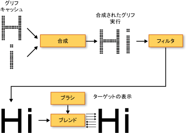

# WPF のタイポグラフィ
ここでは、[!INCLUDE[TLA2#tla_winclient](../../../../includes/tla2sharptla-winclient-md.md)] の主要な文字体裁の機能について説明します。  これらの機能には、テキスト レンダリングの品質とパフォーマンスの向上、[!INCLUDE[TLA#tla_opentype](../../../../includes/tlasharptla-opentype-md.md)] フォントのサポート、各国対応テキストの強化、フォントのサポートの強化、新しいテキスト API \(アプリケーション プログラミング インターフェイス\) が含まれます。  
  
 [!INCLUDE[autoOutline](../Token/autoOutline_md.md)]  
  
   
## テキストの品質およびパフォーマンスの向上  
 [!INCLUDE[TLA2#tla_winclient](../../../../includes/tla2sharptla-winclient-md.md)] のテキストは、テキストのわかりやすさと読みやすさを高める [!INCLUDE[TLA#tla_ct](../../../../includes/tlasharptla-ct-md.md)] を使用して描画されます。  [!INCLUDE[TLA2#tla_ct](../../../../includes/tla2sharptla-ct-md.md)] は、ラップトップや Pocket PC の画面、フラット パネル モニターなど、既存の LCD \(液晶ディスプレイ\) でのテキストの読みやすさを向上させるために [!INCLUDE[TLA#tla_ms](../../../../includes/tlasharptla-ms-md.md)] が開発したソフトウェア テクノロジです。  [!INCLUDE[TLA2#tla_ct](../../../../includes/tla2sharptla-ct-md.md)] は、ピクセルの画素レベルで文字を表示調整することで実際の形状を忠実に再現したテキストを表示できる、サブピクセル レンダリングを採用しています。  解像度が上がるとテキスト表示の微細部のシャープさが向上するため、長時間にわたって読んでも苦になりません。  [!INCLUDE[TLA2#tla_winclient](../../../../includes/tla2sharptla-winclient-md.md)] での [!INCLUDE[TLA2#tla_ct](../../../../includes/tla2sharptla-ct-md.md)] のもう 1 つの改良点は、y 方向のアンチエイリアシングです。これにより、テキスト文字の緩やかな曲線部の上下が滑らかになります。  [!INCLUDE[TLA2#tla_ct](../../../../includes/tla2sharptla-ct-md.md)] の機能の詳細については、「[ClearType の概要](../../../../docs/framework/wpf/advanced/cleartype-overview.md)」を参照してください。  
  
   
ClearType の y 方向アンチエイリアシングを適用したテキスト  
  
 [!INCLUDE[TLA2#tla_winclient](../../../../includes/tla2sharptla-winclient-md.md)] では、コンピューターがハードウェアの最小要件を満たしている限り、テキスト レンダリング パイプライン全体をハードウェアによって加速できます。  ハードウェアを使用して実行できないレンダリングは、ソフトウェア レンダリングとなります。  ハードウェアによる加速は、個々のグリフの格納から始まり、グリフ実行への複数のグリフの合成、効果の適用、最終的な表示出力への [!INCLUDE[TLA2#tla_ct](../../../../includes/tla2sharptla-ct-md.md)] ブレンディング アルゴリズムの適用まで、テキスト レンダリング パイプラインのすべてのフェーズに影響します。  ハードウェアによる加速の詳細については、「[グラフィックスの描画層](../../../../docs/framework/wpf/advanced/graphics-rendering-tiers.md)」を参照してください。  
  
   
パイプ ラインをレンダリングするテキスト図  
  
 また、アニメーション化されたテキストは、文字とグリフのいずれによる場合でも、[!INCLUDE[TLA2#tla_winclient](../../../../includes/tla2sharptla-winclient-md.md)] で有効化されているグラフィックス ハードウェア機能をすべて利用することができます。  これにより、テキスト アニメーションが滑らかになります。  
  
   
## 多彩な文字体裁  
 [!INCLUDE[TLA2#tla_opentype](../../../../includes/tla2sharptla-opentype-md.md)] フォント形式は、[!INCLUDE[TLA#tla_truetype](../../../../includes/tlasharptla-truetype-md.md)] フォント形式の拡張です。  [!INCLUDE[TLA2#tla_opentype](../../../../includes/tla2sharptla-opentype-md.md)] フォント形式は、[!INCLUDE[TLA#tla_ms](../../../../includes/tlasharptla-ms-md.md)] と Adobe が共同で開発したもので、高度な文字体裁機能を豊富に備えています。  <xref:System.Windows.Documents.Typography> オブジェクトは、スタイル上の代替文字や巻きひげ文字など、[!INCLUDE[TLA2#tla_opentype](../../../../includes/tla2sharptla-opentype-md.md)] フォントの高度な機能の多くを公開します。  [!INCLUDE[TLA2#tla_lhsdk](../../../../includes/tla2sharptla-lhsdk-md.md)] には、Pericles フォントや Pescadero フォントなど、豊富な機能を持つ [!INCLUDE[TLA2#tla_opentype](../../../../includes/tla2sharptla-opentype-md.md)] フォント サンプルが用意されています。  詳細については、「[OpenType フォント パックのサンプル](../../../../docs/framework/wpf/advanced/sample-opentype-font-pack.md)」を参照してください。  
  
 Pericles [!INCLUDE[TLA2#tla_opentype](../../../../includes/tla2sharptla-opentype-md.md)] フォントには、標準グリフ セットにスタイル上の代替を提供する追加グリフが含まれています。  次のテキストでは、スタイル上の代替グリフが表示されています。  
  
   
OpenType 代替スタイル グリフを使用するテキスト  
  
 巻きひげは装飾的なグリフで、カリグラフィを連想させることがよくある、手の込んだ装飾が使用されます。  次のテキストは、Pescadero フォントの標準グリフと巻きひげグリフを示したものです。  
  
   
OpenType 標準グリフおよび巻き髭グリフを使用するテキスト  
  
 [!INCLUDE[TLA2#tla_opentype](../../../../includes/tla2sharptla-opentype-md.md)] の機能の詳細については、「[OpenType フォントの機能](../../../../docs/framework/wpf/advanced/opentype-font-features.md)」を参照してください。  
  
   
## 各国対応テキストのサポートの強化  
 [!INCLUDE[TLA2#tla_winclient](../../../../includes/tla2sharptla-winclient-md.md)] では、次の機能を提供することで、各国対応テキストのサポートを強化しています。  
  
-   すべての書記体系における、適用可能な単位を使用した自動行間隔設定。  
  
-   各国対応テキストの幅広いサポート。  詳細については、「[WPF のグローバリゼーション](../../../../docs/framework/wpf/advanced/globalization-for-wpf.md)」を参照してください。  
  
-   言語に合わせた改行、ハイフネーション、および両端揃え。  
  
   
## フォントのサポートの強化  
 [!INCLUDE[TLA2#tla_winclient](../../../../includes/tla2sharptla-winclient-md.md)] では、次の機能を提供することで、フォントのサポートを強化しています。  
  
-   すべてのテキストに対応する Unicode。  フォントの動作や選択に文字セットやコードページが不要になりました。  
  
-   システム ロケールなど、グローバル設定に左右されないフォント動作。  
  
-   <xref:System.Windows.Media.FontFamily> を定義するための個別の <xref:System.Windows.FontWeight>、 <xref:System.Windows.FontStretch>、および <xref:System.Windows.FontStyle> 型。  これにより、斜体および太字のブール値の組み合わせでフォント ファミリを定義する [!INCLUDE[TLA#tla_win32](../../../../includes/tlasharptla-win32-md.md)] プログラミングよりも優れた柔軟性が提供されます。  
  
-   フォント名とは関係なく処理される書き込み方向 \(横書きまたは縦書き\)。  
  
-   複合フォント技術を使用した、移植可能な [!INCLUDE[TLA#tla_xml](../../../../includes/tlasharptla-xml-md.md)] ファイルにおけるフォント リンクとフォントの代替。  複合フォントは、完全な多言語フォントの構築を可能にします。  また、複合フォントは、欠落グリフの表示を防ぐ機能も備えています。  詳細については、<xref:System.Windows.Media.FontFamily> クラスの「解説」を参照してください。  
  
-   単一言語フォントのグループを使用した、複合フォントから構築される各国対応フォント。  これにより、複数言語に対応するフォントの開発時にリソースのコストを節約できます。  
  
-   ドキュメントに埋め込まれ、ドキュメントに移植性を提供する複合フォント。  詳細については、<xref:System.Windows.Media.FontFamily> クラスの「解説」を参照してください。  
  
   
## 新しいテキスト API \(アプリケーション プログラミング インターフェイス\)  
 [!INCLUDE[TLA2#tla_winclient](../../../../includes/tla2sharptla-winclient-md.md)] は、開発者がアプリケーションにテキストを含めるときに使用できるいくつかのテキスト [!INCLUDE[TLA2#tla_api#plural](../../../../includes/tla2sharptla-apisharpplural-md.md)] を提供します。  これらの [!INCLUDE[TLA2#tla_api#plural](../../../../includes/tla2sharptla-apisharpplural-md.md)] は、次の 3 つのカテゴリにグループ化されます。  
  
-   **レイアウトとユーザー インターフェイス** :   [!INCLUDE[TLA#tla_gui](../../../../includes/tlasharptla-gui-md.md)] に対応した一般的なテキスト コントロールです。  
  
-   **軽量テキスト描画** :   オブジェクトにテキストを直接描画することができます。  
  
-   **テキストの高度な書式設定** :   カスタム テキスト エンジンを実装することができます。  
  
### レイアウトとユーザー インターフェイス  
 テキスト [!INCLUDE[TLA2#tla_api#plural](../../../../includes/tla2sharptla-apisharpplural-md.md)] は、最上位の機能レベルにおいて、<xref:System.Windows.Controls.Label>、<xref:System.Windows.Controls.TextBlock>、<xref:System.Windows.Controls.TextBox> などの [!INCLUDE[TLA#tla_ui](../../../../includes/tlasharptla-ui-md.md)] コントロールを提供します。  これらのコントロールは、アプリケーション内に基本的な [!INCLUDE[TLA2#tla_ui](../../../../includes/tla2sharptla-ui-md.md)] 要素を提供し、テキストの表示や操作を簡単に実行できるようにします。  <xref:System.Windows.Controls.RichTextBox> や <xref:System.Windows.Controls.PasswordBox> などのコントロールを使用すると、より高度で特殊なテキスト処理が可能になります。  <xref:System.Windows.Documents.TextRange>、<xref:System.Windows.Documents.TextSelection>、<xref:System.Windows.Documents.TextPointer> などのクラスにより、便利なテキスト操作を実行できます。  これらの [!INCLUDE[TLA2#tla_ui](../../../../includes/tla2sharptla-ui-md.md)] コントロールには、<xref:System.Windows.Controls.Control.FontFamily%2A>、<xref:System.Windows.Controls.Control.FontSize%2A>、<xref:System.Windows.Controls.Control.FontStyle%2A> などのプロパティがあり、テキストの描画に使用するフォントを制御できます。  
  
#### ビットマップ効果、変換、およびテキスト効果の使用  
 [!INCLUDE[TLA2#tla_winclient](../../../../includes/tla2sharptla-winclient-md.md)] では、ビットマップ効果、変換、テキスト効果などの機能を利用して、人の目をひきつけるテキストを作成できます。  テキストに標準タイプのドロップ シャドウ効果を適用した例を次に示します。  
  
   
ドロップ シャドウが適用されたテキスト  
  
 テキストにドロップ シャドウ効果とノイズを適用した例を次に示します。  
  
   
ドロップ シャドウとノイズが適用されたテキスト  
  
 テキストの外縁にグロー効果を適用した例を次に示します。  
  
   
外縁にグロー効果が適用されたテキスト  
  
 テキストにぼかし効果が適用されている例を次に示します。  
  
   
ぼかし効果が適用されたテキスト  
  
 テキストの 2 行目を x 軸に沿って 150% 拡大し、3 行目を y 軸に沿って 150% 拡大した例を次に示します。  
  
   
ScaleTransform を使用したテキスト  
  
 x 軸に沿って傾斜させたテキストの例を次に示します。  
  
   
SkewTransform を使用したテキスト  
  
 <xref:System.Windows.Media.TextEffect> オブジェクトは、テキスト文字列内の 1 つ以上の文字列のグループとしてテキストを処理できるヘルパー オブジェクトです。  次の例は、回転する個々の文字を示しています。  各文字は、1 秒間隔で個別に回転します。  
  
   
回転するテキスト効果アニメーションの例  
  
#### フロー ドキュメントの使用  
 一般的な [!INCLUDE[TLA2#tla_ui](../../../../includes/tla2sharptla-ui-md.md)] コントロールに加えて、[!INCLUDE[TLA2#tla_winclient](../../../../includes/tla2sharptla-winclient-md.md)] には、テキスト表示に使用するレイアウト コントロール \(<xref:System.Windows.Documents.FlowDocument> 要素\) があります。  <xref:System.Windows.Documents.FlowDocument> 要素を <xref:System.Windows.Controls.DocumentViewer> 要素と組み合わせると、さまざまなレイアウト要件を持つ大量のテキストに対応するコントロールを作成できます。  レイアウト コントロールは、<xref:System.Windows.Documents.Typography> オブジェクト、および他の [!INCLUDE[TLA2#tla_ui](../../../../includes/tla2sharptla-ui-md.md)] コントロールのフォント関連プロパティを通じて、高度なタイポグラフィへのアクセスを実現します。  
  
 検索、ナビゲーション、改ページ位置の自動修正、コンテンツ スケーリングをサポートする <xref:System.Windows.Controls.FlowDocumentReader> でホストされているテキスト コンテンツを次の例に示します。  
  
   
FlowDocumentReader でホストされるテキスト  
  
 詳細については、「[WPF のドキュメント](../../../../docs/framework/wpf/advanced/documents-in-wpf.md)」を参照してください。  
  
### 軽量テキスト描画  
 <xref:System.Windows.Media.DrawingContext> オブジェクトの <xref:System.Windows.Media.DrawingContext.DrawText%2A> メソッドを使用すると、テキストを [!INCLUDE[TLA2#tla_winclient](../../../../includes/tla2sharptla-winclient-md.md)] オブジェクトに直接描画できます。  このメソッドを使用するには、<xref:System.Windows.Media.FormattedText> オブジェクトを作成します。  このオブジェクトを使用すると、複数行のテキストを描画できます。このテキストでは、テキスト内の各文字を個々に書式設定できます。  <xref:System.Windows.Media.FormattedText> オブジェクトの機能には、Win32 API の DrawText フラグの多くの機能が含まれています。  また、<xref:System.Windows.Media.FormattedText> オブジェクトには、テキストがその境界を越えたときに省略記号を表示する、省略記号のサポートなどの機能も備えています。  いくつかの書式を適用したテキストを次の例に示します。たとえば、2 番目および 3 番目の単語には線形グラデーションが適用されています。  
  
   
FormattedText オブジェクトを使用して表示したテキスト  
  
 書式設定したテキストを <xref:System.Windows.Media.Geometry> オブジェクトに変換し、人の目をひきつける他の種類のテキストを作成することができます。  たとえば、テキスト文字列のアウトラインに基づいて <xref:System.Windows.Media.Geometry> オブジェクトを作成できます。  
  
   
線形グラデーション ブラシを使用したテキスト アウトライン  
  
 変換されたテキストのストローク、塗りつぶし、および強調表示を変更して、人の目をひく視覚効果を作成するいくつかの方法を次の例に示します。  
  
   
ストロークおよび塗りつぶしを別々の色に設定した例  
  
   
ストロークに適用したイメージ ブラシの例  
  
   
ストロークおよび強調表示に適用したイメージ ブラシの例  
  
 <xref:System.Windows.Media.FormattedText> オブジェクトの詳細については、「[書式設定されたテキストの描画](../../../../docs/framework/wpf/advanced/drawing-formatted-text.md)」を参照してください。  
  
### テキストの高度な書式設定  
 テキスト [!INCLUDE[TLA2#tla_api#plural](../../../../includes/tla2sharptla-apisharpplural-md.md)] の最も高度なレベルとして、[!INCLUDE[TLA2#tla_winclient](../../../../includes/tla2sharptla-winclient-md.md)] には、<xref:System.Windows.Media.TextFormatting.TextFormatter> オブジェクトおよび <xref:System.Windows.Media.TextFormatting> 名前空間のその他の型を使用して、カスタム テキスト レイアウトを作成する機能が用意されています。  <xref:System.Windows.Media.TextFormatting.TextFormatter> および関連クラスを使用して、カスタム テキスト レイアウトを実装し、文字形式、段落スタイル、改行ルール、および各国対応テキストのその他のレイアウト機能を独自に定義することができます。  [!INCLUDE[TLA2#tla_winclient](../../../../includes/tla2sharptla-winclient-md.md)] テキスト レイアウトのサポートの既定の実装をオーバーライドする必要はほとんどありません。  ただし、テキストを編集するコントロールやアプリケーションを作成する場合は、[!INCLUDE[TLA2#tla_winclient](../../../../includes/tla2sharptla-winclient-md.md)] の既定の実装とは異なる実装が必要になることがあります。  
  
 従来のテキスト [!INCLUDE[TLA#tla_api](../../../../includes/tlasharptla-api-md.md)] とは異なり、<xref:System.Windows.Media.TextFormatting.TextFormatter> は一連のコールバック メソッドを使用して、テキスト レイアウト クライアントと対話します。  このテキスト フォーマッタを使用するには、クライアントが <xref:System.Windows.Media.TextFormatting.TextSource> クラスの実装にこれらのメソッドを提供している必要があります。  クライアント アプリケーションと <xref:System.Windows.Media.TextFormatting.TextFormatter> の間のテキスト レイアウトの対話を次の図に示します。  
  
   
アプリケーションと TextFormatter の対話  
  
 カスタム テキス レイアウトの作成の詳細については、「[テキストの高度な書式設定](../../../../docs/framework/wpf/advanced/advanced-text-formatting.md)」を参照してください。  
  
## 参照  
 <xref:System.Windows.Media.FormattedText>   
 <xref:System.Windows.Media.TextFormatting.TextFormatter>   
 [ClearType の概要](../../../../docs/framework/wpf/advanced/cleartype-overview.md)   
 [OpenType フォントの機能](../../../../docs/framework/wpf/advanced/opentype-font-features.md)   
 [書式設定されたテキストの描画](../../../../docs/framework/wpf/advanced/drawing-formatted-text.md)   
 [テキストの高度な書式設定](../../../../docs/framework/wpf/advanced/advanced-text-formatting.md)   
 [テキスト](../../../../docs/framework/wpf/advanced/optimizing-performance-text.md)   
 [Microsoft Typography \(Microsoft Typography\)](http://www.microsoft.com/typography/default.mspx)