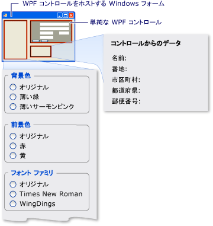

# <a name="walkthrough-hosting-a-wpf-composite-control-in-windows-forms"></a><span data-ttu-id="11d88-102">チュートリアル: Windows フォームでの WPF 複合コントロールのホスト</span><span class="sxs-lookup"><span data-stu-id="11d88-102">Walkthrough: Hosting a WPF Composite Control in Windows Forms</span></span>
[!INCLUDE[TLA#tla_winclient](../../../../includes/tlasharptla-winclient-md.md)]<span data-ttu-id="11d88-103"> は、アプリケーションの作成に適した環境を提供します。</span><span class="sxs-lookup"><span data-stu-id="11d88-103"> provides a rich environment for creating applications.</span></span> <span data-ttu-id="11d88-104">ただしがある場合、かなりの投資[!INCLUDE[TLA#tla_winforms](../../../../includes/tlasharptla-winforms-md.md)]コードをより効果的かを既存の拡張[!INCLUDE[TLA#tla_winforms](../../../../includes/tlasharptla-winforms-md.md)]アプリケーション[!INCLUDE[TLA2#tla_winclient](../../../../includes/tla2sharptla-winclient-md.md)]はなく最初から書き直します。</span><span class="sxs-lookup"><span data-stu-id="11d88-104">However, when you have a substantial investment in [!INCLUDE[TLA#tla_winforms](../../../../includes/tlasharptla-winforms-md.md)] code, it can be more effective to extend your existing [!INCLUDE[TLA#tla_winforms](../../../../includes/tlasharptla-winforms-md.md)] application with [!INCLUDE[TLA2#tla_winclient](../../../../includes/tla2sharptla-winclient-md.md)] rather than to rewrite it from scratch.</span></span> <span data-ttu-id="11d88-105">一般的なシナリオを 1 つを埋め込むまたはで多くのコントロールが実装されているときに、[!INCLUDE[TLA2#tla_winclient](../../../../includes/tla2sharptla-winclient-md.md)]内で、[!INCLUDE[TLA2#tla_winforms](../../../../includes/tla2sharptla-winforms-md.md)]アプリケーションです。</span><span class="sxs-lookup"><span data-stu-id="11d88-105">A common scenario is when you want to embed one or more controls implemented with [!INCLUDE[TLA2#tla_winclient](../../../../includes/tla2sharptla-winclient-md.md)] within your [!INCLUDE[TLA2#tla_winforms](../../../../includes/tla2sharptla-winforms-md.md)] application.</span></span> <span data-ttu-id="11d88-106">WPF コントロールのカスタマイズの詳細については、次を参照してください。[コントロールのカスタマイズ](../../../../docs/framework/wpf/controls/control-customization.md)です。</span><span class="sxs-lookup"><span data-stu-id="11d88-106">For more information about customizing WPF controls, see [Control Customization](../../../../docs/framework/wpf/controls/control-customization.md).</span></span>  
  
 <span data-ttu-id="11d88-107">このチュートリアル手順を説明してアプリケーションをホストする、[!INCLUDE[TLA2#tla_winclient](../../../../includes/tla2sharptla-winclient-md.md)]複合コントロールでのデータ入力を実行する、[!INCLUDE[TLA2#tla_winforms](../../../../includes/tla2sharptla-winforms-md.md)]アプリケーションです。</span><span class="sxs-lookup"><span data-stu-id="11d88-107">This walkthrough steps you through an application that hosts a [!INCLUDE[TLA2#tla_winclient](../../../../includes/tla2sharptla-winclient-md.md)] composite control to perform data-entry in a [!INCLUDE[TLA2#tla_winforms](../../../../includes/tla2sharptla-winforms-md.md)] application.</span></span> <span data-ttu-id="11d88-108">複合コントロールは DLL にパッケージ化されています。</span><span class="sxs-lookup"><span data-stu-id="11d88-108">The composite control is packaged in a DLL.</span></span> <span data-ttu-id="11d88-109">この一般的な手順は、より複雑なアプリケーションやコントロールに拡張することができます。</span><span class="sxs-lookup"><span data-stu-id="11d88-109">This general procedure can be extended to more complex applications and controls.</span></span> <span data-ttu-id="11d88-110">このチュートリアルは、外観と機能をほぼ同一である[チュートリアル: WPF では、Windows フォームの複合コントロールをホストしている](../../../../docs/framework/wpf/advanced/walkthrough-hosting-a-windows-forms-composite-control-in-wpf.md)です。</span><span class="sxs-lookup"><span data-stu-id="11d88-110">This walkthrough is designed to be nearly identical in appearance and functionality to [Walkthrough: Hosting a Windows Forms Composite Control in WPF](../../../../docs/framework/wpf/advanced/walkthrough-hosting-a-windows-forms-composite-control-in-wpf.md).</span></span> <span data-ttu-id="11d88-111">主な違いは、ホストする側とされる側が逆であることです。</span><span class="sxs-lookup"><span data-stu-id="11d88-111">The primary difference is that the hosting scenario is reversed.</span></span>  
  
 <span data-ttu-id="11d88-112">このチュートリアルは、2 つのセクションに分かれています。</span><span class="sxs-lookup"><span data-stu-id="11d88-112">The walkthrough is divided into two sections.</span></span> <span data-ttu-id="11d88-113">最初のセクションの実装をについて簡単に説明する、[!INCLUDE[TLA2#tla_winclient](../../../../includes/tla2sharptla-winclient-md.md)]複合コントロール。</span><span class="sxs-lookup"><span data-stu-id="11d88-113">The first section briefly describes the implementation of the [!INCLUDE[TLA2#tla_winclient](../../../../includes/tla2sharptla-winclient-md.md)] composite control.</span></span> <span data-ttu-id="11d88-114">2 番目のセクションで詳しく複合コントロールをホストする方法について説明します、[!INCLUDE[TLA2#tla_winforms](../../../../includes/tla2sharptla-winforms-md.md)]アプリケーション、コントロールからイベントを受け取るし、コントロールのプロパティの一部にアクセスします。</span><span class="sxs-lookup"><span data-stu-id="11d88-114">The second section discusses in detail how to host the composite control in a [!INCLUDE[TLA2#tla_winforms](../../../../includes/tla2sharptla-winforms-md.md)] application, receive events from the control, and access some of the control’s properties.</span></span>  
  
 <span data-ttu-id="11d88-115">このチュートリアルでは、以下のタスクを行います。</span><span class="sxs-lookup"><span data-stu-id="11d88-115">Tasks illustrated in this walkthrough include:</span></span>  
  
-   <span data-ttu-id="11d88-116">WPF 複合コントロールを実装する。</span><span class="sxs-lookup"><span data-stu-id="11d88-116">Implementing the WPF composite control.</span></span>  
  
-   <span data-ttu-id="11d88-117">Windows フォーム ホスト アプリケーションを実装する。</span><span class="sxs-lookup"><span data-stu-id="11d88-117">Implementing the Windows Forms host application.</span></span>  
  
 <span data-ttu-id="11d88-118">このチュートリアルでタスクの完全なコードについては、次を参照してください。 [Windows フォームのサンプルでの WPF 複合コントロールをホストしている](http://go.microsoft.com/fwlink/?LinkID=159996)です。</span><span class="sxs-lookup"><span data-stu-id="11d88-118">For a complete code listing of the tasks illustrated in this walkthrough, see [Hosting a WPF Composite Control in Windows Forms Sample](http://go.microsoft.com/fwlink/?LinkID=159996).</span></span>  
  
## <a name="prerequisites"></a><span data-ttu-id="11d88-119">必須コンポーネント</span><span class="sxs-lookup"><span data-stu-id="11d88-119">Prerequisites</span></span>  
 <span data-ttu-id="11d88-120">このチュートリアルを実行するには、次のコンポーネントが必要です。</span><span class="sxs-lookup"><span data-stu-id="11d88-120">You need the following components to complete this walkthrough:</span></span>  
  
-   [!INCLUDE[vs_dev10_long](../../../../includes/vs-dev10-long-md.md)]<span data-ttu-id="11d88-121">。</span><span class="sxs-lookup"><span data-stu-id="11d88-121">.</span></span>  
  
## <a name="implementing-the-wpf-composite-control"></a><span data-ttu-id="11d88-122">WPF 複合コントロールの実装</span><span class="sxs-lookup"><span data-stu-id="11d88-122">Implementing the WPF Composite Control</span></span>  
 <span data-ttu-id="11d88-123">[!INCLUDE[TLA2#tla_winclient](../../../../includes/tla2sharptla-winclient-md.md)]この例で使用される複合コントロールは、ユーザーの名前とアドレスを受け取る単純なデータ エントリ フォーム。</span><span class="sxs-lookup"><span data-stu-id="11d88-123">The [!INCLUDE[TLA2#tla_winclient](../../../../includes/tla2sharptla-winclient-md.md)] composite control used in this example is a simple data-entry form that takes the user's name and address.</span></span> <span data-ttu-id="11d88-124">ユーザーが 2 つのボタンのいずれかをクリックして入力操作が終了したことを示すと、コントロールはカスタム イベントを発生させて入力情報をホストに返します。</span><span class="sxs-lookup"><span data-stu-id="11d88-124">When the user clicks one of two buttons to indicate that the task is finished, the control raises a custom event to return that information to the host.</span></span> <span data-ttu-id="11d88-125">次の図はレンダリングされたコントロールを示しています。</span><span class="sxs-lookup"><span data-stu-id="11d88-125">The following illustration shows the rendered control.</span></span>  
  
 <span data-ttu-id="11d88-126"></span><span class="sxs-lookup"><span data-stu-id="11d88-126"></span></span>  
<span data-ttu-id="11d88-127">WPF 複合コントロール</span><span class="sxs-lookup"><span data-stu-id="11d88-127">WPF composite control</span></span>  
  
### <a name="creating-the-project"></a><span data-ttu-id="11d88-128">プロジェクトの作成</span><span class="sxs-lookup"><span data-stu-id="11d88-128">Creating the Project</span></span>  
 <span data-ttu-id="11d88-129">プロジェクトを開始するには</span><span class="sxs-lookup"><span data-stu-id="11d88-129">To start the project:</span></span>  
  
1.  <span data-ttu-id="11d88-130">起動[!INCLUDE[TLA#tla_visualstu](../../../../includes/tlasharptla-visualstu-md.md)]、開き、**新しいプロジェクト** ダイアログ ボックス。</span><span class="sxs-lookup"><span data-stu-id="11d88-130">Launch [!INCLUDE[TLA#tla_visualstu](../../../../includes/tlasharptla-visualstu-md.md)], and open the **New Project** dialog box.</span></span>  
  
2.  <span data-ttu-id="11d88-131">Visual C# の場合、Windows のカテゴリで、選択、 **WPF ユーザー コントロール ライブラリ**テンプレート。</span><span class="sxs-lookup"><span data-stu-id="11d88-131">In Visual C# and the Windows category, select the **WPF User Control Library** template.</span></span>  
  
3.  <span data-ttu-id="11d88-132">新しいプロジェクトに `MyControls` という名前を付けます。</span><span class="sxs-lookup"><span data-stu-id="11d88-132">Name the new project `MyControls`.</span></span>  
  
4.  <span data-ttu-id="11d88-133">場所についてを指定して、簡単に名前付きのトップレベルのフォルダーなど`WindowsFormsHostingWpfControl`です。</span><span class="sxs-lookup"><span data-stu-id="11d88-133">For the location, specify a conveniently named top-level folder, such as `WindowsFormsHostingWpfControl`.</span></span> <span data-ttu-id="11d88-134">このフォルダーには後でホスト アプリケーションも配置します。</span><span class="sxs-lookup"><span data-stu-id="11d88-134">Later, you will put the host application in this folder.</span></span>  
  
5.  <span data-ttu-id="11d88-135">をクリックして**OK**プロジェクトを作成します。</span><span class="sxs-lookup"><span data-stu-id="11d88-135">Click **OK** to create the project.</span></span> <span data-ttu-id="11d88-136">既定のプロジェクトには、という名前の 1 つのコントロールが含まれています。`UserControl1`です。</span><span class="sxs-lookup"><span data-stu-id="11d88-136">The default project contains a single control named `UserControl1`.</span></span>  
  
6.  <span data-ttu-id="11d88-137">ソリューション エクスプ ローラーで、名前を変更`UserControl1`に`MyControl1`です。</span><span class="sxs-lookup"><span data-stu-id="11d88-137">In Solution Explorer, rename `UserControl1` to `MyControl1`.</span></span>  
  
 <span data-ttu-id="11d88-138">プロジェクトは、以下のシステム DLL を参照している必要があります。</span><span class="sxs-lookup"><span data-stu-id="11d88-138">Your project should have references to the following system DLLs.</span></span> <span data-ttu-id="11d88-139">これらの DLL のいずれかが既定で含まれていない場合は、プロジェクトに追加します。</span><span class="sxs-lookup"><span data-stu-id="11d88-139">If any of these DLLs are not included by default, add them to your project.</span></span>  
  
-   <span data-ttu-id="11d88-140">PresentationCore</span><span class="sxs-lookup"><span data-stu-id="11d88-140">PresentationCore</span></span>  
  
-   <span data-ttu-id="11d88-141">PresentationFramework</span><span class="sxs-lookup"><span data-stu-id="11d88-141">PresentationFramework</span></span>  
  
-   <span data-ttu-id="11d88-142">システム</span><span class="sxs-lookup"><span data-stu-id="11d88-142">System</span></span>  
  
-   <span data-ttu-id="11d88-143">WindowsBase</span><span class="sxs-lookup"><span data-stu-id="11d88-143">WindowsBase</span></span>  
  
### <a name="creating-the-user-interface"></a><span data-ttu-id="11d88-144">ユーザー インターフェイスの作成</span><span class="sxs-lookup"><span data-stu-id="11d88-144">Creating the User Interface</span></span>  
 <span data-ttu-id="11d88-145">[!INCLUDE[TLA#tla_ui](../../../../includes/tlasharptla-ui-md.md)]で複合コントロールを実装[!INCLUDE[TLA#tla_xaml](../../../../includes/tlasharptla-xaml-md.md)]です。</span><span class="sxs-lookup"><span data-stu-id="11d88-145">The [!INCLUDE[TLA#tla_ui](../../../../includes/tlasharptla-ui-md.md)] for the composite control is implemented with [!INCLUDE[TLA#tla_xaml](../../../../includes/tlasharptla-xaml-md.md)].</span></span> <span data-ttu-id="11d88-146">複合コントロール[!INCLUDE[TLA2#tla_ui](../../../../includes/tla2sharptla-ui-md.md)]5 から成る<xref:System.Windows.Controls.TextBox>要素。</span><span class="sxs-lookup"><span data-stu-id="11d88-146">The composite control [!INCLUDE[TLA2#tla_ui](../../../../includes/tla2sharptla-ui-md.md)] consists of five <xref:System.Windows.Controls.TextBox> elements.</span></span> <span data-ttu-id="11d88-147">各<xref:System.Windows.Controls.TextBox>要素に関連付けられている<xref:System.Windows.Controls.TextBlock>をラベルとして機能する要素。</span><span class="sxs-lookup"><span data-stu-id="11d88-147">Each <xref:System.Windows.Controls.TextBox> element has an associated <xref:System.Windows.Controls.TextBlock> element that serves as a label.</span></span> <span data-ttu-id="11d88-148">2 つ<xref:System.Windows.Controls.Button>下部にある要素**OK**と**キャンセル**です。</span><span class="sxs-lookup"><span data-stu-id="11d88-148">There are two <xref:System.Windows.Controls.Button> elements at the bottom, **OK** and **Cancel**.</span></span> <span data-ttu-id="11d88-149">ユーザーがいずれかのボタンをクリックすると、コントロールは情報をホストに返すカスタム イベントを発生させます。</span><span class="sxs-lookup"><span data-stu-id="11d88-149">When the user clicks either button, the control raises a custom event to return the information to the host.</span></span>  
  
#### <a name="basic-layout"></a><span data-ttu-id="11d88-150">基本的なレイアウト</span><span class="sxs-lookup"><span data-stu-id="11d88-150">Basic Layout</span></span>  
 <span data-ttu-id="11d88-151">さまざまな[!INCLUDE[TLA2#tla_ui](../../../../includes/tla2sharptla-ui-md.md)]に要素が含まれている、<xref:System.Windows.Controls.Grid>要素。</span><span class="sxs-lookup"><span data-stu-id="11d88-151">The various [!INCLUDE[TLA2#tla_ui](../../../../includes/tla2sharptla-ui-md.md)] elements are contained in a <xref:System.Windows.Controls.Grid> element.</span></span> <span data-ttu-id="11d88-152">使用することができます<xref:System.Windows.Controls.Grid>複合の内容が同じにコントロールを配置する方法が使用する、 `Table` HTML 内の要素。</span><span class="sxs-lookup"><span data-stu-id="11d88-152">You can use <xref:System.Windows.Controls.Grid> to arrange the contents of the composite control in much the same way you would use a `Table` element in HTML.</span></span> [!INCLUDE[TLA2#tla_winclient](../../../../includes/tla2sharptla-winclient-md.md)]<span data-ttu-id="11d88-153"><xref:System.Windows.Documents.Table>要素が、<xref:System.Windows.Controls.Grid>がより軽量で単純なレイアウトのタスクに適してします。</span><span class="sxs-lookup"><span data-stu-id="11d88-153"> also has a <xref:System.Windows.Documents.Table> element, but <xref:System.Windows.Controls.Grid> is more lightweight and better suited for simple layout tasks.</span></span>  
  
 <span data-ttu-id="11d88-154">次の XAML に基本的なレイアウトを示します。</span><span class="sxs-lookup"><span data-stu-id="11d88-154">The following XAML shows the basic layout.</span></span> <span data-ttu-id="11d88-155">この XAML は、列の数を指定することによってコントロールの全体的な構造を定義し、内の行、<xref:System.Windows.Controls.Grid>要素。</span><span class="sxs-lookup"><span data-stu-id="11d88-155">This XAML defines the overall structure of the control by specifying the number of columns and rows in the <xref:System.Windows.Controls.Grid> element.</span></span>  
  
 <span data-ttu-id="11d88-156">MyControl1.xaml で、で、既存の XAML を次の XAML で置き換えます。</span><span class="sxs-lookup"><span data-stu-id="11d88-156">In MyControl1.xaml, replace the existing XAML with the following XAML.</span></span>  
  
 [!code-xaml[WindowsFormsHostingWpfControl#101](../../../../samples/snippets/csharp/VS_Snippets_Wpf/WindowsFormsHostingWpfControl/CSharp/MyControls/Page1.xaml#101)]  
[!code-xaml[WindowsFormsHostingWpfControl#102](../../../../samples/snippets/csharp/VS_Snippets_Wpf/WindowsFormsHostingWpfControl/CSharp/MyControls/Page1.xaml#102)]  
  
#### <a name="adding-textblock-and-textbox-elements-to-the-grid"></a><span data-ttu-id="11d88-157">TextBlock および TextBox 要素のグリッドへの追加</span><span class="sxs-lookup"><span data-stu-id="11d88-157">Adding TextBlock and TextBox Elements to the Grid</span></span>  
 <span data-ttu-id="11d88-158">配置する、[!INCLUDE[TLA2#tla_ui](../../../../includes/tla2sharptla-ui-md.md)]要素の設定によって、グリッド内の要素<xref:System.Windows.Controls.Grid.RowProperty>と<xref:System.Windows.Controls.Grid.ColumnProperty>属性を適切な行と列の数。</span><span class="sxs-lookup"><span data-stu-id="11d88-158">You place a [!INCLUDE[TLA2#tla_ui](../../../../includes/tla2sharptla-ui-md.md)] element in the grid by setting the element's <xref:System.Windows.Controls.Grid.RowProperty> and <xref:System.Windows.Controls.Grid.ColumnProperty> attributes to the appropriate row and column number.</span></span> <span data-ttu-id="11d88-159">行と列の番号付けは 0 から始まることに注意してください。</span><span class="sxs-lookup"><span data-stu-id="11d88-159">Remember that row and column numbering are zero-based.</span></span> <span data-ttu-id="11d88-160">要素を設定して複数の列にまたがることができます、<xref:System.Windows.Controls.Grid.ColumnSpanProperty>属性。</span><span class="sxs-lookup"><span data-stu-id="11d88-160">You can have an element span multiple columns by setting its <xref:System.Windows.Controls.Grid.ColumnSpanProperty> attribute.</span></span> <span data-ttu-id="11d88-161">詳細については<xref:System.Windows.Controls.Grid>要素を参照してください[グリッド要素を作成する](../../../../docs/framework/wpf/controls/how-to-create-a-grid-element.md)です。</span><span class="sxs-lookup"><span data-stu-id="11d88-161">For more information about <xref:System.Windows.Controls.Grid> elements, see [Create a Grid Element](../../../../docs/framework/wpf/controls/how-to-create-a-grid-element.md).</span></span>  
  
 <span data-ttu-id="11d88-162">次の XAML 示します複合コントロールの<xref:System.Windows.Controls.TextBox>と<xref:System.Windows.Controls.TextBlock>を持つ要素の<xref:System.Windows.Controls.Grid.RowProperty>と<xref:System.Windows.Controls.Grid.ColumnProperty>属性で、グリッド内の要素を正しく配置に設定されます。</span><span class="sxs-lookup"><span data-stu-id="11d88-162">The following XAML shows the composite control’s <xref:System.Windows.Controls.TextBox> and <xref:System.Windows.Controls.TextBlock> elements with their <xref:System.Windows.Controls.Grid.RowProperty> and <xref:System.Windows.Controls.Grid.ColumnProperty> attributes, which are set to place the elements properly in the grid.</span></span>  
  
 <span data-ttu-id="11d88-163">MyControl1.xaml で内で次の XAML を追加、<xref:System.Windows.Controls.Grid>要素。</span><span class="sxs-lookup"><span data-stu-id="11d88-163">In MyControl1.xaml, add the following XAML within the <xref:System.Windows.Controls.Grid> element.</span></span>  
  
 [!code-xaml[WindowsFormsHostingWpfControl#103](../../../../samples/snippets/csharp/VS_Snippets_Wpf/WindowsFormsHostingWpfControl/CSharp/MyControls/Page1.xaml#103)]  
  
#### <a name="styling-the-ui-elements"></a><span data-ttu-id="11d88-164">UI 要素のスタイル設定</span><span class="sxs-lookup"><span data-stu-id="11d88-164">Styling the UI Elements</span></span>  
 <span data-ttu-id="11d88-165">データ入力フォームの多くの要素は外観が似ていますが、それは、そのいくつかのプロパティの設定が同一であることを意味しています。</span><span class="sxs-lookup"><span data-stu-id="11d88-165">Many of the elements on the data-entry form have a similar appearance, which means that they have identical settings for several of their properties.</span></span> <span data-ttu-id="11d88-166">以前の XAML を使用して各要素の属性を個別に設定するのではなく<xref:System.Windows.Style>要素のクラスの標準的なプロパティ設定を定義する要素。</span><span class="sxs-lookup"><span data-stu-id="11d88-166">Rather than setting each element's attributes separately, the previous XAML uses <xref:System.Windows.Style> elements to define standard property settings for classes of elements.</span></span> <span data-ttu-id="11d88-167">この方法だと、コントロールの複雑さが軽減され、1 つのスタイル属性を使用して複数要素の外観を変更することができます。</span><span class="sxs-lookup"><span data-stu-id="11d88-167">This approach reduces the complexity of the control and enables you to change the appearance of multiple elements through a single style attribute.</span></span>  
  
 <span data-ttu-id="11d88-168"><xref:System.Windows.Style>に要素が含まれている、<xref:System.Windows.Controls.Grid>要素の<xref:System.Windows.FrameworkElement.Resources%2A>プロパティ、コントロール内のすべての要素によって使用できるようにします。</span><span class="sxs-lookup"><span data-stu-id="11d88-168">The <xref:System.Windows.Style> elements are contained in the <xref:System.Windows.Controls.Grid> element's <xref:System.Windows.FrameworkElement.Resources%2A> property, so they can be used by all elements in the control.</span></span> <span data-ttu-id="11d88-169">スタイルの名前が場合に、適用する要素を追加して、<xref:System.Windows.Style>要素スタイルの名前に設定します。</span><span class="sxs-lookup"><span data-stu-id="11d88-169">If a style is named, you apply it to an element by adding a <xref:System.Windows.Style> element set to the style's name.</span></span> <span data-ttu-id="11d88-170">名前が付いていないスタイルは、その要素の既定のスタイルになります。</span><span class="sxs-lookup"><span data-stu-id="11d88-170">Styles that are not named become the default style for the element.</span></span> <span data-ttu-id="11d88-171">詳細については[!INCLUDE[TLA2#tla_winclient](../../../../includes/tla2sharptla-winclient-md.md)]スタイルを参照してください[スタイルとテンプレート](../../../../docs/framework/wpf/controls/styling-and-templating.md)です。</span><span class="sxs-lookup"><span data-stu-id="11d88-171">For more information about [!INCLUDE[TLA2#tla_winclient](../../../../includes/tla2sharptla-winclient-md.md)] styles, see [Styling and Templating](../../../../docs/framework/wpf/controls/styling-and-templating.md).</span></span>  
  
 <span data-ttu-id="11d88-172">次の XAML 示します、<xref:System.Windows.Style>複合コントロールの要素。</span><span class="sxs-lookup"><span data-stu-id="11d88-172">The following XAML shows the <xref:System.Windows.Style> elements for the composite control.</span></span> <span data-ttu-id="11d88-173">スタイルがどのように要素に適用されるかについては、前の XAML を参照してください。</span><span class="sxs-lookup"><span data-stu-id="11d88-173">To see how the styles are applied to elements, see the previous XAML.</span></span> <span data-ttu-id="11d88-174">最後の例では、<xref:System.Windows.Controls.TextBlock>要素には、`inlineText`スタイル、および最後<xref:System.Windows.Controls.TextBox>要素が既定のスタイルを使用します。</span><span class="sxs-lookup"><span data-stu-id="11d88-174">For example, the last <xref:System.Windows.Controls.TextBlock> element has the `inlineText` style, and the last <xref:System.Windows.Controls.TextBox> element uses the default style.</span></span>  
  
 <span data-ttu-id="11d88-175">MyControl1.xaml で次の XAML を追加した直後、<xref:System.Windows.Controls.Grid>要素を開始します。</span><span class="sxs-lookup"><span data-stu-id="11d88-175">In MyControl1.xaml, add the following XAML just after the <xref:System.Windows.Controls.Grid> start element.</span></span>  
  
 [!code-xaml[WindowsFormsHostingWpfControl#104](../../../../samples/snippets/csharp/VS_Snippets_Wpf/WindowsFormsHostingWpfControl/CSharp/MyControls/Page1.xaml#104)]  
  
#### <a name="adding-the-ok-and-cancel-buttons"></a><span data-ttu-id="11d88-176">[OK] ボタンと [キャンセル] ボタンの追加</span><span class="sxs-lookup"><span data-stu-id="11d88-176">Adding the OK and Cancel Buttons</span></span>  
 <span data-ttu-id="11d88-177">複合コントロールの最後の要素が、 **OK**と**キャンセル**<xref:System.Windows.Controls.Button>の最後の行の最初の 2 つの列位置を埋めるための要素、<xref:System.Windows.Controls.Grid>です。</span><span class="sxs-lookup"><span data-stu-id="11d88-177">The final elements on the composite control are the **OK** and **Cancel**<xref:System.Windows.Controls.Button> elements, which occupy the first two columns of the last row of the <xref:System.Windows.Controls.Grid>.</span></span> <span data-ttu-id="11d88-178">これらの要素が共通のイベント ハンドラーを使用して`ButtonClicked`と既定<xref:System.Windows.Controls.Button>以前の XAML で定義されたスタイルです。</span><span class="sxs-lookup"><span data-stu-id="11d88-178">These elements use a common event handler, `ButtonClicked`, and the default <xref:System.Windows.Controls.Button> style defined in the previous XAML.</span></span>  
  
 <span data-ttu-id="11d88-179">MyControl1.xaml、最後の後に次の XAML を追加<xref:System.Windows.Controls.TextBox>要素。</span><span class="sxs-lookup"><span data-stu-id="11d88-179">In MyControl1.xaml, add the following XAML after the last <xref:System.Windows.Controls.TextBox> element.</span></span> <span data-ttu-id="11d88-180">[!INCLUDE[TLA2#tla_xaml](../../../../includes/tla2sharptla-xaml-md.md)]複合コントロールの一部が完成しました。</span><span class="sxs-lookup"><span data-stu-id="11d88-180">The [!INCLUDE[TLA2#tla_xaml](../../../../includes/tla2sharptla-xaml-md.md)] part of the composite control is now complete.</span></span>  
  
 [!code-xaml[WindowsFormsHostingWpfControl#105](../../../../samples/snippets/csharp/VS_Snippets_Wpf/WindowsFormsHostingWpfControl/CSharp/MyControls/Page1.xaml#105)]  
  
### <a name="implementing-the-code-behind-file"></a><span data-ttu-id="11d88-181">分離コード ファイルの実装</span><span class="sxs-lookup"><span data-stu-id="11d88-181">Implementing the Code-Behind File</span></span>  
 <span data-ttu-id="11d88-182">分離コード ファイル、MyControl1.xaml.cs には、次の 3 つの基本的なタスクを実装します。</span><span class="sxs-lookup"><span data-stu-id="11d88-182">The code-behind file, MyControl1.xaml.cs, implements three essential tasks:</span></span>
  
1.  <span data-ttu-id="11d88-183">ユーザーがいずれかのボタンをクリックしたときに発生するイベントを処理します。</span><span class="sxs-lookup"><span data-stu-id="11d88-183">Handles the event that occurs when the user clicks one of the buttons.</span></span>  
  
2.  <span data-ttu-id="11d88-184">データを取得、<xref:System.Windows.Controls.TextBox>要素、およびカスタム イベントの引数オブジェクトにパッケージします。</span><span class="sxs-lookup"><span data-stu-id="11d88-184">Retrieves the data from the <xref:System.Windows.Controls.TextBox> elements, and packages it in a custom event argument object.</span></span>  
  
3.  <span data-ttu-id="11d88-185">カスタムを発生させます`OnButtonClick`と、ユーザーが完成したデータをホストに渡すことをホストに通知するイベントです。</span><span class="sxs-lookup"><span data-stu-id="11d88-185">Raises the custom `OnButtonClick` event, which notifies the host that the user is finished and passes the data back to the host.</span></span>  
  
 <span data-ttu-id="11d88-186">コントロールは、外観を変更するための色とフォントの多くのプロパティも公開します。</span><span class="sxs-lookup"><span data-stu-id="11d88-186">The control also exposes a number of color and font properties that enable you to change the appearance.</span></span> <span data-ttu-id="11d88-187">異なり、<xref:System.Windows.Forms.Integration.WindowsFormsHost>使用されるクラスをホストに、[!INCLUDE[TLA2#tla_winforms](../../../../includes/tla2sharptla-winforms-md.md)]コントロール、<xref:System.Windows.Forms.Integration.ElementHost>クラスは、コントロールの公開<xref:System.Windows.Controls.Panel.Background%2A>プロパティのみです。</span><span class="sxs-lookup"><span data-stu-id="11d88-187">Unlike the <xref:System.Windows.Forms.Integration.WindowsFormsHost> class, which is used to host a [!INCLUDE[TLA2#tla_winforms](../../../../includes/tla2sharptla-winforms-md.md)] control, the <xref:System.Windows.Forms.Integration.ElementHost> class exposes the control’s <xref:System.Windows.Controls.Panel.Background%2A> property only.</span></span> <span data-ttu-id="11d88-188">このコード例でしで説明した例間の類似性を維持するために[チュートリアル: WPF では、Windows フォームの複合コントロールをホストしている](../../../../docs/framework/wpf/advanced/walkthrough-hosting-a-windows-forms-composite-control-in-wpf.md)コントロールが直接、残りのプロパティを公開します。</span><span class="sxs-lookup"><span data-stu-id="11d88-188">To maintain the similarity between this code example and the example discussed in [Walkthrough: Hosting a Windows Forms Composite Control in WPF](../../../../docs/framework/wpf/advanced/walkthrough-hosting-a-windows-forms-composite-control-in-wpf.md), the control exposes the remaining properties directly.</span></span>  
  
#### <a name="the-basic-structure-of-the-code-behind-file"></a><span data-ttu-id="11d88-189">分離コード ファイルの基本構造</span><span class="sxs-lookup"><span data-stu-id="11d88-189">The Basic Structure of the Code-Behind File</span></span>  
 <span data-ttu-id="11d88-190">分離コード ファイルには、単一の名前空間の`MyControls`、2 つのクラスを含む`MyControl1`と`MyControlEventArgs`です。</span><span class="sxs-lookup"><span data-stu-id="11d88-190">The code-behind file consists of a single namespace, `MyControls`, which will contain two classes, `MyControl1` and `MyControlEventArgs`.</span></span>  
  
```  
namespace MyControls  
{  
  public partial class MyControl1 : Grid  
  {  
    //...  
  }  
  public class MyControlEventArgs : EventArgs  
  {  
    //...  
  }  
}  
```  
  
 <span data-ttu-id="11d88-191">最初のクラスでは、 `MyControl1`、部分クラスの機能を実装するコードを含む、 [!INCLUDE[TLA2#tla_ui](../../../../includes/tla2sharptla-ui-md.md)] MyControl1.xaml で定義されています。</span><span class="sxs-lookup"><span data-stu-id="11d88-191">The first class, `MyControl1`, is a partial class containing the code that implements the functionality of the [!INCLUDE[TLA2#tla_ui](../../../../includes/tla2sharptla-ui-md.md)] defined in MyControl1.xaml.</span></span> <span data-ttu-id="11d88-192">MyControl1.xaml が解析される際に、[!INCLUDE[TLA2#tla_xaml](../../../../includes/tla2sharptla-xaml-md.md)]は、同じ部分クラスに変換し、コンパイルされたコントロールをフォームに 2 つの部分クラスがマージされます。</span><span class="sxs-lookup"><span data-stu-id="11d88-192">When MyControl1.xaml is parsed, the [!INCLUDE[TLA2#tla_xaml](../../../../includes/tla2sharptla-xaml-md.md)] is converted to the same partial class, and the two partial classes are merged to form the compiled control.</span></span> <span data-ttu-id="11d88-193">このため、分離コード ファイル内のクラス名は MyControl1.xaml に割り当てられたクラス名と一致する必要があり、コントロールのルート要素から継承する必要があります。</span><span class="sxs-lookup"><span data-stu-id="11d88-193">For this reason, the class name in the code-behind file must match the class name assigned to MyControl1.xaml, and it must inherit from the root element of the control.</span></span> <span data-ttu-id="11d88-194">2 番目のクラス、`MyControlEventArgs`ホストへのデータの送信に使用されるイベント引数クラスです。</span><span class="sxs-lookup"><span data-stu-id="11d88-194">The second class, `MyControlEventArgs`, is an event arguments class that is used to send the data back to the host.</span></span>  
  
 <span data-ttu-id="11d88-195">MyControl1.xaml.cs を開きます。</span><span class="sxs-lookup"><span data-stu-id="11d88-195">Open MyControl1.xaml.cs.</span></span> <span data-ttu-id="11d88-196">既存のクラス宣言を変更して、次の名前を持ちから継承できるように<xref:System.Windows.Controls.Grid>です。</span><span class="sxs-lookup"><span data-stu-id="11d88-196">Change the existing class declaration so that it has the following name and inherits from <xref:System.Windows.Controls.Grid>.</span></span>  
  
 [!code-csharp[WindowsFormsHostingWpfControl#21](../../../../samples/snippets/csharp/VS_Snippets_Wpf/WindowsFormsHostingWpfControl/CSharp/MyControls/Page1.xaml.cs#21)]  
  
#### <a name="initializing-the-control"></a><span data-ttu-id="11d88-197">コントロールの初期化</span><span class="sxs-lookup"><span data-stu-id="11d88-197">Initializing the Control</span></span>  
 <span data-ttu-id="11d88-198">このコードでは、次の基本タスクを実装します。</span><span class="sxs-lookup"><span data-stu-id="11d88-198">The following code implements several basic tasks:</span></span>  
  
-   <span data-ttu-id="11d88-199">プライベートのイベントを宣言`OnButtonClick`、およびその関連するデリゲート`MyControlEventHandler`です。</span><span class="sxs-lookup"><span data-stu-id="11d88-199">Declares a private event, `OnButtonClick`, and its associated delegate, `MyControlEventHandler`.</span></span>  
  
-   <span data-ttu-id="11d88-200">ユーザーのデータを格納するいくつかのプライベート グローバル変数を作成します。</span><span class="sxs-lookup"><span data-stu-id="11d88-200">Creates several private global variables that store the user's data.</span></span> <span data-ttu-id="11d88-201">このデータは、対応するプロパティを通じて公開されます。</span><span class="sxs-lookup"><span data-stu-id="11d88-201">This data is exposed through corresponding properties.</span></span>  
  
-   <span data-ttu-id="11d88-202">ハンドラーを実装して`Init`、コントロールの<xref:System.Windows.FrameworkElement.Loaded>イベント。</span><span class="sxs-lookup"><span data-stu-id="11d88-202">Implements a handler, `Init`, for the control’s <xref:System.Windows.FrameworkElement.Loaded> event.</span></span> <span data-ttu-id="11d88-203">このハンドラーは、MyControl1.xaml で定義された値をグローバル変数に割り当てることで、グローバル変数を初期化します。</span><span class="sxs-lookup"><span data-stu-id="11d88-203">This handler initializes the global variables by assigning them the values defined in MyControl1.xaml.</span></span> <span data-ttu-id="11d88-204">これを行うには、使用して、 <xref:System.Windows.FrameworkElement.Name%2A> 、標準的な割り当て<xref:System.Windows.Controls.TextBlock>要素、 `nameLabel`、その要素のプロパティの設定にアクセスします。</span><span class="sxs-lookup"><span data-stu-id="11d88-204">To do this, it uses the <xref:System.Windows.FrameworkElement.Name%2A> assigned to a typical <xref:System.Windows.Controls.TextBlock> element, `nameLabel`, to access that element's property settings.</span></span>  
  
 <span data-ttu-id="11d88-205">既存のコンス トラクターを削除し、次のコードを追加、`MyControl1`クラスです。</span><span class="sxs-lookup"><span data-stu-id="11d88-205">Delete the existing constructor and add the following code to your `MyControl1` class.</span></span>  
  
 [!code-csharp[WindowsFormsHostingWpfControl#11](../../../../samples/snippets/csharp/VS_Snippets_Wpf/WindowsFormsHostingWpfControl/CSharp/MyControls/Page1.xaml.cs#11)]  
  
#### <a name="handling-the-buttons-click-events"></a><span data-ttu-id="11d88-206">ボタンのクリック イベントの処理</span><span class="sxs-lookup"><span data-stu-id="11d88-206">Handling the Buttons' Click Events</span></span>  
 <span data-ttu-id="11d88-207">ユーザーは、いずれかをクリックして、データ エントリのタスクが完了したことを示します、 **[ok]**ボタンまたは**キャンセル**ボタンをクリックします。</span><span class="sxs-lookup"><span data-stu-id="11d88-207">The user indicates that the data-entry task is finished by clicking either the **OK** button or the **Cancel** button.</span></span> <span data-ttu-id="11d88-208">両方のボタンを使用して同じ<xref:System.Windows.Controls.Primitives.ButtonBase.Click>イベント ハンドラー、`ButtonClicked`です。</span><span class="sxs-lookup"><span data-stu-id="11d88-208">Both buttons use the same <xref:System.Windows.Controls.Primitives.ButtonBase.Click> event handler, `ButtonClicked`.</span></span> <span data-ttu-id="11d88-209">両方のボタンの名前を付ける`btnOK`または`btnCancel`の値を確認するにはクリックしてされたボタンを決定するハンドラーを有効にする、`sender`引数。</span><span class="sxs-lookup"><span data-stu-id="11d88-209">Both buttons have a name, `btnOK` or `btnCancel`, that enables the handler to determine which button was clicked by examining the value of the `sender` argument.</span></span> <span data-ttu-id="11d88-210">ハンドラーは次の処理を行います。</span><span class="sxs-lookup"><span data-stu-id="11d88-210">The handler does the following:</span></span>  
  
-   <span data-ttu-id="11d88-211">作成、`MyControlEventArgs`からデータを格納しているオブジェクト、<xref:System.Windows.Controls.TextBox>要素。</span><span class="sxs-lookup"><span data-stu-id="11d88-211">Creates a `MyControlEventArgs` object that contains the data from the <xref:System.Windows.Controls.TextBox> elements.</span></span>  
  
-   <span data-ttu-id="11d88-212">ユーザーがクリックした場合、**キャンセル** ボタン、セット、`MyControlEventArgs`オブジェクトの`IsOK`プロパティを`false`です。</span><span class="sxs-lookup"><span data-stu-id="11d88-212">If the user clicked the **Cancel** button, sets the `MyControlEventArgs` object's `IsOK` property to `false`.</span></span>  
  
-   <span data-ttu-id="11d88-213">発生させる、`OnButtonClick`ユーザーが終了し、パス、収集したデータをバックアップすることをホストすることを示すイベント。</span><span class="sxs-lookup"><span data-stu-id="11d88-213">Raises the `OnButtonClick` event to indicate to the host that the user is finished, and passes back the collected data.</span></span>  
  
 <span data-ttu-id="11d88-214">次のコードを追加、`MyControl1`クラス、結局、`Init`メソッドです。</span><span class="sxs-lookup"><span data-stu-id="11d88-214">Add the following code to your `MyControl1` class, after the `Init` method.</span></span>  
  
 [!code-csharp[WindowsFormsHostingWpfControl#12](../../../../samples/snippets/csharp/VS_Snippets_Wpf/WindowsFormsHostingWpfControl/CSharp/MyControls/Page1.xaml.cs#12)]  
  
#### <a name="creating-properties"></a><span data-ttu-id="11d88-215">プロパティの作成</span><span class="sxs-lookup"><span data-stu-id="11d88-215">Creating Properties</span></span>  
 <span data-ttu-id="11d88-216">クラスの残りの部分では単に、前に説明したグローバル変数に対応するプロパティを公開します。</span><span class="sxs-lookup"><span data-stu-id="11d88-216">The remainder of the class simply exposes properties that correspond to the global variables discussed previously.</span></span> <span data-ttu-id="11d88-217">プロパティが変更されると、set アクセサーは、対応する要素のプロパティを変更し、基になるグローバル変数を更新することによって、コントロールの外観を変更します。</span><span class="sxs-lookup"><span data-stu-id="11d88-217">When a property changes, the set accessor modifies the appearance of the control by changing the corresponding element properties and updating the underlying global variables.</span></span>  
  
 <span data-ttu-id="11d88-218">次のコードを追加、`MyControl1`クラスです。</span><span class="sxs-lookup"><span data-stu-id="11d88-218">Add the following code to your `MyControl1` class.</span></span>  
  
 [!code-csharp[WindowsFormsHostingWpfControl#13](../../../../samples/snippets/csharp/VS_Snippets_Wpf/WindowsFormsHostingWpfControl/CSharp/MyControls/Page1.xaml.cs#13)]  
  
#### <a name="sending-the-data-back-to-the-host"></a><span data-ttu-id="11d88-219">ホストへのデータの返送</span><span class="sxs-lookup"><span data-stu-id="11d88-219">Sending the Data Back to the Host</span></span>  
 <span data-ttu-id="11d88-220">ファイルの最後のコンポーネントは、`MyControlEventArgs`クラスは、ホストに、収集したデータを送信するために使用します。</span><span class="sxs-lookup"><span data-stu-id="11d88-220">The final component in the file is the `MyControlEventArgs` class, which is used to send the collected data back to the host.</span></span>  
  
 <span data-ttu-id="11d88-221">次のコードを追加、`MyControls`名前空間。</span><span class="sxs-lookup"><span data-stu-id="11d88-221">Add the following code to your `MyControls` namespace.</span></span> <span data-ttu-id="11d88-222">この実装は簡単なので、これ以上の説明はしません。</span><span class="sxs-lookup"><span data-stu-id="11d88-222">The implementation is straightforward, and is not discussed further.</span></span>  
  
 [!code-csharp[WindowsFormsHostingWpfControl#14](../../../../samples/snippets/csharp/VS_Snippets_Wpf/WindowsFormsHostingWpfControl/CSharp/MyControls/Page1.xaml.cs#14)]  
  
 <span data-ttu-id="11d88-223">ソリューションをビルドします。</span><span class="sxs-lookup"><span data-stu-id="11d88-223">Build the solution.</span></span> <span data-ttu-id="11d88-224">ビルドでは、MyControls.dll という名前の DLL が生成されます。</span><span class="sxs-lookup"><span data-stu-id="11d88-224">The build will produce a DLL named MyControls.dll.</span></span>  
  
<a name="winforms_host_section"></a>   
## <a name="implementing-the-windows-forms-host-application"></a><span data-ttu-id="11d88-225">Windows フォーム ホスト アプリケーションの実装</span><span class="sxs-lookup"><span data-stu-id="11d88-225">Implementing the Windows Forms Host Application</span></span>  
 <span data-ttu-id="11d88-226">[!INCLUDE[TLA2#tla_winforms](../../../../includes/tla2sharptla-winforms-md.md)]ホスト アプリケーションで使用する、<xref:System.Windows.Forms.Integration.ElementHost>ホストへのオブジェクト、[!INCLUDE[TLA2#tla_winclient](../../../../includes/tla2sharptla-winclient-md.md)]複合コントロール。</span><span class="sxs-lookup"><span data-stu-id="11d88-226">The [!INCLUDE[TLA2#tla_winforms](../../../../includes/tla2sharptla-winforms-md.md)] host application uses an <xref:System.Windows.Forms.Integration.ElementHost> object to host the [!INCLUDE[TLA2#tla_winclient](../../../../includes/tla2sharptla-winclient-md.md)] composite control.</span></span> <span data-ttu-id="11d88-227">アプリケーションのハンドル、`OnButtonClick`複合コントロールからデータを受信するイベントです。</span><span class="sxs-lookup"><span data-stu-id="11d88-227">The application handles the `OnButtonClick` event to receive the data from the composite control.</span></span> <span data-ttu-id="11d88-228">アプリケーションにはオプションのボタンのセットもあり、それを使用してコントロールの外観を変更することができます。</span><span class="sxs-lookup"><span data-stu-id="11d88-228">The application also has a set of option buttons that you can use to modify the control’s appearance.</span></span> <span data-ttu-id="11d88-229">次の図は、アプリケーションを示しています。</span><span class="sxs-lookup"><span data-stu-id="11d88-229">The following illustration shows the application.</span></span>  
  
 <span data-ttu-id="11d88-230"></span><span class="sxs-lookup"><span data-stu-id="11d88-230"></span></span>  
<span data-ttu-id="11d88-231">Windows フォーム アプリケーションでホストされる WPF 複合コントロール</span><span class="sxs-lookup"><span data-stu-id="11d88-231">WPF composite control hosted in a Windows Forms application</span></span>  
  
### <a name="creating-the-project"></a><span data-ttu-id="11d88-232">プロジェクトの作成</span><span class="sxs-lookup"><span data-stu-id="11d88-232">Creating the Project</span></span>  
 <span data-ttu-id="11d88-233">プロジェクトを開始するには</span><span class="sxs-lookup"><span data-stu-id="11d88-233">To start the project:</span></span>  
  
1.  <span data-ttu-id="11d88-234">起動[!INCLUDE[TLA2#tla_visualstu](../../../../includes/tla2sharptla-visualstu-md.md)]、開き、**新しいプロジェクト** ダイアログ ボックス。</span><span class="sxs-lookup"><span data-stu-id="11d88-234">Launch [!INCLUDE[TLA2#tla_visualstu](../../../../includes/tla2sharptla-visualstu-md.md)], and open the **New Project** dialog box.</span></span>  
  
2.  <span data-ttu-id="11d88-235">Visual C# の場合、Windows のカテゴリで、選択、 **Windows フォーム アプリケーション**テンプレート。</span><span class="sxs-lookup"><span data-stu-id="11d88-235">In Visual C# and the Windows category, select  the **Windows Forms Application** template.</span></span>  
  
3.  <span data-ttu-id="11d88-236">新しいプロジェクトに `WFHost` という名前を付けます。</span><span class="sxs-lookup"><span data-stu-id="11d88-236">Name the new project `WFHost`.</span></span>  
  
4.  <span data-ttu-id="11d88-237">配置場所として、MyControls の配置先と同じ最上位フォルダーを指定します。</span><span class="sxs-lookup"><span data-stu-id="11d88-237">For the location, specify the same top-level folder that contains the MyControls project.</span></span>  
  
5.  <span data-ttu-id="11d88-238">をクリックして**OK**プロジェクトを作成します。</span><span class="sxs-lookup"><span data-stu-id="11d88-238">Click **OK** to create the project.</span></span>  
  
 <span data-ttu-id="11d88-239">含む DLL への参照を追加する必要があります`MyControl1`およびその他のアセンブリ。</span><span class="sxs-lookup"><span data-stu-id="11d88-239">You also need to add references to the DLL that contains `MyControl1` and other assemblies.</span></span>  
  
1.  <span data-ttu-id="11d88-240">ソリューション エクスプ ローラーでプロジェクト名を右クリックし **参照の追加**です。</span><span class="sxs-lookup"><span data-stu-id="11d88-240">Right-click the project name in Solution Explorer, and select **Add Reference**.</span></span>  
  
2.  <span data-ttu-id="11d88-241">クリックして、**参照**タブをクリックし、MyControls.dll を含まれているフォルダーを参照します。</span><span class="sxs-lookup"><span data-stu-id="11d88-241">Click the **Browse** tab, and browse to the folder that contains MyControls.dll.</span></span> <span data-ttu-id="11d88-242">このチュートリアルの場合は、MyControls\bin\Debug フォルダーです。</span><span class="sxs-lookup"><span data-stu-id="11d88-242">For this walkthrough, this folder is MyControls\bin\Debug.</span></span>  
  
3.  <span data-ttu-id="11d88-243">MyControls.dll を選択し、クリックして**OK**です。</span><span class="sxs-lookup"><span data-stu-id="11d88-243">Select MyControls.dll, and then click **OK**.</span></span>  
  
4.  <span data-ttu-id="11d88-244">次のアセンブリへの参照を追加します。</span><span class="sxs-lookup"><span data-stu-id="11d88-244">Add references to the following assemblies.</span></span>  
  
    -   <span data-ttu-id="11d88-245">PresentationCore</span><span class="sxs-lookup"><span data-stu-id="11d88-245">PresentationCore</span></span>  
  
    -   <span data-ttu-id="11d88-246">PresentationFramework</span><span class="sxs-lookup"><span data-stu-id="11d88-246">PresentationFramework</span></span>  
  
    -   <span data-ttu-id="11d88-247">System.Xaml</span><span class="sxs-lookup"><span data-stu-id="11d88-247">System.Xaml</span></span>  
  
    -   <span data-ttu-id="11d88-248">WindowsBase</span><span class="sxs-lookup"><span data-stu-id="11d88-248">WindowsBase</span></span>  
  
    -   <span data-ttu-id="11d88-249">WindowsFormsIntegration</span><span class="sxs-lookup"><span data-stu-id="11d88-249">WindowsFormsIntegration</span></span>  
  
### <a name="implementing-the-user-interface-for-the-application"></a><span data-ttu-id="11d88-250">アプリケーションのユーザー インターフェイスの実装</span><span class="sxs-lookup"><span data-stu-id="11d88-250">Implementing the User Interface for the Application</span></span>  
 <span data-ttu-id="11d88-251">Windows フォーム アプリケーションの UI には、WPF 複合コントロールを操作するいくつかのコントロールが含まれています。</span><span class="sxs-lookup"><span data-stu-id="11d88-251">The UI for the Windows Form application contains several controls to interact with the WPF composite control.</span></span>  
  
1.  <span data-ttu-id="11d88-252">Windows フォーム デザイナーで、Form1 を開きます。</span><span class="sxs-lookup"><span data-stu-id="11d88-252">Open Form1 in the Windows Form Designer.</span></span>  
  
2.  <span data-ttu-id="11d88-253">コントロールを配置するためにフォームを拡大します。</span><span class="sxs-lookup"><span data-stu-id="11d88-253">Enlarge the form to accommodate the controls.</span></span>  
  
3.  <span data-ttu-id="11d88-254">フォームの右上隅で追加、<xref:System.Windows.Forms.Panel?displayProperty=nameWithType>を保持するコントロール、[!INCLUDE[TLA2#tla_winclient](../../../../includes/tla2sharptla-winclient-md.md)]複合コントロール。</span><span class="sxs-lookup"><span data-stu-id="11d88-254">In the upper-right corner of the form, add a <xref:System.Windows.Forms.Panel?displayProperty=nameWithType> control to hold the [!INCLUDE[TLA2#tla_winclient](../../../../includes/tla2sharptla-winclient-md.md)] composite control.</span></span>  
  
4.  <span data-ttu-id="11d88-255">次の追加<xref:System.Windows.Forms.GroupBox?displayProperty=nameWithType>フォームのコントロールです。</span><span class="sxs-lookup"><span data-stu-id="11d88-255">Add the following <xref:System.Windows.Forms.GroupBox?displayProperty=nameWithType> controls to the form.</span></span>  
  
    |<span data-ttu-id="11d88-256">name</span><span class="sxs-lookup"><span data-stu-id="11d88-256">Name</span></span>|<span data-ttu-id="11d88-257">テキスト</span><span class="sxs-lookup"><span data-stu-id="11d88-257">Text</span></span>|  
    |----------|----------|  
    |<span data-ttu-id="11d88-258">groupBox1</span><span class="sxs-lookup"><span data-stu-id="11d88-258">groupBox1</span></span>|<span data-ttu-id="11d88-259">背景色</span><span class="sxs-lookup"><span data-stu-id="11d88-259">Background Color</span></span>|  
    |<span data-ttu-id="11d88-260">groupBox2</span><span class="sxs-lookup"><span data-stu-id="11d88-260">groupBox2</span></span>|<span data-ttu-id="11d88-261">前景色</span><span class="sxs-lookup"><span data-stu-id="11d88-261">Foreground Color</span></span>|  
    |<span data-ttu-id="11d88-262">groupBox3</span><span class="sxs-lookup"><span data-stu-id="11d88-262">groupBox3</span></span>|<span data-ttu-id="11d88-263">フォント サイズ</span><span class="sxs-lookup"><span data-stu-id="11d88-263">Font Size</span></span>|  
    |<span data-ttu-id="11d88-264">groupBox4</span><span class="sxs-lookup"><span data-stu-id="11d88-264">groupBox4</span></span>|<span data-ttu-id="11d88-265">フォント ファミリ</span><span class="sxs-lookup"><span data-stu-id="11d88-265">Font Family</span></span>|  
    |<span data-ttu-id="11d88-266">groupBox5</span><span class="sxs-lookup"><span data-stu-id="11d88-266">groupBox5</span></span>|<span data-ttu-id="11d88-267">[スタイル]</span><span class="sxs-lookup"><span data-stu-id="11d88-267">Font Style</span></span>|  
    |<span data-ttu-id="11d88-268">groupBox6</span><span class="sxs-lookup"><span data-stu-id="11d88-268">groupBox6</span></span>|<span data-ttu-id="11d88-269">フォントの太さ</span><span class="sxs-lookup"><span data-stu-id="11d88-269">Font Weight</span></span>|  
    |<span data-ttu-id="11d88-270">groupBox7</span><span class="sxs-lookup"><span data-stu-id="11d88-270">groupBox7</span></span>|<span data-ttu-id="11d88-271">コントロールからのデータ</span><span class="sxs-lookup"><span data-stu-id="11d88-271">Data from control</span></span>|  
  
5.  <span data-ttu-id="11d88-272">次の追加<xref:System.Windows.Forms.RadioButton?displayProperty=nameWithType>コントロールを<xref:System.Windows.Forms.GroupBox?displayProperty=nameWithType>コントロール。</span><span class="sxs-lookup"><span data-stu-id="11d88-272">Add the following <xref:System.Windows.Forms.RadioButton?displayProperty=nameWithType> controls to the <xref:System.Windows.Forms.GroupBox?displayProperty=nameWithType> controls.</span></span>  
  
    |<span data-ttu-id="11d88-273">GroupBox</span><span class="sxs-lookup"><span data-stu-id="11d88-273">GroupBox</span></span>|<span data-ttu-id="11d88-274">name</span><span class="sxs-lookup"><span data-stu-id="11d88-274">Name</span></span>|<span data-ttu-id="11d88-275">テキスト</span><span class="sxs-lookup"><span data-stu-id="11d88-275">Text</span></span>|  
    |--------------|----------|----------|  
    |<span data-ttu-id="11d88-276">groupBox1</span><span class="sxs-lookup"><span data-stu-id="11d88-276">groupBox1</span></span>|<span data-ttu-id="11d88-277">radioBackgroundOriginal</span><span class="sxs-lookup"><span data-stu-id="11d88-277">radioBackgroundOriginal</span></span>|<span data-ttu-id="11d88-278">元</span><span class="sxs-lookup"><span data-stu-id="11d88-278">Original</span></span>|  
    |<span data-ttu-id="11d88-279">groupBox1</span><span class="sxs-lookup"><span data-stu-id="11d88-279">groupBox1</span></span>|<span data-ttu-id="11d88-280">radioBackgroundLightGreen</span><span class="sxs-lookup"><span data-stu-id="11d88-280">radioBackgroundLightGreen</span></span>|<span data-ttu-id="11d88-281">ライトグリーン</span><span class="sxs-lookup"><span data-stu-id="11d88-281">LightGreen</span></span>|  
    |<span data-ttu-id="11d88-282">groupBox1</span><span class="sxs-lookup"><span data-stu-id="11d88-282">groupBox1</span></span>|<span data-ttu-id="11d88-283">radioBackgroundLightSalmon</span><span class="sxs-lookup"><span data-stu-id="11d88-283">radioBackgroundLightSalmon</span></span>|<span data-ttu-id="11d88-284">ライトサーモン</span><span class="sxs-lookup"><span data-stu-id="11d88-284">LightSalmon</span></span>|  
    |<span data-ttu-id="11d88-285">groupBox2</span><span class="sxs-lookup"><span data-stu-id="11d88-285">groupBox2</span></span>|<span data-ttu-id="11d88-286">radioForegroundOriginal</span><span class="sxs-lookup"><span data-stu-id="11d88-286">radioForegroundOriginal</span></span>|<span data-ttu-id="11d88-287">元</span><span class="sxs-lookup"><span data-stu-id="11d88-287">Original</span></span>|  
    |<span data-ttu-id="11d88-288">groupBox2</span><span class="sxs-lookup"><span data-stu-id="11d88-288">groupBox2</span></span>|<span data-ttu-id="11d88-289">radioForegroundRed</span><span class="sxs-lookup"><span data-stu-id="11d88-289">radioForegroundRed</span></span>|<span data-ttu-id="11d88-290">赤</span><span class="sxs-lookup"><span data-stu-id="11d88-290">Red</span></span>|  
    |<span data-ttu-id="11d88-291">groupBox2</span><span class="sxs-lookup"><span data-stu-id="11d88-291">groupBox2</span></span>|<span data-ttu-id="11d88-292">radioForegroundYellow</span><span class="sxs-lookup"><span data-stu-id="11d88-292">radioForegroundYellow</span></span>|<span data-ttu-id="11d88-293">黄</span><span class="sxs-lookup"><span data-stu-id="11d88-293">Yellow</span></span>|  
    |<span data-ttu-id="11d88-294">groupBox3</span><span class="sxs-lookup"><span data-stu-id="11d88-294">groupBox3</span></span>|<span data-ttu-id="11d88-295">radioSizeOriginal</span><span class="sxs-lookup"><span data-stu-id="11d88-295">radioSizeOriginal</span></span>|<span data-ttu-id="11d88-296">元</span><span class="sxs-lookup"><span data-stu-id="11d88-296">Original</span></span>|  
    |<span data-ttu-id="11d88-297">groupBox3</span><span class="sxs-lookup"><span data-stu-id="11d88-297">groupBox3</span></span>|<span data-ttu-id="11d88-298">radioSizeTen</span><span class="sxs-lookup"><span data-stu-id="11d88-298">radioSizeTen</span></span>|<span data-ttu-id="11d88-299">10</span><span class="sxs-lookup"><span data-stu-id="11d88-299">10</span></span>|  
    |<span data-ttu-id="11d88-300">groupBox3</span><span class="sxs-lookup"><span data-stu-id="11d88-300">groupBox3</span></span>|<span data-ttu-id="11d88-301">radioSizeTwelve</span><span class="sxs-lookup"><span data-stu-id="11d88-301">radioSizeTwelve</span></span>|<span data-ttu-id="11d88-302">12</span><span class="sxs-lookup"><span data-stu-id="11d88-302">12</span></span>|  
    |<span data-ttu-id="11d88-303">groupBox4</span><span class="sxs-lookup"><span data-stu-id="11d88-303">groupBox4</span></span>|<span data-ttu-id="11d88-304">radioFamilyOriginal</span><span class="sxs-lookup"><span data-stu-id="11d88-304">radioFamilyOriginal</span></span>|<span data-ttu-id="11d88-305">元</span><span class="sxs-lookup"><span data-stu-id="11d88-305">Original</span></span>|  
    |<span data-ttu-id="11d88-306">groupBox4</span><span class="sxs-lookup"><span data-stu-id="11d88-306">groupBox4</span></span>|<span data-ttu-id="11d88-307">radioFamilyTimes</span><span class="sxs-lookup"><span data-stu-id="11d88-307">radioFamilyTimes</span></span>|<span data-ttu-id="11d88-308">ＭＳ Ｐゴシック</span><span class="sxs-lookup"><span data-stu-id="11d88-308">Times New Roman</span></span>|  
    |<span data-ttu-id="11d88-309">groupBox4</span><span class="sxs-lookup"><span data-stu-id="11d88-309">groupBox4</span></span>|<span data-ttu-id="11d88-310">radioFamilyWingDings</span><span class="sxs-lookup"><span data-stu-id="11d88-310">radioFamilyWingDings</span></span>|<span data-ttu-id="11d88-311">WingDings</span><span class="sxs-lookup"><span data-stu-id="11d88-311">WingDings</span></span>|  
    |<span data-ttu-id="11d88-312">groupBox5</span><span class="sxs-lookup"><span data-stu-id="11d88-312">groupBox5</span></span>|<span data-ttu-id="11d88-313">radioStyleOriginal</span><span class="sxs-lookup"><span data-stu-id="11d88-313">radioStyleOriginal</span></span>|<span data-ttu-id="11d88-314">標準</span><span class="sxs-lookup"><span data-stu-id="11d88-314">Normal</span></span>|  
    |<span data-ttu-id="11d88-315">groupBox5</span><span class="sxs-lookup"><span data-stu-id="11d88-315">groupBox5</span></span>|<span data-ttu-id="11d88-316">radioStyleItalic</span><span class="sxs-lookup"><span data-stu-id="11d88-316">radioStyleItalic</span></span>|<span data-ttu-id="11d88-317">[斜体]</span><span class="sxs-lookup"><span data-stu-id="11d88-317">Italic</span></span>|  
    |<span data-ttu-id="11d88-318">groupBox6</span><span class="sxs-lookup"><span data-stu-id="11d88-318">groupBox6</span></span>|<span data-ttu-id="11d88-319">radioWeightOriginal</span><span class="sxs-lookup"><span data-stu-id="11d88-319">radioWeightOriginal</span></span>|<span data-ttu-id="11d88-320">元</span><span class="sxs-lookup"><span data-stu-id="11d88-320">Original</span></span>|  
    |<span data-ttu-id="11d88-321">groupBox6</span><span class="sxs-lookup"><span data-stu-id="11d88-321">groupBox6</span></span>|<span data-ttu-id="11d88-322">radioWeightBold</span><span class="sxs-lookup"><span data-stu-id="11d88-322">radioWeightBold</span></span>|<span data-ttu-id="11d88-323">[太字]</span><span class="sxs-lookup"><span data-stu-id="11d88-323">Bold</span></span>|  
  
6.  <span data-ttu-id="11d88-324">次の追加<xref:System.Windows.Forms.Label?displayProperty=nameWithType>最後の制御<xref:System.Windows.Forms.GroupBox?displayProperty=nameWithType>です。</span><span class="sxs-lookup"><span data-stu-id="11d88-324">Add the following <xref:System.Windows.Forms.Label?displayProperty=nameWithType> controls to the last <xref:System.Windows.Forms.GroupBox?displayProperty=nameWithType>.</span></span> <span data-ttu-id="11d88-325">これらのコントロールがによって返されるデータを表示、[!INCLUDE[TLA2#tla_winclient](../../../../includes/tla2sharptla-winclient-md.md)]複合コントロール。</span><span class="sxs-lookup"><span data-stu-id="11d88-325">These controls display the data returned by the [!INCLUDE[TLA2#tla_winclient](../../../../includes/tla2sharptla-winclient-md.md)] composite control.</span></span>  
  
    |<span data-ttu-id="11d88-326">GroupBox</span><span class="sxs-lookup"><span data-stu-id="11d88-326">GroupBox</span></span>|<span data-ttu-id="11d88-327">name</span><span class="sxs-lookup"><span data-stu-id="11d88-327">Name</span></span>|<span data-ttu-id="11d88-328">テキスト</span><span class="sxs-lookup"><span data-stu-id="11d88-328">Text</span></span>|  
    |--------------|----------|----------|  
    |<span data-ttu-id="11d88-329">groupBox7</span><span class="sxs-lookup"><span data-stu-id="11d88-329">groupBox7</span></span>|<span data-ttu-id="11d88-330">lblName</span><span class="sxs-lookup"><span data-stu-id="11d88-330">lblName</span></span>|<span data-ttu-id="11d88-331">名前:</span><span class="sxs-lookup"><span data-stu-id="11d88-331">Name:</span></span>|  
    |<span data-ttu-id="11d88-332">groupBox7</span><span class="sxs-lookup"><span data-stu-id="11d88-332">groupBox7</span></span>|<span data-ttu-id="11d88-333">lblAddress</span><span class="sxs-lookup"><span data-stu-id="11d88-333">lblAddress</span></span>|<span data-ttu-id="11d88-334">番地:</span><span class="sxs-lookup"><span data-stu-id="11d88-334">Street Address:</span></span>|  
    |<span data-ttu-id="11d88-335">groupBox7</span><span class="sxs-lookup"><span data-stu-id="11d88-335">groupBox7</span></span>|<span data-ttu-id="11d88-336">lblCity</span><span class="sxs-lookup"><span data-stu-id="11d88-336">lblCity</span></span>|<span data-ttu-id="11d88-337">市区町村:</span><span class="sxs-lookup"><span data-stu-id="11d88-337">City:</span></span>|  
    |<span data-ttu-id="11d88-338">groupBox7</span><span class="sxs-lookup"><span data-stu-id="11d88-338">groupBox7</span></span>|<span data-ttu-id="11d88-339">lblState</span><span class="sxs-lookup"><span data-stu-id="11d88-339">lblState</span></span>|<span data-ttu-id="11d88-340">都道府県:</span><span class="sxs-lookup"><span data-stu-id="11d88-340">State:</span></span>|  
    |<span data-ttu-id="11d88-341">groupBox7</span><span class="sxs-lookup"><span data-stu-id="11d88-341">groupBox7</span></span>|<span data-ttu-id="11d88-342">lblZip</span><span class="sxs-lookup"><span data-stu-id="11d88-342">lblZip</span></span>|<span data-ttu-id="11d88-343">郵便番号:</span><span class="sxs-lookup"><span data-stu-id="11d88-343">Zip:</span></span>|  
  
### <a name="initializing-the-form"></a><span data-ttu-id="11d88-344">フォームの初期化</span><span class="sxs-lookup"><span data-stu-id="11d88-344">Initializing the Form</span></span>  
 <span data-ttu-id="11d88-345">通常、フォームのホスティング コードを実装する<xref:System.Windows.Forms.Form.Load>イベント ハンドラー。</span><span class="sxs-lookup"><span data-stu-id="11d88-345">You generally implement the hosting code in the form's <xref:System.Windows.Forms.Form.Load> event handler.</span></span> <span data-ttu-id="11d88-346">次のコードは、<xref:System.Windows.Forms.Form.Load>イベント ハンドラー、ハンドラーを[!INCLUDE[TLA2#tla_winclient](../../../../includes/tla2sharptla-winclient-md.md)]複合コントロールの<xref:System.Windows.FrameworkElement.Loaded>イベント、および後で使用されるいくつかのグローバル変数を宣言します。</span><span class="sxs-lookup"><span data-stu-id="11d88-346">The following code shows the <xref:System.Windows.Forms.Form.Load> event handler, a handler for the [!INCLUDE[TLA2#tla_winclient](../../../../includes/tla2sharptla-winclient-md.md)] composite control’s <xref:System.Windows.FrameworkElement.Loaded> event, and declarations for several global variables that are used later.</span></span>  
  
 <span data-ttu-id="11d88-347">Windows フォーム デザイナーで作成するフォームをダブルクリックして、<xref:System.Windows.Forms.Form.Load>イベント ハンドラー。</span><span class="sxs-lookup"><span data-stu-id="11d88-347">In the Windows Forms Designer, double-click the form to create a <xref:System.Windows.Forms.Form.Load> event handler.</span></span> <span data-ttu-id="11d88-348">Form1.cs の上部には、次のコードを追加`using`ステートメントです。</span><span class="sxs-lookup"><span data-stu-id="11d88-348">At the top of Form1.cs, add the following `using` statements.</span></span>  
  
 [!code-csharp[WindowsFormsHostingWpfControl#10](../../../../samples/snippets/csharp/VS_Snippets_Wpf/WindowsFormsHostingWpfControl/CSharp/WFHost/Form1.cs#10)]  
  
 <span data-ttu-id="11d88-349">既存の内容を置き換える`Form1`クラスを次のコード。</span><span class="sxs-lookup"><span data-stu-id="11d88-349">Replace the contents of the existing `Form1` class with the following code.</span></span>  
  
 [!code-csharp[WindowsFormsHostingWpfControl#2](../../../../samples/snippets/csharp/VS_Snippets_Wpf/WindowsFormsHostingWpfControl/CSharp/WFHost/Form1.cs#2)]  
  
 <span data-ttu-id="11d88-350">`Form1_Load`前述のコードでメソッドをホストするための一般的な手順を示しています、[!INCLUDE[TLA2#tla_winclient](../../../../includes/tla2sharptla-winclient-md.md)]コントロール。</span><span class="sxs-lookup"><span data-stu-id="11d88-350">The `Form1_Load` method in the preceding code shows the general procedure for hosting a [!INCLUDE[TLA2#tla_winclient](../../../../includes/tla2sharptla-winclient-md.md)] control:</span></span>  
  
1.  <span data-ttu-id="11d88-351">新しい<xref:System.Windows.Forms.Integration.ElementHost>オブジェクト。</span><span class="sxs-lookup"><span data-stu-id="11d88-351">Create a new <xref:System.Windows.Forms.Integration.ElementHost> object.</span></span>  
  
2.  <span data-ttu-id="11d88-352">コントロールの設定<xref:System.Windows.Forms.Control.Dock%2A>プロパティを<xref:System.Windows.Forms.DockStyle.Fill?displayProperty=nameWithType>です。</span><span class="sxs-lookup"><span data-stu-id="11d88-352">Set the control's <xref:System.Windows.Forms.Control.Dock%2A> property to <xref:System.Windows.Forms.DockStyle.Fill?displayProperty=nameWithType>.</span></span>  
  
3.  <span data-ttu-id="11d88-353">追加、<xref:System.Windows.Forms.Integration.ElementHost>コントロールを<xref:System.Windows.Forms.Panel>コントロールの<xref:System.Windows.Forms.Control.Controls%2A>コレクション。</span><span class="sxs-lookup"><span data-stu-id="11d88-353">Add the <xref:System.Windows.Forms.Integration.ElementHost> control to the <xref:System.Windows.Forms.Panel> control's <xref:System.Windows.Forms.Control.Controls%2A> collection.</span></span>  
  
4.  <span data-ttu-id="11d88-354">インスタンスを作成、[!INCLUDE[TLA2#tla_winclient](../../../../includes/tla2sharptla-winclient-md.md)]コントロール。</span><span class="sxs-lookup"><span data-stu-id="11d88-354">Create an instance of the [!INCLUDE[TLA2#tla_winclient](../../../../includes/tla2sharptla-winclient-md.md)] control.</span></span>  
  
5.  <span data-ttu-id="11d88-355">コントロールを割り当てることによって、フォームの複合コントロールのホスト、<xref:System.Windows.Forms.Integration.ElementHost>コントロールの<xref:System.Windows.Forms.Integration.ElementHost.Child%2A>プロパティです。</span><span class="sxs-lookup"><span data-stu-id="11d88-355">Host the composite control on the form by assigning the control to the <xref:System.Windows.Forms.Integration.ElementHost> control's <xref:System.Windows.Forms.Integration.ElementHost.Child%2A> property.</span></span>  
  
 <span data-ttu-id="11d88-356">残りの 2 つの行で、`Form1_Load`メソッドは、次の 2 つのコントロールのイベントにハンドラーをアタッチします。</span><span class="sxs-lookup"><span data-stu-id="11d88-356">The remaining two lines in the `Form1_Load` method attach handlers to two control events:</span></span>  
  
-   <span data-ttu-id="11d88-357">`OnButtonClick`カスタム イベント、ユーザーがクリックしたときに複合コントロールによって発生するは、 **[ok]**または**キャンセル**ボタンをクリックします。</span><span class="sxs-lookup"><span data-stu-id="11d88-357">`OnButtonClick` is a custom event that is fired by the composite control when the user clicks the **OK** or **Cancel** button.</span></span> <span data-ttu-id="11d88-358">このイベントを処理してユーザーの応答を取得し、ユーザーが指定したデータをすべて収集します。</span><span class="sxs-lookup"><span data-stu-id="11d88-358">You handle the event to get the user's response and to collect any data that the user specified.</span></span>  
  
-   <span data-ttu-id="11d88-359"><xref:System.Windows.FrameworkElement.Loaded>標準的なイベントによって発生するは、[!INCLUDE[TLA2#tla_winclient](../../../../includes/tla2sharptla-winclient-md.md)]が完全に読み込まれる場合を制御します。</span><span class="sxs-lookup"><span data-stu-id="11d88-359"><xref:System.Windows.FrameworkElement.Loaded> is a standard event that is raised by a [!INCLUDE[TLA2#tla_winclient](../../../../includes/tla2sharptla-winclient-md.md)] control when it is fully loaded.</span></span> <span data-ttu-id="11d88-360">ここでこのイベントを使用するのは、この例ではこのコントロールからのプロパティを使用して複数のグローバル変数を初期化する必要があるからです。</span><span class="sxs-lookup"><span data-stu-id="11d88-360">The event is used here because the example needs to initialize several global variables using properties from the control.</span></span> <span data-ttu-id="11d88-361">フォームの時に<xref:System.Windows.Forms.Form.Load>イベント、コントロールが完全に読み込まれていないおよびそれらの値に設定されている`null`です。</span><span class="sxs-lookup"><span data-stu-id="11d88-361">At the time of the form's <xref:System.Windows.Forms.Form.Load> event, the control is not fully loaded and those values are still set to `null`.</span></span> <span data-ttu-id="11d88-362">コントロールのまで待機する必要があります<xref:System.Windows.FrameworkElement.Loaded>それらのプロパティをアクセスする前に発生します。</span><span class="sxs-lookup"><span data-stu-id="11d88-362">You need to wait until the control’s <xref:System.Windows.FrameworkElement.Loaded> event occurs before you can access those properties.</span></span>  
  
 <span data-ttu-id="11d88-363"><xref:System.Windows.FrameworkElement.Loaded>イベント ハンドラーが上記のコードで示すようにします。</span><span class="sxs-lookup"><span data-stu-id="11d88-363">The <xref:System.Windows.FrameworkElement.Loaded> event handler is shown in the preceding code.</span></span> <span data-ttu-id="11d88-364">`OnButtonClick`ハンドラーは、次のセクションで説明します。</span><span class="sxs-lookup"><span data-stu-id="11d88-364">The `OnButtonClick` handler is discussed in the next section.</span></span>  
  
### <a name="handling-onbuttonclick"></a><span data-ttu-id="11d88-365">OnButtonClick の処理</span><span class="sxs-lookup"><span data-stu-id="11d88-365">Handling OnButtonClick</span></span>  
 <span data-ttu-id="11d88-366">`OnButtonClick`イベント、ユーザーがクリックしたときに発生、 **OK**または**キャンセル**ボタンをクリックします。</span><span class="sxs-lookup"><span data-stu-id="11d88-366">The `OnButtonClick` event occurs when the user clicks the **OK** or **Cancel** button.</span></span>  
  
 <span data-ttu-id="11d88-367">イベント ハンドラーのチェック、イベント引数の`IsOK`クリックしてされたボタンを決定するフィールドです。</span><span class="sxs-lookup"><span data-stu-id="11d88-367">The event handler checks the event argument's `IsOK` field to determine which button was clicked.</span></span> <span data-ttu-id="11d88-368">`lbl`*データ*変数に対応、<xref:System.Windows.Forms.Label>前で説明したコントロール。</span><span class="sxs-lookup"><span data-stu-id="11d88-368">The `lbl`*data* variables correspond to the <xref:System.Windows.Forms.Label> controls that were discussed earlier.</span></span> <span data-ttu-id="11d88-369">ユーザーがクリックした場合、 **OK**  ボタン、コントロールからのデータ<xref:System.Windows.Controls.TextBox>、対応するコントロールが割り当てられている<xref:System.Windows.Forms.Label>コントロール。</span><span class="sxs-lookup"><span data-stu-id="11d88-369">If the user clicks the **OK** button, the data from the control’s <xref:System.Windows.Controls.TextBox> controls is assigned to the corresponding <xref:System.Windows.Forms.Label> control.</span></span> <span data-ttu-id="11d88-370">ユーザーがクリックした場合**キャンセル**、<xref:System.Windows.Forms.Label.Text%2A>値が既定の文字列に設定します。</span><span class="sxs-lookup"><span data-stu-id="11d88-370">If the user clicks **Cancel**, the <xref:System.Windows.Forms.Label.Text%2A> values are set to the default strings.</span></span>  
  
 <span data-ttu-id="11d88-371">次のボタンを追加するイベント ハンドラーのコードをクリックして、`Form1`クラスです。</span><span class="sxs-lookup"><span data-stu-id="11d88-371">Add the following button click event handler code to the `Form1` class.</span></span>  
  
 [!code-csharp[WindowsFormsHostingWpfControl#3](../../../../samples/snippets/csharp/VS_Snippets_Wpf/WindowsFormsHostingWpfControl/CSharp/WFHost/Form1.cs#3)]  
  
 <span data-ttu-id="11d88-372">アプリケーションをビルドして実行します。</span><span class="sxs-lookup"><span data-stu-id="11d88-372">Build and run the application.</span></span> <span data-ttu-id="11d88-373">WPF の複合コントロールのいくつかのテキストを追加し、クリックして**OK**です。</span><span class="sxs-lookup"><span data-stu-id="11d88-373">Add some text in the WPF composite control and then click **OK**.</span></span> <span data-ttu-id="11d88-374">そのテキストがラベルに表示されます。</span><span class="sxs-lookup"><span data-stu-id="11d88-374">The text appears in the labels.</span></span> <span data-ttu-id="11d88-375">この時点で、オプション ボタンを処理するコードは追加されていません。</span><span class="sxs-lookup"><span data-stu-id="11d88-375">At this point, code has not been added to handle the radio buttons.</span></span>  
  
### <a name="modifying-the-appearance-of-the-control"></a><span data-ttu-id="11d88-376">コントロールの外観の変更</span><span class="sxs-lookup"><span data-stu-id="11d88-376">Modifying the Appearance of the Control</span></span>  
 <span data-ttu-id="11d88-377"><xref:System.Windows.Forms.RadioButton>フォーム上のコントロールは、ユーザーが変更を有効になります、[!INCLUDE[TLA2#tla_winclient](../../../../includes/tla2sharptla-winclient-md.md)]複合コントロールの前景色と背景色にもいくつかのフォントのプロパティです。</span><span class="sxs-lookup"><span data-stu-id="11d88-377">The <xref:System.Windows.Forms.RadioButton> controls on the form will enable the user to change the [!INCLUDE[TLA2#tla_winclient](../../../../includes/tla2sharptla-winclient-md.md)] composite control’s foreground and background colors as well as several font properties.</span></span> <span data-ttu-id="11d88-378">背景色がによって公開されている、<xref:System.Windows.Forms.Integration.ElementHost>オブジェクト。</span><span class="sxs-lookup"><span data-stu-id="11d88-378">The background color is exposed by the <xref:System.Windows.Forms.Integration.ElementHost> object.</span></span> <span data-ttu-id="11d88-379">残りのプロパティは、コントロールのカスタム プロパティとして公開されます。</span><span class="sxs-lookup"><span data-stu-id="11d88-379">The remaining properties are exposed as custom properties of the control.</span></span>  
  
 <span data-ttu-id="11d88-380">をそれぞれダブルクリック<xref:System.Windows.Forms.RadioButton>を作成するフォーム上のコントロール<xref:System.Windows.Forms.RadioButton.CheckedChanged>イベント ハンドラー。</span><span class="sxs-lookup"><span data-stu-id="11d88-380">Double-click each <xref:System.Windows.Forms.RadioButton> control on the form to create <xref:System.Windows.Forms.RadioButton.CheckedChanged> event handlers.</span></span> <span data-ttu-id="11d88-381">置換、<xref:System.Windows.Forms.RadioButton.CheckedChanged>イベント ハンドラーを次のコード。</span><span class="sxs-lookup"><span data-stu-id="11d88-381">Replace the <xref:System.Windows.Forms.RadioButton.CheckedChanged> event handlers with the following code.</span></span>  
  
 [!code-csharp[WindowsFormsHostingWpfControl#4](../../../../samples/snippets/csharp/VS_Snippets_Wpf/WindowsFormsHostingWpfControl/CSharp/WFHost/Form1.cs#4)]  
  
 <span data-ttu-id="11d88-382">アプリケーションをビルドして実行します。</span><span class="sxs-lookup"><span data-stu-id="11d88-382">Build and run the application.</span></span> <span data-ttu-id="11d88-383">別のオプション ボタンをクリックして、WPF 複合コントロール上の影響を確認します。</span><span class="sxs-lookup"><span data-stu-id="11d88-383">Click the different radio buttons to see the effect on the WPF composite control.</span></span>  
  
## <a name="see-also"></a><span data-ttu-id="11d88-384">参照</span><span class="sxs-lookup"><span data-stu-id="11d88-384">See Also</span></span>  
 <xref:System.Windows.Forms.Integration.ElementHost>  
 <xref:System.Windows.Forms.Integration.WindowsFormsHost>  
 [<span data-ttu-id="11d88-385">WPF デザイナー</span><span class="sxs-lookup"><span data-stu-id="11d88-385">WPF Designer</span></span>](http://msdn.microsoft.com/library/c6c65214-8411-4e16-b254-163ed4099c26)  
 [<span data-ttu-id="11d88-386">チュートリアル: WPF での Windows フォーム複合コントロールのホスト</span><span class="sxs-lookup"><span data-stu-id="11d88-386">Walkthrough: Hosting a Windows Forms Composite Control in WPF</span></span>](../../../../docs/framework/wpf/advanced/walkthrough-hosting-a-windows-forms-composite-control-in-wpf.md)  
 [<span data-ttu-id="11d88-387">チュートリアル: Windows フォームでの 3D WPF 複合コントロールのホスト</span><span class="sxs-lookup"><span data-stu-id="11d88-387">Walkthrough: Hosting a 3-D WPF Composite Control in Windows Forms</span></span>](../../../../docs/framework/wpf/advanced/walkthrough-hosting-a-3-d-wpf-composite-control-in-windows-forms.md)
