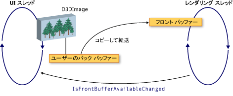

# WPF と Direct3D9 の相互運用性
Windows Presentation Foundation (WPF) アプリケーションでは、Direct3D9 コンテンツを含めることができます。 このトピックでは、WPF と効率的に相互運用できるように、Direct3D9 コンテンツを作成する方法について説明します。  
  
> [!NOTE]
>  WPF では Direct3D9 コンテンツを使用している場合は、パフォーマンスを考慮する必要があります。 パフォーマンスを最適化する方法の詳細については、次を参照してください。 [Direct3D9 と WPF の相互運用性のパフォーマンスに関する考慮事項](../../../../docs/framework/wpf/advanced/performance-considerations-for-direct3d9-and-wpf-interoperability.md)です。  
  
## バッファーを表示します。  
 <xref:System.Windows.Interop.D3DImage>クラスと呼ばれる 2 つのディスプレイ バッファーを管理、*バック バッファー*と*フロント バッファー*です。 バック バッファーは、Direct3D9 サーフェイスです。 バック バッファーへの変更はフォワード バッファーにコピー フロントを呼び出すとき、<xref:System.Windows.Interop.D3DImage.Unlock%2A>メソッドです。  
  
 次の図は、バック バッファーとフロント バッファー間のリレーションシップを示します。  
  
   
  
## Direct3D9 デバイスの作成  
 Direct3D9 のコンテンツをレンダリングするには、Direct3D9 デバイスを作成する必要があります。 デバイスの作成に使用できる 2 つの Direct3D9 オブジェクトがある`IDirect3D9`と`IDirect3D9Ex`です。 これらのオブジェクトを使って作成`IDirect3DDevice9`と`IDirect3DDevice9Ex`デバイス、それぞれします。  
  
 デバイスを作成するには、次の方法のいずれかを呼び出します。  
  
-   `IDirect3D9 * Direct3DCreate9(UINT SDKVersion);`  
  
-   `HRESULT Direct3DCreate9Ex(UINT SDKVersion, IDirect3D9Ex **ppD3D);`  
  
 Windows Vista または以降のオペレーティング システムを使用して、 `Direct3DCreate9Ex` Windows 表示 Driver Model (WDDM) を使用するように構成するディスプレイを持つメソッドです。 使用して、`Direct3DCreate9`他の任意のプラットフォームでのメソッドです。  
  
### Direct3DCreate9Ex メソッドの可用性  
 D3d9.dll が、`Direct3DCreate9Ex`メソッドでは、Windows Vista またはそれ以降のオペレーティング システムのみです。 Windows XP で関数を直接リンクすると、アプリケーションは読み込みに失敗しました。 確認するかどうか、`Direct3DCreate9Ex`メソッドはサポートされて、DLL をロードおよび proc アドレスを探します。 次のコードをテストする方法を示しています、`Direct3DCreate9Ex`メソッドです。 完全なコード例では、次を参照してください。[チュートリアル: WPF でのホストの Direct3D9 のコンテンツを作成する](../../../../docs/framework/wpf/advanced/walkthrough-creating-direct3d9-content-for-hosting-in-wpf.md)です。  
  
 [!code-cpp[System.Windows.Interop.D3DImage#RendererManager_EnsureD3DObjects](../../../../samples/snippets/cpp/VS_Snippets_Wpf/System.Windows.Interop.D3DImage/cpp/renderermanager.cpp#renderermanager_ensured3dobjects)]  
  
### HWND の作成  
 デバイスを作成するには、HWND が必要です。 一般に、使用する Direct3D9 のダミー HWND を作成します。 次のコード例では、ダミーの HWND を作成する方法を示します。  
  
 [!code-cpp[System.Windows.Interop.D3DImage#RendererManager_EnsureHWND](../../../../samples/snippets/cpp/VS_Snippets_Wpf/System.Windows.Interop.D3DImage/cpp/renderermanager.cpp#renderermanager_ensurehwnd)]  
  
### 表示パラメーター  
 デバイスを作成する必要も、`D3DPRESENT_PARAMETERS`構造体がいくつかのパラメーターのみが重要です。 これらのパラメーターを選択して、メモリ使用量を最小限に抑えます。  
  
 設定、`BackBufferHeight`と`BackBufferWidth`フィールドを 1 にします。 0 に設定すると、HWND のサイズに設定するとします。  
  
 常に設定、`D3DCREATE_MULTITHREADED`と`D3DCREATE_FPU_PRESERVE`を防ぐためのフラグと Direct3D9 によってを Direct3D9 が FPU 設定を変更することを防ぐために使用されるメモリを破壊します。  
  
 次のコードを初期化する方法を示しています、`D3DPRESENT_PARAMETERS`構造体。  
  
 [!code-cpp[System.Windows.Interop.D3DImage#Renderer_Init](../../../../samples/snippets/cpp/VS_Snippets_Wpf/System.Windows.Interop.D3DImage/cpp/renderer.cpp#renderer_init)]  
  
## バック バッファーのレンダー ターゲットの作成  
 Direct3D9 コンテンツを表示する、 <xref:System.Windows.Interop.D3DImage>、Direct3D9 画面を作成して呼び出すことで割り当てる、<xref:System.Windows.Interop.D3DImage.SetBackBuffer%2A>メソッドです。  
  
### アダプターのサポートを確認しています  
 サーフェイスを作成する前にすべてのアダプターが必要な画面のプロパティをサポートすることを確認します。 アダプターが 1 つのみを表示する場合でも、WPF ウィンドウは、システムで任意のアダプターに表示されます可能性があります。 Direct3D9 処理するコードを複数のアダプターの構成は常に記述し、使用可能なアダプター間で画面を移動する可能性があります WPF サポートについては、すべてのアダプターをチェックする必要があります。  
  
 次のコード例では、Direct3D9 のシステム上のすべてのアダプターのサポートを確認する方法を示します。  
  
 [!code-cpp[System.Windows.Interop.D3DImage#RendererManager_TestSurfaceSettings](../../../../samples/snippets/cpp/VS_Snippets_Wpf/System.Windows.Interop.D3DImage/cpp/renderermanager.cpp#renderermanager_testsurfacesettings)]  
  
### 画面を作成します。  
 サーフェイスを作成する前に、対象のオペレーティング システムでデバイスの機能が良好なパフォーマンスをサポートすることを確認します。 詳細については、次を参照してください。 [Direct3D9 と WPF の相互運用性のパフォーマンスに関する考慮事項](../../../../docs/framework/wpf/advanced/performance-considerations-for-direct3d9-and-wpf-interoperability.md)です。  
  
 デバイスの機能を確認したら、画面を作成できます。 次のコード例では、レンダー ターゲットを作成する方法を示します。  
  
 [!code-cpp[System.Windows.Interop.D3DImage#Renderer_CreateSurface](../../../../samples/snippets/cpp/VS_Snippets_Wpf/System.Windows.Interop.D3DImage/cpp/renderer.cpp#renderer_createsurface)]  
  
### WDDM  
 Windows Vista および WDDM を使用するように構成は、以降のオペレーティング システムで、レンダー ターゲットのテクスチャを作成して、レベル 0 画面を渡す、<xref:System.Windows.Interop.D3DImage.SetBackBuffer%2A>メソッドです。 Windows xp では、ロックのレンダー ターゲットのテクスチャを作成することはできませんし、パフォーマンスが低下するため、この方法はお勧めしません。  
  
## デバイス状態の処理  
 <xref:System.Windows.Interop.D3DImage>クラスと呼ばれる 2 つのディスプレイ バッファーを管理、*バック バッファー*と*フロント バッファー*です。 バック バッファーは、Direct3D サーフェイスです。  バック バッファーへの変更はフォワード バッファーにコピー フロントを呼び出すとき、<xref:System.Windows.Interop.D3DImage.Unlock%2A>メソッド、ハードウェアで表示されます。 場合によっては、フロントのバッファーが使用できなくなります。 この可用性の欠如は、画面のロック、排他 Direct3D アプリケーションの全画面表示、ユーザーの切り替え、または他のシステム アクティビティによって可能性があります。 処理することにより、WPF アプリケーションが通知これが発生した場合、<xref:System.Windows.Interop.D3DImage.IsFrontBufferAvailableChanged>イベント。  アプリケーションが利用できなくなるフロントのバッファーに応答する方法は、ソフトウェア レンダリングにフォールバックする WPF が有効になっているかどうかによって異なります。 <xref:System.Windows.Interop.D3DImage.SetBackBuffer%2A>メソッドは、WPF ソフトウェア レンダリングにフォールバックするかどうかを指定するパラメーターを受け取るオーバー ロードを持ちます。  
  
 呼び出すと、<xref:System.Windows.Interop.D3DImage.SetBackBuffer%28System.Windows.Interop.D3DResourceType%2CSystem.IntPtr%29>オーバー ロードを呼び出したり、<xref:System.Windows.Interop.D3DImage.SetBackBuffer%28System.Windows.Interop.D3DResourceType%2CSystem.IntPtr%2CSystem.Boolean%29>を持つオーバー ロード、`enableSoftwareFallback`パラメーターに設定`false`、レンダリング システムは、フロントのバッファーが使用できなくなり、何も表示したときにバック バッファーへの参照を解放します。 レンダリング システムを発生させますフロントのバッファーを再度使用できる場合、 <xref:System.Windows.Interop.D3DImage.IsFrontBufferAvailableChanged> WPF アプリケーションに通知するイベントです。  イベント ハンドラーを作成することができます、<xref:System.Windows.Interop.D3DImage.IsFrontBufferAvailableChanged>イベントを有効な Direct3D 画面を使用してレンダリングを再起動します。 再起動するレンダリングを呼び出す必要があります<xref:System.Windows.Interop.D3DImage.SetBackBuffer%2A>です。  
  
 呼び出すと、<xref:System.Windows.Interop.D3DImage.SetBackBuffer%28System.Windows.Interop.D3DResourceType%2CSystem.IntPtr%2CSystem.Boolean%29>を持つオーバー ロード、`enableSoftwareFallback`パラメーターに設定`true`、レンダリング時に維持バック バッファーへの参照を呼び出す必要はありませんので、フロントのバッファーが使用できなくなった、<xref:System.Windows.Interop.D3DImage.SetBackBuffer%2A>ときフロントのバッファーが再びで使用可能です。  
  
 ソフトウェア レンダリングが有効にすると、ユーザーのデバイスが使用できなくなった、レンダリング システム Direct3D サーフェイスへの参照を保持する場合があります。 Direct3D9 デバイスが利用可能でないかどうかを確認するを呼び出して、`TestCooperativeLevel`メソッドです。 Direct3D9Ex デバイス呼び出しを確認する、`CheckDeviceState`メソッド、ため、`TestCooperativeLevel`メソッドは推奨されておらず、常に成功を返します。 ユーザー デバイスが利用できなくなると、呼び出す<xref:System.Windows.Interop.D3DImage.SetBackBuffer%2A>バック バッファーへの WPF の参照を解放します。  デバイスをリセットする必要がある場合は、呼び出す<xref:System.Windows.Interop.D3DImage.SetBackBuffer%2A>で、`backBuffer`パラメーターに設定`null`、およびを呼び出す<xref:System.Windows.Interop.D3DImage.SetBackBuffer%2A>でもう一度`backBuffer`Direct3D 画面を有効に設定します。  
  
 呼び出す、`Reset`マルチ アダプターのサポートを実装する場合にのみ、無効なデバイスから回復する方法です。 それ以外の場合、すべて Direct3D9 インターフェイスを解放し、完全に再作成します。 アダプターのレイアウトを変更した場合、変更の前に作成された Direct3D9 オブジェクトは更新されません。  
  
## サイズ変更の処理  
 場合、<xref:System.Windows.Interop.D3DImage>が表示されます現在に従って以外のネイティブのサイズ、解像度にスケールは<xref:System.Windows.Media.RenderOptions.BitmapScalingMode%2A>する点を除いて、<xref:System.Windows.Media.Effects.SamplingMode.Bilinear>が代入される<xref:System.Windows.Media.BitmapScalingMode.Fant>です。  
  
 新規に作成する必要があります、高い再現性を必要とする場合ときに画面のコンテナー、<xref:System.Windows.Interop.D3DImage>サイズを変更します。  
  
 サイズ変更を処理する 3 つの可能な方法はあります。  
  
-   レイアウト システムに参加し、サイズが変更されたときに、新しい画面を作成します。 排気またはビデオ メモリが断片化する可能性がありますので、多くのサーフェスは作成されません。  
  
-   新しい画面の作成に時間の一定の期間のサイズ変更イベントが発生していないまで待機します。  
  
-   作成、 <xref:System.Windows.Threading.DispatcherTimer> 1 秒あたりに何度もコンテナー サイズをチェックします。  
  
## マルチ モニターの最適化  
 レンダリング システムに移動すると、パフォーマンスが大幅に低下が生じる、<xref:System.Windows.Interop.D3DImage>別のモニターにします。  
  
 WDDM に限り、モニターは、同じビデオ カードを使用して`Direct3DCreate9Ex`パフォーマンスの低下はありません。 モニターは、別のビデオ カードでは、パフォーマンスは低下します。 Windows XP では、パフォーマンスが低下は常にします。  
  
 ときに、<xref:System.Windows.Interop.D3DImage>良好なパフォーマンスを復元する対応するアダプターで新しい画面を作成することができますが、別のモニターに移動します。  
  
 パフォーマンスの低下を回避するのには、具体的にはマルチ モニターのコードを記述します。 マルチ モニターのコードを記述する 1 つの方法を次に示します。  
  
1.  ポイントを見つけられない、<xref:System.Windows.Interop.D3DImage>画面領域で、`Visual.ProjectToScreen`メソッドです。  
  
2.  使用して、`MonitorFromPoint`ポイントが表示されているモニタを検索する GDI メソッドです。  
  
3.  使用して、 `IDirect3D9::GetAdapterMonitor` Direct3D9 アダプターの種類のモニターを検索するメソッドが上です。  
  
4.  アダプターがバック バッファーのアダプターと同じでない場合、新しいモニターの新しいバック バッファーを作成し、それを割り当てる、<xref:System.Windows.Interop.D3DImage>バック バッファー。  
  
> [!NOTE]
>  場合、<xref:System.Windows.Interop.D3DImage>またがっているモニター、パフォーマンスが遅くなるを除く WDDM の場合と`IDirect3D9Ex`同じアダプターにします。 このような状況でパフォーマンスを向上させる方法はありません。  
  
 次のコード例では、現在のモニタを検索する方法を示します。  
  
 [!code-cpp[System.Windows.Interop.D3DImage#RendererManager_SetAdapter](../../../../samples/snippets/cpp/VS_Snippets_Wpf/System.Windows.Interop.D3DImage/cpp/renderermanager.cpp#renderermanager_setadapter)]  
  
 モニターを更新するときに、<xref:System.Windows.Interop.D3DImage>コンテナーのサイズまたは位置の変更、または更新プログラムを使用して、モニター、 `DispatcherTimer` 1 秒あたりに何回か更新します。  
  
## WPF ソフトウェア レンダリング  
 WPF は、次の状況でのソフトウェアの UI スレッドで同期的にレンダリングします。  
  
-   印刷  
  
-   <xref:System.Windows.Media.Effects.BitmapEffect>  
  
-   <xref:System.Windows.Media.Imaging.RenderTargetBitmap>  
  
 このような状況のいずれかが発生したとき、レンダリング システムは、<xref:System.Windows.Interop.D3DImage.CopyBackBuffer%2A>にソフトウェア、ハードウェアのバッファーをコピーする方法です。 既定の実装、`GetRenderTargetData`画面を持つメソッドです。 この呼び出しは、ロック/ロック解除のパターンの外部で発生するためが失敗する可能性があります。 ここで、`CopyBackBuffer`メソッドを返します。 `null` 、イメージは表示されません。  
  
 オーバーライドすることができます、<xref:System.Windows.Interop.D3DImage.CopyBackBuffer%2A>メソッド、基本の実装を呼び出すを返す場合と`null`、プレース ホルダーを返すことができます<xref:System.Windows.Media.Imaging.BitmapSource>です。  
  
 基底の実装を呼び出す代わりに、独自のソフトウェア レンダリングを実装することもできます。  
  
> [!NOTE]
>  ソフトウェアでは、WPF が完全にレンダリングする場合<xref:System.Windows.Interop.D3DImage>WPF には、フロントのバッファーができないためには表示されません。  
  
## 関連項目  
 <xref:System.Windows.Interop.D3DImage>  
 [Direct3D9 および WPF の相互運用性のパフォーマンスに関する考慮事項](../../../../docs/framework/wpf/advanced/performance-considerations-for-direct3d9-and-wpf-interoperability.md)  
 [チュートリアル: WPF でホストするための Direct3D9 コンテンツの作成](../../../../docs/framework/wpf/advanced/walkthrough-creating-direct3d9-content-for-hosting-in-wpf.md)  
 [チュートリアル: WPF での Direct3D9 コンテンツのホスト](../../../../docs/framework/wpf/advanced/walkthrough-hosting-direct3d9-content-in-wpf.md)
