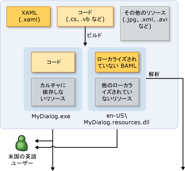
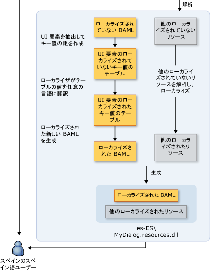

# WPF のグローバリゼーションおよびローカリゼーションの概要WPF Globalization and Localization Overview
1 つの言語、製品の可用性を制限する場合は、潜在的な顧客の世界 6.5 と人口の割合をベースを制限します。When you limit your product's availability to only one language, you limit your potential customer base to a fraction of our world’s 6.5 billion population. 世界各国のユーザーに到達するようにアプリケーションを実行する場合に、製品のコスト効果の高いローカライズはより多くの顧客に最適かつ最も経済的な方法のいずれかです。If you want your applications to reach a global audience, cost-effective localization of your product is one of the best and most economical ways to reach more customers.  
  
 この概要では、グローバリゼーションとローカリゼーションが導入されています[!INCLUDE[TLA#tla_winclient](../../../../includes/tlasharptla-winclient-md.md)]です。This overview introduces globalization and localization in [!INCLUDE[TLA#tla_winclient](../../../../includes/tlasharptla-winclient-md.md)]. グローバリゼーションとは、設計と複数の場所で実行されるアプリケーションを開発します。Globalization is the design and development of applications that perform in multiple locations. たとえば、グローバリゼーション ローカライズされたユーザー インターフェイスとサポート地域のデータの異なるカルチャ内のユーザーのです。For example, globalization supports localized user interfaces and regional data for users in different cultures. [!INCLUDE[TLA2#tla_winclient](../../../../includes/tla2sharptla-winclient-md.md)]グローバル化されたデザイン機能、自動レイアウト、サテライト アセンブリ、およびローカライズされた属性を含むとコメントを提供します。 provides globalized design features, including automatic layout, satellite assemblies, and localized attributes and commenting.
  
 ローカリゼーションとは、アプリケーションがサポートする特定のカルチャのローカライズ バージョンへのアプリケーション リソースを変換します。Localization is the translation of application resources into localized versions for the specific cultures that the application supports. ローカライズするときに[!INCLUDE[TLA2#tla_winclient](../../../../includes/tla2sharptla-winclient-md.md)]で Api を使用する、<xref:System.Windows.Markup.Localizer>名前空間。When you localize in [!INCLUDE[TLA2#tla_winclient](../../../../includes/tla2sharptla-winclient-md.md)], you use the APIs in the <xref:System.Windows.Markup.Localizer> namespace. これらの Api 電源、 [LocBaml ツール サンプル](http://go.microsoft.com/fwlink/?LinkID=160016)コマンド ライン ツールです。These APIs power the [LocBaml Tool Sample](http://go.microsoft.com/fwlink/?LinkID=160016) command-line tool. 構築し、LocBaml を使用する方法については、次を参照してください。[アプリケーションをローカライズする](../../../../docs/framework/wpf/advanced/how-to-localize-an-application.md)です。For information about how to build and use LocBaml, see [Localize an Application](../../../../docs/framework/wpf/advanced/how-to-localize-an-application.md).    
  
## グローバリゼーションとローカリゼーション WPF のベスト プラクティスBest Practices for Globalization and Localization in WPF  
 組み込まれているグローバリゼーションおよびローカリゼーションの機能を最大限に活用することができます[!INCLUDE[TLA2#tla_winclient](../../../../includes/tla2sharptla-winclient-md.md)]に従って、UI のデザイン、ローカリゼーション関連のヒントについてこのセクションの内容を提供します。You can make the most of the globalization and localization functionality that is built into [!INCLUDE[TLA2#tla_winclient](../../../../includes/tla2sharptla-winclient-md.md)] by following the UI design and localization-related tips that this section provides.  
  
### WPF の UI の設計に関するベスト プラクティスBest Practices for WPF UI Design  
 デザインするとき、 [!INCLUDE[TLA2#tla_winclient](../../../../includes/tla2sharptla-winclient-md.md)]– ベース[!INCLUDE[TLA2#tla_ui](../../../../includes/tla2sharptla-ui-md.md)]、これらのベスト プラクティスを実装することを検討してください。When you design a [!INCLUDE[TLA2#tla_winclient](../../../../includes/tla2sharptla-winclient-md.md)]–based [!INCLUDE[TLA2#tla_ui](../../../../includes/tla2sharptla-ui-md.md)], consider implementing these best practices:  
  
-   書き込み、[!INCLUDE[TLA2#tla_ui](../../../../includes/tla2sharptla-ui-md.md)]で[!INCLUDE[TLA2#tla_xaml](../../../../includes/tla2sharptla-xaml-md.md)]; を作成しないように[!INCLUDE[TLA2#tla_ui](../../../../includes/tla2sharptla-ui-md.md)]のコードにします。Write your [!INCLUDE[TLA2#tla_ui](../../../../includes/tla2sharptla-ui-md.md)] in [!INCLUDE[TLA2#tla_xaml](../../../../includes/tla2sharptla-xaml-md.md)]; avoid creating [!INCLUDE[TLA2#tla_ui](../../../../includes/tla2sharptla-ui-md.md)] in code. 作成するときに、[!INCLUDE[TLA2#tla_ui](../../../../includes/tla2sharptla-ui-md.md)]を使用して[!INCLUDE[TLA2#tla_xaml](../../../../includes/tla2sharptla-xaml-md.md)]、組み込みのローカリゼーション Api を介して公開します。When you create your [!INCLUDE[TLA2#tla_ui](../../../../includes/tla2sharptla-ui-md.md)] by using [!INCLUDE[TLA2#tla_xaml](../../../../includes/tla2sharptla-xaml-md.md)], you expose it through built-in localization APIs.  
  
-   コンテンツをレイアウトする絶対位置および固定サイズを使用しないでください。代わりに、相対パスまたは自動サイズ設定を使用します。Avoid using absolute positions and fixed sizes to lay out content; instead, use relative or automatic sizing.
  
    -   使用して<xref:System.Windows.Window.SizeToContent%2A>; 幅と高さの設定を保持および`Auto`です。Use <xref:System.Windows.Window.SizeToContent%2A>; and keep widths and heights set to `Auto`.  
  
    -   使用しないでください<xref:System.Windows.Controls.Canvas>をレイアウトする[!INCLUDE[TLA2#tla_ui](../../../../includes/tla2sharptla-ui-md.md)]s。Avoid using <xref:System.Windows.Controls.Canvas> to lay out [!INCLUDE[TLA2#tla_ui](../../../../includes/tla2sharptla-ui-md.md)]s.  
  
    -   使用して<xref:System.Windows.Controls.Grid>とそのサイズの共有機能します。Use <xref:System.Windows.Controls.Grid> and its size-sharing feature.  
  
-   ローカライズされたテキストには多くの場合より多くの領域が必要とするための余白で余分なスペースを提供します。Provide extra space in margins because localized text often requires more space. 余分なスペースにより、考えられる突出文字。Extra space allows for possible overhanging characters.  
  
-   有効にする<xref:System.Windows.Controls.TextBlock.TextWrapping%2A>で<xref:System.Windows.Controls.TextBlock>クリッピングを避けることです。Enable <xref:System.Windows.Controls.TextBlock.TextWrapping%2A> on <xref:System.Windows.Controls.TextBlock> to avoid clipping.
  
-   設定、 **xml:lang**属性。Set the **xml:lang** attribute. この属性には、特定の要素とその子要素のカルチャがについて説明します。This attribute describes the culture of a specific element and its child elements. このプロパティの値でいくつかの機能の動作が変更[!INCLUDE[TLA2#tla_winclient](../../../../includes/tla2sharptla-winclient-md.md)]です。The value of this property changes the behavior of several features in [!INCLUDE[TLA2#tla_winclient](../../../../includes/tla2sharptla-winclient-md.md)]. たとえば、ハイフネーション、スペル チェック、数値の置換、複雑なスクリプトの整形、およびフォント フォールバックの動作を変更します。For example, it changes the behavior of hyphenation, spell checking, number substitution, complex script shaping, and font fallback. 参照してください[WPF のグローバリゼーション](../../../../docs/framework/wpf/advanced/globalization-for-wpf.md)設定に関する詳細について、 [xml:lang XAML での処理](../../../../docs/framework/xaml-services/xml-lang-handling-in-xaml.md)です。See [Globalization for WPF](../../../../docs/framework/wpf/advanced/globalization-for-wpf.md) for more information about setting the [xml:lang Handling in XAML](../../../../docs/framework/xaml-services/xml-lang-handling-in-xaml.md).  
  
-   異なる言語に使用されるフォントの制御を強化するためのカスタマイズされた複合フォントを作成します。Create a customized composite font to obtain better control of fonts that are used for different languages. 既定では、 [!INCLUDE[TLA2#tla_winclient](../../../../includes/tla2sharptla-winclient-md.md)] Windows\Fonts ディレクトリに GlobalUserInterface.composite フォントを使用します。By default, [!INCLUDE[TLA2#tla_winclient](../../../../includes/tla2sharptla-winclient-md.md)] uses the GlobalUserInterface.composite font in your Windows\Fonts directory.  
  
-   右から左へ形式でテキストを表示する、カルチャにローカライズされる可能性がありますナビゲーション アプリケーションを作成すると、明示的に設定、<xref:System.Windows.FlowDirection>の各ページには、ページを継承しません<xref:System.Windows.FlowDirection>から、<xref:System.Windows.Navigation.NavigationWindow>です。When you create navigation applications that may be localized in a culture that presents text in a right-to-left format, explicitly set the <xref:System.Windows.FlowDirection> of every page to ensure the page does not inherit <xref:System.Windows.FlowDirection> from the <xref:System.Windows.Navigation.NavigationWindow>.  
  
-   ブラウザー外でホストされているスタンドアロン ナビゲーション アプリケーションを作成するときに設定、<xref:System.Windows.Application.StartupUri%2A>初期アプリケーションに、<xref:System.Windows.Navigation.NavigationWindow>の代わりに、ページに (たとえば、 `<Application StartupUri="NavigationWindow.xaml">`)。When you create stand-alone navigation applications that are hosted outside a browser, set the <xref:System.Windows.Application.StartupUri%2A> for your initial application to a <xref:System.Windows.Navigation.NavigationWindow> instead of to a page (for example, `<Application StartupUri="NavigationWindow.xaml">`). この設計では、変更することができます、<xref:System.Windows.FlowDirection>はウィンドウとナビゲーション バー。This design enables you to change the <xref:System.Windows.FlowDirection> of the Window and the navigation bar. 例および詳細については、次を参照してください。[グローバリゼーション ホームページのサンプル](http://go.microsoft.com/fwlink/?LinkID=159990)です。For more information and an example, see [Globalization Homepage Sample](http://go.microsoft.com/fwlink/?LinkID=159990).  
  
### WPF のローカライズ用のベスト プラクティスBest Practices for WPF Localization  
 ローカライズする[!INCLUDE[TLA2#tla_winclient](../../../../includes/tla2sharptla-winclient-md.md)]– ベースのアプリケーションでは、これらのベスト プラクティスの実装を検討します。When you localize [!INCLUDE[TLA2#tla_winclient](../../../../includes/tla2sharptla-winclient-md.md)]–based applications, consider implementing these best practices:  
  
-   ローカリゼーション コメントを使用して、ローカライズの余分なコンテキストを指定します。Use localization comments to provide extra context for localizers.  
  
-   ローカリゼーション属性を使用して、選択的に省略することではなく制御<xref:System.Windows.Markup.Localizer.BamlLocalizableResourceKey.Uid%2A>要素のプロパティです。Use localization attributes to control localization instead of selectively omitting <xref:System.Windows.Markup.Localizer.BamlLocalizableResourceKey.Uid%2A> properties on elements. 参照してください[ローカリゼーション属性とコメント](../../../../docs/framework/wpf/advanced/localization-attributes-and-comments.md)詳細についてはします。See [Localization Attributes and Comments](../../../../docs/framework/wpf/advanced/localization-attributes-and-comments.md) for more information.  
  
-   使用して**msbuild/t:updateuid**と**/t:checkuid**を追加および確認<xref:System.Windows.Markup.Localizer.BamlLocalizableResourceKey.Uid%2A>プロパティで、[!INCLUDE[TLA2#tla_xaml](../../../../includes/tla2sharptla-xaml-md.md)]です。Use **msbuild /t:updateuid** and **/t:checkuid** to add and check <xref:System.Windows.Markup.Localizer.BamlLocalizableResourceKey.Uid%2A> properties in your [!INCLUDE[TLA2#tla_xaml](../../../../includes/tla2sharptla-xaml-md.md)]. 使用して<xref:System.Windows.Markup.Localizer.BamlLocalizableResourceKey.Uid%2A>開発およびローカリゼーションの間での変更を追跡するプロパティです。Use <xref:System.Windows.Markup.Localizer.BamlLocalizableResourceKey.Uid%2A> properties to track changes between development and localization. <xref:System.Windows.Markup.Localizer.BamlLocalizableResourceKey.Uid%2A>プロパティを使用して、新しい開発上の変更をローカライズできます。<xref:System.Windows.Markup.Localizer.BamlLocalizableResourceKey.Uid%2A> properties help you localize new development changes. 手動で追加する場合<xref:System.Windows.Markup.Localizer.BamlLocalizableResourceKey.Uid%2A>プロパティを[!INCLUDE[TLA2#tla_ui](../../../../includes/tla2sharptla-ui-md.md)]タスクは通常面倒と正確さに欠けます。If you manually add <xref:System.Windows.Markup.Localizer.BamlLocalizableResourceKey.Uid%2A> properties to a [!INCLUDE[TLA2#tla_ui](../../../../includes/tla2sharptla-ui-md.md)], the task is typically tedious and less accurate.  
  
    -   編集または変更しない<xref:System.Windows.Markup.Localizer.BamlLocalizableResourceKey.Uid%2A>プロパティのローカライズを開始した後です。Do not edit or change <xref:System.Windows.Markup.Localizer.BamlLocalizableResourceKey.Uid%2A> properties after you begin localization.  
  
    -   重複データを使用しないでください<xref:System.Windows.Markup.Localizer.BamlLocalizableResourceKey.Uid%2A>プロパティ (コピーと貼り付け コマンドを使用する場合は、このヒントを忘れないでください)。Do not use duplicate <xref:System.Windows.Markup.Localizer.BamlLocalizableResourceKey.Uid%2A> properties (remember this tip when you use the copy-and-paste command).  
  
    -   設定、`UltimateResourceFallback`フォールバックの適切な言語を指定する AssemblyInfo.* 内の場所 (たとえば、 `[assembly: NeutralResourcesLanguage("en-US",   UltimateResourceFallbackLocation.Satellite)]`)。Set the `UltimateResourceFallback` location in AssemblyInfo.* to specify the appropriate language for fallback (for example, `[assembly: NeutralResourcesLanguage("en-US",   UltimateResourceFallbackLocation.Satellite)]`).  
  
         省略すると、メイン アセンブリに、元の言語を含める場合、`<UICulture>`は、プロジェクト ファイルにタグ付けは、設定、`UltimateResourceFallback`サテライトの代わりにメイン アセンブリと場所 (たとえば、 `[assembly: NeutralResourcesLanguage("en-US", UltimateResourceFallbackLocation.MainAssembly)]`)。If you decide to include your source language in the main assembly by omitting the `<UICulture>` tag in your project file, set the `UltimateResourceFallback` location as the main assembly instead of the satellite (for example, `[assembly: NeutralResourcesLanguage("en-US", UltimateResourceFallbackLocation.MainAssembly)]`).  
  
   
## WPF アプリケーションをローカライズします。Localize a WPF Application  
 ローカライズするときに、[!INCLUDE[TLA2#tla_winclient](../../../../includes/tla2sharptla-winclient-md.md)]アプリケーション、複数のオプションがあります。When you localize a [!INCLUDE[TLA2#tla_winclient](../../../../includes/tla2sharptla-winclient-md.md)] application, you have several options. アプリケーションのローカライズ可能なリソースをバインドするなど、[!INCLUDE[TLA2#tla_xml](../../../../includes/tla2sharptla-xml-md.md)]ファイル、resx テーブル内のローカライズ可能なテキストを格納または使用して、ローカライザー[!INCLUDE[TLA#tla_xaml](../../../../includes/tlasharptla-xaml-md.md)]ファイル。For example, you can bind the localizable resources in your application to an [!INCLUDE[TLA2#tla_xml](../../../../includes/tla2sharptla-xml-md.md)] file, store localizable text in resx tables, or have your localizer use [!INCLUDE[TLA#tla_xaml](../../../../includes/tlasharptla-xaml-md.md)] files. このセクションでは、いくつかの利点を提供する XAML の BAML 形式を使用するローカライズ ワークフローについて説明します。This section describes a localization workflow that uses the BAML form of XAML, which provides several benefits:  
  
-   ビルドした後はローカライズできます。You can localize after you build .  
  
-   開発するのと同時にローカライズできるように XAML の BAML 形式の古いバージョンから XAMLwith のローカライズ版の BAML 形式は、の新しいバージョンに更新することができます。You can update to a newer version of the BAML form of XAMLwith localizations from an older version of the BAML form of XAML so that you can localize at the same time that you develop.  
  
-   検証する元のソース要素とセマンティクス コンパイル時に XAML の BAML 形式は、コンパイルした形式のため[!INCLUDE[TLA2#tla_xaml](../../../../includes/tla2sharptla-xaml-md.md)]です。You can validate original source elements and semantics at compile time because the BAML form of XAML is the compiled form of [!INCLUDE[TLA2#tla_xaml](../../../../includes/tla2sharptla-xaml-md.md)].  
  
### ローカリゼーションのビルド プロセスLocalization Build Process  
 開発する際に、[!INCLUDE[TLA2#tla_winclient](../../../../includes/tla2sharptla-winclient-md.md)]アプリケーションでのローカライズ用のビルド プロセスは次のようにします。When you develop a [!INCLUDE[TLA2#tla_winclient](../../../../includes/tla2sharptla-winclient-md.md)] application, the build process for localization is as follows:  
  
-   開発者が作成し、グローバライズ、[!INCLUDE[TLA2#tla_winclient](../../../../includes/tla2sharptla-winclient-md.md)]アプリケーションです。The developer creates and globalizes the [!INCLUDE[TLA2#tla_winclient](../../../../includes/tla2sharptla-winclient-md.md)] application. ファイル、プロジェクトでは開発者セット`<UICulture>en-US</UICulture>`言語に依存しないメイン アセンブリが生成されたアプリケーションをコンパイルするときに、できるようにします。In the project file the developer sets `<UICulture>en-US</UICulture>` so that when the application is compiled, a language-neutral main assembly is generated. このアセンブリのサテライト。 ローカライズ可能なすべてのリソースを含む.resources.dll ファイル。This assembly has a satellite .resources.dll file that contains all the localizable resources. 必要に応じて、おくソース言語メイン アセンブリであるため、ローカリゼーション[!INCLUDE[TLA2#tla_api#plural](../../../../includes/tla2sharptla-apisharpplural-md.md)]メインのアセンブリからの抽出をサポートします。Optionally, you can keep the source language in the main assembly because our localization [!INCLUDE[TLA2#tla_api#plural](../../../../includes/tla2sharptla-apisharpplural-md.md)] support extraction from the main assembly.  
  
-   ファイルが、ビルドにコンパイルされるときに、[!INCLUDE[TLA2#tla_xaml](../../../../includes/tla2sharptla-xaml-md.md)]は XAML の BAML 形式に変換されます。When the file is compiled into the build, the [!INCLUDE[TLA2#tla_xaml](../../../../includes/tla2sharptla-xaml-md.md)] is converted to the BAML form of XAML. カルチャに依存しない`MyDialog.exe`とカルチャに依存 (英語)`MyDialog.resources.dll`英語圏の顧客にファイルを解放します。The culturally neutral `MyDialog.exe` and the culturally dependent (English) `MyDialog.resources.dll` files are released to the English-speaking customer.  
  
### ローカリゼーション ワークフローLocalization Workflow  
 ローカリゼーション処理した後に開始、ローカライズされていない`MyDialog.resources.dll`ファイルをビルドします。The localization process begins after the unlocalized `MyDialog.resources.dll` file is built. [!INCLUDE[TLA2#tla_ui](../../../../includes/tla2sharptla-ui-md.md)]要素と、元のプロパティ[!INCLUDE[TLA2#tla_xaml](../../../../includes/tla2sharptla-xaml-md.md)]を使用して、キーと値のペアには、XAML の BAML 形式から抽出された、 [!INCLUDE[TLA2#tla_api#plural](../../../../includes/tla2sharptla-apisharpplural-md.md)] <xref:System.Windows.Markup.Localizer>です。The [!INCLUDE[TLA2#tla_ui](../../../../includes/tla2sharptla-ui-md.md)] elements and properties in your original [!INCLUDE[TLA2#tla_xaml](../../../../includes/tla2sharptla-xaml-md.md)] are extracted from the BAML form of XAML into key-value pairs by using the [!INCLUDE[TLA2#tla_api#plural](../../../../includes/tla2sharptla-apisharpplural-md.md)] under <xref:System.Windows.Markup.Localizer>. ローカライザーでは、キー/値ペアを使用して、アプリケーションをローカライズします。Localizers use the key-value pairs to localize the application. 新しいを生成することができます。 ローカリゼーションが完了した後に新しい値から resource.dll です。You can generate a new .resource.dll from the new values after localization is complete.  
  
 キー/値ペアのキーは、`x:Uid`開発者が、元に配置されている値[!INCLUDE[TLA2#tla_xaml](../../../../includes/tla2sharptla-xaml-md.md)]です。The keys of the key-value pairs are `x:Uid` values that are placed by the developer in the original [!INCLUDE[TLA2#tla_xaml](../../../../includes/tla2sharptla-xaml-md.md)]. これら`x:Uid`値を有効にする、[!INCLUDE[TLA2#tla_api](../../../../includes/tla2sharptla-api-md.md)]を追跡およびローカリゼーションの中に、開発者やローカライザー間に行われる変更をマージします。These `x:Uid` values enable the [!INCLUDE[TLA2#tla_api](../../../../includes/tla2sharptla-api-md.md)] to track and merge changes that happen between the developer and the localizer during localization. たとえば、開発者が変更された場合、[!INCLUDE[TLA2#tla_ui](../../../../includes/tla2sharptla-ui-md.md)]ローカライザーをローカライズする開始した後は、最小限の翻訳作業が失われたようにローカリゼーションが既に完了した作業と開発の変更をマージすることです。For example, if the developer changes the [!INCLUDE[TLA2#tla_ui](../../../../includes/tla2sharptla-ui-md.md)] after the localizer begins localizing, you can merge the development change with the already completed localization work so that minimal translation work is lost.  
  
 次の図は、XAML の BAML 形式に基づいている一般的なローカリゼーション ワークフローを示します。The following graphic shows a typical localization workflow that is based on the BAML form of XAML. この図では、開発者が英語でアプリケーションを記述前提としています。This diagram assumes the developer writes the application in English. 開発者は、作成し、WPF アプリケーションのグローバライズします。The developer creates and globalizes the WPF application. ファイル、プロジェクトでは開発者を設定`<UICulture>en-US</UICulture>`ビルド時に、言語に中立的なメイン アセンブリはサテライトの生成を取得できるようにします。 すべてのローカライズ可能なリソースを含む resources.dll です。In the project file the developer sets `<UICulture>en-US</UICulture>` so that on build, a language neutral main assembly gets generated with a satellite .resources.dll containing all localizable resources. 代わりに、WPF ローカリゼーション Api メインのアセンブリからの抽出をサポートするためメイン アセンブリにソース言語を残す 1 つでした。Alternately, one could keep the source language in the main assembly because WPF localization APIs support extraction from the main assembly. ビルド プロセスの後に、XAML は BAML にコンパイルを取得します。After the build process, the XAML get compiled into BAML. カルチャ ニュートラル MyDialog.exe.resources.dll は、英語圏顧客に出荷を取得します。The culturally neutral MyDialog.exe.resources.dll get shipped to the English speaking customer.  
  
   
  
   
  
   
## WPF のローカリゼーションの例Examples of WPF Localization  
 このセクションには、ローカライズされたアプリケーションをビルドおよびローカライズする方法を理解するための例が含まれています。[!INCLUDE[TLA2#tla_winclient](../../../../includes/tla2sharptla-winclient-md.md)]アプリケーションです。This section contains examples of localized applications to help you understand how to build and localize [!INCLUDE[TLA2#tla_winclient](../../../../includes/tla2sharptla-winclient-md.md)] applications.  
  
#### ダイアログ ボックスの例を実行します。Run Dialog Box Example  
 次の図の出力を表示する、**実行**ダイアログ ボックスのサンプルです。The following graphics show the output of the **Run** dialog box sample.  
  
 **英語：****English:**  
  
   
  
 **ドイツ語：****German:**  
  
   
  
 **グローバルの実行 ダイアログ ボックスを設計****Designing a Global Run Dialog Box**  
  
 この例で作成、**実行** ダイアログ ボックスを使用して[!INCLUDE[TLA2#tla_winclient](../../../../includes/tla2sharptla-winclient-md.md)]と[!INCLUDE[TLA2#tla_xaml](../../../../includes/tla2sharptla-xaml-md.md)]です。This example produces a **Run** dialog box by using [!INCLUDE[TLA2#tla_winclient](../../../../includes/tla2sharptla-winclient-md.md)] and [!INCLUDE[TLA2#tla_xaml](../../../../includes/tla2sharptla-xaml-md.md)]. このダイアログ ボックスは、**実行** ダイアログ ボックスが表示されます、 [!INCLUDE[TLA#tla_win](../../../../includes/tlasharptla-win-md.md)] [スタート] メニュー。This dialog box is equivalent to the **Run** dialog box that is available from the [!INCLUDE[TLA#tla_win](../../../../includes/tlasharptla-win-md.md)] Start menu.  
  
 グローバルなダイアログ ボックスを行うためのいくつかの特徴は次のとおりです。Some highlights for making global dialog boxes are:  
  
 **自動レイアウト****Automatic Layout**  
  
 *Window1.xaml: で**In Window1.xaml:*  
  
 `<Window SizeToContent="WidthAndHeight">`  
  
 前のウィンドウのプロパティには、コンテンツのサイズに従ってウィンドウが自動的にサイズ変更します。The previous Window property automatically resizes the window according to the size of the content. このプロパティにより、ローカリゼーション後にサイズが大きくなるコンテンツ ウィンドウローカライズ後のサイズでコンテンツが減少したとき、不要なスペースが削除されます。This property prevents the window from cutting off content that increases in size after localization; it also removes unneeded space when content decreases in size after localization.  
  
 `<Grid x:Uid="Grid_1">`  
  
 <xref:System.Windows.Markup.Localizer.BamlLocalizableResourceKey.Uid%2A>プロパティがために必要な[!INCLUDE[TLA2#tla_winclient](../../../../includes/tla2sharptla-winclient-md.md)]ローカリゼーション[!INCLUDE[TLA2#tla_api#plural](../../../../includes/tla2sharptla-apisharpplural-md.md)]正常に動作します。<xref:System.Windows.Markup.Localizer.BamlLocalizableResourceKey.Uid%2A> properties are needed in order for [!INCLUDE[TLA2#tla_winclient](../../../../includes/tla2sharptla-winclient-md.md)] localization [!INCLUDE[TLA2#tla_api#plural](../../../../includes/tla2sharptla-apisharpplural-md.md)] to work correctly.  
  
 使用されている[!INCLUDE[TLA2#tla_winclient](../../../../includes/tla2sharptla-winclient-md.md)]ローカリゼーション[!INCLUDE[TLA2#tla_api#plural](../../../../includes/tla2sharptla-apisharpplural-md.md)]開発およびローカリゼーションの間の変更を追跡するために、[!INCLUDE[TLA#tla_ui](../../../../includes/tlasharptla-ui-md.md)]です。They are used by [!INCLUDE[TLA2#tla_winclient](../../../../includes/tla2sharptla-winclient-md.md)] localization [!INCLUDE[TLA2#tla_api#plural](../../../../includes/tla2sharptla-apisharpplural-md.md)] to track changes between the development and localization of the [!INCLUDE[TLA#tla_ui](../../../../includes/tlasharptla-ui-md.md)]. <xref:System.Windows.Markup.Localizer.BamlLocalizableResourceKey.Uid%2A>プロパティを使用すると、新しいバージョンのマージ、[!INCLUDE[TLA2#tla_ui](../../../../includes/tla2sharptla-ui-md.md)]の以前のローカリゼーション、[!INCLUDE[TLA2#tla_ui](../../../../includes/tla2sharptla-ui-md.md)]です。<xref:System.Windows.Markup.Localizer.BamlLocalizableResourceKey.Uid%2A> properties enable you to merge a newer version of the [!INCLUDE[TLA2#tla_ui](../../../../includes/tla2sharptla-ui-md.md)] with an older localization of the [!INCLUDE[TLA2#tla_ui](../../../../includes/tla2sharptla-ui-md.md)]. 追加する、<xref:System.Windows.Markup.Localizer.BamlLocalizableResourceKey.Uid%2A>を実行して、プロパティ**msbuild/t:updateuid RunDialog.csproj**コマンド シェルでします。You add a <xref:System.Windows.Markup.Localizer.BamlLocalizableResourceKey.Uid%2A> property by running **msbuild /t:updateuid RunDialog.csproj** in a command shell. これは、追加の推奨される方法<xref:System.Windows.Markup.Localizer.BamlLocalizableResourceKey.Uid%2A>プロパティに手動で追加することが通常時間がかかる場合、正確さに欠けます。This is the recommended method of adding <xref:System.Windows.Markup.Localizer.BamlLocalizableResourceKey.Uid%2A> properties because manually adding them is typically time-consuming and less accurate. 確認することができます<xref:System.Windows.Markup.Localizer.BamlLocalizableResourceKey.Uid%2A>を実行して、プロパティが正しく設定**msbuild/t:checkuid RunDialog.csproj**です。You can check that <xref:System.Windows.Markup.Localizer.BamlLocalizableResourceKey.Uid%2A> properties are correctly set by running **msbuild /t:checkuid RunDialog.csproj**.  
  
 [!INCLUDE[TLA2#tla_ui](../../../../includes/tla2sharptla-ui-md.md)]を使用して構造化、<xref:System.Windows.Controls.Grid>を自動レイアウトの活用するために役立ちますコントロールにあるコントロールで[!INCLUDE[TLA2#tla_winclient](../../../../includes/tla2sharptla-winclient-md.md)]です。The [!INCLUDE[TLA2#tla_ui](../../../../includes/tla2sharptla-ui-md.md)] is structured by using the <xref:System.Windows.Controls.Grid> control, which is a useful control for taking advantage of the automatic layout in [!INCLUDE[TLA2#tla_winclient](../../../../includes/tla2sharptla-winclient-md.md)]. ダイアログ ボックスを次の 3 つの行と 5 つの列に分割することに注意してください。Note that the dialog box is split into three rows and five columns. 固定サイズが使用されていないいずれかの行と列の定義そのため、[!INCLUDE[TLA2#tla_ui](../../../../includes/tla2sharptla-ui-md.md)]は各セルに配置する要素が増加に適応できますとローカリゼーションの中にサイズは小さくなります。Not one of the row and column definitions has a fixed size; hence, the [!INCLUDE[TLA2#tla_ui](../../../../includes/tla2sharptla-ui-md.md)] elements that are positioned in each cell can adapt to increases and decreases in size during localization.  
  
 [!code-xaml[GlobalizationRunDialog#GridColumnDef](../../../../samples/snippets/csharp/VS_Snippets_Wpf/GlobalizationRunDialog/CS/Window1.xaml#gridcolumndef)]  
  
 最初の 2 つの列で、**開く:**ラベルと<xref:System.Windows.Controls.ComboBox>を配置しているの 10% を使用して、[!INCLUDE[TLA2#tla_ui](../../../../includes/tla2sharptla-ui-md.md)]幅の合計します。The first two columns where the **Open:** label and <xref:System.Windows.Controls.ComboBox> are placed use 10 percent of the [!INCLUDE[TLA2#tla_ui](../../../../includes/tla2sharptla-ui-md.md)] total width.  
  
 [!code-xaml[GlobalizationRunDialog#GridColumnDef2](../../../../samples/snippets/csharp/VS_Snippets_Wpf/GlobalizationRunDialog/CS/Window1.xaml#gridcolumndef2)]  
  
 例では、の共有のサイズ変更機能を使用する注<xref:System.Windows.Controls.Grid>です。Note that of the example uses the shared-sizing feature of <xref:System.Windows.Controls.Grid>. 最後の 3 つの列を活用これと同じでそれ自体を配置することによって<xref:System.Windows.Controls.DefinitionBase.SharedSizeGroup%2A>です。The last three columns take advantage of this by placing themselves in the same <xref:System.Windows.Controls.DefinitionBase.SharedSizeGroup%2A>. プロパティの名前のいずれかと同様に、これにより、同じサイズを共有する列。As one would expect from the name of the property, this allows the columns to share the same size. その場合に、「参照...」So when the "Browse…" ローカライズされますより長い文字列"Durchsuchen…"では、すべてのボタンを小さな [OK] ボタンと過度に大規模な"Durchsuchen…"ではなく幅で拡張。gets localized to the longer string "Durchsuchen…", all buttons grow in width instead of having a small "OK" button and a disproportionately large "Durchsuchen…" ボタンをクリックします。button.  
  
 **Xml:lang****Xml:lang**  
  
 `Xml:lang="en-US"`  
  
 通知、 [xml:lang XAML での処理](../../../../docs/framework/xaml-services/xml-lang-handling-in-xaml.md)のルート要素に配置され、[!INCLUDE[TLA2#tla_ui](../../../../includes/tla2sharptla-ui-md.md)]です。Notice the [xml:lang Handling in XAML](../../../../docs/framework/xaml-services/xml-lang-handling-in-xaml.md) placed at the root element of the [!INCLUDE[TLA2#tla_ui](../../../../includes/tla2sharptla-ui-md.md)]. このプロパティには、指定された要素とその子のカルチャがについて説明します。This property describes the culture of a given element and its children. この値はでいくつかの機能で使用[!INCLUDE[TLA2#tla_winclient](../../../../includes/tla2sharptla-winclient-md.md)]とローカリゼーションの中に適切に変更する必要があります。This value is used by several features in [!INCLUDE[TLA2#tla_winclient](../../../../includes/tla2sharptla-winclient-md.md)] and should be changed appropriately during localization. この値は、どのような言語の辞書を使用して単語を区切るし、スペル チェックを変更します。This value changes what language dictionary is use to hyphenate and spell check words. また、数字、およびフォント フォールバック システムが使用するフォントを選択する方法の表示も影響します。It also affects the display of digits and how the font fallback system selects which font to use. 最後に、いろいろな数字が表示されるプロパティへの影響と複雑な文字表記で記述された、方法テキストが形です。Finally, the property affects the way numbers are displayed and the way texts written in complex scripts are shaped. 既定値は、"EN-US"です。The default value is "en-US".  
  
 **サテライト リソース アセンブリの構築****Building a Satellite Resource Assembly**  
  
 *.Csproj: で**In .csproj:*  
  
 `<UICulture>en-US</UICulture>`  
  
 追加に注意してください、`UICulture`値。Notice the addition of a `UICulture` value. この設定されている場合に有効な<xref:System.Globalization.CultureInfo>プロジェクトをビルド、EN-US などの値はその中とすべてのローカライズ可能なリソースのサテライト アセンブリを生成します。When this is set to a valid <xref:System.Globalization.CultureInfo> value such as en-US, building the project will generate a satellite assembly with all localizable resources in it.  
  
 `<Resource Include="RunIcon.JPG">`  
  
 `<Localizable>False</Localizable>`  
  
 `</Resource>`  
  
 `RunIcon.JPG`すべてのカルチャと同じ表示するためにローカライズする必要はありません。The `RunIcon.JPG` does not need to be localized because it should appear the same for all cultures. `Localizable`設定されている`false`言語ニュートラル メイン アセンブリにサテライト アセンブリではなくが変わらないようにします。`Localizable` is set to `false` so that it remains in the language neutral main assembly instead of the satellite assembly. Noncompilable のすべてのリソースの既定値は`Localizable`'éý'`true`です。The default value of all noncompilable resources is `Localizable` set to `true`.  
  
 **実行用のダイアログのローカライズ****Localizing the Run Dialog**  
  
 **解析****Parse**  
  
 これをローカライズする最初の手順のアプリケーションをビルドした後はサテライト アセンブリ外ローカライズ可能なリソースが解析しています。After building the application, the first step in localizing it is parsing the localizable resources out of the satellite assembly. このトピックの目的で、ツールを使用して、サンプル LocBaml である[LocBaml ツール サンプル](http://go.microsoft.com/fwlink/?LinkID=160016)です。For the purposes of this topic, use the sample LocBaml tool which can be found at [LocBaml Tool Sample](http://go.microsoft.com/fwlink/?LinkID=160016). LocBaml は、ローカリゼーション処理に適したローカリゼーション ツールの構築を開始するためのサンプル ツールだけであることに注意してください。Note that LocBaml is only a sample tool meant to help you get started in building a localization tool that fits into your localization process. LocBaml を使用して、解析するには、次を実行: **LocBaml/解析 RunDialog.resources.dll/out:** "RunDialog.resources.dll.CSV"ファイルを生成します。Using LocBaml, run the following to parse: **LocBaml /parse RunDialog.resources.dll /out:** to generate a "RunDialog.resources.dll.CSV" file.  
  
 **ローカライズします。****Localize**  
  
 このファイルを編集する Unicode をサポートする使い慣れた CSV エディターを使用します。Use your favorite CSV editor that supports Unicode to edit this file. "None"のローカライズのカテゴリのすべてのエントリをフィルター処理します。Filter out all entries with a localization category of "None". 次のエントリが表示されます。You should see the following entries:  
  
|リソース キーResource Key|ローカライズのカテゴリLocalization Category|[値]Value|  
|-|-|-| 
|Button_1:System.Windows.Controls.Button.$ContentButton_1:System.Windows.Controls.Button.$Content|ボタンButton|OKOK|  
|Button_2:System.Windows.Controls.Button.$ContentButton_2:System.Windows.Controls.Button.$Content|ボタンButton|キャンセルCancel|  
|Button_3:System.Windows.Controls.Button.$ContentButton_3:System.Windows.Controls.Button.$Content|ボタンButton|参照...Browse...|  
|ComboBox_1:System.Windows.Controls.ComboBox.$ContentComboBox_1:System.Windows.Controls.ComboBox.$Content|ComboBoxComboBox||  
|TextBlock_1:System.Windows.Controls.TextBlock.$ContentTextBlock_1:System.Windows.Controls.TextBlock.$Content|テキストText|プログラム、フォルダー、ドキュメント、またはインターネット リソースの名前を入力し、Windows はファイルを開いて、します。Type the name of a program, folder, document, or Internet resource, and Windows will open it for you.|  
|TextBlock_2:System.Windows.Controls.TextBlock.$ContentTextBlock_2:System.Windows.Controls.TextBlock.$Content|テキストText|開いています。Open:|  
|Window_1:System.Windows.Window.TitleWindow_1:System.Windows.Window.Title|タイトルTitle|実行Run|  
  
 アプリケーションをドイツ語のローカライズにを実行すると次の変換が必要です。Localizing the application to German would require the following translations:  
  
|リソース キーResource Key|ローカライズのカテゴリLocalization Category|[値]Value|  
|-|-|-| 
|Button_1:System.Windows.Controls.Button.$ContentButton_1:System.Windows.Controls.Button.$Content|ボタンButton|OKOK|  
|Button_2:System.Windows.Controls.Button.$ContentButton_2:System.Windows.Controls.Button.$Content|ボタンButton|AbbrechenAbbrechen|  
|Button_3:System.Windows.Controls.Button.$ContentButton_3:System.Windows.Controls.Button.$Content|ボタンButton|Durchsuchen しています.Durchsuchen…|  
|ComboBox_1:System.Windows.Controls.ComboBox.$ContentComboBox_1:System.Windows.Controls.ComboBox.$Content|ComboBoxComboBox||  
|TextBlock_1:System.Windows.Controls.TextBlock.$ContentTextBlock_1:System.Windows.Controls.TextBlock.$Content|テキストText|Geben Sie 書斎 Namen eines Programms、Ordners、Dokuments 並べ替えた einer Internetresource、します。Geben Sie den Namen eines Programms, Ordners, Dokuments oder einer Internetresource an.|  
|TextBlock_2:System.Windows.Controls.TextBlock.$ContentTextBlock_2:System.Windows.Controls.TextBlock.$Content|テキストText|Öffnen:Öffnen:|  
|Window_1:System.Windows.Window.TitleWindow_1:System.Windows.Window.Title|タイトルTitle|実行Run|  
  
 **生成します。****Generate**  
  
 ローカリゼーションの最後の手順には、新しくローカライズされたサテライト アセンブリの作成が含まれます。The last step of localization involves creating the newly localized satellite assembly. これには、次の LocBaml コマンドを使用します。This can be accomplished with the following LocBaml command:  
  
 **LocBaml.exe/生成 RunDialog.resources.dll/trans:RunDialog.resources.dll.CSV/out: です。/cul:de-DE****LocBaml.exe /generate RunDialog.resources.dll /trans:RunDialog.resources.dll.CSV /out: . /cul:de-DE**  
  
 ドイツ語で[!INCLUDE[TLA#tla_mswin](../../../../includes/tlasharptla-mswin-md.md)]、このリソースは自動的に読み込ま EN-US フォルダーではなくこの resources.dll がメイン アセンブリの横にある DE-DE フォルダーに配置されている場合。On German [!INCLUDE[TLA#tla_mswin](../../../../includes/tlasharptla-mswin-md.md)], if this resources.dll is placed in a de-DE folder next to the main assembly, this resource will automatically load instead of the one in the en-US folder. ドイツ語版のない[!INCLUDE[TLA#tla_mswin](../../../../includes/tlasharptla-mswin-md.md)]これをテストするには、任意のカルチャにカルチャを設定[!INCLUDE[TLA#tla_mswin](../../../../includes/tlasharptla-mswin-md.md)](例: EN-US) を使用しているし、元の resources.dll を置き換えます。If you do not have a German version of [!INCLUDE[TLA#tla_mswin](../../../../includes/tlasharptla-mswin-md.md)] to test this, set the culture to whatever culture of [!INCLUDE[TLA#tla_mswin](../../../../includes/tlasharptla-mswin-md.md)] you are using (i.e. en-US), and replace the original resources.dll.  
  
 **サテライト リソースの読み込み****Satellite Resource Loading**  
  
|MyDialog.exeMyDialog.exe|en-US\MyDialog.resources.dllen-US\MyDialog.resources.dll|de-DE\MyDialog.resources.dllde-DE\MyDialog.resources.dll|  
|------------------|------------------------------------|------------------------------------|  
|コードCode|元の英語 BAMLOriginal English BAML|ローカライズされた BAMLLocalized BAML|  
|カルチャ ニュートラル リソースCulturally neutral resources|英語では、その他のリソースOther resources in English|ドイツ語にローカライズされた他のリソースOther resources localized to German|  
  
 .NET framework をどのサテライト リソース アセンブリを読み込むアプリケーションのに基づいて自動的に選択`Thread.CurrentThread.CurrentUICulture`です。The .NET framework automatically chooses which satellite resources assembly to load based on the application’s `Thread.CurrentThread.CurrentUICulture`. 既定値はのカルチャ、 [!INCLUDE[TLA#tla_mswin](../../../../includes/tlasharptla-mswin-md.md)] OS。This defaults to the culture of your [!INCLUDE[TLA#tla_mswin](../../../../includes/tlasharptla-mswin-md.md)] OS. ドイツ語を使用している場合は[!INCLUDE[TLA#tla_mswin](../../../../includes/tlasharptla-mswin-md.md)]、英語を使用している場合、de-DE\MyDialog.resources.dll が読み込まれる[!INCLUDE[TLA#tla_mswin](../../../../includes/tlasharptla-mswin-md.md)]、en-US\MyDialog.resources.dll を読み込みます。So if you are using German [!INCLUDE[TLA#tla_mswin](../../../../includes/tlasharptla-mswin-md.md)], the de-DE\MyDialog.resources.dll loads, if you are using English [!INCLUDE[TLA#tla_mswin](../../../../includes/tlasharptla-mswin-md.md)], the en-US\MyDialog.resources.dll loads. プロジェクトの AssemblyInfo.*、NeutralResourcesLanguage を指定することによって、アプリケーションの最終フォールバック リソースを設定できます。You can set the ultimate fallback resource for your application by specifying the NeutralResourcesLanguage in your project’s AssemblyInfo.*. たとえばを指定する場合。For example if you specify:  
  
 `[assembly: NeutralResourcesLanguage("en-US", UltimateResourceFallbackLocation.Satellite)]`  
  
 de-DE\MyDialog.resources.dll または de\MyDialog.resources.dll の両方が使用できなくなった場合に、en-US\MyDialog.resources.dll ドイツ語の Windows で使用されます。then the en-US\MyDialog.resources.dll will be used with German Windows if a de-DE\MyDialog.resources.dll or de\MyDialog.resources.dll are both unavailable.  
  
### Microsoft サウジアラビア ホーム ページMicrosoft Saudi Arabia Homepage  
 次の図は、英語とアラビア語のホーム ページを表示します。The following graphics show an English and Arabic Homepage. このようなグラフィックスを生成する完全なサンプルを参照してください。[グローバリゼーション ホームページのサンプル](http://go.microsoft.com/fwlink/?LinkID=159990)です。For the complete sample that produces these graphics see [Globalization Homepage Sample](http://go.microsoft.com/fwlink/?LinkID=159990).  
  
 **英語：****English:**  
  
   
  
 **アラビア語：****Arabic:**  
  
   
  
### グローバル Microsoft ホーム ページのデザインDesigning a Global Microsoft Homepage  
 これは、模擬表示する、Microsoft サウジアラビア web サイトの RightToLeft 言語のグローバリゼーション機能を示しています。This mock up of the Microsoft Saudi Arabia web site illustrates the globalization features provided for RightToLeft languages. ヘブライ語やアラビア語などの言語が、右から左への読み取り順序をあるため、レイアウトの[!INCLUDE[TLA2#tla_ui](../../../../includes/tla2sharptla-ui-md.md)]多くの場合、配置する必要がある英語など、左から右への言語でより大きく異なります。Languages such as Hebrew and Arabic have a right-to-left reading order so the layout of [!INCLUDE[TLA2#tla_ui](../../../../includes/tla2sharptla-ui-md.md)] must often be laid out quite differently than it would be in left-to-right languages such as English. 左から右への言語から、右から左へ記述する言語にまたはその逆をローカライズすると、非常に困難なことができます。Localizing from a left-to-right language to a right-to-left language or vice versa can be quite challenging. [!INCLUDE[TLA2#tla_winclient](../../../../includes/tla2sharptla-winclient-md.md)]このようなローカライズかなり容易にするために設計されています。 has been designed to make such localizations much easier.  
  
 **FlowDirection****FlowDirection**  
  
 *Homepage.xaml:**Homepage.xaml:*  
  
 [!code-xaml[GlobalizationHomepage#Homepage](../../../../samples/snippets/csharp/VS_Snippets_Wpf/GlobalizationHomepage/CS/Homepage.xaml#homepage)]  
  
 通知、<xref:System.Windows.FrameworkElement.FlowDirection%2A>プロパティ<xref:System.Windows.Controls.Page>です。Notice the <xref:System.Windows.FrameworkElement.FlowDirection%2A> property on <xref:System.Windows.Controls.Page>. このプロパティを変更する<xref:System.Windows.FlowDirection.RightToLeft>が変更されます、<xref:System.Windows.FrameworkElement.FlowDirection%2A>の<xref:System.Windows.Controls.Page>とその子要素ようにこれのレイアウト[!INCLUDE[TLA2#tla_ui](../../../../includes/tla2sharptla-ui-md.md)]は右から左へ記述するにつれて、アラビア語のユーザーが想定されるように反転します。Changing this property to <xref:System.Windows.FlowDirection.RightToLeft> will change the <xref:System.Windows.FrameworkElement.FlowDirection%2A> of the <xref:System.Windows.Controls.Page> and its children elements so that the layout of this [!INCLUDE[TLA2#tla_ui](../../../../includes/tla2sharptla-ui-md.md)] is flipped to become right-to-left as an Arabic user would expect. 明示的なを指定して継承の動作をオーバーライドできる 1 つ<xref:System.Windows.FrameworkElement.FlowDirection%2A>任意の要素でします。One can override the inheritance behavior by specifying an explicit <xref:System.Windows.FrameworkElement.FlowDirection%2A> on any element. <xref:System.Windows.FrameworkElement.FlowDirection%2A>プロパティがいずれかで利用<xref:System.Windows.FrameworkElement>または関連する要素をドキュメントし、の暗黙の値を持つ<xref:System.Windows.FlowDirection.LeftToRight>します。The <xref:System.Windows.FrameworkElement.FlowDirection%2A> property is available on any <xref:System.Windows.FrameworkElement> or document related element and has an implicit value of <xref:System.Windows.FlowDirection.LeftToRight>.  
  
 背景のグラデーション ブラシでもに反転するときに正しくことを確認ルート<xref:System.Windows.FrameworkElement.FlowDirection%2A>を変更します。Observe that even the background gradient brushes are flipped correctly when the root <xref:System.Windows.FrameworkElement.FlowDirection%2A> is changed:  
  
 **FlowDirection"LeftToRight"を =****FlowDirection="LeftToRight"**  
  
   
  
 **FlowDirection"RightToLeft"を =****FlowDirection="RightToLeft"**  
  
   
  
 **パネルとコントロールの固定サイズを使用しないでください。****Avoid Using Fixed Dimensions for Panels and Controls**  
  
 Homepage.xaml を見て、固定幅と高さが全体の指定した場合を除いてことに注意して[!INCLUDE[TLA2#tla_ui](../../../../includes/tla2sharptla-ui-md.md)]上<xref:System.Windows.Controls.DockPanel>、他の固定のディメンションはありません。Take a look through Homepage.xaml, notice that aside from the fixed width and height specified for the entire [!INCLUDE[TLA2#tla_ui](../../../../includes/tla2sharptla-ui-md.md)] on the top <xref:System.Windows.Controls.DockPanel>, there are no other fixed dimensions. ソース テキストを超える可能性のあるローカライズされたテキストのクリッピングを防ぐために固定サイズを使用しないでください。Avoid using fixed dimensions to prevent clipping localized text that may be longer than the source text. [!INCLUDE[TLA2#tla_winclient](../../../../includes/tla2sharptla-winclient-md.md)]パネルとコントロールが自動的に含まれているコンテンツに基づくサイズ変更します。 panels and controls will automatically resize based on the content that they contain. ほとんどのコントロールの詳細に制御を設定できる最小値と最大の次元を持つも (MinWidth =「20」) です。Most controls also have minimum and maximum dimensions that you can set for more control (i.e. MinWidth= "20"). <xref:System.Windows.Controls.Grid>を使用して、相対的な幅と高さを設定することも ' *' (つまり幅 ="0.25\*") または共有機能のセルのサイズを使用します。With <xref:System.Windows.Controls.Grid>, you can also set relative widths and heights by using ‘*’ (i.e. Width= "0.25\*") or use its cell size sharing feature.  
  
 **ローカリゼーション コメント****Localization Comments**  
  
 ここでコンテンツしてあります。 あいまいな変換が困難な多くの場合があります。There are many cases where content may be ambiguous and difficult to translate. 開発者またはデザイナーは、ローカリゼーション コメントを通じてローカライザーに追加のコンテキストやコメントを提供する権限を持ちます。The developer or designer has the ability to provide extra context and comments to localizers through localization comments. 下の Localization.Comments が文字の使用法を明確たとえば ' &#124;'。For example the Localization.Comments below clarifies the usage of the character ‘&#124;’.  
  
 [!code-xaml[GlobalizationHomepage#LocalizationComment](../../../../samples/snippets/csharp/VS_Snippets_Wpf/GlobalizationHomepage/CS/Homepage.xaml#localizationcomment)]  
  
 このコメントが LocBaml ツール場合 TextBlock_1 のコンテンツに関連付けられます (を参照してください[アプリケーションをローカライズする](../../../../docs/framework/wpf/advanced/how-to-localize-an-application.md)) には、出力ファイルに、.csv TextBlock_1 行の 6 番目の列に表示されることができます。This comment becomes associated with TextBlock_1’s content and in the case of the LocBaml Tool, ( see [Localize an Application](../../../../docs/framework/wpf/advanced/how-to-localize-an-application.md)), it can be seen in the 6th column of the TextBlock_1 row in the output .csv file:  
  
|リソース キーResource Key|カテゴリCategory|読み取り可能ですReadable|変更可能Modifiable|コメントComment|[値]Value|  
|-|-|-|-|-|-|  
|TextBlock_1:System.Windows.Controls.TextBlock.$ContentTextBlock_1:System.Windows.Controls.TextBlock.$Content|テキストText|trueTRUE|trueTRUE|この文字は、装飾的な規則として使用されます。This character is used as a decorative rule.|&#124;&#124;|  
  
 コメントは、コンテンツまたは任意の要素の次の構文を使用してプロパティに配置できます。Comments can be placed on the content or property of any element using the following syntax:  
  
 [!code-xaml[GlobalizationHomepage#LocalizationCommentsProp](../../../../samples/snippets/csharp/VS_Snippets_Wpf/GlobalizationHomepage/CS/Homepage.xaml#localizationcommentsprop)]  
  
 **ローカリゼーション属性****Localization Attributes**  
  
 開発者は多くの場合、またはローカリゼーション マネージャーの新機能のローカライザー読み取りおよび変更できるコントロールを必要とします。Often the developer or localization manager needs control of what localizers can read and modify. たとえば、会社または法的な言い回しの名前を変換するローカライザーしない可能性があります。For example, you might not want the localizer to translate the name of your company or legal wording. [!INCLUDE[TLA2#tla_winclient](../../../../includes/tla2sharptla-winclient-md.md)]読みやすくするため、変更、および要素のコンテンツや、ローカリゼーション ツールは、ロック、非表示、または要素の並べ替えに使用できるプロパティのカテゴリを設定できるようにする属性を提供します。 provides attributes that enable you to set the readability, modifiability, and category of an element’s content or property which your localization tool can use to lock, hide, or sort elements. 詳細については、「<xref:System.Windows.Localization.Attributes%2A>」を参照してください。For more information, see <xref:System.Windows.Localization.Attributes%2A>. このサンプルの目的で、LocBaml ツールはこれらの属性の値だけを出力します。For the purposes of this sample, the LocBaml Tool just outputs the values of these attributes. [!INCLUDE[TLA2#tla_winclient](../../../../includes/tla2sharptla-winclient-md.md)]すべてのコントロールは、これらの属性の既定値を持つがオーバーライドするできます。 controls all have default values for these attributes, but you the can override them. たとえば、次の例がの既定のローカリゼーション属性よりも優先`TextBlock_1`およびローカライザーのコンテンツの読み取り可能なが不可能な状態を設定します。For example, the following example overrides the default localization attributes for `TextBlock_1` and sets the content to be readable but unmodifiable for localizers.  
  
 [!code-xaml[LocalizationComAtt#LocalizationAttributes](../../../../samples/snippets/csharp/VS_Snippets_Wpf/LocalizationComAtt/CSharp/Attributes.xaml#localizationattributes)]  
  
 読みやすさとを変更できる属性に加えて[!INCLUDE[TLA2#tla_winclient](../../../../includes/tla2sharptla-winclient-md.md)]の一般的な UI カテゴリの列挙体を提供 (<xref:System.Windows.LocalizationCategory>) ローカライザー詳細なコンテキストを使用できます。In addition to the readability and modifiability attributes, [!INCLUDE[TLA2#tla_winclient](../../../../includes/tla2sharptla-winclient-md.md)] provides an enumeration of common UI categories (<xref:System.Windows.LocalizationCategory>) that can be used to give localizers more context. [!INCLUDE[TLA2#tla_winclient](../../../../includes/tla2sharptla-winclient-md.md)]でプラットフォーム コントロールの既定のカテゴリをオーバーライドできる[!INCLUDE[TLA2#tla_xaml](../../../../includes/tla2sharptla-xaml-md.md)]も。The [!INCLUDE[TLA2#tla_winclient](../../../../includes/tla2sharptla-winclient-md.md)] default categories for platform controls can be overridden in [!INCLUDE[TLA2#tla_xaml](../../../../includes/tla2sharptla-xaml-md.md)] as well:  
  
 [!code-xaml[LocalizationComAtt#LocalizationAttributesOverridden](../../../../samples/snippets/csharp/VS_Snippets_Wpf/LocalizationComAtt/CSharp/Attributes.xaml#localizationattributesoverridden)]  
  
 属性の既定のローカリゼーション[!INCLUDE[TLA2#tla_winclient](../../../../includes/tla2sharptla-winclient-md.md)]提供ため正しくカスタム コントロールの右側の既定値を設定することができますも、コード内にオーバーライドできます。The default localization attributes that [!INCLUDE[TLA2#tla_winclient](../../../../includes/tla2sharptla-winclient-md.md)] provides can also be overridden through code, so you can correctly set the right default values for custom controls. 例:For example:  
  
 `[Localizability(Readability = Readability.Readable, Modifiability=Modifiability.Unmodifiable, LocalizationCategory.None)]`  
  
 `public class CorporateLogo: TextBlock`  
  
 `{`  
  
 `…`  
  
 `..`  
  
 `.`  
  
 `}`  
  
 インスタンスの属性で設定ごと[!INCLUDE[TLA2#tla_xaml](../../../../includes/tla2sharptla-xaml-md.md)]カスタム コントロールのコードで設定された値より優先されます。The per instance attributes set in [!INCLUDE[TLA2#tla_xaml](../../../../includes/tla2sharptla-xaml-md.md)] will take precedence over the values set in code on custom controls. 属性とコメントの詳細については、次を参照してください。[ローカリゼーション属性とコメント](../../../../docs/framework/wpf/advanced/localization-attributes-and-comments.md)です。For more information on attributes and comments, see [Localization Attributes and Comments](../../../../docs/framework/wpf/advanced/localization-attributes-and-comments.md).  
  
 **フォント フォールバックおよびコンポジット フォント****Font Fallback and Composite Fonts**  
  
 指定されたコード ポイント範囲をサポートしないフォントを指定する場合[!INCLUDE[TLA2#tla_winclient](../../../../includes/tla2sharptla-winclient-md.md)]は自動的には、Windows\Fonts ディレクトリに配置されているグローバル ユーザー Interface.compositefont を使用している 1 つにフォールバックします。If you specify a font that does not support a given codepoint range, [!INCLUDE[TLA2#tla_winclient](../../../../includes/tla2sharptla-winclient-md.md)] will automatically fallback to one that does by using the Global User Interface.compositefont that is located in your Windows\Fonts directory. コンポジット フォントだけその他のフォントを使用し、要素の FontFamily を設定して明示的に使用されることができます (つまり FontFamily =「グローバル ユーザー インターフェイス」) です。Composite fonts work just as any other font and can be used explicitly by setting an element’s FontFamily (i.e. FontFamily= "Global User Interface"). コンポジット フォントを作成し、特定のコード ポイント範囲や言語を使用するフォントを指定して、独自のフォント フォールバック設定を指定できます。You can specify your own font fallback preference by creating your own composite font and specifying what font to use for specific codepoint ranges and languages.  
  
 コンポジット フォントの詳細については「<xref:System.Windows.Media.FontFamily>です。For more information on composite fonts see <xref:System.Windows.Media.FontFamily>.  
  
 **Microsoft ホーム ページのローカライズ****Localizing the Microsoft Homepage**  
  
 このアプリケーションをローカライズする実行 ダイアログ ボックスの例と同じ手順を行うことができます。You can follow the same steps as the Run Dialog example to localize this application. アラビア語のローカライズされた .csv ファイルが使用可能で、[グローバリゼーション ホームページのサンプル](http://go.microsoft.com/fwlink/?LinkID=159990)です。The localized .csv file for Arabic is available for you in the [Globalization Homepage Sample](http://go.microsoft.com/fwlink/?LinkID=159990).
