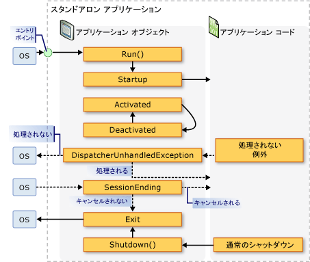
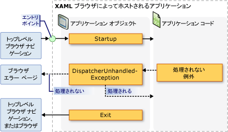

# <a name="application-management-overview"></a><span data-ttu-id="e7b44-102">アプリケーション管理の概要</span><span class="sxs-lookup"><span data-stu-id="e7b44-102">Application Management Overview</span></span>
<span data-ttu-id="e7b44-103">すべてのアプリケーションは、アプリケーションの実装と管理に適用される機能を共有することがよくあります。</span><span class="sxs-lookup"><span data-stu-id="e7b44-103">All applications tend to share a common set of functionality that applies to application implementation and management.</span></span> <span data-ttu-id="e7b44-104">このトピックでは、機能の概要を示します、<xref:System.Windows.Application>を作成して、アプリケーションを管理するためのクラスです。</span><span class="sxs-lookup"><span data-stu-id="e7b44-104">This topic provides an overview of the functionality in the <xref:System.Windows.Application> class for creating and managing applications.</span></span>  
   
  
## <a name="the-application-class"></a><span data-ttu-id="e7b44-105">Application クラス</span><span class="sxs-lookup"><span data-stu-id="e7b44-105">The Application Class</span></span>  
 <span data-ttu-id="e7b44-106">[!INCLUDE[TLA2#tla_wpf](../../../../includes/tla2sharptla-wpf-md.md)]にアプリケーション スコープの共通の機能がカプセル化されて、<xref:System.Windows.Application>クラスです。</span><span class="sxs-lookup"><span data-stu-id="e7b44-106">In [!INCLUDE[TLA2#tla_wpf](../../../../includes/tla2sharptla-wpf-md.md)], common application-scoped functionality is encapsulated in the <xref:System.Windows.Application> class.</span></span> <span data-ttu-id="e7b44-107"><xref:System.Windows.Application>クラスには、次の機能が含まれています。</span><span class="sxs-lookup"><span data-stu-id="e7b44-107">The <xref:System.Windows.Application> class includes the following functionality:</span></span>  
  
-   <span data-ttu-id="e7b44-108">アプリケーションの有効期間を追跡し、相互作用する。</span><span class="sxs-lookup"><span data-stu-id="e7b44-108">Tracking and interacting with application lifetime.</span></span>  
  
-   <span data-ttu-id="e7b44-109">コマンド ライン パラメーターを取得し、処理する。</span><span class="sxs-lookup"><span data-stu-id="e7b44-109">Retrieving and processing command-line parameters.</span></span>  
  
-   <span data-ttu-id="e7b44-110">未処理の例外を検出し、応答する。</span><span class="sxs-lookup"><span data-stu-id="e7b44-110">Detecting and responding to unhandled exceptions.</span></span>  
  
-   <span data-ttu-id="e7b44-111">アプリケーション スコープのプロパティと リソースを共有する。</span><span class="sxs-lookup"><span data-stu-id="e7b44-111">Sharing application-scope properties and resources.</span></span>  
  
-   <span data-ttu-id="e7b44-112">スタンドアロン アプリケーションのウィンドウを管理する。</span><span class="sxs-lookup"><span data-stu-id="e7b44-112">Managing windows in standalone applications.</span></span>  
  
-   <span data-ttu-id="e7b44-113">ナビゲーションを追跡し、管理する。</span><span class="sxs-lookup"><span data-stu-id="e7b44-113">Tracking and managing navigation.</span></span>  
  
<a name="The_Application_Class"></a>   
## <a name="how-to-perform-common-tasks-using-the-application-class"></a><span data-ttu-id="e7b44-114">アプリケーションのクラスを使用して一般的なタスクを実行する方法</span><span class="sxs-lookup"><span data-stu-id="e7b44-114">How to Perform Common Tasks Using the Application Class</span></span>  
 <span data-ttu-id="e7b44-115">すべての詳細の必要がないかどうか、<xref:System.Windows.Application>クラスでは、次の表の一般的なタスク<xref:System.Windows.Application>およびそれを達成する方法です。</span><span class="sxs-lookup"><span data-stu-id="e7b44-115">If you are not interested in all of the details of the <xref:System.Windows.Application> class, the following table lists some of the common tasks for <xref:System.Windows.Application> and how to accomplish them.</span></span> <span data-ttu-id="e7b44-116">関連する API とトピックを表示することによって、詳細情報とサンプル コードを参照できます。</span><span class="sxs-lookup"><span data-stu-id="e7b44-116">By viewing the related API and topics, you can find more information and sample code.</span></span>  
  
|<span data-ttu-id="e7b44-117">タスク</span><span class="sxs-lookup"><span data-stu-id="e7b44-117">Task</span></span>|<span data-ttu-id="e7b44-118">方法</span><span class="sxs-lookup"><span data-stu-id="e7b44-118">Approach</span></span>|  
|----------|--------------|  
|<span data-ttu-id="e7b44-119">現在のアプリケーションを表すオブジェクトを取得する</span><span class="sxs-lookup"><span data-stu-id="e7b44-119">Get an object that represents the current application</span></span>|<span data-ttu-id="e7b44-120"><xref:System.Windows.Application.Current%2A?displayProperty=nameWithType> プロパティを使用します。</span><span class="sxs-lookup"><span data-stu-id="e7b44-120">Use the <xref:System.Windows.Application.Current%2A?displayProperty=nameWithType> property.</span></span>|  
|<span data-ttu-id="e7b44-121">起動画面をアプリケーションに追加する</span><span class="sxs-lookup"><span data-stu-id="e7b44-121">Add a startup screen to an application</span></span>|<span data-ttu-id="e7b44-122">参照してください[WPF アプリケーションのスプラッシュ スクリーンを追加](../../../../docs/framework/wpf/app-development/how-to-add-a-splash-screen-to-a-wpf-application.md)です。</span><span class="sxs-lookup"><span data-stu-id="e7b44-122">See [Add a Splash Screen to a WPF Application](../../../../docs/framework/wpf/app-development/how-to-add-a-splash-screen-to-a-wpf-application.md).</span></span>|  
|<span data-ttu-id="e7b44-123">アプリケーションを起動する</span><span class="sxs-lookup"><span data-stu-id="e7b44-123">Start an application</span></span>|<span data-ttu-id="e7b44-124"><xref:System.Windows.Application.Run%2A?displayProperty=nameWithType> メソッドを使用します。</span><span class="sxs-lookup"><span data-stu-id="e7b44-124">Use the <xref:System.Windows.Application.Run%2A?displayProperty=nameWithType> method.</span></span>|  
|<span data-ttu-id="e7b44-125">アプリケーションを停止する</span><span class="sxs-lookup"><span data-stu-id="e7b44-125">Stop an application</span></span>|<span data-ttu-id="e7b44-126">使用して、<xref:System.Windows.Application.Shutdown%2A>のメソッド、<xref:System.Windows.Application.Current%2A?displayProperty=nameWithType>オブジェクト。</span><span class="sxs-lookup"><span data-stu-id="e7b44-126">Use the <xref:System.Windows.Application.Shutdown%2A> method of the <xref:System.Windows.Application.Current%2A?displayProperty=nameWithType> object.</span></span>|  
|<span data-ttu-id="e7b44-127">コマンド ラインから引数を取得する</span><span class="sxs-lookup"><span data-stu-id="e7b44-127">Get arguments from the command line</span></span>|<span data-ttu-id="e7b44-128">処理、<xref:System.Windows.Application.Startup?displayProperty=nameWithType>イベントと使用、<xref:System.Windows.StartupEventArgs.Args%2A?displayProperty=nameWithType>プロパティです。</span><span class="sxs-lookup"><span data-stu-id="e7b44-128">Handle the <xref:System.Windows.Application.Startup?displayProperty=nameWithType> event and use the <xref:System.Windows.StartupEventArgs.Args%2A?displayProperty=nameWithType> property.</span></span> <span data-ttu-id="e7b44-129">例については、次を参照してください。、<xref:System.Windows.Application.Startup?displayProperty=nameWithType>イベント。</span><span class="sxs-lookup"><span data-stu-id="e7b44-129">For an example, see the <xref:System.Windows.Application.Startup?displayProperty=nameWithType> event.</span></span>|  
|<span data-ttu-id="e7b44-130">アプリケーションの終了コードを取得し、設定する</span><span class="sxs-lookup"><span data-stu-id="e7b44-130">Get and set the application exit code</span></span>|<span data-ttu-id="e7b44-131">設定、<xref:System.Windows.ExitEventArgs.ApplicationExitCode%2A?displayProperty=nameWithType>プロパティに、<xref:System.Windows.Application.Exit?displayProperty=nameWithType>イベント ハンドラーまたは呼び出し、<xref:System.Windows.Application.Shutdown%2A>メソッドおよび整数を渡します。</span><span class="sxs-lookup"><span data-stu-id="e7b44-131">Set the <xref:System.Windows.ExitEventArgs.ApplicationExitCode%2A?displayProperty=nameWithType> property in the <xref:System.Windows.Application.Exit?displayProperty=nameWithType> event handler or call the <xref:System.Windows.Application.Shutdown%2A> method and pass in an integer.</span></span>|  
|<span data-ttu-id="e7b44-132">未処理の例外を検出し、応答する</span><span class="sxs-lookup"><span data-stu-id="e7b44-132">Detect and respond to unhandled exceptions</span></span>|<span data-ttu-id="e7b44-133">処理、<xref:System.Windows.Application.DispatcherUnhandledException>イベント。</span><span class="sxs-lookup"><span data-stu-id="e7b44-133">Handle the <xref:System.Windows.Application.DispatcherUnhandledException> event.</span></span>|  
|<span data-ttu-id="e7b44-134">アプリケーション スコープのリソースを取得し、設定する</span><span class="sxs-lookup"><span data-stu-id="e7b44-134">Get and set application-scoped resources</span></span>|<span data-ttu-id="e7b44-135"><xref:System.Windows.Application.Resources%2A?displayProperty=nameWithType> プロパティを使用します。</span><span class="sxs-lookup"><span data-stu-id="e7b44-135">Use the <xref:System.Windows.Application.Resources%2A?displayProperty=nameWithType> property.</span></span>|  
|<span data-ttu-id="e7b44-136">アプリケーション スコープのリソース ディクショナリを使用する</span><span class="sxs-lookup"><span data-stu-id="e7b44-136">Use an application-scope resource dictionary</span></span>|<span data-ttu-id="e7b44-137">参照してください[アプリケーション スコープのリソース ディクショナリを使用する](../../../../docs/framework/wpf/app-development/how-to-use-an-application-scope-resource-dictionary.md)です。</span><span class="sxs-lookup"><span data-stu-id="e7b44-137">See [Use an Application-Scope Resource Dictionary](../../../../docs/framework/wpf/app-development/how-to-use-an-application-scope-resource-dictionary.md).</span></span>|  
|<span data-ttu-id="e7b44-138">アプリケーション スコープのプロパティを取得し、設定する</span><span class="sxs-lookup"><span data-stu-id="e7b44-138">Get and set application-scoped properties</span></span>|<span data-ttu-id="e7b44-139"><xref:System.Windows.Application.Properties%2A?displayProperty=nameWithType> プロパティを使用します。</span><span class="sxs-lookup"><span data-stu-id="e7b44-139">Use the <xref:System.Windows.Application.Properties%2A?displayProperty=nameWithType> property.</span></span>|  
|<span data-ttu-id="e7b44-140">アプリケーションの状態を取得し、保存する</span><span class="sxs-lookup"><span data-stu-id="e7b44-140">Get and save an application's state</span></span>|<span data-ttu-id="e7b44-141">参照してください[永続化し、アプリケーション セッション間でのアプリケーション スコープのプロパティを復元](../../../../docs/framework/wpf/app-development/persist-and-restore-application-scope-properties.md)です。</span><span class="sxs-lookup"><span data-stu-id="e7b44-141">See [Persist and Restore Application-Scope Properties Across Application Sessions](../../../../docs/framework/wpf/app-development/persist-and-restore-application-scope-properties.md).</span></span>|  
|<span data-ttu-id="e7b44-142">リソース ファイル、コンテンツ ファイル、起点ファイルなど、コード以外のデータ ファイルを管理する。</span><span class="sxs-lookup"><span data-stu-id="e7b44-142">Manage non-code data files, including resource files, content files, and site-of-origin files.</span></span>|<span data-ttu-id="e7b44-143">参照してください[WPF アプリケーションのリソース、コンテンツ、およびデータ ファイル](../../../../docs/framework/wpf/app-development/wpf-application-resource-content-and-data-files.md)です。</span><span class="sxs-lookup"><span data-stu-id="e7b44-143">See [WPF Application Resource, Content, and Data Files](../../../../docs/framework/wpf/app-development/wpf-application-resource-content-and-data-files.md).</span></span>|  
|<span data-ttu-id="e7b44-144">スタンドアロン アプリケーションのウィンドウを管理する</span><span class="sxs-lookup"><span data-stu-id="e7b44-144">Manage windows in standalone applications</span></span>|<span data-ttu-id="e7b44-145">「[WPF ウィンドウの概要](../../../../docs/framework/wpf/app-development/wpf-windows-overview.md)」を参照してください。</span><span class="sxs-lookup"><span data-stu-id="e7b44-145">See [WPF Windows Overview](../../../../docs/framework/wpf/app-development/wpf-windows-overview.md).</span></span>|  
|<span data-ttu-id="e7b44-146">ナビゲーションを追跡し、管理する</span><span class="sxs-lookup"><span data-stu-id="e7b44-146">Track and manage navigation</span></span>|<span data-ttu-id="e7b44-147">参照してください[ナビゲーション概要](../../../../docs/framework/wpf/app-development/navigation-overview.md)です。</span><span class="sxs-lookup"><span data-stu-id="e7b44-147">See [Navigation Overview](../../../../docs/framework/wpf/app-development/navigation-overview.md).</span></span>|  
  
<a name="The_Application_Definition"></a>   
## <a name="the-application-definition"></a><span data-ttu-id="e7b44-148">アプリケーション定義</span><span class="sxs-lookup"><span data-stu-id="e7b44-148">The Application Definition</span></span>  
 <span data-ttu-id="e7b44-149">機能を利用する、<xref:System.Windows.Application>クラス、アプリケーション定義を実装する必要があります。</span><span class="sxs-lookup"><span data-stu-id="e7b44-149">To utilize the functionality of the <xref:System.Windows.Application> class, you must implement an application definition.</span></span> <span data-ttu-id="e7b44-150">A[!INCLUDE[TLA2#tla_wpf](../../../../includes/tla2sharptla-wpf-md.md)]アプリケーション定義から派生するクラスは、<xref:System.Windows.Application>で特別な構成[!INCLUDE[TLA#tla_msbuild](../../../../includes/tlasharptla-msbuild-md.md)]設定します。</span><span class="sxs-lookup"><span data-stu-id="e7b44-150">A [!INCLUDE[TLA2#tla_wpf](../../../../includes/tla2sharptla-wpf-md.md)] application definition is a class that derives from <xref:System.Windows.Application> and is configured with a special [!INCLUDE[TLA#tla_msbuild](../../../../includes/tlasharptla-msbuild-md.md)] setting.</span></span>  
  
### <a name="implementing-an-application-definition"></a><span data-ttu-id="e7b44-151">アプリケーション定義の実装</span><span class="sxs-lookup"><span data-stu-id="e7b44-151">Implementing an Application Definition</span></span>  
 <span data-ttu-id="e7b44-152">一般的な[!INCLUDE[TLA2#tla_wpf](../../../../includes/tla2sharptla-wpf-md.md)]アプリケーション定義は、マークアップと分離コードの両方を使用して実装されます。</span><span class="sxs-lookup"><span data-stu-id="e7b44-152">A typical [!INCLUDE[TLA2#tla_wpf](../../../../includes/tla2sharptla-wpf-md.md)] application definition is implemented using both markup and code-behind.</span></span> <span data-ttu-id="e7b44-153">これにより、マークアップを使用して、アプリケーションのプロパティやリソースを宣言によって設定したり、イベントを登録したりでき、分離コードでイベントを処理し、アプリケーション固有の動作を実装することができます。</span><span class="sxs-lookup"><span data-stu-id="e7b44-153">This allows you to use markup to declaratively set application properties, resources, and register events, while handling events and implementing application-specific behavior in code-behind.</span></span>  
  
 <span data-ttu-id="e7b44-154">次の例では、マークアップと分離コードの両方を使用してアプリケーション定義を実装する方法を示します。</span><span class="sxs-lookup"><span data-stu-id="e7b44-154">The following example shows how to implement an application definition using both markup and code-behind:</span></span>  
  
 [!code-xaml[ApplicationSnippets#ApplicationXAML](../../../../samples/snippets/csharp/VS_Snippets_Wpf/ApplicationSnippets/CSharp/App.xaml#applicationxaml)]  
  
 [!code-csharp[ApplicationSnippets#ApplicationCODEBEHIND](../../../../samples/snippets/csharp/VS_Snippets_Wpf/ApplicationSnippets/CSharp/App.xaml.cs#applicationcodebehind)]
 [!code-vb[ApplicationSnippets#ApplicationCODEBEHIND](../../../../samples/snippets/visualbasic/VS_Snippets_Wpf/ApplicationSnippets/visualbasic/application.xaml.vb#applicationcodebehind)]  
  
 <span data-ttu-id="e7b44-155">マークアップ ファイルと分離コード ファイルを連携させるには、次のようにする必要があります。</span><span class="sxs-lookup"><span data-stu-id="e7b44-155">To allow a markup file and code-behind file to work together, the following needs to happen:</span></span>  
  
-   <span data-ttu-id="e7b44-156">マークアップで、`Application`要素を含める必要があります、`x:Class`属性。</span><span class="sxs-lookup"><span data-stu-id="e7b44-156">In markup, the `Application` element must include the `x:Class` attribute.</span></span> <span data-ttu-id="e7b44-157">アプリケーションのビルド時の存在`x:Class`マークアップ ファイルが原因となって[!INCLUDE[TLA2#tla_msbuild](../../../../includes/tla2sharptla-msbuild-md.md)]を作成する、`partial`から派生したクラス<xref:System.Windows.Application>によって指定される名前を持つ、`x:Class`属性。</span><span class="sxs-lookup"><span data-stu-id="e7b44-157">When the application is built, the existence of `x:Class` in the markup file causes [!INCLUDE[TLA2#tla_msbuild](../../../../includes/tla2sharptla-msbuild-md.md)] to create a `partial` class that derives from <xref:System.Windows.Application> and has the name that is specified by the `x:Class` attribute.</span></span> <span data-ttu-id="e7b44-158">追加が必要です、[!INCLUDE[TLA2#tla_xml](../../../../includes/tla2sharptla-xml-md.md)]の名前空間宣言、[!INCLUDE[TLA2#tla_xaml](../../../../includes/tla2sharptla-xaml-md.md)]スキーマ ( `xmlns:x="http://schemas.microsoft.com/winfx/2006/xaml"` )。</span><span class="sxs-lookup"><span data-stu-id="e7b44-158">This requires the addition of an [!INCLUDE[TLA2#tla_xml](../../../../includes/tla2sharptla-xml-md.md)] namespace declaration for the [!INCLUDE[TLA2#tla_xaml](../../../../includes/tla2sharptla-xaml-md.md)] schema ( `xmlns:x="http://schemas.microsoft.com/winfx/2006/xaml"` ).</span></span>  
  
-   <span data-ttu-id="e7b44-159">分離コード クラスがある必要があります、`partial`によって指定される同じ名前のクラス、`x:Class`マークアップ属性し、から派生する必要があります<xref:System.Windows.Application>です。</span><span class="sxs-lookup"><span data-stu-id="e7b44-159">In code-behind, the class must be a `partial` class with the same name that is specified by the `x:Class` attribute in markup and must derive from <xref:System.Windows.Application>.</span></span> <span data-ttu-id="e7b44-160">これにより、分離コード ファイルに関連付けられる、`partial`アプリケーションのビルド時に、マークアップ ファイルに対して生成されるクラス (を参照してください[WPF アプリケーションのビルド](../../../../docs/framework/wpf/app-development/building-a-wpf-application-wpf.md))。</span><span class="sxs-lookup"><span data-stu-id="e7b44-160">This allows the code-behind file to be associated with the `partial` class that is generated for the markup file when the application is built (see [Building a WPF Application](../../../../docs/framework/wpf/app-development/building-a-wpf-application-wpf.md)).</span></span>  
  
> [!NOTE]
>  <span data-ttu-id="e7b44-161">使用して、新しい WPF アプリケーション プロジェクトまたは WPF ブラウザー アプリケーション プロジェクトを作成する場合[!INCLUDE[TLA#tla_visualstu](../../../../includes/tlasharptla-visualstu-md.md)]、アプリケーション定義が既定では含まれており、マークアップと分離コードの両方を使用して定義します。</span><span class="sxs-lookup"><span data-stu-id="e7b44-161">When you create a new WPF Application project or WPF Browser Application project using [!INCLUDE[TLA#tla_visualstu](../../../../includes/tlasharptla-visualstu-md.md)], an application definition is included by default and is defined using both markup and code-behind.</span></span>  
  
 <span data-ttu-id="e7b44-162">このコードは、アプリケーション定義を実装するために最低限必要です。</span><span class="sxs-lookup"><span data-stu-id="e7b44-162">This code is the minimum that is required to implement an application definition.</span></span> <span data-ttu-id="e7b44-163">ただし、追加の[!INCLUDE[TLA2#tla_msbuild](../../../../includes/tla2sharptla-msbuild-md.md)]構成する必要がありますを構築して、アプリケーションを実行する前にアプリケーション定義します。</span><span class="sxs-lookup"><span data-stu-id="e7b44-163">However, an additional [!INCLUDE[TLA2#tla_msbuild](../../../../includes/tla2sharptla-msbuild-md.md)] configuration needs to be made to the application definition before building and running the application.</span></span>  
  
### <a name="configuring-the-application-definition-for-msbuild"></a><span data-ttu-id="e7b44-164">MSBuild 用のアプリケーション定義の構成</span><span class="sxs-lookup"><span data-stu-id="e7b44-164">Configuring the Application Definition for MSBuild</span></span>  
 <span data-ttu-id="e7b44-165">スタンドアロン アプリケーションと[!INCLUDE[TLA#tla_xbap#plural](../../../../includes/tlasharptla-xbapsharpplural-md.md)]を実行する前に、インフラストラクチャの特定のレベルの実装を必要とします。</span><span class="sxs-lookup"><span data-stu-id="e7b44-165">Standalone applications and [!INCLUDE[TLA#tla_xbap#plural](../../../../includes/tlasharptla-xbapsharpplural-md.md)] require the implementation of a certain level of infrastructure before they can run.</span></span> <span data-ttu-id="e7b44-166">このインフラストラクチャの最も重要な部分は、エントリ ポイントです。</span><span class="sxs-lookup"><span data-stu-id="e7b44-166">The most important part of this infrastructure is the entry point.</span></span> <span data-ttu-id="e7b44-167">ユーザーがアプリケーションを起動するとき、オペレーティング システムはエントリ ポイントを呼び出します。これは、アプリケーションを起動するための、よく知られている機能です。</span><span class="sxs-lookup"><span data-stu-id="e7b44-167">When an application is launched by a user, the operating system calls the entry point, which is a well-known function for starting applications.</span></span>  
  
 <span data-ttu-id="e7b44-168">従来、開発者は、テクノロジに応じて、このコードの一部または全部を自分で記述する必要がありました。</span><span class="sxs-lookup"><span data-stu-id="e7b44-168">Traditionally, developers have needed to write some or all of this code for themselves, depending on the technology.</span></span> <span data-ttu-id="e7b44-169">ただし、[!INCLUDE[TLA2#tla_wpf](../../../../includes/tla2sharptla-wpf-md.md)]として、アプリケーション定義のマークアップ ファイルが構成されている場合のこのコードを生成、 [!INCLUDE[TLA2#tla_msbuild](../../../../includes/tla2sharptla-msbuild-md.md)] `ApplicationDefinition`項目を次に示すように[!INCLUDE[TLA2#tla_msbuild](../../../../includes/tla2sharptla-msbuild-md.md)]プロジェクト ファイル。</span><span class="sxs-lookup"><span data-stu-id="e7b44-169">However, [!INCLUDE[TLA2#tla_wpf](../../../../includes/tla2sharptla-wpf-md.md)] generates this code for you when the markup file of your application definition is configured as an [!INCLUDE[TLA2#tla_msbuild](../../../../includes/tla2sharptla-msbuild-md.md)]`ApplicationDefinition` item, as shown in the following [!INCLUDE[TLA2#tla_msbuild](../../../../includes/tla2sharptla-msbuild-md.md)] project file:</span></span>  
  
```xml  
<Project   
  DefaultTargets="Build"  
                        xmlns="http://schemas.microsoft.com/developer/msbuild/2003">  
  ...  
  <ApplicationDefinition Include="App.xaml" />  
  <Compile Include="App.xaml.cs" />  
  ...  
</Project>  
```  
  
 <span data-ttu-id="e7b44-170">としてマークされている分離コード ファイルにコードが含まれているため、 [!INCLUDE[TLA2#tla_msbuild](../../../../includes/tla2sharptla-msbuild-md.md)] `Compile`アイテムのアイテムとしては通常の動作です。</span><span class="sxs-lookup"><span data-stu-id="e7b44-170">Because the code-behind file contains code, it is marked as an [!INCLUDE[TLA2#tla_msbuild](../../../../includes/tla2sharptla-msbuild-md.md)]`Compile` item, as is normal.</span></span>  
  
 <span data-ttu-id="e7b44-171">これらのアプリケーション[!INCLUDE[TLA2#tla_msbuild](../../../../includes/tla2sharptla-msbuild-md.md)]マークアップと分離コード ファイルにアプリケーション定義の構成により[!INCLUDE[TLA2#tla_msbuild](../../../../includes/tla2sharptla-msbuild-md.md)]次のようにコードを生成します。</span><span class="sxs-lookup"><span data-stu-id="e7b44-171">The application of these [!INCLUDE[TLA2#tla_msbuild](../../../../includes/tla2sharptla-msbuild-md.md)] configurations to the markup and code-behind files of an application definition causes [!INCLUDE[TLA2#tla_msbuild](../../../../includes/tla2sharptla-msbuild-md.md)] to generate code like the following:</span></span>  
  
 [!code-csharp[AppDefAugSnippets#AppDefAugCODE1](../../../../samples/snippets/csharp/VS_Snippets_Wpf/AppDefAugSnippets/CSharp/App.cs#appdefaugcode1)]
 [!code-vb[AppDefAugSnippets#AppDefAugCODE1](../../../../samples/snippets/visualbasic/VS_Snippets_Wpf/AppDefAugSnippets/VisualBasic/App.vb#appdefaugcode1)]  
[!code-csharp[AppDefAugSnippets#AppDefAugCODE2](../../../../samples/snippets/csharp/VS_Snippets_Wpf/AppDefAugSnippets/CSharp/App.cs#appdefaugcode2)]
[!code-vb[AppDefAugSnippets#AppDefAugCODE2](../../../../samples/snippets/visualbasic/VS_Snippets_Wpf/AppDefAugSnippets/VisualBasic/App.vb#appdefaugcode2)]  
  
 <span data-ttu-id="e7b44-172">結果のコードは、アプリケーション定義のエントリ ポイント メソッドが含まれる追加のインフラストラクチャ コードを拡張`Main`です。</span><span class="sxs-lookup"><span data-stu-id="e7b44-172">The resulting code augments your application definition with additional infrastructure code, which includes the entry-point method `Main`.</span></span> <span data-ttu-id="e7b44-173"><xref:System.STAThreadAttribute>属性に適用する、`Main`ことを示すメソッド メイン[!INCLUDE[TLA2#tla_ui](../../../../includes/tla2sharptla-ui-md.md)]のスレッド、[!INCLUDE[TLA2#tla_wpf](../../../../includes/tla2sharptla-wpf-md.md)]アプリケーションは STA スレッドが必要な[!INCLUDE[TLA2#tla_wpf](../../../../includes/tla2sharptla-wpf-md.md)]アプリケーションです。</span><span class="sxs-lookup"><span data-stu-id="e7b44-173">The <xref:System.STAThreadAttribute> attribute is applied to the `Main` method to indicate that the main [!INCLUDE[TLA2#tla_ui](../../../../includes/tla2sharptla-ui-md.md)] thread for the [!INCLUDE[TLA2#tla_wpf](../../../../includes/tla2sharptla-wpf-md.md)] application is an STA thread, which is required for [!INCLUDE[TLA2#tla_wpf](../../../../includes/tla2sharptla-wpf-md.md)] applications.</span></span> <span data-ttu-id="e7b44-174">呼び出されると、`Main`の新しいインスタンスを作成`App`呼び出す前に、`InitializeComponent`マークアップで、イベントを登録し、プロパティを設定するメソッドが実装されます。</span><span class="sxs-lookup"><span data-stu-id="e7b44-174">When called, `Main` creates a new instance of `App` before calling the `InitializeComponent` method to register the events and set the properties that are implemented in markup.</span></span> <span data-ttu-id="e7b44-175">`InitializeComponent`が生成された、明示的に呼び出す必要はありません`InitializeComponent`に対して実行するようにアプリケーション定義から<xref:System.Windows.Controls.Page>と<xref:System.Windows.Window>実装します。</span><span class="sxs-lookup"><span data-stu-id="e7b44-175">Because `InitializeComponent` is generated for you, you don't need to explicitly call `InitializeComponent` from an application definition like you do for <xref:System.Windows.Controls.Page> and <xref:System.Windows.Window> implementations.</span></span> <span data-ttu-id="e7b44-176">最後に、<xref:System.Windows.Application.Run%2A>メソッドが呼び出されてアプリケーションを起動します。</span><span class="sxs-lookup"><span data-stu-id="e7b44-176">Finally, the <xref:System.Windows.Application.Run%2A> method is called to start the application.</span></span>  
  
<a name="Getting_the_Current_Application"></a>   
## <a name="getting-the-current-application"></a><span data-ttu-id="e7b44-177">現在のアプリケーションの取得</span><span class="sxs-lookup"><span data-stu-id="e7b44-177">Getting the Current Application</span></span>  
 <span data-ttu-id="e7b44-178">の機能、<xref:System.Windows.Application>クラスは、アプリケーション全体で共有されるのインスタンスは 1 つだけ指定できます、<xref:System.Windows.Application>あたりクラス<xref:System.AppDomain>です。</span><span class="sxs-lookup"><span data-stu-id="e7b44-178">Because the functionality of the <xref:System.Windows.Application> class are shared across an application, there can be only one instance of the <xref:System.Windows.Application> class per <xref:System.AppDomain>.</span></span> <span data-ttu-id="e7b44-179">これには、適用する、<xref:System.Windows.Application>クラスがシングルトン クラスとして実装されている (を参照してください[(C#) を実装するシングルトン](http://go.microsoft.com/fwlink/?LinkId=100567))、それ自体の 1 つのインスタンスを作成し、提供する共有を使ってアクセス、 `static` <xref:System.Windows.Application.Current%2A>プロパティ。</span><span class="sxs-lookup"><span data-stu-id="e7b44-179">To enforce this, the <xref:System.Windows.Application> class is implemented as a singleton class (see [Implementing Singleton in C#](http://go.microsoft.com/fwlink/?LinkId=100567)), which creates a single instance of itself and provides shared access to it with the `static`<xref:System.Windows.Application.Current%2A> property.</span></span>  
  
 <span data-ttu-id="e7b44-180">次のコードへの参照を取得する方法を示しています、<xref:System.Windows.Application>現在のオブジェクト<xref:System.AppDomain>です。</span><span class="sxs-lookup"><span data-stu-id="e7b44-180">The following code shows how to acquire a reference to the <xref:System.Windows.Application> object for the current <xref:System.AppDomain>.</span></span>  
  
 [!code-csharp[ApplicationManagementOverviewSnippets#GetCurrentAppCODE](../../../../samples/snippets/csharp/VS_Snippets_Wpf/ApplicationManagementOverviewSnippets/CSharp/MainWindow.xaml.cs#getcurrentappcode)]
 [!code-vb[ApplicationManagementOverviewSnippets#GetCurrentAppCODE](../../../../samples/snippets/visualbasic/VS_Snippets_Wpf/ApplicationManagementOverviewSnippets/VisualBasic/MainWindow.xaml.vb#getcurrentappcode)]  
  
 <span data-ttu-id="e7b44-181"><xref:System.Windows.Application.Current%2A>インスタンスへの参照を返します、<xref:System.Windows.Application>クラスです。</span><span class="sxs-lookup"><span data-stu-id="e7b44-181"><xref:System.Windows.Application.Current%2A> returns a reference to an instance of the <xref:System.Windows.Application> class.</span></span> <span data-ttu-id="e7b44-182">参照の場合、<xref:System.Windows.Application>派生クラスの値をキャストする必要があります、<xref:System.Windows.Application.Current%2A>プロパティ、次の例で示すようにします。</span><span class="sxs-lookup"><span data-stu-id="e7b44-182">If you want a reference to your <xref:System.Windows.Application> derived class you must cast the value of the <xref:System.Windows.Application.Current%2A> property, as shown in the following example.</span></span>  
  
 [!code-csharp[ApplicationManagementOverviewSnippets#GetSTCurrentAppCODE](../../../../samples/snippets/csharp/VS_Snippets_Wpf/ApplicationManagementOverviewSnippets/CSharp/MainWindow.xaml.cs#getstcurrentappcode)]
 [!code-vb[ApplicationManagementOverviewSnippets#GetSTCurrentAppCODE](../../../../samples/snippets/visualbasic/VS_Snippets_Wpf/ApplicationManagementOverviewSnippets/VisualBasic/MainWindow.xaml.vb#getstcurrentappcode)]  
  
 <span data-ttu-id="e7b44-183">値を検査する<xref:System.Windows.Application.Current%2A>の有効期間のどの時点でも、<xref:System.Windows.Application>オブジェクト。</span><span class="sxs-lookup"><span data-stu-id="e7b44-183">You can inspect the value of <xref:System.Windows.Application.Current%2A> at any point in the lifetime of an <xref:System.Windows.Application> object.</span></span> <span data-ttu-id="e7b44-184">ただし、注意が必要です。</span><span class="sxs-lookup"><span data-stu-id="e7b44-184">However, you should be careful.</span></span> <span data-ttu-id="e7b44-185">後に、<xref:System.Windows.Application>クラスをインスタンス化は、実行する期間の状態、<xref:System.Windows.Application>オブジェクトに一貫性がありません。</span><span class="sxs-lookup"><span data-stu-id="e7b44-185">After the <xref:System.Windows.Application> class is instantiated, there is a period during which the state of the <xref:System.Windows.Application> object is inconsistent.</span></span> <span data-ttu-id="e7b44-186">この期間中に<xref:System.Windows.Application>を実行する、さまざまな初期化タスクを実行するには、コードで必要なアプリケーションのインフラストラクチャを確立する、プロパティの設定、イベントを登録するなどです。</span><span class="sxs-lookup"><span data-stu-id="e7b44-186">During this period, <xref:System.Windows.Application> is performing the various initialization tasks that are required by your code to run, including establishing application infrastructure, setting properties, and registering events.</span></span> <span data-ttu-id="e7b44-187">使用しようとする場合、<xref:System.Windows.Application>コードがあります。 この期間中にオブジェクトの予期しない結果が、さまざまなに依存している場合に特に<xref:System.Windows.Application>プロパティを設定します。</span><span class="sxs-lookup"><span data-stu-id="e7b44-187">If you try to use the <xref:System.Windows.Application> object during this period, your code may have unexpected results, particularly if it depends on the various <xref:System.Windows.Application> properties being set.</span></span>  
  
 <span data-ttu-id="e7b44-188">ときに<xref:System.Windows.Application>、初期化作業を完了する有効期間にわたってが実際に開始します。</span><span class="sxs-lookup"><span data-stu-id="e7b44-188">When <xref:System.Windows.Application> completes its initialization work, its lifetime truly begins.</span></span>  
  
<a name="Application_Lifetime"></a>   
## <a name="application-lifetime"></a><span data-ttu-id="e7b44-189">アプリケーションの有効期間</span><span class="sxs-lookup"><span data-stu-id="e7b44-189">Application Lifetime</span></span>  
 <span data-ttu-id="e7b44-190">有効期間、[!INCLUDE[TLA2#tla_wpf](../../../../includes/tla2sharptla-wpf-md.md)]によって発生するいくつかのイベントによってアプリケーションがマークされている<xref:System.Windows.Application>アプリケーションが開始された時点を通知するアクティブ化され、非アクティブ化し、シャット ダウンされました。</span><span class="sxs-lookup"><span data-stu-id="e7b44-190">The lifetime of a [!INCLUDE[TLA2#tla_wpf](../../../../includes/tla2sharptla-wpf-md.md)] application is marked by several events that are raised by <xref:System.Windows.Application> to let you know when your application has started, has been activated and deactivated, and has been shut down.</span></span>  
  
  
<a name="Splash_Screen"></a>   
### <a name="splash-screen"></a><span data-ttu-id="e7b44-191">スプラッシュ スクリーン</span><span class="sxs-lookup"><span data-stu-id="e7b44-191">Splash Screen</span></span>  
 <span data-ttu-id="e7b44-192">以降では、 [!INCLUDE[net_v35SP1_short](../../../../includes/net-v35sp1-short-md.md)]、起動時のウィンドウで使用するイメージを指定することができますか*スプラッシュ スクリーン*です。</span><span class="sxs-lookup"><span data-stu-id="e7b44-192">Starting in the [!INCLUDE[net_v35SP1_short](../../../../includes/net-v35sp1-short-md.md)], you can specify an image to be used in a startup window, or *splash screen*.</span></span> <span data-ttu-id="e7b44-193"><xref:System.Windows.SplashScreen>クラスでは、簡単に、アプリケーションの読み込み中に、[スタートアップ] ウィンドウを表示します。</span><span class="sxs-lookup"><span data-stu-id="e7b44-193">The <xref:System.Windows.SplashScreen> class makes it easy to display a startup window while your application is loading.</span></span> <span data-ttu-id="e7b44-194"><xref:System.Windows.SplashScreen>ウィンドウが作成され、前に表示<xref:System.Windows.Application.Run%2A>と呼びます。</span><span class="sxs-lookup"><span data-stu-id="e7b44-194">The <xref:System.Windows.SplashScreen> window is created and shown before <xref:System.Windows.Application.Run%2A> is called.</span></span> <span data-ttu-id="e7b44-195">詳細については、次を参照してください。[アプリケーションの起動時間](../../../../docs/framework/wpf/advanced/application-startup-time.md)と[WPF アプリケーションのスプラッシュ スクリーンを追加](../../../../docs/framework/wpf/app-development/how-to-add-a-splash-screen-to-a-wpf-application.md)です。</span><span class="sxs-lookup"><span data-stu-id="e7b44-195">For more information, see [Application Startup Time](../../../../docs/framework/wpf/advanced/application-startup-time.md) and [Add a Splash Screen to a WPF Application](../../../../docs/framework/wpf/app-development/how-to-add-a-splash-screen-to-a-wpf-application.md).</span></span>  
  
<a name="Starting_an_Application"></a>   
### <a name="starting-an-application"></a><span data-ttu-id="e7b44-196">アプリケーションの起動</span><span class="sxs-lookup"><span data-stu-id="e7b44-196">Starting an Application</span></span>  
 <span data-ttu-id="e7b44-197">後に<xref:System.Windows.Application.Run%2A>が呼び出されたと、アプリケーションが初期化される、アプリケーションを実行する準備ができます。</span><span class="sxs-lookup"><span data-stu-id="e7b44-197">After <xref:System.Windows.Application.Run%2A> is called and the application is initialized, the application is ready to run.</span></span> <span data-ttu-id="e7b44-198">ときにこの時点で表されますが、<xref:System.Windows.Application.Startup>イベントが発生します。</span><span class="sxs-lookup"><span data-stu-id="e7b44-198">This moment is signified when the <xref:System.Windows.Application.Startup> event is raised:</span></span>  
  
 [!code-csharp[ApplicationStartupSnippets#StartupCODEBEHIND1](../../../../samples/snippets/csharp/VS_Snippets_Wpf/ApplicationStartupSnippets/CSharp/App.xaml.cs#startupcodebehind1)]
 [!code-vb[ApplicationStartupSnippets#StartupCODEBEHIND1](../../../../samples/snippets/visualbasic/VS_Snippets_Wpf/ApplicationStartupSnippets/visualbasic/application.xaml.vb#startupcodebehind1)]  
[!code-csharp[ApplicationStartupSnippets#StartupCODEBEHIND2](../../../../samples/snippets/csharp/VS_Snippets_Wpf/ApplicationStartupSnippets/CSharp/App.xaml.cs#startupcodebehind2)]
[!code-vb[ApplicationStartupSnippets#StartupCODEBEHIND2](../../../../samples/snippets/visualbasic/VS_Snippets_Wpf/ApplicationStartupSnippets/visualbasic/application.xaml.vb#startupcodebehind2)]  
  
 <span data-ttu-id="e7b44-199">この時点で、アプリケーションの有効期間を行うには、最も一般的なことは表示、[!INCLUDE[TLA2#tla_ui](../../../../includes/tla2sharptla-ui-md.md)]です。</span><span class="sxs-lookup"><span data-stu-id="e7b44-199">At this point in an application's lifetime, the most common thing to do is to show a [!INCLUDE[TLA2#tla_ui](../../../../includes/tla2sharptla-ui-md.md)].</span></span>  
  
<a name="Showing_a_User_Interface"></a>   
### <a name="showing-a-user-interface"></a><span data-ttu-id="e7b44-200">ユーザー インターフェイスの表示</span><span class="sxs-lookup"><span data-stu-id="e7b44-200">Showing a User Interface</span></span>  
 <span data-ttu-id="e7b44-201">ほとんどのスタンドアロン[!INCLUDE[TLA2#tla_mswin](../../../../includes/tla2sharptla-mswin-md.md)]アプリケーションを開く、<xref:System.Windows.Window>開始時期を実行しています。</span><span class="sxs-lookup"><span data-stu-id="e7b44-201">Most standalone [!INCLUDE[TLA2#tla_mswin](../../../../includes/tla2sharptla-mswin-md.md)] applications open a <xref:System.Windows.Window> when they begin running.</span></span> <span data-ttu-id="e7b44-202"><xref:System.Windows.Application.Startup>次のコードに示すように、イベント ハンドラーは 1 つの場所がこれを行うことができます。</span><span class="sxs-lookup"><span data-stu-id="e7b44-202">The <xref:System.Windows.Application.Startup> event handler is one location from which you can do this, as demonstrated by the following code.</span></span>  
  
 [!code-xaml[AppShowWindowHardSnippets#StartupEventMARKUP](../../../../samples/snippets/csharp/VS_Snippets_Wpf/AppShowWindowHardSnippets/CSharp/App.xaml#startupeventmarkup)]  
  
 [!code-csharp[AppShowWindowHardSnippets#StartupEventCODEBEHIND](../../../../samples/snippets/csharp/VS_Snippets_Wpf/AppShowWindowHardSnippets/CSharp/App.xaml.cs#startupeventcodebehind)]
 [!code-vb[AppShowWindowHardSnippets#StartupEventCODEBEHIND](../../../../samples/snippets/visualbasic/VS_Snippets_Wpf/AppShowWindowHardSnippets/VisualBasic/Application.xaml.vb#startupeventcodebehind)]  
  
> [!NOTE]
>  <span data-ttu-id="e7b44-203">最初の<xref:System.Windows.Window>スタンドアロンでインスタンス化するアプリケーションでは、既定ではアプリケーションのメイン ウィンドウがします。</span><span class="sxs-lookup"><span data-stu-id="e7b44-203">The first <xref:System.Windows.Window> to be instantiated in a standalone application becomes the main application window by default.</span></span> <span data-ttu-id="e7b44-204">これは、<xref:System.Windows.Window>によってオブジェクトが参照される、<xref:System.Windows.Application.MainWindow%2A?displayProperty=nameWithType>プロパティです。</span><span class="sxs-lookup"><span data-stu-id="e7b44-204">This <xref:System.Windows.Window> object is referenced by the <xref:System.Windows.Application.MainWindow%2A?displayProperty=nameWithType> property.</span></span> <span data-ttu-id="e7b44-205">値、<xref:System.Windows.Application.MainWindow%2A>場合よりも、別のウィンドウにプロパティをプログラムで変更できますをインスタンス化<xref:System.Windows.Window>メイン ウィンドウをする必要があります。</span><span class="sxs-lookup"><span data-stu-id="e7b44-205">The value of the <xref:System.Windows.Application.MainWindow%2A> property can be changed programmatically if a different window than the first instantiated <xref:System.Windows.Window> should be the main window.</span></span>  
  
 <span data-ttu-id="e7b44-206">ときに、[!INCLUDE[TLA2#tla_xbap](../../../../includes/tla2sharptla-xbap-md.md)]最初起動すると、これはほとんどの場合に移動、<xref:System.Windows.Controls.Page>です。</span><span class="sxs-lookup"><span data-stu-id="e7b44-206">When an [!INCLUDE[TLA2#tla_xbap](../../../../includes/tla2sharptla-xbap-md.md)] first starts, it will most likely navigate to a <xref:System.Windows.Controls.Page>.</span></span> <span data-ttu-id="e7b44-207">これを次のコードに示します。</span><span class="sxs-lookup"><span data-stu-id="e7b44-207">This is shown in the following code.</span></span>  
  
 [!code-xaml[XBAPAppStartupSnippets#StartupXBAPMARKUP](../../../../samples/snippets/csharp/VS_Snippets_Wpf/XBAPAppStartupSnippets/CSharp/App.xaml#startupxbapmarkup)]  
  
 [!code-csharp[XBAPAppStartupSnippets#StartupXBAPCODEBEHIND](../../../../samples/snippets/csharp/VS_Snippets_Wpf/XBAPAppStartupSnippets/CSharp/App.xaml.cs#startupxbapcodebehind)]
 [!code-vb[XBAPAppStartupSnippets#StartupXBAPCODEBEHIND](../../../../samples/snippets/visualbasic/VS_Snippets_Wpf/XBAPAppStartupSnippets/VisualBasic/Application.xaml.vb#startupxbapcodebehind)]  
  
 <span data-ttu-id="e7b44-208">処理する場合<xref:System.Windows.Application.Startup>のみ開く、<xref:System.Windows.Window>かに移動して、 <xref:System.Windows.Controls.Page>、設定することができます、`StartupUri`マークアップの属性の代わりにします。</span><span class="sxs-lookup"><span data-stu-id="e7b44-208">If you handle <xref:System.Windows.Application.Startup> to only open a <xref:System.Windows.Window> or navigate to a <xref:System.Windows.Controls.Page>, you can set the `StartupUri` attribute in markup instead.</span></span>  
  
 <span data-ttu-id="e7b44-209">次の例を使用する方法を示しています、<xref:System.Windows.Application.StartupUri%2A>を開くにはスタンドアロン アプリケーションから、<xref:System.Windows.Window>です。</span><span class="sxs-lookup"><span data-stu-id="e7b44-209">The following example shows how to use the <xref:System.Windows.Application.StartupUri%2A> from a standalone application to open a <xref:System.Windows.Window>.</span></span>  
  
 [!code-xaml[ApplicationManagementOverviewSnippets#OverviewStartupUriMARKUP](../../../../samples/snippets/csharp/VS_Snippets_Wpf/ApplicationManagementOverviewSnippets/CSharp/App.xaml#overviewstartupurimarkup)]  
  
 <span data-ttu-id="e7b44-210">次の例は、使用する方法を示しています。<xref:System.Windows.Application.StartupUri%2A>から、[!INCLUDE[TLA2#tla_xbap](../../../../includes/tla2sharptla-xbap-md.md)]に移動する、<xref:System.Windows.Controls.Page>です。</span><span class="sxs-lookup"><span data-stu-id="e7b44-210">The following example shows how to use <xref:System.Windows.Application.StartupUri%2A> from an [!INCLUDE[TLA2#tla_xbap](../../../../includes/tla2sharptla-xbap-md.md)] to navigate to a <xref:System.Windows.Controls.Page>.</span></span>  
  
 [!code-xaml[PageSnippets#XBAPStartupUriMARKUP](../../../../samples/snippets/csharp/VS_Snippets_Wpf/PageSnippets/CSharp/App.xaml#xbapstartupurimarkup)]  
  
 <span data-ttu-id="e7b44-211">このマークアップは、ウィンドウを開くことについて、前のコードと同じ効果があります。</span><span class="sxs-lookup"><span data-stu-id="e7b44-211">This markup has the same effect as the previous code for opening a window.</span></span>  
  
> [!NOTE]
>  <span data-ttu-id="e7b44-212">ナビゲーションの詳細については、次を参照してください。[ナビゲーション概要](../../../../docs/framework/wpf/app-development/navigation-overview.md)です。</span><span class="sxs-lookup"><span data-stu-id="e7b44-212">For more information on navigation, see [Navigation Overview](../../../../docs/framework/wpf/app-development/navigation-overview.md).</span></span>  
  
 <span data-ttu-id="e7b44-213">処理する必要があります、<xref:System.Windows.Application.Startup>イベントを開くには、<xref:System.Windows.Window>既定以外のコンス トラクターを使用してそれをインスタンス化する必要がありますまたはそのプロパティを設定または表示するには、前にそのイベントをサブスクライブする必要がありますまたはコマンドライン引数を処理する必要がある場合ですアプリケーションを起動したときに指定されました。</span><span class="sxs-lookup"><span data-stu-id="e7b44-213">You need to handle the <xref:System.Windows.Application.Startup> event to open a <xref:System.Windows.Window> if you need to instantiate it using a non-default constructor, or you need to set its properties or subscribe to its events before showing it, or you need to process any command-line arguments that were supplied when the application was launched.</span></span>  
  
<a name="Processing_Command_Line_Arguments"></a>   
### <a name="processing-command-line-arguments"></a><span data-ttu-id="e7b44-214">コマンド ライン引数の処理</span><span class="sxs-lookup"><span data-stu-id="e7b44-214">Processing Command-Line Arguments</span></span>  
 <span data-ttu-id="e7b44-215">[!INCLUDE[TLA2#tla_mswin](../../../../includes/tla2sharptla-mswin-md.md)]、コマンド プロンプトまたはデスクトップのいずれかからスタンドアロン アプリケーションを起動できます。</span><span class="sxs-lookup"><span data-stu-id="e7b44-215">In [!INCLUDE[TLA2#tla_mswin](../../../../includes/tla2sharptla-mswin-md.md)], standalone applications can be launched from either a command prompt or the desktop.</span></span> <span data-ttu-id="e7b44-216">どちらの場合も、コマンド ライン引数をアプリケーションに渡すことができます。</span><span class="sxs-lookup"><span data-stu-id="e7b44-216">In both cases, command-line arguments can be passed to the application.</span></span> <span data-ttu-id="e7b44-217">次の例は、1 つのコマンド ライン引数 "/StartMinimized" を指定して起動されるアプリケーションを示しています。</span><span class="sxs-lookup"><span data-stu-id="e7b44-217">The following example shows an application that is launched with a single command-line argument, "/StartMinimized":</span></span>  
  
 `wpfapplication.exe /StartMinimized`  
  
 <span data-ttu-id="e7b44-218">アプリケーションの初期化中に[!INCLUDE[TLA2#tla_wpf](../../../../includes/tla2sharptla-wpf-md.md)]オペレーティング システムから、コマンドライン引数を取得し、コマンドを渡し、<xref:System.Windows.Application.Startup>を介してイベント ハンドラー、<xref:System.Windows.StartupEventArgs.Args%2A>のプロパティ、<xref:System.Windows.StartupEventArgs>パラメーター。</span><span class="sxs-lookup"><span data-stu-id="e7b44-218">During application initialization, [!INCLUDE[TLA2#tla_wpf](../../../../includes/tla2sharptla-wpf-md.md)] retrieves the command-line arguments from the operating system and passes them to the <xref:System.Windows.Application.Startup> event handler via the <xref:System.Windows.StartupEventArgs.Args%2A> property of the <xref:System.Windows.StartupEventArgs> parameter.</span></span> <span data-ttu-id="e7b44-219">次のようなコードを使用して、コマンド ライン引数を取得し、格納することができます。</span><span class="sxs-lookup"><span data-stu-id="e7b44-219">You can retrieve and store the command-line arguments using code like the following.</span></span>  
  
 [!code-xaml[ApplicationStartupSnippets#HandleStartupXAML](../../../../samples/snippets/csharp/VS_Snippets_Wpf/ApplicationStartupSnippets/CSharp/App.xaml#handlestartupxaml)]  
  
 [!code-csharp[ApplicationStartupSnippets#HandleStartupCODEBEHIND](../../../../samples/snippets/csharp/VS_Snippets_Wpf/ApplicationStartupSnippets/CSharp/App.xaml.cs#handlestartupcodebehind)]
 [!code-vb[ApplicationStartupSnippets#HandleStartupCODEBEHIND](../../../../samples/snippets/visualbasic/VS_Snippets_Wpf/ApplicationStartupSnippets/visualbasic/application.xaml.vb#handlestartupcodebehind)]  
  
 <span data-ttu-id="e7b44-220">コード ハンドル<xref:System.Windows.Application.Startup>を確認するかどうか、 **/StartMinimized**コマンドライン引数が指定されました。 でメイン ウィンドウを開きます。 その場合は、、<xref:System.Windows.WindowState>の<xref:System.Windows.WindowState.Minimized>します。</span><span class="sxs-lookup"><span data-stu-id="e7b44-220">The code handles <xref:System.Windows.Application.Startup> to check whether the **/StartMinimized** command-line argument was provided; if so, it opens the main window with a <xref:System.Windows.WindowState> of <xref:System.Windows.WindowState.Minimized>.</span></span> <span data-ttu-id="e7b44-221">ため、<xref:System.Windows.Window.WindowState%2A>はプロパティを設定、プログラムによって、メイン<xref:System.Windows.Window>コードで明示的に開く必要があります。</span><span class="sxs-lookup"><span data-stu-id="e7b44-221">Note that because the <xref:System.Windows.Window.WindowState%2A> property must be set programmatically, the main <xref:System.Windows.Window> must be opened explicitly in code.</span></span>  
  
 [!INCLUDE[TLA2#tla_xbap#plural](../../../../includes/tla2sharptla-xbapsharpplural-md.md)]<span data-ttu-id="e7b44-222">取得しを使用して起動するためにコマンドライン引数を処理できません[!INCLUDE[TLA#tla_clickonce](../../../../includes/tlasharptla-clickonce-md.md)]展開 (を参照してください[WPF アプリケーションを配置する](../../../../docs/framework/wpf/app-development/deploying-a-wpf-application-wpf.md))。</span><span class="sxs-lookup"><span data-stu-id="e7b44-222"> cannot retrieve and process command-line arguments because they are launched using [!INCLUDE[TLA#tla_clickonce](../../../../includes/tlasharptla-clickonce-md.md)] deployment (see [Deploying a WPF Application](../../../../docs/framework/wpf/app-development/deploying-a-wpf-application-wpf.md)).</span></span> <span data-ttu-id="e7b44-223">ただし、起動に使用される URL のクエリ文字列パラメーターを取得して処理することはできます。</span><span class="sxs-lookup"><span data-stu-id="e7b44-223">However, they can retrieve and process query string parameters from the URLs that are used to launch them.</span></span>  
  
<a name="Application_Activation_and_Deactivation"></a>   
### <a name="application-activation-and-deactivation"></a><span data-ttu-id="e7b44-224">アプリケーションのアクティブ化と非アクティブ化</span><span class="sxs-lookup"><span data-stu-id="e7b44-224">Application Activation and Deactivation</span></span>  
 [!INCLUDE[TLA2#tla_mswin](../../../../includes/tla2sharptla-mswin-md.md)]<span data-ttu-id="e7b44-225"> では、ユーザーがアプリケーションを切り替えることができます。</span><span class="sxs-lookup"><span data-stu-id="e7b44-225"> allows users to switch between applications.</span></span> <span data-ttu-id="e7b44-226">最も一般的な方法は、Alt キーを押しながら Tab キーを押す方法です。</span><span class="sxs-lookup"><span data-stu-id="e7b44-226">The most common way is to use the ALT+TAB key combination.</span></span> <span data-ttu-id="e7b44-227">アプリケーションのみに切り替えられる場合は、表示がある<xref:System.Windows.Window>項目を選択できます。</span><span class="sxs-lookup"><span data-stu-id="e7b44-227">An application can only be switched to if it has a visible <xref:System.Windows.Window> that a user can select.</span></span> <span data-ttu-id="e7b44-228">現在選択されている<xref:System.Windows.Window>は、*アクティブなウィンドウ*(とも呼ばれる、*前面のウィンドウの*) は、<xref:System.Windows.Window>ユーザー入力を受け取る。</span><span class="sxs-lookup"><span data-stu-id="e7b44-228">The currently selected <xref:System.Windows.Window> is the *active window* (also known as the *foreground window*) and is the <xref:System.Windows.Window> that receives user input.</span></span> <span data-ttu-id="e7b44-229">アクティブ ウィンドウで、アプリケーションが、*アクティブなアプリケーション*(または*フォア グラウンド アプリケーション*)。</span><span class="sxs-lookup"><span data-stu-id="e7b44-229">The application with the active window is the *active application* (or *foreground application*).</span></span> <span data-ttu-id="e7b44-230">アプリケーションは、次の状況でアクティブ アプリケーションになります。</span><span class="sxs-lookup"><span data-stu-id="e7b44-230">An application becomes the active application in the following circumstances:</span></span>  
  
-   <span data-ttu-id="e7b44-231">起動し、示しています、、<xref:System.Windows.Window>です。</span><span class="sxs-lookup"><span data-stu-id="e7b44-231">It is launched and shows a <xref:System.Windows.Window>.</span></span>  
  
-   <span data-ttu-id="e7b44-232">選択すると、ユーザーが別のアプリケーションからスイッチ、<xref:System.Windows.Window>アプリケーションにします。</span><span class="sxs-lookup"><span data-stu-id="e7b44-232">A user switches from another application by selecting a <xref:System.Windows.Window> in the application.</span></span>  
  
 <span data-ttu-id="e7b44-233">処理することにより、アプリケーションがアクティブになったときに検出することができます、<xref:System.Windows.Application.Activated?displayProperty=nameWithType>イベント。</span><span class="sxs-lookup"><span data-stu-id="e7b44-233">You can detect when an application becomes active by handling the <xref:System.Windows.Application.Activated?displayProperty=nameWithType> event.</span></span>  
  
 <span data-ttu-id="e7b44-234">同様に、アプリケーションは、次の状況で非アクティブになります。</span><span class="sxs-lookup"><span data-stu-id="e7b44-234">Likewise, an application can become inactive in the following circumstances:</span></span>  
  
-   <span data-ttu-id="e7b44-235">ユーザーが現在のアプリケーションから別のアプリケーションに切り替えた。</span><span class="sxs-lookup"><span data-stu-id="e7b44-235">A user switches to another application from the current one.</span></span>  
  
-   <span data-ttu-id="e7b44-236">アプリケーションがシャットダウンされた。</span><span class="sxs-lookup"><span data-stu-id="e7b44-236">When the application shuts down.</span></span>  
  
 <span data-ttu-id="e7b44-237">処理することにより、アプリケーションが非アクティブになったときに検出することができます、<xref:System.Windows.Application.Deactivated?displayProperty=nameWithType>イベント。</span><span class="sxs-lookup"><span data-stu-id="e7b44-237">You can detect when an application becomes inactive by handling the <xref:System.Windows.Application.Deactivated?displayProperty=nameWithType> event.</span></span>  
  
 <span data-ttu-id="e7b44-238">次のコードを処理する方法を示しています、<xref:System.Windows.Application.Activated>と<xref:System.Windows.Application.Deactivated>イベント、アプリケーションがアクティブかどうかを確認します。</span><span class="sxs-lookup"><span data-stu-id="e7b44-238">The following code shows how to handle the <xref:System.Windows.Application.Activated> and <xref:System.Windows.Application.Deactivated> events to determine whether an application is active.</span></span>  
  
 [!code-xaml[ApplicationActivationSnippets#DetectActivationStateXAML](../../../../samples/snippets/csharp/VS_Snippets_Wpf/ApplicationActivationSnippets/CSharp/App.xaml#detectactivationstatexaml)]  
  
 [!code-csharp[ApplicationActivationSnippets#DetectActivationStateCODEBEHIND](../../../../samples/snippets/csharp/VS_Snippets_Wpf/ApplicationActivationSnippets/CSharp/App.xaml.cs#detectactivationstatecodebehind)]
 [!code-vb[ApplicationActivationSnippets#DetectActivationStateCODEBEHIND](../../../../samples/snippets/visualbasic/VS_Snippets_Wpf/ApplicationActivationSnippets/visualbasic/application.xaml.vb#detectactivationstatecodebehind)]  
  
 <span data-ttu-id="e7b44-239">A<xref:System.Windows.Window>もアクティブ化して非アクティブ化します。</span><span class="sxs-lookup"><span data-stu-id="e7b44-239">A <xref:System.Windows.Window> can also be activated and deactivated.</span></span> <span data-ttu-id="e7b44-240">詳細については、「<xref:System.Windows.Window.Activated?displayProperty=nameWithType>」および「<xref:System.Windows.Window.Deactivated?displayProperty=nameWithType>」を参照してください。</span><span class="sxs-lookup"><span data-stu-id="e7b44-240">See <xref:System.Windows.Window.Activated?displayProperty=nameWithType> and <xref:System.Windows.Window.Deactivated?displayProperty=nameWithType> for more information.</span></span>  
  
> [!NOTE]
>  <span data-ttu-id="e7b44-241">どちらも<xref:System.Windows.Application.Activated?displayProperty=nameWithType>も<xref:System.Windows.Application.Deactivated?displayProperty=nameWithType>に対して発生[!INCLUDE[TLA2#tla_xbap#plural](../../../../includes/tla2sharptla-xbapsharpplural-md.md)]です。</span><span class="sxs-lookup"><span data-stu-id="e7b44-241">Neither <xref:System.Windows.Application.Activated?displayProperty=nameWithType> nor <xref:System.Windows.Application.Deactivated?displayProperty=nameWithType> is raised for [!INCLUDE[TLA2#tla_xbap#plural](../../../../includes/tla2sharptla-xbapsharpplural-md.md)].</span></span>  
  
<a name="Application_Shutdown"></a>   
### <a name="application-shutdown"></a><span data-ttu-id="e7b44-242">アプリケーションのシャットダウン</span><span class="sxs-lookup"><span data-stu-id="e7b44-242">Application Shutdown</span></span>  
 <span data-ttu-id="e7b44-243">アプリケーションの有効期間は、シャット ダウンされると終了します。シャットダウンは、次の理由で発生します。</span><span class="sxs-lookup"><span data-stu-id="e7b44-243">The life of an application ends when it is shut down, which can occur for the following reasons:</span></span>  
  
-   <span data-ttu-id="e7b44-244">ユーザーが閉じたすべて<xref:System.Windows.Window>です。</span><span class="sxs-lookup"><span data-stu-id="e7b44-244">A user closes every <xref:System.Windows.Window>.</span></span>  
  
-   <span data-ttu-id="e7b44-245">ユーザーがメインを閉じる<xref:System.Windows.Window>です。</span><span class="sxs-lookup"><span data-stu-id="e7b44-245">A user closes the main <xref:System.Windows.Window>.</span></span>  
  
-   <span data-ttu-id="e7b44-246">ユーザーが終了、[!INCLUDE[TLA2#tla_mswin](../../../../includes/tla2sharptla-mswin-md.md)]セッションをログオフまたはシャット ダウンしています。</span><span class="sxs-lookup"><span data-stu-id="e7b44-246">A user ends the [!INCLUDE[TLA2#tla_mswin](../../../../includes/tla2sharptla-mswin-md.md)] session by logging off or shutting down.</span></span>  
  
-   <span data-ttu-id="e7b44-247">アプリケーション固有の条件が満たされた。</span><span class="sxs-lookup"><span data-stu-id="e7b44-247">An application-specific condition has been met.</span></span>  
  
 <span data-ttu-id="e7b44-248">アプリケーションのシャット ダウンを管理するために<xref:System.Windows.Application>提供、<xref:System.Windows.Application.Shutdown%2A>メソッド、<xref:System.Windows.Application.ShutdownMode%2A>プロパティ、および<xref:System.Windows.Application.SessionEnding>と<xref:System.Windows.Application.Exit>イベント。</span><span class="sxs-lookup"><span data-stu-id="e7b44-248">To help you manage application shutdown, <xref:System.Windows.Application> provides the <xref:System.Windows.Application.Shutdown%2A> method, the <xref:System.Windows.Application.ShutdownMode%2A> property, and the <xref:System.Windows.Application.SessionEnding> and <xref:System.Windows.Application.Exit> events.</span></span>  
  
> [!NOTE]
>  <span data-ttu-id="e7b44-249"><xref:System.Windows.Application.Shutdown%2A>持つアプリケーションからのみ呼び出すことができます<xref:System.Security.Permissions.UIPermission>です。</span><span class="sxs-lookup"><span data-stu-id="e7b44-249"><xref:System.Windows.Application.Shutdown%2A> can only be called from applications that have <xref:System.Security.Permissions.UIPermission>.</span></span> <span data-ttu-id="e7b44-250">スタンドアロン[!INCLUDE[TLA2#tla_wpf](../../../../includes/tla2sharptla-wpf-md.md)]アプリケーションは常にこの権限を持っています。</span><span class="sxs-lookup"><span data-stu-id="e7b44-250">Standalone [!INCLUDE[TLA2#tla_wpf](../../../../includes/tla2sharptla-wpf-md.md)] applications always have this permission.</span></span> <span data-ttu-id="e7b44-251">ただし、[!INCLUDE[TLA2#tla_xbap#plural](../../../../includes/tla2sharptla-xbapsharpplural-md.md)]しないインターネット ゾーンの部分的に信頼されたセキュリティ サンド ボックスで実行されています。</span><span class="sxs-lookup"><span data-stu-id="e7b44-251">However, [!INCLUDE[TLA2#tla_xbap#plural](../../../../includes/tla2sharptla-xbapsharpplural-md.md)] running in the Internet zone partial-trust security sandbox do not.</span></span>  
  
#### <a name="shutdown-mode"></a><span data-ttu-id="e7b44-252">シャットダウン モード</span><span class="sxs-lookup"><span data-stu-id="e7b44-252">Shutdown Mode</span></span>  
 <span data-ttu-id="e7b44-253">ほとんどのアプリケーションは、すべてのウィンドウが閉じられるか、メイン ウィンドウが閉じられたときにシャットダウンします。</span><span class="sxs-lookup"><span data-stu-id="e7b44-253">Most applications shut down either when all the windows are closed or when the main window is closed.</span></span> <span data-ttu-id="e7b44-254">ただし、場合によっては、他のアプリケーションに固有の条件によって、アプリケーションがシャット ダウンするタイミングに影響します。</span><span class="sxs-lookup"><span data-stu-id="e7b44-254">Sometimes, however, other application-specific conditions may determine when an application shuts down.</span></span> <span data-ttu-id="e7b44-255">対象アプリケーションはシャット ダウンを設定して条件を指定することができます<xref:System.Windows.Application.ShutdownMode%2A>、次のいずれかの<xref:System.Windows.ShutdownMode>列挙値。</span><span class="sxs-lookup"><span data-stu-id="e7b44-255">You can specify the conditions under which your application will shut down by setting <xref:System.Windows.Application.ShutdownMode%2A> with one of the following <xref:System.Windows.ShutdownMode> enumeration values:</span></span>  
  
-   <xref:System.Windows.ShutdownMode.OnLastWindowClose>  
  
-   <xref:System.Windows.ShutdownMode.OnMainWindowClose>  
  
-   <xref:System.Windows.ShutdownMode.OnExplicitShutdown>  
  
 <span data-ttu-id="e7b44-256">既定値の<xref:System.Windows.Application.ShutdownMode%2A>は<xref:System.Windows.ShutdownMode.OnLastWindowClose>アプリケーションに自動的にシャット ダウン、ユーザーがアプリケーションの最後のウィンドウが閉じられたときにことを意味します。</span><span class="sxs-lookup"><span data-stu-id="e7b44-256">The default value of <xref:System.Windows.Application.ShutdownMode%2A> is <xref:System.Windows.ShutdownMode.OnLastWindowClose>, which means that an application automatically shuts down when the last window in the application is closed by the user.</span></span> <span data-ttu-id="e7b44-257">ただし、アプリケーションをシャット ダウンする場合、メイン ウィンドウが閉じているときに、[!INCLUDE[TLA2#tla_wpf](../../../../includes/tla2sharptla-wpf-md.md)]自動的に設定した場合は<xref:System.Windows.Application.ShutdownMode%2A>に<xref:System.Windows.ShutdownMode.OnMainWindowClose>です。</span><span class="sxs-lookup"><span data-stu-id="e7b44-257">However, if your application should be shut down when the main window is closed, [!INCLUDE[TLA2#tla_wpf](../../../../includes/tla2sharptla-wpf-md.md)] automatically does that if you set <xref:System.Windows.Application.ShutdownMode%2A> to <xref:System.Windows.ShutdownMode.OnMainWindowClose>.</span></span> <span data-ttu-id="e7b44-258">これを次の例に示します。</span><span class="sxs-lookup"><span data-stu-id="e7b44-258">This is shown in the following example.</span></span>  
  
 [!code-xaml[ApplicationShutdownModeSnippets#OnMainWindowCloseMARKUP](../../../../samples/snippets/csharp/VS_Snippets_Wpf/ApplicationShutdownModeSnippets/CS/Page1.xaml#onmainwindowclosemarkup)]  
  
 <span data-ttu-id="e7b44-259">設定するアプリケーション固有のシャット ダウンの条件を確認したら、<xref:System.Windows.Application.ShutdownMode%2A>に<xref:System.Windows.ShutdownMode.OnExplicitShutdown>です。</span><span class="sxs-lookup"><span data-stu-id="e7b44-259">When you have application-specific shutdown conditions, you set <xref:System.Windows.Application.ShutdownMode%2A> to <xref:System.Windows.ShutdownMode.OnExplicitShutdown>.</span></span> <span data-ttu-id="e7b44-260">ここではユーザーの責任を明示的に呼び出すことによって、アプリケーションをシャット ダウン、<xref:System.Windows.Application.Shutdown%2A>メソッドです。 それ以外の場合、アプリケーションは引き続きすべてのウィンドウを閉じた場合でも実行します。</span><span class="sxs-lookup"><span data-stu-id="e7b44-260">In this case, it is your responsibility to shut an application down by explicitly calling the <xref:System.Windows.Application.Shutdown%2A> method; otherwise, your application will continue running even if all the windows are closed.</span></span> <span data-ttu-id="e7b44-261">注意してください<xref:System.Windows.Application.Shutdown%2A>は暗黙的に呼び出されます場合、<xref:System.Windows.Application.ShutdownMode%2A>か<xref:System.Windows.ShutdownMode.OnLastWindowClose>または<xref:System.Windows.ShutdownMode.OnMainWindowClose>です。</span><span class="sxs-lookup"><span data-stu-id="e7b44-261">Note that <xref:System.Windows.Application.Shutdown%2A> is called implicitly when the <xref:System.Windows.Application.ShutdownMode%2A> is either <xref:System.Windows.ShutdownMode.OnLastWindowClose> or <xref:System.Windows.ShutdownMode.OnMainWindowClose>.</span></span>  
  
> [!NOTE]
>  <span data-ttu-id="e7b44-262"><xref:System.Windows.Application.ShutdownMode%2A>設定することができます、[!INCLUDE[TLA2#tla_xbap](../../../../includes/tla2sharptla-xbap-md.md)]は無視されますが、;[!INCLUDE[TLA2#tla_xbap](../../../../includes/tla2sharptla-xbap-md.md)]が常にシャット ダウンに移動したときから離れていても、ブラウザーまたはブラウザーをホストするときに、[!INCLUDE[TLA2#tla_xbap](../../../../includes/tla2sharptla-xbap-md.md)]が閉じられます。</span><span class="sxs-lookup"><span data-stu-id="e7b44-262"><xref:System.Windows.Application.ShutdownMode%2A> can be set from an [!INCLUDE[TLA2#tla_xbap](../../../../includes/tla2sharptla-xbap-md.md)], but it is ignored; an [!INCLUDE[TLA2#tla_xbap](../../../../includes/tla2sharptla-xbap-md.md)] is always shut down when it is navigated away from in a browser or when the browser that hosts the [!INCLUDE[TLA2#tla_xbap](../../../../includes/tla2sharptla-xbap-md.md)] is closed.</span></span> <span data-ttu-id="e7b44-263">詳細については、「[ナビゲーションの概要](../../../../docs/framework/wpf/app-development/navigation-overview.md)」を参照してください。</span><span class="sxs-lookup"><span data-stu-id="e7b44-263">For more information, see [Navigation Overview](../../../../docs/framework/wpf/app-development/navigation-overview.md).</span></span>  
  
#### <a name="session-ending"></a><span data-ttu-id="e7b44-264">セッションの終了</span><span class="sxs-lookup"><span data-stu-id="e7b44-264">Session Ending</span></span>  
 <span data-ttu-id="e7b44-265">シャット ダウンの条件で説明されている、<xref:System.Windows.Application.ShutdownMode%2A>プロパティは、アプリケーションに固有です。</span><span class="sxs-lookup"><span data-stu-id="e7b44-265">The shutdown conditions that are described by the <xref:System.Windows.Application.ShutdownMode%2A> property are specific to an application.</span></span> <span data-ttu-id="e7b44-266">ただし、場合によっては、アプリケーションは、外部条件の結果としてシャットダウンすることもあります。</span><span class="sxs-lookup"><span data-stu-id="e7b44-266">In some cases, though, an application may shut down as a result of an external condition.</span></span> <span data-ttu-id="e7b44-267">ユーザーが終了すると、最も一般的な外部条件が発生した、[!INCLUDE[TLA2#tla_mswin](../../../../includes/tla2sharptla-mswin-md.md)]セッションで、次の操作。</span><span class="sxs-lookup"><span data-stu-id="e7b44-267">The most common external condition occurs when a user ends the [!INCLUDE[TLA2#tla_mswin](../../../../includes/tla2sharptla-mswin-md.md)] session by the following actions:</span></span>  
  
-   <span data-ttu-id="e7b44-268">ログオフ</span><span class="sxs-lookup"><span data-stu-id="e7b44-268">Logging off</span></span>  
  
-   <span data-ttu-id="e7b44-269">シャット ダウン</span><span class="sxs-lookup"><span data-stu-id="e7b44-269">Shutting down</span></span>  
  
-   <span data-ttu-id="e7b44-270">再起動</span><span class="sxs-lookup"><span data-stu-id="e7b44-270">Restarting</span></span>  
  
-   <span data-ttu-id="e7b44-271">休止</span><span class="sxs-lookup"><span data-stu-id="e7b44-271">Hibernating</span></span>  
  
 <span data-ttu-id="e7b44-272">ときに検出するために、[!INCLUDE[TLA2#tla_mswin](../../../../includes/tla2sharptla-mswin-md.md)]セッションが終了する処理、<xref:System.Windows.Application.SessionEnding>イベント、次の例に示すようにします。</span><span class="sxs-lookup"><span data-stu-id="e7b44-272">To detect when a [!INCLUDE[TLA2#tla_mswin](../../../../includes/tla2sharptla-mswin-md.md)] session ends, you can handle the <xref:System.Windows.Application.SessionEnding> event, as illustrated in the following example.</span></span>  
  
 [!code-xaml[ApplicationSessionEndingSnippets#HandlingSessionEndingXAML](../../../../samples/snippets/csharp/VS_Snippets_Wpf/ApplicationSessionEndingSnippets/CSharp/App.xaml#handlingsessionendingxaml)]  
  
 [!code-csharp[ApplicationSessionEndingSnippets#HandlingSessionEndingCODEBEHIND](../../../../samples/snippets/csharp/VS_Snippets_Wpf/ApplicationSessionEndingSnippets/CSharp/App.xaml.cs#handlingsessionendingcodebehind)]
 [!code-vb[ApplicationSessionEndingSnippets#HandlingSessionEndingCODEBEHIND](../../../../samples/snippets/visualbasic/VS_Snippets_Wpf/ApplicationSessionEndingSnippets/visualbasic/application.xaml.vb#handlingsessionendingcodebehind)]  
  
 <span data-ttu-id="e7b44-273">この例では、コードを検査、<xref:System.Windows.SessionEndingCancelEventArgs.ReasonSessionEnding%2A>プロパティを決定する方法、[!INCLUDE[TLA2#tla_mswin](../../../../includes/tla2sharptla-mswin-md.md)]セッションが終了します。</span><span class="sxs-lookup"><span data-stu-id="e7b44-273">In this example, the code inspects the <xref:System.Windows.SessionEndingCancelEventArgs.ReasonSessionEnding%2A> property to determine how the [!INCLUDE[TLA2#tla_mswin](../../../../includes/tla2sharptla-mswin-md.md)] session is ending.</span></span> <span data-ttu-id="e7b44-274">この値を使用して、ユーザーに確認メッセージを表示します。</span><span class="sxs-lookup"><span data-stu-id="e7b44-274">It uses this value to display a confirmation message to the user.</span></span> <span data-ttu-id="e7b44-275">コードを設定する場合は、ユーザーはセッションを終了、<xref:System.ComponentModel.CancelEventArgs.Cancel%2A>に`true`を防ぐために、[!INCLUDE[TLA2#tla_mswin](../../../../includes/tla2sharptla-mswin-md.md)]終了セッション。</span><span class="sxs-lookup"><span data-stu-id="e7b44-275">If the user does not want the session to end, the code sets <xref:System.ComponentModel.CancelEventArgs.Cancel%2A> to `true` to prevent the [!INCLUDE[TLA2#tla_mswin](../../../../includes/tla2sharptla-mswin-md.md)] session from ending.</span></span>  
  
> [!NOTE]
>  <span data-ttu-id="e7b44-276"><xref:System.Windows.Application.SessionEnding>発生しません[!INCLUDE[TLA2#tla_xbap#plural](../../../../includes/tla2sharptla-xbapsharpplural-md.md)]です。</span><span class="sxs-lookup"><span data-stu-id="e7b44-276"><xref:System.Windows.Application.SessionEnding> is not raised for [!INCLUDE[TLA2#tla_xbap#plural](../../../../includes/tla2sharptla-xbapsharpplural-md.md)].</span></span>  
  
#### <a name="exit"></a><span data-ttu-id="e7b44-277">終了</span><span class="sxs-lookup"><span data-stu-id="e7b44-277">Exit</span></span>  
 <span data-ttu-id="e7b44-278">アプリケーションがシャット ダウンするときには、アプリケーション状態の保存など、いくつかの最終処理を実行しなければならない場合があります。</span><span class="sxs-lookup"><span data-stu-id="e7b44-278">When an application shuts down, it may need to perform some final processing, such as persisting application state.</span></span> <span data-ttu-id="e7b44-279">このような場合は、処理することができます、<xref:System.Windows.Application.Exit>イベント。</span><span class="sxs-lookup"><span data-stu-id="e7b44-279">For these situations, you can handle the <xref:System.Windows.Application.Exit> event.</span></span>  
  
 [!code-xaml[HOWTOApplicationModelSnippets#PersistRestoreAppScopePropertiesXAML1](../../../../samples/snippets/csharp/VS_Snippets_Wpf/HOWTOApplicationModelSnippets/CSharp/App.xaml#persistrestoreappscopepropertiesxaml1)]  
[!code-xaml[HOWTOApplicationModelSnippets#PersistRestoreAppScopePropertiesXAML2](../../../../samples/snippets/csharp/VS_Snippets_Wpf/HOWTOApplicationModelSnippets/CSharp/App.xaml#persistrestoreappscopepropertiesxaml2)]  
  
 [!code-csharp[HOWTOApplicationModelSnippets#PersistAppScopePropertiesCODEBEHIND1](../../../../samples/snippets/csharp/VS_Snippets_Wpf/HOWTOApplicationModelSnippets/CSharp/App.xaml.cs#persistappscopepropertiescodebehind1)]
 [!code-vb[HOWTOApplicationModelSnippets#PersistAppScopePropertiesCODEBEHIND1](../../../../samples/snippets/visualbasic/VS_Snippets_Wpf/HOWTOApplicationModelSnippets/visualbasic/application.xaml.vb#persistappscopepropertiescodebehind1)]  
[!code-csharp[HOWTOApplicationModelSnippets#PersistAppScopePropertiesCODEBEHIND2](../../../../samples/snippets/csharp/VS_Snippets_Wpf/HOWTOApplicationModelSnippets/CSharp/App.xaml.cs#persistappscopepropertiescodebehind2)]
[!code-vb[HOWTOApplicationModelSnippets#PersistAppScopePropertiesCODEBEHIND2](../../../../samples/snippets/visualbasic/VS_Snippets_Wpf/HOWTOApplicationModelSnippets/visualbasic/application.xaml.vb#persistappscopepropertiescodebehind2)]  
  
 <span data-ttu-id="e7b44-280">完了の例では、次を参照してください。[永続化し、アプリケーション セッション間でアプリケーション スコープのプロパティを復元](../../../../docs/framework/wpf/app-development/persist-and-restore-application-scope-properties.md)です。</span><span class="sxs-lookup"><span data-stu-id="e7b44-280">For the complete example, see [Persist and Restore Application-Scope Properties Across Application Sessions](../../../../docs/framework/wpf/app-development/persist-and-restore-application-scope-properties.md).</span></span>  
  
 <span data-ttu-id="e7b44-281"><xref:System.Windows.Application.Exit>両方のスタンドアロン アプリケーションで処理できると[!INCLUDE[TLA2#tla_xbap#plural](../../../../includes/tla2sharptla-xbapsharpplural-md.md)]です。</span><span class="sxs-lookup"><span data-stu-id="e7b44-281"><xref:System.Windows.Application.Exit> can be handled by both standalone applications and [!INCLUDE[TLA2#tla_xbap#plural](../../../../includes/tla2sharptla-xbapsharpplural-md.md)].</span></span> <span data-ttu-id="e7b44-282">[!INCLUDE[TLA2#tla_xbap#plural](../../../../includes/tla2sharptla-xbapsharpplural-md.md)]、<xref:System.Windows.Application.Exit>ときに、次の状況が発生します。</span><span class="sxs-lookup"><span data-stu-id="e7b44-282">For [!INCLUDE[TLA2#tla_xbap#plural](../../../../includes/tla2sharptla-xbapsharpplural-md.md)], <xref:System.Windows.Application.Exit> is raised when in the following circumstances:</span></span>  
  
-   <span data-ttu-id="e7b44-283">[!INCLUDE[TLA2#tla_xbap](../../../../includes/tla2sharptla-xbap-md.md)]から移動します。</span><span class="sxs-lookup"><span data-stu-id="e7b44-283">An [!INCLUDE[TLA2#tla_xbap](../../../../includes/tla2sharptla-xbap-md.md)] is navigated away from.</span></span>  
  
-   <span data-ttu-id="e7b44-284">[!INCLUDE[TLA2#tla_ie7](../../../../includes/tla2sharptla-ie7-md.md)]、ときに、タブをホストしている、[!INCLUDE[TLA2#tla_xbap](../../../../includes/tla2sharptla-xbap-md.md)]が閉じられます。</span><span class="sxs-lookup"><span data-stu-id="e7b44-284">In [!INCLUDE[TLA2#tla_ie7](../../../../includes/tla2sharptla-ie7-md.md)], when the tab that is hosting the [!INCLUDE[TLA2#tla_xbap](../../../../includes/tla2sharptla-xbap-md.md)] is closed.</span></span>  
  
-   <span data-ttu-id="e7b44-285">ブラウザーが閉じられた。</span><span class="sxs-lookup"><span data-stu-id="e7b44-285">When the browser is closed.</span></span>  
  
#### <a name="exit-code"></a><span data-ttu-id="e7b44-286">終了コード</span><span class="sxs-lookup"><span data-stu-id="e7b44-286">Exit Code</span></span>  
 <span data-ttu-id="e7b44-287">ほとんどのアプリケーションは、ユーザー要求に応じてオペレーティング システムから起動されます。</span><span class="sxs-lookup"><span data-stu-id="e7b44-287">Applications are mostly launched by the operating system in response to a user request.</span></span> <span data-ttu-id="e7b44-288">ただし、アプリケーションは、特定のタスクを実行するために、別のアプリケーションに起動されることもあります。</span><span class="sxs-lookup"><span data-stu-id="e7b44-288">However, an application can be launched by another application to perform some specific task.</span></span> <span data-ttu-id="e7b44-289">起動されたアプリケーションがシャット ダウンするとき、起動元のアプリケーションは、起動されたアプリケーションのシャット ダウン条件を知ならなければならないことがあります。</span><span class="sxs-lookup"><span data-stu-id="e7b44-289">When the launched application shuts down, the launching application may want to know the condition under which the launched application shut down.</span></span> <span data-ttu-id="e7b44-290">これらの状況で[!INCLUDE[TLA2#tla_mswin](../../../../includes/tla2sharptla-mswin-md.md)]により、アプリケーションをシャット ダウン時にアプリケーションの終了コードを返します。</span><span class="sxs-lookup"><span data-stu-id="e7b44-290">In these situations, [!INCLUDE[TLA2#tla_mswin](../../../../includes/tla2sharptla-mswin-md.md)] allows applications to return an application exit code on shutdown.</span></span> <span data-ttu-id="e7b44-291">既定では、[!INCLUDE[TLA2#tla_wpf](../../../../includes/tla2sharptla-wpf-md.md)]アプリケーションは、値の終了コード 0 を返します。</span><span class="sxs-lookup"><span data-stu-id="e7b44-291">By default, [!INCLUDE[TLA2#tla_wpf](../../../../includes/tla2sharptla-wpf-md.md)] applications return an exit code value of 0.</span></span>  
  
> [!NOTE]
>  <span data-ttu-id="e7b44-292">デバッグする場合に[!INCLUDE[TLA2#tla_visualstu](../../../../includes/tla2sharptla-visualstu-md.md)]、アプリケーションの終了コードに表示されます、**出力**アプリケーションがシャット ダウンした、次のようになりますが、メッセージ内のウィンドウ。</span><span class="sxs-lookup"><span data-stu-id="e7b44-292">When you debug from [!INCLUDE[TLA2#tla_visualstu](../../../../includes/tla2sharptla-visualstu-md.md)], the application exit code is displayed in the     **Output** window when the application shuts down, in a message that looks like the following:</span></span>  
>   
>  `The program '[5340] AWPFApp.vshost.exe: Managed' has exited with code 0 (0x0).`  
>   
>  <span data-ttu-id="e7b44-293">開く、**出力** をクリックしてウィンドウ**出力**上、**ビュー**メニュー。</span><span class="sxs-lookup"><span data-stu-id="e7b44-293">You open the     **Output** window by clicking     **Output** on the     **View** menu.</span></span>  
  
 <span data-ttu-id="e7b44-294">終了コードを変更するに呼び出せる、<xref:System.Windows.Application.Shutdown%28System.Int32%29>過負荷、終了コードを指定する整数の引数を受け入れます。</span><span class="sxs-lookup"><span data-stu-id="e7b44-294">To change the exit code, you can call the <xref:System.Windows.Application.Shutdown%28System.Int32%29> overload, which accepts an integer argument to be the exit code:</span></span>  
  
 [!code-csharp[ApplicationExitSnippets#AppExitCODE](../../../../samples/snippets/csharp/VS_Snippets_Wpf/ApplicationExitSnippets/CSharp/MainWindow.xaml.cs#appexitcode)]
 [!code-vb[ApplicationExitSnippets#AppExitCODE](../../../../samples/snippets/visualbasic/VS_Snippets_Wpf/ApplicationExitSnippets/visualbasic/mainwindow.xaml.vb#appexitcode)]  
  
 <span data-ttu-id="e7b44-295">終了コードの値を検出して処理することにより、変更、<xref:System.Windows.Application.Exit>イベント。</span><span class="sxs-lookup"><span data-stu-id="e7b44-295">You can detect the value of the exit code, and change it, by handling the <xref:System.Windows.Application.Exit> event.</span></span> <span data-ttu-id="e7b44-296"><xref:System.Windows.Application.Exit>渡されるイベント ハンドラー、 <xref:System.Windows.ExitEventArgs> exit を使用してコードにアクセスできるように、<xref:System.Windows.ExitEventArgs.ApplicationExitCode%2A>プロパティです。</span><span class="sxs-lookup"><span data-stu-id="e7b44-296">The <xref:System.Windows.Application.Exit> event handler is passed an <xref:System.Windows.ExitEventArgs> which provides access to the exit code with the <xref:System.Windows.ExitEventArgs.ApplicationExitCode%2A> property.</span></span> <span data-ttu-id="e7b44-297">詳細については、「<xref:System.Windows.Application.Exit>」を参照してください。</span><span class="sxs-lookup"><span data-stu-id="e7b44-297">For more information, see <xref:System.Windows.Application.Exit>.</span></span>  
  
> [!NOTE]
>  <span data-ttu-id="e7b44-298">両方のスタンドアロン アプリケーションで、終了コードを設定することができ、[!INCLUDE[TLA2#tla_xbap#plural](../../../../includes/tla2sharptla-xbapsharpplural-md.md)]です。</span><span class="sxs-lookup"><span data-stu-id="e7b44-298">You can set the exit code in both standalone applications and [!INCLUDE[TLA2#tla_xbap#plural](../../../../includes/tla2sharptla-xbapsharpplural-md.md)].</span></span> <span data-ttu-id="e7b44-299">ただし、終了コード値は無視されます[!INCLUDE[TLA2#tla_xbap#plural](../../../../includes/tla2sharptla-xbapsharpplural-md.md)]です。</span><span class="sxs-lookup"><span data-stu-id="e7b44-299">However, the exit code value is ignored for [!INCLUDE[TLA2#tla_xbap#plural](../../../../includes/tla2sharptla-xbapsharpplural-md.md)].</span></span>  
  
<a name="Unhandled_Exceptions"></a>   
### <a name="unhandled-exceptions"></a><span data-ttu-id="e7b44-300">未処理の例外</span><span class="sxs-lookup"><span data-stu-id="e7b44-300">Unhandled Exceptions</span></span>  
 <span data-ttu-id="e7b44-301">ときには、アプリケーションは、予期しない例外がスローされたときなど、異常な条件下でシャットダウンすることがあります。</span><span class="sxs-lookup"><span data-stu-id="e7b44-301">Sometimes an application may shut down under abnormal conditions, such as when an unanticipated exception is thrown.</span></span> <span data-ttu-id="e7b44-302">この場合、アプリケーションには、例外を検出して処理するためのコードがありません。</span><span class="sxs-lookup"><span data-stu-id="e7b44-302">In this case, the application may not have the code to detect and process the exception.</span></span> <span data-ttu-id="e7b44-303">この種類の例外は、未処理の例外と呼ばれます。アプリケーションが閉じられる前に、次の図に示されているような通知が表示されます。</span><span class="sxs-lookup"><span data-stu-id="e7b44-303">This type of exception is an unhandled exception; a notification similar to that shown in the following figure is displayed before the application is closed.</span></span>  
  
 <span data-ttu-id="e7b44-304"></span><span class="sxs-lookup"><span data-stu-id="e7b44-304"></span></span>  
  
 <span data-ttu-id="e7b44-305">ユーザー エクスペリエンスの観点から、アプリケーションは、次のいずれか、またはすべてを行うことによって、この既定の動作を回避することをお勧めします。</span><span class="sxs-lookup"><span data-stu-id="e7b44-305">From the user experience perspective, it is better for an application to avoid this default behavior by doing some or all of the following:</span></span>  
  
-   <span data-ttu-id="e7b44-306">わかりやすい情報を表示する。</span><span class="sxs-lookup"><span data-stu-id="e7b44-306">Displaying user-friendly information.</span></span>  
  
-   <span data-ttu-id="e7b44-307">アプリケーションの続行を試みる。</span><span class="sxs-lookup"><span data-stu-id="e7b44-307">Attempting to keep an application running.</span></span>  
  
-   <span data-ttu-id="e7b44-308">開発者向けの詳細な例外情報を記録、[!INCLUDE[TLA2#tla_mswin](../../../../includes/tla2sharptla-mswin-md.md)]イベント ログです。</span><span class="sxs-lookup"><span data-stu-id="e7b44-308">Recording detailed, developer-friendly, exception information in the [!INCLUDE[TLA2#tla_mswin](../../../../includes/tla2sharptla-mswin-md.md)] event log.</span></span>  
  
 <span data-ttu-id="e7b44-309">このサポートの実装によって異なります、未処理の例外を検出できることはどのような<xref:System.Windows.Application.DispatcherUnhandledException>に対してイベントが生成されます。</span><span class="sxs-lookup"><span data-stu-id="e7b44-309">Implementing this support depends on being able to detect unhandled exceptions, which is what the <xref:System.Windows.Application.DispatcherUnhandledException> event is raised for.</span></span>  
  
 [!code-xaml[ApplicationDispatcherUnhandledExceptionSnippets#HandleDispatcherUnhandledExceptionXAML](../../../../samples/snippets/csharp/VS_Snippets_Wpf/ApplicationDispatcherUnhandledExceptionSnippets/CSharp/App.xaml#handledispatcherunhandledexceptionxaml)]  
  
 [!code-csharp[ApplicationDispatcherUnhandledExceptionSnippets#HandleDispatcherUnhandledExceptionCODEBEHIND1](../../../../samples/snippets/csharp/VS_Snippets_Wpf/ApplicationDispatcherUnhandledExceptionSnippets/CSharp/App.xaml.cs#handledispatcherunhandledexceptioncodebehind1)]
 [!code-vb[ApplicationDispatcherUnhandledExceptionSnippets#HandleDispatcherUnhandledExceptionCODEBEHIND1](../../../../samples/snippets/visualbasic/VS_Snippets_Wpf/ApplicationDispatcherUnhandledExceptionSnippets/visualbasic/application.xaml.vb#handledispatcherunhandledexceptioncodebehind1)]  
[!code-csharp[ApplicationDispatcherUnhandledExceptionSnippets#HandleDispatcherUnhandledExceptionCODEBEHIND2](../../../../samples/snippets/csharp/VS_Snippets_Wpf/ApplicationDispatcherUnhandledExceptionSnippets/CSharp/App.xaml.cs#handledispatcherunhandledexceptioncodebehind2)]
[!code-vb[ApplicationDispatcherUnhandledExceptionSnippets#HandleDispatcherUnhandledExceptionCODEBEHIND2](../../../../samples/snippets/visualbasic/VS_Snippets_Wpf/ApplicationDispatcherUnhandledExceptionSnippets/visualbasic/application.xaml.vb#handledispatcherunhandledexceptioncodebehind2)]  
  
 <span data-ttu-id="e7b44-310"><xref:System.Windows.Application.DispatcherUnhandledException>渡されるイベント ハンドラー、<xref:System.Windows.Threading.DispatcherUnhandledExceptionEventArgs>例外自体を含め、未処理の例外に関するコンテキスト情報を含むパラメーター (<xref:System.Windows.Threading.DispatcherUnhandledExceptionEventArgs.Exception%2A?displayProperty=nameWithType>)。</span><span class="sxs-lookup"><span data-stu-id="e7b44-310">The <xref:System.Windows.Application.DispatcherUnhandledException> event handler is passed a <xref:System.Windows.Threading.DispatcherUnhandledExceptionEventArgs> parameter that contains contextual information regarding the unhandled exception, including the exception itself (<xref:System.Windows.Threading.DispatcherUnhandledExceptionEventArgs.Exception%2A?displayProperty=nameWithType>).</span></span> <span data-ttu-id="e7b44-311">この情報を使用して、例外の処理方法を決定できます。</span><span class="sxs-lookup"><span data-stu-id="e7b44-311">You can use this information to determine how to handle the exception.</span></span>  
  
 <span data-ttu-id="e7b44-312">処理するときに<xref:System.Windows.Application.DispatcherUnhandledException>、設定する必要があります、<xref:System.Windows.Threading.DispatcherUnhandledExceptionEventArgs.Handled%2A?displayProperty=nameWithType>プロパティを`true`、それ以外の[!INCLUDE[TLA2#tla_wpf](../../../../includes/tla2sharptla-wpf-md.md)]まだ未処理の例外を考慮し、前に説明した既定の動作に戻ります。</span><span class="sxs-lookup"><span data-stu-id="e7b44-312">When you handle <xref:System.Windows.Application.DispatcherUnhandledException>, you should set the <xref:System.Windows.Threading.DispatcherUnhandledExceptionEventArgs.Handled%2A?displayProperty=nameWithType> property to `true`; otherwise, [!INCLUDE[TLA2#tla_wpf](../../../../includes/tla2sharptla-wpf-md.md)] still considers the exception to be unhandled and reverts to the default behavior described earlier.</span></span> <span data-ttu-id="e7b44-313">未処理の例外が発生した場合、<xref:System.Windows.Application.DispatcherUnhandledException>イベントが処理されない、またはイベントを処理および<xref:System.Windows.Threading.DispatcherUnhandledExceptionEventArgs.Handled%2A>に設定されている`false`アプリケーションがすぐにシャット ダウンします。</span><span class="sxs-lookup"><span data-stu-id="e7b44-313">If an unhandled exception is raised and either the <xref:System.Windows.Application.DispatcherUnhandledException> event is not handled, or the event is handled and <xref:System.Windows.Threading.DispatcherUnhandledExceptionEventArgs.Handled%2A> is set to `false`, the application shuts down immediately.</span></span> <span data-ttu-id="e7b44-314">さらに、他の<xref:System.Windows.Application>イベントが発生します。</span><span class="sxs-lookup"><span data-stu-id="e7b44-314">Furthermore, no other <xref:System.Windows.Application> events are raised.</span></span> <span data-ttu-id="e7b44-315">そのため、処理する必要があります<xref:System.Windows.Application.DispatcherUnhandledException>アプリケーションに、アプリケーションがシャット ダウンする前に実行する必要がありますのあるコードがある場合。</span><span class="sxs-lookup"><span data-stu-id="e7b44-315">Consequently, you need to handle <xref:System.Windows.Application.DispatcherUnhandledException> if your application has code that must run before the application shuts down.</span></span>  
  
 <span data-ttu-id="e7b44-316">アプリケーションは、未処理の例外の結果としてシャットダウンすることがありますが、通常は、次のセクションで説明されているように、ユーザーの要求に応じてシャットダウンします。</span><span class="sxs-lookup"><span data-stu-id="e7b44-316">Although an application may shut down as a result of an unhandled exception, an application usually shuts down in response to a user request, as discussed in the next section.</span></span>  
  
<a name="Application_Lifetime_Events"></a>   
### <a name="application-lifetime-events"></a><span data-ttu-id="e7b44-317">アプリケーションの有効期間イベント</span><span class="sxs-lookup"><span data-stu-id="e7b44-317">Application Lifetime Events</span></span>  
 <span data-ttu-id="e7b44-318">スタンドアロン アプリケーションと[!INCLUDE[TLA2#tla_xbap#plural](../../../../includes/tla2sharptla-xbapsharpplural-md.md)]正確に同じの有効期間がありません。</span><span class="sxs-lookup"><span data-stu-id="e7b44-318">Standalone applications and [!INCLUDE[TLA2#tla_xbap#plural](../../../../includes/tla2sharptla-xbapsharpplural-md.md)] don't have exactly the same lifetimes.</span></span> <span data-ttu-id="e7b44-319">次の図は、スタンドアロン アプリケーションの有効期間中の主なイベントと発生順を示しています。</span><span class="sxs-lookup"><span data-stu-id="e7b44-319">The following figure illustrates the key events in the lifetime of a standalone application and shows the sequence in which they are raised.</span></span>  
  
 <span data-ttu-id="e7b44-320"></span><span class="sxs-lookup"><span data-stu-id="e7b44-320"></span></span>  
  
 <span data-ttu-id="e7b44-321">同様に、次の図の重要なイベントの有効期間中に、 [!INCLUDE[TLA2#tla_xbap](../../../../includes/tla2sharptla-xbap-md.md)]、し、発生するシーケンスを示しています。</span><span class="sxs-lookup"><span data-stu-id="e7b44-321">Likewise, the following figure illustrates the key events in the lifetime of an [!INCLUDE[TLA2#tla_xbap](../../../../includes/tla2sharptla-xbap-md.md)], and shows the sequence in which they are raised.</span></span>  
  
 <span data-ttu-id="e7b44-322"></span><span class="sxs-lookup"><span data-stu-id="e7b44-322"></span></span>  
  
## <a name="see-also"></a><span data-ttu-id="e7b44-323">参照</span><span class="sxs-lookup"><span data-stu-id="e7b44-323">See Also</span></span>  
 <xref:System.Windows.Application>  
 [<span data-ttu-id="e7b44-324">WPF ウィンドウの概要</span><span class="sxs-lookup"><span data-stu-id="e7b44-324">WPF Windows Overview</span></span>](../../../../docs/framework/wpf/app-development/wpf-windows-overview.md)  
 [<span data-ttu-id="e7b44-325">ナビゲーションの概要</span><span class="sxs-lookup"><span data-stu-id="e7b44-325">Navigation Overview</span></span>](../../../../docs/framework/wpf/app-development/navigation-overview.md)  
 [<span data-ttu-id="e7b44-326">WPF アプリケーションのリソース ファイル、コンテンツ ファイル、およびデータ ファイル</span><span class="sxs-lookup"><span data-stu-id="e7b44-326">WPF Application Resource, Content, and Data Files</span></span>](../../../../docs/framework/wpf/app-development/wpf-application-resource-content-and-data-files.md)  
 [<span data-ttu-id="e7b44-327">WPF におけるパッケージの URI</span><span class="sxs-lookup"><span data-stu-id="e7b44-327">Pack URIs in WPF</span></span>](../../../../docs/framework/wpf/app-development/pack-uris-in-wpf.md)  
 [<span data-ttu-id="e7b44-328">アプリケーション モデル: 操作方法に関するトピック</span><span class="sxs-lookup"><span data-stu-id="e7b44-328">Application Model: How-to Topics</span></span>](http://msdn.microsoft.com/en-us/76771b09-3688-4d1c-8818-9b3f4cf39a30)  
 [<span data-ttu-id="e7b44-329">アプリケーションの開発</span><span class="sxs-lookup"><span data-stu-id="e7b44-329">Application Development</span></span>](../../../../docs/framework/wpf/app-development/index.md)
