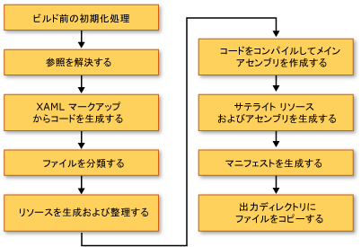

# WPF アプリケーション (WPF) のビルド
[!INCLUDE[TLA#tla_wpf](../../../../includes/tlasharptla-wpf-md.md)] アプリケーションは、[!INCLUDE[dnprdnshort](../../../../includes/dnprdnshort-md.md)] の実行可能ファイル \(.exe\)、ライブラリ \(.dll\)、またはこれらの両方のタイプのアセンブリの組み合わせとしてビルドできます。  このトピックでは、[!INCLUDE[TLA2#tla_wpf](../../../../includes/tla2sharptla-wpf-md.md)] アプリケーションをビルドする方法を紹介し、ビルド処理の主要な手順について説明します。  
  
   
  
<a name="Building_a_WPF_Application_using_Command_Line"></a>   
## WPF アプリケーションのビルド  
 WPF アプリケーションは、次の方法でコンパイルできます。  
  
-   コマンド ライン。  アプリケーションにはコード \(XAML ではない\) とアプリケーション定義ファイルだけを含める必要があります。  詳細については、「[csc.exe を使用したコマンド ラインからのビルド](../../../../ocs/csharp/language-reference/compiler-options/command-line-building-with-csc-exe.md)」または「[コマンド ラインからのビルド \(Visual Basic\)](../Topic/Building%20from%20the%20Command%20Line%20\(Visual%20Basic\).md)」を参照してください。  
  
-   Microsoft Build Engine \(MSBuild\)。  コードおよび XAML ファイルに加えて、アプリケーションには MSBuild プロジェクト ファイルを含める必要があります。  詳細については、「[MSBuild](../Topic/MSBuild1.md)」を参照してください。  
  
-   Visual Studio  Visual Studio は、WPF アプリケーションと MSBuild をコンパイルし、UI を作成するためのビジュアル デザイナーを含む、統合開発環境です。  詳細については、「[Visual Studio でのアプリケーション開発](http://msdn.microsoft.com/ja-jp/97490c1b-a247-41fb-8f2c-bc4c201eff68)」および「[WPF デザイナー](http://msdn.microsoft.com/ja-jp/c6c65214-8411-4e16-b254-163ed4099c26)」を参照してください。  
  
<a name="The_Windows_Presentation_Foundation_Build_Pipeline"></a>   
## WPF ビルド パイプライン  
 [!INCLUDE[TLA2#tla_wpf](../../../../includes/tla2sharptla-wpf-md.md)] プロジェクトがビルドされると、言語固有のターゲットと [!INCLUDE[TLA2#tla_wpf](../../../../includes/tla2sharptla-wpf-md.md)] 固有のターゲットの組み合わせが呼び出されます。  これらのターゲットを実行するプロセスをビルド パイプラインと呼びます。主要な手順を次の図に示します。  
  
   
  
<a name="Pre_Build_Initializations"></a>   
### ビルド前の初期化  
 ビルドを実行する前に、[!INCLUDE[TLA2#tla_msbuild](../../../../includes/tla2sharptla-msbuild-md.md)] は、次のような主要なツールおよびライブラリの場所を確認します。  
  
-   [!INCLUDE[TLA2#tla_winfx](../../../../includes/tla2sharptla-winfx-md.md)]。  
  
-   [!INCLUDE[TLA2#tla_wcsdk](../../../../includes/tla2sharptla-wcsdk-md.md)] ディレクトリ。  
  
-   [!INCLUDE[TLA2#tla_wpf](../../../../includes/tla2sharptla-wpf-md.md)] 参照アセンブリの場所。  
  
-   アセンブリ検索パスのプロパティ。  
  
 [!INCLUDE[TLA2#tla_msbuild](../../../../includes/tla2sharptla-msbuild-md.md)] がアセンブリを最初に検索する場所は、参照アセンブリ ディレクトリ \(%ProgramFiles%\\Reference Assemblies\\Microsoft\\Framework\\v3.0\\\) です。  また、この手順では、ビルド プロセスがさまざまなプロパティおよび項目のグループを初期化し、必要なクリーンアップ作業を実行します。  
  
<a name="Resolving_references"></a>   
### 参照の解決  
 ビルド プロセスは、アプリケーション プロジェクトのビルドに必要なアセンブリを探してバインディングします。  このロジックは、`ResolveAssemblyReference` タスクに含まれます。  プロジェクト ファイル内で `Reference` として宣言されたすべてのアセンブリは、検索パスに関する情報と、既にシステムにインストールされているアセンブリのメタデータと共にタスクに渡されます。  タスクはアセンブリを検索し、インストールされているアセンブリのメタデータを使用して、出力マニフェストに含める必要のないコアの [!INCLUDE[TLA2#tla_wpf](../../../../includes/tla2sharptla-wpf-md.md)] アセンブリをフィルターして除外します。  これは、ClickOnce マニフェストで情報が重複するのを避けるために行われます。  たとえば、PresentationFramework.dll は [!INCLUDE[TLA2#tla_wpf](../../../../includes/tla2sharptla-wpf-md.md)] でビルドされた代表的なアプリケーションと見なすことができ、また、すべての [!INCLUDE[TLA2#tla_wpf](../../../../includes/tla2sharptla-wpf-md.md)] アセンブリは [!INCLUDE[TLA2#tla_winfx](../../../../includes/tla2sharptla-winfx-md.md)] がインストールされているすべてのコンピューターで同じ場所に存在するため、マニフェストにすべての [!INCLUDE[TLA2#tla_winfx](../../../../includes/tla2sharptla-winfx-md.md)] 参照アセンブリに関するすべての情報を含める必要はありません。  
  
<a name="Markup_Compilation___Pass_1"></a>   
### マークアップ コンパイルのパス 1  
 この手順では、[!INCLUDE[TLA2#tla_xaml](../../../../includes/tla2sharptla-xaml-md.md)] ファイルを解析してコンパイルし、ランタイムが [!INCLUDE[TLA2#tla_xml](../../../../includes/tla2sharptla-xml-md.md)] の解析やプロパティ値の検証などに時間を費やさずに済むようにします。  コンパイル済みの [!INCLUDE[TLA2#tla_xaml](../../../../includes/tla2sharptla-xaml-md.md)] ファイルを事前にトークン化するため、実行時の読み込みは [!INCLUDE[TLA2#tla_xaml](../../../../includes/tla2sharptla-xaml-md.md)] ファイルを読み込むよりもはるかに短時間で終わります。  
  
 この手順では、`Page` ビルド項目である [!INCLUDE[TLA2#tla_xaml](../../../../includes/tla2sharptla-xaml-md.md)] ファイルごとに次のアクティビティが実行されます。  
  
1.  [!INCLUDE[TLA2#tla_xaml](../../../../includes/tla2sharptla-xaml-md.md)] ファイルがマークアップ コンパイラによって解析されます。  
  
2.  対象の [!INCLUDE[TLA2#tla_xaml](../../../../includes/tla2sharptla-xaml-md.md)] に対してコンパイル済みの形式が作成され、obj\\Release フォルダーにコピーされます。  
  
3.  新しい部分クラスの CodeDOM 形式が作成され、obj\\Release フォルダーにコピーされます。  
  
 さらに、言語固有のコード ファイルが [!INCLUDE[TLA2#tla_xaml](../../../../includes/tla2sharptla-xaml-md.md)] ファイルごとに生成されます。たとえば、[!INCLUDE[TLA2#tla_visualb](../../../../includes/tla2sharptla-visualb-md.md)] プロジェクトの Page1.xaml ページに対して Page1.g.vb が生成され、[!INCLUDE[TLA2#tla_cshrp](../../../../includes/tla2sharptla-cshrp-md.md)] プロジェクトの Page1.xaml ページに対して Page1.g.cs が生成されます。  ファイル名に含まれる ".g" は、ファイルが生成されたコードであり、マークアップ ファイルのトップレベルの要素 \(`Page`、`Window` など\) に対する部分クラス宣言を持つことを示しています。  クラスは [!INCLUDE[TLA2#tla_cshrp](../../../../includes/tla2sharptla-cshrp-md.md)] で`partial`修飾子 \([!INCLUDE[TLA2#tla_visualb](../../../../includes/tla2sharptla-visualb-md.md)] では `Extends`\) を指定して宣言され、他の場所に別のクラス宣言があることを示します。通常は分離コード ファイル Page1.xaml.cs 内です。  
  
 部分クラスは該当の基本クラスから拡張され \(ページの <xref:System.Windows.Controls.Page> など\)、<xref:System.Windows.Markup.IComponentConnector?displayProperty=fullName> インターフェイスを実装します。  <xref:System.Windows.Markup.IComponentConnector> インターフェイスには、コンポーネントを初期化し、コンテンツ内の要素の名前とイベントを結び付けるメソッドがあります。  そのため、生成されたコード ファイルには次のようなメソッド実装が含まれます。  
  
```csharp  
public void InitializeComponent() {  
    if (_contentLoaded) {  
        return;  
    }  
    _contentLoaded = true;  
    System.Uri resourceLocater =   
        new System.Uri(  
            "window1.xaml",   
            System.UriKind.RelativeOrAbsolute);  
    System.Windows.Application.LoadComponent(this, resourceLocater);  
}  
```  
  
```vb  
Public Sub InitializeComponent() _  
  
    If _contentLoaded Then  
        Return  
    End If  
  
    _contentLoaded = True  
    Dim resourceLocater As System.Uri = _  
        New System.Uri("mainwindow.xaml", System.UriKind.Relative)  
  
    System.Windows.Application.LoadComponent(Me, resourceLocater)  
  
End Sub  
```  
  
 既定で、マークアップ コンパイルは [!INCLUDE[TLA2#tla_msbuild](../../../../includes/tla2sharptla-msbuild-md.md)] エンジンと同じ <xref:System.AppDomain> 内で実行されます。  これにより、パフォーマンスが大幅に向上します。  この動作は、`AlwaysCompileMarkupFilesInSeparateDomain` プロパティで切り替えられます。  切り替えた場合、別の <xref:System.AppDomain> をアンロードすることにより、すべての参照アセンブリをアンロードするという利点があります  
  
<a name="Pass_2_of_Markup_Compilation"></a>   
### マークアップ コンパイルのパス 2  
 マークアップ コンパイルのパス 1 ですべての [!INCLUDE[TLA2#tla_xaml](../../../../includes/tla2sharptla-xaml-md.md)] ページがコンパイルされるとは限りません。  ローカルで定義された型参照 \(つまり、同じプロジェクト内の他のコードで定義された型の参照\) を含む [!INCLUDE[TLA2#tla_xaml](../../../../includes/tla2sharptla-xaml-md.md)] ファイルは、この時点ではコンパイルから除外されます。  これは、ローカルで定義された型はソース内にのみ存在し、まだコンパイルされていないためです。  これを判別するために、パーサーはマークアップ ファイル内で `x:Name` などの項目を検索するヒューリスティックを使用します。  このようなインスタンスが見つかると、そのマークアップ ファイルのコンパイルはコード ファイルがコンパイルされるまで延期されます。その後、2 回目のマークアップ コンパイル パスでこれらのファイルが処理されます。  
  
<a name="File_Classification"></a>   
### ファイルの分類  
 ビルド プロセスにより、配置するアプリケーション アセンブリに基づいて、出力ファイルが別のリソース グループに配置されます。  通常、ローカライズされないアプリケーションでは、`Resource` とマークされたすべてのデータ ファイルはメイン アセンブリ \(実行可能ファイルまたはライブラリ\) に配置されます。  `UICulture` がプロジェクト内に設定されると、コンパイル済みのすべての [!INCLUDE[TLA2#tla_xaml](../../../../includes/tla2sharptla-xaml-md.md)] ファイルおよび言語固有と明示的にマークされたリソースは、サテライト リソース アセンブリに配置されます。  また、言語に依存しないすべてのリソースは、メイン アセンブリに配置されます。  ビルド プロセスのこの手順で、この決定が行われます。  
  
 プロジェクト ファイル内の `ApplicationDefinition`、`Page`、および `Resource` ビルド アクションは、`Localizable` メタデータで拡張できます \(入力可能値は `true` および `false`\)。これにより、ファイルが言語固有か、言語に依存しないかを指定します。  
  
<a name="Core_Compilation"></a>   
### コア コンパイル  
 コア コンパイルの手順では、コード ファイルをコンパイルします。  これは、Microsoft.CSharp.targets や Microsoft.VisualBasic.targets など、言語固有のターゲット ファイル内のロジックによって調整されます。  ヒューリスティックによってマークアップ コンパイラの 1 回のパスでは不十分であることが判断されると、メイン アセンブリが生成されます。  ただし、プロジェクト内の 1 つ以上の [!INCLUDE[TLA2#tla_xaml](../../../../includes/tla2sharptla-xaml-md.md)] ファイルにローカルで定義された型の参照が含まれている場合は、一時的な .dll ファイルが生成されます。これにより、マークアップ コンパイルの 2 回目のパスが完了すると、最終的なアプリケーション アセンブリが作成されます。  
  
<a name="Manifest_generation"></a>   
### マニフェストの生成  
 ビルド プロセスの終わりに、すべてのアプリケーション アセンブリとコンテンツ ファイルの準備が整った後で、アプリケーションの [!INCLUDE[TLA2#tla_clickonce](../../../../includes/tla2sharptla-clickonce-md.md)] マニフェストが生成されます。  
  
 配置マニフェスト ファイルには、配置モデル \(現在のバージョン、更新動作、および発行元の ID とデジタル署名\) が記述されています。  このマニフェストは、配置を処理する管理者が作成します。  ファイル拡張子は、[!INCLUDE[TLA#tla_xbap#plural](../../../../includes/tlasharptla-xbapsharpplural-md.md)] を表す .xbap とインストール型のアプリケーションを表す .application です。  前者は `HostInBrowser` プロジェクト プロパティによって指定されるため、マニフェストはアプリケーションがブラウザーによってホストされることを識別します。  
  
 アプリケーション マニフェスト \(.exe.manifest ファイル\) には、アプリケーション アセンブリ、依存ライブラリ、およびアプリケーションで必要なアクセス許可のリストが記述されています。  このファイルは、アプリケーション開発者が作成します。  [!INCLUDE[TLA2#tla_clickonce](../../../../includes/tla2sharptla-clickonce-md.md)] アプリケーションを起動するには、ユーザーはアプリケーションの配置マニフェスト ファイルを開きます。  
  
 これらのマニフェスト ファイルは、常に [!INCLUDE[TLA2#tla_xbap#plural](../../../../includes/tla2sharptla-xbapsharpplural-md.md)] 用に作成されています。  インストール型のアプリケーションでは、プロジェクト ファイル内で `GenerateManifests` プロパティ値を `true` に指定しない限り作成されません。  
  
 [!INCLUDE[TLA2#tla_xbap#plural](../../../../includes/tla2sharptla-xbapsharpplural-md.md)] は、一般的なインターネット ゾーン アプリケーションに割り当てられるこれらの許可のほかに、2 つの追加の許可を取得します。追加の許可とは、<xref:System.Security.Permissions.WebBrowserPermission> と <xref:System.Security.Permissions.MediaPermission> です。  [!INCLUDE[TLA2#tla_wpf](../../../../includes/tla2sharptla-wpf-md.md)] のビルド システムは、アプリケーション マニフェストでこれらのアクセス許可を宣言します。  
  
<a name="Incremental_Build_Support"></a>   
## インクリメンタル ビルドのサポート  
 [!INCLUDE[TLA2#tla_wpf](../../../../includes/tla2sharptla-wpf-md.md)] のビルド システムは、インクリメンタル ビルドをサポートします。  これは、マークアップやコードの変更を検出し、変更の影響を受けるアイテムだけをコンパイルするという高度な機能です。  インクリメンタル ビルド メカニズムでは、次のファイルを使用します。  
  
-   $\(*AssemblyName*\)\_MarkupCompiler.Cache ファイル。現在のコンパイラの状態を保持します。  
  
-   $\(*AssemblyName*\)\_MarkupCompiler.lref ファイル。ローカルで定義された型への参照を持つ [!INCLUDE[TLA2#tla_xaml](../../../../includes/tla2sharptla-xaml-md.md)] ファイルをキャッシュします。  
  
 インクリメンタル ビルドの規則を次に示します。  
  
-   ビルド システムが変更を検出できるのは、ファイル単位以上です。  そのため、コード ファイルの場合、ビルド システムは型が変更されたかどうか、またはコードが追加されたかどうかを通知できません。  同じことはプロジェクト ファイルにも当てはまります。  
  
-   インクリメンタル ビルドのメカニズムは、[!INCLUDE[TLA2#tla_xaml](../../../../includes/tla2sharptla-xaml-md.md)] ページがクラスを定義するのか、他のクラスを使用するのかを認識していなければなりません。  
  
-   `Reference` のエントリが変更された場合は、すべてのページを再コンパイルします。  
  
-   コード ファイルが変更された場合は、ローカルで定義された型参照を含むすべてのページを再コンパイルします。  
  
-   [!INCLUDE[TLA2#tla_xaml](../../../../includes/tla2sharptla-xaml-md.md)] ファイルが変更された場合 :  
  
    -   [!INCLUDE[TLA2#tla_xaml](../../../../includes/tla2sharptla-xaml-md.md)] がプロジェクトで `Page` として宣言されている場合 : [!INCLUDE[TLA2#tla_xaml](../../../../includes/tla2sharptla-xaml-md.md)] にローカルで定義された型参照がなければ、その [!INCLUDE[TLA2#tla_xaml](../../../../includes/tla2sharptla-xaml-md.md)] とローカル参照を含むすべての [!INCLUDE[TLA2#tla_xaml](../../../../includes/tla2sharptla-xaml-md.md)] ページを再コンパイルします。[!INCLUDE[TLA2#tla_xaml](../../../../includes/tla2sharptla-xaml-md.md)] にローカル参照があれば、ローカル参照を含むすべての [!INCLUDE[TLA2#tla_xaml](../../../../includes/tla2sharptla-xaml-md.md)] ページを再コンパイルします。  
  
    -   [!INCLUDE[TLA2#tla_xaml](../../../../includes/tla2sharptla-xaml-md.md)] がプロジェクト内で `ApplicationDefinition` として宣言されている場合 : すべての [!INCLUDE[TLA2#tla_xaml](../../../../includes/tla2sharptla-xaml-md.md)] ページを再コンパイルします \(それぞれの [!INCLUDE[TLA2#tla_xaml](../../../../includes/tla2sharptla-xaml-md.md)] に、変更された可能性のある <xref:System.Windows.Application> 型への参照があるため\)。  
  
-   プロジェクト ファイルで、[!INCLUDE[TLA2#tla_xaml](../../../../includes/tla2sharptla-xaml-md.md)] ファイルではなくコード ファイルをアプリケーション定義として宣言している場合 :  
  
    -   プロジェクト ファイル内の `ApplicationClassName` 値が変更されたかどうかを確認します \(たとえば、新しいアプリケーションの種類があるかどうか\)。  その場合は、アプリケーション全体を再コンパイルします。  
  
    -   または、ローカル参照を含むすべての [!INCLUDE[TLA2#tla_xaml](../../../../includes/tla2sharptla-xaml-md.md)] ページを再コンパイルします。  
  
-   プロジェクト ファイルが変更された場合は、上記のすべての規則を適用し、再コンパイルする必要があるものを確認します。  次のプロパティが変更されると、全体の再コンパイルが実行されます : `AssemblyName`、`IntermediateOutputPath`、`RootNamespace`、および `HostInBrowser`。  
  
 次の再コンパイルのシナリオが考えられます。  
  
-   アプリケーション全体が再コンパイルされます。  
  
-   ローカルで定義された型参照を含む [!INCLUDE[TLA2#tla_xaml](../../../../includes/tla2sharptla-xaml-md.md)] ファイルだけが再コンパイルされます。  
  
-   再コンパイルされるものはありません \(プロジェクト内で変更が加えられていない場合\)。  
  
## 参照  
 [WPF アプリケーションの配置](../../../../docs/framework/wpf/app-development/deploying-a-wpf-application-wpf.md)   
 [WPF MSBuild のリファレンス](../Topic/WPF%20MSBuild%20Reference.md)   
 [WPF におけるパッケージの URI](../../../../docs/framework/wpf/app-development/pack-uris-in-wpf.md)   
 [WPF アプリケーションのリソース ファイル、コンテンツ ファイル、およびデータ ファイル](../../../../docs/framework/wpf/app-development/wpf-application-resource-content-and-data-files.md)