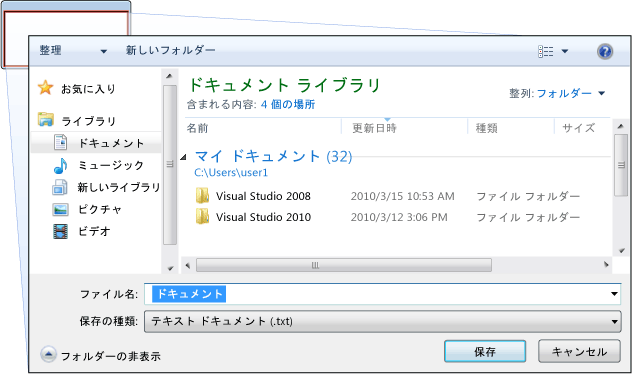
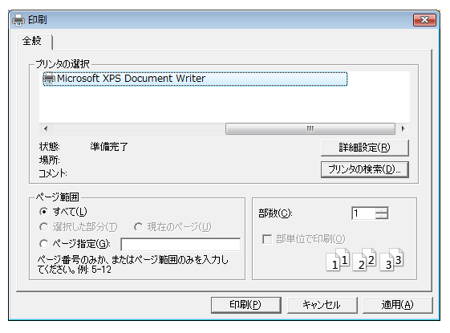
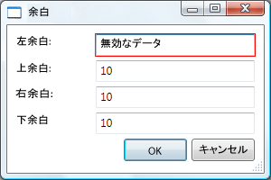

# ダイアログ ボックスの概要
スタンドアロン アプリケーションは通常、メイン ウィンドウがどのアプリケーションが機能して、使用してデータを処理する機能を公開、メインのデータをある[!INCLUDE[TLA#tla_ui](../../../../includes/tlasharptla-ui-md.md)]メカニズムは、メニュー バー、ツールバー、およびステータス バーと同様にします。 また、他のウィンドウで、次の操作を表示することも重要なアプリケーション。  
  
-   ユーザーに固有の情報を表示します。  
  
-   ユーザーから情報を収集します。  
  
-   両方を表示し、情報を収集します。  
  
 これらの種類のウィンドウと呼ばれる*ダイアログ ボックス*、し、2 種類があります: モーダルとモードレスです。  
  
 A*モーダル*関数には、引き続きユーザーからの追加データが必要がある場合、関数によってダイアログ ボックスが表示されます。 関数は、データを収集するモーダル ダイアログ ボックスに依存しているため、モーダル ダイアログ ボックスも防止、ユーザーが開いている間に、アプリケーションの他のウィンドウをアクティブ化します。 モーダル ダイアログ ボックスでキーを押して、モーダル ダイアログ ボックスを終了するときにユーザーはほとんどの場合、 **OK**または**キャンセル** ボタンをクリックします。 キーを押して、 **OK**  ボタンをクリックことを示し、ユーザー データが入力されたデータに対して処理を続行する関数を希望します。 キーを押して、**キャンセル**ボタンは、ユーザーが、関数が完全に実行を停止することを示します。 開く、保存、およびデータを印刷するには、モーダル ダイアログ ボックスの最も一般的な例を示します。  
  
 A*モードレス*ダイアログ ボックスで、その一方を防ぐ、ユーザーが開いている間、他のウィンドウをアクティブ化します。 たとえば、ユーザーがドキュメント内の特定の単語の出現箇所を検索したい場合でも、メイン ウィンドウ対象の単語が探しているユーザー入力を要求するダイアログ ボックスが多くの場合、開きます。 単語なると、ユーザーは、ドキュメントの編集によって妨げ、ただし、ダイアログ ボックスがモーダルである必要ありませんから。 モードレス ダイアログ ボックスは、少なくとも、**閉じる** ダイアログ ボックスを閉じるボタンをクリックしなどの特定の機能を実行するその他のボタンを提供することがあります、**次を検索**word search の検索条件に一致する次の単語を検索する ボタンをクリックします。  
  
 [!INCLUDE[TLA#tla_wpf](../../../../includes/tlasharptla-wpf-md.md)]ダイアログ ボックス、メッセージ ボックス、コモン ダイアログ ボックスでは、カスタム ダイアログ ボックスなどの複数の種類を作成できます。 このトピックでは、それぞれ、[ダイアログ ボックスのサンプル](http://go.microsoft.com/fwlink/?LinkID=159984)一致する例を示します。  
  
   
  
   
## メッセージ ボックス  
 A*メッセージ ボックス*テキストの情報を表示し、ユーザーのボタンで、意思決定を行うことを許可するように使用できるダイアログ ボックスです。 次の図は、テキストの情報を表示、質問を質問に答える&3; つのボタンをユーザーに提供するメッセージ ボックスを表示します。  
  
 ![[ワード プロセッサ] ダイアログ ボックス](../Image/DialogBoxesOverviewFigure1.png "DialogBoxesOverviewFigure1")  
  
 使用するメッセージ ボックスを作成する、<xref:System.Windows.MessageBox>クラスです。                  <xref:System.Windows.MessageBox>メッセージ ボックスのテキスト、タイトル、アイコン、およびボタン、次のようなコードを使用して構成することができます。  
  
 [!code-csharp[DialogBoxesOverviewSnippets#MsgBoxConfigureCODEBEHIND](../../../../samples/snippets/csharp/VS_Snippets_Wpf/DialogBoxesOverviewSnippets/CSharp/Window1.xaml.cs#msgboxconfigurecodebehind)]
 [!code-vb[DialogBoxesOverviewSnippets#MsgBoxConfigureCODEBEHIND](../../../../samples/snippets/visualbasic/VS_Snippets_Wpf/DialogBoxesOverviewSnippets/VisualBasic/window1.xaml.vb#msgboxconfigurecodebehind)]  
  
 メッセージ ボックスを表示するのにを呼び出します、 `static`<xref:System.Windows.MessageBox.Show%2A>メソッドを次のコードに示すようにします。  
  
 [!code-csharp[DialogBoxesOverviewSnippets#MsgBoxShowCODEBEHIND](../../../../samples/snippets/csharp/VS_Snippets_Wpf/DialogBoxesOverviewSnippets/CSharp/Window1.xaml.cs#msgboxshowcodebehind)]
 [!code-vb[DialogBoxesOverviewSnippets#MsgBoxShowCODEBEHIND](../../../../samples/snippets/visualbasic/VS_Snippets_Wpf/DialogBoxesOverviewSnippets/VisualBasic/window1.xaml.vb#msgboxshowcodebehind)]  
  
 メッセージ ボックスを表示するコードを検出して、ユーザーの決定 (どのボタンが押された) を処理する場合、コードは、次のコードに示すようにメッセージ ボックスの結果を検査できます。  
  
 [!code-csharp[DialogBoxesOverviewSnippets#MsgBoxShowAndResultCODEBEHIND1](../../../../samples/snippets/csharp/VS_Snippets_Wpf/DialogBoxesOverviewSnippets/CSharp/Window1.xaml.cs#msgboxshowandresultcodebehind1)]
 [!code-vb[DialogBoxesOverviewSnippets#MsgBoxShowAndResultCODEBEHIND1](../../../../samples/snippets/visualbasic/VS_Snippets_Wpf/DialogBoxesOverviewSnippets/VisualBasic/window1.xaml.vb#msgboxshowandresultcodebehind1)]  
  
 メッセージ ボックスの使用の詳細については、次を参照してください。<xref:System.Windows.MessageBox>、[メッセージ ボックス サンプル](http://go.microsoft.com/fwlink/?LinkID=160023)、および[ダイアログ ボックスのサンプル](http://go.microsoft.com/fwlink/?LinkID=159984)します。  
  
 <xref:System.Windows.MessageBox>簡単なダイアログ ボックス ユーザー エクスペリエンスを使用する利点を提供することがあります<xref:System.Windows.MessageBox>は部分信頼セキュリティ サンド ボックス内で実行されるアプリケーションで表示できるウィンドウの唯一の種類は、(を参照してください[セキュリティ](../../../../docs/framework/wpf/security-wpf.md)) など[!INCLUDE[TLA#tla_xbap#plural](../../../../includes/tlasharptla-xbapsharpplural-md.md)]します。  
  
 ほとんどのダイアログ ボックスは表示のテキストを選択 (チェック ボックス) 相互に排他的な選択 (オプション ボタン) を含むメッセージ ボックスの結果よりもさらに複雑なデータを収集して、リスト (リスト ボックス、コンボ ボックス、ドロップダウン リスト ボックス) を選択します。 これらの[!INCLUDE[TLA#tla_wpf](../../../../includes/tlasharptla-wpf-md.md)]いくつかの一般的なダイアログ ボックスが表示され、いずれかの使用を完全信頼で実行されているアプリケーションに制限されていますが、独自のダイアログ ボックスを作成することができます。  
  
   
## コモン ダイアログ ボックス  
 [!INCLUDE[TLA#tla_mswin](../../../../includes/tlasharptla-mswin-md.md)]さまざまなファイルを開く、保存、および印刷用のダイアログ ボックスを含むすべてのアプリケーションに共通する再利用可能なダイアログ ボックスを実装します。 これらのダイアログ ボックスがオペレーティング システムによって実装されているために、により、ユーザー エクスペリエンスの一貫性は、オペレーティング システムで実行されるすべてのアプリケーション間で共有できます。ユーザーが&1; つのアプリケーションで、オペレーティング システムによって提供されるダイアログ ボックスの使用経験がほとんどの場合は、他のアプリケーションでは、そのダイアログ ボックスを使用する方法について説明する必要はありません。 これらのダイアログ ボックスがすべてのアプリケーションで使用できると呼ばれますので、一貫したユーザー エクスペリエンスを提供するのに役立つ、ため*コモン ダイアログ ボックス*します。  
  
 [!INCLUDE[TLA#tla_wpf](../../../../includes/tlasharptla-wpf-md.md)]開いているファイルの保存にファイル、および印刷ダイアログ ボックスをカプセル化し、それらがスタンドアロン アプリケーションで使用するため、マネージ クラスを公開します。 このトピックでは、それぞれの簡単な概要を説明します。  
  
   
### ファイルを開く ダイアログ  
 ファイルを開く機能は次の図に示すようにファイルを開く ダイアログ ボックスを使用して、開くファイルの名前を取得します。  
  
 ![[開く] ダイアログ ボックス](../Image/DialogBoxesOverviewFigure2.png "DialogBoxesOverviewFigure2")  
  
 一般的なファイルを開く ダイアログ ボックスは、 <xref:Microsoft.Win32.OpenFileDialog>クラスに配置されていると、 <xref:Microsoft.Win32>名前空間。 次のコードでは、作成、構成、および、1 つを表示する方法と結果を処理する方法を示します。  
  
 [!code-csharp[DialogBoxesOverviewSnippets#OpenFileDialogBoxCODEBEHIND](../../../../samples/snippets/csharp/VS_Snippets_Wpf/DialogBoxesOverviewSnippets/CSharp/Window1.xaml.cs#openfiledialogboxcodebehind)]
 [!code-vb[DialogBoxesOverviewSnippets#OpenFileDialogBoxCODEBEHIND](../../../../samples/snippets/visualbasic/VS_Snippets_Wpf/DialogBoxesOverviewSnippets/VisualBasic/window1.xaml.vb#openfiledialogboxcodebehind)]  
  
 ファイルを開く ダイアログ ボックスの詳細については、次を参照してください。 <xref:Microsoft.Win32.OpenFileDialog?displayProperty=fullName>します。  
  
> [!NOTE]
>  <xref:Microsoft.Win32.OpenFileDialog>を安全にファイル名を取得する部分信頼で実行されているアプリケーションで使用できます (を参照してください[セキュリティ](../../../../docs/framework/wpf/security-wpf.md))。  
  
   
### [保存] ダイアログ ボックスのファイル  
 保存先を保存するファイルの名前を取得するファイルの保存機能によって次の図に示すように、ファイル ダイアログ ボックスを使用します。  
  
   
  
 一般的な保存ファイル ダイアログ ボックスとして実装、 <xref:Microsoft.Win32.SaveFileDialog>クラスに配置されていると、 <xref:Microsoft.Win32>名前空間。 次のコードでは、作成、構成、および、1 つを表示する方法と結果を処理する方法を示します。  
  
 [!code-csharp[DialogBoxesOverviewSnippets#SaveFileDialogBoxCODEBEHIND](../../../../samples/snippets/csharp/VS_Snippets_Wpf/DialogBoxesOverviewSnippets/CSharp/Window1.xaml.cs#savefiledialogboxcodebehind)]
 [!code-vb[DialogBoxesOverviewSnippets#SaveFileDialogBoxCODEBEHIND](../../../../samples/snippets/visualbasic/VS_Snippets_Wpf/DialogBoxesOverviewSnippets/VisualBasic/window1.xaml.vb#savefiledialogboxcodebehind)]  
  
 保存の詳細については [ファイル] ダイアログ ボックスは、「 <xref:Microsoft.Win32.SaveFileDialog?displayProperty=fullName>します。  
  
   
### [印刷] ダイアログ ボックス  
 次の図に示すように、印刷ダイアログ ボックスを選択し、ユーザーがデータの印刷には、プリンターを構成する印刷機能によって使用されます。  
  
   
  
 一般的な印刷ダイアログ ボックスは、 <xref:System.Windows.Controls.PrintDialog>クラスでありにある、 <xref:System.Windows.Controls>名前空間。 次のコードでは、作成、構成、および&1; つを表示する方法を示します。  
  
 [!code-csharp[DialogBoxesOverviewSnippets#PrintDialogBoxCODEBEHIND](../../../../samples/snippets/csharp/VS_Snippets_Wpf/DialogBoxesOverviewSnippets/CSharp/Window1.xaml.cs#printdialogboxcodebehind)]
 [!code-vb[DialogBoxesOverviewSnippets#PrintDialogBoxCODEBEHIND](../../../../samples/snippets/visualbasic/VS_Snippets_Wpf/DialogBoxesOverviewSnippets/VisualBasic/window1.xaml.vb#printdialogboxcodebehind)]  
  
 [印刷] ダイアログ ボックスの詳細については、次を参照してください。 <xref:System.Windows.Controls.PrintDialog?displayProperty=fullName>します。 印刷の詳細については[!INCLUDE[TLA2#tla_wpf](../../../../includes/tla2sharptla-wpf-md.md)]を参照してください[印刷の概要](../../../../docs/framework/wpf/advanced/printing-overview.md)します。  
  
   
## カスタム ダイアログ ボックス  
 コモン ダイアログ ボックスが便利で、可能な場合に使用する必要があります、ドメイン固有のダイアログ ボックスの要件はサポートしていません。 このような場合は、独自のダイアログ ボックスを作成する必要があります。 おわかりのとおり、ダイアログ ボックスは、特殊な動作とウィンドウです。                  <xref:System.Windows.Window>これらの動作を実装して、その結果を使用する<xref:System.Windows.Window>カスタム モーダルとモードレスのダイアログ ボックスを作成します。  
  
   
### カスタムのモーダル ダイアログ ボックスを作成します。  
 このトピックは、使用する方法を示しています。<xref:System.Windows.Window>、通常のモーダル ダイアログ ボックスの実装を作成するを使用して、`Margins`ようなダイアログ ボックス (を参照してください[ダイアログ ボックスのサンプル](http://go.microsoft.com/fwlink/?LinkID=159984))。 `Margins`  ダイアログ ボックスが次の図に示すようにします。  
  
 ![[余白] ダイアログ ボックス](../Image/DialogBoxesOverviewFigure5.png "DialogBoxesOverviewFigure5")  
  
#### モーダル ダイアログ ボックスを構成します。  
 一般的なダイアログ ボックスのユーザー インターフェイスには、次の項目が含まれます。  
  
-   必要なデータを収集するために必要なさまざまなコントロールです。  
  
-   表示、 **OK**ユーザーがクリックすると、関数に戻り、ダイアログ ボックスを閉じるし、処理を続行 ボタンをクリックします。  
  
-   表示、**キャンセル**クリックするダイアログ ボックスを終了し、関数の処理を停止する ボタンをクリックします。  
  
-   表示、**閉じる**タイトル バー ボタンをクリックします。  
  
-   アイコンを表示しています。  
  
-   Showing                                          **Minimize**,                                          **Maximize**, and                                          **Restore** buttons.  
  
-   表示、**システム**メニューを最小化、最大化、復元、およびダイアログ ボックスを閉じます。  
  
-   上部およびダイアログ ボックスを開いたウィンドウの中央に開いています。  
  
-   ダイアログ ボックスでは、それぞれ ダイアログ ボックスが小さすぎることを防止し、便利な既定のサイズをユーザーに提供するには、既定値と最小の両方を設定する必要があります。 したがって、可能なサイズ変更可能なディメンションを指定する必要があります。  
  
-   原因となるキーボード ショートカットとして構成するか、ESC キーを押して、**キャンセル** ボタンを押します。 これを設定するのには、 <xref:System.Windows.Controls.Button.IsCancel%2A>のプロパティ、**キャンセル**ボタン`true`します。  
  
-   原因となるキーボード ショートカットとして構成する必要があります (または戻り値) の入力キーを押して、 **ok**  ボタンを押します。 これを設定するのには、 <xref:System.Windows.Controls.Button.IsDefault%2A>のプロパティ、 **[ok]**ボタン`true`します。  
  
 次のコードでは、この構成を示します。  
  
 [!code-xml[DialogBoxSample#MarginsDialogBoxMainBitsMARKUP1](../../../../samples/snippets/csharp/VS_Snippets_Wpf/DialogBoxSample/CSharp/MarginsDialogBox.xaml#marginsdialogboxmainbitsmarkup1)]  
[!code-xml[DialogBoxSample#MarginsDialogBoxMainBitsMARKUP2](../../../../samples/snippets/csharp/VS_Snippets_Wpf/DialogBoxSample/CSharp/MarginsDialogBox.xaml#marginsdialogboxmainbitsmarkup2)]  
  
 [!code-csharp[DialogBoxSample#MarginsDialogBoxMainBitsCODEBEHIND1](../../../../samples/snippets/csharp/VS_Snippets_Wpf/DialogBoxSample/CSharp/MarginsDialogBox.xaml.cs#marginsdialogboxmainbitscodebehind1)]
 [!code-vb[DialogBoxSample#MarginsDialogBoxMainBitsCODEBEHIND1](../../../../samples/snippets/visualbasic/VS_Snippets_Wpf/DialogBoxSample/VisualBasic/MarginsDialogBox.xaml.vb#marginsdialogboxmainbitscodebehind1)]  
[!code-csharp[DialogBoxSample#MarginsDialogBoxMainBitsCODEBEHIND2](../../../../samples/snippets/csharp/VS_Snippets_Wpf/DialogBoxSample/CSharp/MarginsDialogBox.xaml.cs#marginsdialogboxmainbitscodebehind2)]
[!code-vb[DialogBoxSample#MarginsDialogBoxMainBitsCODEBEHIND2](../../../../samples/snippets/visualbasic/VS_Snippets_Wpf/DialogBoxSample/VisualBasic/MarginsDialogBox.xaml.vb#marginsdialogboxmainbitscodebehind2)]  
  
 ダイアログ ボックスのユーザー エクスペリエンスは、ダイアログ ボックスを開くウィンドウのメニュー バーにも及びます。 メニュー項目が、関数を続行するには、ダイアログ ボックスでユーザーとの対話を必要とする関数を実行すると、関数のメニュー項目は、次のように、ヘッダーに省略記号があります。  
  
 [!code-xml[DialogBoxSample#MainWindowMarginsDialogBoxMenuItemMARKUP1](../../../../samples/snippets/csharp/VS_Snippets_Wpf/DialogBoxSample/CSharp/MainWindow.xaml#mainwindowmarginsdialogboxmenuitemmarkup1)]  
[!code-xml[DialogBoxSample#MainWindowMarginsDialogBoxMenuItemMARKUP2](../../../../samples/snippets/csharp/VS_Snippets_Wpf/DialogBoxSample/CSharp/MainWindow.xaml#mainwindowmarginsdialogboxmenuitemmarkup2)]  
  
 メニュー項目は、バージョン情報 ダイアログ ボックスなどのユーザーの操作を必要としない ダイアログ ボックスを表示する関数を実行すると、省略記号は必要ありません。  
  
#### モーダル ダイアログ ボックスを開く  
 ダイアログ ボックスは、通常、ワード プロセッサで、ドキュメントの余白を設定するなどのドメイン固有の機能を実行するメニュー項目を選択すると、ユーザーの結果として表示されます。 ダイアログ ボックスとウィンドウを表示する方法は、追加のダイアログ ボックスに固有の構成が必要ですが通常のウィンドウを表示に似ています。 インスタンス化するプロセス全体、構成、およびダイアログ ボックスを開くは、次のコードに表示が。  
  
 [!code-csharp[DialogBoxSample#OpenMarginsDialogCODEBEHIND1](../../../../samples/snippets/csharp/VS_Snippets_Wpf/DialogBoxSample/CSharp/MainWindow.xaml.cs#openmarginsdialogcodebehind1)]
 [!code-vb[DialogBoxSample#OpenMarginsDialogCODEBEHIND1](../../../../samples/snippets/visualbasic/VS_Snippets_Wpf/DialogBoxSample/VisualBasic/MainWindow.xaml.vb#openmarginsdialogcodebehind1)]  
[!code-csharp[DialogBoxSample#OpenMarginsDialogCODEBEHIND2](../../../../samples/snippets/csharp/VS_Snippets_Wpf/DialogBoxSample/CSharp/MainWindow.xaml.cs#openmarginsdialogcodebehind2)]
[!code-vb[DialogBoxSample#OpenMarginsDialogCODEBEHIND2](../../../../samples/snippets/visualbasic/VS_Snippets_Wpf/DialogBoxSample/VisualBasic/MainWindow.xaml.vb#openmarginsdialogcodebehind2)]  
[!code-csharp[DialogBoxSample#OpenMarginsDialogCODEBEHIND3](../../../../samples/snippets/csharp/VS_Snippets_Wpf/DialogBoxSample/CSharp/MainWindow.xaml.cs#openmarginsdialogcodebehind3)]
[!code-vb[DialogBoxSample#OpenMarginsDialogCODEBEHIND3](../../../../samples/snippets/visualbasic/VS_Snippets_Wpf/DialogBoxSample/VisualBasic/MainWindow.xaml.vb#openmarginsdialogcodebehind3)]  
[!code-csharp[DialogBoxSample#OpenMarginsDialogCODEBEHIND4](../../../../samples/snippets/csharp/VS_Snippets_Wpf/DialogBoxSample/CSharp/MainWindow.xaml.cs#openmarginsdialogcodebehind4)]
[!code-vb[DialogBoxSample#OpenMarginsDialogCODEBEHIND4](../../../../samples/snippets/visualbasic/VS_Snippets_Wpf/DialogBoxSample/VisualBasic/MainWindow.xaml.vb#openmarginsdialogcodebehind4)]  
  
 ここでは、渡された既定の情報 (現在のマージン) ダイアログ ボックスにします。 設定されても、 <xref:System.Windows.Window.Owner%2A?displayProperty=fullName>  ダイアログ ボックスが表示されているウィンドウへの参照を持つプロパティです。 一般に、必ず設定してダイアログ ボックスの所有者に、すべてのダイアログ ボックスに共通するウィンドウの状態関連の動作を提供する (を参照してください[WPF ウィンドウの概要](../../../../docs/framework/wpf/app-development/wpf-windows-overview.md)の詳細)。  
  
> [!NOTE]
>  サポートするために所有者を指定する必要があります[!INCLUDE[TLA#tla_ui](../../../../includes/tlasharptla-ui-md.md)]ダイアログ ボックスのための自動化 (を参照してください[UI オートメーションの概要](../../../../docs/framework/ui-automation/ui-automation-overview.md))。  
  
 呼び出しでモーダルとして表示されます ダイアログ ボックスを構成した後、 <xref:System.Windows.Window.ShowDialog%2A>メソッドです。  
  
#### ユーザー指定のデータの検証  
 ダイアログ ボックスが開かれ、ユーザーは、必要なデータ、ダイアログ ボックスが提供されているデータが次の理由で有効であることを保証します。  
  
-   セキュリティの観点からは、すべての入力を検証する必要があります。  
  
-   ドメイン固有の観点から、データの検証には、例外をスローする可能性のあるコードによって処理されてから正しくないデータができないようにします。  
  
-   ユーザー エクスペリエンスの観点から ダイアログ ボックスは、表示することによって、入力したデータが無効ユーザーを支援することができます。  
  
-   パフォーマンスの観点から多階層アプリケーションのデータの検証は、アプリケーションが Web サービスまたはサーバー ベースのデータベースで構成される場合に特にに、クライアントとアプリケーション層の間のラウンド トリップの回数を削減できます。  
  
 バインドされたコントロールを検証する[!INCLUDE[TLA2#tla_wpf](../../../../includes/tla2sharptla-wpf-md.md)]バインドに関連付けることの検証規則を定義する必要があります。 派生するカスタム クラスの検証ルールは<xref:System.Windows.Controls.ValidationRule>します。 次の例では、検証規則`MarginValidationRule`、バインドされた値がどのチェック、<xref:System.Double>と指定した範囲内にあります。  
  
 [!code-csharp[DialogBoxSample#MarginValidationRuleCODE](../../../../samples/snippets/csharp/VS_Snippets_Wpf/DialogBoxSample/CSharp/MarginValidationRule.cs#marginvalidationrulecode)]
 [!code-vb[DialogBoxSample#MarginValidationRuleCODE](../../../../samples/snippets/visualbasic/VS_Snippets_Wpf/DialogBoxSample/VisualBasic/MarginValidationRule.vb#marginvalidationrulecode)]  
  
 このコードは、オーバーライドすることで、検証規則の検証ロジックを実装、<xref:System.Windows.Controls.ValidationRule.Validate%2A>データ検証を返す、適切なメソッド<xref:System.Windows.Controls.ValidationResult>します。  
  
 バインドされたコントロールと検証規則を関連付けるには、次のマークアップを使用します。  
  
 [!code-xml[DialogBoxSample#MarginsValidationMARKUP1](../../../../samples/snippets/csharp/VS_Snippets_Wpf/DialogBoxSample/CSharp/MarginsDialogBox.xaml#marginsvalidationmarkup1)]  
[!code-xml[DialogBoxSample#MarginsValidationMARKUP2](../../../../samples/snippets/csharp/VS_Snippets_Wpf/DialogBoxSample/CSharp/MarginsDialogBox.xaml#marginsvalidationmarkup2)]  
[!code-xml[DialogBoxSample#MarginsValidationMARKUP3](../../../../samples/snippets/csharp/VS_Snippets_Wpf/DialogBoxSample/CSharp/MarginsDialogBox.xaml#marginsvalidationmarkup3)]  
  
 検証規則が関連付けられている[!INCLUDE[TLA2#tla_wpf](../../../../includes/tla2sharptla-wpf-md.md)]が自動的に適用して、バインドされたコントロールにデータが入力されるとします。 コントロールには、無効なデータが含まれている[!INCLUDE[TLA2#tla_wpf](../../../../includes/tla2sharptla-wpf-md.md)]次の図に示すように無効なコントロールの周囲に赤い境界線が表示されます。  
  
   
  
 [!INCLUDE[TLA2#tla_wpf](../../../../includes/tla2sharptla-wpf-md.md)]有効なデータを入力するまで無効なコントロール、ユーザーは制限されません。 これは、ダイアログ ボックスの適切な動作ユーザーは、データが有効かどうか、ダイアログ ボックスのコントロールを自由に移動できる必要があります。 この場合、ユーザーは、無効なデータを入力できる、 **OK**  ボタンをクリックします。 このため、コードも必要があるダイアログ ボックスのすべてのコントロールを検証する際にボックス、 **OK**ボタンを処理することにより、 <xref:System.Windows.Controls.Primitives.ButtonBase.Click>イベントです。  
  
 [!code-csharp[DialogBoxSample#MarginsDialogBoxValidationCODEBEHIND1](../../../../samples/snippets/csharp/VS_Snippets_Wpf/DialogBoxSample/CSharp/MarginsDialogBox.xaml.cs#marginsdialogboxvalidationcodebehind1)]
 [!code-vb[DialogBoxSample#MarginsDialogBoxValidationCODEBEHIND1](../../../../samples/snippets/visualbasic/VS_Snippets_Wpf/DialogBoxSample/VisualBasic/MarginsDialogBox.xaml.vb#marginsdialogboxvalidationcodebehind1)]  
[!code-csharp[DialogBoxSample#MarginsDialogBoxValidationCODEBEHIND2](../../../../samples/snippets/csharp/VS_Snippets_Wpf/DialogBoxSample/CSharp/MarginsDialogBox.xaml.cs#marginsdialogboxvalidationcodebehind2)]
[!code-vb[DialogBoxSample#MarginsDialogBoxValidationCODEBEHIND2](../../../../samples/snippets/visualbasic/VS_Snippets_Wpf/DialogBoxSample/VisualBasic/MarginsDialogBox.xaml.vb#marginsdialogboxvalidationcodebehind2)]  
[!code-csharp[DialogBoxSample#MarginsDialogBoxValidationCODEBEHIND3](../../../../samples/snippets/csharp/VS_Snippets_Wpf/DialogBoxSample/CSharp/MarginsDialogBox.xaml.cs#marginsdialogboxvalidationcodebehind3)]
[!code-vb[DialogBoxSample#MarginsDialogBoxValidationCODEBEHIND3](../../../../samples/snippets/visualbasic/VS_Snippets_Wpf/DialogBoxSample/VisualBasic/MarginsDialogBox.xaml.vb#marginsdialogboxvalidationcodebehind3)]  
  
 このコードは、ウィンドウ上のすべての依存関係オブジェクトを列挙し、いずれかが無効な場合 (によって返される<xref:System.Windows.Controls.Validation.GetHasError%2A>、無効なコントロールがフォーカスを取得、`IsValid`メソッドを返します。 `false`、ウィンドウが無効とみなされるとします。  
  
 ダイアログ ボックスが有効なそのことができます安全を閉じて戻ります。 戻り値のプロセスの一環として、呼び出し元の関数に結果を返すが必要です。  
  
#### モーダル ダイアログ ボックスの結果を設定します。  
 使用して、ダイアログ ボックスを開く<xref:System.Windows.Window.ShowDialog%2A>メソッドを呼び出す場合と基本的には: を使用して、ダイアログ ボックスを開いたコード<xref:System.Windows.Window.ShowDialog%2A>されるまで待機する<xref:System.Windows.Window.ShowDialog%2A>を返します。 <xref:System.Windows.Window.ShowDialog%2A>を返す場合は、それを呼び出したコードが必要かどうかに基づくした処理を続行するか、処理を停止するかどうかを決定する、ユーザーが押された、 **[ok]**ボタンまたは**キャンセル** ボタンをクリックします。 ユーザーの選択を返す必要があります ダイアログ ボックスをこの決定を容易にする、<xref:System.Boolean>から返される値、 <xref:System.Windows.Window.ShowDialog%2A>メソッドです。  
  
 ときに、 **OK**  ボタンをクリックすると、 <xref:System.Windows.Window.ShowDialog%2A>返す必要があります`true`します。 これを設定するのには、 <xref:System.Windows.Window.DialogResult%2A>際に、ダイアログ ボックスのプロパティ ボックス、 **OK**  ボタンをクリックします。  
  
 [!code-csharp[DialogBoxSample#MarginsDialogBoxOKResultSetCODEBEHIND1](../../../../samples/snippets/csharp/VS_Snippets_Wpf/DialogBoxSample/CSharp/MarginsDialogBox.xaml.cs#marginsdialogboxokresultsetcodebehind1)]
 [!code-vb[DialogBoxSample#MarginsDialogBoxOKResultSetCODEBEHIND1](../../../../samples/snippets/visualbasic/VS_Snippets_Wpf/DialogBoxSample/VisualBasic/MarginsDialogBox.xaml.vb#marginsdialogboxokresultsetcodebehind1)]  
[!code-csharp[DialogBoxSample#MarginsDialogBoxOKResultSetCODEBEHIND2](../../../../samples/snippets/csharp/VS_Snippets_Wpf/DialogBoxSample/CSharp/MarginsDialogBox.xaml.cs#marginsdialogboxokresultsetcodebehind2)]
[!code-vb[DialogBoxSample#MarginsDialogBoxOKResultSetCODEBEHIND2](../../../../samples/snippets/visualbasic/VS_Snippets_Wpf/DialogBoxSample/VisualBasic/MarginsDialogBox.xaml.vb#marginsdialogboxokresultsetcodebehind2)]  
[!code-csharp[DialogBoxSample#MarginsDialogBoxOKResultSetCODEBEHIND3](../../../../samples/snippets/csharp/VS_Snippets_Wpf/DialogBoxSample/CSharp/MarginsDialogBox.xaml.cs#marginsdialogboxokresultsetcodebehind3)]
[!code-vb[DialogBoxSample#MarginsDialogBoxOKResultSetCODEBEHIND3](../../../../samples/snippets/visualbasic/VS_Snippets_Wpf/DialogBoxSample/VisualBasic/MarginsDialogBox.xaml.vb#marginsdialogboxokresultsetcodebehind3)]  
[!code-csharp[DialogBoxSample#MarginsDialogBoxOKResultSetCODEBEHIND4](../../../../samples/snippets/csharp/VS_Snippets_Wpf/DialogBoxSample/CSharp/MarginsDialogBox.xaml.cs#marginsdialogboxokresultsetcodebehind4)]
[!code-vb[DialogBoxSample#MarginsDialogBoxOKResultSetCODEBEHIND4](../../../../samples/snippets/visualbasic/VS_Snippets_Wpf/DialogBoxSample/VisualBasic/MarginsDialogBox.xaml.vb#marginsdialogboxokresultsetcodebehind4)]  
  
 その設定に注意してください、 <xref:System.Windows.Window.DialogResult%2A>プロパティを明示的に呼び出す必要性を軽減するウィンドウが自動的に閉じるがも<xref:System.Windows.Window.Close%2A>します。  
  
 ときに、**キャンセル** ボタンをクリックすると、 <xref:System.Windows.Window.ShowDialog%2A>返す必要があります`false`、設定も必要があります、 <xref:System.Windows.Window.DialogResult%2A>プロパティです。  
  
 [!code-csharp[DialogBoxSample#MarginsDialogBoxCancelResultSetCODEBEHIND1](../../../../samples/snippets/csharp/VS_Snippets_Wpf/DialogBoxSample/CSharp/MarginsDialogBox.xaml.cs#marginsdialogboxcancelresultsetcodebehind1)]
 [!code-vb[DialogBoxSample#MarginsDialogBoxCancelResultSetCODEBEHIND1](../../../../samples/snippets/visualbasic/VS_Snippets_Wpf/DialogBoxSample/VisualBasic/MarginsDialogBox.xaml.vb#marginsdialogboxcancelresultsetcodebehind1)]  
[!code-csharp[DialogBoxSample#MarginsDialogBoxCancelResultSetCODEBEHIND2](../../../../samples/snippets/csharp/VS_Snippets_Wpf/DialogBoxSample/CSharp/MarginsDialogBox.xaml.cs#marginsdialogboxcancelresultsetcodebehind2)]
[!code-vb[DialogBoxSample#MarginsDialogBoxCancelResultSetCODEBEHIND2](../../../../samples/snippets/visualbasic/VS_Snippets_Wpf/DialogBoxSample/VisualBasic/MarginsDialogBox.xaml.vb#marginsdialogboxcancelresultsetcodebehind2)]  
[!code-csharp[DialogBoxSample#MarginsDialogBoxCancelResultSetCODEBEHIND3](../../../../samples/snippets/csharp/VS_Snippets_Wpf/DialogBoxSample/CSharp/MarginsDialogBox.xaml.cs#marginsdialogboxcancelresultsetcodebehind3)]
[!code-vb[DialogBoxSample#MarginsDialogBoxCancelResultSetCODEBEHIND3](../../../../samples/snippets/visualbasic/VS_Snippets_Wpf/DialogBoxSample/VisualBasic/MarginsDialogBox.xaml.vb#marginsdialogboxcancelresultsetcodebehind3)]  
  
 ときにボタンの<xref:System.Windows.Controls.Button.IsCancel%2A>プロパティに設定されて`true`、いずれかのユーザーが押した、**キャンセル** ボタンまたは ESC キー <xref:System.Windows.Window.DialogResult%2A>に自動的に設定されている`false`します。 次のマークアップを処理する必要はありません、上記のコードと同じ効果を持つ、<xref:System.Windows.Controls.Primitives.ButtonBase.Click>イベントです。  
  
 [!code-xml[DialogBoxSample#MarginsDialogDefaultCancelMARKUP](../../../../samples/snippets/csharp/VS_Snippets_Wpf/DialogBoxSample/CSharp/MarginsDialogBox.xaml#marginsdialogdefaultcancelmarkup)]  
  
 ダイアログ ボックスが自動的に返します`false`、ユーザーが押したとき、**閉じる**タイトル バー ボタンをクリックするかを選択、**閉じる**からメニュー項目、**システム**メニュー。  
  
#### モーダル ダイアログ ボックスから返されるデータの処理  
 ときに<xref:System.Windows.Window.DialogResult%2A>設定 ダイアログ ボックスで開いた関数は、調べることによってダイアログ ボックスの結果を取得できます、 <xref:System.Windows.Window.DialogResult%2A>プロパティと<xref:System.Windows.Window.ShowDialog%2A>を返します。  
  
 [!code-csharp[DialogBoxSample#OpenMarginsDialogProcessReturnCODEBEHIND1](../../../../samples/snippets/csharp/VS_Snippets_Wpf/DialogBoxSample/CSharp/MainWindow.xaml.cs#openmarginsdialogprocessreturncodebehind1)]
 [!code-vb[DialogBoxSample#OpenMarginsDialogProcessReturnCODEBEHIND1](../../../../samples/snippets/visualbasic/VS_Snippets_Wpf/DialogBoxSample/VisualBasic/MainWindow.xaml.vb#openmarginsdialogprocessreturncodebehind1)]  
[!code-csharp[DialogBoxSample#OpenMarginsDialogProcessReturnCODEBEHIND2](../../../../samples/snippets/csharp/VS_Snippets_Wpf/DialogBoxSample/CSharp/MainWindow.xaml.cs#openmarginsdialogprocessreturncodebehind2)]
[!code-vb[DialogBoxSample#OpenMarginsDialogProcessReturnCODEBEHIND2](../../../../samples/snippets/visualbasic/VS_Snippets_Wpf/DialogBoxSample/VisualBasic/MainWindow.xaml.vb#openmarginsdialogprocessreturncodebehind2)]  
[!code-csharp[DialogBoxSample#OpenMarginsDialogProcessReturnCODEBEHIND3](../../../../samples/snippets/csharp/VS_Snippets_Wpf/DialogBoxSample/CSharp/MainWindow.xaml.cs#openmarginsdialogprocessreturncodebehind3)]
[!code-vb[DialogBoxSample#OpenMarginsDialogProcessReturnCODEBEHIND3](../../../../samples/snippets/visualbasic/VS_Snippets_Wpf/DialogBoxSample/VisualBasic/MainWindow.xaml.vb#openmarginsdialogprocessreturncodebehind3)]  
[!code-csharp[DialogBoxSample#OpenMarginsDialogProcessReturnCODEBEHIND4](../../../../samples/snippets/csharp/VS_Snippets_Wpf/DialogBoxSample/CSharp/MainWindow.xaml.cs#openmarginsdialogprocessreturncodebehind4)]
[!code-vb[DialogBoxSample#OpenMarginsDialogProcessReturnCODEBEHIND4](../../../../samples/snippets/visualbasic/VS_Snippets_Wpf/DialogBoxSample/VisualBasic/MainWindow.xaml.vb#openmarginsdialogprocessreturncodebehind4)]  
  
 ダイアログの結果が場合`true`、関数として使用するキューを取得して、ユーザーが指定したデータを処理します。  
  
> [!NOTE]
>  後に<xref:System.Windows.Window.ShowDialog%2A>が返されると、ダイアログ ボックスを再度開くことはできません。 代わりに、新しいインスタンスを作成する必要があります。  
  
 ダイアログの結果が場合`false`関数が適切に処理を終了する必要があります。  
  
   
### モードレスのカスタム ダイアログ ボックスを作成します。  
 モードレス ダイアログ ボックスでは、次の図に示すように [検索] ダイアログ ボックスなど、同じ基本的な外観モーダル ダイアログ ボックスとしてです。  
  
 ![[検索] ダイアログ ボックス](../Image/DialogBoxesOverviewFigure6.PNG "DialogBoxesOverviewFigure6")  
  
 動作がわずかに異なるように、次のセクションで説明します。  
  
#### モードレス ダイアログ ボックスを開く  
 呼び出して、モードレス ダイアログ ボックスが開かれる、<xref:System.Windows.Window.Show%2A>メソッドです。  
  
 [!code-xml[DialogBoxSample#OpenFindDialogMARKUP1](../../../../samples/snippets/csharp/VS_Snippets_Wpf/DialogBoxSample/CSharp/MainWindow.xaml#openfinddialogmarkup1)]  
  
 [!code-csharp[DialogBoxSample#OpenFindDialogCODEBEHIND1](../../../../samples/snippets/csharp/VS_Snippets_Wpf/DialogBoxSample/CSharp/MainWindow.xaml.cs#openfinddialogcodebehind1)]
 [!code-vb[DialogBoxSample#OpenFindDialogCODEBEHIND1](../../../../samples/snippets/visualbasic/VS_Snippets_Wpf/DialogBoxSample/VisualBasic/MainWindow.xaml.vb#openfinddialogcodebehind1)]  
[!code-csharp[DialogBoxSample#OpenFindDialogCODEBEHIND2](../../../../samples/snippets/csharp/VS_Snippets_Wpf/DialogBoxSample/CSharp/MainWindow.xaml.cs#openfinddialogcodebehind2)]
[!code-vb[DialogBoxSample#OpenFindDialogCODEBEHIND2](../../../../samples/snippets/visualbasic/VS_Snippets_Wpf/DialogBoxSample/VisualBasic/MainWindow.xaml.vb#openfinddialogcodebehind2)]  
[!code-csharp[DialogBoxSample#OpenFindDialogCODEBEHIND3](../../../../samples/snippets/csharp/VS_Snippets_Wpf/DialogBoxSample/CSharp/MainWindow.xaml.cs#openfinddialogcodebehind3)]
[!code-vb[DialogBoxSample#OpenFindDialogCODEBEHIND3](../../../../samples/snippets/visualbasic/VS_Snippets_Wpf/DialogBoxSample/VisualBasic/MainWindow.xaml.vb#openfinddialogcodebehind3)]  
  
 異なり<xref:System.Windows.Window.ShowDialog%2A>、<xref:System.Windows.Window.Show%2A>が直ちに返されます。 その結果、呼び出し元のウィンドウはモードレス ダイアログ ボックスが閉じられるし、そのため、知らないダイアログ ボックスの結果を確認するか、さらに処理するためのダイアログ ボックスからデータを取得するタイミングを判断できません。 代わりに、ダイアログ ボックスでは、呼び出し元のウィンドウで処理するためにデータを返す別の方法を作成する必要があります。  
  
#### モードレス ダイアログ ボックスから返されるデータの処理  
 この例では、 `FindDialogBox`&1; つまたは複数の検索テキストが検索されている特定の頻度に応じて、メイン ウィンドウに結果を返す可能性があります。 モードレス ダイアログ ボックスはモーダル ダイアログ ボックスと同様、プロパティを使用して結果を返すことができます。 ただし、ダイアログ ボックスを所有しているウィンドウは、これらのプロパティを確認するタイミングを認識する必要があります。 これを有効にする方法の&1; つでは、テキストが見つかったときに発生するイベントを実装する ダイアログ ボックスです。                                  `FindDialogBox`実装して、`TextFoundEvent`ときに最初この目的のためには、デリゲートが必要です。  
  
 [!code-csharp[DialogBoxSample#TextFoundEventHandlerCODE](../../../../samples/snippets/csharp/VS_Snippets_Wpf/DialogBoxSample/CSharp/TextFoundEventHandler.cs#textfoundeventhandlercode)]
 [!code-vb[DialogBoxSample#TextFoundEventHandlerCODE](../../../../samples/snippets/visualbasic/VS_Snippets_Wpf/DialogBoxSample/VisualBasic/TextFoundEventHandler.vb#textfoundeventhandlercode)]  
  
 Using the                                  `TextFoundEventHandler` delegate,                                  `FindDialogBox` implements the                                  `TextFoundEvent`.  
  
 [!code-csharp[DialogBoxSample#TextFoundEventCODEBEHIND1](../../../../samples/snippets/csharp/VS_Snippets_Wpf/DialogBoxSample/CSharp/FindDialogBox.xaml.cs#textfoundeventcodebehind1)]
 [!code-vb[DialogBoxSample#TextFoundEventCODEBEHIND1](../../../../samples/snippets/visualbasic/VS_Snippets_Wpf/DialogBoxSample/VisualBasic/FindDialogBox.xaml.vb#textfoundeventcodebehind1)]  
[!code-csharp[DialogBoxSample#TextFoundEventCODEBEHIND2](../../../../samples/snippets/csharp/VS_Snippets_Wpf/DialogBoxSample/CSharp/FindDialogBox.xaml.cs#textfoundeventcodebehind2)]
[!code-vb[DialogBoxSample#TextFoundEventCODEBEHIND2](../../../../samples/snippets/visualbasic/VS_Snippets_Wpf/DialogBoxSample/VisualBasic/FindDialogBox.xaml.vb#textfoundeventcodebehind2)]  
  
 その結果、`Find`検索結果が見つかった場合は、イベントを発生させることができます。  
  
 [!code-csharp[DialogBoxSample#TextFoundEventRaiseCODEBEHIND1](../../../../samples/snippets/csharp/VS_Snippets_Wpf/DialogBoxSample/CSharp/FindDialogBox.xaml.cs#textfoundeventraisecodebehind1)]
 [!code-vb[DialogBoxSample#TextFoundEventRaiseCODEBEHIND1](../../../../samples/snippets/visualbasic/VS_Snippets_Wpf/DialogBoxSample/VisualBasic/FindDialogBox.xaml.vb#textfoundeventraisecodebehind1)]  
[!code-csharp[DialogBoxSample#TextFoundEventRaiseCODEBEHIND2](../../../../samples/snippets/csharp/VS_Snippets_Wpf/DialogBoxSample/CSharp/FindDialogBox.xaml.cs#textfoundeventraisecodebehind2)]
[!code-vb[DialogBoxSample#TextFoundEventRaiseCODEBEHIND2](../../../../samples/snippets/visualbasic/VS_Snippets_Wpf/DialogBoxSample/VisualBasic/FindDialogBox.xaml.vb#textfoundeventraisecodebehind2)]  
[!code-csharp[DialogBoxSample#TextFoundEventRaiseCODEBEHIND3](../../../../samples/snippets/csharp/VS_Snippets_Wpf/DialogBoxSample/CSharp/FindDialogBox.xaml.cs#textfoundeventraisecodebehind3)]
[!code-vb[DialogBoxSample#TextFoundEventRaiseCODEBEHIND3](../../../../samples/snippets/visualbasic/VS_Snippets_Wpf/DialogBoxSample/VisualBasic/FindDialogBox.xaml.vb#textfoundeventraisecodebehind3)]  
[!code-csharp[DialogBoxSample#TextFoundEventRaiseCODEBEHIND4](../../../../samples/snippets/csharp/VS_Snippets_Wpf/DialogBoxSample/CSharp/FindDialogBox.xaml.cs#textfoundeventraisecodebehind4)]
[!code-vb[DialogBoxSample#TextFoundEventRaiseCODEBEHIND4](../../../../samples/snippets/visualbasic/VS_Snippets_Wpf/DialogBoxSample/VisualBasic/FindDialogBox.xaml.vb#textfoundeventraisecodebehind4)]  
[!code-csharp[DialogBoxSample#TextFoundEventRaiseCODEBEHIND5](../../../../samples/snippets/csharp/VS_Snippets_Wpf/DialogBoxSample/CSharp/FindDialogBox.xaml.cs#textfoundeventraisecodebehind5)]
[!code-vb[DialogBoxSample#TextFoundEventRaiseCODEBEHIND5](../../../../samples/snippets/visualbasic/VS_Snippets_Wpf/DialogBoxSample/VisualBasic/FindDialogBox.xaml.vb#textfoundeventraisecodebehind5)]  
  
 オーナー ウィンドウは、登録し、このイベントを処理する必要があります。  
  
 [!code-csharp[DialogBoxSample#OpenFindDialogResultCODEBEHIND1](../../../../samples/snippets/csharp/VS_Snippets_Wpf/DialogBoxSample/CSharp/MainWindow.xaml.cs#openfinddialogresultcodebehind1)]
 [!code-vb[DialogBoxSample#OpenFindDialogResultCODEBEHIND1](../../../../samples/snippets/visualbasic/VS_Snippets_Wpf/DialogBoxSample/VisualBasic/MainWindow.xaml.vb#openfinddialogresultcodebehind1)]  
[!code-csharp[DialogBoxSample#OpenFindDialogResultCODEBEHIND2](../../../../samples/snippets/csharp/VS_Snippets_Wpf/DialogBoxSample/CSharp/MainWindow.xaml.cs#openfinddialogresultcodebehind2)]
[!code-vb[DialogBoxSample#OpenFindDialogResultCODEBEHIND2](../../../../samples/snippets/visualbasic/VS_Snippets_Wpf/DialogBoxSample/VisualBasic/MainWindow.xaml.vb#openfinddialogresultcodebehind2)]  
  
#### モードレス ダイアログ ボックスを閉じる  
 <xref:System.Windows.Window.DialogResult%2A>システムを使用してモードレスのダイアログを閉じることができる設定する必要はありませんたとえば、次のメカニズムを提供します。  
  
-   クリックすると、**閉じる**タイトル バー ボタンをクリックします。  
  
-   Alt キーを押しながら f4 キーを押すとします。  
  
-   Choosing                                          **Close** from the                                          **System** menu.  
  
 また、コードを呼び出すことができます<xref:System.Windows.Window.Close%2A>ときに、**閉じる** ボタンをクリックします。  
  
 [!code-csharp[DialogBoxSample#FindDialogCloseCODEBEHIND1](../../../../samples/snippets/csharp/VS_Snippets_Wpf/DialogBoxSample/CSharp/FindDialogBox.xaml.cs#finddialogclosecodebehind1)]
 [!code-vb[DialogBoxSample#FindDialogCloseCODEBEHIND1](../../../../samples/snippets/visualbasic/VS_Snippets_Wpf/DialogBoxSample/VisualBasic/FindDialogBox.xaml.vb#finddialogclosecodebehind1)]  
[!code-csharp[DialogBoxSample#FindDialogCloseCODEBEHIND2](../../../../samples/snippets/csharp/VS_Snippets_Wpf/DialogBoxSample/CSharp/FindDialogBox.xaml.cs#finddialogclosecodebehind2)]
[!code-vb[DialogBoxSample#FindDialogCloseCODEBEHIND2](../../../../samples/snippets/visualbasic/VS_Snippets_Wpf/DialogBoxSample/VisualBasic/FindDialogBox.xaml.vb#finddialogclosecodebehind2)]  
  
## 関連項目  
 [ポップアップの概要](../../../../docs/framework/wpf/controls/popup-overview.md)   
 [ダイアログ ボックスのサンプル](http://go.microsoft.com/fwlink/?LinkID=159984)   
 [ColorPicker カスタム コントロールのサンプル](http://go.microsoft.com/fwlink/?LinkID=159977)