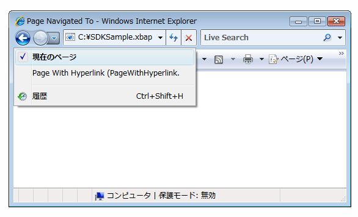

# ナビゲーションの概要
[!INCLUDE[TLA#tla_wpf](../../../../includes/tlasharptla-wpf-md.md)] は、2 種類のアプリケーション \(スタンドアロン アプリケーションと [!INCLUDE[TLA#tla_xbap#plural](../../../../includes/tlasharptla-xbapsharpplural-md.md)]\) で使用可能なブラウザー スタイルのナビゲーションをサポートします。ナビゲーション用にコンテンツをパッケージ化するために、[!INCLUDE[TLA2#tla_wpf](../../../../includes/tla2sharptla-wpf-md.md)] は <xref:System.Windows.Controls.Page> クラスを提供します。  <xref:System.Windows.Controls.Page> 間は、<xref:System.Windows.Documents.Hyperlink> を使用して宣言するか、<xref:System.Windows.Navigation.NavigationService> を使用してプログラムによってナビゲートできます。[!INCLUDE[TLA2#tla_wpf](../../../../includes/tla2sharptla-wpf-md.md)] は、ナビゲート元のページを記録して、それらのページに戻るために履歴を使用します。  
  
 <xref:System.Windows.Controls.Page>、<xref:System.Windows.Documents.Hyperlink>、<xref:System.Windows.Navigation.NavigationService>、および履歴は、[!INCLUDE[TLA2#tla_wpf](../../../../includes/tla2sharptla-wpf-md.md)] によって提供されるナビゲーション サポートの中核を形成しています。  この概要では、Loose [!INCLUDE[TLA#tla_xaml](../../../../includes/tlasharptla-xaml-md.md)] ファイル、[!INCLUDE[TLA#tla_html](../../../../includes/tlasharptla-html-md.md)] ファイル、およびオブジェクトへのナビゲーションを含む高度なナビゲーション サポートについて説明する前に、それらの機能について詳細に説明します。  
  
> [!NOTE]
>  このトピックでは、"ブラウザー" という用語は、[!INCLUDE[TLA2#tla_wpf](../../../../includes/tla2sharptla-wpf-md.md)] のアプリケーションをホスト可能なブラウザーのみを指しています。現在のところ、これには [!INCLUDE[TLA#tla_ie](../../../../includes/tlasharptla-ie-md.md)] と Firefox が含まれます。  特定の [!INCLUDE[TLA2#tla_wpf](../../../../includes/tla2sharptla-wpf-md.md)] 機能が特定のブラウザーでのみサポートされる場合は、ブラウザー バージョンを示します。  
  
   
  
   
## WPF アプリケーションでのナビゲーション  
 ここでは、[!INCLUDE[TLA2#tla_wpf](../../../../includes/tla2sharptla-wpf-md.md)] の主なナビゲーション機能の概要について説明します。  このトピックでは、[!INCLUDE[TLA2#tla_xbap](../../../../includes/tla2sharptla-xbap-md.md)] のコンテキスト内でこれらの機能について説明します。これらの機能はスタンドアロン アプリケーションと [!INCLUDE[TLA2#tla_xbap#plural](../../../../includes/tla2sharptla-xbapsharpplural-md.md)] の両方で使用できます  
  
> [!NOTE]
>  ここでは、[!INCLUDE[TLA2#tla_xbap#plural](../../../../includes/tla2sharptla-xbapsharpplural-md.md)] をビルドして配置する方法については説明しません。  [!INCLUDE[TLA2#tla_xbap#plural](../../../../includes/tla2sharptla-xbapsharpplural-md.md)] の詳細については、「[WPF XAML ブラウザー アプリケーションの概要](../../../../docs/framework/wpf/app-development/wpf-xaml-browser-applications-overview.md)」を参照してください。  
  
 ナビゲーションの次の側面について説明します。  
  
-   [ページの実装](#CreatingAXAMLPage)  
  
-   [開始ページの構成](#Configuring_a_Start_Page)  
  
-   [ホスト ウィンドウのタイトル、幅、および高さの構成](#ConfiguringAXAMLPage)  
  
-   [ハイパーリンク ナビゲーション](#NavigatingBetweenXAMLPages)  
  
-   [フラグメント ナビゲーション](#FragmentNavigation)  
  
-   [ナビゲーション サービス](#NavigationService)  
  
-   [ナビゲーション サービスを使用するプログラム ナビゲーション](#Programmatic_Navigation_with_the_Navigation_Service)  
  
-   [ナビゲーションの有効期間](#Navigation_Lifetime)  
  
-   [履歴によるナビゲーションの記録](#NavigationHistory)  
  
-   [ページの有効期間と履歴](#PageLifetime)  
  
-   [ナビゲーション履歴を使用したコンテンツ状態の保持](#RetainingContentStateWithNavigationHistory)  
  
-   [クッキー](#Cookies)  
  
-   [構造化ナビゲーション](#Structured_Navigation)  
  
   
### ページの実装  
 [!INCLUDE[TLA2#tla_wpf](../../../../includes/tla2sharptla-wpf-md.md)] では、[!INCLUDE[TLA2#tla_winfx](../../../../includes/tla2sharptla-winfx-md.md)] オブジェクト、カスタム オブジェクト、列挙値、ユーザー コントロール、[!INCLUDE[TLA2#tla_xaml](../../../../includes/tla2sharptla-xaml-md.md)] ファイル、および [!INCLUDE[TLA#tla_html](../../../../includes/tlasharptla-html-md.md)] ファイルを含むさまざまなコンテンツ タイプにナビゲートできます。  ただし、コンテンツをパッケージ化する最も一般的で便利な方法は、<xref:System.Windows.Controls.Page> を使用することです。  さらに、<xref:System.Windows.Controls.Page> はナビゲーション固有の機能を実装し、それらの外観を向上して開発を単純化します。  
  
 <xref:System.Windows.Controls.Page> を使用すると、次のようなマークアップを使用して、[!INCLUDE[TLA2#tla_xaml](../../../../includes/tla2sharptla-xaml-md.md)] コンテンツのナビゲート可能なページを宣言によって実装できます。  
  
 [!code-xml[NavigationOverviewSnippets#Page1XAML](../../../../samples/snippets/csharp/VS_Snippets_Wpf/NavigationOverviewSnippets/CSharp/Page1.xaml#page1xaml)]  
  
 [!INCLUDE[TLA2#tla_xaml](../../../../includes/tla2sharptla-xaml-md.md)] マークアップで実装される <xref:System.Windows.Controls.Page> には、ルート要素としての `Page` があり、[!INCLUDE[TLA2#tla_wpf](../../../../includes/tla2sharptla-wpf-md.md)] [!INCLUDE[TLA#tla_xml](../../../../includes/tlasharptla-xml-md.md)] 名前空間宣言が必要です。  `Page` 要素には、ナビゲートして表示するコンテンツが格納されます。  コンテンツは、次のマークアップに示すように、`Page.Content` プロパティ要素を設定して追加します。  
  
 [!code-xml[NavigationOverviewSnippets#Page2XAML](../../../../samples/snippets/csharp/VS_Snippets_Wpf/NavigationOverviewSnippets/CSharp/Page2.xaml#page2xaml)]  
  
 `Page.Content` には 1 つの子要素のみを格納できます。前の例では、コンテンツは単一の文字列 "Hello, Page\!" です。実際の開発では、一般的に、レイアウト コントロールを子要素として使用し \(「[レイアウト](../../../../docs/framework/wpf/advanced/layout.md)」を参照\)、コンテンツを格納して構成します。  
  
 `Page` 要素の子要素は、<xref:System.Windows.Controls.Page> のコンテンツと見なされるため、明示的な `Page.Content` 宣言を使用する必要はありません。  次のマークアップは、前のサンプルの宣言と同等です。  
  
 [!code-xml[NavigationOverviewSnippets#Page3XAML](../../../../samples/snippets/csharp/VS_Snippets_Wpf/NavigationOverviewSnippets/CSharp/Page3.xaml#page3xaml)]  
  
 この場合、`Page.Content` は、`Page` 要素の子要素を使用して自動的に設定されます。  詳細については、「[WPF のコンテンツ モデル](../../../../docs/framework/wpf/controls/wpf-content-model.md)」を参照してください。  
  
 マークアップのみの <xref:System.Windows.Controls.Page> は、コンテンツを表示するとき役立ちます。  ただし、<xref:System.Windows.Controls.Page> はユーザーによるページの操作を可能にするコントロールも表示し、イベントを処理してアプリケーション ロジックを呼び出すことによって、ユーザー操作に応答できます。  対話形式の <xref:System.Windows.Controls.Page> は、次の例に示すように、マークアップと分離コードの組み合わせを使用して実装されます。  
  
 [!code-xml[XBAPAppDefSnippets#HomePageMARKUP](../../../../samples/snippets/csharp/VS_Snippets_Wpf/XBAPAppDefSnippets/CSharp/HomePage.xaml#homepagemarkup)]  
  
 [!code-csharp[XBAPAppDefSnippets#HomePageCODEBEHIND](../../../../samples/snippets/csharp/VS_Snippets_Wpf/XBAPAppDefSnippets/CSharp/HomePage.xaml.cs#homepagecodebehind)]
 [!code-vb[XBAPAppDefSnippets#HomePageCODEBEHIND](../../../../samples/snippets/visualbasic/VS_Snippets_Wpf/XBAPAppDefSnippets/VisualBasic/HomePage.xaml.vb#homepagecodebehind)]  
  
 マークアップ ファイルと分離コード ファイルを連携させるには、次の構成が必要です。  
  
-   マークアップの `Page` 要素に、`x:Class` 属性を含める必要があります。  アプリケーションのビルド時にマークアップ ファイルに `x:Class` が含まれていると、[!INCLUDE[TLA#tla_msbuild](../../../../includes/tlasharptla-msbuild-md.md)] は、`x:Class` 属性で指定された名前を持つ、<xref:System.Windows.Controls.Page> から派生した`partial`クラスを作成します。  そのためには、[!INCLUDE[TLA2#tla_xaml](../../../../includes/tla2sharptla-xaml-md.md)] スキーマ \(`xmlns:x="http://schemas.microsoft.com/winfx/2006/xaml"`\) に [!INCLUDE[TLA2#tla_xml](../../../../includes/tla2sharptla-xml-md.md)] 名前空間宣言を追加する必要があります。  生成された`partial`クラスは `InitializeComponent` を実装します。これを呼び出すとイベントが登録され、マークアップで実装されるプロパティが設定されます。  
  
-   分離コードでは、クラスは、マークアップ内の `x:Class` 属性で指定されている名前を持つ`partial`クラスでなければなりません。また、<xref:System.Windows.Controls.Page> から派生する必要があります。  これによって、分離コード ファイルと、アプリケーションのビルド時にマークアップ ファイル用に生成される`partial`クラスとが関連付けられます \(「[WPF アプリケーションのビルド](../../../../docs/framework/wpf/app-development/building-a-wpf-application-wpf.md)」を参照\)。  
  
-   分離コードでは、<xref:System.Windows.Controls.Page> クラスが実装するコンストラクターで `InitializeComponent` メソッドを呼び出す必要があります。  `InitializeComponent` は、マークアップ ファイル用に生成された `partial` クラスによって実装されるもので、イベントの登録と、マークアップで定義されたプロパティの設定を実行します。  
  
> [!NOTE]
>  [!INCLUDE[TLA#tla_visualstu](../../../../includes/tlasharptla-visualstu-md.md)] を使用してプロジェクトに新しい <xref:System.Windows.Controls.Page> を追加すると、ここでの説明したように、マークアップと分離コードの両方を使用して <xref:System.Windows.Controls.Page> が実装され、マークアップ ファイルと分離コード ファイル間の関連付けの作成に必要な構成が組み込まれます。  
  
 <xref:System.Windows.Controls.Page> を作成すると、これにナビゲートできるようになります。  アプリケーションがナビゲートする最初の <xref:System.Windows.Controls.Page> を指定するには、開始 <xref:System.Windows.Controls.Page> を構成する必要があります。  
  
   
### 開始ページの構成  
 [!INCLUDE[TLA2#tla_xbap#plural](../../../../includes/tla2sharptla-xbapsharpplural-md.md)] では、一定の量のアプリケーション インフラストラクチャをブラウザーでホストする必要があります。  [!INCLUDE[TLA2#tla_wpf](../../../../includes/tla2sharptla-wpf-md.md)] では、<xref:System.Windows.Application> クラスは、必要なアプリケーション インフラストラクチャを確立するアプリケーション定義の一部です \(「[アプリケーション管理の概要](../../../../docs/framework/wpf/app-development/application-management-overview.md)」を参照\)。  
  
 アプリケーション定義は、通常、マークアップと分離コードの両方を使用して、[!INCLUDE[TLA2#tla_msbuild](../../../../includes/tla2sharptla-msbuild-md.md)] `ApplicationDefinition` 項目として構成されたマークアップ ファイルで実装されます。[!INCLUDE[TLA2#tla_xbap](../../../../includes/tla2sharptla-xbap-md.md)] のアプリケーション定義を次に示します。  
  
 [!code-xml[XBAPAppDefSnippets#XBAPApplicationDefinitionMARKUP](../../../../samples/snippets/csharp/VS_Snippets_Wpf/XBAPAppDefSnippets/CSharp/App.xaml#xbapapplicationdefinitionmarkup)]  
  
 [!code-csharp[XBAPAppDefSnippets#XBAPApplicationDefinitionCODEBEHIND](../../../../samples/snippets/csharp/VS_Snippets_Wpf/XBAPAppDefSnippets/CSharp/App.xaml.cs#xbapapplicationdefinitioncodebehind)]
 [!code-vb[XBAPAppDefSnippets#XBAPApplicationDefinitionCODEBEHIND](../../../../samples/snippets/visualbasic/VS_Snippets_Wpf/XBAPAppDefSnippets/VisualBasic/Application.xaml.vb#xbapapplicationdefinitioncodebehind)]  
  
 [!INCLUDE[TLA2#tla_xbap](../../../../includes/tla2sharptla-xbap-md.md)] では、そのアプリケーション定義を使用して開始 <xref:System.Windows.Controls.Page> を指定できます。このページは、[!INCLUDE[TLA2#tla_xbap](../../../../includes/tla2sharptla-xbap-md.md)] が起動したときに自動的に呼び出される <xref:System.Windows.Controls.Page> です。  これを行うには、<xref:System.Windows.Application.StartupUri%2A> プロパティを目的の <xref:System.Windows.Controls.Page> の[!INCLUDE[TLA#tla_uri](../../../../includes/tlasharptla-uri-md.md)] に設定します。  
  
> [!NOTE]
>  ほとんどの場合、<xref:System.Windows.Controls.Page> はアプリケーションにコンパイルされるか、アプリケーションと共に配置されます。  このような場合、<xref:System.Windows.Controls.Page> を識別する [!INCLUDE[TLA2#tla_uri](../../../../includes/tla2sharptla-uri-md.md)] は、パッケージ [!INCLUDE[TLA2#tla_uri](../../../../includes/tla2sharptla-uri-md.md)] です。この URI は、*パッケージ* スキームに準拠した [!INCLUDE[TLA2#tla_uri](../../../../includes/tla2sharptla-uri-md.md)] です。  パッケージ [!INCLUDE[TLA2#tla_uri#plural](../../../../includes/tla2sharptla-urisharpplural-md.md)] については、「[WPF におけるパッケージの URI](../../../../docs/framework/wpf/app-development/pack-uris-in-wpf.md)」で詳細に説明します。以下で説明する http スキームを使用してコンテンツにナビゲートすることもできます。  
  
 次の例に示すように、マークアップで宣言によって <xref:System.Windows.Application.StartupUri%2A> を設定できます。  
  
 [!code-xml[NavigationOverviewSnippets#XBAPApplicationDefinitionMARKUP](../../../../samples/snippets/csharp/VS_Snippets_Wpf/NavigationOverviewSnippets/CSharp/App.xaml#xbapapplicationdefinitionmarkup)]  
  
 この例では、HomePage.xaml を識別する相対パッケージ [!INCLUDE[TLA2#tla_uri](../../../../includes/tla2sharptla-uri-md.md)] によって `StartupUri` 属性を設定します。  [!INCLUDE[TLA2#tla_xbap](../../../../includes/tla2sharptla-xbap-md.md)] が起動すると、自動的に HomePage.xaml にナビゲートしてこのページが表示されます。  次の図に、Web サーバーから起動された [!INCLUDE[TLA2#tla_xbap](../../../../includes/tla2sharptla-xbap-md.md)] を示します。  
  
   
  
> [!NOTE]
>  [!INCLUDE[TLA2#tla_xbap#plural](../../../../includes/tla2sharptla-xbapsharpplural-md.md)] の開発および配置の詳細については、「[WPF XAML ブラウザー アプリケーションの概要](../../../../docs/framework/wpf/app-development/wpf-xaml-browser-applications-overview.md)」と「[WPF アプリケーションの配置](../../../../docs/framework/wpf/app-development/deploying-a-wpf-application-wpf.md)」を参照してください。  
  
   
### ホスト ウィンドウのタイトル、幅、および高さの構成  
 前の図を見て気付くことは、ブラウザーとタブ パネルのタイトルがどちらも [!INCLUDE[TLA2#tla_xbap](../../../../includes/tla2sharptla-xbap-md.md)] の [!INCLUDE[TLA2#tla_uri](../../../../includes/tla2sharptla-uri-md.md)] になっていることです。  タイトルは、長いだけでなく、見た目が良いわけでも役立つ情報になっているわけでもありません。  このため、<xref:System.Windows.Controls.Page> には、<xref:System.Windows.Controls.Page.WindowTitle%2A> プロパティを設定することによってタイトルを変更する方法が用意されています。  さらに、<xref:System.Windows.Controls.Page.WindowWidth%2A> と <xref:System.Windows.Controls.Page.WindowHeight%2A> を設定して、ブラウザー ウィンドウのそれぞれ幅と高さを構成することができます。  
  
 <xref:System.Windows.Controls.Page.WindowTitle%2A>、<xref:System.Windows.Controls.Page.WindowWidth%2A>、および <xref:System.Windows.Controls.Page.WindowHeight%2A> は、次の例に示すように、マークアップで宣言して設定できます。  
  
 [!code-xml[NavigationOverviewSnippets#HomePageMARKUP](../../../../samples/snippets/csharp/VS_Snippets_Wpf/NavigationOverviewSnippets/CSharp/HomePage.xaml#homepagemarkup)]  
  
 結果は次の図のようになります。  
  
   
  
   
### ハイパーリンク ナビゲーション  
 一般的な [!INCLUDE[TLA2#tla_xbap](../../../../includes/tla2sharptla-xbap-md.md)] は複数のページで構成されます。  あるページから別のページにナビゲートする最も簡単な方法は、<xref:System.Windows.Documents.Hyperlink> を使用することです。  次のマークアップに示すように、`Hyperlink` 要素を使用すると、<xref:System.Windows.Documents.Hyperlink> を <xref:System.Windows.Controls.Page> に宣言によって追加できます。  
  
 [!code-xml[NavigationOverviewSnippets#HyperlinkXAML1](../../../../samples/snippets/csharp/VS_Snippets_Wpf/NavigationOverviewSnippets/CSharp/PageWithHyperlink.xaml#hyperlinkxaml1)]  
[!code-xml[NavigationOverviewSnippets#HyperlinkXAML2](../../../../samples/snippets/csharp/VS_Snippets_Wpf/NavigationOverviewSnippets/CSharp/PageWithHyperlink.xaml#hyperlinkxaml2)]  
[!code-xml[NavigationOverviewSnippets#HyperlinkXAML3](../../../../samples/snippets/csharp/VS_Snippets_Wpf/NavigationOverviewSnippets/CSharp/PageWithHyperlink.xaml#hyperlinkxaml3)]  
  
 `Hyperlink` 要素には次のものが必要です。  
  
-   `NavigateUri` 属性によって指定される、ナビゲート先の <xref:System.Windows.Controls.Page> のパッケージ [!INCLUDE[TLA2#tla_uri](../../../../includes/tla2sharptla-uri-md.md)]。  
  
-   テキストやイメージなど、ナビゲーションを開始するときにクリック可能なコンテンツ \(`Hyperlink` 要素に格納可能なコンテンツについては、<xref:System.Windows.Documents.Hyperlink> を参照\)。  
  
 <xref:System.Windows.Documents.Hyperlink> が存在する <xref:System.Windows.Controls.Page> を持つ [!INCLUDE[TLA2#tla_xbap](../../../../includes/tla2sharptla-xbap-md.md)] を次の図に示します。  
  
   
  
 想定されるとおり、<xref:System.Windows.Documents.Hyperlink> をクリックすると、[!INCLUDE[TLA2#tla_xbap](../../../../includes/tla2sharptla-xbap-md.md)] が `NavigateUri` 属性によって識別される <xref:System.Windows.Controls.Page> にナビゲートします。  さらに、[!INCLUDE[TLA2#tla_xbap](../../../../includes/tla2sharptla-xbap-md.md)] は前の <xref:System.Windows.Controls.Page> のエントリを、[!INCLUDE[TLA2#tla_ie](../../../../includes/tla2sharptla-ie-md.md)] の \[最近表示したページ\] の一覧に追加します。  これを次の図に示します。  
  
   
  
 <xref:System.Windows.Controls.Page> 間のナビゲーションをサポートすると同時に、<xref:System.Windows.Documents.Hyperlink> は、フラグメント ナビゲーションもサポートします。  
  
   
### フラグメント ナビゲーション  
 *フラグメント ナビゲーション*は、現在の <xref:System.Windows.Controls.Page> または別の <xref:System.Windows.Controls.Page> にあるコンテンツ フラグメントへのナビゲーションです。  [!INCLUDE[TLA2#tla_wpf](../../../../includes/tla2sharptla-wpf-md.md)] では、コンテンツ フラグメントは名前付き要素に格納されるコンテンツです。  名前付き要素とは、`Name` 属性が設定されている要素です。  コンテンツ フラグメントが格納された `TextBlock` 要素を次のマークアップに示します。  
  
 [!code-xml[NavigationOverviewSnippets#PageWithContentFragmentsMARKUP1](../../../../samples/snippets/csharp/VS_Snippets_Wpf/NavigationOverviewSnippets/CSharp/PageWithFragments.xaml#pagewithcontentfragmentsmarkup1)]  
[!code-xml[NavigationOverviewSnippets#PageWithContentFragmentsMARKUP2](../../../../samples/snippets/csharp/VS_Snippets_Wpf/NavigationOverviewSnippets/CSharp/PageWithFragments.xaml#pagewithcontentfragmentsmarkup2)]  
[!code-xml[NavigationOverviewSnippets#PageWithContentFragmentsMARKUP3](../../../../samples/snippets/csharp/VS_Snippets_Wpf/NavigationOverviewSnippets/CSharp/PageWithFragments.xaml#pagewithcontentfragmentsmarkup3)]  
  
 コンテンツ フラグメントにナビゲートする <xref:System.Windows.Documents.Hyperlink> の場合、`NavigateUri` 属性に次のものを含める必要があります。  
  
-   ナビゲート先のコンテンツ フラグメントがある <xref:System.Windows.Controls.Page> の [!INCLUDE[TLA2#tla_uri](../../../../includes/tla2sharptla-uri-md.md)]。  
  
-   "\#" 文字。  
  
-   コンテンツ フラグメントがある <xref:System.Windows.Controls.Page> 上の要素の名前。  
  
 フラグメント [!INCLUDE[TLA2#tla_uri](../../../../includes/tla2sharptla-uri-md.md)] の形式は、次のとおりです。  
  
 *PageURI* `#` *ElementName*  
  
 コンテンツ フラグメントにナビゲートするように構成されている `Hyperlink` の例を次に示します。  
  
 [!code-xml[NavigationOverviewSnippets#PageThatNavigatesXAML1](../../../../samples/snippets/csharp/VS_Snippets_Wpf/NavigationOverviewSnippets/CSharp/PageThatNavigatesToFragment.xaml#pagethatnavigatesxaml1)]  
[!code-xml[NavigationOverviewSnippets#PageThatNavigatesXAML2](../../../../samples/snippets/csharp/VS_Snippets_Wpf/NavigationOverviewSnippets/CSharp/PageThatNavigatesToFragment.xaml#pagethatnavigatesxaml2)]  
[!code-xml[NavigationOverviewSnippets#PageThatNavigatesXAML3](../../../../samples/snippets/csharp/VS_Snippets_Wpf/NavigationOverviewSnippets/CSharp/PageThatNavigatesToFragment.xaml#pagethatnavigatesxaml3)]  
  
> [!NOTE]
>  ここでは、[!INCLUDE[TLA2#tla_wpf](../../../../includes/tla2sharptla-wpf-md.md)] での既定のフラグメント ナビゲーション実装について説明します。  [!INCLUDE[TLA2#tla_wpf](../../../../includes/tla2sharptla-wpf-md.md)] では、<xref:System.Windows.Navigation.NavigationService.FragmentNavigation?displayProperty=fullName> イベントの処理などが必要な独自のフラグメント ナビゲーション スキームを実装することもできます。  
  
> [!IMPORTANT]
>  Loose [!INCLUDE[TLA2#tla_xaml](../../../../includes/tla2sharptla-xaml-md.md)] ページ \(ルート要素として `Page` を持つマークアップのみの [!INCLUDE[TLA2#tla_xaml](../../../../includes/tla2sharptla-xaml-md.md)] ファイル\) 内のフラグメントには、[!INCLUDE[TLA2#tla_http](../../../../includes/tla2sharptla-http-md.md)] を使用してページを参照可能な場合のみナビゲートできます。  
>   
>  ただし、Loose [!INCLUDE[TLA2#tla_xaml](../../../../includes/tla2sharptla-xaml-md.md)] ページは、自身のフラグメントにナビゲートできます。  
  
   
### ナビゲーション サービス  
 <xref:System.Windows.Documents.Hyperlink> を使用すると、ユーザーは特定の <xref:System.Windows.Controls.Page> へのナビゲーションを開始できますが、ページの位置の特定とダウンロードは <xref:System.Windows.Navigation.NavigationService> クラスによって実行されます。  基本的に、<xref:System.Windows.Navigation.NavigationService> は <xref:System.Windows.Documents.Hyperlink> などのクライアント コードの代わりに、ナビゲーション要求を処理できます。  さらに、<xref:System.Windows.Navigation.NavigationService> はナビゲーション要求の追跡および制御の高レベルなサポートを実装します。  
  
 <xref:System.Windows.Documents.Hyperlink> がクリックされると、[!INCLUDE[TLA2#tla_wpf](../../../../includes/tla2sharptla-wpf-md.md)] は <xref:System.Windows.Navigation.NavigationService.Navigate%2A?displayProperty=fullName> を呼び出し、指定されたパッケージ [!INCLUDE[TLA2#tla_uri](../../../../includes/tla2sharptla-uri-md.md)] にある <xref:System.Windows.Controls.Page> を特定してダウンロードします。  ダウンロードされた <xref:System.Windows.Controls.Page> は、ルート オブジェクトが、ダウンロードされた <xref:System.Windows.Controls.Page> のインスタンスとなっているオブジェクトのツリーに変換されます。  ルート <xref:System.Windows.Controls.Page> オブジェクトへの参照は、<xref:System.Windows.Navigation.NavigationService.Content%2A?displayProperty=fullName> プロパティに格納されます。  ナビゲート先のコンテンツのパッケージ [!INCLUDE[TLA2#tla_uri](../../../../includes/tla2sharptla-uri-md.md)] は、<xref:System.Windows.Navigation.NavigationService.Source%2A?displayProperty=fullName> プロパティに格納されますが、<xref:System.Windows.Navigation.NavigationService.CurrentSource%2A?displayProperty=fullName> にはナビゲート先の最後のページのパッケージ [!INCLUDE[TLA2#tla_uri](../../../../includes/tla2sharptla-uri-md.md)] が格納されます。  
  
> [!NOTE]
>  [!INCLUDE[TLA2#tla_wpf](../../../../includes/tla2sharptla-wpf-md.md)] アプリケーションには、現在アクティブな <xref:System.Windows.Navigation.NavigationService> が複数存在していてもかまいません。  詳細については、このトピックで後述する「[ナビゲーション ホスト](#Navigation_Hosts)」を参照してください。  
  
   
### ナビゲーション サービスを使用するプログラム ナビゲーション  
 ナビゲーションが、<xref:System.Windows.Documents.Hyperlink> を使用してマークアップで宣言として実装されている場合は、開発者が <xref:System.Windows.Navigation.NavigationService> について認識していなくてもかまいません。<xref:System.Windows.Documents.Hyperlink> が自動的に <xref:System.Windows.Navigation.NavigationService> を使用するためです。  つまり、<xref:System.Windows.Documents.Hyperlink> の直接または間接的な親がナビゲーション ホスト \(「[ナビゲーション ホスト](#Navigation_Hosts)」を参照\) である場合、<xref:System.Windows.Documents.Hyperlink> は、そのナビゲーション ホストのナビゲーション サービスを発見および使用して、ナビゲーション要求を処理できます。  
  
 ただし、次の場合は <xref:System.Windows.Navigation.NavigationService> を直接使用する必要があります。  
  
-   既定以外のコンストラクターを使用して <xref:System.Windows.Controls.Page> をインスタンス化する必要がある場合。  
  
-   ナビゲートする前に <xref:System.Windows.Controls.Page> のプロパティを設定する必要がある場合。  
  
-   どの <xref:System.Windows.Controls.Page> にナビゲートするかが、実行時まで決定できない場合。  
  
 これらの場合は、<xref:System.Windows.Navigation.NavigationService> オブジェクトの <xref:System.Windows.Navigation.NavigationService.Navigate%2A> メソッドを呼び出して、プログラムよってナビゲーションを開始するためのコードを記述する必要があります。  そのためには、<xref:System.Windows.Navigation.NavigationService> への参照を取得する必要があります。  
  
#### NavigationService への参照の取得  
 「[ナビゲーション ホスト](#Navigation_Hosts)」で説明する理由によって、[!INCLUDE[TLA2#tla_wpf](../../../../includes/tla2sharptla-wpf-md.md)] アプリケーションには複数の <xref:System.Windows.Navigation.NavigationService> が存在していてもかまいません。  これは、コードに <xref:System.Windows.Navigation.NavigationService> \(通常は、現在の <xref:System.Windows.Controls.Page> にナビゲートした <xref:System.Windows.Navigation.NavigationService>\) を検索する方法が必要なことを意味します。<xref:System.Windows.Navigation.NavigationService> への参照は、`static` <xref:System.Windows.Navigation.NavigationService.GetNavigationService%2A?displayProperty=fullName> メソッドを呼び出して取得できます。  特定の <xref:System.Windows.Controls.Page> にナビゲートした <xref:System.Windows.Navigation.NavigationService> を取得するには、参照を <xref:System.Windows.Navigation.NavigationService.GetNavigationService%2A> メソッドの引数として <xref:System.Windows.Controls.Page> に渡します。  現在の <xref:System.Windows.Controls.Page> の <xref:System.Windows.Navigation.NavigationService> を取得する方法を次のコードに示します。  
  
 [!code-csharp[NavigationOverviewSnippets#GetNSCODEBEHIND1](../../../../samples/snippets/csharp/VS_Snippets_Wpf/NavigationOverviewSnippets/CSharp/GetNSPage.xaml.cs#getnscodebehind1)]  
[!code-csharp[NavigationOverviewSnippets#GetNSCODEBEHIND2](../../../../samples/snippets/csharp/VS_Snippets_Wpf/NavigationOverviewSnippets/CSharp/GetNSPage.xaml.cs#getnscodebehind2)]
[!code-vb[NavigationOverviewSnippets#GetNSCODEBEHIND2](../../../../samples/snippets/visualbasic/VS_Snippets_Wpf/NavigationOverviewSnippets/VisualBasic/GetNSPage.xaml.vb#getnscodebehind2)]  
  
 <xref:System.Windows.Controls.Page> の <xref:System.Windows.Navigation.NavigationService> を検索するショートカットとして、<xref:System.Windows.Controls.Page> は <xref:System.Windows.Controls.Page.NavigationService%2A> プロパティを実装します。  これを次の例に示します。  
  
 [!code-csharp[NavigationOverviewSnippets#GetNSShortcutCODEBEHIND1](../../../../samples/snippets/csharp/VS_Snippets_Wpf/NavigationOverviewSnippets/CSharp/GetNSPageShortCut.xaml.cs#getnsshortcutcodebehind1)]  
[!code-csharp[NavigationOverviewSnippets#GetNSShortcutCODEBEHIND2](../../../../samples/snippets/csharp/VS_Snippets_Wpf/NavigationOverviewSnippets/CSharp/GetNSPageShortCut.xaml.cs#getnsshortcutcodebehind2)]
[!code-vb[NavigationOverviewSnippets#GetNSShortcutCODEBEHIND2](../../../../samples/snippets/visualbasic/VS_Snippets_Wpf/NavigationOverviewSnippets/VisualBasic/GetNSPageShortCut.xaml.vb#getnsshortcutcodebehind2)]  
  
> [!NOTE]
>  <xref:System.Windows.Controls.Page> によって <xref:System.Windows.FrameworkElement.Loaded> イベントが発生した場合、<xref:System.Windows.Controls.Page> は、その <xref:System.Windows.Navigation.NavigationService> への参照のみを取得できます。  
  
#### ページ オブジェクトへのプログラム ナビゲーション  
 <xref:System.Windows.Navigation.NavigationService> を使用して、<xref:System.Windows.Controls.Page> にプログラムによってナビゲートする方法を次の例に示します。  ナビゲート先の <xref:System.Windows.Controls.Page> は、1 つの既定以外のコンストラクターを使用した場合にのみインスタンス化できるため、プログラム ナビゲーションが必要になります。  既定以外のコンストラクターを持つ <xref:System.Windows.Controls.Page> を、次のマークアップおよびコードに示します。  
  
 [!code-xml[NavigationOverviewSnippets#PageWithNonDefaultConstructorXAML](../../../../samples/snippets/csharp/VS_Snippets_Wpf/NavigationOverviewSnippets/CSharp/PageWithNonDefaultConstructor.xaml#pagewithnondefaultconstructorxaml)]  
  
 [!code-csharp[NavigationOverviewSnippets#PageWithNonDefaultConstructorCODEBEHIND](../../../../samples/snippets/csharp/VS_Snippets_Wpf/NavigationOverviewSnippets/CSharp/PageWithNonDefaultConstructor.xaml.cs#pagewithnondefaultconstructorcodebehind)]
 [!code-vb[NavigationOverviewSnippets#PageWithNonDefaultConstructorCODEBEHIND](../../../../samples/snippets/visualbasic/VS_Snippets_Wpf/NavigationOverviewSnippets/VisualBasic/PageWithNonDefaultConstructor.xaml.vb#pagewithnondefaultconstructorcodebehind)]  
  
 既定以外のコンストラクターを持つ <xref:System.Windows.Controls.Page> にナビゲートする <xref:System.Windows.Controls.Page> を、次のマークアップおよびコードに示します。  
  
 [!code-xml[NavigationOverviewSnippets#NSNavigationPageXAML](../../../../samples/snippets/csharp/VS_Snippets_Wpf/NavigationOverviewSnippets/CSharp/NSNavigationPage.xaml#nsnavigationpagexaml)]  
  
 [!code-csharp[NavigationOverviewSnippets#NSNavigationPageCODEBEHIND](../../../../samples/snippets/csharp/VS_Snippets_Wpf/NavigationOverviewSnippets/CSharp/NSNavigationPage.xaml.cs#nsnavigationpagecodebehind)]
 [!code-vb[NavigationOverviewSnippets#NSNavigationPageCODEBEHIND](../../../../samples/snippets/visualbasic/VS_Snippets_Wpf/NavigationOverviewSnippets/VisualBasic/NSNavigationPage.xaml.vb#nsnavigationpagecodebehind)]  
  
 この <xref:System.Windows.Controls.Page> 上の <xref:System.Windows.Documents.Hyperlink> がクリックされると、既定以外のコンストラクターを使用して <xref:System.Windows.Navigation.NavigationService.Navigate%2A?displayProperty=fullName> メソッドを呼び出し、ナビゲート先の <xref:System.Windows.Controls.Page> をインスタンス化することによって、ナビゲーションが開始されます。  <xref:System.Windows.Navigation.NavigationService.Navigate%2A> は、パッケージ [!INCLUDE[TLA2#tla_uri](../../../../includes/tla2sharptla-uri-md.md)] ではなく、<xref:System.Windows.Navigation.NavigationService> がナビゲートするオブジェクトへの参照を受け取ります。  
  
#### パッケージ URI を使用するプログラム ナビゲーション  
 パッケージ [!INCLUDE[TLA2#tla_uri](../../../../includes/tla2sharptla-uri-md.md)] をプログラムによって構築する必要がある場合 \(たとえば、実行時にのみパッケージ [!INCLUDE[TLA2#tla_uri](../../../../includes/tla2sharptla-uri-md.md)] を決定できる場合など\) は、<xref:System.Windows.Navigation.NavigationService.Navigate%2A?displayProperty=fullName> メソッドを使用できます。  これを次の例に示します。  
  
 [!code-xml[NavigationOverviewSnippets#NSUriNavigationPageXAML](../../../../samples/snippets/csharp/VS_Snippets_Wpf/NavigationOverviewSnippets/CSharp/NSUriNavigationPage.xaml#nsurinavigationpagexaml)]  
  
 [!code-csharp[NavigationOverviewSnippets#NSUriNavigationPageCODEBEHIND](../../../../samples/snippets/csharp/VS_Snippets_Wpf/NavigationOverviewSnippets/CSharp/NSUriNavigationPage.xaml.cs#nsurinavigationpagecodebehind)]
 [!code-vb[NavigationOverviewSnippets#NSUriNavigationPageCODEBEHIND](../../../../samples/snippets/visualbasic/VS_Snippets_Wpf/NavigationOverviewSnippets/VisualBasic/NSUriNavigationPage.xaml.vb#nsurinavigationpagecodebehind)]  
  
#### 現在のページの更新  
 <xref:System.Windows.Controls.Page> が、<xref:System.Windows.Navigation.NavigationService.Source%2A?displayProperty=fullName> プロパティに格納されているパッケージ [!INCLUDE[TLA2#tla_uri](../../../../includes/tla2sharptla-uri-md.md)] と同じパッケージ [!INCLUDE[TLA2#tla_uri](../../../../includes/tla2sharptla-uri-md.md)] を持つ場合、このページはダウンロードされません。  [!INCLUDE[TLA2#tla_wpf](../../../../includes/tla2sharptla-wpf-md.md)] で現在のページを再度強制的にダウンロードするには、次の例に示すように <xref:System.Windows.Navigation.NavigationService.Refresh%2A?displayProperty=fullName> メソッドを呼び出します。  
  
 [!code-xml[NavigationOverviewSnippets#NSRefreshNavigationPageXAML1](../../../../samples/snippets/csharp/VS_Snippets_Wpf/NavigationOverviewSnippets/CSharp/NSRefreshNavigationPage.xaml#nsrefreshnavigationpagexaml1)]  
  
 [!code-csharp[NavigationOverviewSnippets#NSRefreshNavigationPageCODEBEHIND1](../../../../samples/snippets/csharp/VS_Snippets_Wpf/NavigationOverviewSnippets/CSharp/NSRefreshNavigationPage.xaml.cs#nsrefreshnavigationpagecodebehind1)]
 [!code-vb[NavigationOverviewSnippets#NSRefreshNavigationPageCODEBEHIND1](../../../../samples/snippets/visualbasic/VS_Snippets_Wpf/NavigationOverviewSnippets/VisualBasic/NSRefreshNavigationPage.xaml.vb#nsrefreshnavigationpagecodebehind1)]  
[!code-csharp[NavigationOverviewSnippets#NSRefreshNavigationPageCODEBEHIND2](../../../../samples/snippets/csharp/VS_Snippets_Wpf/NavigationOverviewSnippets/CSharp/NSRefreshNavigationPage.xaml.cs#nsrefreshnavigationpagecodebehind2)]
[!code-vb[NavigationOverviewSnippets#NSRefreshNavigationPageCODEBEHIND2](../../../../samples/snippets/visualbasic/VS_Snippets_Wpf/NavigationOverviewSnippets/VisualBasic/NSRefreshNavigationPage.xaml.vb#nsrefreshnavigationpagecodebehind2)]  
  
   
### ナビゲーションの有効期間  
 これまで説明したように、ナビゲーションを開始するには多くの方法があります。  ナビゲーションを開始すると、ナビゲーションの進行中は、<xref:System.Windows.Navigation.NavigationService> によって実装された次のイベントを使用して、ナビゲーションを追跡および制御できます。  
  
-   <xref:System.Windows.Navigation.NavigationService.Navigating>.  新しいナビゲーションが要求されると発生します。  ナビゲーションのキャンセルに使用できます。  
  
-   <xref:System.Windows.Navigation.NavigationService.NavigationProgress>.  ダウンロード中に定期的に発生して、ナビゲーションの進行状況に関する情報を提供します。  
  
-   <xref:System.Windows.Navigation.NavigationService.Navigated>.  ページの位置の特定とダウンロードが完了したときに発生します。  
  
-   <xref:System.Windows.Navigation.NavigationService.NavigationStopped>.  ナビゲーションが \(<xref:System.Windows.Navigation.NavigationService.StopLoading%2A> の呼び出しによって\) 中止されたときや、現在のナビゲーションの進行中に新しいナビゲーションが要求されたときに発生します。  
  
-   <xref:System.Windows.Navigation.NavigationService.NavigationFailed>.  要求されたコンテンツに移動する際にエラーが発生すると発生します。  
  
-   <xref:System.Windows.Navigation.NavigationService.LoadCompleted>.  ナビゲート先のコンテンツが読み込まれ、解析されて、レンダリングが開始されると発生します。  
  
-   <xref:System.Windows.Navigation.NavigationService.FragmentNavigation>.  コンテンツ フラグメントへのナビゲーションが開始されたときに、次のタイミングで発生します。  
  
    -   目的のフラグメントが現在のコンテンツに含まれる場合はすぐに発生します。  
  
    -   目的のフラグメントが別のコンテンツに含まれる場合は、ソース コンテンツが読み込まれた後で発生します。  
  
 ナビゲーション イベントが発生する順序を次の図に示します。  
  
   
  
 通常、<xref:System.Windows.Controls.Page> はこれらのイベントの影響を受けません。  アプリケーションはこれらのイベントの影響を受ける可能性が高いため、これらのイベントは <xref:System.Windows.Application> クラスによっても発生します。  
  
-   <xref:System.Windows.Application.Navigating?displayProperty=fullName>  
  
-   <xref:System.Windows.Application.NavigationProgress?displayProperty=fullName>  
  
-   <xref:System.Windows.Application.Navigated?displayProperty=fullName>  
  
-   <xref:System.Windows.Application.NavigationFailed?displayProperty=fullName>  
  
-   <xref:System.Windows.Application.NavigationStopped?displayProperty=fullName>  
  
-   <xref:System.Windows.Application.LoadCompleted?displayProperty=fullName>  
  
-   <xref:System.Windows.Application.FragmentNavigation?displayProperty=fullName>  
  
 <xref:System.Windows.Navigation.NavigationService> によってイベントが発生するたびに、<xref:System.Windows.Application> クラスによって対応するイベントが発生します。  <xref:System.Windows.Controls.Frame> および <xref:System.Windows.Navigation.NavigationWindow> は、それぞれのスコープ内でナビゲーションを検出する同じイベントを提供します。  
  
 場合によっては、<xref:System.Windows.Controls.Page> がこれらのイベントに関与することがあります。  たとえば、<xref:System.Windows.Controls.Page> は <xref:System.Windows.Navigation.NavigationService.Navigating?displayProperty=fullName> イベントを処理して、ページ外へのナビゲーションをキャンセルするかどうかを決定する場合があります。  これを次の例に示します。  
  
 [!code-xml[NavigationOverviewSnippets#CancelNavigationPageXAML](../../../../samples/snippets/csharp/VS_Snippets_Wpf/NavigationOverviewSnippets/CSharp/CancelNavigationPage.xaml#cancelnavigationpagexaml)]  
  
 [!code-csharp[NavigationOverviewSnippets#CancelNavigationPageCODEBEHIND](../../../../samples/snippets/csharp/VS_Snippets_Wpf/NavigationOverviewSnippets/CSharp/CancelNavigationPage.xaml.cs#cancelnavigationpagecodebehind)]
 [!code-vb[NavigationOverviewSnippets#CancelNavigationPageCODEBEHIND](../../../../samples/snippets/visualbasic/VS_Snippets_Wpf/NavigationOverviewSnippets/VisualBasic/CancelNavigationPage.xaml.vb#cancelnavigationpagecodebehind)]  
  
 前の例で行ったように、<xref:System.Windows.Controls.Page> からのナビゲーション イベントを含むハンドラーを登録する場合、イベント ハンドラーの登録を解除する必要もあります。  解除しない場合、[!INCLUDE[TLA2#tla_wpf](../../../../includes/tla2sharptla-wpf-md.md)] ナビゲーションが履歴を使用して <xref:System.Windows.Controls.Page> ナビゲーションを記録する方法に関して副作用が発生する可能性があります。  
  
   
### 履歴によるナビゲーションの記録  
 [!INCLUDE[TLA2#tla_wpf](../../../../includes/tla2sharptla-wpf-md.md)] は、"戻る" スタックと "進む" スタックの 2 つのスタックを使用して、ナビゲート元のページを記録します。  現在の <xref:System.Windows.Controls.Page> から新しい <xref:System.Windows.Controls.Page> にナビゲートするか、既存の <xref:System.Windows.Controls.Page> に進む場合、現在の <xref:System.Windows.Controls.Page> が *"戻る" スタック*に追加されます。  現在の <xref:System.Windows.Controls.Page> から前の <xref:System.Windows.Controls.Page> に戻る場合、現在の <xref:System.Windows.Controls.Page> が *"進む" スタック*に追加されます。  "戻る" スタック、"進む" スタック、およびそれらを管理する機能を、まとめて履歴と呼びます。  "戻る" スタックと "進む" スタックの各項目は、<xref:System.Windows.Navigation.JournalEntry> クラスのインスタンスです。これを*履歴エントリ*と呼びます。  
  
#### Internet Explorer からの履歴のナビゲート  
 概念として、履歴は [!INCLUDE[TLA2#tla_ie](../../../../includes/tla2sharptla-ie-md.md)] の **\[戻る\]** ボタンおよび **\[進む\]** ボタンと同じように機能します。  次の図に例を示します。  
  
   
  
 [!INCLUDE[TLA2#tla_ie](../../../../includes/tla2sharptla-ie-md.md)] によってホストされる [!INCLUDE[TLA2#tla_xbap#plural](../../../../includes/tla2sharptla-xbapsharpplural-md.md)] の場合、[!INCLUDE[TLA2#tla_wpf](../../../../includes/tla2sharptla-wpf-md.md)] は履歴を [!INCLUDE[TLA2#tla_ie](../../../../includes/tla2sharptla-ie-md.md)] のナビゲーション [!INCLUDE[TLA2#tla_ui](../../../../includes/tla2sharptla-ui-md.md)] に統合します。  これによって、ユーザーは [!INCLUDE[TLA2#tla_ie](../../../../includes/tla2sharptla-ie-md.md)] の **\[戻る\]**、**\[進む\]**、および **\[最近表示したページ\]** の各ボタンを使用して [!INCLUDE[TLA2#tla_xbap](../../../../includes/tla2sharptla-xbap-md.md)] のページ間をナビゲートできるようになります。[!INCLUDE[TLA2#tla_ie6](../../../../includes/tla2sharptla-ie6-md.md)] には、[!INCLUDE[TLA2#tla_ie7](../../../../includes/tla2sharptla-ie7-md.md)] または Internet Explorer 8 と同じ方法では履歴は統合されません。  代わりに、[!INCLUDE[TLA2#tla_wpf](../../../../includes/tla2sharptla-wpf-md.md)] は代替ナビゲーション [!INCLUDE[TLA2#tla_ui](../../../../includes/tla2sharptla-ui-md.md)] をレンダリングします。  
  
> [!IMPORTANT]
>  [!INCLUDE[TLA2#tla_ie](../../../../includes/tla2sharptla-ie-md.md)] では、ユーザーが [!INCLUDE[TLA2#tla_xbap](../../../../includes/tla2sharptla-xbap-md.md)] との間をナビゲートすると、履歴に保持されていないページの履歴項目のみが履歴に保持されます。  ページを履歴に保持する方法については、このトピックで後述する「[ページの有効期間と履歴](#PageLifetime)」を参照してください。  
  
 既定では、[!INCLUDE[TLA2#tla_ie](../../../../includes/tla2sharptla-ie-md.md)] の **\[最近表示したページ\]** の一覧に表示される各 <xref:System.Windows.Controls.Page> のテキストは、<xref:System.Windows.Controls.Page> の [!INCLUDE[TLA2#tla_uri](../../../../includes/tla2sharptla-uri-md.md)] になっています。  多くの場合、これはユーザーにとって特別な意味がありません。  このため、次のオプションのいずれかを使用してテキストを変更できます。  
  
1.  `JournalEntry.Name` 添付属性値。  
  
2.  `Page.Title` 属性値。  
  
3.  `Page.WindowTitle` 属性値、および現在の <xref:System.Windows.Controls.Page> の [!INCLUDE[TLA2#tla_uri](../../../../includes/tla2sharptla-uri-md.md)]。  
  
4.  現在の <xref:System.Windows.Controls.Page> の [!INCLUDE[TLA2#tla_uri](../../../../includes/tla2sharptla-uri-md.md)]。  \(既定値\)  
  
 これらのオプションの順序は、テキスト検索の優先順位と一致します。  たとえば、`JournalEntry.Name` が設定されている場合、他の値は無視されます。  
  
 `Page.Title` 属性を使用して、履歴エントリに表示されるテキストを変更する方法を次の例に示します。  
  
 [!code-xml[NavigationOverviewSnippets#PageTitleMARKUP1](../../../../samples/snippets/csharp/VS_Snippets_Wpf/NavigationOverviewSnippets/CSharp/PageWithTitle.xaml#pagetitlemarkup1)]  
[!code-xml[NavigationOverviewSnippets#PageTitleMARKUP2](../../../../samples/snippets/csharp/VS_Snippets_Wpf/NavigationOverviewSnippets/CSharp/PageWithTitle.xaml#pagetitlemarkup2)]  
  
 [!code-csharp[NavigationOverviewSnippets#PageTitleCODEBEHIND1](../../../../samples/snippets/csharp/VS_Snippets_Wpf/NavigationOverviewSnippets/CSharp/PageWithTitle.xaml.cs#pagetitlecodebehind1)]
 [!code-vb[NavigationOverviewSnippets#PageTitleCODEBEHIND1](../../../../samples/snippets/visualbasic/VS_Snippets_Wpf/NavigationOverviewSnippets/VisualBasic/PageWithTitle.xaml.vb#pagetitlecodebehind1)]  
[!code-csharp[NavigationOverviewSnippets#PageTitleCODEBEHIND2](../../../../samples/snippets/csharp/VS_Snippets_Wpf/NavigationOverviewSnippets/CSharp/PageWithTitle.xaml.cs#pagetitlecodebehind2)]
[!code-vb[NavigationOverviewSnippets#PageTitleCODEBEHIND2](../../../../samples/snippets/visualbasic/VS_Snippets_Wpf/NavigationOverviewSnippets/VisualBasic/PageWithTitle.xaml.vb#pagetitlecodebehind2)]  
  
#### WPF を使用する履歴のナビゲート  
 ユーザーは [!INCLUDE[TLA2#tla_ie](../../../../includes/tla2sharptla-ie-md.md)] の **\[戻る\]**、**\[進む\]**、および **\[最近表示したページ\]** を使用して履歴をナビゲートできますが、[!INCLUDE[TLA2#tla_wpf](../../../../includes/tla2sharptla-wpf-md.md)] で提供された宣言による機構やプログラムによる機構を使用しても履歴をナビゲートできます。  これを行うのは、たとえば、独自のナビゲーション [!INCLUDE[TLA2#tla_ui#plural](../../../../includes/tla2sharptla-uisharpplural-md.md)] をページに表示する場合です。  
  
 <xref:System.Windows.Input.NavigationCommands> で公開されるナビゲーション コマンドを使用して、履歴ナビゲーション サポートを宣言によって追加できます。  `BrowseBack` ナビゲーション コマンドの使用方法を次の例に示します。  
  
 [!code-xml[NavigationOverviewSnippets#NavigationCommandsPageXAML1](../../../../samples/snippets/csharp/VS_Snippets_Wpf/NavigationOverviewSnippets/CSharp/NavigationCommandsPage.xaml#navigationcommandspagexaml1)]  
[!code-xml[NavigationOverviewSnippets#NavigationCommandsPageXAML2](../../../../samples/snippets/csharp/VS_Snippets_Wpf/NavigationOverviewSnippets/CSharp/NavigationCommandsPage.xaml#navigationcommandspagexaml2)]  
[!code-xml[NavigationOverviewSnippets#NavigationCommandsPageXAML3](../../../../samples/snippets/csharp/VS_Snippets_Wpf/NavigationOverviewSnippets/CSharp/NavigationCommandsPage.xaml#navigationcommandspagexaml3)]  
[!code-xml[NavigationOverviewSnippets#NavigationCommandsPageXAML4](../../../../samples/snippets/csharp/VS_Snippets_Wpf/NavigationOverviewSnippets/CSharp/NavigationCommandsPage.xaml#navigationcommandspagexaml4)]  
  
 <xref:System.Windows.Navigation.NavigationService> クラスの次のメンバーのいずれかを使用して、プログラムによって履歴をナビゲートできます。  
  
-   <xref:System.Windows.Navigation.NavigationService.GoBack%2A>  
  
-   <xref:System.Windows.Navigation.NavigationService.GoForward%2A>  
  
-   <xref:System.Windows.Navigation.NavigationService.CanGoBack%2A>  
  
-   <xref:System.Windows.Navigation.NavigationService.CanGoForward%2A>  
  
 このトピックの「[ナビゲーション履歴を使用したコンテンツ状態の保持](#RetainingContentStateWithNavigationHistory)」で後述するように、プログラムによって履歴を操作することも可能です。  
  
   
### ページの有効期間と履歴  
 グラフィックス、アニメーション、メディアなどのリッチ コンテンツを含む、複数のページが存在する [!INCLUDE[TLA2#tla_xbap](../../../../includes/tla2sharptla-xbap-md.md)] について説明します。  特にビデオやオーディオ メディアが使用されている場合、これらのページのメモリ使用量は、長時間が経過すると非常に大きくなる可能性があります。  履歴がナビゲート先のページを "記録" することを考えると、このような [!INCLUDE[TLA2#tla_xbap](../../../../includes/tla2sharptla-xbap-md.md)] はすぐに大量のメモリを消費する可能性があります。  
  
 このため、履歴の既定の動作では、<xref:System.Windows.Controls.Page> オブジェクトへの参照ではなく、<xref:System.Windows.Controls.Page> メタデータが各履歴エントリに格納されます。  履歴エントリにナビゲートすると、その <xref:System.Windows.Controls.Page> メタデータを使用して、指定した <xref:System.Windows.Controls.Page> の新しいインスタンスが作成されます。  結果として、ナビゲートされた各 <xref:System.Windows.Controls.Page> には、次の図に示す有効期間が設定されます。  
  
   
  
 既定の履歴動作を使用するとメモリの消費を節約できますが、特にコンテンツが多い場合は、ページごとのレンダリングのパフォーマンスが低下し、<xref:System.Windows.Controls.Page> の再インスタンス化に時間がかかる可能性があります。  <xref:System.Windows.Controls.Page> インスタンスを履歴に保持する必要がある場合、2 つの方法を使用してこれを行うことができます。  1 つ目の方法は、<xref:System.Windows.Navigation.NavigationService.Navigate%2A?displayProperty=fullName> メソッドを呼び出すことによって、<xref:System.Windows.Controls.Page> オブジェクトにプログラムによるナビゲートを行います。  
  
 2 つ目の方法は、<xref:System.Windows.Controls.Page.KeepAlive%2A> プロパティを `true` \(既定値は `false`\) に設定することによって、[!INCLUDE[TLA2#tla_wpf](../../../../includes/tla2sharptla-wpf-md.md)] が <xref:System.Windows.Controls.Page> のインスタンスを履歴に保持するように指定します。  次の例に示すように、マークアップで宣言によって <xref:System.Windows.Controls.Page.KeepAlive%2A> を設定できます。  
  
 [!code-xml[NavigationOverviewSnippets#KeepAlivePageXAML](../../../../samples/snippets/csharp/VS_Snippets_Wpf/NavigationOverviewSnippets/CSharp/KeepAlivePage.xaml#keepalivepagexaml)]  
  
 履歴に保持される <xref:System.Windows.Controls.Page> と保持されないページの有効期間は、わずかに異なります。  履歴に保持される <xref:System.Windows.Controls.Page> が初めてナビゲートされると、履歴に保持されない <xref:System.Windows.Controls.Page> と同様にインスタンス化されます。  ただし、<xref:System.Windows.Controls.Page> のインスタンスは履歴に保持されるため、履歴に残っている限り再びインスタンス化されることはありません。  したがって、<xref:System.Windows.Controls.Page> がナビゲートされるたびに呼び出す必要がある初期化ロジックを <xref:System.Windows.Controls.Page> が持っている場合、それをコンストラクターから <xref:System.Windows.FrameworkElement.Loaded> イベントのハンドラーに移動する必要があります。  このようにしても、次の図に示すように、<xref:System.Windows.Controls.Page> がナビゲート先およびナビゲート元となるたびに、それぞれ <xref:System.Windows.FrameworkElement.Loaded> イベントと <xref:System.Windows.FrameworkElement.Unloaded> イベントが発生します。  
  
   
  
 <xref:System.Windows.Controls.Page> が履歴に保持されない場合、次のいずれの操作も行わないでください。  
  
-   ページへの参照、または一部分を格納する。  
  
-   ページによって実装されていないイベントのイベント ハンドラーを登録する。  
  
 このいずれかの操作を行うと、<xref:System.Windows.Controls.Page> を履歴から削除した後でも強制的にメモリに保持される参照が作成されます。  
  
 通常は、<xref:System.Windows.Controls.Page> を履歴に保持しない <xref:System.Windows.Controls.Page> の既定の動作をお勧めします。  ただし、これには次のセクションで説明する状態も関係します。  
  
   
### ナビゲーション履歴を使用したコンテンツ状態の保持  
 <xref:System.Windows.Controls.Page> が履歴に保持されず、ユーザーからデータを収集するコントロールを持っている場合、ユーザーが <xref:System.Windows.Controls.Page> との間でナビゲートすると、データに対して何が行われるでしょうか。  ユーザー エクスペリエンスの観点では、ユーザーは前に入力したデータが表示されることを期待します。  しかし、<xref:System.Windows.Controls.Page> の新しいインスタンスはナビゲーションごとに作成されるため、データを収集したコントロールが再インスタンス化されてデータは失われます。  
  
 ただし、履歴は <xref:System.Windows.Controls.Page> ナビゲーション間をまたいだデータ \(コントロール データなど\) の記録をサポートします。  具体的には、各 <xref:System.Windows.Controls.Page> の履歴エントリは、関連している <xref:System.Windows.Controls.Page> 状態情報の一時的なコンテナーとして機能します。  <xref:System.Windows.Controls.Page> からナビゲートするときにこのサポートがどのように使用されるかを次の手順に示します。  
  
1.  現在の <xref:System.Windows.Controls.Page> のエントリが履歴に追加されます。  
  
2.  <xref:System.Windows.Controls.Page> の状態情報が、そのページの履歴エントリに格納され、"戻る" スタックに追加されます。  
  
3.  新しい <xref:System.Windows.Controls.Page> にナビゲートします。  
  
 履歴を使用してページ <xref:System.Windows.Controls.Page> に戻るときは、次の手順が実行されます。  
  
1.  <xref:System.Windows.Controls.Page> \("戻る" スタックの 1 番上の履歴エントリ\) がインスタンス化されます。  
  
2.  <xref:System.Windows.Controls.Page> の履歴エントリに格納された状態情報を使用して、<xref:System.Windows.Controls.Page> が更新されます。  
  
3.  <xref:System.Windows.Controls.Page> に戻ります。  
  
 <xref:System.Windows.Controls.Page> で次のコントロールが使用されると、[!INCLUDE[TLA2#tla_wpf](../../../../includes/tla2sharptla-wpf-md.md)] は自動的にこのサポートを使用します。  
  
-   <xref:System.Windows.Controls.CheckBox>  
  
-   <xref:System.Windows.Controls.ComboBox>  
  
-   <xref:System.Windows.Controls.Expander>  
  
-   <xref:System.Windows.Controls.Frame>  
  
-   <xref:System.Windows.Controls.ListBox>  
  
-   <xref:System.Windows.Controls.ListBoxItem>  
  
-   <xref:System.Windows.Controls.MenuItem>  
  
-   <xref:System.Windows.Controls.ProgressBar>  
  
-   <xref:System.Windows.Controls.RadioButton>  
  
-   <xref:System.Windows.Controls.Slider>  
  
-   <xref:System.Windows.Controls.TabControl>  
  
-   <xref:System.Windows.Controls.TabItem>  
  
-   <xref:System.Windows.Controls.TextBox>  
  
 次の図の **\[Favorite Color\]** <xref:System.Windows.Controls.ListBox> が示すように、<xref:System.Windows.Controls.Page> がこれらのコントロールを使用する場合、項目に入力されたデータが <xref:System.Windows.Controls.Page> ナビゲーション間をまたいで記録されます。  
  
   
  
 前述の一覧にないコントロールが <xref:System.Windows.Controls.Page> にある場合や、状態情報がカスタム オブジェクトに格納されている場合、<xref:System.Windows.Controls.Page> ナビゲーション間をまたぐ状態を履歴に記録するコードを記述する必要があります。  
  
 <xref:System.Windows.Controls.Page> ナビゲーション間をまたぐ少量の状態情報を記録する必要がある場合、<xref:System.Windows.FrameworkPropertyMetadata.Journal%2A?displayProperty=fullName> メタデータ フラグを使用して構成された依存関係プロパティ \(<xref:System.Windows.DependencyProperty> を参照\) を使用できます。  
  
 ナビゲーション間をまたいで記録する必要がある <xref:System.Windows.Controls.Page> の状態情報が複数のデータで構成される場合は、状態情報を 1 つのクラスにカプセル化して <xref:System.Windows.Navigation.IProvideCustomContentState> を実装する方が、コードが簡単になる場合があります。  
  
 <xref:System.Windows.Controls.Page> 自体からはナビゲートせずに、1 つの <xref:System.Windows.Controls.Page> のさまざまな状態情報をナビゲートする必要がある場合、<xref:System.Windows.Navigation.IProvideCustomContentState> と <xref:System.Windows.Navigation.NavigationService.AddBackEntry%2A?displayProperty=fullName> を使用できます。  
  
   
### クッキー  
 [!INCLUDE[TLA2#tla_wpf](../../../../includes/tla2sharptla-wpf-md.md)] アプリケーションがデータを格納する別の方法では、クッキーを使用します。クッキーは、<xref:System.Windows.Application.SetCookie%2A> メソッドと <xref:System.Windows.Application.GetCookie%2A> メソッドを使用して作成、更新、および削除されます。  [!INCLUDE[TLA2#tla_wpf](../../../../includes/tla2sharptla-wpf-md.md)] で作成できるクッキーは、他の種類の Web アプリケーションが使用クッキー同じです。クッキーとは、アプリケーション セッションが完了するまで、または複数のアプリケーション セッションにわたって、クライアント コンピューター上にアプリケーションによって格納される任意のデータです。  クッキー データは通常、次のような名前と値の組み合わせで構成されます。  
  
 *Name* `=` *Value*  
  
 データが、クッキーを設定する場所の <xref:System.Uri> と共に <xref:System.Windows.Application.SetCookie%2A> に渡されると、メモリ内にクッキーが作成され、現在のアプリケーション セッションの期間のみ使用可能になります。  この種類のクッキーは、*セッション クッキー* と呼ばれます。  
  
 複数のアプリケーション セッションにわたってクッキーを格納するには、次の形式を使用してクッキーに有効期限を追加する必要があります。  
  
 *NAME* `=` *VALUE* `; expires=DAY, DD-MMM-YYYY HH:MM:SS GMT`  
  
 有効期限を持つクッキーは、その期限が切れるまで、現在の [!INCLUDE[TLA#tla_mswin](../../../../includes/tlasharptla-mswin-md.md)] インストールのインターネット一時ファイル フォルダーに格納されます。  このようなクッキーは、アプリケーション セッションをまたいで存続するため、*永続的なクッキー*と呼ばれます。  
  
 セッション クッキーと永続的なクッキーの両方を取得するには、<xref:System.Windows.Application.GetCookie%2A> メソッドを呼び出し、<xref:System.Windows.Application.SetCookie%2A> メソッドを使用してクッキーを設定した場所の <xref:System.Uri> を渡します。  
  
 [!INCLUDE[TLA2#tla_wpf](../../../../includes/tla2sharptla-wpf-md.md)] でクッキーがどのようにサポートされるかを次に示します。  
  
-   [!INCLUDE[TLA2#tla_wpf](../../../../includes/tla2sharptla-wpf-md.md)] スタンドアロン アプリケーションと [!INCLUDE[TLA2#tla_xbap#plural](../../../../includes/tla2sharptla-xbapsharpplural-md.md)] は、クッキーの作成と管理のどちらも行うことができます。  
  
-   [!INCLUDE[TLA2#tla_xbap](../../../../includes/tla2sharptla-xbap-md.md)] によって作成されたクッキーには、ブラウザーからアクセスできます。  
  
-   同じドメインの [!INCLUDE[TLA2#tla_xbap#plural](../../../../includes/tla2sharptla-xbapsharpplural-md.md)] は、クッキーを共有できます。  
  
-   同じドメインの [!INCLUDE[TLA2#tla_xbap#plural](../../../../includes/tla2sharptla-xbapsharpplural-md.md)] ページと [!INCLUDE[TLA2#tla_html](../../../../includes/tla2sharptla-html-md.md)] ページは、クッキーを作成して共有できます。  
  
-   [!INCLUDE[TLA2#tla_xbap#plural](../../../../includes/tla2sharptla-xbapsharpplural-md.md)] ページと Loose [!INCLUDE[TLA2#tla_xaml](../../../../includes/tla2sharptla-xaml-md.md)] ページが Web 要求を行うと、クッキーがディスパッチされます。  
  
-   IFRAMES にホストされた最上位の [!INCLUDE[TLA2#tla_xbap#plural](../../../../includes/tla2sharptla-xbapsharpplural-md.md)] と [!INCLUDE[TLA2#tla_xbap#plural](../../../../includes/tla2sharptla-xbapsharpplural-md.md)] は、どちらもクッキーにアクセスできます。  
  
-   [!INCLUDE[TLA2#tla_wpf](../../../../includes/tla2sharptla-wpf-md.md)] でのクッキー サポートは、サポートされるすべてのブラウザーで同じです。  
  
-   [!INCLUDE[TLA2#tla_ie](../../../../includes/tla2sharptla-ie-md.md)] では、[!INCLUDE[TLA2#tla_wpf](../../../../includes/tla2sharptla-wpf-md.md)] は、クッキーに関連する P3P ポリシー \(特に開発元とサードパーティの [!INCLUDE[TLA2#tla_xbap#plural](../../../../includes/tla2sharptla-xbapsharpplural-md.md)] に関して\) に従います。  
  
   
### 構造化ナビゲーション  
 <xref:System.Windows.Controls.Page> 間でデータを渡す必要がある場合、<xref:System.Windows.Controls.Page> の既定以外のコンストラクターにデータを引数として渡すことができます。  この方法を使用する場合、<xref:System.Windows.Controls.Page> を履歴に保持する必要があることに注意してください。保持しない場合、次回 <xref:System.Windows.Controls.Page> にナビゲートすると、[!INCLUDE[TLA2#tla_wpf](../../../../includes/tla2sharptla-wpf-md.md)] が既定のコンストラクターを使用して <xref:System.Windows.Controls.Page> を再インスタンス化します。  
  
 または、渡す必要があるデータを使用して設定されたプロパティを <xref:System.Windows.Controls.Page> に実装することもできます。  ただし、<xref:System.Windows.Controls.Page> がナビゲート元の <xref:System.Windows.Controls.Page> にデータを戻す場合は、少し手間がかかります。  問題は、ナビゲート後に <xref:System.Windows.Controls.Page> に戻ることを保証する機構を、ナビゲーションがネイティブにサポートしていないことにあります。  基本的に、ナビゲーションは "呼び出す\/戻る" のセマンティクスをサポートしません。  この問題を解決するため、[!INCLUDE[TLA2#tla_wpf](../../../../includes/tla2sharptla-wpf-md.md)] は、予測可能な構造化された方法で <xref:System.Windows.Controls.Page> に戻ることができるようにする <xref:System.Windows.Navigation.PageFunction%601> クラスを提供します。  詳細については、「[構造化ナビゲーションの概要](../../../../docs/framework/wpf/app-development/structured-navigation-overview.md)」を参照してください。  
  
   
## NavigationWindow クラス  
 ここまでで、ナビゲート可能なコンテンツによってアプリケーションをビルドするために使用する可能性が最も高い、ナビゲーション サービスの全容について説明しました。  これらのサービスについて [!INCLUDE[TLA2#tla_xbap#plural](../../../../includes/tla2sharptla-xbapsharpplural-md.md)] のコンテキストで説明しましたが、[!INCLUDE[TLA2#tla_xbap#plural](../../../../includes/tla2sharptla-xbapsharpplural-md.md)] だけで使用されているわけではありません。  最新のオペレーティング システムおよび [!INCLUDE[TLA2#tla_mswin](../../../../includes/tla2sharptla-mswin-md.md)] アプリケーションでは、最近のユーザーがブラウザーの使用経験を持つことを考慮して、スタンドアロン アプリケーションにブラウザー スタイルのナビゲーションが組み込まれています。一般的な例は次のとおりです。  
  
-   **Word の類義語辞典** : 選択可能な単語をナビゲートします。  
  
-   **ファイル エクスプローラー** : ファイルとフォルダーをナビゲートします。  
  
-   **ウィザード** : 複雑なタスクを複数のページに分割し、ページ間をナビゲートできます。  たとえば、[!INCLUDE[TLA2#tla_mswin](../../../../includes/tla2sharptla-mswin-md.md)] 機能の追加と削除を行う Windows コンポーネント ウィザードなどがあります。  
  
 ブラウザー スタイルのナビゲーションをスタンドアロン アプリケーションに組み込むには、<xref:System.Windows.Navigation.NavigationWindow> クラスを使用します。  <xref:System.Windows.Navigation.NavigationWindow> は、<xref:System.Windows.Window> から派生しており、[!INCLUDE[TLA2#tla_xbap#plural](../../../../includes/tla2sharptla-xbapsharpplural-md.md)] が提供するナビゲーションを同じようにサポートして、ウィンドウを拡張します。<xref:System.Windows.Navigation.NavigationWindow> は、スタンドアロン アプリケーションのメイン ウィンドウとしても、ダイアログ ボックスなどの 2 次ウィンドウとしても使用できます。  
  
 [!INCLUDE[TLA2#tla_wpf](../../../../includes/tla2sharptla-wpf-md.md)] の最上位クラス \(<xref:System.Windows.Window>、<xref:System.Windows.Controls.Page> など\) と同様に <xref:System.Windows.Navigation.NavigationWindow> を実装するには、マークアップと分離コードの組み合わせを使用します。  これを次の例に示します。  
  
 [!code-xml[IntroToNavNavigationWindowSnippets#NavigationWindowMARKUP](../../../../samples/snippets/csharp/VS_Snippets_Wpf/IntroToNavNavigationWindowSnippets/CSharp/MainWindow.xaml#navigationwindowmarkup)]  
  
 [!code-csharp[IntroToNavNavigationWindowSnippets#NavigationWindowCODEBEHIND](../../../../samples/snippets/csharp/VS_Snippets_Wpf/IntroToNavNavigationWindowSnippets/CSharp/MainWindow.xaml.cs#navigationwindowcodebehind)]
 [!code-vb[IntroToNavNavigationWindowSnippets#NavigationWindowCODEBEHIND](../../../../samples/snippets/visualbasic/VS_Snippets_Wpf/IntroToNavNavigationWindowSnippets/VisualBasic/MainWindow.xaml.vb#navigationwindowcodebehind)]  
  
 このコードは、<xref:System.Windows.Navigation.NavigationWindow> を開いたときに自動的に <xref:System.Windows.Controls.Page> \(HomePage.xaml\) にナビゲートする <xref:System.Windows.Navigation.NavigationWindow> を作成します。  <xref:System.Windows.Navigation.NavigationWindow> がアプリケーションのメイン ウィンドウの場合、`StartupUri` 属性を使用してこのウィンドウを起動できます。  これを次のマークアップに示します。  
  
 [!code-xml[IntroToNavNavigationWindowSnippets#AppLaunchNavWindow](../../../../samples/snippets/csharp/VS_Snippets_Wpf/IntroToNavNavigationWindowSnippets/CSharp/App.xaml#applaunchnavwindow)]  
  
 次の図に、スタンドアロン アプリケーションのメイン ウィンドウとしての <xref:System.Windows.Navigation.NavigationWindow> を示します。  
  
   
  
 この図では、前の例の <xref:System.Windows.Navigation.NavigationWindow> 実装コードでは設定しなかったにもかかわらず、<xref:System.Windows.Navigation.NavigationWindow> にタイトルが表示されています。  代わりに、次のコードに示す <xref:System.Windows.Controls.Page.WindowTitle%2A> プロパティを使用してタイトルを設定します。  
  
 [!code-xml[IntroToNavNavigationWindowSnippets#HomePageMARKUP1](../../../../samples/snippets/csharp/VS_Snippets_Wpf/IntroToNavNavigationWindowSnippets/CSharp/HomePage.xaml#homepagemarkup1)]  
[!code-xml[IntroToNavNavigationWindowSnippets#HomePageMARKUP2](../../../../samples/snippets/csharp/VS_Snippets_Wpf/IntroToNavNavigationWindowSnippets/CSharp/HomePage.xaml#homepagemarkup2)]  
  
 <xref:System.Windows.Controls.Page.WindowWidth%2A> プロパティと <xref:System.Windows.Controls.Page.WindowHeight%2A> プロパティを設定すると、<xref:System.Windows.Navigation.NavigationWindow> にも影響を与えます。  
  
 通常、動作または外観をカスタマイズする必要があるときに、独自の <xref:System.Windows.Navigation.NavigationWindow> を実装します。  どちらも行わない場合は、ショートカットを使用できます。  スタンドアロン アプリケーションで <xref:System.Windows.Controls.Page> のパッケージ [!INCLUDE[TLA2#tla_uri](../../../../includes/tla2sharptla-uri-md.md)] を <xref:System.Windows.Application.StartupUri%2A> として指定した場合、<xref:System.Windows.Application> は自動的に <xref:System.Windows.Navigation.NavigationWindow> を作成して <xref:System.Windows.Controls.Page> をホストします。  これを行う方法を次のマークアップに示します。  
  
 [!code-xml[IntroToNavNavigationWindowSnippets#AppLaunchPage](../../../../samples/snippets/csharp/VS_Snippets_Wpf/IntroToNavNavigationWindowSnippets/CSharp/AnotherApp.xaml#applaunchpage)]  
  
 ダイアログ ボックスなどの、アプリケーションの 2 次ウィンドウを <xref:System.Windows.Navigation.NavigationWindow> にする場合、次の例のコードを使用して開くことができます。  
  
 [!code-csharp[IntroToNavNavigationWindowSnippets#CreateNWDialogBox](../../../../samples/snippets/csharp/VS_Snippets_Wpf/IntroToNavNavigationWindowSnippets/CSharp/DialogOwnerWindow.xaml.cs#createnwdialogbox)]
 [!code-vb[IntroToNavNavigationWindowSnippets#CreateNWDialogBox](../../../../samples/snippets/visualbasic/VS_Snippets_Wpf/IntroToNavNavigationWindowSnippets/VisualBasic/DialogOwnerWindow.xaml.vb#createnwdialogbox)]  
  
 結果を次の図に示します。  
  
   
  
 この図では、<xref:System.Windows.Navigation.NavigationWindow> に [!INCLUDE[TLA2#tla_ie](../../../../includes/tla2sharptla-ie-md.md)] スタイルの **\[戻る\]** ボタンと **\[進む\]** ボタンが表示され、ユーザーは履歴をナビゲートできます。  これらのボタンの操作感は、次の図と同じ操作感になります。  
  
   
  
 独自の履歴ナビゲーション サポートと UI をページに含める場合、<xref:System.Windows.Navigation.NavigationWindow.ShowsNavigationUI%2A> プロパティの値を `false` に設定すると、<xref:System.Windows.Navigation.NavigationWindow> によって表示される **\[戻る\]** ボタンと **\[進む\]** ボタンは非表示になります。  
  
 代わりに、[!INCLUDE[TLA2#tla_wpf](../../../../includes/tla2sharptla-wpf-md.md)] のカスタマイズ サポートを使用して、<xref:System.Windows.Navigation.NavigationWindow> 自体の [!INCLUDE[TLA2#tla_ui](../../../../includes/tla2sharptla-ui-md.md)] を置き換えることもできます。  
  
   
## Frame クラス  
 ブラウザーと <xref:System.Windows.Navigation.NavigationWindow> はどちらも、ナビゲート可能なコンテンツをホストするウィンドウです。  場合によっては、ウィンドウ全体にホストする必要がないコンテンツがアプリケーションに存在することもあります。  このようなコンテンツは、代わりに他のコンテンツの内部にホストします。  <xref:System.Windows.Controls.Frame> クラスを使用すると、ナビゲート可能なコンテンツを他のコンテンツに挿入できます。  <xref:System.Windows.Controls.Frame> は、<xref:System.Windows.Navigation.NavigationWindow> および [!INCLUDE[TLA2#tla_xbap#plural](../../../../includes/tla2sharptla-xbapsharpplural-md.md)] と同じサポートを提供します。  
  
 `Frame` 要素を使用して、<xref:System.Windows.Controls.Frame> を <xref:System.Windows.Controls.Page> に宣言によって追加する方法を次のコード例に示します。  
  
 [!code-xml[NavigationOverviewSnippets#FrameHostPageXAML1](../../../../samples/snippets/csharp/VS_Snippets_Wpf/NavigationOverviewSnippets/CSharp/FrameHostPage.xaml#framehostpagexaml1)]  
[!code-xml[NavigationOverviewSnippets#FrameHostPageXAML2](../../../../samples/snippets/csharp/VS_Snippets_Wpf/NavigationOverviewSnippets/CSharp/FrameHostPage.xaml#framehostpagexaml2)]  
[!code-xml[NavigationOverviewSnippets#FrameHostPageXAML3](../../../../samples/snippets/csharp/VS_Snippets_Wpf/NavigationOverviewSnippets/CSharp/FrameHostPage.xaml#framehostpagexaml3)]  
  
 このマークアップでは、<xref:System.Windows.Controls.Frame> が最初にナビゲートする必要がある <xref:System.Windows.Controls.Page> のパッケージ [!INCLUDE[TLA2#tla_uri](../../../../includes/tla2sharptla-uri-md.md)] を使用して、`Frame` 要素の `Source` 属性を設定します。  次の図に、複数のページ間でナビゲートする <xref:System.Windows.Controls.Frame> を持つ <xref:System.Windows.Controls.Page> が存在する [!INCLUDE[TLA2#tla_xbap](../../../../includes/tla2sharptla-xbap-md.md)] を示します。  
  
   
  
 <xref:System.Windows.Controls.Page> のコンテンツの内部にある <xref:System.Windows.Controls.Frame> のみを使用する必要はありません。  <xref:System.Windows.Window> のコンテンツの内部で <xref:System.Windows.Controls.Frame> をホストするのも一般的です。  
  
 既定では、<xref:System.Windows.Controls.Frame> は別の履歴がない場合に独自の履歴のみを使用します。  <xref:System.Windows.Controls.Frame> が、<xref:System.Windows.Navigation.NavigationWindow> または [!INCLUDE[TLA2#tla_xbap](../../../../includes/tla2sharptla-xbap-md.md)] のどちらかの内部にホストされたコンテンツの一部である場合、<xref:System.Windows.Controls.Frame> は <xref:System.Windows.Navigation.NavigationWindow> または [!INCLUDE[TLA2#tla_xbap](../../../../includes/tla2sharptla-xbap-md.md)] に属する履歴を使用します。ただし、場合によっては <xref:System.Windows.Controls.Frame> が独自の履歴を使用する必要があります。  これは、<xref:System.Windows.Controls.Frame> によってホストされるページ内での履歴ナビゲーションを可能にするためです。  これを次の図に示します。  
  
   
  
 この場合、<xref:System.Windows.Controls.Frame> の <xref:System.Windows.Controls.Frame.JournalOwnership%2A> プロパティを <xref:System.Windows.Navigation.JournalOwnership> に設定することによって、<xref:System.Windows.Controls.Frame> が独自の履歴を使用するように構成できます。  これを次のマークアップに示します。  
  
 [!code-xml[NavigationOverviewSnippets#FrameHostPageOwnJournalXAML1](../../../../samples/snippets/csharp/VS_Snippets_Wpf/NavigationOverviewSnippets/CSharp/FrameHostPageOwnJournal.xaml#framehostpageownjournalxaml1)]  
[!code-xml[NavigationOverviewSnippets#FrameHostPageOwnJournalXAML2](../../../../samples/snippets/csharp/VS_Snippets_Wpf/NavigationOverviewSnippets/CSharp/FrameHostPageOwnJournal.xaml#framehostpageownjournalxaml2)]  
[!code-xml[NavigationOverviewSnippets#FrameHostPageOwnJournalXAML3](../../../../samples/snippets/csharp/VS_Snippets_Wpf/NavigationOverviewSnippets/CSharp/FrameHostPageOwnJournal.xaml#framehostpageownjournalxaml3)]  
  
 独自の履歴を使用する <xref:System.Windows.Controls.Frame> 内でのナビゲートの結果を次の図に示します。  
  
   
  
 履歴エントリは、[!INCLUDE[TLA2#tla_ie](../../../../includes/tla2sharptla-ie-md.md)] ではなく、<xref:System.Windows.Controls.Frame> 内のナビゲーション [!INCLUDE[TLA2#tla_ui](../../../../includes/tla2sharptla-ui-md.md)] によって表示される点に注意してください。  
  
> [!NOTE]
>  <xref:System.Windows.Controls.Frame> が、<xref:System.Windows.Window> にホストされているコンテンツの一部である場合、<xref:System.Windows.Controls.Frame> は独自の履歴を使用するため、専用のナビゲーション [!INCLUDE[TLA2#tla_ui](../../../../includes/tla2sharptla-ui-md.md)] を表示します。  
  
 <xref:System.Windows.Controls.Frame> にナビゲーション [!INCLUDE[TLA2#tla_ui](../../../../includes/tla2sharptla-ui-md.md)] を表示せずに独自の履歴を表示することがユーザー エクスペリエンスで必要とされる場合、<xref:System.Windows.Controls.Frame.NavigationUIVisibility%2A> を <xref:System.Windows.Visibility> に設定して、ナビゲーション [!INCLUDE[TLA2#tla_ui](../../../../includes/tla2sharptla-ui-md.md)] を非表示にできます。  これを次のマークアップに示します。  
  
 [!code-xml[NavigationOverviewSnippets#FrameHostPageHidesUIXAML1](../../../../samples/snippets/csharp/VS_Snippets_Wpf/NavigationOverviewSnippets/CSharp/FrameHostPageOwnHiddenJournal.xaml#framehostpagehidesuixaml1)]  
[!code-xml[NavigationOverviewSnippets#FrameHostPageHidesUIXAML2](../../../../samples/snippets/csharp/VS_Snippets_Wpf/NavigationOverviewSnippets/CSharp/FrameHostPageOwnHiddenJournal.xaml#framehostpagehidesuixaml2)]  
[!code-xml[NavigationOverviewSnippets#FrameHostPageHidesUIXAML3](../../../../samples/snippets/csharp/VS_Snippets_Wpf/NavigationOverviewSnippets/CSharp/FrameHostPageOwnHiddenJournal.xaml#framehostpagehidesuixaml3)]  
  
   
## ナビゲーション ホスト  
 <xref:System.Windows.Controls.Frame> と <xref:System.Windows.Navigation.NavigationWindow> は、ナビゲーション ホストと呼ばれるクラスです。  *ナビゲーション ホスト*は、コンテンツにナビゲートして表示することができるクラスです。  これを実現するため、各ナビゲーション ホストは独自の <xref:System.Windows.Navigation.NavigationService> および履歴を使用します。  ナビゲーション ホストの基本的な構造を次の図に示します。  
  
   
  
 これによって、<xref:System.Windows.Navigation.NavigationWindow> および <xref:System.Windows.Controls.Frame> は、実質的に [!INCLUDE[TLA2#tla_xbap](../../../../includes/tla2sharptla-xbap-md.md)] がブラウザーにホストされているときに提供するのと同じナビゲーション サポートを提供できます。  
  
 <xref:System.Windows.Navigation.NavigationService> および履歴を使用することだけでなく、ナビゲーション ホストは <xref:System.Windows.Navigation.NavigationService> が実装するのと同じメンバーを実装します。  これを次の図に示します。  
  
   
  
 アプリケーションでは、これらのメンバーを直接使用してナビゲーション サポートをプログラミングできます。  <xref:System.Windows.Window> 内でホストされる <xref:System.Windows.Controls.Frame> のカスタム ナビゲーション [!INCLUDE[TLA2#tla_ui](../../../../includes/tla2sharptla-ui-md.md)] を独自に作成する場合に、この方法を検討してみてください。さらに、どちらのクラスも、この他に `BackStack` \(<xref:System.Windows.Navigation.NavigationWindow.BackStack%2A?displayProperty=fullName>, <xref:System.Windows.Controls.Frame.BackStack%2A?displayProperty=fullName>\) や `ForwardStack` \(<xref:System.Windows.Navigation.NavigationWindow.ForwardStack%2A?displayProperty=fullName>、<xref:System.Windows.Controls.Frame.ForwardStack%2A?displayProperty=fullName>\) などのナビゲーション関連のメンバーを実装します。これらのメンバーを使用すると、それぞれ "戻る" および "進む" の履歴エントリを列挙できます。  
  
 前に述べたように、アプリケーション内に複数の履歴が存在することがあります。  この例を次の図に示します。  
  
   
  
   
## XAML ページ以外のコンテンツへのナビゲート  
 このトピック全体で、<xref:System.Windows.Controls.Page> とパッケージ [!INCLUDE[TLA2#tla_xbap#plural](../../../../includes/tla2sharptla-xbapsharpplural-md.md)] を使用して、[!INCLUDE[TLA2#tla_wpf](../../../../includes/tla2sharptla-wpf-md.md)] のさまざまなナビゲーション機能について説明してきました。  しかし、アプリケーションにコンパイルされる <xref:System.Windows.Controls.Page> はナビゲート可能なコンテンツの唯一のタイプではなく、パッケージ [!INCLUDE[TLA2#tla_xbap#plural](../../../../includes/tla2sharptla-xbapsharpplural-md.md)] はコンテンツを識別する唯一の方法ではありません。  
  
 ここで示すように、Loose [!INCLUDE[TLA2#tla_xaml](../../../../includes/tla2sharptla-xaml-md.md)] ファイル、[!INCLUDE[TLA2#tla_html](../../../../includes/tla2sharptla-html-md.md)] ファイル、およびオブジェクトにもナビゲートできます。  
  
   
### Loose XAML ファイルへのナビゲート  
 Loose [!INCLUDE[TLA2#tla_xaml](../../../../includes/tla2sharptla-xaml-md.md)] ファイルは、次の特性を持つファイルです。  
  
-   [!INCLUDE[TLA2#tla_xaml](../../../../includes/tla2sharptla-xaml-md.md)] のみが含まれている \(つまり、コードがない\)。  
  
-   適切な名前空間宣言がある。  
  
-   .xaml ファイル名拡張子がある。  
  
 たとえば、Loose [!INCLUDE[TLA2#tla_xaml](../../../../includes/tla2sharptla-xaml-md.md)] ファイル Person.xaml として格納されている次のコンテンツについて考えます。  
  
 [!code-xml[NavigationOverviewSnippets#LooseXAML](../../../../samples/snippets/csharp/VS_Snippets_Wpf/NavigationOverviewSnippets/CSharp/Person.xaml#loosexaml)]  
  
 ファイルをダブルクリックすると、ブラウザーが開き、コンテンツにナビゲートしてコンテンツが表示されます。  これを次の図に示します。  
  
   
  
 Loose [!INCLUDE[TLA2#tla_xaml](../../../../includes/tla2sharptla-xaml-md.md)] ファイルは次の場所から表示できます。  
  
-   ローカル コンピューター、イントラネット、またはインターネットの Web サイト。  
  
-   [!INCLUDE[TLA#tla_unc](../../../../includes/tlasharptla-unc-md.md)] ファイル共有。  
  
-   ローカル ディスク。  
  
 Loose [!INCLUDE[TLA2#tla_xaml](../../../../includes/tla2sharptla-xaml-md.md)] ファイルは、ブラウザーのお気に入りに追加したり、ブラウザーのホーム ページとして設定したりできます。  
  
> [!NOTE]
>  Loose [!INCLUDE[TLA2#tla_xaml](../../../../includes/tla2sharptla-xaml-md.md)] ページの公開および起動の詳細については、「[WPF アプリケーションの配置](../../../../docs/framework/wpf/app-development/deploying-a-wpf-application-wpf.md)」を参照してください。  
  
 Loose [!INCLUDE[TLA2#tla_xaml](../../../../includes/tla2sharptla-xaml-md.md)] に関する 1 つの制限は、部分信頼で安全に実行されるコンテンツしかホストできないという点です。  たとえば、`Window` を Loose [!INCLUDE[TLA2#tla_xaml](../../../../includes/tla2sharptla-xaml-md.md)] ファイルのルート要素とすることはできません。  詳細については、「[WPF 部分信頼セキュリティ](../../../../docs/framework/wpf/wpf-partial-trust-security.md)」を参照してください。  
  
   
### フレームを使用した HTML ファイルへのナビゲート  
 予想されるとおり、[!INCLUDE[TLA2#tla_html](../../../../includes/tla2sharptla-html-md.md)] にもナビゲートできます。  http スキームを使用する [!INCLUDE[TLA2#tla_uri](../../../../includes/tla2sharptla-uri-md.md)] を入力するだけです。  たとえば、次の [!INCLUDE[TLA2#tla_xaml](../../../../includes/tla2sharptla-xaml-md.md)] には、[!INCLUDE[TLA2#tla_html](../../../../includes/tla2sharptla-html-md.md)] ページにナビゲートする <xref:System.Windows.Controls.Frame> が表示されます。  
  
 [!code-xml[NavigationOverviewSnippets#FrameHtmlNavMARKUP](../../../../samples/snippets/csharp/VS_Snippets_Wpf/NavigationOverviewSnippets/CSharp/FrameHTMLNavPage.xaml#framehtmlnavmarkup)]  
  
 [!INCLUDE[TLA2#tla_html](../../../../includes/tla2sharptla-html-md.md)] にナビゲートするには、特殊なアクセス許可が必要です。  たとえば、インターネット ゾーンの部分信頼セキュリティ サンドボックスで実行されている [!INCLUDE[TLA2#tla_xbap](../../../../includes/tla2sharptla-xbap-md.md)] からはナビゲートできません。詳細については、「[WPF 部分信頼セキュリティ](../../../../docs/framework/wpf/wpf-partial-trust-security.md)」を参照してください。  
  
   
### WebBrowser コントロールを使用した HTML ファイルへのナビゲート  
 <xref:System.Windows.Controls.WebBrowser> コントロールでは、[!INCLUDE[TLA2#tla_html](../../../../includes/tla2sharptla-html-md.md)] ドキュメント ホスティング、ナビゲーション、およびスクリプト\/マネージ コードの相互運用性がサポートされます。  <xref:System.Windows.Controls.WebBrowser> コントロールの詳細については、「<xref:System.Windows.Controls.WebBrowser>」を参照してください。  
  
 <xref:System.Windows.Controls.Frame> と同様に、<xref:System.Windows.Controls.WebBrowser> を使用して [!INCLUDE[TLA2#tla_html](../../../../includes/tla2sharptla-html-md.md)] にナビゲートするには、特殊なアクセス許可が必要です。  たとえば、部分信頼アプリケーションからは、起点にある [!INCLUDE[TLA2#tla_html](../../../../includes/tla2sharptla-html-md.md)] にのみナビゲートできます。  詳細については、「[WPF 部分信頼セキュリティ](../../../../docs/framework/wpf/wpf-partial-trust-security.md)」を参照してください。  
  
   
### カスタム オブジェクトへのナビゲート  
 カスタム オブジェクトとして格納されたデータがある場合、そのデータを表示する 1 つの方法は、それらのオブジェクトにバインドされたコンテンツを使用して <xref:System.Windows.Controls.Page> を作成することです \(「[データ バインドの概要](../../../../docs/framework/wpf/data/data-binding-overview.md)」を参照\)。  オブジェクトを表示するためだけにページ全体を作成するオーバーヘッドが必要ない場合、代わりにオブジェクトに直接ナビゲートすることもできます。  
  
 次のコードに実装された `Person` クラスについて考えます。  
  
 [!code-csharp[NavigateToObjectSnippets#PersonClassCODE](../../../../samples/snippets/csharp/VS_Snippets_Wpf/NavigateToObjectSnippets/CSharp/Person.cs#personclasscode)]
 [!code-vb[NavigateToObjectSnippets#PersonClassCODE](../../../../samples/snippets/visualbasic/VS_Snippets_Wpf/NavigateToObjectSnippets/VisualBasic/Person.vb#personclasscode)]  
  
 このクラスにナビゲートするには、次のコードに示すように、<xref:System.Windows.Navigation.NavigationWindow.Navigate%2A?displayProperty=fullName> メソッドを呼び出します。  
  
 [!code-xml[NavigateToObjectSnippets#PageThatNavsToObject1](../../../../samples/snippets/csharp/VS_Snippets_Wpf/NavigateToObjectSnippets/CSharp/HomePage.xaml#pagethatnavstoobject1)]  
[!code-xml[NavigateToObjectSnippets#PageThatNavsToObject2](../../../../samples/snippets/csharp/VS_Snippets_Wpf/NavigateToObjectSnippets/CSharp/HomePage.xaml#pagethatnavstoobject2)]  
[!code-xml[NavigateToObjectSnippets#PageThatNavsToObject3](../../../../samples/snippets/csharp/VS_Snippets_Wpf/NavigateToObjectSnippets/CSharp/HomePage.xaml#pagethatnavstoobject3)]  
  
 [!code-csharp[NavigateToObjectSnippets#PageThatNavsToObjectCODEBEHIND](../../../../samples/snippets/csharp/VS_Snippets_Wpf/NavigateToObjectSnippets/CSharp/HomePage.xaml.cs#pagethatnavstoobjectcodebehind)]
 [!code-vb[NavigateToObjectSnippets#PageThatNavsToObjectCODEBEHIND](../../../../samples/snippets/visualbasic/VS_Snippets_Wpf/NavigateToObjectSnippets/VisualBasic/HomePage.xaml.vb#pagethatnavstoobjectcodebehind)]  
  
 結果を次の図に示します。  
  
   
  
 この図では、役に立つものが何も表示されていません。  実際に、表示される値は Person オブジェクトの `ToString` メソッドの戻り値です。既定では、これは [!INCLUDE[TLA2#tla_wpf](../../../../includes/tla2sharptla-wpf-md.md)] がオブジェクトの表示に使用できる唯一の値です。  `ToString` メソッドをオーバーライドすると、より意味のある情報を返すことができますが、それでも文字列値でしかありません。  [!INCLUDE[TLA2#tla_wpf](../../../../includes/tla2sharptla-wpf-md.md)] の表示機能を活用する 1 つの方法として、データ テンプレートを使用できます。  [!INCLUDE[TLA2#tla_wpf](../../../../includes/tla2sharptla-wpf-md.md)] が特定の種類のオブジェクトと関連付けることができる、データ テンプレートを実装できます。  `Person` オブジェクトのデータ テンプレートを次のコードに示します。  
  
 [!code-xml[NavigateToObjectSnippets#DataTemplateMARKUP](../../../../samples/snippets/csharp/VS_Snippets_Wpf/NavigateToObjectSnippets/CSharp/App.xaml#datatemplatemarkup)]  
  
 ここでは、`DataType` 属性で `x:Type` マークアップ拡張機能を使用することによって、データ テンプレートが `Person` 型と関連付けられます。  次に、データ テンプレートは `TextBlock` 要素 \(<xref:System.Windows.Controls.TextBlock> を参照\) を `Person` クラスのプロパティにバインドします。  `Person` オブジェクトの更新された外観を次の図に示します。  
  
   
  
 この方法の利点は、データ テンプレートを再使用して、アプリケーションの任意の場所でオブジェクトを一貫して表示できるようにすることによって得られる一貫性です。  
  
 データ テンプレートの詳細については、「[データ テンプレートの概要](../../../../docs/framework/wpf/data/data-templating-overview.md)」を参照してください。  
  
   
## セキュリティ  
 [!INCLUDE[TLA2#tla_wpf](../../../../includes/tla2sharptla-wpf-md.md)] ナビゲーション サポートによって、[!INCLUDE[TLA2#tla_xbap#plural](../../../../includes/tla2sharptla-xbapsharpplural-md.md)] をインターネット全体にナビゲートし、アプリケーションにサード パーティのコンテンツをホストすることが可能になります。  アプリケーションとユーザーの両方を有害な動作から保護するため、[!INCLUDE[TLA2#tla_wpf](../../../../includes/tla2sharptla-wpf-md.md)] はさまざまなセキュリティ機能を提供します。これらの機能の詳細については、「[セキュリティ](../../../../docs/framework/wpf/security-wpf.md)」と「[WPF 部分信頼セキュリティ](../../../../docs/framework/wpf/wpf-partial-trust-security.md)」を参照してください。  
  
## 参照  
 <xref:System.Windows.Application.SetCookie%2A>   
 <xref:System.Windows.Application.GetCookie%2A>   
 [アプリケーション管理の概要](../../../../docs/framework/wpf/app-development/application-management-overview.md)   
 [WPF におけるパッケージの URI](../../../../docs/framework/wpf/app-development/pack-uris-in-wpf.md)   
 [構造化ナビゲーションの概要](../../../../docs/framework/wpf/app-development/structured-navigation-overview.md)   
 [ナビゲーション トポロジの概要](../../../../docs/framework/wpf/app-development/navigation-topologies-overview.md)   
 [方法のトピック](../../../../docs/framework/wpf/app-development/navigation-how-to-topics.md)   
 [WPF アプリケーションの配置](../../../../docs/framework/wpf/app-development/deploying-a-wpf-application-wpf.md)