# ナビゲーションの概要
Windows Presentation Foundation (WPF) は、2 種類のアプリケーションで使用できるブラウザー スタイルのナビゲーションをサポートしています: スタンドアロン アプリケーションと[!INCLUDE[TLA#tla_xbap#plural](../../../../includes/tlasharptla-xbapsharpplural-md.md)]です。 ナビゲーションのためのパッケージのコンテンツを[!INCLUDE[TLA2#tla_wpf](../../../../includes/tla2sharptla-wpf-md.md)]提供、<xref:System.Windows.Controls.Page>クラスです。 1 つから移動することができます<xref:System.Windows.Controls.Page>別に宣言してを使用して、 <xref:System.Windows.Documents.Hyperlink>、またはを使用して、プログラムによって、<xref:System.Windows.Navigation.NavigationService>です。 [!INCLUDE[TLA2#tla_wpf](../../../../includes/tla2sharptla-wpf-md.md)] は、ナビゲート元のページを記憶し、それらのページに戻るために、履歴を使用します。  
  
 <xref:System.Windows.Controls.Page>、 <xref:System.Windows.Documents.Hyperlink>、 <xref:System.Windows.Navigation.NavigationService>、およびジャーナル フォームで提供されているナビゲーションのサポートの中核となる[!INCLUDE[TLA2#tla_wpf](../../../../includes/tla2sharptla-wpf-md.md)]です。 この概要は、高度なナビゲーション サポートが厳密でないへのナビゲーションをカバーする前にこれらの機能の詳細を検討[!INCLUDE[TLA#tla_xaml](../../../../includes/tlasharptla-xaml-md.md)]ファイル、[!INCLUDE[TLA#tla_html](../../../../includes/tlasharptla-html-md.md)]ファイル、およびオブジェクト。  
  
> [!NOTE]
>  このトピックでは、"browser"のみを指しますブラウザーをホストできる[!INCLUDE[TLA2#tla_wpf](../../../../includes/tla2sharptla-wpf-md.md)]アプリケーションで、現在は[!INCLUDE[TLA#tla_ie](../../../../includes/tlasharptla-ie-md.md)]および Firefox です。 特定[!INCLUDE[TLA2#tla_wpf](../../../../includes/tla2sharptla-wpf-md.md)]機能が特定のブラウザーでのみサポートされている、ブラウザーのバージョンと呼びます。  
   
     
## WPF アプリケーションでのナビゲーション  
 このトピック内でのキーのナビゲーション機能の概要を説明する[!INCLUDE[TLA2#tla_wpf](../../../../includes/tla2sharptla-wpf-md.md)]です。 これらの機能は、両方のスタンドアロン アプリケーションで使用できると[!INCLUDE[TLA2#tla_xbap#plural](../../../../includes/tla2sharptla-xbapsharpplural-md.md)]、このトピックでは、それらのコンテキスト内で、[!INCLUDE[TLA2#tla_xbap](../../../../includes/tla2sharptla-xbap-md.md)]です。  
  
> [!NOTE]
>  このトピックの内容がビルドおよび配置する方法について説明しません[!INCLUDE[TLA2#tla_xbap#plural](../../../../includes/tla2sharptla-xbapsharpplural-md.md)]です。 詳細については[!INCLUDE[TLA2#tla_xbap#plural](../../../../includes/tla2sharptla-xbapsharpplural-md.md)]を参照してください[WPF XAML ブラウザー アプリケーションの概要](../../../../docs/framework/wpf/app-development/wpf-xaml-browser-applications-overview.md)です。  
  
 このセクションでは、ナビゲーションの次の側面について説明し、例を示します。  
  
-   [ページの実装](#CreatingAXAMLPage)  
  
-   [スタート ページの構成](#Configuring_a_Start_Page)  
  
-   [ホスト ウィンドウのタイトル、幅、および高さの構成](#ConfiguringAXAMLPage)  
  
-   [ハイパーリンクのナビゲーション](#NavigatingBetweenXAMLPages)  
  
-   [フラグメント ナビゲーション](#FragmentNavigation)  
  
-   [ナビゲーション サービス](#NavigationService)  
  
-   [ナビゲーション サービスによるプログラム ナビゲーション](#Programmatic_Navigation_with_the_Navigation_Service)  
  
-   [ナビゲーションの有効期間](#Navigation_Lifetime)  
  
-   [履歴によるナビゲーションの記憶](#NavigationHistory)  
  
-   [ページの有効期間と履歴](#PageLifetime)  
  
-   [ナビゲーション履歴によるコンテンツの状態の保持](#RetainingContentStateWithNavigationHistory)  
  
-   [Cookie](#Cookies)  
  
-   [構造化ナビゲーション](#Structured_Navigation)  
  
   
### ページの実装  
 [!INCLUDE[TLA2#tla_wpf](../../../../includes/tla2sharptla-wpf-md.md)]、.NET Framework のオブジェクト、カスタム オブジェクト、列挙値、ユーザー コントロールを含むいくつかのコンテンツ タイプに移動できます[!INCLUDE[TLA2#tla_xaml](../../../../includes/tla2sharptla-xaml-md.md)]ファイル、および[!INCLUDE[TLA#tla_html](../../../../includes/tlasharptla-html-md.md)]ファイル。 ただし、できたら、パッケージのコンテンツを最も一般的で便利な方法を使用して、<xref:System.Windows.Controls.Page>です。 さらに、<xref:System.Windows.Controls.Page>の外観を改善し、開発を簡略化する特定のナビゲーション機能を実装します。  
  
 使用して<xref:System.Windows.Controls.Page>、宣言のナビゲート可能なページを実装することができます[!INCLUDE[TLA2#tla_xaml](../../../../includes/tla2sharptla-xaml-md.md)]次のようなマークアップを使用してコンテンツ。  
  
 [!code-xaml[NavigationOverviewSnippets#Page1XAML](../../../../samples/snippets/csharp/VS_Snippets_Wpf/NavigationOverviewSnippets/CSharp/Page1.xaml#page1xaml)]  
  
 A<xref:System.Windows.Controls.Page>で実装される[!INCLUDE[TLA2#tla_xaml](../../../../includes/tla2sharptla-xaml-md.md)]マークアップが`Page`のルート要素とする必要があります、 [!INCLUDE[TLA2#tla_wpf](../../../../includes/tla2sharptla-wpf-md.md)] [!INCLUDE[TLA#tla_xml](../../../../includes/tlasharptla-xml-md.md)]名前空間の宣言。 `Page`要素に移動し、表示するコンテンツが含まれています。 設定してコンテンツを追加する、`Page.Content`プロパティ要素のマークアップを次に示すようにします。  
  
 [!code-xaml[NavigationOverviewSnippets#Page2XAML](../../../../samples/snippets/csharp/VS_Snippets_Wpf/NavigationOverviewSnippets/CSharp/Page2.xaml#page2xaml)]  
  
 `Page.Content` には、1 つの子要素のみを含めることができます。前の例では、コンテンツは単一の文字列「Hello, Page!」です。 実際には、通常使用するレイアウト コントロールの子要素として (を参照してください[レイアウト](../../../../docs/framework/wpf/advanced/layout.md)) が含まれており、コンテンツを作成します。  
  
 子要素、`Page`要素のコンテンツと見なされます、 <xref:System.Windows.Controls.Page> 、その結果、必要し、しない、明示的なを使用する`Page.Content`宣言します。 次のマークアップは、前のサンプルの宣言と同等です。  
  
 [!code-xaml[NavigationOverviewSnippets#Page3XAML](../../../../samples/snippets/csharp/VS_Snippets_Wpf/NavigationOverviewSnippets/CSharp/Page3.xaml#page3xaml)]  
  
 この場合、`Page.Content`の子要素と自動的に設定されている、`Page`要素。 詳細については、「[WPF のコンテンツ モデル](../../../../docs/framework/wpf/controls/wpf-content-model.md)」を参照してください。  
  
 マークアップのみ<xref:System.Windows.Controls.Page>はコンテンツを表示するのに便利です。 ただし、<xref:System.Windows.Controls.Page>表示コントロール、ページと対話するユーザーに許可することができ、イベントを処理し、アプリケーション ロジックを呼び出すことによってユーザーの操作に対応できます。 対話的な<xref:System.Windows.Controls.Page>は、次の例で示すようにマークアップと分離コードとの組み合わせを使用して実装されています。  
  
 [!code-xaml[XBAPAppDefSnippets#HomePageMARKUP](../../../../samples/snippets/csharp/VS_Snippets_Wpf/XBAPAppDefSnippets/CSharp/HomePage.xaml#homepagemarkup)]  
  
 [!code-csharp[XBAPAppDefSnippets#HomePageCODEBEHIND](../../../../samples/snippets/csharp/VS_Snippets_Wpf/XBAPAppDefSnippets/CSharp/HomePage.xaml.cs#homepagecodebehind)]
 [!code-vb[XBAPAppDefSnippets#HomePageCODEBEHIND](../../../../samples/snippets/visualbasic/VS_Snippets_Wpf/XBAPAppDefSnippets/VisualBasic/HomePage.xaml.vb#homepagecodebehind)]  
  
 マークアップ ファイルと分離コード ファイルを連携させるには、次の構成が必要です。  
  
-   マークアップで、`Page`要素を含める必要があります、`x:Class`属性。 アプリケーションのビルド時の存在`x:Class`マークアップ ファイルが原因となって[!INCLUDE[TLA#tla_msbuild](../../../../includes/tlasharptla-msbuild-md.md)]を作成する、`partial`から派生したクラス<xref:System.Windows.Controls.Page>によって指定される名前を持つ、`x:Class`属性。 追加が必要です、[!INCLUDE[TLA2#tla_xml](../../../../includes/tla2sharptla-xml-md.md)]の名前空間宣言、[!INCLUDE[TLA2#tla_xaml](../../../../includes/tla2sharptla-xaml-md.md)]スキーマ ( `xmlns:x="http://schemas.microsoft.com/winfx/2006/xaml"` )。 生成された`partial`クラスが実装する`InitializeComponent`マークアップに、イベントを登録し、プロパティを設定すると呼ばれるは実装されています。  
  
-   分離コード クラスがある必要があります、`partial`によって指定される同じ名前のクラス、`x:Class`マークアップ、およびその属性がから派生する必要があります<xref:System.Windows.Controls.Page>です。 これにより、分離コード ファイルに関連付けられる、`partial`アプリケーションのビルド時に、マークアップ ファイルに対して生成されるクラス (を参照してください[WPF アプリケーションのビルド](../../../../docs/framework/wpf/app-development/building-a-wpf-application-wpf.md))。  
  
-   分離コードで、<xref:System.Windows.Controls.Page>クラスは、呼び出すコンス トラクターを実装する必要があります、`InitializeComponent`メソッドです。 `InitializeComponent` 実装ファイルの生成されたマークアップで`partial`イベントを登録し、マークアップで定義されているプロパティを設定するクラス。  
  
> [!NOTE]
>  新しいを追加すると<xref:System.Windows.Controls.Page>を使用して、プロジェクトに[!INCLUDE[TLA#tla_visualstu](../../../../includes/tlasharptla-visualstu-md.md)]、<xref:System.Windows.Controls.Page>マークアップと分離コードの両方を使用して実装ととしてのマークアップと分離コード ファイル間の関連付けを作成するために必要な構成が含まれていますここで説明します。  
  
 作成したら、<xref:System.Windows.Controls.Page>に移動することができます。 1 つを指定する<xref:System.Windows.Controls.Page>アプリケーションに移動することは、開始を構成する必要が<xref:System.Windows.Controls.Page>です。  
  
   
### スタート ページの構成  
 [!INCLUDE[TLA2#tla_xbap#plural](../../../../includes/tla2sharptla-xbapsharpplural-md.md)] では、一定の量のアプリケーション インフラストラクチャをブラウザーでホストする必要があります。 [!INCLUDE[TLA2#tla_wpf](../../../../includes/tla2sharptla-wpf-md.md)]、<xref:System.Windows.Application>クラスは、必要なアプリケーション インフラストラクチャを確立するアプリケーション定義の一部 (を参照してください[アプリケーション管理の概要](../../../../docs/framework/wpf/app-development/application-management-overview.md))。  
  
 アプリケーション定義は、通常を実装として構成されているマークアップ ファイルと共にマークアップと分離コードの両方を使用して、 [!INCLUDE[TLA2#tla_msbuild](../../../../includes/tla2sharptla-msbuild-md.md)] `ApplicationDefinition`項目。 アプリケーション定義を次に示します、[!INCLUDE[TLA2#tla_xbap](../../../../includes/tla2sharptla-xbap-md.md)]です。  
  
 [!code-xaml[XBAPAppDefSnippets#XBAPApplicationDefinitionMARKUP](../../../../samples/snippets/csharp/VS_Snippets_Wpf/XBAPAppDefSnippets/CSharp/App.xaml#xbapapplicationdefinitionmarkup)]  
  
 [!code-csharp[XBAPAppDefSnippets#XBAPApplicationDefinitionCODEBEHIND](../../../../samples/snippets/csharp/VS_Snippets_Wpf/XBAPAppDefSnippets/CSharp/App.xaml.cs#xbapapplicationdefinitioncodebehind)]
 [!code-vb[XBAPAppDefSnippets#XBAPApplicationDefinitionCODEBEHIND](../../../../samples/snippets/visualbasic/VS_Snippets_Wpf/XBAPAppDefSnippets/VisualBasic/Application.xaml.vb#xbapapplicationdefinitioncodebehind)]  
  
 [!INCLUDE[TLA2#tla_xbap](../../../../includes/tla2sharptla-xbap-md.md)]アプリケーション定義を使用して、開始を指定できます<xref:System.Windows.Controls.Page>、これは、<xref:System.Windows.Controls.Page>自動的に読み込まれるときに、[!INCLUDE[TLA2#tla_xbap](../../../../includes/tla2sharptla-xbap-md.md)]が起動します。 設定して、これを行う、<xref:System.Windows.Application.StartupUri%2A>を持つプロパティ、[!INCLUDE[TLA#tla_uri](../../../../includes/tlasharptla-uri-md.md)]目的の<xref:System.Windows.Controls.Page>します。  
  
> [!NOTE]
>  ほとんどの場合、<xref:System.Windows.Controls.Page>がまたはにコンパイルされ、アプリケーションと一緒に配置します。 このような場合、[!INCLUDE[TLA2#tla_uri](../../../../includes/tla2sharptla-uri-md.md)]を識別する、<xref:System.Windows.Controls.Page>パック[!INCLUDE[TLA2#tla_uri](../../../../includes/tla2sharptla-uri-md.md)]、これは、[!INCLUDE[TLA2#tla_uri](../../../../includes/tla2sharptla-uri-md.md)]に準拠した、*パック*スキームです。 パック[!INCLUDE[TLA2#tla_uri#plural](../../../../includes/tla2sharptla-urisharpplural-md.md)]については、説明でさらに[WPF のパック Uri](../../../../docs/framework/wpf/app-development/pack-uris-in-wpf.md)です。 以下で説明する http スキームを使用してコンテンツにナビゲートすることもできます。  
  
 設定することができます<xref:System.Windows.Application.StartupUri%2A>次の例で示すように、マークアップで宣言します。  
  
 [!code-xaml[NavigationOverviewSnippets#XBAPApplicationDefinitionMARKUP](../../../../samples/snippets/csharp/VS_Snippets_Wpf/NavigationOverviewSnippets/CSharp/App.xaml#xbapapplicationdefinitionmarkup)]  
  
 この例では、`StartupUri`相対パッケージ属性が設定[!INCLUDE[TLA2#tla_uri](../../../../includes/tla2sharptla-uri-md.md)]HomePage.xaml を識別します。 ときに、[!INCLUDE[TLA2#tla_xbap](../../../../includes/tla2sharptla-xbap-md.md)]が起動すると、HomePage.xaml は自動的に移動され、表示します。 これは、次の図で示される、 [!INCLUDE[TLA2#tla_xbap](../../../../includes/tla2sharptla-xbap-md.md)] Web サーバーからを起動されました。  
  
 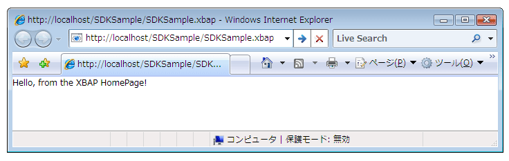  
  
> [!NOTE]
>  開発と展開に関する詳細については[!INCLUDE[TLA2#tla_xbap#plural](../../../../includes/tla2sharptla-xbapsharpplural-md.md)]を参照してください[WPF XAML ブラウザー アプリケーションの概要](../../../../docs/framework/wpf/app-development/wpf-xaml-browser-applications-overview.md)と[WPF アプリケーションを配置する](../../../../docs/framework/wpf/app-development/deploying-a-wpf-application-wpf.md)です。  
  
   
### ホスト ウィンドウのタイトル、幅、および高さの構成  
 前の図からお気付き 1 つの点は、ブラウザーとタブのパネルのタイトル、[!INCLUDE[TLA2#tla_uri](../../../../includes/tla2sharptla-uri-md.md)]の[!INCLUDE[TLA2#tla_xbap](../../../../includes/tla2sharptla-xbap-md.md)]です。 このタイトルは、長いだけでなく、見た目が良いわけでも、有益な情報になっているわけでもありません。 このため、<xref:System.Windows.Controls.Page>を設定してタイトルを変更する方法を提供する、<xref:System.Windows.Controls.Page.WindowTitle%2A>プロパティです。 ブラウザー ウィンドウの高さと幅を構成を設定するさらに、<xref:System.Windows.Controls.Page.WindowWidth%2A>と<xref:System.Windows.Controls.Page.WindowHeight%2A>、それぞれします。  
  
 <xref:System.Windows.Controls.Page.WindowTitle%2A>、 <xref:System.Windows.Controls.Page.WindowWidth%2A>、および<xref:System.Windows.Controls.Page.WindowHeight%2A>を宣言して設定されるマークアップでは、次の例で示すようにします。  
  
 [!code-xaml[NavigationOverviewSnippets#HomePageMARKUP](../../../../samples/snippets/csharp/VS_Snippets_Wpf/NavigationOverviewSnippets/CSharp/HomePage.xaml#homepagemarkup)]  
  
 結果を次の例に示します。  
  
   
  
   
### ハイパーリンクのナビゲーション  
 一般的な[!INCLUDE[TLA2#tla_xbap](../../../../includes/tla2sharptla-xbap-md.md)]いくつかのページで構成されます。 1 つのページ間を移動する最も簡単な方法は使用する、<xref:System.Windows.Documents.Hyperlink>です。 宣言を追加することができます、<xref:System.Windows.Documents.Hyperlink>を<xref:System.Windows.Controls.Page>を使用して、`Hyperlink`要素は、次のマークアップに表示されます。  
  
 [!code-xaml[NavigationOverviewSnippets#HyperlinkXAML1](../../../../samples/snippets/csharp/VS_Snippets_Wpf/NavigationOverviewSnippets/CSharp/PageWithHyperlink.xaml#hyperlinkxaml1)]  
[!code-xaml[NavigationOverviewSnippets#HyperlinkXAML2](../../../../samples/snippets/csharp/VS_Snippets_Wpf/NavigationOverviewSnippets/CSharp/PageWithHyperlink.xaml#hyperlinkxaml2)]  
[!code-xaml[NavigationOverviewSnippets#HyperlinkXAML3](../../../../samples/snippets/csharp/VS_Snippets_Wpf/NavigationOverviewSnippets/CSharp/PageWithHyperlink.xaml#hyperlinkxaml3)]  
  
 A`Hyperlink`要素には、次が必要です。  
  
-   パック[!INCLUDE[TLA2#tla_uri](../../../../includes/tla2sharptla-uri-md.md)]の<xref:System.Windows.Controls.Page>に移動して指定されたとおり、`NavigateUri`属性。  
  
-   コンテンツのテキストやイメージなど、ナビゲーションを開始するために、ユーザーがクリックできます (コンテンツを`Hyperlink`要素に使用できるを参照してください<xref:System.Windows.Documents.Hyperlink>)。  
  
 次の図に示しています、[!INCLUDE[TLA2#tla_xbap](../../../../includes/tla2sharptla-xbap-md.md)]で、<xref:System.Windows.Controls.Page>を持つ、<xref:System.Windows.Documents.Hyperlink>です。  
  
 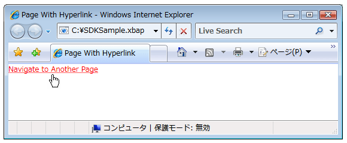  
  
 想定されるようをクリックすると、<xref:System.Windows.Documents.Hyperlink>により、[!INCLUDE[TLA2#tla_xbap](../../../../includes/tla2sharptla-xbap-md.md)]に移動する、<xref:System.Windows.Controls.Page>によって識別される、`NavigateUri`属性。 さらに、 [!INCLUDE[TLA2#tla_xbap](../../../../includes/tla2sharptla-xbap-md.md)] 、前のエントリを追加<xref:System.Windows.Controls.Page>を最近表示したページの一覧に[!INCLUDE[TLA2#tla_ie](../../../../includes/tla2sharptla-ie-md.md)]です。 これを次の図に示します。  
  
 ![[戻る] ボタンと [進む] ボタン](../../../../docs/framework/wpf/app-development/media/navigationoverviewfigure4.png "NavigationOverviewFigure4")  
  
 1 つからナビゲーションをサポートすることに加えて<xref:System.Windows.Controls.Page>別<xref:System.Windows.Documents.Hyperlink>サポートによるナビゲーションのフラグメントもします。  
  
   
### フラグメント ナビゲーション  
 *フラグメント ナビゲーション*いずれかでコンテンツ フラグメントへのナビゲーションは現在、<xref:System.Windows.Controls.Page>別または<xref:System.Windows.Controls.Page>です。 [!INCLUDE[TLA2#tla_wpf](../../../../includes/tla2sharptla-wpf-md.md)]、コンテンツ フラグメントは、名前付きの要素が含まれるコンテンツ。 名前付きの要素を持つ要素は、その`Name`属性に設定します。 次のマークアップを示しています、名前付き`TextBlock`コンテンツ フラグメントを格納する要素。  
  
 [!code-xaml[NavigationOverviewSnippets#PageWithContentFragmentsMARKUP1](../../../../samples/snippets/csharp/VS_Snippets_Wpf/NavigationOverviewSnippets/CSharp/PageWithFragments.xaml#pagewithcontentfragmentsmarkup1)]  
[!code-xaml[NavigationOverviewSnippets#PageWithContentFragmentsMARKUP2](../../../../samples/snippets/csharp/VS_Snippets_Wpf/NavigationOverviewSnippets/CSharp/PageWithFragments.xaml#pagewithcontentfragmentsmarkup2)]  
[!code-xaml[NavigationOverviewSnippets#PageWithContentFragmentsMARKUP3](../../../../samples/snippets/csharp/VS_Snippets_Wpf/NavigationOverviewSnippets/CSharp/PageWithFragments.xaml#pagewithcontentfragmentsmarkup3)]  
  
 <xref:System.Windows.Documents.Hyperlink>コンテンツ フラグメントへ移動する、`NavigateUri`属性は、次を含める必要があります。  
  
-   [!INCLUDE[TLA2#tla_uri](../../../../includes/tla2sharptla-uri-md.md)]の<xref:System.Windows.Controls.Page>コンテンツ フラグメントへの移動に使用します。  
  
-   「#」文字。  
  
-   上にある要素の名前、<xref:System.Windows.Controls.Page>コンテンツ フラグメントを格納しています。  
  
 フラグメント[!INCLUDE[TLA2#tla_uri](../../../../includes/tla2sharptla-uri-md.md)]形式は次のとおりです。  
  
 *PageURI* `#` *ElementName*  
  
 次の例を示しています、`Hyperlink`コンテンツ フラグメントへの移動に構成されています。  
  
 [!code-xaml[NavigationOverviewSnippets#PageThatNavigatesXAML1](../../../../samples/snippets/csharp/VS_Snippets_Wpf/NavigationOverviewSnippets/CSharp/PageThatNavigatesToFragment.xaml#pagethatnavigatesxaml1)]  
[!code-xaml[NavigationOverviewSnippets#PageThatNavigatesXAML2](../../../../samples/snippets/csharp/VS_Snippets_Wpf/NavigationOverviewSnippets/CSharp/PageThatNavigatesToFragment.xaml#pagethatnavigatesxaml2)]  
[!code-xaml[NavigationOverviewSnippets#PageThatNavigatesXAML3](../../../../samples/snippets/csharp/VS_Snippets_Wpf/NavigationOverviewSnippets/CSharp/PageThatNavigatesToFragment.xaml#pagethatnavigatesxaml3)]  
  
> [!NOTE]
>  このセクションで、既定のフラグメント ナビゲーションの実装について説明で[!INCLUDE[TLA2#tla_wpf](../../../../includes/tla2sharptla-wpf-md.md)]です。 [!INCLUDE[TLA2#tla_wpf](../../../../includes/tla2sharptla-wpf-md.md)] 部分的に処理が必要ですが、独自のフラグメント ナビゲーション スキームを実装することもできます、<xref:System.Windows.Navigation.NavigationService.FragmentNavigation?displayProperty=nameWithType>イベント。  
  
> [!IMPORTANT]
>  緩やかにフラグメントに移動することができます[!INCLUDE[TLA2#tla_xaml](../../../../includes/tla2sharptla-xaml-md.md)]ページ (マークアップのみ[!INCLUDE[TLA2#tla_xaml](../../../../includes/tla2sharptla-xaml-md.md)]ファイルが`Page`ルート要素として) を使用して、ページを参照できる場合にのみ[!INCLUDE[TLA2#tla_http](../../../../includes/tla2sharptla-http-md.md)]です。  
>   
>  ただし、loose[!INCLUDE[TLA2#tla_xaml](../../../../includes/tla2sharptla-xaml-md.md)]ページは、独自のフラグメントに移動できます。  
  
   
### ナビゲーション サービス  
 中に<xref:System.Windows.Documents.Hyperlink>により、ユーザーは特定のナビゲーションを開始する<xref:System.Windows.Controls.Page>での検索とダウンロード ページの作業を行う、<xref:System.Windows.Navigation.NavigationService>クラスです。 基本的に、<xref:System.Windows.Navigation.NavigationService>など、クライアント コードに代わってナビゲーション要求を処理する機能を提供、<xref:System.Windows.Documents.Hyperlink>です。 さらに、<xref:System.Windows.Navigation.NavigationService>を追跡し、ナビゲーション要求の影響を与える上位レベルのサポートを実装します。  
  
 ときに、<xref:System.Windows.Documents.Hyperlink>がクリックされた[!INCLUDE[TLA2#tla_wpf](../../../../includes/tla2sharptla-wpf-md.md)]呼び出し<xref:System.Windows.Navigation.NavigationService.Navigate%2A?displayProperty=nameWithType>を探して、ダウンロード、 <xref:System.Windows.Controls.Page> 、指定されたパック[!INCLUDE[TLA2#tla_uri](../../../../includes/tla2sharptla-uri-md.md)]です。 ダウンロードした<xref:System.Windows.Controls.Page>ルート オブジェクトが、ダウンロード済みのインスタンスは、オブジェクトのツリーに変換されます<xref:System.Windows.Controls.Page>です。 ルートへの参照を<xref:System.Windows.Controls.Page>にオブジェクトが格納されている、<xref:System.Windows.Navigation.NavigationService.Content%2A?displayProperty=nameWithType>プロパティです。 パック[!INCLUDE[TLA2#tla_uri](../../../../includes/tla2sharptla-uri-md.md)]内を移動したコンテンツが格納されているため、<xref:System.Windows.Navigation.NavigationService.Source%2A?displayProperty=nameWithType>プロパティ、中に、 <xref:System.Windows.Navigation.NavigationService.CurrentSource%2A?displayProperty=nameWithType> 、パックを保存[!INCLUDE[TLA2#tla_uri](../../../../includes/tla2sharptla-uri-md.md)]の最後のページに移動しました。  
  
> [!NOTE]
>  できます、[!INCLUDE[TLA2#tla_wpf](../../../../includes/tla2sharptla-wpf-md.md)]アプリケーションに複数のいずれかの現在アクティブなが<xref:System.Windows.Navigation.NavigationService>です。 詳細については、次を参照してください。[ナビゲーション ホスト](#Navigation_Hosts)このトピックで後述します。  
  
   
### ナビゲーション サービスによるプログラム ナビゲーション  
 について知っておく必要はありません<xref:System.Windows.Navigation.NavigationService>ナビゲーションがマークアップを使用して宣言によって実装されている場合<xref:System.Windows.Documents.Hyperlink>ので、<xref:System.Windows.Documents.Hyperlink>を使用して、<xref:System.Windows.Navigation.NavigationService>自分の代わりにします。 つまりの直接または間接の親いる限り、<xref:System.Windows.Documents.Hyperlink>ナビゲーション ホストは、(を参照してください[ナビゲーション ホスト](#Navigation_Hosts))、<xref:System.Windows.Documents.Hyperlink>を見つけて、ナビゲーション ホストのナビゲーション サービスを使用して処理するようになります、ナビゲーション要求します。  
  
 ただし、状況もあるを使用する必要がある場合<xref:System.Windows.Navigation.NavigationService>直接、次を含みます。  
  
-   インスタンスを作成する必要がある場合、<xref:System.Windows.Controls.Page>既定以外のコンス トラクターを使用します。  
  
-   プロパティを設定する必要がある場合、<xref:System.Windows.Controls.Page>に移動する前にします。  
  
-   ときに、<xref:System.Windows.Controls.Page>ことが必要に移動できない場合にのみ決定できます実行時にします。  
  
 これらの状況では、プログラムで呼び出すことによってナビゲーションを開始するコードを記述する必要があります、<xref:System.Windows.Navigation.NavigationService.Navigate%2A>のメソッド、<xref:System.Windows.Navigation.NavigationService>オブジェクト。 参照を取得するを必要とする、<xref:System.Windows.Navigation.NavigationService>です。  
  
#### NavigationService への参照の取得  
 対象となっているため、[ナビゲーション ホスト](#Navigation_Hosts) セクションで、[!INCLUDE[TLA2#tla_wpf](../../../../includes/tla2sharptla-wpf-md.md)]アプリケーションは、1 つ以上を持つことができます<xref:System.Windows.Navigation.NavigationService>です。 つまり、コードを調べる方法も必要、 <xref:System.Windows.Navigation.NavigationService>、これは、通常、<xref:System.Windows.Navigation.NavigationService>現在に移動する<xref:System.Windows.Controls.Page>です。 参照を取得することができます、<xref:System.Windows.Navigation.NavigationService>を呼び出して、 `static` <xref:System.Windows.Navigation.NavigationService.GetNavigationService%2A?displayProperty=nameWithType>メソッドです。 取得する、<xref:System.Windows.Navigation.NavigationService>特定へ移動する<xref:System.Windows.Controls.Page>への参照を渡す、<xref:System.Windows.Controls.Page>の引数として、<xref:System.Windows.Navigation.NavigationService.GetNavigationService%2A>メソッドです。 次のコードを取得する方法を示しています、<xref:System.Windows.Navigation.NavigationService>現在の<xref:System.Windows.Controls.Page>します。  
  
 [!code-csharp[NavigationOverviewSnippets#GetNSCODEBEHIND1](../../../../samples/snippets/csharp/VS_Snippets_Wpf/NavigationOverviewSnippets/CSharp/GetNSPage.xaml.cs#getnscodebehind1)]  
[!code-csharp[NavigationOverviewSnippets#GetNSCODEBEHIND2](../../../../samples/snippets/csharp/VS_Snippets_Wpf/NavigationOverviewSnippets/CSharp/GetNSPage.xaml.cs#getnscodebehind2)]
[!code-vb[NavigationOverviewSnippets#GetNSCODEBEHIND2](../../../../samples/snippets/visualbasic/VS_Snippets_Wpf/NavigationOverviewSnippets/VisualBasic/GetNSPage.xaml.vb#getnscodebehind2)]  
  
 検索するためのショートカットとして、<xref:System.Windows.Navigation.NavigationService>の<xref:System.Windows.Controls.Page>、<xref:System.Windows.Controls.Page>を実装する、<xref:System.Windows.Controls.Page.NavigationService%2A>プロパティです。 これを次の例に示します。  
  
 [!code-csharp[NavigationOverviewSnippets#GetNSShortcutCODEBEHIND1](../../../../samples/snippets/csharp/VS_Snippets_Wpf/NavigationOverviewSnippets/CSharp/GetNSPageShortCut.xaml.cs#getnsshortcutcodebehind1)]  
[!code-csharp[NavigationOverviewSnippets#GetNSShortcutCODEBEHIND2](../../../../samples/snippets/csharp/VS_Snippets_Wpf/NavigationOverviewSnippets/CSharp/GetNSPageShortCut.xaml.cs#getnsshortcutcodebehind2)]
[!code-vb[NavigationOverviewSnippets#GetNSShortcutCODEBEHIND2](../../../../samples/snippets/visualbasic/VS_Snippets_Wpf/NavigationOverviewSnippets/VisualBasic/GetNSPageShortCut.xaml.vb#getnsshortcutcodebehind2)]  
  
> [!NOTE]
>  A<xref:System.Windows.Controls.Page>のみへの参照を取得できます、<xref:System.Windows.Navigation.NavigationService>とき<xref:System.Windows.Controls.Page>を生成、<xref:System.Windows.FrameworkElement.Loaded>イベント。  
  
#### ページ オブジェクトへのプログラム ナビゲーション  
 次の例を使用する方法を示しています、<xref:System.Windows.Navigation.NavigationService>にプログラムで移動する、<xref:System.Windows.Controls.Page>です。 プログラムによるナビゲーションは必要なため、<xref:System.Windows.Controls.Page>は移動先のみインスタンス化すること、既定以外の 1 つのコンス トラクターを使用します。 <xref:System.Windows.Controls.Page>既定以外のコンス トラクターを持つは、次のマークアップとコードで示すようにします。  
  
 [!code-xaml[NavigationOverviewSnippets#PageWithNonDefaultConstructorXAML](../../../../samples/snippets/csharp/VS_Snippets_Wpf/NavigationOverviewSnippets/CSharp/PageWithNonDefaultConstructor.xaml#pagewithnondefaultconstructorxaml)]  
  
 [!code-csharp[NavigationOverviewSnippets#PageWithNonDefaultConstructorCODEBEHIND](../../../../samples/snippets/csharp/VS_Snippets_Wpf/NavigationOverviewSnippets/CSharp/PageWithNonDefaultConstructor.xaml.cs#pagewithnondefaultconstructorcodebehind)]
 [!code-vb[NavigationOverviewSnippets#PageWithNonDefaultConstructorCODEBEHIND](../../../../samples/snippets/visualbasic/VS_Snippets_Wpf/NavigationOverviewSnippets/VisualBasic/PageWithNonDefaultConstructor.xaml.vb#pagewithnondefaultconstructorcodebehind)]  
  
 <xref:System.Windows.Controls.Page>に移動する、<xref:System.Windows.Controls.Page>既定以外のコンス トラクターを持つは、次のマークアップとコードで示すようにします。  
  
 [!code-xaml[NavigationOverviewSnippets#NSNavigationPageXAML](../../../../samples/snippets/csharp/VS_Snippets_Wpf/NavigationOverviewSnippets/CSharp/NSNavigationPage.xaml#nsnavigationpagexaml)]  
  
 [!code-csharp[NavigationOverviewSnippets#NSNavigationPageCODEBEHIND](../../../../samples/snippets/csharp/VS_Snippets_Wpf/NavigationOverviewSnippets/CSharp/NSNavigationPage.xaml.cs#nsnavigationpagecodebehind)]
 [!code-vb[NavigationOverviewSnippets#NSNavigationPageCODEBEHIND](../../../../samples/snippets/visualbasic/VS_Snippets_Wpf/NavigationOverviewSnippets/VisualBasic/NSNavigationPage.xaml.vb#nsnavigationpagecodebehind)]  
  
 ときに、<xref:System.Windows.Documents.Hyperlink>この<xref:System.Windows.Controls.Page>がクリックすると、ナビゲーションが開始されたインスタンス化して、<xref:System.Windows.Controls.Page>既定以外のコンス トラクターを使用して、呼び出しに移動する、<xref:System.Windows.Navigation.NavigationService.Navigate%2A?displayProperty=nameWithType>メソッドです。 <xref:System.Windows.Navigation.NavigationService.Navigate%2A> オブジェクトへの参照を受け入れること、<xref:System.Windows.Navigation.NavigationService>パックではなくに移動されます[!INCLUDE[TLA2#tla_uri](../../../../includes/tla2sharptla-uri-md.md)]です。  
  
#### パック URI によるプログラム ナビゲーション  
 パックを作成する必要がある場合[!INCLUDE[TLA2#tla_uri](../../../../includes/tla2sharptla-uri-md.md)]プログラムで (できますのみを決定する場合、パック[!INCLUDE[TLA2#tla_uri](../../../../includes/tla2sharptla-uri-md.md)]実行時に、たとえば) を使用することができます、<xref:System.Windows.Navigation.NavigationService.Navigate%2A?displayProperty=nameWithType>メソッド。 これを次の例に示します。  
  
 [!code-xaml[NavigationOverviewSnippets#NSUriNavigationPageXAML](../../../../samples/snippets/csharp/VS_Snippets_Wpf/NavigationOverviewSnippets/CSharp/NSUriNavigationPage.xaml#nsurinavigationpagexaml)]  
  
 [!code-csharp[NavigationOverviewSnippets#NSUriNavigationPageCODEBEHIND](../../../../samples/snippets/csharp/VS_Snippets_Wpf/NavigationOverviewSnippets/CSharp/NSUriNavigationPage.xaml.cs#nsurinavigationpagecodebehind)]
 [!code-vb[NavigationOverviewSnippets#NSUriNavigationPageCODEBEHIND](../../../../samples/snippets/visualbasic/VS_Snippets_Wpf/NavigationOverviewSnippets/VisualBasic/NSUriNavigationPage.xaml.vb#nsurinavigationpagecodebehind)]  
  
#### 現在のページの更新  
 A <xref:System.Windows.Controls.Page> pack が同じ場合はダウンロードされません[!INCLUDE[TLA2#tla_uri](../../../../includes/tla2sharptla-uri-md.md)]パックと[!INCLUDE[TLA2#tla_uri](../../../../includes/tla2sharptla-uri-md.md)]に格納されている、<xref:System.Windows.Navigation.NavigationService.Source%2A?displayProperty=nameWithType>プロパティです。 強制的に[!INCLUDE[TLA2#tla_wpf](../../../../includes/tla2sharptla-wpf-md.md)]、現在のページを再度ダウンロードするに呼び出せる、<xref:System.Windows.Navigation.NavigationService.Refresh%2A?displayProperty=nameWithType>メソッドを次の例で示すようにします。  
  
 [!code-xaml[NavigationOverviewSnippets#NSRefreshNavigationPageXAML1](../../../../samples/snippets/csharp/VS_Snippets_Wpf/NavigationOverviewSnippets/CSharp/NSRefreshNavigationPage.xaml#nsrefreshnavigationpagexaml1)]  
  
 [!code-csharp[NavigationOverviewSnippets#NSRefreshNavigationPageCODEBEHIND1](../../../../samples/snippets/csharp/VS_Snippets_Wpf/NavigationOverviewSnippets/CSharp/NSRefreshNavigationPage.xaml.cs#nsrefreshnavigationpagecodebehind1)]
 [!code-vb[NavigationOverviewSnippets#NSRefreshNavigationPageCODEBEHIND1](../../../../samples/snippets/visualbasic/VS_Snippets_Wpf/NavigationOverviewSnippets/VisualBasic/NSRefreshNavigationPage.xaml.vb#nsrefreshnavigationpagecodebehind1)]  
[!code-csharp[NavigationOverviewSnippets#NSRefreshNavigationPageCODEBEHIND2](../../../../samples/snippets/csharp/VS_Snippets_Wpf/NavigationOverviewSnippets/CSharp/NSRefreshNavigationPage.xaml.cs#nsrefreshnavigationpagecodebehind2)]
[!code-vb[NavigationOverviewSnippets#NSRefreshNavigationPageCODEBEHIND2](../../../../samples/snippets/visualbasic/VS_Snippets_Wpf/NavigationOverviewSnippets/VisualBasic/NSRefreshNavigationPage.xaml.vb#nsrefreshnavigationpagecodebehind2)]  
  
   
### ナビゲーションの有効期間  
 これまでに説明したように、ナビゲーションを開始するには多くの方法があります。 ナビゲーションが開始され、ナビゲーションは、進行中は、追跡およびによって実装される次のイベントを使用してナビゲーションに影響を与えるとき<xref:System.Windows.Navigation.NavigationService>:  
  
-   <xref:System.Windows.Navigation.NavigationService.Navigating>。 新しいナビゲーションが要求されたときに発生します。 ナビゲーションのキャンセルに使用できます。  
  
-   <xref:System.Windows.Navigation.NavigationService.NavigationProgress>。 ナビゲーション進行状況の情報提供を目的として、ダウンロード中に定期的に発生します。  
  
-   <xref:System.Windows.Navigation.NavigationService.Navigated>。 ページの位置が特定され、ダウンロードされたときに発生します。  
  
-   <xref:System.Windows.Navigation.NavigationService.NavigationStopped>。 ナビゲーションが停止しているときに発生 (を呼び出して<xref:System.Windows.Navigation.NavigationService.StopLoading%2A>)、現在のナビゲーション中に新しいナビゲーションが要求された場合またはします。  
  
-   <xref:System.Windows.Navigation.NavigationService.NavigationFailed>。 要求されたコンテンツにナビゲートするときにエラーが発生したときに発生します。  
  
-   <xref:System.Windows.Navigation.NavigationService.LoadCompleted>。 ナビゲート先のコンテンツが読み込まれ、解析されて、レンダリングが開始されたときに発生します。  
  
-   <xref:System.Windows.Navigation.NavigationService.FragmentNavigation>。 コンテンツ フラグメントへのナビゲーションが開始されたときに、次のタイミングで発生します。  
  
    -   目的のフラグメントが現在のコンテンツの場合は、すぐに発生します。  
  
    -   目的のフラグメントが別のコンテンツにある場合は、ソース コンテンツが読み込まれた後で発生します。  
  
 ナビゲーション イベントは、次の図に示されている順序で発生します。  
  
 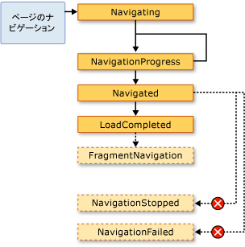  
  
 一般に、<xref:System.Windows.Controls.Page>これらのイベントを心配はありません。 アプリケーションは、それらをそのため、これらのイベントは多くの場合、<xref:System.Windows.Application>クラス。  
  
-   <xref:System.Windows.Application.Navigating?displayProperty=nameWithType>  
  
-   <xref:System.Windows.Application.NavigationProgress?displayProperty=nameWithType>  
  
-   <xref:System.Windows.Application.Navigated?displayProperty=nameWithType>  
  
-   <xref:System.Windows.Application.NavigationFailed?displayProperty=nameWithType>  
  
-   <xref:System.Windows.Application.NavigationStopped?displayProperty=nameWithType>  
  
-   <xref:System.Windows.Application.LoadCompleted?displayProperty=nameWithType>  
  
-   <xref:System.Windows.Application.FragmentNavigation?displayProperty=nameWithType>  
  
 たびに<xref:System.Windows.Navigation.NavigationService>、イベントを発生させる、<xref:System.Windows.Application>クラスは、対応するイベントを発生させます。 <xref:System.Windows.Controls.Frame> および<xref:System.Windows.Navigation.NavigationWindow>それぞれのスコープ内のナビゲーションを検出するために同じイベントを提供します。  
  
 場合によっては、<xref:System.Windows.Controls.Page>これらのイベントに関心があるかもしれません。 たとえば、<xref:System.Windows.Controls.Page>処理可能性があります、<xref:System.Windows.Navigation.NavigationService.Navigating?displayProperty=nameWithType>自体からナビゲーションをキャンセルするかどうかを決定するイベントです。 これを次の例に示します。  
  
 [!code-xaml[NavigationOverviewSnippets#CancelNavigationPageXAML](../../../../samples/snippets/csharp/VS_Snippets_Wpf/NavigationOverviewSnippets/CSharp/CancelNavigationPage.xaml#cancelnavigationpagexaml)]  
  
 [!code-csharp[NavigationOverviewSnippets#CancelNavigationPageCODEBEHIND](../../../../samples/snippets/csharp/VS_Snippets_Wpf/NavigationOverviewSnippets/CSharp/CancelNavigationPage.xaml.cs#cancelnavigationpagecodebehind)]
 [!code-vb[NavigationOverviewSnippets#CancelNavigationPageCODEBEHIND](../../../../samples/snippets/visualbasic/VS_Snippets_Wpf/NavigationOverviewSnippets/VisualBasic/CancelNavigationPage.xaml.vb#cancelnavigationpagecodebehind)]  
  
 ナビゲーション イベントにハンドラーを登録するかどうか、 <xref:System.Windows.Controls.Page>、イベント ハンドラーを登録解除もする必要があるように上記の例では、します。 方法に関して副作用がある可能性がありますない場合は、[!INCLUDE[TLA2#tla_wpf](../../../../includes/tla2sharptla-wpf-md.md)]ナビゲーション記憶<xref:System.Windows.Controls.Page>ナビゲーション ジャーナルを使用します。  
  
   
### 履歴によるナビゲーションの記憶  
 [!INCLUDE[TLA2#tla_wpf](../../../../includes/tla2sharptla-wpf-md.md)] は、戻るスタックと進むスタックの 2 つのスタックを使用して、ナビゲート元のページを記憶します。 現在から移動したとき<xref:System.Windows.Controls.Page>を新しい<xref:System.Windows.Controls.Page>前方または後方にすると、既存<xref:System.Windows.Controls.Page>、現在<xref:System.Windows.Controls.Page>に追加、*バック スタック*です。 現在から移動したとき<xref:System.Windows.Controls.Page>、以前に<xref:System.Windows.Controls.Page>、現在<xref:System.Windows.Controls.Page>に追加、 *forward スタック*です。 戻るスタック、進むスタック、およびそれらを管理する機能を、まとめて履歴と呼びます。 バック スタックと forward スタック内の各項目のインスタンスである、<xref:System.Windows.Navigation.JournalEntry>クラス、およびと呼ばれますが、*ジャーナル エントリ*です。  
  
#### Internet Explorer からの履歴のナビゲート  
 概念的には、履歴は、同じ方法、**戻る**と**フォワード**のボタンをクリックして[!INCLUDE[TLA2#tla_ie](../../../../includes/tla2sharptla-ie-md.md)]しないでください。 これを次の図に示します。  
  
 ![[戻る] ボタンと [進む] ボタン](../../../../docs/framework/wpf/app-development/media/navigationoverviewfigure4.png "NavigationOverviewFigure4")  
  
 [!INCLUDE[TLA2#tla_xbap#plural](../../../../includes/tla2sharptla-xbapsharpplural-md.md)]によってホストされる[!INCLUDE[TLA2#tla_ie](../../../../includes/tla2sharptla-ie-md.md)]、[!INCLUDE[TLA2#tla_wpf](../../../../includes/tla2sharptla-wpf-md.md)]ナビゲーション履歴に統合[!INCLUDE[TLA2#tla_ui](../../../../includes/tla2sharptla-ui-md.md)]の[!INCLUDE[TLA2#tla_ie](../../../../includes/tla2sharptla-ie-md.md)]します。 これにより、ユーザーが内のページを移動する、[!INCLUDE[TLA2#tla_xbap](../../../../includes/tla2sharptla-xbap-md.md)]を使用して、**戻る**、**フォワード**と**最近表示したページ**のボタンをクリックして[!INCLUDE[TLA2#tla_ie](../../../../includes/tla2sharptla-ie-md.md)]です。 ジャーナルは統合されません[!INCLUDE[TLA2#tla_ie6](../../../../includes/tla2sharptla-ie6-md.md)]は、同じ方法で[!INCLUDE[TLA2#tla_ie7](../../../../includes/tla2sharptla-ie7-md.md)]または Internet Explorer 8 です。 代わりに、[!INCLUDE[TLA2#tla_wpf](../../../../includes/tla2sharptla-wpf-md.md)]代用ナビゲーションをレンダリング[!INCLUDE[TLA2#tla_ui](../../../../includes/tla2sharptla-ui-md.md)]です。  
  
> [!IMPORTANT]
>  [!INCLUDE[TLA2#tla_ie](../../../../includes/tla2sharptla-ie-md.md)]から離れていても、ユーザーが移動したときに戻すと、[!INCLUDE[TLA2#tla_xbap](../../../../includes/tla2sharptla-xbap-md.md)]履歴が保持されるページの履歴項目のみが保持されます。 ページを履歴に保持する方法の詳細については、次を参照してください。[ページの有効期間およびジャーナル](#PageLifetime)このトピックで後述します。  
  
 既定では、各テキスト<xref:System.Windows.Controls.Page>に表示される、**最近表示したページ**の一覧[!INCLUDE[TLA2#tla_ie](../../../../includes/tla2sharptla-ie-md.md)]は、[!INCLUDE[TLA2#tla_uri](../../../../includes/tla2sharptla-uri-md.md)]の<xref:System.Windows.Controls.Page>です。 多くの場合、これは、ユーザーにとって特に意味がありません。 幸い、次のオプションのいずれかを使用して、テキストを変更できます。  
  
1.  アタッチされた`JournalEntry.Name`属性の値。  
  
2.  `Page.Title`属性の値。  
  
3.  `Page.WindowTitle`属性値、および[!INCLUDE[TLA2#tla_uri](../../../../includes/tla2sharptla-uri-md.md)]現在の<xref:System.Windows.Controls.Page>します。  
  
4.  現在の [!INCLUDE[TLA2#tla_uri](../../../../includes/tla2sharptla-uri-md.md)] の <xref:System.Windows.Controls.Page>。 (既定)  
  
 これらのオプションの順序は、テキスト検索の優先順位と一致します。 たとえば場合、`JournalEntry.Name`が設定されている、他の値は無視されます。  
  
 次の例では、`Page.Title`ジャーナル エントリに対して表示されるテキストを変更する属性。  
  
 [!code-xaml[NavigationOverviewSnippets#PageTitleMARKUP1](../../../../samples/snippets/csharp/VS_Snippets_Wpf/NavigationOverviewSnippets/CSharp/PageWithTitle.xaml#pagetitlemarkup1)]  
[!code-xaml[NavigationOverviewSnippets#PageTitleMARKUP2](../../../../samples/snippets/csharp/VS_Snippets_Wpf/NavigationOverviewSnippets/CSharp/PageWithTitle.xaml#pagetitlemarkup2)]  
  
 [!code-csharp[NavigationOverviewSnippets#PageTitleCODEBEHIND1](../../../../samples/snippets/csharp/VS_Snippets_Wpf/NavigationOverviewSnippets/CSharp/PageWithTitle.xaml.cs#pagetitlecodebehind1)]
 [!code-vb[NavigationOverviewSnippets#PageTitleCODEBEHIND1](../../../../samples/snippets/visualbasic/VS_Snippets_Wpf/NavigationOverviewSnippets/VisualBasic/PageWithTitle.xaml.vb#pagetitlecodebehind1)]  
[!code-csharp[NavigationOverviewSnippets#PageTitleCODEBEHIND2](../../../../samples/snippets/csharp/VS_Snippets_Wpf/NavigationOverviewSnippets/CSharp/PageWithTitle.xaml.cs#pagetitlecodebehind2)]
[!code-vb[NavigationOverviewSnippets#PageTitleCODEBEHIND2](../../../../samples/snippets/visualbasic/VS_Snippets_Wpf/NavigationOverviewSnippets/VisualBasic/PageWithTitle.xaml.vb#pagetitlecodebehind2)]  
  
#### WPF を使用する履歴のナビゲート  
 ユーザーを使用して、journal が移動することができますが、**戻る**、**フォワード**、および**最近表示したページ**で[!INCLUDE[TLA2#tla_ie](../../../../includes/tla2sharptla-ie-md.md)]、両方を使用して journal を移動することもできます。宣言とプログラムのメカニズムによって提供される[!INCLUDE[TLA2#tla_wpf](../../../../includes/tla2sharptla-wpf-md.md)]です。 これを行う理由の 1 つはカスタム ナビゲーションを提供する[!INCLUDE[TLA2#tla_ui#plural](../../../../includes/tla2sharptla-uisharpplural-md.md)]ページにします。  
  
 によって公開されているナビゲーション コマンドを使用して journal ナビゲーションのサポートを追加する宣言によって<xref:System.Windows.Input.NavigationCommands>です。 次の例で使用する方法、`BrowseBack`ナビゲーション コマンド。  
  
 [!code-xaml[NavigationOverviewSnippets#NavigationCommandsPageXAML1](../../../../samples/snippets/csharp/VS_Snippets_Wpf/NavigationOverviewSnippets/CSharp/NavigationCommandsPage.xaml#navigationcommandspagexaml1)]  
[!code-xaml[NavigationOverviewSnippets#NavigationCommandsPageXAML2](../../../../samples/snippets/csharp/VS_Snippets_Wpf/NavigationOverviewSnippets/CSharp/NavigationCommandsPage.xaml#navigationcommandspagexaml2)]  
[!code-xaml[NavigationOverviewSnippets#NavigationCommandsPageXAML3](../../../../samples/snippets/csharp/VS_Snippets_Wpf/NavigationOverviewSnippets/CSharp/NavigationCommandsPage.xaml#navigationcommandspagexaml3)]  
[!code-xaml[NavigationOverviewSnippets#NavigationCommandsPageXAML4](../../../../samples/snippets/csharp/VS_Snippets_Wpf/NavigationOverviewSnippets/CSharp/NavigationCommandsPage.xaml#navigationcommandspagexaml4)]  
  
 プログラムでの次のメンバーのいずれかを使用して、ジャーナルを移動することができます、<xref:System.Windows.Navigation.NavigationService>クラス。  
  
-   <xref:System.Windows.Navigation.NavigationService.GoBack%2A>  
  
-   <xref:System.Windows.Navigation.NavigationService.GoForward%2A>  
  
-   <xref:System.Windows.Navigation.NavigationService.CanGoBack%2A>  
  
-   <xref:System.Windows.Navigation.NavigationService.CanGoForward%2A>  
  
 説明したように、プログラムによって、ジャーナルは操作も[ナビゲーション履歴にコンテンツの状態の保持](#RetainingContentStateWithNavigationHistory)このトピックで後述します。  
  
   
### ページの有効期間と履歴  
 検討してください、[!INCLUDE[TLA2#tla_xbap](../../../../includes/tla2sharptla-xbap-md.md)]豊富なコンテンツが含まれるいくつかのページを含むグラフィックス、アニメーション、およびメディア。 このようなページのメモリ使用量は、特にビデオやオーディオ メディアが使用されている場合、非常に大きくなることがあります。 履歴""のページ記録に移動されていること、[!INCLUDE[TLA2#tla_xbap](../../../../includes/tla2sharptla-xbap-md.md)]大きくて目立つ量のメモリを急速に消費する可能性があります。  
  
 格納する、journal の既定の動作は、このため、<xref:System.Windows.Controls.Page>への参照ではなく、各履歴項目のメタデータ、<xref:System.Windows.Controls.Page>オブジェクト。 履歴項目に移動したとき、<xref:System.Windows.Controls.Page>メタデータを使用して、指定の新しいインスタンスを作成する<xref:System.Windows.Controls.Page>です。 結果として、各<xref:System.Windows.Controls.Page>ナビゲーションを有効期間は、次の図に示します。  
  
   
  
 既定の履歴の動作を使用すると、メモリ消費量の保存することができます、ページごとのレンダリング パフォーマンスが低下する可能性があります。reinstantiating、<xref:System.Windows.Controls.Page>時間のかかる、大量のコンテンツがある場合に特にを指定できます。 保持する必要がある場合、<xref:System.Windows.Controls.Page>インスタンスでは、journal では、これを行うための 2 つの方法で描画することができます。 最初に、プログラムでに移動して、<xref:System.Windows.Controls.Page>オブジェクトを呼び出して、<xref:System.Windows.Navigation.NavigationService.Navigate%2A?displayProperty=nameWithType>メソッドです。  
  
 次に、指定することできます[!INCLUDE[TLA2#tla_wpf](../../../../includes/tla2sharptla-wpf-md.md)]のインスタンスを保持する、<xref:System.Windows.Controls.Page>を設定して journal で、<xref:System.Windows.Controls.Page.KeepAlive%2A>プロパティを`true`(既定値は`false`)。 次の例に示すように設定できる<xref:System.Windows.Controls.Page.KeepAlive%2A>マークアップで宣言します。  
  
 [!code-xaml[NavigationOverviewSnippets#KeepAlivePageXAML](../../../../samples/snippets/csharp/VS_Snippets_Wpf/NavigationOverviewSnippets/CSharp/KeepAlivePage.xaml#keepalivepagexaml)]  
  
 有効期間、<xref:System.Windows.Controls.Page>は微妙に異なるはないものが有効のまま保持します。 初めて、<xref:System.Windows.Controls.Page>が保持されるアライブへの移動が、それがインスタンス化されるとまったく同様に、<xref:System.Windows.Controls.Page>を保持します。 ただし、ためのインスタンス、<xref:System.Windows.Controls.Page>保持されますが、journal はインスタンス化されないもう一度に、journal が変わらない限り、します。 したがって場合、<xref:System.Windows.Controls.Page>呼び出す必要があるたびに初期化ロジックを持つ、<xref:System.Windows.Controls.Page>移動は、する必要があります内に移動して、コンス トラクターからハンドラーを<xref:System.Windows.FrameworkElement.Loaded>イベント。 次の図に示すように、<xref:System.Windows.FrameworkElement.Loaded>と<xref:System.Windows.FrameworkElement.Unloaded>イベントは発生するたびに、<xref:System.Windows.Controls.Page>は移動先との間には、それぞれします。  
  
 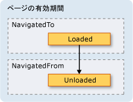  
  
 ときに、<xref:System.Windows.Controls.Page>は保持しないをしないで、次のいずれか。  
  
-   ページへの参照、またはその一部への参照を格納する。  
  
-   ページによって実装されていないイベントのイベント ハンドラーを登録する。  
  
 これらのいずれかの方法と、強制的に参照が作成されます、<xref:System.Windows.Controls.Page>履歴から削除された後も、メモリに保持されます。  
  
 一般に、既定値を優先する必要があります<xref:System.Windows.Controls.Page>状態に維持しないの動作、<xref:System.Windows.Controls.Page>存続します。 ただし、これには、次のセクションで説明されている状態も関係します。  
  
   
### ナビゲーション履歴によるコンテンツの状態の保持  
 場合、<xref:System.Windows.Controls.Page>は保持しないから離れていても、ユーザーが移動した場合に戻すと、データの処理、ユーザーからデータを収集するコントロールがあると、<xref:System.Windows.Controls.Page>しますか? ユーザー エクスペリエンスの観点から見ると、ユーザーは以前に入力したデータが表示されることを期待します。 残念ながら、ための新しいインスタンス、<xref:System.Windows.Controls.Page>各ナビゲーションで収集されたデータは再インスタンス化されて、データが失われたコントロールが作成されます。  
  
 さいわい、ジャーナルは間でのデータを記憶するためのサポートを提供<xref:System.Windows.Controls.Page>ナビゲーション、コントロールのデータを含むです。 具体的には、各履歴<xref:System.Windows.Controls.Page>関連付けられている一時的なコンテナーとして機能<xref:System.Windows.Controls.Page>状態です。 次の手順は、このサポートの使用方法を説明ときに、<xref:System.Windows.Controls.Page>から移動します。  
  
1.  現在のエントリ<xref:System.Windows.Controls.Page>が履歴に追加します。  
  
2.  状態、<xref:System.Windows.Controls.Page>バック スタックに追加されているそのページは、対応する履歴項目と一緒に格納されます。  
  
3.  新しい<xref:System.Windows.Controls.Page>へ移動します。  
  
 ときに、ページ<xref:System.Windows.Controls.Page>は、ジャーナルを使用して移動する、次の手順を実行します。  
  
1.  <xref:System.Windows.Controls.Page> (バック スタックの上位ジャーナル エントリ) がインスタンス化します。  
  
2.  <xref:System.Windows.Controls.Page>対応する履歴項目に保存された状態で更新された、<xref:System.Windows.Controls.Page>です。  
  
3.  <xref:System.Windows.Controls.Page>に移動します。  
  
 [!INCLUDE[TLA2#tla_wpf](../../../../includes/tla2sharptla-wpf-md.md)] 次のコントロールを使用すると自動的にこのサポートを使用して、 <xref:System.Windows.Controls.Page>:  
  
-   <xref:System.Windows.Controls.CheckBox>  
  
-   <xref:System.Windows.Controls.ComboBox>  
  
-   <xref:System.Windows.Controls.Expander>  
  
-   <xref:System.Windows.Controls.Frame>  
  
-   <xref:System.Windows.Controls.ListBox>  
  
-   <xref:System.Windows.Controls.ListBoxItem>  
  
-   <xref:System.Windows.Controls.MenuItem>  
  
-   <xref:System.Windows.Controls.ProgressBar>  
  
-   <xref:System.Windows.Controls.RadioButton>  
  
-   <xref:System.Windows.Controls.Slider>  
  
-   <xref:System.Windows.Controls.TabControl>  
  
-   <xref:System.Windows.Controls.TabItem>  
  
-   <xref:System.Windows.Controls.TextBox>  
  
 場合、<xref:System.Windows.Controls.Page>使用してこれらをコントロールに入力されたデータが間で記憶<xref:System.Windows.Controls.Page>ナビゲーションに示すように、**好きな色**<xref:System.Windows.Controls.ListBox>次の図にします。  
  
   
  
 ときに、<xref:System.Windows.Controls.Page>が上記の一覧にあるもの以外のコントロールまたはカスタム オブジェクトの状態が保存されると、全体の状態を記憶する journal が発生するコードを記述する必要があります。<xref:System.Windows.Controls.Page>ナビゲーション。  
  
 かどうかは、少量の間で状態を保存する必要があります。<xref:System.Windows.Controls.Page>ナビゲーション、依存関係プロパティを使用することができます (を参照してください<xref:System.Windows.DependencyProperty>) で構成されている、<xref:System.Windows.FrameworkPropertyMetadata.Journal%2A?displayProperty=nameWithType>メタデータ フラグ。  
  
 場合、状態を<xref:System.Windows.Controls.Page>ナビゲーション間を保存する必要があるデータの複数の部分で構成されます、する方が少ないコードを 1 つのクラスで、状態をカプセル化し、実装する処理を要する、<xref:System.Windows.Navigation.IProvideCustomContentState>インターフェイスです。  
  
 かどうかは、1 つの各種の状態間を移動する必要があります。 <xref:System.Windows.Controls.Page>、から移動することなく、<xref:System.Windows.Controls.Page>自体を行うこともできます<xref:System.Windows.Navigation.IProvideCustomContentState>と<xref:System.Windows.Navigation.NavigationService.AddBackEntry%2A?displayProperty=nameWithType>です。  
  
   
### クッキー  
 別方法[!INCLUDE[TLA2#tla_wpf](../../../../includes/tla2sharptla-wpf-md.md)]アプリケーションがデータを格納できますが、作成されると、cookie に次のように更新、および削除を使用する、<xref:System.Windows.Application.SetCookie%2A>と<xref:System.Windows.Application.GetCookie%2A>メソッドです。 作成できる cookie[!INCLUDE[TLA2#tla_wpf](../../../../includes/tla2sharptla-wpf-md.md)]同じ cookie の他の種類の Web アプリケーションの使用です。 cookie は中、またはアプリケーション セッション間でクライアント コンピューター上のアプリケーションで格納されているデータの任意の部分です。 クッキー データは、通常、次の形式の名前と値のペアです。  
  
 *Name* `=` *Value*  
  
 データが渡されたときに<xref:System.Windows.Application.SetCookie%2A>、と共に、 <xref:System.Uri> cookie を設定する場所の cookie は、メモリ内で作成およびのみである使用可能なアプリケーションの現在のセッションの実行中です。 この種類の cookie と呼びます、*セッション cookie*です。  
  
 複数のアプリケーション セッションにまたがってクッキーを格納するには、次の形式を使用して、有効期限をクッキーに追加する必要があります。  
  
 *NAME* `=` *VALUE* `; expires=DAY, DD-MMM-YYYY HH:MM:SS GMT`  
  
 現在の有効期限の日付で cookie が格納されている[!INCLUDE[TLA#tla_mswin](../../../../includes/tlasharptla-mswin-md.md)]cookie の有効期限が切れるまでのインストールのインターネット一時ファイル フォルダーです。 このような cookie と呼ばれる、*永続的な cookie*アプリケーション セッション間が引き続き発生するためです。  
  
 セッションと永続的な cookie の両方を呼び出すことによって取得した、<xref:System.Windows.Application.GetCookie%2A>渡して、メソッド、<xref:System.Uri>で cookie が設定されている場所の<xref:System.Windows.Application.SetCookie%2A>メソッドです。  
  
 Cookie がサポートされている方法をいくつかは、次のとおり[!INCLUDE[TLA2#tla_wpf](../../../../includes/tla2sharptla-wpf-md.md)]:  
  
-   [!INCLUDE[TLA2#tla_wpf](../../../../includes/tla2sharptla-wpf-md.md)] スタンドアロン アプリケーションと[!INCLUDE[TLA2#tla_xbap#plural](../../../../includes/tla2sharptla-xbapsharpplural-md.md)]できます両方を作成し、cookie を管理します。  
  
-   によって作成される cookie、[!INCLUDE[TLA2#tla_xbap](../../../../includes/tla2sharptla-xbap-md.md)]ブラウザーからアクセスできます。  
  
-   同じドメインの [!INCLUDE[TLA2#tla_xbap#plural](../../../../includes/tla2sharptla-xbapsharpplural-md.md)] は、クッキーを作成して共有できます。  
  
-   [!INCLUDE[TLA2#tla_xbap#plural](../../../../includes/tla2sharptla-xbapsharpplural-md.md)] および[!INCLUDE[TLA2#tla_html](../../../../includes/tla2sharptla-html-md.md)]同じドメインからのページの作成および cookie を共有できます。  
  
-   Cookie がディスパッチされるときに[!INCLUDE[TLA2#tla_xbap#plural](../../../../includes/tla2sharptla-xbapsharpplural-md.md)]厳密でないと[!INCLUDE[TLA2#tla_xaml](../../../../includes/tla2sharptla-xaml-md.md)]ページが Web 要求を実行します。  
  
-   最上位レベルの両方[!INCLUDE[TLA2#tla_xbap#plural](../../../../includes/tla2sharptla-xbapsharpplural-md.md)]と[!INCLUDE[TLA2#tla_xbap#plural](../../../../includes/tla2sharptla-xbapsharpplural-md.md)]でホストされている IFRAME クッキーにアクセスできます。  
  
-   Cookie のサポートで[!INCLUDE[TLA2#tla_wpf](../../../../includes/tla2sharptla-wpf-md.md)]はサポートされているすべてのブラウザーのと同じです。  
  
-   [!INCLUDE[TLA2#tla_ie](../../../../includes/tla2sharptla-ie-md.md)]、Cookie に関連する P3P ポリシーが有効にして[!INCLUDE[TLA2#tla_wpf](../../../../includes/tla2sharptla-wpf-md.md)]、ファースト パーティおよびサード パーティ製に関して特に[!INCLUDE[TLA2#tla_xbap#plural](../../../../includes/tla2sharptla-xbapsharpplural-md.md)]です。  
  
   
### 構造化ナビゲーション  
 1 つからデータを渡す必要がある場合<xref:System.Windows.Controls.Page>別にすることができます、データに引数として渡すのない既定のコンス トラクター、<xref:System.Windows.Controls.Page>です。 この手法を使用する場合しなければならないことに注意してください、<xref:System.Windows.Controls.Page>に移動する場合は、次の時間ではなく、; アライブ、 <xref:System.Windows.Controls.Page>、[!INCLUDE[TLA2#tla_wpf](../../../../includes/tla2sharptla-wpf-md.md)]たび、<xref:System.Windows.Controls.Page>既定コンス トラクターを使用します。  
  
 または、<xref:System.Windows.Controls.Page>渡される必要があるデータと設定されているプロパティを実装することができます。 処理がただし、注意が必要になるときに、<xref:System.Windows.Controls.Page>必要がありますに渡すデータに戻して、<xref:System.Windows.Controls.Page>に移動します。 問題は、ナビゲーション ネイティブにサポートしていないことのメカニズムを保証するため、<xref:System.Windows.Controls.Page>から移動した後に返されます。 基本的に、ナビゲーションは、"呼び出す/戻る" というセマンティクスをサポートしていません。 この問題を解決する[!INCLUDE[TLA2#tla_wpf](../../../../includes/tla2sharptla-wpf-md.md)]提供、<xref:System.Windows.Navigation.PageFunction%601>いることを確認に使用できるクラス、<xref:System.Windows.Controls.Page>が構造化された予測可能な形式で返されます。 詳細については、次を参照してください。[構造化されたナビゲーションの概要](../../../../docs/framework/wpf/app-development/structured-navigation-overview.md)です。  
  
   
## NavigationWindow クラス  
 ここまでで、ナビゲート可能なコンテンツを含むアプリケーションをビルドするために使用する可能性が最も高いナビゲーション サービスの全容を説明しました。 これらのサービスは、のコンテキストで説明した[!INCLUDE[TLA2#tla_xbap#plural](../../../../includes/tla2sharptla-xbapsharpplural-md.md)]だけではありませんが、[!INCLUDE[TLA2#tla_xbap#plural](../../../../includes/tla2sharptla-xbapsharpplural-md.md)]です。 最近のオペレーティング システムおよび Windows アプリケーションをブラウザー スタイルのナビゲーションをスタンドアロン アプリケーションに組み込む最新のユーザーのブラウザー経験を活用します。 一般的な例は、次のとおりです。  
  
-   **Word の類義語辞典**: 選択可能な単語をナビゲートします。  
  
-   **ファイル エクスプ ローラー**: ファイルとフォルダーをナビゲートします。  
  
-   **ウィザード**: 複雑なタスクを複数のページに分割し、ページ間をナビゲートできます。 たとえば、Windows コンポーネント ウィザードを追加して、Windows 機能の削除を処理するなどです。  
  
 ブラウザー スタイルのナビゲーションをスタンドアロン アプリケーションに組み込むを使用することができます、<xref:System.Windows.Navigation.NavigationWindow>クラスです。 <xref:System.Windows.Navigation.NavigationWindow> 派生した<xref:System.Windows.Window>しそれを拡張とナビゲーションのサポートを[!INCLUDE[TLA2#tla_xbap#plural](../../../../includes/tla2sharptla-xbapsharpplural-md.md)]を提供します。 使用することができます<xref:System.Windows.Navigation.NavigationWindow>スタンドアロン アプリケーションのメイン ウィンドウ、またはダイアログ ボックスなど、セカンダリ ウィンドウとして。  
  
 実装する、<xref:System.Windows.Navigation.NavigationWindow>のほとんどの最上位クラスと同様、 [!INCLUDE[TLA2#tla_wpf](../../../../includes/tla2sharptla-wpf-md.md)] (<xref:System.Windows.Window>、<xref:System.Windows.Controls.Page>など)、マークアップと分離コードとの組み合わせを使用します。 これを次の例に示します。  
  
 [!code-xaml[IntroToNavNavigationWindowSnippets#NavigationWindowMARKUP](../../../../samples/snippets/csharp/VS_Snippets_Wpf/IntroToNavNavigationWindowSnippets/CSharp/MainWindow.xaml#navigationwindowmarkup)]  
  
 [!code-csharp[IntroToNavNavigationWindowSnippets#NavigationWindowCODEBEHIND](../../../../samples/snippets/csharp/VS_Snippets_Wpf/IntroToNavNavigationWindowSnippets/CSharp/MainWindow.xaml.cs#navigationwindowcodebehind)]
 [!code-vb[IntroToNavNavigationWindowSnippets#NavigationWindowCODEBEHIND](../../../../samples/snippets/visualbasic/VS_Snippets_Wpf/IntroToNavNavigationWindowSnippets/VisualBasic/MainWindow.xaml.vb#navigationwindowcodebehind)]  
  
 このコードを作成、<xref:System.Windows.Navigation.NavigationWindow>に自動的に移動する、 <xref:System.Windows.Controls.Page> (HomePage.xaml) ときに、<xref:System.Windows.Navigation.NavigationWindow>が開かれています。 場合、<xref:System.Windows.Navigation.NavigationWindow>アプリケーションのメイン ウィンドウは、使用することができます、`StartupUri`を起動する属性。 これを次のマークアップに示します。  
  
 [!code-xaml[IntroToNavNavigationWindowSnippets#AppLaunchNavWindow](../../../../samples/snippets/csharp/VS_Snippets_Wpf/IntroToNavNavigationWindowSnippets/CSharp/App.xaml#applaunchnavwindow)]  
  
 次の図に示しています、<xref:System.Windows.Navigation.NavigationWindow>スタンドアロン アプリケーションのメイン ウィンドウとして。  
  
   
  
 図であることがわかります、<xref:System.Windows.Navigation.NavigationWindow>に設定されていない場合でも、タイトルが付いて、<xref:System.Windows.Navigation.NavigationWindow>前の例のコードを実装します。 代わりに、タイトルが設定を使用して、<xref:System.Windows.Controls.Page.WindowTitle%2A>プロパティは、次のコードに示されています。  
  
 [!code-xaml[IntroToNavNavigationWindowSnippets#HomePageMARKUP1](../../../../samples/snippets/csharp/VS_Snippets_Wpf/IntroToNavNavigationWindowSnippets/CSharp/HomePage.xaml#homepagemarkup1)]  
[!code-xaml[IntroToNavNavigationWindowSnippets#HomePageMARKUP2](../../../../samples/snippets/csharp/VS_Snippets_Wpf/IntroToNavNavigationWindowSnippets/CSharp/HomePage.xaml#homepagemarkup2)]  
  
 設定、<xref:System.Windows.Controls.Page.WindowWidth%2A>と<xref:System.Windows.Controls.Page.WindowHeight%2A>プロパティにも影響、<xref:System.Windows.Navigation.NavigationWindow>です。  
  
 通常は、実装する独自<xref:System.Windows.Navigation.NavigationWindow>動作またはの外観をカスタマイズする必要がある場合。 どちらも行わない場合は、ショートカットを使用できます。 パックを指定する場合[!INCLUDE[TLA2#tla_uri](../../../../includes/tla2sharptla-uri-md.md)]の<xref:System.Windows.Controls.Page>として、<xref:System.Windows.Application.StartupUri%2A>スタンドアロン アプリケーションで<xref:System.Windows.Application>が自動的に作成、<xref:System.Windows.Navigation.NavigationWindow>ホストに、<xref:System.Windows.Controls.Page>です。 次のマークアップは、この方法を示しています。  
  
 [!code-xaml[IntroToNavNavigationWindowSnippets#AppLaunchPage](../../../../samples/snippets/csharp/VS_Snippets_Wpf/IntroToNavNavigationWindowSnippets/CSharp/AnotherApp.xaml#applaunchpage)]  
  
 場合は、セカンダリのアプリケーション ウィンドウ、ダイアログ ボックスであるなど、<xref:System.Windows.Navigation.NavigationWindow>を開くには、次の例で、コードを使用することができます。  
  
 [!code-csharp[IntroToNavNavigationWindowSnippets#CreateNWDialogBox](../../../../samples/snippets/csharp/VS_Snippets_Wpf/IntroToNavNavigationWindowSnippets/CSharp/DialogOwnerWindow.xaml.cs#createnwdialogbox)]
 [!code-vb[IntroToNavNavigationWindowSnippets#CreateNWDialogBox](../../../../samples/snippets/visualbasic/VS_Snippets_Wpf/IntroToNavNavigationWindowSnippets/VisualBasic/DialogOwnerWindow.xaml.vb#createnwdialogbox)]  
  
 次の図に、結果を示します。  
  
   
  
 わかります<xref:System.Windows.Navigation.NavigationWindow>表示[!INCLUDE[TLA2#tla_ie](../../../../includes/tla2sharptla-ie-md.md)]-スタイル**戻る**と**フォワード**履歴に移動するユーザーに許可するボタンです。 これらのボタンは、次の図に示されているように、同じユーザー エクスペリエンスを提供します。  
  
 ![NavigationWindow の [戻る] ボタンと [進む] ボタン](../../../../docs/framework/wpf/app-development/media/navigationoverviewfigure20.png "NavigationOverviewFigure20")  
  
 非表示にする場合は、ページは、独自のジャーナル ナビゲーションのサポートと UI を提供する、**戻る**と**フォワード**で表示されるボタン<xref:System.Windows.Navigation.NavigationWindow>の値を設定して、 <xref:System.Windows.Navigation.NavigationWindow.ShowsNavigationUI%2A> プロパティ`false`.  
  
 カスタマイズのサポートを使用する代わりに、[!INCLUDE[TLA2#tla_wpf](../../../../includes/tla2sharptla-wpf-md.md)]を置き換える、[!INCLUDE[TLA2#tla_ui](../../../../includes/tla2sharptla-ui-md.md)]の<xref:System.Windows.Navigation.NavigationWindow>自体です。  
  
   
## Frame クラス  
 ブラウザーの両方と<xref:System.Windows.Navigation.NavigationWindow>windows は、ナビゲート可能なコンテンツをホストします。 場合によっては、アプリケーションには、ウィンドウ全体でホストする必要のないコンテンツがあることもあります。 このようなコンテンツは、代わりに、他のコンテンツ内でホストされます。 使用して、その他のコンテンツにナビゲート可能なコンテンツを挿入できる、<xref:System.Windows.Controls.Frame>クラスです。 <xref:System.Windows.Controls.Frame> として同じのサポートを提供<xref:System.Windows.Navigation.NavigationWindow>と[!INCLUDE[TLA2#tla_xbap#plural](../../../../includes/tla2sharptla-xbapsharpplural-md.md)]です。  
  
 次の例は、追加する方法を示します、<xref:System.Windows.Controls.Frame>を<xref:System.Windows.Controls.Page>を使用して宣言によって、`Frame`要素。  
  
 [!code-xaml[NavigationOverviewSnippets#FrameHostPageXAML1](../../../../samples/snippets/csharp/VS_Snippets_Wpf/NavigationOverviewSnippets/CSharp/FrameHostPage.xaml#framehostpagexaml1)]  
[!code-xaml[NavigationOverviewSnippets#FrameHostPageXAML2](../../../../samples/snippets/csharp/VS_Snippets_Wpf/NavigationOverviewSnippets/CSharp/FrameHostPage.xaml#framehostpagexaml2)]  
[!code-xaml[NavigationOverviewSnippets#FrameHostPageXAML3](../../../../samples/snippets/csharp/VS_Snippets_Wpf/NavigationOverviewSnippets/CSharp/FrameHostPage.xaml#framehostpagexaml3)]  
  
 このマークアップ、`Source`の属性、`Frame`要素のパック[!INCLUDE[TLA2#tla_uri](../../../../includes/tla2sharptla-uri-md.md)]の<xref:System.Windows.Controls.Page>を<xref:System.Windows.Controls.Frame>に最初に移動する必要があります。 次の図に示しています、[!INCLUDE[TLA2#tla_xbap](../../../../includes/tla2sharptla-xbap-md.md)]で、<xref:System.Windows.Controls.Page>を持つ、<xref:System.Windows.Controls.Frame>がいくつかのページ間で移動します。  
  
 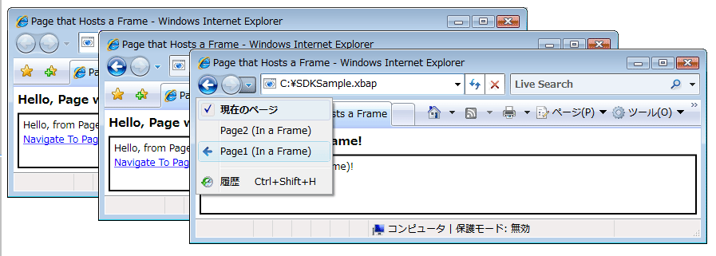  
  
 のみでは、使用する必要はありません<xref:System.Windows.Controls.Frame>内のコンテンツ、<xref:System.Windows.Controls.Page>です。 共通するホストはまた、<xref:System.Windows.Controls.Frame>内のコンテンツ、<xref:System.Windows.Window>です。  
  
 既定では、<xref:System.Windows.Controls.Frame>のみ別ジャーナルがない場合は、独自のジャーナルを使用します。 場合、<xref:System.Windows.Controls.Frame>いずれかの内側でホストされているコンテンツの一部である、<xref:System.Windows.Navigation.NavigationWindow>または[!INCLUDE[TLA2#tla_xbap](../../../../includes/tla2sharptla-xbap-md.md)]、<xref:System.Windows.Controls.Frame>に属している journal を使用して、<xref:System.Windows.Navigation.NavigationWindow>または[!INCLUDE[TLA2#tla_xbap](../../../../includes/tla2sharptla-xbap-md.md)]です。 場合によっては、<xref:System.Windows.Controls.Frame>独自のジャーナルを担当する必要があります。 そのためには 1 つの理由は、journal によってホストされているページ内を移動できるように、<xref:System.Windows.Controls.Frame>です。 これを次の図に示します。  
  
 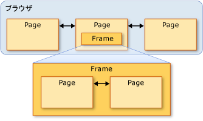  
  
 この場合、構成することができます、<xref:System.Windows.Controls.Frame>を設定して独自のジャーナルを使用する、<xref:System.Windows.Controls.Frame.JournalOwnership%2A>のプロパティ、<xref:System.Windows.Controls.Frame>に<xref:System.Windows.Navigation.JournalOwnership.OwnsJournal>です。 これを次のマークアップに示します。  
  
 [!code-xaml[NavigationOverviewSnippets#FrameHostPageOwnJournalXAML1](../../../../samples/snippets/csharp/VS_Snippets_Wpf/NavigationOverviewSnippets/CSharp/FrameHostPageOwnJournal.xaml#framehostpageownjournalxaml1)]  
[!code-xaml[NavigationOverviewSnippets#FrameHostPageOwnJournalXAML2](../../../../samples/snippets/csharp/VS_Snippets_Wpf/NavigationOverviewSnippets/CSharp/FrameHostPageOwnJournal.xaml#framehostpageownjournalxaml2)]  
[!code-xaml[NavigationOverviewSnippets#FrameHostPageOwnJournalXAML3](../../../../samples/snippets/csharp/VS_Snippets_Wpf/NavigationOverviewSnippets/CSharp/FrameHostPageOwnJournal.xaml#framehostpageownjournalxaml3)]  
  
 次の図は、内でのナビゲートの効果を示しています、<xref:System.Windows.Controls.Frame>独自のジャーナルを使用します。  
  
 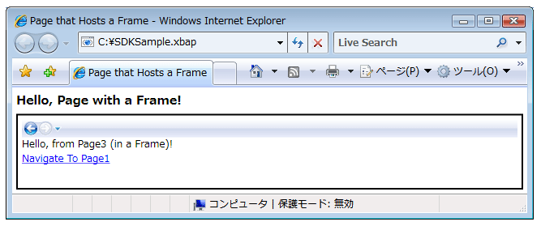  
  
 ジャーナル エントリは、ナビゲーションによって示されている通知[!INCLUDE[TLA2#tla_ui](../../../../includes/tla2sharptla-ui-md.md)]で、<xref:System.Windows.Controls.Frame>ではなく[!INCLUDE[TLA2#tla_ie](../../../../includes/tla2sharptla-ie-md.md)]です。  
  
> [!NOTE]
>  場合、<xref:System.Windows.Controls.Frame>でホストされているコンテンツの一部である、 <xref:System.Windows.Window>、<xref:System.Windows.Controls.Frame>独自のジャーナルを使用し、その結果、表示、独自のナビゲーション[!INCLUDE[TLA2#tla_ui](../../../../includes/tla2sharptla-ui-md.md)]です。  
  
 ユーザー エクスペリエンスが必要な場合、<xref:System.Windows.Controls.Frame>ナビゲーションを表示することがなく、独自の履歴を提供する[!INCLUDE[TLA2#tla_ui](../../../../includes/tla2sharptla-ui-md.md)]、ナビゲーションを非表示にすることができます[!INCLUDE[TLA2#tla_ui](../../../../includes/tla2sharptla-ui-md.md)]を設定して、<xref:System.Windows.Controls.Frame.NavigationUIVisibility%2A>に<xref:System.Windows.Visibility.Hidden>です。 これを次のマークアップに示します。  
  
 [!code-xaml[NavigationOverviewSnippets#FrameHostPageHidesUIXAML1](../../../../samples/snippets/csharp/VS_Snippets_Wpf/NavigationOverviewSnippets/CSharp/FrameHostPageOwnHiddenJournal.xaml#framehostpagehidesuixaml1)]  
[!code-xaml[NavigationOverviewSnippets#FrameHostPageHidesUIXAML2](../../../../samples/snippets/csharp/VS_Snippets_Wpf/NavigationOverviewSnippets/CSharp/FrameHostPageOwnHiddenJournal.xaml#framehostpagehidesuixaml2)]  
[!code-xaml[NavigationOverviewSnippets#FrameHostPageHidesUIXAML3](../../../../samples/snippets/csharp/VS_Snippets_Wpf/NavigationOverviewSnippets/CSharp/FrameHostPageOwnHiddenJournal.xaml#framehostpagehidesuixaml3)]  
  
   
## ナビゲーション ホスト  
 <xref:System.Windows.Controls.Frame> および<xref:System.Windows.Navigation.NavigationWindow>ナビゲーション ホストと呼ばれるクラスです。 A*ナビゲーション ホスト*に移動して、コンテンツを表示できるクラスです。 これを実現する、各ナビゲーション ホストを使用して独自<xref:System.Windows.Navigation.NavigationService>およびジャーナルです。 ナビゲーション ホストの基本的な構造を次の図に示します。  
  
   
  
 これにより、基本的に、<xref:System.Windows.Navigation.NavigationWindow>と<xref:System.Windows.Controls.Frame>同じを提供するナビゲーションをサポートする、[!INCLUDE[TLA2#tla_xbap](../../../../includes/tla2sharptla-xbap-md.md)]ブラウザーでホストされているときに提供します。  
  
 使用するだけでなく<xref:System.Windows.Navigation.NavigationService>と、journal ナビゲーション ホストが同じメンバーを実装する<xref:System.Windows.Navigation.NavigationService>を実装します。 これを次の図に示します。  
  
 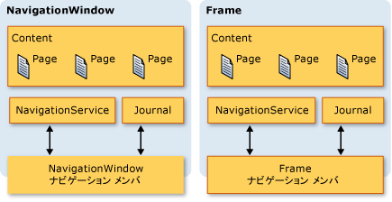  
  
 これにより、これらのメンバーに対して直接、ナビゲーション サポートをプログラミングできます。 カスタム ナビゲーションを提供する必要がある場合この検討する可能性があります[!INCLUDE[TLA2#tla_ui](../../../../includes/tla2sharptla-ui-md.md)]の<xref:System.Windows.Controls.Frame>でホストされている、<xref:System.Windows.Window>です。 両方の種類を含む、追加のナビゲーションに関連するメンバーを実装するさらに、 `BackStack` (<xref:System.Windows.Navigation.NavigationWindow.BackStack%2A?displayProperty=nameWithType>、 <xref:System.Windows.Controls.Frame.BackStack%2A?displayProperty=nameWithType>) および`ForwardStack`(<xref:System.Windows.Navigation.NavigationWindow.ForwardStack%2A?displayProperty=nameWithType>、 <xref:System.Windows.Controls.Frame.ForwardStack%2A?displayProperty=nameWithType>)、背面にジャーナル エントリを列挙することスタックが作成され、スタックにそれぞれ転送されます。  
  
 前に述べたように、アプリケーション内に複数の履歴が存在することがあります。 次の図は、この例を示しています。  
  
   
  
   
## XAML ページ以外のコンテンツへのナビゲート  
 このトピック全体で<xref:System.Windows.Controls.Page>およびパック[!INCLUDE[TLA2#tla_xbap#plural](../../../../includes/tla2sharptla-xbapsharpplural-md.md)]のさまざまなナビゲーション機能を示すために使用された[!INCLUDE[TLA2#tla_wpf](../../../../includes/tla2sharptla-wpf-md.md)]です。 ただし、<xref:System.Windows.Controls.Page>されているアプリケーションにコンパイルに移動できるコンテンツ パックの唯一の型ではない[!INCLUDE[TLA2#tla_xbap#plural](../../../../includes/tla2sharptla-xbapsharpplural-md.md)]のコンテンツを識別する唯一の方法がないです。  
  
 緩やかに移動できますも示すようにこのセクションで、[!INCLUDE[TLA2#tla_xaml](../../../../includes/tla2sharptla-xaml-md.md)]ファイル、[!INCLUDE[TLA2#tla_html](../../../../includes/tla2sharptla-html-md.md)]ファイル、およびオブジェクト。  
  
   
### Loose XAML ファイルへのナビゲート  
 厳密でない[!INCLUDE[TLA2#tla_xaml](../../../../includes/tla2sharptla-xaml-md.md)]ファイルは、次の特性を持つファイル。  
  
-   だけを含んだ[!INCLUDE[TLA2#tla_xaml](../../../../includes/tla2sharptla-xaml-md.md)] (つまり、コードではなくです。  
  
-   適切な名前空間宣言がある。  
  
-   .xaml ファイル名拡張子を持つ。  
  
 たとえば、として、loose 格納されている次のコンテンツ[!INCLUDE[TLA2#tla_xaml](../../../../includes/tla2sharptla-xaml-md.md)]Person.xaml ファイルします。  
  
 [!code-xaml[NavigationOverviewSnippets#LooseXAML](../../../../samples/snippets/csharp/VS_Snippets_Wpf/NavigationOverviewSnippets/CSharp/Person.xaml#loosexaml)]  
  
 ファイルをダブルクリックすると、ブラウザーが開き、コンテンツにナビゲートして、コンテンツを表示します。 これを次の図に示します。  
  
 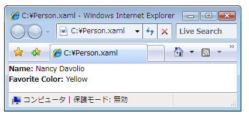  
  
 Loose を表示する[!INCLUDE[TLA2#tla_xaml](../../../../includes/tla2sharptla-xaml-md.md)]、次からのファイル。  
  
-   ローカル コンピューター、イントラネット、またはインターネット上の Web サイト。  
  
-   A[!INCLUDE[TLA#tla_unc](../../../../includes/tlasharptla-unc-md.md)]ファイル共有です。  
  
-   ローカル ディスク。  
  
 Loose[!INCLUDE[TLA2#tla_xaml](../../../../includes/tla2sharptla-xaml-md.md)]ファイルは、ブラウザーのお気に入りに追加できるか、ブラウザーのホーム ページにあります。  
  
> [!NOTE]
>  発行および疎起動の詳細については[!INCLUDE[TLA2#tla_xaml](../../../../includes/tla2sharptla-xaml-md.md)]、ページを参照してください[WPF アプリケーションを配置する](../../../../docs/framework/wpf/app-development/deploying-a-wpf-application-wpf.md)です。  
  
 厳密でないに関して制限事項の 1 つ[!INCLUDE[TLA2#tla_xaml](../../../../includes/tla2sharptla-xaml-md.md)]が部分信頼で実行しても安全なコンテンツをホストすることのみできます。 たとえば、 `Window` 、loose のルート要素にすることはできません[!INCLUDE[TLA2#tla_xaml](../../../../includes/tla2sharptla-xaml-md.md)]ファイル。 詳細については、次を参照してください。 [WPF 部分信頼セキュリティ](../../../../docs/framework/wpf/wpf-partial-trust-security.md)です。  
  
   
### フレームを使用した HTML ファイルへのナビゲート  
 移動できますもご想像[!INCLUDE[TLA2#tla_html](../../../../includes/tla2sharptla-html-md.md)]です。 単に提供する必要があります、 [!INCLUDE[TLA2#tla_uri](../../../../includes/tla2sharptla-uri-md.md)] http スキームを使用します。 たとえば、次[!INCLUDE[TLA2#tla_xaml](../../../../includes/tla2sharptla-xaml-md.md)]を示しています、<xref:System.Windows.Controls.Frame>に移動する、[!INCLUDE[TLA2#tla_html](../../../../includes/tla2sharptla-html-md.md)]ページ。  
  
 [!code-xaml[NavigationOverviewSnippets#FrameHtmlNavMARKUP](../../../../samples/snippets/csharp/VS_Snippets_Wpf/NavigationOverviewSnippets/CSharp/FrameHTMLNavPage.xaml#framehtmlnavmarkup)]  
  
 移動[!INCLUDE[TLA2#tla_html](../../../../includes/tla2sharptla-html-md.md)]特殊なアクセス許可が必要です。 たとえばから移動することはできません、[!INCLUDE[TLA2#tla_xbap](../../../../includes/tla2sharptla-xbap-md.md)]インターネット ゾーン部分信頼セキュリティ サンド ボックスで実行されています。 詳細については、次を参照してください。 [WPF 部分信頼セキュリティ](../../../../docs/framework/wpf/wpf-partial-trust-security.md)です。  
  
   
### WebBrowser コントロールを使用した HTML ファイルへのナビゲート  
 <xref:System.Windows.Controls.WebBrowser>サポート[!INCLUDE[TLA2#tla_html](../../../../includes/tla2sharptla-html-md.md)]ドキュメントをホストしている、ナビゲーション スクリプト/マネージ コードとの相互運用性。 詳細についてはに関して、<xref:System.Windows.Controls.WebBrowser>を制御しを参照してください<xref:System.Windows.Controls.WebBrowser>です。  
  
 同様に<xref:System.Windows.Controls.Frame>に間を移動する、[!INCLUDE[TLA2#tla_html](../../../../includes/tla2sharptla-html-md.md)]を使用して<xref:System.Windows.Controls.WebBrowser>特殊なアクセス許可が必要です。 たとえば、部分的に信頼されたアプリケーションから移動できますのみに[!INCLUDE[TLA2#tla_html](../../../../includes/tla2sharptla-html-md.md)]元のサイトにあります。 詳細については、次を参照してください。 [WPF 部分信頼セキュリティ](../../../../docs/framework/wpf/wpf-partial-trust-security.md)です。  
  
   
### カスタム オブジェクトへのナビゲート  
 カスタム オブジェクトとして格納されているデータがある場合は、そのデータを表示する方法の 1 つは、作成、<xref:System.Windows.Controls.Page>それらのオブジェクトにバインドされているコンテンツを持つ (を参照してください[データ バインディングの概要](../../../../docs/framework/wpf/data/data-binding-overview.md))。 オブジェクトを表示するためだけにページ全体を作成するオーバーヘッドが必要ない場合には、代わりに、オブジェクトに直接ナビゲートすることもできます。  
  
 検討してください、`Person`は次のコードで実装するクラス。  
  
 [!code-csharp[NavigateToObjectSnippets#PersonClassCODE](../../../../samples/snippets/csharp/VS_Snippets_Wpf/NavigateToObjectSnippets/CSharp/Person.cs#personclasscode)]
 [!code-vb[NavigateToObjectSnippets#PersonClassCODE](../../../../samples/snippets/visualbasic/VS_Snippets_Wpf/NavigateToObjectSnippets/VisualBasic/Person.vb#personclasscode)]  
  
 移動することを呼び出す、<xref:System.Windows.Navigation.NavigationWindow.Navigate%2A?displayProperty=nameWithType>メソッドを次のコードに示すようにします。  
  
 [!code-xaml[NavigateToObjectSnippets#PageThatNavsToObject1](../../../../samples/snippets/csharp/VS_Snippets_Wpf/NavigateToObjectSnippets/CSharp/HomePage.xaml#pagethatnavstoobject1)]  
[!code-xaml[NavigateToObjectSnippets#PageThatNavsToObject2](../../../../samples/snippets/csharp/VS_Snippets_Wpf/NavigateToObjectSnippets/CSharp/HomePage.xaml#pagethatnavstoobject2)]  
[!code-xaml[NavigateToObjectSnippets#PageThatNavsToObject3](../../../../samples/snippets/csharp/VS_Snippets_Wpf/NavigateToObjectSnippets/CSharp/HomePage.xaml#pagethatnavstoobject3)]  
  
 [!code-csharp[NavigateToObjectSnippets#PageThatNavsToObjectCODEBEHIND](../../../../samples/snippets/csharp/VS_Snippets_Wpf/NavigateToObjectSnippets/CSharp/HomePage.xaml.cs#pagethatnavstoobjectcodebehind)]
 [!code-vb[NavigateToObjectSnippets#PageThatNavsToObjectCODEBEHIND](../../../../samples/snippets/visualbasic/VS_Snippets_Wpf/NavigateToObjectSnippets/VisualBasic/HomePage.xaml.vb#pagethatnavstoobjectcodebehind)]  
  
 次の図に、結果を示します。  
  
 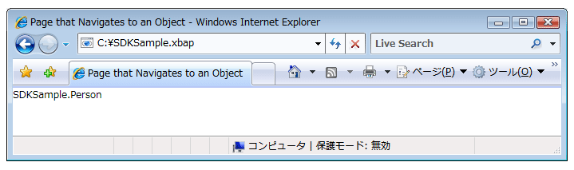  
  
 この図には、役立つものが何も表示されていません。 表示されている値の戻り値は、実際には、`ToString`のメソッド、**人**オブジェクトです。 既定では、これは、唯一の値[!INCLUDE[TLA2#tla_wpf](../../../../includes/tla2sharptla-wpf-md.md)]オブジェクトの表示に使用できます。 オーバーライドして、`ToString`がまだされますが、意味のある情報を返すメソッドを文字列値であるだけです。 1 つの手法が使用することができますのプレゼンテーション機能を利用する[!INCLUDE[TLA2#tla_wpf](../../../../includes/tla2sharptla-wpf-md.md)]データ テンプレートを使用することです。 データ テンプレートを実装することができますを[!INCLUDE[TLA2#tla_wpf](../../../../includes/tla2sharptla-wpf-md.md)]特定の種類のオブジェクトと関連付けることができます。 次のコードはデータのテンプレートを`Person`オブジェクト。  
  
 [!code-xaml[NavigateToObjectSnippets#DataTemplateMARKUP](../../../../samples/snippets/csharp/VS_Snippets_Wpf/NavigateToObjectSnippets/CSharp/App.xaml#datatemplatemarkup)]  
  
 ここでは、データ テンプレートに関連付けられている、`Person`型を使用して、`x:Type`のマークアップ拡張機能、`DataType`属性。 データ テンプレートが次に、バインド`TextBlock`要素 (を参照してください<xref:System.Windows.Controls.TextBlock>) のプロパティに、`Person`クラスです。 次の図は、の最新の外観を示しています、`Person`オブジェクト。  
  
 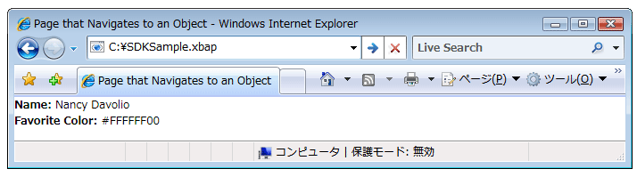  
  
 この方法の利点は、データ テンプレートを再利用して、アプリケーションの任意の場所で オブジェクトを一貫して表示できることによって得られる一貫性です。  
  
 データ テンプレートの詳細については、次を参照してください。[データ テンプレートの概要](../../../../docs/framework/wpf/data/data-templating-overview.md)です。  
  
   
## セキュリティ  
 [!INCLUDE[TLA2#tla_wpf](../../../../includes/tla2sharptla-wpf-md.md)] ナビゲーションのサポートにより、[!INCLUDE[TLA2#tla_xbap#plural](../../../../includes/tla2sharptla-xbapsharpplural-md.md)]とインターネット間を移動できない場合にサード パーティのコンテンツをホストするアプリケーションを許可します。 有害な動作は、アプリケーションとユーザーの両方を保護するために[!INCLUDE[TLA2#tla_wpf](../../../../includes/tla2sharptla-wpf-md.md)]で説明されているセキュリティ機能のさまざまな提供[セキュリティ](../../../../docs/framework/wpf/security-wpf.md)と[WPF 部分信頼セキュリティ](../../../../docs/framework/wpf/wpf-partial-trust-security.md)です。  
  
## 関連項目  
 <xref:System.Windows.Application.SetCookie%2A>  
 <xref:System.Windows.Application.GetCookie%2A>  
 [アプリケーション管理の概要](../../../../docs/framework/wpf/app-development/application-management-overview.md)  
 [WPF におけるパッケージの URI](../../../../docs/framework/wpf/app-development/pack-uris-in-wpf.md)  
 [構造化ナビゲーションの概要](../../../../docs/framework/wpf/app-development/structured-navigation-overview.md)  
 [ナビゲーション トポロジの概要](../../../../docs/framework/wpf/app-development/navigation-topologies-overview.md)  
 [方法トピック](../../../../docs/framework/wpf/app-development/navigation-how-to-topics.md)  
 [WPF アプリケーションの配置](../../../../docs/framework/wpf/app-development/deploying-a-wpf-application-wpf.md)
