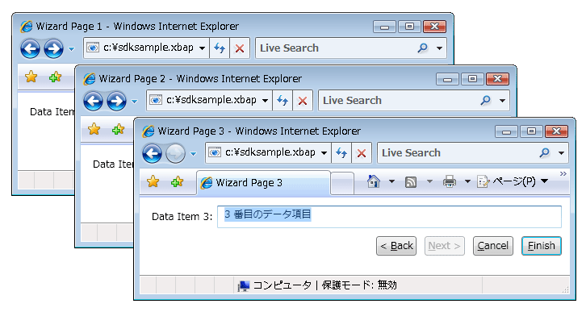
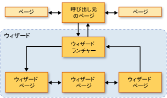
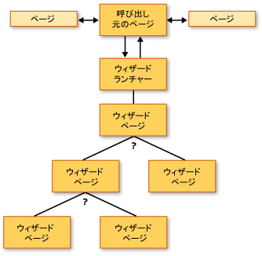
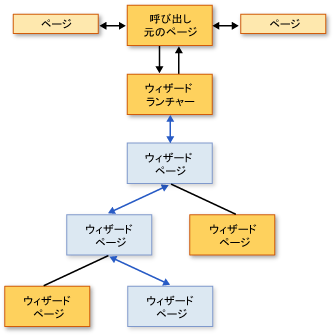
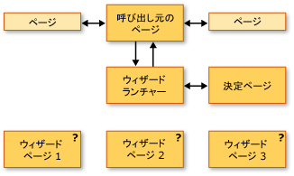
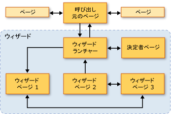

# ナビゲーション トポロジの概要
 この概要では、[!INCLUDE[TLA2#tla_wpf](../../../../includes/tla2sharptla-wpf-md.md)] のナビゲーション トポロジについて紹介します。  3 つのナビゲーション トポロジをサンプルと共に説明します。  
  
> [!NOTE]
>  このトピックを読む前に、ページ関数を使用した [!INCLUDE[TLA2#tla_wpf](../../../../includes/tla2sharptla-wpf-md.md)] の構造化ナビゲーションの概念を理解している必要があります。  これらのトピックに関する詳細については、「[構造化ナビゲーションの概要](../../../../docs/framework/wpf/app-development/structured-navigation-overview.md)」を参照してください。  
  
 このトピックは、次のセクションで構成されています。  
  
-   [ナビゲーション トポロジ](#Navigation_Topologies)  
  
-   [構造化ナビゲーション トポロジ](#Structured_Navigation_Topologies)  
  
-   [固定線形トポロジを介したナビゲーション](#Navigation_over_a_Fixed_Linear_Topology)  
  
-   [固定階層トポロジを介した動的ナビゲーション](#Dynamic_Navigation_over_a_Fixed_Hierarchical_Topology)  
  
-   [動的に生成されたトポロジを介したナビゲーション](#Navigation_over_a_Dynamically_Generated_Topology)  
  
   
## ナビゲーション トポロジ  
 [!INCLUDE[TLA2#tla_wpf](../../../../includes/tla2sharptla-wpf-md.md)] において、ナビゲーションは通常、クリックされると他のページに移動するハイパーリンク \(<xref:System.Windows.Documents.Hyperlink>\) を持つページ \(<xref:System.Windows.Controls.Page>\) で構成されます。  移動先となるページは [!INCLUDE[TLA#tla_uri#plural](../../../../includes/tlasharptla-urisharpplural-md.md)] で識別されます \(「[WPF におけるパッケージの URI](../../../../docs/framework/wpf/app-development/pack-uris-in-wpf.md)」を参照してください\)。  ページ、ハイパーリンク、および [!INCLUDE[TLA#tla_uri#plural](../../../../includes/tlasharptla-urisharpplural-md.md)] を表示する次の簡単な例について考えます。  
  
 [!code-xml[NavigationTopologiesOverviewSnippets#Page1](../../../../samples/snippets/csharp/VS_Snippets_Wpf/NavigationTopologiesOverviewSnippets/CS/Page1.xaml#page1)]  
  
 [!code-xml[NavigationTopologiesOverviewSnippets#Page2](../../../../samples/snippets/csharp/VS_Snippets_Wpf/NavigationTopologiesOverviewSnippets/CS/Page2.xaml#page2)]  
  
 これらのページは 1 つの*ナビゲーション トポロジ*に配置され、その構造はページ間をどう移動できるかによって決まります。  このナビゲーション トポロジはシンプルなシナリオに適していますが、ナビゲーションにもっと複雑なトポロジが必要になる場合もあり、アプリケーションの実行中にしか定義できないものもあります。  
  
 このトピックでは、それぞれ*固定線形*、*固定階層*、*動的生成*と呼ばれる 3 つの一般的なナビゲーション トポロジについて説明します。  各ナビゲーション トポロジは、次の図に示すような [!INCLUDE[TLA2#tla_ui](../../../../includes/tla2sharptla-ui-md.md)] を持つサンプルで示されます。  
  
   
  
   
## 構造化ナビゲーション トポロジ  
 ナビゲーション トポロジには、大きく分けて次の 2 種類があります。  
  
-   **固定トポロジ** : コンパイル時に定義され、実行時には変更されません。  固定トポロジは、シーケンスが固定されたページを線形的または階層的にナビゲートする場合に役立ちます。  
  
-   **動的トポロジ** : ユーザー、アプリケーション、またはシステムから収集された入力に基づいて実行時に定義されます。  動的トポロジは、ページがさまざまなシーケンスでナビゲートされる可能性がある場合に便利です。  
  
 ナビゲーション トポロジの作成にはページを使用することもできますが、このサンプルではページ関数を使用しています。その理由は、ページ関数に用意されている追加サポートによって、トポロジのページ間でデータをやり取りする機能のサポートを簡略化できるためです。  
  
   
## 固定線形トポロジを介したナビゲーション  
 固定線形トポロジは、シーケンスが固定されている 1 つ以上のウィザード ページの構造に似ています。  次の図は、固定線形トポロジを持つウィザードの高レベルの構造およびフローを示しています。  
  
   
  
 固定線形トポロジを使用するナビゲーションの一般的な動作は次のようになります。  
  
-   呼び出し元ページから起動ページに移動します。起動ページでは、ウィザードを初期化し、最初のウィザード ページに移動します。  呼び出し元ページからウィザードの最初のページを直接呼び出すこともできるため、起動ページ \([!INCLUDE[TLA2#tla_ui](../../../../includes/tla2sharptla-ui-md.md)] のない <xref:System.Windows.Navigation.PageFunction%601>\) は必須ではありません。  ただし、起動ページを使用すると、ウィザードの初期化プロセスを簡略化でき、特に初期化が複雑な場合に便利です。  
  
-   ユーザーは、"戻る" ボタンと "進む" ボタン \(またはハイパーリンク\) を使用してページ間を移動できます。  
  
-   ユーザーは、履歴を使用してページ間を移動できます。  
  
-   ユーザーは、任意のウィザード ページで \[キャンセル\] ボタンをクリックしてウィザードをキャンセルできます。  
  
-   ユーザーは、最後のウィザード ページで \[完了\] ボタンをクリックしてウィザードを受け入れることができます。  
  
-   キャンセルされた場合、ウィザードは適切な結果を返し、データは返しません。  
  
-   ユーザーがウィザードを受け入れた場合、ウィザードは適切な結果と収集したデータを返します。  
  
-   ウィザードが完了すると \(受け入れられた場合もキャンセルされた場合も含めて\)、ウィザードを構成するページは履歴から削除されます。  これにより、ウィザードの各インスタンスが分離され、異常なデータや状態の発生を防ぎます。  
  
   
## 固定階層トポロジを介した動的ナビゲーション  
 アプリケーションによっては、次の例に示すように、ページから複数のページに移動できる場合があります。  
  
   
  
 この構造は固定階層トポロジと呼ばれ、通常、階層内を移動するシーケンスは、アプリケーションまたはユーザーによって実行時に決定されます。  複数の他のページに移動できる階層内の各ページでは、実行時に、移動先ページを決定するために必要なデータが収集されます。  次の図は、前の図に基づくいくつかの可能なナビゲーション シーケンスを示しています。  
  
   
  
 固定階層構造内のページのシーケンスは実行時に決定されますが、ユーザー エクスペリエンスは固定線形トポロジの場合と同じです。  
  
-   呼び出し元ページから起動ページに移動します。起動ページでは、ウィザードを初期化し、最初のウィザード ページに移動します。  呼び出し元ページからウィザードの最初のページを直接呼び出すこともできるため、起動ページ \([!INCLUDE[TLA2#tla_ui](../../../../includes/tla2sharptla-ui-md.md)] のない <xref:System.Windows.Navigation.PageFunction%601>\) は必須ではありません。  ただし、起動ページを使用すると、ウィザードの初期化プロセスを簡略化でき、特に初期化が複雑な場合に便利です。  
  
-   ユーザーは、"戻る" ボタンと "進む" ボタン \(またはハイパーリンク\) を使用してページ間を移動できます。  
  
-   ユーザーは、履歴を使用してページ間を移動できます。  
  
-   ユーザーは、履歴をたどって戻ることで、ナビゲーション シーケンスを変更できます。  
  
-   ユーザーは、任意のウィザード ページで \[キャンセル\] ボタンをクリックしてウィザードをキャンセルできます。  
  
-   ユーザーは、最後のウィザード ページで \[完了\] ボタンをクリックしてウィザードを受け入れることができます。  
  
-   キャンセルされた場合、ウィザードは適切な結果を返し、データは返しません。  
  
-   ユーザーがウィザードを受け入れた場合、ウィザードは適切な結果と収集したデータを返します。  
  
-   ウィザードが完了すると \(受け入れられた場合もキャンセルされた場合も含めて\)、ウィザードを構成するページは履歴から削除されます。  これにより、ウィザードの各インスタンスが分離され、異常なデータや状態の発生を防ぎます。  
  
   
## 動的に生成されたトポロジを介したナビゲーション  
 アプリケーションによっては、複数のページ間を移動するシーケンスの決定にユーザー、アプリケーション、または外部データが必要となり、実行時にしか決定できない場合があります。  次の図は、基本となるナビゲーション シーケンスを持つページの集合を示しています。  
  
   
  
 次の図は、ユーザーによって実行時に選択されたナビゲーション シーケンスを示しています。  
  
   
  
 このナビゲーション シーケンスは、動的生成トポロジと呼ばれます。  ユーザーにとっては、他のナビゲーション トポロジと同様に、ユーザー エクスペリエンスは前述のトポロジと同じになります。  
  
-   呼び出し元ページから起動ページに移動します。起動ページでは、ウィザードを初期化し、最初のウィザード ページに移動します。  呼び出し元ページからウィザードの最初のページを直接呼び出すこともできるため、起動ページ \([!INCLUDE[TLA2#tla_ui](../../../../includes/tla2sharptla-ui-md.md)] のない <xref:System.Windows.Navigation.PageFunction%601>\) は必須ではありません。  ただし、起動ページを使用すると、ウィザードの初期化プロセスを簡略化でき、特に初期化が複雑な場合に便利です。  
  
-   ユーザーは、"戻る" ボタンと "進む" ボタン \(またはハイパーリンク\) を使用してページ間を移動できます。  
  
-   ユーザーは、履歴を使用してページ間を移動できます。  
  
-   ユーザーは、任意のウィザード ページで \[キャンセル\] ボタンをクリックしてウィザードをキャンセルできます。  
  
-   ユーザーは、最後のウィザード ページで \[完了\] ボタンをクリックしてウィザードを受け入れることができます。  
  
-   キャンセルされた場合、ウィザードは適切な結果を返し、データは返しません。  
  
-   ユーザーがウィザードを受け入れた場合、ウィザードは適切な結果と収集したデータを返します。  
  
-   ウィザードが完了すると \(受け入れられた場合もキャンセルされた場合も含めて\)、ウィザードを構成するページは履歴から削除されます。  これにより、ウィザードの各インスタンスが分離され、異常なデータや状態の発生を防ぎます。  
  
## 参照  
 <xref:System.Windows.Controls.Page>   
 <xref:System.Windows.Navigation.PageFunction%601>   
 <xref:System.Windows.Navigation.NavigationService>   
 [構造化ナビゲーションの概要](../../../../docs/framework/wpf/app-development/structured-navigation-overview.md)