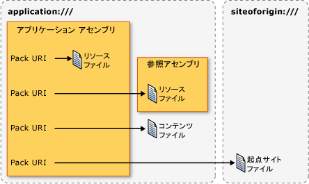

# <a name="pack-uris-in-wpf"></a><span data-ttu-id="3e769-102">WPF におけるパッケージの URI</span><span class="sxs-lookup"><span data-stu-id="3e769-102">Pack URIs in WPF</span></span>
<span data-ttu-id="3e769-103">[!INCLUDE[TLA#tla_wpf](../../../../includes/tlasharptla-wpf-md.md)]、[!INCLUDE[TLA#tla_uri#plural](../../../../includes/tlasharptla-urisharpplural-md.md)]を特定し、次を含む、さまざまな方法でファイルを読み込むために使用します。</span><span class="sxs-lookup"><span data-stu-id="3e769-103">In [!INCLUDE[TLA#tla_wpf](../../../../includes/tlasharptla-wpf-md.md)], [!INCLUDE[TLA#tla_uri#plural](../../../../includes/tlasharptla-urisharpplural-md.md)] are used to identify and load files in many ways, including the following:</span></span>  
  
-   <span data-ttu-id="3e769-104">指定する、[!INCLUDE[TLA#tla_ui](../../../../includes/tlasharptla-ui-md.md)]を表示するときに、アプリケーションを初めて起動します。</span><span class="sxs-lookup"><span data-stu-id="3e769-104">Specifying the [!INCLUDE[TLA#tla_ui](../../../../includes/tlasharptla-ui-md.md)] to show when an application first starts.</span></span>  
  
-   <span data-ttu-id="3e769-105">イメージの読み込み。</span><span class="sxs-lookup"><span data-stu-id="3e769-105">Loading images.</span></span>  
  
-   <span data-ttu-id="3e769-106">ページへの移動。</span><span class="sxs-lookup"><span data-stu-id="3e769-106">Navigating to pages.</span></span>  
  
-   <span data-ttu-id="3e769-107">実行可能でないデータ ファイルの読み込み。</span><span class="sxs-lookup"><span data-stu-id="3e769-107">Loading non-executable data files.</span></span>  
  
 <span data-ttu-id="3e769-108">さらに、[!INCLUDE[TLA2#tla_uri#plural](../../../../includes/tla2sharptla-urisharpplural-md.md)]のため識別し、さまざまな場所、たとえば、次のファイルを読み込むことができます。</span><span class="sxs-lookup"><span data-stu-id="3e769-108">Furthermore, [!INCLUDE[TLA2#tla_uri#plural](../../../../includes/tla2sharptla-urisharpplural-md.md)] can be used to identify and load files from a variety of locations, including the following:</span></span>  
  
-   <span data-ttu-id="3e769-109">現在のアセンブリ。</span><span class="sxs-lookup"><span data-stu-id="3e769-109">The current assembly.</span></span>  
  
-   <span data-ttu-id="3e769-110">参照アセンブリ。</span><span class="sxs-lookup"><span data-stu-id="3e769-110">A referenced assembly.</span></span>  
  
-   <span data-ttu-id="3e769-111">アセンブリに対して相対的な位置。</span><span class="sxs-lookup"><span data-stu-id="3e769-111">A location relative to an assembly.</span></span>  
  
-   <span data-ttu-id="3e769-112">アプリケーションの起点サイト。</span><span class="sxs-lookup"><span data-stu-id="3e769-112">The application's site of origin.</span></span>  
  
 <span data-ttu-id="3e769-113">指定して、これらの場所からその種類のファイルを読み込むのための一貫性のあるメカニズムを提供する[!INCLUDE[TLA2#tla_wpf](../../../../includes/tla2sharptla-wpf-md.md)]の拡張性を活用して、*パック URI スキーム*です。</span><span class="sxs-lookup"><span data-stu-id="3e769-113">To provide a consistent mechanism for identifying and loading these types of files from these locations, [!INCLUDE[TLA2#tla_wpf](../../../../includes/tla2sharptla-wpf-md.md)] leverages the extensibility of the *pack URI scheme*.</span></span> <span data-ttu-id="3e769-114">このトピックでは、スキームの概要を示します、パックを作成する方法について説明[!INCLUDE[TLA2#tla_uri#plural](../../../../includes/tla2sharptla-urisharpplural-md.md)]さまざまなシナリオ、絶対パスと相対について説明[!INCLUDE[TLA2#tla_uri#plural](../../../../includes/tla2sharptla-urisharpplural-md.md)]と[!INCLUDE[TLA2#tla_uri](../../../../includes/tla2sharptla-uri-md.md)]パックを使用する方法を表示する前に、解決[!INCLUDE[TLA2#tla_uri#plural](../../../../includes/tla2sharptla-urisharpplural-md.md)]両方マークアップからコード。</span><span class="sxs-lookup"><span data-stu-id="3e769-114">This topic provides an overview of the scheme, covers how to construct pack [!INCLUDE[TLA2#tla_uri#plural](../../../../includes/tla2sharptla-urisharpplural-md.md)] for a variety of scenarios, discusses absolute and relative [!INCLUDE[TLA2#tla_uri#plural](../../../../includes/tla2sharptla-urisharpplural-md.md)] and [!INCLUDE[TLA2#tla_uri](../../../../includes/tla2sharptla-uri-md.md)] resolution, before showing how to use pack [!INCLUDE[TLA2#tla_uri#plural](../../../../includes/tla2sharptla-urisharpplural-md.md)] from both markup and code.</span></span>  
  
  
<a name="The_Pack_URI_Scheme"></a>   
## <a name="the-pack-uri-scheme"></a><span data-ttu-id="3e769-115">パック URI スキーム</span><span class="sxs-lookup"><span data-stu-id="3e769-115">The Pack URI Scheme</span></span>  
 <span data-ttu-id="3e769-116">パック[!INCLUDE[TLA2#tla_uri](../../../../includes/tla2sharptla-uri-md.md)]してスキーマを使用、 [Open Packaging Conventions](http://go.microsoft.com/fwlink/?LinkID=71255) (OPC) の仕様は、整理、およびコンテンツを識別するためのモデルについて説明します。</span><span class="sxs-lookup"><span data-stu-id="3e769-116">The pack [!INCLUDE[TLA2#tla_uri](../../../../includes/tla2sharptla-uri-md.md)] scheme is used by the [Open Packaging Conventions](http://go.microsoft.com/fwlink/?LinkID=71255) (OPC) specification, which describes a model for organizing and identifying content.</span></span> <span data-ttu-id="3e769-117">このモデルの主要な要素は、パッケージとパーツ、場所、*パッケージ*は、論理的なコンテナーの 1 つ以上の論理*パーツ*です。</span><span class="sxs-lookup"><span data-stu-id="3e769-117">The key elements of this model are packages and parts, where a *package* is a logical container for one or more logical *parts*.</span></span> <span data-ttu-id="3e769-118">この概念を次の図に示します。</span><span class="sxs-lookup"><span data-stu-id="3e769-118">The following figure illustrates this concept.</span></span>  
  
 <span data-ttu-id="3e769-119"></span><span class="sxs-lookup"><span data-stu-id="3e769-119"></span></span>  
  
 <span data-ttu-id="3e769-120">部分を識別するため、OPC 仕様は RFC 2396 の拡張性を活用して (Uniform Resource Identifier (URI): 一般構文)、パックを定義する[!INCLUDE[TLA2#tla_uri](../../../../includes/tla2sharptla-uri-md.md)]スキームです。</span><span class="sxs-lookup"><span data-stu-id="3e769-120">To identify parts, the OPC specification leverages the extensibility of RFC 2396 (Uniform Resource Identifiers (URI): Generic Syntax) to define the pack [!INCLUDE[TLA2#tla_uri](../../../../includes/tla2sharptla-uri-md.md)] scheme.</span></span>  
  
 <span data-ttu-id="3e769-121">指定されているスキーム、[!INCLUDE[TLA2#tla_uri](../../../../includes/tla2sharptla-uri-md.md)]そのプレフィックスは http、ftp、およびファイルは、よく知られている例を示します。</span><span class="sxs-lookup"><span data-stu-id="3e769-121">The scheme that is specified by a [!INCLUDE[TLA2#tla_uri](../../../../includes/tla2sharptla-uri-md.md)] is defined by its prefix; http, ftp, and file are well-known examples.</span></span> <span data-ttu-id="3e769-122">パック[!INCLUDE[TLA2#tla_uri](../../../../includes/tla2sharptla-uri-md.md)]スキームは、そのスキームとして"pack"を使用し、2 つのコンポーネントが含まれています: 証明機関とパス。</span><span class="sxs-lookup"><span data-stu-id="3e769-122">The pack [!INCLUDE[TLA2#tla_uri](../../../../includes/tla2sharptla-uri-md.md)] scheme uses "pack" as its scheme, and contains two components: authority and path.</span></span> <span data-ttu-id="3e769-123">パックの形式は[!INCLUDE[TLA2#tla_uri](../../../../includes/tla2sharptla-uri-md.md)]します。</span><span class="sxs-lookup"><span data-stu-id="3e769-123">The following is the format for a pack [!INCLUDE[TLA2#tla_uri](../../../../includes/tla2sharptla-uri-md.md)].</span></span>  
  
 <span data-ttu-id="3e769-124">パック://*機関*/*パス*</span><span class="sxs-lookup"><span data-stu-id="3e769-124">pack://*authority*/*path*</span></span>
  
 <span data-ttu-id="3e769-125">*機関*一部に含まれています、パッケージの種類を指定中に、*パス*パッケージ内の部分の場所を指定します。</span><span class="sxs-lookup"><span data-stu-id="3e769-125">The *authority* specifies the type of package that a part is contained by, while the *path* specifies the location of a part within a package.</span></span>  
  
 <span data-ttu-id="3e769-126">この概念を次の図に示します。</span><span class="sxs-lookup"><span data-stu-id="3e769-126">This concept is illustrated by the following figure:</span></span>  
  
 <span data-ttu-id="3e769-127"></span><span class="sxs-lookup"><span data-stu-id="3e769-127"></span></span>  
  
 <span data-ttu-id="3e769-128">パッケージとパーツは、アプリケーションとファイルに似ています。つまり、アプリケーション (パッケージ) は、次のような 1 つ以上のファイル (パーツ) を含むことができます。</span><span class="sxs-lookup"><span data-stu-id="3e769-128">Packages and parts are analogous to applications and files, where an application (package) can include one or more files (parts), including:</span></span>  
  
-   <span data-ttu-id="3e769-129">ローカル アセンブリにコンパイルされるリソース ファイル。</span><span class="sxs-lookup"><span data-stu-id="3e769-129">Resource files that are compiled into the local assembly.</span></span>  
  
-   <span data-ttu-id="3e769-130">参照センブリにコンパイルされるリソース ファイル。</span><span class="sxs-lookup"><span data-stu-id="3e769-130">Resource files that are compiled into a referenced assembly.</span></span>  
  
-   <span data-ttu-id="3e769-131">参照元センブリにコンパイルされるリソース ファイル。</span><span class="sxs-lookup"><span data-stu-id="3e769-131">Resource files that are compiled into a referencing assembly.</span></span>  
  
-   <span data-ttu-id="3e769-132">コンテンツ ファイル。</span><span class="sxs-lookup"><span data-stu-id="3e769-132">Content files.</span></span>  
  
-   <span data-ttu-id="3e769-133">起点サイト ファイル。</span><span class="sxs-lookup"><span data-stu-id="3e769-133">Site of origin files.</span></span>  
  
 <span data-ttu-id="3e769-134">これらの種類のファイルにアクセスする[!INCLUDE[TLA2#tla_wpf](../../../../includes/tla2sharptla-wpf-md.md)]機関の 2 つのサポート: アプリケーション:///および siteoforigin:///です。</span><span class="sxs-lookup"><span data-stu-id="3e769-134">To access these types of files, [!INCLUDE[TLA2#tla_wpf](../../../../includes/tla2sharptla-wpf-md.md)] supports two authorities: application:/// and siteoforigin:///.</span></span> <span data-ttu-id="3e769-135">application:/// オーソリティは、リソース ファイルやコンテンツ ファイルなど、コンパイル時に既知のアプリケーション データ ファイルを識別します。</span><span class="sxs-lookup"><span data-stu-id="3e769-135">The application:/// authority identifies application data files that are known at compile time, including resource and content files.</span></span> <span data-ttu-id="3e769-136">siteoforigin:/// オーソリティは、起点サイト ファイルを識別します。</span><span class="sxs-lookup"><span data-stu-id="3e769-136">The siteoforigin:/// authority identifies site of origin files.</span></span> <span data-ttu-id="3e769-137">各オーソリティのスコープを次の図に示します。</span><span class="sxs-lookup"><span data-stu-id="3e769-137">The scope of each authority is shown in the following figure.</span></span>  
  
 <span data-ttu-id="3e769-138"></span><span class="sxs-lookup"><span data-stu-id="3e769-138"></span></span>  
  
> [!NOTE]
>  <span data-ttu-id="3e769-139">パックの機関コンポーネント[!INCLUDE[TLA2#tla_uri](../../../../includes/tla2sharptla-uri-md.md)]が埋め込まれた[!INCLUDE[TLA2#tla_uri](../../../../includes/tla2sharptla-uri-md.md)]するパッケージをポイントして、RFC 2396 に準拠する必要があります。</span><span class="sxs-lookup"><span data-stu-id="3e769-139">The authority component of a pack [!INCLUDE[TLA2#tla_uri](../../../../includes/tla2sharptla-uri-md.md)] is an embedded [!INCLUDE[TLA2#tla_uri](../../../../includes/tla2sharptla-uri-md.md)] that points to a package and must conform to RFC 2396.</span></span> <span data-ttu-id="3e769-140">さらに、"/" 文字は "," 文字に置き換える必要があり、"%" や "?" などの予約文字はエスケープする必要があります。</span><span class="sxs-lookup"><span data-stu-id="3e769-140">Additionally, the "/" character must be replaced with the "," character, and reserved characters such as "%" and "?" must be escaped.</span></span> <span data-ttu-id="3e769-141">詳細については、OPC を参照してください。</span><span class="sxs-lookup"><span data-stu-id="3e769-141">See the OPC for details.</span></span>  
  
 <span data-ttu-id="3e769-142">次のセクションでは、パックを作成する方法を説明する[!INCLUDE[TLA2#tla_uri#plural](../../../../includes/tla2sharptla-urisharpplural-md.md)]リソース、コンテンツ、およびファイルの元のサイトを識別するため、適切なパスとを組み合わせてこれら 2 つの機関を使用します。</span><span class="sxs-lookup"><span data-stu-id="3e769-142">The following sections explain how to construct pack [!INCLUDE[TLA2#tla_uri#plural](../../../../includes/tla2sharptla-urisharpplural-md.md)] using these two authorities in conjunction with the appropriate paths for identifying resource, content, and site of origin files.</span></span>  
  
<a name="Resource_File_Pack_URIs___Local_Assembly"></a>   
## <a name="resource-file-pack-uris"></a><span data-ttu-id="3e769-143">リソース ファイルのパック URI</span><span class="sxs-lookup"><span data-stu-id="3e769-143">Resource File Pack URIs</span></span>  
 <span data-ttu-id="3e769-144">リソース ファイルとして構成されている[!INCLUDE[TLA2#tla_msbuild](../../../../includes/tla2sharptla-msbuild-md.md)]`Resource`項目し、アセンブリにコンパイルされます。</span><span class="sxs-lookup"><span data-stu-id="3e769-144">Resource files are configured as [!INCLUDE[TLA2#tla_msbuild](../../../../includes/tla2sharptla-msbuild-md.md)]`Resource` items and are compiled into assemblies.</span></span> [!INCLUDE[TLA2#tla_wpf](../../../../includes/tla2sharptla-wpf-md.md)]<span data-ttu-id="3e769-145">パックの構築をサポートしている[!INCLUDE[TLA2#tla_uri#plural](../../../../includes/tla2sharptla-urisharpplural-md.md)]はローカルのアセンブリにコンパイルまたはローカル アセンブリから参照されるアセンブリにコンパイルするリソース ファイルの識別に使用できます。</span><span class="sxs-lookup"><span data-stu-id="3e769-145"> supports the construction of pack [!INCLUDE[TLA2#tla_uri#plural](../../../../includes/tla2sharptla-urisharpplural-md.md)] that can be used to identify resource files that are either compiled into the local assembly or compiled into an assembly that is referenced from the local assembly.</span></span>  
  
<a name="Local_Assembly_Resource_File"></a>   
### <a name="local-assembly-resource-file"></a><span data-ttu-id="3e769-146">ローカル アセンブリ リソース ファイル</span><span class="sxs-lookup"><span data-stu-id="3e769-146">Local Assembly Resource File</span></span>  
 <span data-ttu-id="3e769-147">パック[!INCLUDE[TLA2#tla_uri](../../../../includes/tla2sharptla-uri-md.md)]次の証明機関とパスのリソースのローカル アセンブリにコンパイルされたファイルを使用します。</span><span class="sxs-lookup"><span data-stu-id="3e769-147">The pack [!INCLUDE[TLA2#tla_uri](../../../../includes/tla2sharptla-uri-md.md)] for a resource file that is compiled into the local assembly uses the following authority and path:</span></span>  
  
-   <span data-ttu-id="3e769-148">**オーソリティ**: application:///。</span><span class="sxs-lookup"><span data-stu-id="3e769-148">**Authority**: application:///.</span></span>  
  
-   <span data-ttu-id="3e769-149">**パス**: ローカル アセンブリのプロジェクト フォルダーのルートに対して相対的なパスを含むリソース ファイルの名前。</span><span class="sxs-lookup"><span data-stu-id="3e769-149">**Path**: The name of the resource file, including its path, relative to the local assembly project folder root.</span></span>  
  
 <span data-ttu-id="3e769-150">次の例は、パック[!INCLUDE[TLA2#tla_uri](../../../../includes/tla2sharptla-uri-md.md)]の[!INCLUDE[TLA2#tla_xaml](../../../../includes/tla2sharptla-xaml-md.md)]ローカル アセンブリのプロジェクト フォルダーのルートに配置されているリソース ファイル。</span><span class="sxs-lookup"><span data-stu-id="3e769-150">The following example shows the pack [!INCLUDE[TLA2#tla_uri](../../../../includes/tla2sharptla-uri-md.md)] for a [!INCLUDE[TLA2#tla_xaml](../../../../includes/tla2sharptla-xaml-md.md)] resource file that is located in the root of the local assembly's project folder.</span></span>  
  
 `pack://application:,,,/ResourceFile.xaml`  
  
 <span data-ttu-id="3e769-151">次の例は、パック[!INCLUDE[TLA2#tla_uri](../../../../includes/tla2sharptla-uri-md.md)]の[!INCLUDE[TLA2#tla_xaml](../../../../includes/tla2sharptla-xaml-md.md)]ローカル アセンブリのプロジェクト フォルダーのサブフォルダーに配置されているリソース ファイル。</span><span class="sxs-lookup"><span data-stu-id="3e769-151">The following example shows the pack [!INCLUDE[TLA2#tla_uri](../../../../includes/tla2sharptla-uri-md.md)] for a [!INCLUDE[TLA2#tla_xaml](../../../../includes/tla2sharptla-xaml-md.md)] resource file that is located in a subfolder of the local assembly's project folder.</span></span>  
  
 `pack://application:,,,/Subfolder/ResourceFile.xaml`  
  
<a name="Resource_File_Pack_URIs___Referenced_Assembly"></a>   
### <a name="referenced-assembly-resource-file"></a><span data-ttu-id="3e769-152">参照アセンブリ リソース ファイル</span><span class="sxs-lookup"><span data-stu-id="3e769-152">Referenced Assembly Resource File</span></span>  
 <span data-ttu-id="3e769-153">パック[!INCLUDE[TLA2#tla_uri](../../../../includes/tla2sharptla-uri-md.md)]次機関とパスのリソースの参照アセンブリにコンパイルされたファイルを使用します。</span><span class="sxs-lookup"><span data-stu-id="3e769-153">The pack [!INCLUDE[TLA2#tla_uri](../../../../includes/tla2sharptla-uri-md.md)] for a resource file that is compiled into a referenced assembly uses the following authority and path:</span></span>  
  
-   <span data-ttu-id="3e769-154">**オーソリティ**: application:///。</span><span class="sxs-lookup"><span data-stu-id="3e769-154">**Authority**: application:///.</span></span>  
  
-   <span data-ttu-id="3e769-155">**パス**: 参照アセンブリにコンパイルされるリソース ファイルの名前。</span><span class="sxs-lookup"><span data-stu-id="3e769-155">**Path**: The name of a resource file that is compiled into a referenced assembly.</span></span> <span data-ttu-id="3e769-156">パスは、次の書式に従う必要があります。</span><span class="sxs-lookup"><span data-stu-id="3e769-156">The path must conform to the following format:</span></span>  
  
     <span data-ttu-id="3e769-157">*AssemblyShortName*{*です。バージョン*] {*です。公開鍵*]; component/*パス*</span><span class="sxs-lookup"><span data-stu-id="3e769-157">*AssemblyShortName*{*;Version*]{*;PublicKey*];component/*Path*</span></span>  
  
    -   <span data-ttu-id="3e769-158">**AssemblyShortName**: 参照アセンブリの短い名前。</span><span class="sxs-lookup"><span data-stu-id="3e769-158">**AssemblyShortName**: the short name for the referenced assembly.</span></span>  
  
    -   <span data-ttu-id="3e769-159">**;Version** (省略可能): リソース ファイルを含む参照アセンブリのバージョン。</span><span class="sxs-lookup"><span data-stu-id="3e769-159">**;Version** [optional]: the version of the referenced assembly that contains the resource file.</span></span> <span data-ttu-id="3e769-160">これは、同じ短い名前を持つ 2 つ以上の参照アセンブリが読み込まれるときに使用されます。</span><span class="sxs-lookup"><span data-stu-id="3e769-160">This is used when two or more referenced assemblies with the same short name are loaded.</span></span>  
  
    -   <span data-ttu-id="3e769-161">**;PublicKey** (省略可能): 参照アセンブリの署名に使用された公開鍵。</span><span class="sxs-lookup"><span data-stu-id="3e769-161">**;PublicKey** [optional]: the public key that was used to sign the referenced assembly.</span></span> <span data-ttu-id="3e769-162">これは、同じ短い名前を持つ 2 つ以上の参照アセンブリが読み込まれるときに使用されます。</span><span class="sxs-lookup"><span data-stu-id="3e769-162">This is used when two or more referenced assemblies with the same short name are loaded.</span></span>  
  
    -   <span data-ttu-id="3e769-163">**;component**: 参照されるアセンブリが、ローカル アセンブリから参照されることを指定します。</span><span class="sxs-lookup"><span data-stu-id="3e769-163">**;component**: specifies that the assembly being referred to is referenced from the local assembly.</span></span>  
  
    -   <span data-ttu-id="3e769-164">**/Path**: 参照アセンブリのプロジェクト フォルダーのルートに対して相対的なパスを含むリソース ファイルの名前。</span><span class="sxs-lookup"><span data-stu-id="3e769-164">**/Path**: the name of the resource file, including its path, relative to the root of the referenced assembly's project folder.</span></span>  
  
 <span data-ttu-id="3e769-165">次の例は、パック[!INCLUDE[TLA2#tla_uri](../../../../includes/tla2sharptla-uri-md.md)]の[!INCLUDE[TLA2#tla_xaml](../../../../includes/tla2sharptla-xaml-md.md)]参照アセンブリのプロジェクト フォルダーのルートに配置されているリソース ファイル。</span><span class="sxs-lookup"><span data-stu-id="3e769-165">The following example shows the pack [!INCLUDE[TLA2#tla_uri](../../../../includes/tla2sharptla-uri-md.md)] for a [!INCLUDE[TLA2#tla_xaml](../../../../includes/tla2sharptla-xaml-md.md)] resource file that is located in the root of the referenced assembly's project folder.</span></span>  
  
 `pack://application:,,,/ReferencedAssembly;component/ResourceFile.xaml`  
  
 <span data-ttu-id="3e769-166">次の例は、パック[!INCLUDE[TLA2#tla_uri](../../../../includes/tla2sharptla-uri-md.md)]の[!INCLUDE[TLA2#tla_xaml](../../../../includes/tla2sharptla-xaml-md.md)]参照アセンブリのプロジェクト フォルダーのサブフォルダーに配置されているリソース ファイル。</span><span class="sxs-lookup"><span data-stu-id="3e769-166">The following example shows the pack [!INCLUDE[TLA2#tla_uri](../../../../includes/tla2sharptla-uri-md.md)] for a [!INCLUDE[TLA2#tla_xaml](../../../../includes/tla2sharptla-xaml-md.md)] resource file that is located in a subfolder of the referenced assembly's project folder.</span></span>  
  
 `pack://application:,,,/ReferencedAssembly;component/Subfolder/ResourceFile.xaml`  
  
 <span data-ttu-id="3e769-167">次の例は、パック[!INCLUDE[TLA2#tla_uri](../../../../includes/tla2sharptla-uri-md.md)]の[!INCLUDE[TLA2#tla_xaml](../../../../includes/tla2sharptla-xaml-md.md)]、バージョン固有の参照先アセンブリのプロジェクト フォルダーのルート フォルダーに配置されているリソース ファイル。</span><span class="sxs-lookup"><span data-stu-id="3e769-167">The following example shows the pack [!INCLUDE[TLA2#tla_uri](../../../../includes/tla2sharptla-uri-md.md)] for a [!INCLUDE[TLA2#tla_xaml](../../../../includes/tla2sharptla-xaml-md.md)] resource file that is located in the root folder of a referenced, version-specific assembly's project folder.</span></span>  
  
 `pack://application:,,,/ReferencedAssembly;v1.0.0.1;component/ResourceFile.xaml`  
  
 <span data-ttu-id="3e769-168">なお、パック[!INCLUDE[TLA2#tla_uri](../../../../includes/tla2sharptla-uri-md.md)]参照アセンブリ リソース ファイルの構文は、アプリケーションでのみ使用できます:///機関です。</span><span class="sxs-lookup"><span data-stu-id="3e769-168">Note that the pack [!INCLUDE[TLA2#tla_uri](../../../../includes/tla2sharptla-uri-md.md)] syntax for referenced assembly resource files can be used only with the application:/// authority.</span></span> <span data-ttu-id="3e769-169">たとえば、次はサポートされていません[!INCLUDE[TLA2#tla_wpf](../../../../includes/tla2sharptla-wpf-md.md)]です。</span><span class="sxs-lookup"><span data-stu-id="3e769-169">For example, the following is not supported in [!INCLUDE[TLA2#tla_wpf](../../../../includes/tla2sharptla-wpf-md.md)].</span></span>  
  
 `pack://siteoforigin:,,,/SomeAssembly;component/ResourceFile.xaml`  
  
<a name="Content_File_Pack_URIs"></a>   
## <a name="content-file-pack-uris"></a><span data-ttu-id="3e769-170">コンテンツ ファイルのパック URI</span><span class="sxs-lookup"><span data-stu-id="3e769-170">Content File Pack URIs</span></span>  
 <span data-ttu-id="3e769-171">パック[!INCLUDE[TLA2#tla_uri](../../../../includes/tla2sharptla-uri-md.md)]コンテンツ ファイルを使用する、次の証明機関とパス。</span><span class="sxs-lookup"><span data-stu-id="3e769-171">The pack [!INCLUDE[TLA2#tla_uri](../../../../includes/tla2sharptla-uri-md.md)] for a content file uses the following authority and path:</span></span>  
  
-   <span data-ttu-id="3e769-172">**オーソリティ**: application:///。</span><span class="sxs-lookup"><span data-stu-id="3e769-172">**Authority**: application:///.</span></span>  
  
-   <span data-ttu-id="3e769-173">**パス**: アプリケーションのメインの実行可能アセンブリのファイル システム位置に対して相対的なパスを含む、コンテンツ ファイルの名前。</span><span class="sxs-lookup"><span data-stu-id="3e769-173">**Path**: The name of the content file, including its path relative to the file system location of the application's main executable assembly.</span></span>  
  
 <span data-ttu-id="3e769-174">次の例は、パック[!INCLUDE[TLA2#tla_uri](../../../../includes/tla2sharptla-uri-md.md)]の[!INCLUDE[TLA2#tla_xaml](../../../../includes/tla2sharptla-xaml-md.md)]実行可能アセンブリと同じフォルダーにあるコンテンツ ファイルです。</span><span class="sxs-lookup"><span data-stu-id="3e769-174">The following example shows the pack [!INCLUDE[TLA2#tla_uri](../../../../includes/tla2sharptla-uri-md.md)] for a [!INCLUDE[TLA2#tla_xaml](../../../../includes/tla2sharptla-xaml-md.md)] content file, located in the same folder as the executable assembly.</span></span>  
  
 `pack://application:,,,/ContentFile.xaml`  
  
 <span data-ttu-id="3e769-175">次の例は、パック[!INCLUDE[TLA2#tla_uri](../../../../includes/tla2sharptla-uri-md.md)]の[!INCLUDE[TLA2#tla_xaml](../../../../includes/tla2sharptla-xaml-md.md)]コンテンツ ファイルをアプリケーションの実行可能アセンブリに対応するサブフォルダーにあります。</span><span class="sxs-lookup"><span data-stu-id="3e769-175">The following example shows the pack [!INCLUDE[TLA2#tla_uri](../../../../includes/tla2sharptla-uri-md.md)] for a [!INCLUDE[TLA2#tla_xaml](../../../../includes/tla2sharptla-xaml-md.md)] content file, located in a subfolder that is relative to the application's executable assembly.</span></span>  
  
 `pack://application:,,,/Subfolder/ContentFile.xaml`  
  
> [!NOTE]
>  [!INCLUDE[TLA2#tla_html](../../../../includes/tla2sharptla-html-md.md)]<span data-ttu-id="3e769-176"> コンテンツ ファイルにナビゲートすることはできません。</span><span class="sxs-lookup"><span data-stu-id="3e769-176"> content files cannot be navigated to.</span></span> <span data-ttu-id="3e769-177">[!INCLUDE[TLA2#tla_uri](../../../../includes/tla2sharptla-uri-md.md)]スキームのみがサポートするナビゲーション[!INCLUDE[TLA2#tla_html](../../../../includes/tla2sharptla-html-md.md)]が元のサイトにあるファイルです。</span><span class="sxs-lookup"><span data-stu-id="3e769-177">The [!INCLUDE[TLA2#tla_uri](../../../../includes/tla2sharptla-uri-md.md)] scheme only supports navigation to [!INCLUDE[TLA2#tla_html](../../../../includes/tla2sharptla-html-md.md)] files that are located at the site of origin.</span></span>  
  
<a name="The_siteoforigin_____Authority"></a>   
## <a name="site-of-origin-pack-uris"></a><span data-ttu-id="3e769-178">起点サイトのパック URI</span><span class="sxs-lookup"><span data-stu-id="3e769-178">Site of Origin Pack URIs</span></span>  
 <span data-ttu-id="3e769-179">パック[!INCLUDE[TLA2#tla_uri](../../../../includes/tla2sharptla-uri-md.md)]次の証明機関とパスの元のサイトのファイルを使用します。</span><span class="sxs-lookup"><span data-stu-id="3e769-179">The pack [!INCLUDE[TLA2#tla_uri](../../../../includes/tla2sharptla-uri-md.md)] for a site of origin file uses the following authority and path:</span></span>  
  
-   <span data-ttu-id="3e769-180">**オーソリティ**: siteoforigin:///。</span><span class="sxs-lookup"><span data-stu-id="3e769-180">**Authority**: siteoforigin:///.</span></span>  
  
-   <span data-ttu-id="3e769-181">**パス**: 実行可能アセンブリの起動元の位置に対して相対的なパスを含む起点サイト ファイルの名前。</span><span class="sxs-lookup"><span data-stu-id="3e769-181">**Path**: The name of the site of origin file, including its path relative to the location from which the executable assembly was launched.</span></span>  
  
 <span data-ttu-id="3e769-182">次の例は、パック[!INCLUDE[TLA2#tla_uri](../../../../includes/tla2sharptla-uri-md.md)]の[!INCLUDE[TLA2#tla_xaml](../../../../includes/tla2sharptla-xaml-md.md)]の元のファイル、実行可能アセンブリの起動元の場所に格納されているサイトです。</span><span class="sxs-lookup"><span data-stu-id="3e769-182">The following example shows the pack [!INCLUDE[TLA2#tla_uri](../../../../includes/tla2sharptla-uri-md.md)] for a [!INCLUDE[TLA2#tla_xaml](../../../../includes/tla2sharptla-xaml-md.md)] site of origin file, stored in the location from which the executable assembly is launched.</span></span>  
  
 `pack://siteoforigin:,,,/SiteOfOriginFile.xaml`  
  
 <span data-ttu-id="3e769-183">次の例は、パック[!INCLUDE[TLA2#tla_uri](../../../../includes/tla2sharptla-uri-md.md)]の[!INCLUDE[TLA2#tla_xaml](../../../../includes/tla2sharptla-xaml-md.md)]の元のファイル、アプリケーションの実行可能アセンブリの起動元の場所に対応するサブフォルダーに格納されているサイトです。</span><span class="sxs-lookup"><span data-stu-id="3e769-183">The following example shows the pack [!INCLUDE[TLA2#tla_uri](../../../../includes/tla2sharptla-uri-md.md)] for a [!INCLUDE[TLA2#tla_xaml](../../../../includes/tla2sharptla-xaml-md.md)] site of origin file, stored in subfolder that is relative to the location from which the application's executable assembly is launched.</span></span>  
  
 `pack://siteoforigin:,,,/Subfolder/SiteOfOriginFile.xaml`  
  
<a name="Page_Files"></a>   
## <a name="page-files"></a><span data-ttu-id="3e769-184">ページ ファイル</span><span class="sxs-lookup"><span data-stu-id="3e769-184">Page Files</span></span>  
 [!INCLUDE[TLA2#tla_xaml](../../../../includes/tla2sharptla-xaml-md.md)]<span data-ttu-id="3e769-185">として構成されているファイル[!INCLUDE[TLA2#tla_msbuild](../../../../includes/tla2sharptla-msbuild-md.md)]`Page`項目は、リソース ファイルと同じ方法でアセンブリにコンパイルされます。</span><span class="sxs-lookup"><span data-stu-id="3e769-185"> files that are configured as [!INCLUDE[TLA2#tla_msbuild](../../../../includes/tla2sharptla-msbuild-md.md)]`Page` items are compiled into assemblies in the same way as resource files.</span></span> <span data-ttu-id="3e769-186">その結果、 [!INCLUDE[TLA2#tla_msbuild](../../../../includes/tla2sharptla-msbuild-md.md)] `Page`パックを使用して項目を識別できます[!INCLUDE[TLA2#tla_uri#plural](../../../../includes/tla2sharptla-urisharpplural-md.md)]のリソース ファイル。</span><span class="sxs-lookup"><span data-stu-id="3e769-186">Consequently, [!INCLUDE[TLA2#tla_msbuild](../../../../includes/tla2sharptla-msbuild-md.md)]`Page` items can be identified using pack [!INCLUDE[TLA2#tla_uri#plural](../../../../includes/tla2sharptla-urisharpplural-md.md)] for resource files.</span></span>  
  
 <span data-ttu-id="3e769-187">種類[!INCLUDE[TLA2#tla_xaml](../../../../includes/tla2sharptla-xaml-md.md)]として一般的に構成されているファイル[!INCLUDE[TLA2#tla_msbuild](../../../../includes/tla2sharptla-msbuild-md.md)]`Page`項目がある、ルート要素として、次のいずれか。</span><span class="sxs-lookup"><span data-stu-id="3e769-187">The types of [!INCLUDE[TLA2#tla_xaml](../../../../includes/tla2sharptla-xaml-md.md)] files that are commonly configured as [!INCLUDE[TLA2#tla_msbuild](../../../../includes/tla2sharptla-msbuild-md.md)]`Page` items have one of the following as their root element:</span></span>  
  
-   <xref:System.Windows.Window?displayProperty=nameWithType>  
  
-   <xref:System.Windows.Controls.Page?displayProperty=nameWithType>  
  
-   <xref:System.Windows.Navigation.PageFunction%601?displayProperty=nameWithType>  
  
-   <xref:System.Windows.ResourceDictionary?displayProperty=nameWithType>  
  
-   <xref:System.Windows.Documents.FlowDocument?displayProperty=nameWithType>  
  
-   <xref:System.Windows.Controls.UserControl?displayProperty=nameWithType>  
  
<a name="Absolute_vs_Relative_Pack_URIs"></a>   
## <a name="absolute-vs-relative-pack-uris"></a><span data-ttu-id="3e769-188">絶対および相対パック URI</span><span class="sxs-lookup"><span data-stu-id="3e769-188">Absolute vs. Relative Pack URIs</span></span>  
 <span data-ttu-id="3e769-189">完全修飾パック[!INCLUDE[TLA2#tla_uri](../../../../includes/tla2sharptla-uri-md.md)]、スキーム、権限、および、パスが含まれています、絶対パックと見なされます[!INCLUDE[TLA2#tla_uri](../../../../includes/tla2sharptla-uri-md.md)]です。</span><span class="sxs-lookup"><span data-stu-id="3e769-189">A fully qualified pack [!INCLUDE[TLA2#tla_uri](../../../../includes/tla2sharptla-uri-md.md)] includes the scheme, the authority, and the path, and it is considered an absolute pack [!INCLUDE[TLA2#tla_uri](../../../../includes/tla2sharptla-uri-md.md)].</span></span> <span data-ttu-id="3e769-190">開発者は、簡略化バージョンとして[!INCLUDE[TLA2#tla_xaml](../../../../includes/tla2sharptla-xaml-md.md)]要素が通常相対パッケージに適切な属性を設定することを許可[!INCLUDE[TLA2#tla_uri](../../../../includes/tla2sharptla-uri-md.md)]、パスのみが含まれます。</span><span class="sxs-lookup"><span data-stu-id="3e769-190">As a simplification for developers, [!INCLUDE[TLA2#tla_xaml](../../../../includes/tla2sharptla-xaml-md.md)] elements typically allow you to set appropriate attributes with a relative pack [!INCLUDE[TLA2#tla_uri](../../../../includes/tla2sharptla-uri-md.md)], which includes only the path.</span></span>  
  
 <span data-ttu-id="3e769-191">たとえば、次の絶対パック[!INCLUDE[TLA2#tla_uri](../../../../includes/tla2sharptla-uri-md.md)]用ローカル アセンブリ内のリソース ファイル。</span><span class="sxs-lookup"><span data-stu-id="3e769-191">For example, consider the following absolute pack [!INCLUDE[TLA2#tla_uri](../../../../includes/tla2sharptla-uri-md.md)] for a resource file in the local assembly.</span></span>  
  
 `pack://application:,,,/ResourceFile.xaml`  
  
 <span data-ttu-id="3e769-192">相対パック[!INCLUDE[TLA2#tla_uri](../../../../includes/tla2sharptla-uri-md.md)]このリソースを参照するファイルは、次になります。</span><span class="sxs-lookup"><span data-stu-id="3e769-192">The relative pack [!INCLUDE[TLA2#tla_uri](../../../../includes/tla2sharptla-uri-md.md)] that refers to this resource file would be the following.</span></span>  
  
 `/ResourceFile.xaml`  
  
> [!NOTE]
>  <span data-ttu-id="3e769-193">サイト配信元のファイルがアセンブリに関連付けられていないため、これらのみで参照できますを絶対パック[!INCLUDE[TLA2#tla_uri#plural](../../../../includes/tla2sharptla-urisharpplural-md.md)]です。</span><span class="sxs-lookup"><span data-stu-id="3e769-193">Because site of origin files are not associated with assemblies, they can only be referred to with absolute pack [!INCLUDE[TLA2#tla_uri#plural](../../../../includes/tla2sharptla-urisharpplural-md.md)].</span></span>  
  
 <span data-ttu-id="3e769-194">既定では、相対パック[!INCLUDE[TLA2#tla_uri](../../../../includes/tla2sharptla-uri-md.md)]マークアップまたは参照を含むコードの場所を基準としたと見なされます。</span><span class="sxs-lookup"><span data-stu-id="3e769-194">By default, a relative pack [!INCLUDE[TLA2#tla_uri](../../../../includes/tla2sharptla-uri-md.md)] is considered relative to the location of the markup or code that contains the reference.</span></span> <span data-ttu-id="3e769-195">パック先頭にバック スラッシュを使用する場合、相対[!INCLUDE[TLA2#tla_uri](../../../../includes/tla2sharptla-uri-md.md)]参照がそのアプリケーションのルートを基準としたと見なされます。</span><span class="sxs-lookup"><span data-stu-id="3e769-195">If a leading backslash is used, however, the relative pack [!INCLUDE[TLA2#tla_uri](../../../../includes/tla2sharptla-uri-md.md)] reference is then considered relative to the root of the application.</span></span> <span data-ttu-id="3e769-196">たとえば、次のようなプロジェクト構造を考えてみます。</span><span class="sxs-lookup"><span data-stu-id="3e769-196">For example, consider the following project structure.</span></span>  
  
 `App.xaml`  
  
 `Page2.xaml`  
  
 `\SubFolder`  
  
 `+ Page1.xaml`  
  
 `+ Page2.xaml`  
  
 <span data-ttu-id="3e769-197">Page1.xaml が含まれている場合、[!INCLUDE[TLA2#tla_uri](../../../../includes/tla2sharptla-uri-md.md)]を参照する*ルート*\SubFolder\Page2.xaml、参照は、次の相対パックを使用できます[!INCLUDE[TLA2#tla_uri](../../../../includes/tla2sharptla-uri-md.md)]です。</span><span class="sxs-lookup"><span data-stu-id="3e769-197">If Page1.xaml contains a [!INCLUDE[TLA2#tla_uri](../../../../includes/tla2sharptla-uri-md.md)] that references *Root*\SubFolder\Page2.xaml, the reference can use the following relative pack [!INCLUDE[TLA2#tla_uri](../../../../includes/tla2sharptla-uri-md.md)].</span></span>  
  
 `Page2.xaml`  
  
 <span data-ttu-id="3e769-198">Page1.xaml が含まれている場合、[!INCLUDE[TLA2#tla_uri](../../../../includes/tla2sharptla-uri-md.md)]を参照する*ルート*\Page2.xaml、参照は、次の相対パックを使用できます[!INCLUDE[TLA2#tla_uri](../../../../includes/tla2sharptla-uri-md.md)]です。</span><span class="sxs-lookup"><span data-stu-id="3e769-198">If Page1.xaml contains a [!INCLUDE[TLA2#tla_uri](../../../../includes/tla2sharptla-uri-md.md)] that references *Root*\Page2.xaml, the reference can use the following relative pack [!INCLUDE[TLA2#tla_uri](../../../../includes/tla2sharptla-uri-md.md)].</span></span>  
  
 `/Page2.xaml`  
  
<a name="Pack_URI_Resolution"></a>   
## <a name="pack-uri-resolution"></a><span data-ttu-id="3e769-199">パック URI の解決</span><span class="sxs-lookup"><span data-stu-id="3e769-199">Pack URI Resolution</span></span>  
 <span data-ttu-id="3e769-200">パックの形式[!INCLUDE[TLA2#tla_uri#plural](../../../../includes/tla2sharptla-urisharpplural-md.md)]パック可能であればにより[!INCLUDE[TLA2#tla_uri#plural](../../../../includes/tla2sharptla-urisharpplural-md.md)]同じ外観にファイルの種類。</span><span class="sxs-lookup"><span data-stu-id="3e769-200">The format of pack [!INCLUDE[TLA2#tla_uri#plural](../../../../includes/tla2sharptla-urisharpplural-md.md)] makes it is possible for pack [!INCLUDE[TLA2#tla_uri#plural](../../../../includes/tla2sharptla-urisharpplural-md.md)] for different types of files to look the same.</span></span> <span data-ttu-id="3e769-201">たとえば、次の絶対パック[!INCLUDE[TLA2#tla_uri](../../../../includes/tla2sharptla-uri-md.md)]です。</span><span class="sxs-lookup"><span data-stu-id="3e769-201">For example, consider the following absolute pack [!INCLUDE[TLA2#tla_uri](../../../../includes/tla2sharptla-uri-md.md)].</span></span>  
  
 `pack://application:,,,/ResourceOrContentFile.xaml`  
  
 <span data-ttu-id="3e769-202">この絶対パック[!INCLUDE[TLA2#tla_uri](../../../../includes/tla2sharptla-uri-md.md)]ローカル アセンブリのリソース ファイルや、コンテンツ ファイルを参照します。</span><span class="sxs-lookup"><span data-stu-id="3e769-202">This absolute pack [!INCLUDE[TLA2#tla_uri](../../../../includes/tla2sharptla-uri-md.md)] could refer to either a resource file in the local assembly or a content file.</span></span> <span data-ttu-id="3e769-203">次の相対パスの場合も同様です[!INCLUDE[TLA2#tla_uri](../../../../includes/tla2sharptla-uri-md.md)]です。</span><span class="sxs-lookup"><span data-stu-id="3e769-203">The same is true for the following relative [!INCLUDE[TLA2#tla_uri](../../../../includes/tla2sharptla-uri-md.md)].</span></span>  
  
 `/ResourceOrContentFile.xaml`  
  
 <span data-ttu-id="3e769-204">判断するための種類はファイルをパック[!INCLUDE[TLA2#tla_uri](../../../../includes/tla2sharptla-uri-md.md)]が参照する[!INCLUDE[TLA2#tla_wpf](../../../../includes/tla2sharptla-wpf-md.md)]解決[!INCLUDE[TLA2#tla_uri#plural](../../../../includes/tla2sharptla-urisharpplural-md.md)]ローカル アセンブリと次のヒューリスティックを使用してコンテンツ ファイルのリソース ファイルを。</span><span class="sxs-lookup"><span data-stu-id="3e769-204">In order to determine the type of file that a pack [!INCLUDE[TLA2#tla_uri](../../../../includes/tla2sharptla-uri-md.md)] refers to, [!INCLUDE[TLA2#tla_wpf](../../../../includes/tla2sharptla-wpf-md.md)] resolves [!INCLUDE[TLA2#tla_uri#plural](../../../../includes/tla2sharptla-urisharpplural-md.md)] for resource files in local assemblies and content files by using the following heuristics:</span></span>  
  
1.  <span data-ttu-id="3e769-205">アセンブリ メタデータのプローブ、 <xref:System.Windows.Resources.AssemblyAssociatedContentFileAttribute> 、パックに一致する属性[!INCLUDE[TLA2#tla_uri](../../../../includes/tla2sharptla-uri-md.md)]です。</span><span class="sxs-lookup"><span data-stu-id="3e769-205">Probe the assembly metadata for an <xref:System.Windows.Resources.AssemblyAssociatedContentFileAttribute> attribute that matches the pack [!INCLUDE[TLA2#tla_uri](../../../../includes/tla2sharptla-uri-md.md)].</span></span>  
  
2.  <span data-ttu-id="3e769-206">場合、<xref:System.Windows.Resources.AssemblyAssociatedContentFileAttribute>属性が存在するパックのパス[!INCLUDE[TLA2#tla_uri](../../../../includes/tla2sharptla-uri-md.md)]はコンテンツ ファイルを参照します。</span><span class="sxs-lookup"><span data-stu-id="3e769-206">If the <xref:System.Windows.Resources.AssemblyAssociatedContentFileAttribute> attribute is found, the path of the pack [!INCLUDE[TLA2#tla_uri](../../../../includes/tla2sharptla-uri-md.md)] refers to a content file.</span></span>  
  
3.  <span data-ttu-id="3e769-207">場合、<xref:System.Windows.Resources.AssemblyAssociatedContentFileAttribute>属性が見つからない場合は、ローカルのアセンブリにコンパイルされるセットのリソース ファイルをプローブします。</span><span class="sxs-lookup"><span data-stu-id="3e769-207">If the <xref:System.Windows.Resources.AssemblyAssociatedContentFileAttribute> attribute is not found, probe the set resource files that are compiled into the local assembly.</span></span>  
  
4.  <span data-ttu-id="3e769-208">場合、パックのパスに一致するリソース ファイル[!INCLUDE[TLA2#tla_uri](../../../../includes/tla2sharptla-uri-md.md)]が見つかると、パッケージのパス[!INCLUDE[TLA2#tla_uri](../../../../includes/tla2sharptla-uri-md.md)]はリソース ファイルを参照します。</span><span class="sxs-lookup"><span data-stu-id="3e769-208">If a resource file that matches the path of the pack [!INCLUDE[TLA2#tla_uri](../../../../includes/tla2sharptla-uri-md.md)] is found, the path of the pack [!INCLUDE[TLA2#tla_uri](../../../../includes/tla2sharptla-uri-md.md)] refers to a resource file.</span></span>  
  
5.  <span data-ttu-id="3e769-209">リソースが見つからない場合、内部的に作成された<xref:System.Uri>が無効です。</span><span class="sxs-lookup"><span data-stu-id="3e769-209">If the resource is not found, the internally created <xref:System.Uri> is invalid.</span></span>  
  
 [!INCLUDE[TLA2#tla_uri](../../../../includes/tla2sharptla-uri-md.md)]<span data-ttu-id="3e769-210">解像度は適用されません[!INCLUDE[TLA2#tla_uri#plural](../../../../includes/tla2sharptla-urisharpplural-md.md)]には、次を参照してください。</span><span class="sxs-lookup"><span data-stu-id="3e769-210"> resolution does not apply for [!INCLUDE[TLA2#tla_uri#plural](../../../../includes/tla2sharptla-urisharpplural-md.md)] that refer to the following:</span></span>  
  
-   <span data-ttu-id="3e769-211">参照されたアセンブリ内のコンテンツ ファイル: では、これらのファイル タイプはサポートされていない[!INCLUDE[TLA2#tla_wpf](../../../../includes/tla2sharptla-wpf-md.md)]です。</span><span class="sxs-lookup"><span data-stu-id="3e769-211">Content files in referenced assemblies: these file types are not supported by [!INCLUDE[TLA2#tla_wpf](../../../../includes/tla2sharptla-wpf-md.md)].</span></span>  
  
-   <span data-ttu-id="3e769-212">参照されたアセンブリ内の埋め込みファイル:[!INCLUDE[TLA2#tla_uri#plural](../../../../includes/tla2sharptla-urisharpplural-md.md)]それらを識別する参照アセンブリの両方に名前が含まれるためには、一意と`;component`サフィックス。</span><span class="sxs-lookup"><span data-stu-id="3e769-212">Embedded files in referenced assemblies: [!INCLUDE[TLA2#tla_uri#plural](../../../../includes/tla2sharptla-urisharpplural-md.md)] that identify them are unique because they include both the name of the referenced assembly and the `;component` suffix.</span></span>  
  
-   <span data-ttu-id="3e769-213">配信元のファイルのサイト:[!INCLUDE[TLA2#tla_uri#plural](../../../../includes/tla2sharptla-urisharpplural-md.md)]それらを識別するパックで指定できるファイルのみであるために、固有[!INCLUDE[TLA2#tla_uri#plural](../../../../includes/tla2sharptla-urisharpplural-md.md)]siteoforigin が含まれている:///機関です。</span><span class="sxs-lookup"><span data-stu-id="3e769-213">Site of origin files: [!INCLUDE[TLA2#tla_uri#plural](../../../../includes/tla2sharptla-urisharpplural-md.md)] that identify them are unique because they are the only files that can be identified by pack [!INCLUDE[TLA2#tla_uri#plural](../../../../includes/tla2sharptla-urisharpplural-md.md)] that contain the siteoforigin:/// authority.</span></span>  
  
 <span data-ttu-id="3e769-214">パックの 1 つの単純化[!INCLUDE[TLA2#tla_uri](../../../../includes/tla2sharptla-uri-md.md)]解決によって、リソースやコンテンツのファイルの場所に依存するコードです。</span><span class="sxs-lookup"><span data-stu-id="3e769-214">One simplification that pack [!INCLUDE[TLA2#tla_uri](../../../../includes/tla2sharptla-uri-md.md)] resolution allows is for code to be somewhat independent of the locations of resource and content files.</span></span> <span data-ttu-id="3e769-215">たとえば、コンテンツ ファイルをパックするように再構成するローカル アセンブリのリソース ファイルがある場合[!INCLUDE[TLA2#tla_uri](../../../../includes/tla2sharptla-uri-md.md)]、パックを使用するコードも、リソースは同じの[!INCLUDE[TLA2#tla_uri](../../../../includes/tla2sharptla-uri-md.md)]します。</span><span class="sxs-lookup"><span data-stu-id="3e769-215">For example, if you have a resource file in the local assembly that is reconfigured to be a content file, the pack [!INCLUDE[TLA2#tla_uri](../../../../includes/tla2sharptla-uri-md.md)] for the resource remains the same, as does the code that uses the pack [!INCLUDE[TLA2#tla_uri](../../../../includes/tla2sharptla-uri-md.md)].</span></span>  
  
<a name="Programming_with_Pack_URIs"></a>   
## <a name="programming-with-pack-uris"></a><span data-ttu-id="3e769-216">パック URI を使用したプログラミング</span><span class="sxs-lookup"><span data-stu-id="3e769-216">Programming with Pack URIs</span></span>  
 <span data-ttu-id="3e769-217">多く[!INCLUDE[TLA2#tla_wpf](../../../../includes/tla2sharptla-wpf-md.md)]パックで設定できるプロパティを実装するクラス[!INCLUDE[TLA2#tla_uri#plural](../../../../includes/tla2sharptla-urisharpplural-md.md)]など。</span><span class="sxs-lookup"><span data-stu-id="3e769-217">Many [!INCLUDE[TLA2#tla_wpf](../../../../includes/tla2sharptla-wpf-md.md)] classes implement properties that can be set with pack [!INCLUDE[TLA2#tla_uri#plural](../../../../includes/tla2sharptla-urisharpplural-md.md)], including:</span></span>  
  
-   <xref:System.Windows.Application.StartupUri%2A?displayProperty=nameWithType>  
  
-   <xref:System.Windows.Controls.Frame.Source%2A?displayProperty=nameWithType>  
  
-   <xref:System.Windows.Navigation.NavigationWindow.Source%2A?displayProperty=nameWithType>  
  
-   <xref:System.Windows.Documents.Hyperlink.NavigateUri%2A?displayProperty=nameWithType>  
  
-   <xref:System.Windows.Window.Icon%2A?displayProperty=nameWithType>  
  
-   <xref:System.Windows.Controls.Image.Source%2A?displayProperty=nameWithType>  
  
 <span data-ttu-id="3e769-218">これらのプロパティは、マークアップとコードのどちらからでも設定できます。</span><span class="sxs-lookup"><span data-stu-id="3e769-218">These properties can be set from both markup and code.</span></span> <span data-ttu-id="3e769-219">このセクションでは、両方の基本構造について説明してから、一般的なシナリオの例を示します。</span><span class="sxs-lookup"><span data-stu-id="3e769-219">This section demonstrates the basic constructions for both and then shows examples of common scenarios.</span></span>  
  
<a name="Using_Pack_URIs_in_Markup"></a>   
### <a name="using-pack-uris-in-markup"></a><span data-ttu-id="3e769-220">マークアップでのパック URI の使用</span><span class="sxs-lookup"><span data-stu-id="3e769-220">Using Pack URIs in Markup</span></span>  
 <span data-ttu-id="3e769-221">パック[!INCLUDE[TLA2#tla_uri](../../../../includes/tla2sharptla-uri-md.md)]、パックを使用して属性の要素を設定して、マークアップで指定された[!INCLUDE[TLA2#tla_uri](../../../../includes/tla2sharptla-uri-md.md)]です。</span><span class="sxs-lookup"><span data-stu-id="3e769-221">A pack [!INCLUDE[TLA2#tla_uri](../../../../includes/tla2sharptla-uri-md.md)] is specified in markup by setting the element of an attribute with the pack [!INCLUDE[TLA2#tla_uri](../../../../includes/tla2sharptla-uri-md.md)].</span></span> <span data-ttu-id="3e769-222">例:</span><span class="sxs-lookup"><span data-stu-id="3e769-222">For example:</span></span>  
  
 `<element attribute="pack://application:,,,/File.xaml" />`  
  
 <span data-ttu-id="3e769-223">表 1 は、さまざまな絶対パックを示しています。[!INCLUDE[TLA2#tla_uri#plural](../../../../includes/tla2sharptla-urisharpplural-md.md)]マークアップで指定することができます。</span><span class="sxs-lookup"><span data-stu-id="3e769-223">Table 1 illustrates the various absolute pack [!INCLUDE[TLA2#tla_uri#plural](../../../../includes/tla2sharptla-urisharpplural-md.md)] that you can specify in markup.</span></span>  
  
 <span data-ttu-id="3e769-224">表 1: マークアップでの絶対パック URI</span><span class="sxs-lookup"><span data-stu-id="3e769-224">Table 1: Absolute Pack URIs in Markup</span></span>  
  
|<span data-ttu-id="3e769-225">ファイル</span><span class="sxs-lookup"><span data-stu-id="3e769-225">File</span></span>|<span data-ttu-id="3e769-226">絶対パック[!INCLUDE[TLA2#tla_uri](../../../../includes/tla2sharptla-uri-md.md)]</span><span class="sxs-lookup"><span data-stu-id="3e769-226">Absolute pack [!INCLUDE[TLA2#tla_uri](../../../../includes/tla2sharptla-uri-md.md)]</span></span>|  
|----------|-------------------------------------------------------------------------------------------------------------------------|  
|<span data-ttu-id="3e769-227">リソース ファイル - ローカル アセンブリ</span><span class="sxs-lookup"><span data-stu-id="3e769-227">Resource file - local assembly</span></span>|`"pack://application:,,,/ResourceFile.xaml"`|  
|<span data-ttu-id="3e769-228">サブフォルダー内のリソース ファイル - ローカル アセンブリ</span><span class="sxs-lookup"><span data-stu-id="3e769-228">Resource file in subfolder - local assembly</span></span>|`"pack://application:,,,/Subfolder/ResourceFile.xaml"`|  
|<span data-ttu-id="3e769-229">リソース ファイル - 参照アセンブリ</span><span class="sxs-lookup"><span data-stu-id="3e769-229">Resource file - referenced assembly</span></span>|`"pack://application:,,,/ReferencedAssembly;component/ResourceFile.xaml"`|  
|<span data-ttu-id="3e769-230">参照アセンブリのサブフォルダー内のリソース ファイル</span><span class="sxs-lookup"><span data-stu-id="3e769-230">Resource file in subfolder of referenced assembly</span></span>|`"pack://application:,,,/ReferencedAssembly;component/Subfolder/ResourceFile.xaml"`|  
|<span data-ttu-id="3e769-231">バージョン管理された参照アセンブリ内のリソース ファイル</span><span class="sxs-lookup"><span data-stu-id="3e769-231">Resource file in versioned referenced assembly</span></span>|`"pack://application:,,,/ReferencedAssembly;v1.0.0.0;component/ResourceFile.xaml"`|  
|<span data-ttu-id="3e769-232">コンテンツ ファイル</span><span class="sxs-lookup"><span data-stu-id="3e769-232">Content file</span></span>|`"pack://application:,,,/ContentFile.xaml"`|  
|<span data-ttu-id="3e769-233">サブフォルダー内のコンテンツ ファイル</span><span class="sxs-lookup"><span data-stu-id="3e769-233">Content file in subfolder</span></span>|`"pack://application:,,,/Subfolder/ContentFile.xaml"`|  
|<span data-ttu-id="3e769-234">起点サイト ファイル</span><span class="sxs-lookup"><span data-stu-id="3e769-234">Site of origin file</span></span>|`"pack://siteoforigin:,,,/SOOFile.xaml"`|  
|<span data-ttu-id="3e769-235">サブフォルダー内の起点サイト ファイル</span><span class="sxs-lookup"><span data-stu-id="3e769-235">Site of origin file in subfolder</span></span>|`"pack://siteoforigin:,,,/Subfolder/SOOFile.xaml"`|  
  
 <span data-ttu-id="3e769-236">表 2 は、さまざまな相対パックを示しています。[!INCLUDE[TLA2#tla_uri#plural](../../../../includes/tla2sharptla-urisharpplural-md.md)]マークアップで指定することができます。</span><span class="sxs-lookup"><span data-stu-id="3e769-236">Table 2 illustrates the various relative pack [!INCLUDE[TLA2#tla_uri#plural](../../../../includes/tla2sharptla-urisharpplural-md.md)] that you can specify in markup.</span></span>  
  
 <span data-ttu-id="3e769-237">表 2: マークアップでの相対パック URI</span><span class="sxs-lookup"><span data-stu-id="3e769-237">Table 2: Relative Pack URIs in Markup</span></span>  
  
|<span data-ttu-id="3e769-238">ファイル</span><span class="sxs-lookup"><span data-stu-id="3e769-238">File</span></span>|<span data-ttu-id="3e769-239">相対パック[!INCLUDE[TLA2#tla_uri](../../../../includes/tla2sharptla-uri-md.md)]</span><span class="sxs-lookup"><span data-stu-id="3e769-239">Relative pack [!INCLUDE[TLA2#tla_uri](../../../../includes/tla2sharptla-uri-md.md)]</span></span>|  
|----------|-------------------------------------------------------------------------------------------------------------------------|  
|<span data-ttu-id="3e769-240">ローカル アセンブリ内のリソース ファイル</span><span class="sxs-lookup"><span data-stu-id="3e769-240">Resource file in local assembly</span></span>|`"/ResourceFile.xaml"`|  
|<span data-ttu-id="3e769-241">ローカル アセンブリのサブフォルダー内のリソース ファイル</span><span class="sxs-lookup"><span data-stu-id="3e769-241">Resource file in subfolder of local assembly</span></span>|`"/Subfolder/ResourceFile.xaml"`|  
|<span data-ttu-id="3e769-242">参照アセンブリ内のリソース ファイル</span><span class="sxs-lookup"><span data-stu-id="3e769-242">Resource file in referenced assembly</span></span>|`"/ReferencedAssembly;component/ResourceFile.xaml"`|  
|<span data-ttu-id="3e769-243">参照アセンブリのサブフォルダー内のリソース ファイル</span><span class="sxs-lookup"><span data-stu-id="3e769-243">Resource file in subfolder of referenced assembly</span></span>|`"/ReferencedAssembly;component/Subfolder/ResourceFile.xaml"`|  
|<span data-ttu-id="3e769-244">コンテンツ ファイル</span><span class="sxs-lookup"><span data-stu-id="3e769-244">Content file</span></span>|`"/ContentFile.xaml"`|  
|<span data-ttu-id="3e769-245">サブフォルダー内のコンテンツ ファイル</span><span class="sxs-lookup"><span data-stu-id="3e769-245">Content file in subfolder</span></span>|`"/Subfolder/ContentFile.xaml"`|  
  
<a name="Using_Pack_URIs_in_Code"></a>   
### <a name="using-pack-uris-in-code"></a><span data-ttu-id="3e769-246">コードでのパック URI の使用</span><span class="sxs-lookup"><span data-stu-id="3e769-246">Using Pack URIs in Code</span></span>  
 <span data-ttu-id="3e769-247">パックを指定する[!INCLUDE[TLA2#tla_uri](../../../../includes/tla2sharptla-uri-md.md)]をインスタンス化するコードの中で、<xref:System.Uri>クラスと、パックを渡す[!INCLUDE[TLA2#tla_uri](../../../../includes/tla2sharptla-uri-md.md)]コンス トラクターにパラメーターとして。</span><span class="sxs-lookup"><span data-stu-id="3e769-247">You specify a pack [!INCLUDE[TLA2#tla_uri](../../../../includes/tla2sharptla-uri-md.md)] in code by instantiating the <xref:System.Uri> class and passing the pack [!INCLUDE[TLA2#tla_uri](../../../../includes/tla2sharptla-uri-md.md)] as a parameter to the constructor.</span></span> <span data-ttu-id="3e769-248">このコード例を次に示します。</span><span class="sxs-lookup"><span data-stu-id="3e769-248">This is demonstrated in the following example.</span></span>  
  
```csharp  
Uri uri = new Uri("pack://application:,,,/File.xaml");  
```  
  
 <span data-ttu-id="3e769-249">既定では、<xref:System.Uri>クラス考慮パック[!INCLUDE[TLA2#tla_uri#plural](../../../../includes/tla2sharptla-urisharpplural-md.md)]絶対であります。</span><span class="sxs-lookup"><span data-stu-id="3e769-249">By default, the <xref:System.Uri> class considers pack [!INCLUDE[TLA2#tla_uri#plural](../../../../includes/tla2sharptla-urisharpplural-md.md)] to be absolute.</span></span> <span data-ttu-id="3e769-250">インスタンスの場合にその結果、例外が発生、<xref:System.Uri>相対パックのクラスが作成される[!INCLUDE[TLA2#tla_uri](../../../../includes/tla2sharptla-uri-md.md)]です。</span><span class="sxs-lookup"><span data-stu-id="3e769-250">Consequently, an exception is raised when an instance of the <xref:System.Uri> class is created with a relative pack [!INCLUDE[TLA2#tla_uri](../../../../includes/tla2sharptla-uri-md.md)].</span></span>  
  
```csharp  
Uri uri = new Uri("/File.xaml");  
```  
  
 <span data-ttu-id="3e769-251">さいわい、<xref:System.Uri.%23ctor%28System.String%2CSystem.UriKind%29>のオーバー ロード、<xref:System.Uri>クラスのコンス トラクターが型のパラメーターを受け入れる<xref:System.UriKind>を指定することをパックかどうか[!INCLUDE[TLA2#tla_uri](../../../../includes/tla2sharptla-uri-md.md)]は絶対的または相対的です。</span><span class="sxs-lookup"><span data-stu-id="3e769-251">Fortunately, the <xref:System.Uri.%23ctor%28System.String%2CSystem.UriKind%29> overload of the <xref:System.Uri> class constructor accepts a parameter of type <xref:System.UriKind> to allow you to specify whether a pack [!INCLUDE[TLA2#tla_uri](../../../../includes/tla2sharptla-uri-md.md)] is either absolute or relative.</span></span>  
  
```csharp  
// Absolute URI (default)  
Uri absoluteUri = new Uri("pack://application:,,,/File.xaml", UriKind.Absolute);  
// Relative URI  
Uri relativeUri = new Uri("/File.xaml",   
                        UriKind.Relative);  
```  
  
 <span data-ttu-id="3e769-252">のみを指定する必要があります<xref:System.UriKind.Absolute>または<xref:System.UriKind.Relative>されることを確認、指定されたパック[!INCLUDE[TLA2#tla_uri](../../../../includes/tla2sharptla-uri-md.md)]はどちらか一方です。</span><span class="sxs-lookup"><span data-stu-id="3e769-252">You should specify only <xref:System.UriKind.Absolute> or <xref:System.UriKind.Relative> when you are certain that the provided pack [!INCLUDE[TLA2#tla_uri](../../../../includes/tla2sharptla-uri-md.md)] is one or the other.</span></span> <span data-ttu-id="3e769-253">パックの種類がわからない場合[!INCLUDE[TLA2#tla_uri](../../../../includes/tla2sharptla-uri-md.md)]、ユーザーがパッケージに入ったときなど、使用される[!INCLUDE[TLA2#tla_uri](../../../../includes/tla2sharptla-uri-md.md)]、実行時に使用<xref:System.UriKind.RelativeOrAbsolute>代わりにします。</span><span class="sxs-lookup"><span data-stu-id="3e769-253">If you don't know the type of pack [!INCLUDE[TLA2#tla_uri](../../../../includes/tla2sharptla-uri-md.md)] that is used, such as when a user enters a pack [!INCLUDE[TLA2#tla_uri](../../../../includes/tla2sharptla-uri-md.md)] at run time, use <xref:System.UriKind.RelativeOrAbsolute> instead.</span></span>  
  
```csharp  
// Relative or Absolute URI provided by user via a text box  
TextBox userProvidedUriTextBox = new TextBox();  
Uri uri = new Uri(userProvidedUriTextBox.Text, UriKind.RelativeOrAbsolute);  
```  
  
 <span data-ttu-id="3e769-254">表 3 は、さまざまな相対パックを示しています。[!INCLUDE[TLA2#tla_uri#plural](../../../../includes/tla2sharptla-urisharpplural-md.md)]を使用してコードで指定できる<xref:System.Uri?displayProperty=nameWithType>です。</span><span class="sxs-lookup"><span data-stu-id="3e769-254">Table 3 illustrates the various relative pack [!INCLUDE[TLA2#tla_uri#plural](../../../../includes/tla2sharptla-urisharpplural-md.md)] that you can specify in code by using <xref:System.Uri?displayProperty=nameWithType>.</span></span>  
  
 <span data-ttu-id="3e769-255">表 3: コードでの絶対パック URI</span><span class="sxs-lookup"><span data-stu-id="3e769-255">Table 3: Absolute Pack URIs in Code</span></span>  
  
|<span data-ttu-id="3e769-256">ファイル</span><span class="sxs-lookup"><span data-stu-id="3e769-256">File</span></span>|<span data-ttu-id="3e769-257">絶対パック[!INCLUDE[TLA2#tla_uri](../../../../includes/tla2sharptla-uri-md.md)]</span><span class="sxs-lookup"><span data-stu-id="3e769-257">Absolute pack [!INCLUDE[TLA2#tla_uri](../../../../includes/tla2sharptla-uri-md.md)]</span></span>|  
|----------|-------------------------------------------------------------------------------------------------------------------------|  
|<span data-ttu-id="3e769-258">リソース ファイル - ローカル アセンブリ</span><span class="sxs-lookup"><span data-stu-id="3e769-258">Resource file - local assembly</span></span>|`Uri uri = new Uri("pack://application:,,,/ResourceFile.xaml", UriKind.Absolute);`|  
|<span data-ttu-id="3e769-259">サブフォルダー内のリソース ファイル - ローカル アセンブリ</span><span class="sxs-lookup"><span data-stu-id="3e769-259">Resource file in subfolder - local assembly</span></span>|`Uri uri = new Uri("pack://application:,,,/Subfolder/ResourceFile.xaml", UriKind.Absolute);`|  
|<span data-ttu-id="3e769-260">リソース ファイル - 参照アセンブリ</span><span class="sxs-lookup"><span data-stu-id="3e769-260">Resource file - referenced assembly</span></span>|`Uri uri = new Uri("pack://application:,,,/ReferencedAssembly;component/ResourceFile.xaml", UriKind.Absolute);`|  
|<span data-ttu-id="3e769-261">参照アセンブリのサブフォルダー内のリソース ファイル</span><span class="sxs-lookup"><span data-stu-id="3e769-261">Resource file in subfolder of referenced assembly</span></span>|`Uri uri = new Uri("pack://application:,,,/ReferencedAssembly;component/Subfolder/ResourceFile.xaml", UriKind.Absolute);`|  
|<span data-ttu-id="3e769-262">バージョン管理された参照アセンブリ内のリソース ファイル</span><span class="sxs-lookup"><span data-stu-id="3e769-262">Resource file in versioned referenced assembly</span></span>|`Uri uri = new Uri("pack://application:,,,/ReferencedAssembly;v1.0.0.0;component/ResourceFile.xaml", UriKind.Absolute);`|  
|<span data-ttu-id="3e769-263">コンテンツ ファイル</span><span class="sxs-lookup"><span data-stu-id="3e769-263">Content file</span></span>|`Uri uri = new Uri("pack://application:,,,/ContentFile.xaml", UriKind.Absolute);`|  
|<span data-ttu-id="3e769-264">サブフォルダー内のコンテンツ ファイル</span><span class="sxs-lookup"><span data-stu-id="3e769-264">Content file in subfolder</span></span>|`Uri uri = new Uri("pack://application:,,,/Subfolder/ContentFile.xaml", UriKind.Absolute);`|  
|<span data-ttu-id="3e769-265">起点サイト ファイル</span><span class="sxs-lookup"><span data-stu-id="3e769-265">Site of origin file</span></span>|`Uri uri = new Uri("pack://siteoforigin:,,,/SOOFile.xaml", UriKind.Absolute);`|  
|<span data-ttu-id="3e769-266">サブフォルダー内の起点サイト ファイル</span><span class="sxs-lookup"><span data-stu-id="3e769-266">Site of origin file in subfolder</span></span>|`Uri uri = new Uri("pack://siteoforigin:,,,/Subfolder/SOOFile.xaml", UriKind.Absolute);`|  
  
 <span data-ttu-id="3e769-267">表 4 は、さまざまな相対パックを示しています。[!INCLUDE[TLA2#tla_uri#plural](../../../../includes/tla2sharptla-urisharpplural-md.md)]を使用してコードで指定できる<xref:System.Uri?displayProperty=nameWithType>です。</span><span class="sxs-lookup"><span data-stu-id="3e769-267">Table 4 illustrates the various relative pack [!INCLUDE[TLA2#tla_uri#plural](../../../../includes/tla2sharptla-urisharpplural-md.md)] that you can specify in code using <xref:System.Uri?displayProperty=nameWithType>.</span></span>  
  
 <span data-ttu-id="3e769-268">表 4: コードでの相対パック URI</span><span class="sxs-lookup"><span data-stu-id="3e769-268">Table 4: Relative Pack URIs in Code</span></span>  
  
|<span data-ttu-id="3e769-269">ファイル</span><span class="sxs-lookup"><span data-stu-id="3e769-269">File</span></span>|<span data-ttu-id="3e769-270">相対パック[!INCLUDE[TLA2#tla_uri](../../../../includes/tla2sharptla-uri-md.md)]</span><span class="sxs-lookup"><span data-stu-id="3e769-270">Relative pack [!INCLUDE[TLA2#tla_uri](../../../../includes/tla2sharptla-uri-md.md)]</span></span>|  
|----------|-------------------------------------------------------------------------------------------------------------------------|  
|<span data-ttu-id="3e769-271">リソース ファイル - ローカル アセンブリ</span><span class="sxs-lookup"><span data-stu-id="3e769-271">Resource file - local assembly</span></span>|`Uri uri = new Uri("/ResourceFile.xaml", UriKind.Relative);`|  
|<span data-ttu-id="3e769-272">サブフォルダー内のリソース ファイル - ローカル アセンブリ</span><span class="sxs-lookup"><span data-stu-id="3e769-272">Resource file in subfolder - local assembly</span></span>|`Uri uri = new Uri("/Subfolder/ResourceFile.xaml", UriKind.Relative);`|  
|<span data-ttu-id="3e769-273">リソース ファイル - 参照アセンブリ</span><span class="sxs-lookup"><span data-stu-id="3e769-273">Resource file - referenced assembly</span></span>|`Uri uri = new Uri("/ReferencedAssembly;component/ResourceFile.xaml", UriKind.Relative);`|  
|<span data-ttu-id="3e769-274">サブフォルダー内のリソース ファイル - 参照アセンブリ</span><span class="sxs-lookup"><span data-stu-id="3e769-274">Resource file in subfolder - referenced assembly</span></span>|`Uri uri = new Uri("/ReferencedAssembly;component/Subfolder/ResourceFile.xaml", UriKind.Relative);`|  
|<span data-ttu-id="3e769-275">コンテンツ ファイル</span><span class="sxs-lookup"><span data-stu-id="3e769-275">Content file</span></span>|`Uri uri = new Uri("/ContentFile.xaml", UriKind.Relative);`|  
|<span data-ttu-id="3e769-276">サブフォルダー内のコンテンツ ファイル</span><span class="sxs-lookup"><span data-stu-id="3e769-276">Content file in subfolder</span></span>|`Uri uri = new Uri("/Subfolder/ContentFile.xaml", UriKind.Relative);`|  
  
<a name="Common_Pack_URI_Scenarios"></a>   
### <a name="common-pack-uri-scenarios"></a><span data-ttu-id="3e769-277">一般的なパック URI のシナリオ</span><span class="sxs-lookup"><span data-stu-id="3e769-277">Common Pack URI Scenarios</span></span>  
 <span data-ttu-id="3e769-278">前のセクションでは、パックを作成する方法を説明した[!INCLUDE[TLA2#tla_uri#plural](../../../../includes/tla2sharptla-urisharpplural-md.md)]リソース、コンテンツ、およびファイルの元のサイトを識別します。</span><span class="sxs-lookup"><span data-stu-id="3e769-278">The preceding sections have discussed how to construct pack [!INCLUDE[TLA2#tla_uri#plural](../../../../includes/tla2sharptla-urisharpplural-md.md)] to identify resource, content, and site of origin files.</span></span> <span data-ttu-id="3e769-279">[!INCLUDE[TLA2#tla_wpf](../../../../includes/tla2sharptla-wpf-md.md)]これらの構造は、さまざまな方法で使用される、および次のセクションでは、いくつかの一般的な使用法を説明します。</span><span class="sxs-lookup"><span data-stu-id="3e769-279">In [!INCLUDE[TLA2#tla_wpf](../../../../includes/tla2sharptla-wpf-md.md)], these constructions are used in a variety of ways, and the following sections cover several common usages.</span></span>  
  
<a name="Specifying_the_UI_to_Show_when_an_Application_Starts"></a>   
#### <a name="specifying-the-ui-to-show-when-an-application-starts"></a><span data-ttu-id="3e769-280">アプリケーションの起動時に表示する UI の指定</span><span class="sxs-lookup"><span data-stu-id="3e769-280">Specifying the UI to Show When an Application Starts</span></span>  
 <span data-ttu-id="3e769-281"><xref:System.Windows.Application.StartupUri%2A>最初の指定[!INCLUDE[TLA2#tla_ui](../../../../includes/tla2sharptla-ui-md.md)]場合に表示する、[!INCLUDE[TLA2#tla_wpf](../../../../includes/tla2sharptla-wpf-md.md)]アプリケーションを起動します。</span><span class="sxs-lookup"><span data-stu-id="3e769-281"><xref:System.Windows.Application.StartupUri%2A> specifies the first [!INCLUDE[TLA2#tla_ui](../../../../includes/tla2sharptla-ui-md.md)] to show when a [!INCLUDE[TLA2#tla_wpf](../../../../includes/tla2sharptla-wpf-md.md)] application is launched.</span></span> <span data-ttu-id="3e769-282">スタンドアロン アプリケーションの場合、[!INCLUDE[TLA2#tla_ui](../../../../includes/tla2sharptla-ui-md.md)]次の例で示すように、ウィンドウにすることができます。</span><span class="sxs-lookup"><span data-stu-id="3e769-282">For standalone applications, the [!INCLUDE[TLA2#tla_ui](../../../../includes/tla2sharptla-ui-md.md)] can be a window, as shown in the following example.</span></span>  
  
 [!code-xaml[PackURIOverviewSnippets#StartupUriWindow](../../../../samples/snippets/csharp/VS_Snippets_Wpf/PackURIOverviewSnippets/CS/Copy of App.xaml#startupuriwindow)]  
  
 <span data-ttu-id="3e769-283">スタンドアロン アプリケーションと[!INCLUDE[TLA#tla_xbap#plural](../../../../includes/tlasharptla-xbapsharpplural-md.md)]次の例で示すように、初期の UI とページを指定もできます。</span><span class="sxs-lookup"><span data-stu-id="3e769-283">Standalone applications and [!INCLUDE[TLA#tla_xbap#plural](../../../../includes/tlasharptla-xbapsharpplural-md.md)] can also specify a page as the initial UI, as shown in the following example.</span></span>  
  
 [!code-xaml[PackURIOverviewSnippets#StartupUriPage](../../../../samples/snippets/csharp/VS_Snippets_Wpf/PackURIOverviewSnippets/CS/App.xaml#startupuripage)]  
  
 <span data-ttu-id="3e769-284">アプリケーションがスタンドアロンのアプリケーションと、ページを指定したかどうか<xref:System.Windows.Application.StartupUri%2A>、[!INCLUDE[TLA2#tla_wpf](../../../../includes/tla2sharptla-wpf-md.md)]開きます、<xref:System.Windows.Navigation.NavigationWindow>ページをホストします。</span><span class="sxs-lookup"><span data-stu-id="3e769-284">If the application is a standalone application and a page is specified with <xref:System.Windows.Application.StartupUri%2A>, [!INCLUDE[TLA2#tla_wpf](../../../../includes/tla2sharptla-wpf-md.md)] opens a <xref:System.Windows.Navigation.NavigationWindow> to host the page.</span></span> <span data-ttu-id="3e769-285">[!INCLUDE[TLA2#tla_xbap#plural](../../../../includes/tla2sharptla-xbapsharpplural-md.md)]ホストのブラウザーで、ページが表示されます。</span><span class="sxs-lookup"><span data-stu-id="3e769-285">For [!INCLUDE[TLA2#tla_xbap#plural](../../../../includes/tla2sharptla-xbapsharpplural-md.md)], the page is shown in the host browser.</span></span>  
  
<a name="Navigating_to_a_Page"></a>   
#### <a name="navigating-to-a-page"></a><span data-ttu-id="3e769-286">ページへのナビゲート</span><span class="sxs-lookup"><span data-stu-id="3e769-286">Navigating to a Page</span></span>  
 <span data-ttu-id="3e769-287">次の例は、ページにナビゲートする方法を示しています。</span><span class="sxs-lookup"><span data-stu-id="3e769-287">The following example shows how to navigate to a page.</span></span>  
  
 [!code-xaml[NavigationOverviewSnippets#HyperlinkXAML1](../../../../samples/snippets/csharp/VS_Snippets_Wpf/NavigationOverviewSnippets/CSharp/PageWithHyperlink.xaml#hyperlinkxaml1)]  
[!code-xaml[NavigationOverviewSnippets#HyperlinkXAML2](../../../../samples/snippets/csharp/VS_Snippets_Wpf/NavigationOverviewSnippets/CSharp/PageWithHyperlink.xaml#hyperlinkxaml2)]  
[!code-xaml[NavigationOverviewSnippets#HyperlinkXAML3](../../../../samples/snippets/csharp/VS_Snippets_Wpf/NavigationOverviewSnippets/CSharp/PageWithHyperlink.xaml#hyperlinkxaml3)]  
  
 <span data-ttu-id="3e769-288">内で移動するさまざまな方法について詳しく[!INCLUDE[TLA2#tla_wpf](../../../../includes/tla2sharptla-wpf-md.md)]を参照してください[ナビゲーション概要](../../../../docs/framework/wpf/app-development/navigation-overview.md)です。</span><span class="sxs-lookup"><span data-stu-id="3e769-288">For more information on the various ways to navigate in [!INCLUDE[TLA2#tla_wpf](../../../../includes/tla2sharptla-wpf-md.md)], see [Navigation Overview](../../../../docs/framework/wpf/app-development/navigation-overview.md).</span></span>  
  
<a name="Specifying_a_Window_Icon"></a>   
#### <a name="specifying-a-window-icon"></a><span data-ttu-id="3e769-289">ウィンドウ アイコンの指定</span><span class="sxs-lookup"><span data-stu-id="3e769-289">Specifying a Window Icon</span></span>  
 <span data-ttu-id="3e769-290">次の例は、URI を使用してウィンドウのアイコンを指定する方法を示しています。</span><span class="sxs-lookup"><span data-stu-id="3e769-290">The following example shows how to use a URI to specify a window's icon.</span></span>  
  
 [!code-xaml[WindowIconSnippets#WindowIconSetXAML](../../../../samples/snippets/xaml/VS_Snippets_Wpf/WindowIconSnippets/XAML/MainWindow.xaml#windowiconsetxaml)]  
  
 <span data-ttu-id="3e769-291">詳細については、「<xref:System.Windows.Window.Icon%2A>」を参照してください。</span><span class="sxs-lookup"><span data-stu-id="3e769-291">For more information, see <xref:System.Windows.Window.Icon%2A>.</span></span>  
  
<a name="Loading_Image__Audio__and_Video_Files"></a>   
#### <a name="loading-image-audio-and-video-files"></a><span data-ttu-id="3e769-292">イメージ ファイル、オーディオ ファイル、およびビデオ ファイルの読み込み</span><span class="sxs-lookup"><span data-stu-id="3e769-292">Loading Image, Audio, and Video Files</span></span>  
 [!INCLUDE[TLA2#tla_wpf](../../../../includes/tla2sharptla-wpf-md.md)]<span data-ttu-id="3e769-293">により、さまざまなメディアの種類、すべて識別およびパックに読み込まれることができますを使用するアプリケーション[!INCLUDE[TLA2#tla_uri#plural](../../../../includes/tla2sharptla-urisharpplural-md.md)]、次の例に示すようにします。</span><span class="sxs-lookup"><span data-stu-id="3e769-293"> allows applications to use a wide variety of media types, all of which can be identified and loaded with pack [!INCLUDE[TLA2#tla_uri#plural](../../../../includes/tla2sharptla-urisharpplural-md.md)], as shown in the following examples.</span></span>  
  
 [!code-xaml[MediaPlayerVideoSample#VideoPackURIAtSOO](../../../../samples/snippets/csharp/VS_Snippets_Wpf/MediaPlayerVideoSample/CS/HomePage.xaml#videopackuriatsoo)]  
  
 [!code-xaml[MediaPlayerAudioSample#AudioPackURIAtSOO](../../../../samples/snippets/csharp/VS_Snippets_Wpf/MediaPlayerAudioSample/CS/HomePage.xaml#audiopackuriatsoo)]  
  
 [!code-xaml[ImageSample#ImagePackURIContent](../../../../samples/snippets/csharp/VS_Snippets_Wpf/ImageSample/CS/HomePage.xaml#imagepackuricontent)]  
  
 <span data-ttu-id="3e769-294">メディア コンテンツの操作の詳細については、次を参照してください。[グラフィックスとマルチ メディア](../../../../docs/framework/wpf/graphics-multimedia/index.md)です。</span><span class="sxs-lookup"><span data-stu-id="3e769-294">For more information on working with media content, see [Graphics and Multimedia](../../../../docs/framework/wpf/graphics-multimedia/index.md).</span></span>  
  
<a name="Loading_a_Resource_Dictionary_from_the_Site_of_Origin"></a>   
#### <a name="loading-a-resource-dictionary-from-the-site-of-origin"></a><span data-ttu-id="3e769-295">起点サイトからのリソース ディクショナリの読み込み</span><span class="sxs-lookup"><span data-stu-id="3e769-295">Loading a Resource Dictionary from the Site of Origin</span></span>  
 <span data-ttu-id="3e769-296">リソース ディクショナリ (<xref:System.Windows.ResourceDictionary>) アプリケーションのテーマをサポートするために使用できます。</span><span class="sxs-lookup"><span data-stu-id="3e769-296">Resource dictionaries (<xref:System.Windows.ResourceDictionary>) can be used to support application themes.</span></span> <span data-ttu-id="3e769-297">テーマを作成し、管理する方法の 1 つは、複数のテーマをリソース ディクショナリとして作成して、アプリケーションの起点サイトに配置することです。</span><span class="sxs-lookup"><span data-stu-id="3e769-297">One way to create and manage themes is to create multiple themes as resource dictionaries that are located at an application's site of origin.</span></span> <span data-ttu-id="3e769-298">これにより、アプリケーションを再コンパイルして再配置しなくても、テーマの追加と交信が可能です。</span><span class="sxs-lookup"><span data-stu-id="3e769-298">This allows themes to be added and updated without recompiling and redeploying an application.</span></span> <span data-ttu-id="3e769-299">これらのリソース ディクショナリは、識別し、パックを使用して読み込まれた[!INCLUDE[TLA2#tla_uri#plural](../../../../includes/tla2sharptla-urisharpplural-md.md)]、次の例で示したです。</span><span class="sxs-lookup"><span data-stu-id="3e769-299">These resource dictionaries can be identified and loaded using pack [!INCLUDE[TLA2#tla_uri#plural](../../../../includes/tla2sharptla-urisharpplural-md.md)], which is shown in the following example.</span></span>  
  
 [!code-xaml[ResourceDictionarySnippets#ResourceDictionaryPackURI](../../../../samples/snippets/csharp/VS_Snippets_Wpf/ResourceDictionarySnippets/CS/App.xaml#resourcedictionarypackuri)]  
  
 <span data-ttu-id="3e769-300">テーマの概要については[!INCLUDE[TLA2#tla_wpf](../../../../includes/tla2sharptla-wpf-md.md)]を参照してください[スタイルとテンプレート](../../../../docs/framework/wpf/controls/styling-and-templating.md)です。</span><span class="sxs-lookup"><span data-stu-id="3e769-300">For an overview of themes in [!INCLUDE[TLA2#tla_wpf](../../../../includes/tla2sharptla-wpf-md.md)], see [Styling and Templating](../../../../docs/framework/wpf/controls/styling-and-templating.md).</span></span>  
  
## <a name="see-also"></a><span data-ttu-id="3e769-301">参照</span><span class="sxs-lookup"><span data-stu-id="3e769-301">See Also</span></span>  
 [<span data-ttu-id="3e769-302">WPF アプリケーションのリソース ファイル、コンテンツ ファイル、およびデータ ファイル</span><span class="sxs-lookup"><span data-stu-id="3e769-302">WPF Application Resource, Content, and Data Files</span></span>](../../../../docs/framework/wpf/app-development/wpf-application-resource-content-and-data-files.md)
