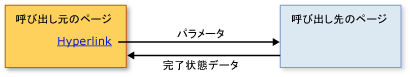

# 構造化ナビゲーションの概要Structured Navigation Overview
コンテンツでホストできますが、 [!INCLUDE[TLA#tla_xbap](../../../../includes/tlasharptla-xbap-md.md)]、 <xref:System.Windows.Controls.Frame>、または<xref:System.Windows.Navigation.NavigationWindow>はパックによって識別できるページで構成されて[!INCLUDE[TLA#tla_uri#plural](../../../../includes/tlasharptla-urisharpplural-md.md)]とハイパーリンクでに移動します。Content that can be hosted by an [!INCLUDE[TLA#tla_xbap](../../../../includes/tlasharptla-xbap-md.md)], a <xref:System.Windows.Controls.Frame>, or a <xref:System.Windows.Navigation.NavigationWindow> is composed of pages that can be identified by pack [!INCLUDE[TLA#tla_uri#plural](../../../../includes/tlasharptla-urisharpplural-md.md)] and navigated to by hyperlinks. ページの構造、およびハイパーリンクで定義される移動方法を、ナビゲーション トポロジと呼びます。The structure of pages and the ways in which they can be navigated, as defined by hyperlinks, is known as a navigation topology. このトポロジはさまざまな種類のアプリケーションに対応しますが、特にドキュメント間を移動するアプリケーションに適しています。Such a topology suits a variety of application types, particularly those that navigate through documents. このようなアプリケーションでは、互いのページの情報を必要とせずに、ユーザーはページ間を移動できます。For such applications, the user can navigate from one page to another page without either page needing to know anything about the other.  
  
 ただし、アプリケーションによっては、移動のタイミングを理解している必要があるページを使用します。However, other types of applications have pages that do need to know when they have been navigated between. たとえば、組織内のすべての従業員を一覧するページ ([従業員の一覧] ページ) を使用する人事アプリケーションがあるものとします。For example, consider a human resources application that has one page to list all the employees in an organization—the "List Employees" page. このページでは、ハイパーリンクをクリックすることによって、新しい従業員を追加することもできます。This page could also allow users to add a new employee by clicking a hyperlink. クリックすると、[従業員の追加] ページに移動して新しい従業員の詳細情報を収集します。次に、それを [従業員の一覧] ページに返して、新しい従業員を作成し、一覧を更新します。When clicked, the page navigates to an "Add an Employee" page to gather the new employee's details and return them to the "List Employees" page to create the new employee and update the list. このスタイルのナビゲーションは、構造化プログラミングと呼ばれる、処理を実行して値を返すメソッドの呼び出しに似ています。This style of navigation is similar to calling a method to perform some processing and return a value, which is known as structured programming. そのため、このスタイルのナビゲーションを、*構造化ナビゲーション*と呼びます。As such, this style of navigation is known as *structured navigation*.  
  
 <xref:System.Windows.Controls.Page>クラスは、構造化されたナビゲーションのサポートを実装していません。The <xref:System.Windows.Controls.Page> class doesn't implement support for structured navigation. 代わりに、<xref:System.Windows.Navigation.PageFunction%601>クラスから派生<xref:System.Windows.Controls.Page>および構造化されたナビゲーションのために必要な基本的な構成要素を拡張します。Instead, the <xref:System.Windows.Navigation.PageFunction%601> class derives from <xref:System.Windows.Controls.Page> and extends it with the basic constructs required for structured navigation. このトピックは、構造化ナビゲーションを使用して確立する方法を示しています。<xref:System.Windows.Navigation.PageFunction%601>です。This topic shows how to establish structured navigation using <xref:System.Windows.Navigation.PageFunction%601>.  
  
 
  
   
## 構造化ナビゲーションStructured Navigation  
 構造化ナビゲーションで、あるページが別のページを呼び出す場合、以下の一部またはすべての動作が必要です。When one page calls another page in a structured navigation, some or all of the following behaviors are required:  
  
-   呼び出し元ページが、必要に応じてパラメーターを渡して、呼び出されたページに移動します。The calling page navigates to the called page, optionally passing parameters required by the called page.  
  
-   ユーザーが呼び出し元ページの使用を終了すると、呼び出されたページは呼び出し元ページに戻ります。このとき、次の動作が行われることがあります。The called page, when a user has completed using the calling page, returns specifically to the calling page, optionally:  
  
    -   呼び出し元ページの終了方法 (ユーザーが [OK] または [キャンセル] をクリックしたかどうかなど) を示す状態情報を返します。Returning state information that describes how the calling page was completed (for example, whether a user pressed an OK button or a Cancel button).  
  
    -   ユーザーから収集したデータ (新しい従業員の詳細など) を返します。Returning that data that was collected from the user (for example, new employee details).  
  
-   呼び出し元ページが、呼び出されたページに戻ると、呼び出されたページはナビゲーション履歴から削除されて、呼び出されたページのインスタンスが他のインスタンスから分離されます。When the calling page returns to the called page, the called page is removed from navigation history to isolate one instance of a called page from another.  
  
 これらの動作を次の図に示します。These behaviors are illustrated by the following figure.  
  
   
  
 使用してこれらの動作を実装することができます、<xref:System.Windows.Navigation.PageFunction%601>として呼び出されるページ。You can implement these behaviors by using a <xref:System.Windows.Navigation.PageFunction%601> as the called page.  
  
   
## PageFunction を使用した構造化ナビゲーションStructured Navigation with PageFunction  
 このトピックは、1 つに関連する構造化されたナビゲーションの基本的なメカニズムを実装する方法を示します<xref:System.Windows.Navigation.PageFunction%601>です。This topic shows how to implement the basic mechanics of structured navigation involving a single <xref:System.Windows.Navigation.PageFunction%601>. このサンプルでは、<xref:System.Windows.Controls.Page>呼び出し、<xref:System.Windows.Navigation.PageFunction%601>を取得する、<xref:System.String>し、ユーザーからの値を返します。In this sample, a <xref:System.Windows.Controls.Page> calls a <xref:System.Windows.Navigation.PageFunction%601> to get a <xref:System.String> value from the user and return it.  
  
### 呼び出し元ページを作成するCreating a Calling Page  
 呼び出すページ、<xref:System.Windows.Navigation.PageFunction%601>のいずれか、<xref:System.Windows.Controls.Page>または<xref:System.Windows.Navigation.PageFunction%601>です。The page that calls a <xref:System.Windows.Navigation.PageFunction%601> can be either a <xref:System.Windows.Controls.Page> or a <xref:System.Windows.Navigation.PageFunction%601>. この例では、<xref:System.Windows.Controls.Page>次のコードに示すように、します。In this example, it is a <xref:System.Windows.Controls.Page>, as shown in the following code.  
  
 [!code-xaml[StructuredNavigationSample#CallingPageDefaultMARKUP1](../../../../samples/snippets/csharp/VS_Snippets_Wpf/StructuredNavigationSample/CSharp/CallingPage.xaml#callingpagedefaultmarkup1)]  
[!code-xaml[StructuredNavigationSample#CallingPageDefaultMARKUP2](../../../../samples/snippets/csharp/VS_Snippets_Wpf/StructuredNavigationSample/CSharp/CallingPage.xaml#callingpagedefaultmarkup2)]  
  
 [!code-csharp[StructuredNavigationSample#CallingPageDefaultCODEBEHIND1](../../../../samples/snippets/csharp/VS_Snippets_Wpf/StructuredNavigationSample/CSharp/CallingPage.xaml.cs#callingpagedefaultcodebehind1)]
 [!code-vb[StructuredNavigationSample#CallingPageDefaultCODEBEHIND1](../../../../samples/snippets/visualbasic/VS_Snippets_Wpf/StructuredNavigationSample/VisualBasic/CallingPage.xaml.vb#callingpagedefaultcodebehind1)]  
[!code-csharp[StructuredNavigationSample#CallingPageDefaultCODEBEHIND2](../../../../samples/snippets/csharp/VS_Snippets_Wpf/StructuredNavigationSample/CSharp/CallingPage.xaml.cs#callingpagedefaultcodebehind2)]
[!code-vb[StructuredNavigationSample#CallingPageDefaultCODEBEHIND2](../../../../samples/snippets/visualbasic/VS_Snippets_Wpf/StructuredNavigationSample/VisualBasic/CallingPage.xaml.vb#callingpagedefaultcodebehind2)]  
[!code-csharp[StructuredNavigationSample#CallingPageDefaultCODEBEHIND3](../../../../samples/snippets/csharp/VS_Snippets_Wpf/StructuredNavigationSample/CSharp/CallingPage.xaml.cs#callingpagedefaultcodebehind3)]
[!code-vb[StructuredNavigationSample#CallingPageDefaultCODEBEHIND3](../../../../samples/snippets/visualbasic/VS_Snippets_Wpf/StructuredNavigationSample/VisualBasic/CallingPage.xaml.vb#callingpagedefaultcodebehind3)]  
  
### 呼び出すページ関数を作成するCreating a Page Function to Call  
 呼び出し元のページが呼び出されるページを使用して収集して、ユーザーからデータを返すため<xref:System.Windows.Navigation.PageFunction%601>呼び出されるページから返される値の型を指定する型引数を持つジェネリックのクラスとして実装されます。Because the calling page can use the called page to collect and return data from the user, <xref:System.Windows.Navigation.PageFunction%601> is implemented as a generic class whose type argument specifies the type of the value that the called page will return. 次のコードが呼び出されるは、最初の実装を示しています ページを使用して、 <xref:System.Windows.Navigation.PageFunction%601>、返された、<xref:System.String>です。The following code shows the initial implementation of the called page, using a <xref:System.Windows.Navigation.PageFunction%601>, which returns a <xref:System.String>.  
  
 [!code-xaml[StructuredNavigationSample#CalledPageFunctionMARKUP](../../../../samples/snippets/csharp/VS_Snippets_Wpf/StructuredNavigationSample/CSharp/CalledPageFunction.xaml#calledpagefunctionmarkup)]  
  
 [!code-csharp[StructuredNavigationSample#CalledPageFunctionCODEBEHIND1](../../../../samples/snippets/csharp/VS_Snippets_Wpf/StructuredNavigationSample/CSharp/CalledPageFunction.xaml.cs#calledpagefunctioncodebehind1)]
 [!code-vb[StructuredNavigationSample#CalledPageFunctionCODEBEHIND1](../../../../samples/snippets/visualbasic/VS_Snippets_Wpf/StructuredNavigationSample/VisualBasic/CalledPageFunction.xaml.vb#calledpagefunctioncodebehind1)]  
[!code-csharp[StructuredNavigationSample#CalledPageFunctionCODEBEHIND2](../../../../samples/snippets/csharp/VS_Snippets_Wpf/StructuredNavigationSample/CSharp/CalledPageFunction.xaml.cs#calledpagefunctioncodebehind2)]
[!code-vb[StructuredNavigationSample#CalledPageFunctionCODEBEHIND2](../../../../samples/snippets/visualbasic/VS_Snippets_Wpf/StructuredNavigationSample/VisualBasic/CalledPageFunction.xaml.vb#calledpagefunctioncodebehind2)]  
  
 宣言、<xref:System.Windows.Navigation.PageFunction%601>の宣言に似ていますが、<xref:System.Windows.Controls.Page>に型引数を追加します。The declaration of a <xref:System.Windows.Navigation.PageFunction%601> is similar to the declaration of a <xref:System.Windows.Controls.Page> with the addition of the type arguments. コード例に示されているように、[!INCLUDE[TLA2#tla_xaml](../../../../includes/tla2sharptla-xaml-md.md)] マークアップ (`x:TypeArguments` 属性を使用) と分離コード (標準のジェネリック型引数構文を使用) の両方で型引数が指定されています。As you can see from the code example, the type arguments are specified in both [!INCLUDE[TLA2#tla_xaml](../../../../includes/tla2sharptla-xaml-md.md)] markup, using the `x:TypeArguments` attribute, and code-behind, using standard generic type argument syntax.  
  
 型引数として [!INCLUDE[dnprdnshort](../../../../includes/dnprdnshort-md.md)] クラスのみを使用する必要はありません。You don't have to use only [!INCLUDE[dnprdnshort](../../../../includes/dnprdnshort-md.md)] classes as type arguments. A<xref:System.Windows.Navigation.PageFunction%601>抽象化して、カスタム データ型としてドメイン固有のデータを収集するために呼び出すことができます。A <xref:System.Windows.Navigation.PageFunction%601> could be called to gather domain-specific data that is abstracted as a custom type. 次のコードは、カスタム型に対して、型引数として使用する方法を示します、<xref:System.Windows.Navigation.PageFunction%601>です。The following code shows how to use a custom type as a type argument for a <xref:System.Windows.Navigation.PageFunction%601>.  
  
 [!code-csharp[CustomTypePageFunctionSnippets#CustomTypeCODE1](../../../../samples/snippets/csharp/VS_Snippets_Wpf/CustomTypePageFunctionSnippets/CSharp/CustomType.cs#customtypecode1)]
 [!code-vb[CustomTypePageFunctionSnippets#CustomTypeCODE1](../../../../samples/snippets/visualbasic/VS_Snippets_Wpf/CustomTypePageFunctionSnippets/VisualBasic/CustomType.vb#customtypecode1)]  
[!code-csharp[CustomTypePageFunctionSnippets#CustomTypeCODE2](../../../../samples/snippets/csharp/VS_Snippets_Wpf/CustomTypePageFunctionSnippets/CSharp/CustomType.cs#customtypecode2)]
[!code-vb[CustomTypePageFunctionSnippets#CustomTypeCODE2](../../../../samples/snippets/visualbasic/VS_Snippets_Wpf/CustomTypePageFunctionSnippets/VisualBasic/CustomType.vb#customtypecode2)]  
  
 [!code-xaml[CustomTypePageFunctionSnippets#CustomTypePageFunctionMARKUP1](../../../../samples/snippets/csharp/VS_Snippets_Wpf/CustomTypePageFunctionSnippets/CSharp/CustomTypePageFunction.xaml#customtypepagefunctionmarkup1)]  
[!code-xaml[CustomTypePageFunctionSnippets#CustomTypePageFunctionMARKUP2](../../../../samples/snippets/csharp/VS_Snippets_Wpf/CustomTypePageFunctionSnippets/CSharp/CustomTypePageFunction.xaml#customtypepagefunctionmarkup2)]  
  
 [!code-csharp[CustomTypePageFunctionSnippets#CustomTypePageFunctionCODEBEHIND1](../../../../samples/snippets/csharp/VS_Snippets_Wpf/CustomTypePageFunctionSnippets/CSharp/CustomTypePageFunction.xaml.cs#customtypepagefunctioncodebehind1)]
 [!code-vb[CustomTypePageFunctionSnippets#CustomTypePageFunctionCODEBEHIND1](../../../../samples/snippets/visualbasic/VS_Snippets_Wpf/CustomTypePageFunctionSnippets/VisualBasic/CustomTypePageFunction.xaml.vb#customtypepagefunctioncodebehind1)]  
[!code-csharp[CustomTypePageFunctionSnippets#CustomTypePageFunctionCODEBEHIND2](../../../../samples/snippets/csharp/VS_Snippets_Wpf/CustomTypePageFunctionSnippets/CSharp/CustomTypePageFunction.xaml.cs#customtypepagefunctioncodebehind2)]
[!code-vb[CustomTypePageFunctionSnippets#CustomTypePageFunctionCODEBEHIND2](../../../../samples/snippets/visualbasic/VS_Snippets_Wpf/CustomTypePageFunctionSnippets/VisualBasic/CustomTypePageFunction.xaml.vb#customtypepagefunctioncodebehind2)]  
  
 型引数、<xref:System.Windows.Navigation.PageFunction%601>呼び出し元のページと呼び出し先 ページで、次のセクションで説明する間の通信の基盤を提供します。The type arguments for the <xref:System.Windows.Navigation.PageFunction%601> provide the foundation for the communication between a calling page and the called page, which are discussed in the following sections.  
  
 おわかりの宣言で識別される型と、<xref:System.Windows.Navigation.PageFunction%601>からデータを返すときに重要な役割を果たす、<xref:System.Windows.Navigation.PageFunction%601>呼び出し元のページにします。As you'll see, the type that is identified with the declaration of a <xref:System.Windows.Navigation.PageFunction%601> plays an important role in returning data from a <xref:System.Windows.Navigation.PageFunction%601> to the calling page.  
  
### PageFunction を呼び出してパラメーターを渡すCalling a PageFunction and Passing Parameters  
 ページを呼び出すには、呼び出し元のページする必要があります呼び出されるページのインスタンスを作成しを使用して移動、<xref:System.Windows.Navigation.NavigationService.Navigate%2A>メソッドです。To call a page, the calling page must instantiate the called page and navigate to it using the <xref:System.Windows.Navigation.NavigationService.Navigate%2A> method. これにより、呼び出し元ページは、呼び出されるページで収集されるデータの既定値など、呼び出されるページに初期データを渡すことができます。This allows the calling page to pass initial data to the called page, such as default values for the data being gathered by the called page.  
  
 既定以外のコンストラクターを使用して呼び出されたページが、呼び出し元ページからパラメーターを受け取るコードを次に示します。The following code shows the called page with a non-default constructor to accept parameters from the calling page.  
  
 [!code-csharp[StructuredNavigationSample#AcceptsInitialDataCODEBEHIND1](../../../../samples/snippets/csharp/VS_Snippets_Wpf/StructuredNavigationSample/CSharp/CalledPageFunction.xaml.cs#acceptsinitialdatacodebehind1)]
 [!code-vb[StructuredNavigationSample#AcceptsInitialDataCODEBEHIND1](../../../../samples/snippets/visualbasic/VS_Snippets_Wpf/StructuredNavigationSample/VisualBasic/CalledPageFunction.xaml.vb#acceptsinitialdatacodebehind1)]  
[!code-csharp[StructuredNavigationSample#AcceptsInitialDataCODEBEHIND2](../../../../samples/snippets/csharp/VS_Snippets_Wpf/StructuredNavigationSample/CSharp/CalledPageFunction.xaml.cs#acceptsinitialdatacodebehind2)]
[!code-vb[StructuredNavigationSample#AcceptsInitialDataCODEBEHIND2](../../../../samples/snippets/visualbasic/VS_Snippets_Wpf/StructuredNavigationSample/VisualBasic/CalledPageFunction.xaml.vb#acceptsinitialdatacodebehind2)]  
[!code-csharp[StructuredNavigationSample#AcceptsInitialDataCODEBEHIND3](../../../../samples/snippets/csharp/VS_Snippets_Wpf/StructuredNavigationSample/CSharp/CalledPageFunction.xaml.cs#acceptsinitialdatacodebehind3)]
[!code-vb[StructuredNavigationSample#AcceptsInitialDataCODEBEHIND3](../../../../samples/snippets/visualbasic/VS_Snippets_Wpf/StructuredNavigationSample/VisualBasic/CalledPageFunction.xaml.vb#acceptsinitialdatacodebehind3)]  
[!code-csharp[StructuredNavigationSample#AcceptsInitialDataCODEBEHIND4](../../../../samples/snippets/csharp/VS_Snippets_Wpf/StructuredNavigationSample/CSharp/CalledPageFunction.xaml.cs#acceptsinitialdatacodebehind4)]
[!code-vb[StructuredNavigationSample#AcceptsInitialDataCODEBEHIND4](../../../../samples/snippets/visualbasic/VS_Snippets_Wpf/StructuredNavigationSample/VisualBasic/CalledPageFunction.xaml.vb#acceptsinitialdatacodebehind4)]  
  
 次のコードは呼び出し元のページ処理、<xref:System.Windows.Documents.Hyperlink.Click>のイベント、<xref:System.Windows.Documents.Hyperlink>呼び出されるページをインスタンス化し、最初の文字列値を渡します。The following code shows the calling page handling the <xref:System.Windows.Documents.Hyperlink.Click> event of the <xref:System.Windows.Documents.Hyperlink> to instantiate the called page and pass it an initial string value.  
  
 [!code-xaml[StructuredNavigationSample#PassingDataMARKUP2](../../../../samples/snippets/csharp/VS_Snippets_Wpf/StructuredNavigationSample/CSharp/CallingPage.xaml#passingdatamarkup2)]  
[!code-csharp[StructuredNavigationSample#PassingDataCODEBEHIND1](../../../../samples/snippets/csharp/VS_Snippets_Wpf/StructuredNavigationSample/CSharp/CallingPage.xaml.cs#passingdatacodebehind1)]
[!code-vb[StructuredNavigationSample#PassingDataCODEBEHIND1](../../../../samples/snippets/visualbasic/VS_Snippets_Wpf/StructuredNavigationSample/VisualBasic/CallingPage.xaml.vb#passingdatacodebehind1)]  
[!code-csharp[StructuredNavigationSample#PassingDataCODEBEHIND2](../../../../samples/snippets/csharp/VS_Snippets_Wpf/StructuredNavigationSample/CSharp/CallingPage.xaml.cs#passingdatacodebehind2)]
[!code-vb[StructuredNavigationSample#PassingDataCODEBEHIND2](../../../../samples/snippets/visualbasic/VS_Snippets_Wpf/StructuredNavigationSample/VisualBasic/CallingPage.xaml.vb#passingdatacodebehind2)]  
[!code-csharp[StructuredNavigationSample#PassingDataCODEBEHIND3](../../../../samples/snippets/csharp/VS_Snippets_Wpf/StructuredNavigationSample/CSharp/CallingPage.xaml.cs#passingdatacodebehind3)]
[!code-vb[StructuredNavigationSample#PassingDataCODEBEHIND3](../../../../samples/snippets/visualbasic/VS_Snippets_Wpf/StructuredNavigationSample/VisualBasic/CallingPage.xaml.vb#passingdatacodebehind3)]  
  
 呼び出されるページにパラメーターを渡す必要はありません。You are not required to pass parameters to the called page. 代わりに、以下を実行できます。Instead, you could do the following:  
  
-   呼び出し元ページの場合:From the calling page:  
  
    1.  インスタンス化、呼び出された<xref:System.Windows.Navigation.PageFunction%601>既定コンス トラクターを使用します。Instantiate the called <xref:System.Windows.Navigation.PageFunction%601> using the default constructor.  
  
    2.  内のパラメーターを格納<xref:System.Windows.Application.Properties%2A>です。Store the parameters in <xref:System.Windows.Application.Properties%2A>.  
  
    3.  呼び出したへ移動<xref:System.Windows.Navigation.PageFunction%601>です。Navigate to the called <xref:System.Windows.Navigation.PageFunction%601>.  
  
-   呼び出されるから<xref:System.Windows.Navigation.PageFunction%601>:From the called <xref:System.Windows.Navigation.PageFunction%601>:  
  
    -   取得しに格納されているパラメーターを使用して<xref:System.Windows.Application.Properties%2A>です。Retrieve and use the parameters stored in <xref:System.Windows.Application.Properties%2A>.  
  
 しかし、この後の説明にもあるように、コードを使用して呼び出されたページをインスタンス化して、そのページに移動して、呼び出されたページから返されるデータを収集する必要が依然としてあります。But, as you'll see shortly, you'll still need use code to instantiate and navigate to the called page to collect the data returned by the called page. このため、<xref:System.Windows.Navigation.PageFunction%601>に移動するそれ以外のアライブを保持する必要があります、次回、 <xref:System.Windows.Navigation.PageFunction%601>、[!INCLUDE[TLA2#tla_wpf](../../../../includes/tla2sharptla-wpf-md.md)]をインスタンス化、<xref:System.Windows.Navigation.PageFunction%601>既定コンス トラクターを使用します。For this reason, the <xref:System.Windows.Navigation.PageFunction%601> needs to be kept alive; otherwise, the next time you navigate to the <xref:System.Windows.Navigation.PageFunction%601>, [!INCLUDE[TLA2#tla_wpf](../../../../includes/tla2sharptla-wpf-md.md)] instantiates the <xref:System.Windows.Navigation.PageFunction%601> using the default constructor.  
  
 ただし、呼び出されたページが戻る前に、呼び出し元ページが取得できるデータを返す必要があります。Before the called page can return, however, it needs to return data that can be retrieved by the calling page.  
  
### タスクから呼び出し元ページにタスク結果とタスク データを返すReturning Task Result and Task Data from a Task to a Calling Page  
 ユーザーが呼び出されたページの使用を終了すると (この例では、[OK] または [キャンセル] をクリックすることで表されます)、呼び出されたページは戻る必要があります。Once the user has finished using the called page, signified in this example by pressing either the OK or Cancel buttons, the called page needs to return. 呼び出し元ページは、呼び出されたページを使用してユーザーからデータを収集したため、呼び出し元ページには 2 種類の情報が必要です。Since the calling page used the called page to collect data from the user, the calling page requires two types of information:  
  
1.  ユーザーが呼び出されたページをキャンセルしたかどうか (この例では、[OK] と [キャンセル] のどちらをクリックしたかで表されます)。Whether the user canceled the called page (by pressing either the OK button or the Cancel button in this example). これによって、呼び出し元ページは、ユーザーから収集したデータを処理するかどうかを判断します。This allows the calling page to determine whether to process the data that the calling page gathered from the user.  
  
2.  ユーザーが提供したデータ。The data that was provided by the user.  
  
 情報を取得する<xref:System.Windows.Navigation.PageFunction%601>を実装する、<xref:System.Windows.Navigation.PageFunction%601.OnReturn%2A>メソッドです。To return information, <xref:System.Windows.Navigation.PageFunction%601> implements the <xref:System.Windows.Navigation.PageFunction%601.OnReturn%2A> method. その呼び出し方法を次のコードに示します。The following code shows how to call it.  
  
 [!code-csharp[StructuredNavigationSample#ReturnCODEBEHIND1](../../../../samples/snippets/csharp/VS_Snippets_Wpf/StructuredNavigationSample/CSharp/CalledPageFunction.xaml.cs#returncodebehind1)]
 [!code-vb[StructuredNavigationSample#ReturnCODEBEHIND1](../../../../samples/snippets/visualbasic/VS_Snippets_Wpf/StructuredNavigationSample/VisualBasic/CalledPageFunction.xaml.vb#returncodebehind1)]  
[!code-csharp[StructuredNavigationSample#ReturnCODEBEHIND2](../../../../samples/snippets/csharp/VS_Snippets_Wpf/StructuredNavigationSample/CSharp/CalledPageFunction.xaml.cs#returncodebehind2)]
[!code-vb[StructuredNavigationSample#ReturnCODEBEHIND2](../../../../samples/snippets/visualbasic/VS_Snippets_Wpf/StructuredNavigationSample/VisualBasic/CalledPageFunction.xaml.vb#returncodebehind2)]  
  
 この例では、ユーザーが [キャンセル] をクリックすると、呼び出し元ページに値 `null` が返されます。In this example, if a user presses the Cancel button, a value of `null` is returned to the calling page. ユーザーが [OK] をクリックすると、ユーザーによって指定された文字列値が返されます。If the OK button is pressed instead, the string value provided by the user is returned. <xref:System.Windows.Navigation.PageFunction%601.OnReturn%2A>`protected``virtual`データを返す、呼び出し元のページに呼び出すメソッド。<xref:System.Windows.Navigation.PageFunction%601.OnReturn%2A> is a `protected``virtual` method that you call to return your data to the calling page. ジェネリックのインスタンスにパッケージ化する必要があるデータ<xref:System.Windows.Navigation.ReturnEventArgs%601>、型引数の型を指定する、型の値を<xref:System.Windows.Navigation.ReturnEventArgs%601.Result%2A>を返します。Your data needs to be packaged in an instance of the generic <xref:System.Windows.Navigation.ReturnEventArgs%601> type, whose type argument specifies the type of value that <xref:System.Windows.Navigation.ReturnEventArgs%601.Result%2A> returns. 宣言するときに、この方法で、<xref:System.Windows.Navigation.PageFunction%601>特定の型引数を指定して、ことを示すは、<xref:System.Windows.Navigation.PageFunction%601>は型引数で指定されている型のインスタンスを返します。In this way, when you declare a <xref:System.Windows.Navigation.PageFunction%601> with a particular type argument, you are stating that a <xref:System.Windows.Navigation.PageFunction%601> will return an instance of the type that is specified by the type argument. この例では、型引数と、その結果、戻り値が型で<xref:System.String>です。In this example, the type argument and, consequently, the return value is of type <xref:System.String>.  
  
 ときに<xref:System.Windows.Navigation.PageFunction%601.OnReturn%2A>が呼び出されると、呼び出し元のページは何らかの戻り値を受け取る、<xref:System.Windows.Navigation.PageFunction%601>です。When <xref:System.Windows.Navigation.PageFunction%601.OnReturn%2A> is called, the calling page needs some way of receiving the return value of the <xref:System.Windows.Navigation.PageFunction%601>. このため、<xref:System.Windows.Navigation.PageFunction%601>を実装する、<xref:System.Windows.Navigation.PageFunction%601.Return>イベントを処理するページを呼び出すためです。For this reason, <xref:System.Windows.Navigation.PageFunction%601> implements the <xref:System.Windows.Navigation.PageFunction%601.Return> event for calling pages to handle. ときに<xref:System.Windows.Navigation.PageFunction%601.OnReturn%2A>が呼び出されると、<xref:System.Windows.Navigation.PageFunction%601.Return>が発生すると、呼び出し元のページに登録できるように<xref:System.Windows.Navigation.PageFunction%601.Return>通知を受信します。When <xref:System.Windows.Navigation.PageFunction%601.OnReturn%2A> is called, <xref:System.Windows.Navigation.PageFunction%601.Return> is raised, so the calling page can register with <xref:System.Windows.Navigation.PageFunction%601.Return> to receive the notification.  
  
 [!code-csharp[StructuredNavigationSample#ProcessResultCODEBEHIND1](../../../../samples/snippets/csharp/VS_Snippets_Wpf/StructuredNavigationSample/CSharp/CallingPage.xaml.cs#processresultcodebehind1)]
 [!code-vb[StructuredNavigationSample#ProcessResultCODEBEHIND1](../../../../samples/snippets/visualbasic/VS_Snippets_Wpf/StructuredNavigationSample/VisualBasic/CallingPage.xaml.vb#processresultcodebehind1)]  
[!code-csharp[StructuredNavigationSample#ProcessResultCODEBEHIND2](../../../../samples/snippets/csharp/VS_Snippets_Wpf/StructuredNavigationSample/CSharp/CallingPage.xaml.cs#processresultcodebehind2)]
[!code-vb[StructuredNavigationSample#ProcessResultCODEBEHIND2](../../../../samples/snippets/visualbasic/VS_Snippets_Wpf/StructuredNavigationSample/VisualBasic/CallingPage.xaml.vb#processresultcodebehind2)]  
  
### タスク完了時にタスク ページを削除するRemoving Task Pages When a Task Completes  
 呼び出されたページが戻り、呼び出されたページをユーザーが取り消さなかった場合、呼び出し元ページでは、ユーザーから提供されたデータだけでなく、呼び出されたページから返されたデータも処理します。When a called page returns, and the user didn't cancel the called page, the calling page will process the data that was provided by the user and also returned from the called page. このような方法で行われるデータ取得は、通常は分離されたアクティビティです。呼び出されたページが戻ると、呼び出し元ページでは、さらにデータをキャプチャするために、新しい呼び出し元ページを作成し、そこに移動する必要があります。Data acquisition in this way is usually an isolated activity; when the called page returns, the calling page needs to create and navigate to a new calling page to capture more data.  
  
 ただし、呼び出されたページが履歴から削除されない限り、ユーザーは呼び出し元ページの前のインスタンスに戻ることができます。However, unless a called page is removed from the journal, a user will be able to navigate back to a previous instance of the calling page. かどうか、<xref:System.Windows.Navigation.PageFunction%601>に保持されますが、ジャーナルはによって決定されます、<xref:System.Windows.Navigation.PageFunctionBase.RemoveFromJournal%2A>プロパティです。Whether a <xref:System.Windows.Navigation.PageFunction%601> is retained in the journal is determined by the <xref:System.Windows.Navigation.PageFunctionBase.RemoveFromJournal%2A> property. 既定では、ページ関数は、自動的に削除<xref:System.Windows.Navigation.PageFunction%601.OnReturn%2A>ためにと呼ばれます<xref:System.Windows.Navigation.PageFunctionBase.RemoveFromJournal%2A>に設定されている`true`です。By default, a page function is automatically removed when <xref:System.Windows.Navigation.PageFunction%601.OnReturn%2A> is called because <xref:System.Windows.Navigation.PageFunctionBase.RemoveFromJournal%2A> is set to `true`. ナビゲーション履歴の後にページ関数を保持する<xref:System.Windows.Navigation.PageFunction%601.OnReturn%2A>が呼び出されると、設定<xref:System.Windows.Navigation.PageFunctionBase.RemoveFromJournal%2A>に`false`です。To keep a page function in navigation history after <xref:System.Windows.Navigation.PageFunction%601.OnReturn%2A> is called, set <xref:System.Windows.Navigation.PageFunctionBase.RemoveFromJournal%2A> to `false`.  
  
   
## 他の種類の構造化ナビゲーションOther Types of Structured Navigation  
 このトピックの最も基本的な使用を示しています、  <xref:System.Windows.Navigation.PageFunction%601> /戻り値の呼び出しをサポートするために、ナビゲーションを構造化します。This topic illustrates the most basic use of a <xref:System.Windows.Navigation.PageFunction%601> to support call/return structured navigation. これに基づいて、より複雑な構造化ナビゲーションを作成できます。This foundation provides you with the ability to create more complex types of structured navigation.  
  
 たとえば、呼び出し元ページがユーザーから十分なデータを収集したり、タスクを実行するには、複数のページが必要な場合があります。For example, sometimes multiple pages are required by a calling page to gather enough data from a user or to perform a task. 複数のページを使用する場合、これを "ウィザード" と呼びます。The use of multiple pages is referred to as a "wizard".  
  
 また、構造化ナビゲーションに基づいて効率的な操作を実行する複雑なナビゲーション トポロジを使用するアプリケーションもあります。In other cases, applications may have complex navigation topologies that depend on structured navigation to operate effectively. 詳細については、「[ナビゲーション トポロジの概要](../../../../docs/framework/wpf/app-development/navigation-topologies-overview.md)」を参照してください。For more information, see [Navigation Topologies Overview](../../../../docs/framework/wpf/app-development/navigation-topologies-overview.md).  
  
## 参照See Also  
 <xref:System.Windows.Navigation.PageFunction%601>  
 <xref:System.Windows.Navigation.NavigationService>  
 [ナビゲーション トポロジの概要Navigation Topologies Overview](../../../../docs/framework/wpf/app-development/navigation-topologies-overview.md)
