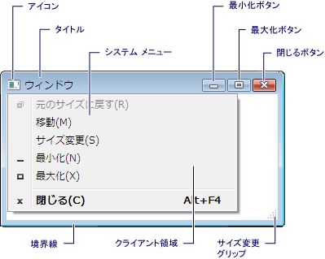
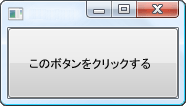
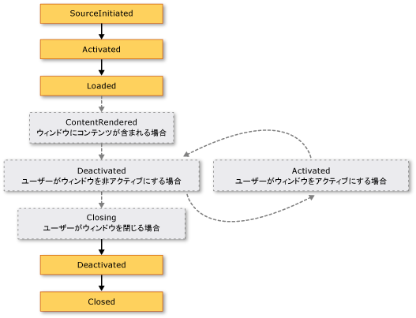
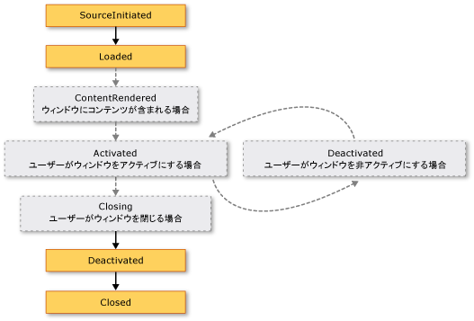

# <a name="wpf-windows-overview"></a>WPF ウィンドウの概要
ユーザーは、windows で Windows Presentation Foundation (WPF) スタンドアロン アプリケーションと対話します。 ウィンドウの主な目的は、データを視覚化してユーザーがデータと対話できるコンテンツをホストすることです。 スタンドアロン[!INCLUDE[TLA2#tla_wpf](../../../../includes/tla2sharptla-wpf-md.md)]アプリケーションを使用して、独自の windows を提供する、<xref:System.Windows.Window>クラスです。 このトピックで紹介<xref:System.Windows.Window>を作成して、スタンドアロン アプリケーションで windows の管理の基礎を紹介します。  
  
> [!NOTE]
>  ブラウザーによってホストされる[!INCLUDE[TLA2#tla_wpf](../../../../includes/tla2sharptla-wpf-md.md)]など、アプリケーション[!INCLUDE[TLA#tla_xbap#plural](../../../../includes/tlasharptla-xbapsharpplural-md.md)]厳密でないと[!INCLUDE[TLA#tla_xaml](../../../../includes/tlasharptla-xaml-md.md)]ページは、独自の windows で提供されません。 代わりに、によって提供されるウィンドウでホストされている[!INCLUDE[TLA#tla_iegeneric](../../../../includes/tlasharptla-iegeneric-md.md)]です。 参照してください[WPF XAML ブラウザー アプリケーションの概要](../../../../docs/framework/wpf/app-development/wpf-xaml-browser-applications-overview.md)です。  
  
  
<a name="TheWindowClass"></a>   
## <a name="the-window-class"></a>ウィンドウ クラス  
 次の図は、ウィンドウの構成パーツを示しています。  
  
   
  
 ウィンドウは、非クライアント領域とクライアント領域の 2 つに分かれます。  
  
 *非クライアント領域*ウィンドウのによって実装されて[!INCLUDE[TLA2#tla_wpf](../../../../includes/tla2sharptla-wpf-md.md)]と、次を含む、ほとんどの windows に共通のウィンドウの部分が含まれています。  
  
-   境界線。  
  
-   タイトル バー。  
  
-   アイコン。  
  
-   最小化ボタン、最大化ボタン、および元に戻すボタン。  
  
-   閉じるボタン。  
  
-   ウィンドウを最小化、最大化、元のサイズに戻す、移動、サイズ変更、および閉じるためのメニュー項目を含むシステム メニュー。  
  
 *クライアント領域*ウィンドウのウィンドウの非クライアント領域内の領域は、メニュー バー、ツール バー コントロールなどのアプリケーション固有のコンテンツを追加する開発者によって使用されます。  
  
 [!INCLUDE[TLA2#tla_wpf](../../../../includes/tla2sharptla-wpf-md.md)]、ウィンドウがによってカプセル化、<xref:System.Windows.Window>次の操作に使用するクラスです。  
  
-   ウィンドウを表示する。  
  
-   ウィンドウのサイズ、位置、および外観を構成する。  
  
-   アプリケーション固有のコンテンツをホストする。  
  
-   ウィンドウの有効期間を管理する。  
  
<a name="DefiningAWindow"></a>   
## <a name="implementing-a-window"></a>ウィンドウの実装  
 一般的なウィンドウの実装は、外観と動作の両方で構成されますここで*外観*をユーザーに、ウィンドウの外観を定義および*動作*ユーザー対話状態ウィンドウの機能方法を定義。関連付けします。 [!INCLUDE[TLA2#tla_wpf](../../../../includes/tla2sharptla-wpf-md.md)]外観を実装することができを使用してウィンドウの動作をコーディングするか、または[!INCLUDE[TLA2#tla_xaml](../../../../includes/tla2sharptla-xaml-md.md)]マークアップ。  
  
 一般に、ただし、ウィンドウの外観は実装を使用して[!INCLUDE[TLA2#tla_xaml](../../../../includes/tla2sharptla-xaml-md.md)]マークアップ、およびその動作は実装されている分離コードを使用して次の例で示すようにします。  
  
 [!code-xaml[WindowsOverviewSnippets#MarkupAndCodeBehindWindowMARKUP](../../../../samples/snippets/csharp/VS_Snippets_Wpf/WindowsOverviewSnippets/CSharp/MarkupAndCodeBehindWindow.xaml#markupandcodebehindwindowmarkup)]  
  
 [!code-csharp[WindowsOverviewSnippets#MarkupAndCodeBehindWindowCODEBEHIND](../../../../samples/snippets/csharp/VS_Snippets_Wpf/WindowsOverviewSnippets/CSharp/MarkupAndCodeBehindWindow.xaml.cs#markupandcodebehindwindowcodebehind)]
 [!code-vb[WindowsOverviewSnippets#MarkupAndCodeBehindWindowCODEBEHIND](../../../../samples/snippets/visualbasic/VS_Snippets_Wpf/WindowsOverviewSnippets/VisualBasic/MarkupAndCodeBehindWindow.xaml.vb#markupandcodebehindwindowcodebehind)]  
  
 有効にする、[!INCLUDE[TLA2#tla_xaml](../../../../includes/tla2sharptla-xaml-md.md)]マークアップ ファイルと連携して動作する分離コード ファイルに、次は、必要な。  
  
-   マークアップで、`Window`要素を含める必要があります、`x:Class`属性。 アプリケーションのビルド時の存在`x:Class`マークアップ ファイルが原因となって[!INCLUDE[TLA#tla_msbuild](../../../../includes/tlasharptla-msbuild-md.md)]を作成する、`partial`から派生したクラス<xref:System.Windows.Window>によって指定される名前を持つ、`x:Class`属性。 追加が必要です、[!INCLUDE[TLA2#tla_xml](../../../../includes/tla2sharptla-xml-md.md)]の名前空間宣言、[!INCLUDE[TLA2#tla_xaml](../../../../includes/tla2sharptla-xaml-md.md)]スキーマ ( `xmlns:x="http://schemas.microsoft.com/winfx/2006/xaml"` )。 生成された`partial`クラスが実装する、`InitializeComponent`メソッド、イベントを登録し、マークアップに実装されているプロパティを設定すると呼ばれます。  
  
-   分離コード クラスがある必要があります、`partial`によって指定される同じ名前のクラス、`x:Class`マークアップ、およびその属性がから派生する必要があります<xref:System.Windows.Window>です。 これにより、分離コード ファイルに関連付けられる、`partial`アプリケーションのビルド時に、マークアップ ファイルに対して生成されるクラス (を参照してください[WPF アプリケーションのビルド](../../../../docs/framework/wpf/app-development/building-a-wpf-application-wpf.md))。  
  
-   分離コードで、<xref:System.Windows.Window>クラスは、呼び出すコンス トラクターを実装する必要があります、`InitializeComponent`メソッドです。 `InitializeComponent` 実装ファイルの生成されたマークアップで`partial`イベントを登録し、マークアップで定義されているプロパティを設定するクラス。  
  
> [!NOTE]
>  新しいを追加すると<xref:System.Windows.Window>を使用してプロジェクトに[!INCLUDE[TLA#tla_visualstu](../../../../includes/tlasharptla-visualstu-md.md)]、<xref:System.Windows.Window>マークアップと分離コードの両方を使用して実装され、としてマークアップおよび分離コード ファイル間の関連付けを作成するために必要な構成が含まれていますここで説明します。  
  
 この構成は、ウィンドウの外観を定義するのに集中できます[!INCLUDE[TLA2#tla_xaml](../../../../includes/tla2sharptla-xaml-md.md)]マークアップと分離コードでその動作を実装します。 次の例とで実装された、ボタン、ウィンドウ[!INCLUDE[TLA2#tla_xaml](../../../../includes/tla2sharptla-xaml-md.md)]マークアップ、およびボタンのイベント ハンドラー<xref:System.Windows.Controls.Primitives.ButtonBase.Click>イベント、分離コードで実装します。  
  
 [!code-xaml[WindowsOverviewWindowWithButtonSnippets#MarkupAndCodeBehindWindowMARKUP](../../../../samples/snippets/csharp/VS_Snippets_Wpf/WindowsOverviewWindowWithButtonSnippets/CSharp/MarkupAndCodeBehindWindow.xaml#markupandcodebehindwindowmarkup)]  
  
 [!code-csharp[WindowsOverviewWindowWithButtonSnippets#MarkupAndCodeBehindWindowCODEBEHIND](../../../../samples/snippets/csharp/VS_Snippets_Wpf/WindowsOverviewWindowWithButtonSnippets/CSharp/MarkupAndCodeBehindWindow.xaml.cs#markupandcodebehindwindowcodebehind)]
 [!code-vb[WindowsOverviewWindowWithButtonSnippets#MarkupAndCodeBehindWindowCODEBEHIND](../../../../samples/snippets/visualbasic/VS_Snippets_Wpf/WindowsOverviewWindowWithButtonSnippets/VisualBasic/MarkupAndCodeBehindWindow.xaml.vb#markupandcodebehindwindowcodebehind)]  
  
<a name="ConfiguringWindowForMSBuild"></a>   
## <a name="configuring-a-window-definition-for-msbuild"></a>MSBuild 用のウィンドウ定義の構成  
 構成方法、ウィンドウを実装する方法を決定[!INCLUDE[TLA2#tla_msbuild](../../../../includes/tla2sharptla-msbuild-md.md)]です。 両方を使用して定義されているウィンドウの[!INCLUDE[TLA2#tla_xaml](../../../../includes/tla2sharptla-xaml-md.md)]マークアップと分離コード。  
  
-   [!INCLUDE[TLA2#tla_xaml](../../../../includes/tla2sharptla-xaml-md.md)] として構成されているマークアップ ファイル[!INCLUDE[TLA2#tla_msbuild](../../../../includes/tla2sharptla-msbuild-md.md)]`Page`項目。  
  
-   分離コード ファイルとして構成されている[!INCLUDE[TLA2#tla_msbuild](../../../../includes/tla2sharptla-msbuild-md.md)]`Compile`項目。  
  
 これは、次に示すは[!INCLUDE[TLA2#tla_msbuild](../../../../includes/tla2sharptla-msbuild-md.md)]プロジェクト ファイルです。  
  
```xml  
<Project ...  
                xmlns="http://schemas.microsoft.com/developer/msbuild/2003">  
    ...  
    <Page Include="MarkupAndCodeBehindWindow.xaml" />  
    <Compile Include=" MarkupAndCodeBehindWindow.xaml.cs" />  
    ...  
</Project>  
```  
  
 ビルドについて[!INCLUDE[TLA2#tla_wpf](../../../../includes/tla2sharptla-wpf-md.md)]アプリケーションを参照してください[WPF アプリケーションのビルド](../../../../docs/framework/wpf/app-development/building-a-wpf-application-wpf.md)です。  
  
<a name="WindowLifetime"></a>   
## <a name="window-lifetime"></a>ウィンドウの有効期間  
 クラスと同様に、ウィンドウにも有効期間があります。有効期間は、ウィンドウが開いて最初にインスタンス化されたときに開始し、アクティブ化と非アクティブ化を経て、最後に閉じられるまで継続します。  
  
  
<a name="Opening_a_Window"></a>   
### <a name="opening-a-window"></a>ウィンドウを開く  
 ウィンドウを開くには、次の例に示すように最初にインスタンスを作成します。  
  
 [!code-xaml[WindowsOverviewStartupEventSnippets#AppMARKUP](../../../../samples/snippets/csharp/VS_Snippets_Wpf/WindowsOverviewStartupEventSnippets/CSharp/App.xaml#appmarkup)]  
  
 [!code-csharp[WindowsOverviewStartupEventSnippets#AppCODEBEHIND](../../../../samples/snippets/csharp/VS_Snippets_Wpf/WindowsOverviewStartupEventSnippets/CSharp/App.xaml.cs#appcodebehind)]  
  
 この例では、`MarkupAndCodeBehindWindow`が発生する、アプリケーションの起動時にインスタンス化されるときに、<xref:System.Windows.Application.Startup>イベントが発生します。  
  
 参照が自動的に追加で管理されている windows のリストにウィンドウをインスタンス化されるときに、<xref:System.Windows.Application>オブジェクト (を参照してください<xref:System.Windows.Application.Windows%2A?displayProperty=nameWithType>)。 さらに、最初のウィンドウがインスタンス化するのには、既定では、設定<xref:System.Windows.Application>アプリケーションのメイン ウィンドウとして (を参照してください<xref:System.Windows.Application.MainWindow%2A?displayProperty=nameWithType>)。  
  
 呼び出して、ウィンドウが開かれた最後に、<xref:System.Windows.Window.Show%2A>メソッドです。 結果が次の図に示すようにします。  
  
   
  
 呼び出しによって開かれたウィンドウ<xref:System.Windows.Window.Show%2A>はモードレス ウィンドウは、アプリケーションはユーザーが、同じアプリケーション内の他のウィンドウをアクティブにできるモードで動作することを意味します。  
  
> [!NOTE]
>  <xref:System.Windows.Window.ShowDialog%2A> モーダル ダイアログ ボックスなどのウィンドウを開くと呼びます。 参照してください[ダイアログ ボックスの概要](../../../../docs/framework/wpf/app-development/dialog-boxes-overview.md)詳細についてはします。  
  
 ときに<xref:System.Windows.Window.Show%2A>が呼び出されると、ウィンドウの初期化作業をする前に実行ユーザー入力を受信することを許可するインフラストラクチャを確立するために表示されます。 ウィンドウが初期化されたときに、<xref:System.Windows.Window.SourceInitialized>イベントが発生し、ウィンドウを表示します。  
  
 簡単な方法として<xref:System.Windows.Application.StartupUri%2A>アプリケーションの起動時に自動的に開かれている最初のウィンドウを指定する設定できます。  
  
 [!code-xaml[WindowsOverviewSnippets#ApplicationStartupUriMARKUP](../../../../samples/snippets/csharp/VS_Snippets_Wpf/WindowsOverviewSnippets/CSharp/App.xaml#applicationstartupurimarkup)]  
  
 アプリケーションの開始時の値によって指定されたウィンドウ<xref:System.Windows.Application.StartupUri%2A>が開かれているを呼び出して、ウィンドウが開いたモードレス; 内部的には、その<xref:System.Windows.Window.Show%2A>メソッドです。  
  
<a name="Ownership"></a>   
#### <a name="window-ownership"></a>ウィンドウの所有権  
 使用して開かれているウィンドウ、<xref:System.Windows.Window.Show%2A>メソッドには、暗黙的なリレーションシップを作成したウィンドウではありません。 ユーザーは、いずれかのウィンドウで、次を実行できることを意味とは無関係に、その他のいずれかのウィンドウと対話できます。  
  
-   他の説明 (、windows のいずれかがあるない限り、<xref:System.Windows.Window.Topmost%2A>プロパティに設定`true`)。  
  
-   もう一方のウィンドウに影響を与えずに、最小化/最大化し、元のサイズに戻す。  
  
 一部のウィンドウには、そのウィンドウを開いたウィンドウとの関係が必要です。 たとえば、[!INCLUDE[TLA#tla_ide](../../../../includes/tlasharptla-ide-md.md)]アプリケーションは、プロパティ ウィンドウやが通常の動作は、それを作成したウィンドウをカバーするツール ウィンドウを開くことがあります。 また、そのようなウィンドウは、必ず作成元のウィンドウと一緒に閉じ、最小化/最大化し、元のサイズに戻す必要があります。 このようなリレーションシップは 1 つのウィンドウを確立することができます*独自*別を設定して、実行されますが、<xref:System.Windows.Window.Owner%2A>のプロパティ、*ウィンドウの所有*への参照で、*所有者ウィンドウ*します。 これを次の例に示します。  
  
 [!code-csharp[WindowOwnerOwnedWindowsSnippets#SetWindowOwnerCODE](../../../../samples/snippets/csharp/VS_Snippets_Wpf/WindowOwnerOwnedWindowsSnippets/CSharp/MainWindow.xaml.cs#setwindowownercode)]
 [!code-vb[WindowOwnerOwnedWindowsSnippets#SetWindowOwnerCODE](../../../../samples/snippets/visualbasic/VS_Snippets_Wpf/WindowOwnerOwnedWindowsSnippets/visualbasic/mainwindow.xaml.vb#setwindowownercode)]  
  
 所有権が確立されると、次のようになります。  
  
-   所有されているウィンドウの値を調べることによって、オーナー ウィンドウを参照することができます、<xref:System.Windows.Window.Owner%2A>プロパティです。  
  
-   値を調べることによって、所有するすべての windows を検出できるは、オーナー ウィンドウの<xref:System.Windows.Window.OwnedWindows%2A>プロパティです。  
  
<a name="Preventing"></a>   
#### <a name="preventing-window-activation"></a>ウィンドウのアクティブ化の防止  
 ここで windows アクティブにしないインターネット messenger スタイル アプリケーションのメッセージ交換の windows または電子メール アプリケーションの通知ウィンドウなど、表示されるとシナリオがあります。  
  
 設定することができます、アプリケーションに表示されるとアクティブ化することはできません、ウィンドウがある場合は、その<xref:System.Windows.Window.ShowActivated%2A>プロパティを`false`呼び出す前に、<xref:System.Windows.Window.Show%2A>が最初にメソッドです。 結果は次のようになります。  
  
-   ウィンドウはアクティブになりません。  
  
-   ウィンドウの<xref:System.Windows.Window.Activated>イベントは発生しません。  
  
-   現在アクティブなウィンドウは、アクティブのままです。  
  
 ただし、ユーザーがクライアント領域または非クライアント領域をクリックすると、ウィンドウは直ちにアクティブになります。 この場合、次のようになります。  
  
-   ウィンドウはアクティブになります。  
  
-   ウィンドウの<xref:System.Windows.Window.Activated>イベントが発生します。  
  
-   直前にアクティブだったウィンドウは非アクティブになります。  
  
-   ウィンドウの<xref:System.Windows.Window.Deactivated>と<xref:System.Windows.Window.Activated>イベント発生するか、後でユーザーの操作への応答で想定どおりにします。  
  
<a name="Window_Activation"></a>   
### <a name="window-activation"></a>ウィンドウのアクティブ化  
 最初に、ウィンドウを開くと、アクティブなウィンドウになります (表示される場合を除き、 <xref:System.Windows.Window.ShowActivated%2A> 'éý' `false`)。 *アクティブなウィンドウ*ウィンドウは現在、キー ストロークやマウス クリックなどのユーザー入力をキャプチャしています。 ウィンドウがアクティブになったときに発生、<xref:System.Windows.Window.Activated>イベント。  
  
> [!NOTE]
>  最初に、ウィンドウを開くと、<xref:System.Windows.FrameworkElement.Loaded>と<xref:System.Windows.Window.ContentRendered>イベントが発生した後に、<xref:System.Windows.Window.Activated>イベントが発生します。 これを踏まえて、ウィンドウ効果的に対象となるときに開かれた<xref:System.Windows.Window.ContentRendered>が発生します。  
  
 ウィンドウがアクティブになった後で、ユーザーは同じアプリケーションの別のウィンドウをアクティブ化したり、別のアプリケーションをアクティブ化したりできます。 現在アクティブなウィンドウが非アクティブになりを発生させますが発生したときに、<xref:System.Windows.Window.Deactivated>イベント。 同様に、ユーザーは、現在非アクティブ化されたウィンドウを選択するときに、ウィンドウが再びアクティブと<xref:System.Windows.Window.Activated>が発生します。  
  
 処理する 1 つの一般的な理由<xref:System.Windows.Window.Activated>と<xref:System.Windows.Window.Deactivated>を有効にし、ウィンドウがアクティブなときにのみ実行可能な機能を無効にします。 たとえば、ゲームやビデオ プレーヤーなど、ユーザーの一定の入力や介入が必要な対話型コンテンツが表示されるウィンドウがあります。 次の例は、処理する方法を示す簡略化されたビデオ プレーヤー<xref:System.Windows.Window.Activated>と<xref:System.Windows.Window.Deactivated>この動作を実装します。  
  
 [!code-xaml[WindowsOverviewSnippets#ActivationDeactivationMARKUP](../../../../samples/snippets/csharp/VS_Snippets_Wpf/WindowsOverviewSnippets/CSharp/CustomMediaPlayerWindow.xaml#activationdeactivationmarkup)]  
  
 [!code-csharp[WindowsOverviewSnippets#ActivationDeactivationCODEBEHIND](../../../../samples/snippets/csharp/VS_Snippets_Wpf/WindowsOverviewSnippets/CSharp/CustomMediaPlayerWindow.xaml.cs#activationdeactivationcodebehind)]
 [!code-vb[WindowsOverviewSnippets#ActivationDeactivationCODEBEHIND](../../../../samples/snippets/visualbasic/VS_Snippets_Wpf/WindowsOverviewSnippets/VisualBasic/CustomMediaPlayerWindow.xaml.vb#activationdeactivationcodebehind)]  
  
 ウィンドウが非アクティブでも、バックグラウンドでコードを実行できる種類のアプリケーションもあります。 たとえば、メール クライアントは、ユーザーが他のアプリケーションを使用している間もメール サーバーへのポーリングを続けています。 このようなアプリケーションは、メイン ウィンドウが非アクティブのときにも、別の動作や追加の動作を頻繁に実行します。 メール プログラムでは、新しいメール アイテムを受信トレイに追加し、通知アイコンをシステム トレイに追加することがあります。 [メール] ウィンドウがアクティブで、調べることによって確認できますがでない場合、通知アイコンを表示する必要があるのみ、<xref:System.Windows.Window.IsActive%2A>プロパティです。  
  
 バック グラウンド タスクを完了すると場合、は、ウィンドウは呼び出すことによってより緊急ユーザーに通知する<xref:System.Windows.Window.Activate%2A>メソッドです。 別のアプリケーションがときにアクティブ化された場合は、ユーザーと対話<xref:System.Windows.Window.Activate%2A>が呼び出されると、ウィンドウのタスク バー ボタンが点滅します。 ユーザーは、現在のアプリケーションと対話して場合、呼び出し元<xref:System.Windows.Window.Activate%2A>が前面に、ウィンドウが表示されます。  
  
> [!NOTE]
>  アプリケーション スコープのアクティブ化を使用して処理することができます、<xref:System.Windows.Application.Activated?displayProperty=nameWithType>と<xref:System.Windows.Application.Deactivated?displayProperty=nameWithType>イベント。  
  
<a name="Closing_a_Window"></a>   
### <a name="closing-a-window"></a>ウィンドウを閉じる  
 ウィンドウの有効期間は、表示されたときに開始し、ユーザーが閉じたときに終了します。 ウィンドウを閉じるには、非クライアント領域の要素を使用します。これには、次のものが含まれます。  
  
-   **閉じる**の項目、**システム**メニュー。  
  
-   Alt キーを押しながら F4 キーを押す。  
  
-   キーを押して、**閉じる**ボタンをクリックします。  
  
 クライアント領域にさらに機構を追加してウィンドウを閉じることもできます。その一般的な例を、次に示します。  
  
-   **終了**内の項目、**ファイル**メイン アプリケーションの windows の通常のメニュー。  
  
-   A**閉じる**内の項目、**ファイル**一般に、セカンダリのアプリケーション ウィンドウのメニュー。  
  
-   A**キャンセル**一般に、モーダル ダイアログ ボックス、ボタンをクリックします。  
  
-   A**閉じる**一般に、モードレス ダイアログ ボックス、ボタンをクリックします。  
  
 これらのカスタム メカニズムのいずれかへの応答でウィンドウを閉じるを呼び出す必要がある、<xref:System.Windows.Window.Close%2A>メソッドです。 次の例を選択して、ウィンドウを閉じる機能を実装する、**終了**上、**ファイル**メニュー。  
  
 [!code-xaml[WindowsOverviewSnippets#WindowWithFileExitMARKUP](../../../../samples/snippets/csharp/VS_Snippets_Wpf/WindowsOverviewSnippets/CSharp/WindowWithFileExit.xaml#windowwithfileexitmarkup)]  
  
 [!code-csharp[WindowsOverviewSnippets#WindowWithFileExitCODEBEHIND](../../../../samples/snippets/csharp/VS_Snippets_Wpf/WindowsOverviewSnippets/CSharp/WindowWithFileExit.xaml.cs#windowwithfileexitcodebehind)]
 [!code-vb[WindowsOverviewSnippets#WindowWithFileExitCODEBEHIND](../../../../samples/snippets/visualbasic/VS_Snippets_Wpf/WindowsOverviewSnippets/VisualBasic/WindowWithFileExit.xaml.vb#windowwithfileexitcodebehind)]  
  
 ウィンドウの終了時に 2 つのイベントを発生させます。<xref:System.Windows.Window.Closing>と<xref:System.Windows.Window.Closed>です。  
  
 <xref:System.Windows.Window.Closing> ウィンドウが閉じ、およびどのウィンドウによってクロージャを防止できますメカニズムを提供する前に発生します。 ウィンドウが閉じるのを防ぐのは、一般的に、ウィンドウ コンテンツに変更したデータが含まれている場合です。 このような状況で、<xref:System.Windows.Window.Closing>イベントを処理する場合は、ユーザーにたずねる、ウィンドウを閉じると、データを保存しないで続行するか、またはウィンドウのクロージャをキャンセルするかどうか、およびデータがダーティかどうかを決定します。 次の例では、処理の重要な側面<xref:System.Windows.Window.Closing>です。  
  
 [!code-csharp[WindowClosingSnippets](../../../../samples/snippets/csharp/VS_Snippets_Wpf/WindowClosingSnippets/CSharp/DataWindow.xaml.cs)]
 [!code-vb[WindowClosingSnippets](../../../../samples/snippets/visualbasic/VS_Snippets_Wpf/WindowClosingSnippets/visualbasic/datawindow.xaml.vb)]  
 
  
 <xref:System.Windows.Window.Closing>渡されるイベント ハンドラー、<xref:System.ComponentModel.CancelEventArgs>を実装する、 `Boolean` <xref:System.ComponentModel.CancelEventArgs.Cancel%2A>を設定できるプロパティ`true`ウィンドウが終了されないようにします。  
  
 場合<xref:System.Windows.Window.Closing>が処理されない、ウィンドウが閉じ、または処理しますが、取り消されないことができます。 ウィンドウが実際に閉じられる直前に<xref:System.Windows.Window.Closed>が発生します。 この時点で、ウィンドウが閉じるのを防ぐことはできません。  
  
> [!NOTE]
>  アプリケーションは、自動的にアプリケーションのメイン ウィンドウが閉じたときにシャット ダウンするように構成できます (を参照してください<xref:System.Windows.Application.MainWindow%2A>) または最後のウィンドウを閉じます。 詳細については、「<xref:System.Windows.Application.ShutdownMode%2A>」を参照してください。  
  
 ウィンドウは、非クライアント領域とクライアント領域で提供されるメカニズムを通じて明示的に閉じることができます、中にウィンドウ終了することも暗黙的に、アプリケーションの他の部分での動作の結果として、または[!INCLUDE[TLA#tla_mswin](../../../../includes/tlasharptla-mswin-md.md)]次を含みます。  
  
-   ユーザーがログオフまたは、Windows をシャット ダウンします。  
  
-   ウィンドウの所有者を閉じます (を参照してください<xref:System.Windows.Window.Owner%2A>)。  
  
-   アプリケーションのメイン ウィンドウが閉じられると<xref:System.Windows.Application.ShutdownMode%2A>は<xref:System.Windows.ShutdownMode.OnMainWindowClose>します。  
  
-   <xref:System.Windows.Application.Shutdown%2A> が呼ばれたとき。  
  
> [!NOTE]
>  ウィンドウを閉じると、再度開くことはできません。  
  
<a name="Window_Lifetime_Events"></a>   
### <a name="window-lifetime-events"></a>ウィンドウの有効期間イベント  
 次の図は、ウィンドウの有効期間内における主要なイベントのシーケンスを示しています。  
  
   
  
 次の図は、ライセンス認証を行わずに表示されるウィンドウの有効期間の主要なイベントのシーケンスを示します (<xref:System.Windows.Window.ShowActivated%2A>に設定されている`false`ウィンドウが表示される前に)。  
  
   
  
<a name="WindowLocation"></a>   
## <a name="window-location"></a>ウィンドウの位置  
 ウィンドウが開いているとき、ウィンドウはデスクトップに対して相対的な x ディメンションと y ディメンションの位置にあります。 この場所を調べることで決定できます、<xref:System.Windows.Window.Left%2A>と<xref:System.Windows.Window.Top%2A>プロパティ、それぞれします。 これらのプロパティを設定して、ウィンドウの位置を変更できます。  
  
 最初の場所を指定することも、<xref:System.Windows.Window>ときに最初に表示される設定、 <xref:System.Windows.Window.WindowStartupLocation%2A> 、次のいずれかのプロパティ<xref:System.Windows.WindowStartupLocation>列挙値。  
  
-   <xref:System.Windows.WindowStartupLocation.CenterOwner> (既定値)  
  
-   <xref:System.Windows.WindowStartupLocation.CenterScreen>  
  
-   <xref:System.Windows.WindowStartupLocation.Manual>  
  
 として、起動の場所が指定されている場合<xref:System.Windows.WindowStartupLocation.Manual>、および<xref:System.Windows.Window.Left%2A>と<xref:System.Windows.Window.Top%2A>プロパティが設定されていない、<xref:System.Windows.Window>に表示される場所の Windows 入力が求められます。  
  
<a name="Topmost_Windows_and_Z_Order"></a>   
### <a name="topmost-windows-and-z-order"></a>最上位ウィンドウと Z オーダー  
 ウィンドウには、x 位置と y 位置に加えて、他のウィンドウを基準にして垂直位置を決定する z ディメンションの位置もあります。 これはウィンドウの z オーダーともいい、標準 z オーダーと最上位 z オーダーの 2 種類があります。 ウィンドウの場所、*標準 z オーダー*が現在アクティブかどうかどうかによって決まります。 既定では、ウィンドウは標準 z オーダーにあります。 ウィンドウの場所、 *z オーダーの最上位*が現在アクティブかどうかどうかによっても決定されます。 また、最上位 z オーダーにあるウィンドウは、常に、標準 z オーダーにあるウィンドウの上に位置します。 ウィンドウ内にある最上位の z オーダーを設定してその<xref:System.Windows.Window.Topmost%2A>プロパティを`true`です。  
  
 [!code-xaml[WindowsOverviewSnippets#TopmostWindowMARKUP1](../../../../samples/snippets/csharp/VS_Snippets_Wpf/WindowsOverviewSnippets/CSharp/TopmostWindow.xaml#topmostwindowmarkup1)]  
  
 各 z オーダー内では、現在アクティブなウィンドウは、同じ z オーダーにある他のすべてのウィンドウの上に表示されます。  
  
<a name="WindowSize"></a>   
## <a name="window-size"></a>ウィンドウ サイズ  
 デスクトップの場所を持つだけでなく、ウィンドウ サイズが使用されて、さまざまな幅と高さのプロパティを含む、いくつかのプロパティによって決定されると<xref:System.Windows.Window.SizeToContent%2A>です。  
  
 <xref:System.Windows.FrameworkElement.MinWidth%2A>、 <xref:System.Windows.FrameworkElement.Width%2A>、および<xref:System.Windows.FrameworkElement.MaxWidth%2A>ウィンドウを選択して、その有効期間中にすることができますが、次の例で示すように構成されている幅の範囲の管理に使用されます。  
  
 [!code-xaml[WindowsOverviewSnippets#WidthWindowMARKUP1](../../../../samples/snippets/csharp/VS_Snippets_Wpf/WindowsOverviewSnippets/CSharp/WidthWindow.xaml#widthwindowmarkup1)]  
  
 ウィンドウの高さはによって管理<xref:System.Windows.FrameworkElement.MinHeight%2A>、 <xref:System.Windows.FrameworkElement.Height%2A>、および<xref:System.Windows.FrameworkElement.MaxHeight%2A>、し、次の例に示すように構成されます。  
  
 [!code-xaml[WindowsOverviewSnippets#HeightWindowMARKUP1](../../../../samples/snippets/csharp/VS_Snippets_Wpf/WindowsOverviewSnippets/CSharp/HeightWindow.xaml#heightwindowmarkup1)]  
  
 さまざまな幅の値と高さの値はそれぞれ範囲を指定しているため、サイズを変更できるウィンドウの幅と高さは、それぞれの寸法に指定された範囲内のいずれかの値を取ります。 現在の幅と高さを検出するには、検査<xref:System.Windows.FrameworkElement.ActualWidth%2A>と<xref:System.Windows.FrameworkElement.ActualHeight%2A>、それぞれします。  
  
 ウィンドウのサイズに合わせたサイズには、コンテンツの場合は、ウィンドウの高さと幅は、使用できます、<xref:System.Windows.Window.SizeToContent%2A>を次の値を持つプロパティ。  
  
-   <xref:System.Windows.SizeToContent.Manual>。 効果 (既定値)。  
  
-   <xref:System.Windows.SizeToContent.Width>。 両方の設定と同じ効果を持つコンテンツの幅に合わせる<xref:System.Windows.FrameworkElement.MinWidth%2A>と<xref:System.Windows.FrameworkElement.MaxWidth%2A>コンテンツの幅にします。  
  
-   <xref:System.Windows.SizeToContent.Height>。 両方の設定と同じ効果を持つコンテンツの高さに合わせて<xref:System.Windows.FrameworkElement.MinHeight%2A>と<xref:System.Windows.FrameworkElement.MaxHeight%2A>コンテンツの高さにします。  
  
-   <xref:System.Windows.SizeToContent.WidthAndHeight>。 コンテンツの幅と高さで、両方を設定すると同じ効果<xref:System.Windows.FrameworkElement.MinHeight%2A>と<xref:System.Windows.FrameworkElement.MaxHeight%2A>、コンテンツと設定の両方の高さに<xref:System.Windows.FrameworkElement.MinWidth%2A>と<xref:System.Windows.FrameworkElement.MaxWidth%2A>コンテンツの幅にします。  
  
 次の例では、ウィンドウを最初に表示するときに、そのコンテンツに合わせて垂直方向と水平方向の両方のサイズを自動的に変更するウィンドウを示しています。  
  
 [!code-xaml[WindowsOverviewSnippets#SizeToContentWindowMARKUP1](../../../../samples/snippets/csharp/VS_Snippets_Wpf/WindowsOverviewSnippets/CSharp/SizeToContentWindow.xaml#sizetocontentwindowmarkup1)]  
  
 次の例は、設定する方法を示します、<xref:System.Windows.Window.SizeToContent%2A>コンテンツに合わせてウィンドウのサイズを変更する方法を指定するコード内のプロパティです。
  
 [!code-csharp[HOWTOWindowManagementSnippets#SetWindowSizeToContentPropertyCODE](../../../../samples/snippets/csharp/VS_Snippets_Wpf/HOWTOWindowManagementSnippets/CSharp/MainWindow.xaml.cs#setwindowsizetocontentpropertycode)]
 [!code-vb[HOWTOWindowManagementSnippets#SetWindowSizeToContentPropertyCODE](../../../../samples/snippets/visualbasic/VS_Snippets_Wpf/HOWTOWindowManagementSnippets/visualbasic/mainwindow.xaml.vb#setwindowsizetocontentpropertycode)]  
  
<a name="OrderOfPrecedence"></a>   
## <a name="order-of-precedence-for-sizing-properties"></a>サイズ変更プロパティの優先順位  
 基本的に、ウィンドウのさまざまなサイズのプロパティを組み合わせて、サイズを変更できるウィンドウの幅と高さの範囲を定義します。 有効な範囲を維持すると、ように<xref:System.Windows.Window>優先順位の次の注文を使用して、サイズ プロパティの値を評価します。  
  
 **高さのプロパティ:**  
  
1.  <xref:System.Windows.FrameworkElement.MinHeight%2A?displayProperty=nameWithType> >  
  
2.  <xref:System.Windows.FrameworkElement.MaxHeight%2A?displayProperty=nameWithType> >  
  
3.  <xref:System.Windows.SizeToContent.Height?displayProperty=nameWithType>/<xref:System.Windows.SizeToContent.WidthAndHeight?displayProperty=nameWithType> >  
  
4.  <xref:System.Windows.FrameworkElement.Height%2A?displayProperty=nameWithType>  
  
 **幅のプロパティ:**  
  
1.  <xref:System.Windows.FrameworkElement.MinWidth%2A?displayProperty=nameWithType> >  
  
2.  <xref:System.Windows.FrameworkElement.MaxWidth%2A?displayProperty=nameWithType> >  
  
3.  <xref:System.Windows.SizeToContent.Width?displayProperty=nameWithType>/<xref:System.Windows.SizeToContent.WidthAndHeight?displayProperty=nameWithType> >  
  
4.  <xref:System.Windows.FrameworkElement.Width%2A?displayProperty=nameWithType>  
  
 優先順位の順序も特定できます、ウィンドウのサイズが最大化で管理されているときに、<xref:System.Windows.Window.WindowState%2A>プロパティです。  
  
<a name="WindowState"></a>   
## <a name="window-state"></a>ウィンドウの状態  
 サイズを変更できるウィンドウには、有効期間中、通常、最小化、最大化の 3 つの状態があります。 持つ、ウィンドウ、*通常*状態は、ウィンドウの既定の状態。 この状態のウィンドウは、サイズ変更グリップ、またはサイズ変更可能な場合は境界線を使用して、ユーザーが移動したりサイズ変更したりできます。  
  
 含むウィンドウ、*最小限に抑える*場合、タスク バー ボタンの状態が折りたたまれます<xref:System.Windows.Window.ShowInTaskbar%2A>に設定されている`true`、それ以外の可能な最小サイズと設定できますが、デスクトップの左下隅に自動的に再配置することが折りたたまれます。 最小化されたウィンドウはいずれの種類も、境界線またはサイズ変更グリップを使用してサイズ変更できません。ただし、タスク バーに表示されていない最小化されたウィンドウはデスクトップの任意の場所にドラッグできます。  
  
 含むウィンドウ、*を最大表示*状態は、最大のサイズにできる限り大きくなりますが展開され、 <xref:System.Windows.FrameworkElement.MaxWidth%2A>、<xref:System.Windows.FrameworkElement.MaxHeight%2A>と<xref:System.Windows.Window.SizeToContent%2A>プロパティ ディクテーションします。 最小化されたウィンドウと同様、最大化されたウィンドウは、サイズ変更グリップを使用したり、境界線をドラッグしたりすることによってサイズ変更できません。  
  
> [!NOTE]
>  値、 <xref:System.Windows.Window.Top%2A>、 <xref:System.Windows.Window.Left%2A>、 <xref:System.Windows.FrameworkElement.Width%2A>、および<xref:System.Windows.FrameworkElement.Height%2A>ウィンドウのプロパティは、ウィンドウが現在最大化または最小限に抑える場合でも常に通常の状態の値を表します。  
  
 ウィンドウの状態を設定して構成できますその<xref:System.Windows.Window.WindowState%2A>プロパティで、次のいずれかの<xref:System.Windows.WindowState>列挙値。  
  
-   <xref:System.Windows.WindowState.Normal> (既定値)  
  
-   <xref:System.Windows.WindowState.Maximized>  
  
-   <xref:System.Windows.WindowState.Minimized>  
  
 開くときに最大化されて表示されるウィンドウを作成する方法を、次の例に示します。  
  
 [!code-xaml[WindowsOverviewSnippets#WindowStateWindowMARKUP1](../../../../samples/snippets/csharp/VS_Snippets_Wpf/WindowsOverviewSnippets/CSharp/WindowStateWindow.xaml#windowstatewindowmarkup1)]  
  
 一般に、設定する必要があります<xref:System.Windows.Window.WindowState%2A>ウィンドウの初期状態を構成します。 サイズ変更可能なウィンドウが表示されると、ユーザーはウィンドウのタイトル バーにある最小化ボタン、最大化ボタン、および元に戻すボタンを使用して、ウィンドウの状態を変更できます。  
  
<a name="WindowAppearance"></a>   
## <a name="window-appearance"></a>ウィンドウの外観  
 ウィンドウのクライアント領域の外観を変更するために、ボタン、ラベル、テキスト ボックスなど、ウィンドウ固有のコンテンツを追加します。 非クライアント領域を構成する<xref:System.Windows.Window>など、いくつかのプロパティを提供<xref:System.Windows.Window.Icon%2A>ウィンドウのアイコンを設定して<xref:System.Windows.Window.Title%2A>そのタイトルを設定します。  
  
 また、ウィンドウのサイズ変更モード、ウィンドウ スタイル、デスクトップのタスク バーにボタンとして表示するかどうかを構成して、非クライアント領域の境界線の外観と動作も変更できます。  
  
  
<a name="Resize_Mode"></a>   
### <a name="resize-mode"></a>サイズ変更モード  
 によって、<xref:System.Windows.Window.WindowStyle%2A>プロパティを制御できる方法 (および場合) ユーザーがウィンドウのサイズを変更します。 ウィンドウ スタイルの選択に影響を与えるかどうかにマウスを使用して境界線をドラッグして、ユーザーが、ウィンドウのサイズかどうか、**最小化**、**最大化**、および**サイズを変更する**ボタン非クライアント領域に表示されると、表示される場合は、有効にするかどうか。  
  
 どのウィンドウ サイズを変更する設定を構成することができます、<xref:System.Windows.Window.ResizeMode%2A>プロパティで、次のいずれかの<xref:System.Windows.ResizeMode>列挙値。  
  
-   <xref:System.Windows.ResizeMode.NoResize>  
  
-   <xref:System.Windows.ResizeMode.CanMinimize>  
  
-   <xref:System.Windows.ResizeMode.CanResize> (既定値)  
  
-   <xref:System.Windows.ResizeMode.CanResizeWithGrip>  
  
 同様に<xref:System.Windows.Window.WindowStyle%2A>、ウィンドウのサイズ変更モードを設定することがほとんどの場合から、その有効期間中に変更される可能性は[!INCLUDE[TLA2#tla_xaml](../../../../includes/tla2sharptla-xaml-md.md)]マークアップ。  
  
 [!code-xaml[WindowsOverviewSnippets#ResizeModeWindowMARKUP1](../../../../samples/snippets/csharp/VS_Snippets_Wpf/WindowsOverviewSnippets/CSharp/ResizeModeWindow.xaml#resizemodewindowmarkup1)]  
  
 ウィンドウが最大化されているかどうかを検出することが最小化、またはを調べることによって復元、<xref:System.Windows.Window.WindowState%2A>プロパティです。  
  
<a name="Window_Style"></a>   
### <a name="window-style"></a>ウィンドウ スタイル  
 ウィンドウの非クライアント領域から公開される境界線は、多くのアプリケーションに適しています。 ただし、ウィンドウの種類によって、異なる種類の境界線が必要な状況や、境界線がまったく必要ない状況があります。  
  
 ウィンドウの境界線の種類を制御する取得、設定したその<xref:System.Windows.Window.WindowStyle%2A>プロパティの値は次のいずれかで、<xref:System.Windows.WindowStyle>列挙。  
  
-   <xref:System.Windows.WindowStyle.None>  
  
-   <xref:System.Windows.WindowStyle.SingleBorderWindow> (既定値)  
  
-   <xref:System.Windows.WindowStyle.ThreeDBorderWindow>  
  
-   <xref:System.Windows.WindowStyle.ToolWindow>  
  
 これらのウィンドウ スタイルの効果については、次の図で説明します。  
  
   
  
 設定することができます<xref:System.Windows.Window.WindowStyle%2A>いずれかを使用して[!INCLUDE[TLA2#tla_xaml](../../../../includes/tla2sharptla-xaml-md.md)]マークアップやコードです。 そうでないウィンドウの有効期間中に変更される可能性があるため、ほとんどの場合を構成するを使用して[!INCLUDE[TLA2#tla_xaml](../../../../includes/tla2sharptla-xaml-md.md)]マークアップ。  
  
 [!code-xaml[WindowsOverviewSnippets#WindowStyleWindowMARKUP1](../../../../samples/snippets/csharp/VS_Snippets_Wpf/WindowsOverviewSnippets/CSharp/WindowStyleWindow.xaml#windowstylewindowmarkup1)]  
  
#### <a name="non-rectangular-window-style"></a>四角形以外のウィンドウ スタイル  
 ここで、罫線のスタイルを状況もあります<xref:System.Windows.Window.WindowStyle%2A>によりが不十分です。 同様に四角形以外の境界線を持つアプリケーションを作成したいなど[!INCLUDE[TLA#tla_wmp](../../../../includes/tlasharptla-wmp-md.md)]を使用します。  
  
 たとえば、次の図に示す吹き出しウィンドウを想定します。  
  
   
  
 設定してこの種類のウィンドウを作成することができます、<xref:System.Windows.Window.WindowStyle%2A>プロパティを<xref:System.Windows.WindowStyle.None>、および特殊なを使用してサポートを<xref:System.Windows.Window>透過性がします。  
  
 [!code-xaml[WindowsOverviewSnippets#TransparentWindowMARKUP1](../../../../samples/snippets/csharp/VS_Snippets_Wpf/WindowsOverviewSnippets/CSharp/TransparentWindow.xaml#transparentwindowmarkup1)]  
  
 値をこの組み合わせで使用し、ウィンドウが完全に透明にレンダリングされるように設定します。 この状態では、ウィンドウの非クライアント領域の表示要素 (閉じるメニュー、最小化ボタン、最大化ボタン、元に戻すボタンなど) は使用できません。 したがって、独自の表示要素を用意する必要があります。  
  
<a name="Task_Bar_Presence"></a>   
### <a name="task-bar-presence"></a>タスク バーのプレゼンス  
 ウィンドウの既定の外観には、次の図に示すような、タスク バー ボタンも含まれます。  
  
   
  
 Windows の種類によってはメッセージ ボックスおよびダイアログ ボックスなどのタスク バー ボタンがない (を参照してください[ダイアログ ボックスの概要](../../../../docs/framework/wpf/app-development/dialog-boxes-overview.md))。 設定して、ウィンドウのタスク バー ボタンが表示されるかどうかを制御することができます、<xref:System.Windows.Window.ShowInTaskbar%2A>プロパティ (`true`既定)。  
  
 [!code-xaml[WindowsOverviewSnippets#ShowInTaskbarWindowMARKUP1](../../../../samples/snippets/csharp/VS_Snippets_Wpf/WindowsOverviewSnippets/CSharp/ShowInTaskbarWindow.xaml#showintaskbarwindowmarkup1)]  
  
<a name="SecurityConsiderations"></a>   
## <a name="security-considerations"></a>セキュリティの考慮事項  
 <xref:System.Windows.Window> 必要があります`UnmanagedCode`インスタンス化するセキュリティのアクセス許可。 ローカル コンピューターにインストールされ、ローカル コンピューターから起動されるアプリケーションの場合は、アプリケーションに付与されるアクセス許可セットの範囲内になります。  
  
 ただし、これは、インターネットまたはローカル イントラネット ゾーンを使用してから起動されるアプリケーションに付与された権限のセットの範囲外[!INCLUDE[TLA#tla_clickonce](../../../../includes/tlasharptla-clickonce-md.md)]です。 その結果、ユーザーが表示されます、[!INCLUDE[TLA2#tla_clickonce](../../../../includes/tla2sharptla-clickonce-md.md)]セキュリティの警告を完全な信頼アプリケーションの権限セットを昇格する必要があります。  
  
 さらに、[!INCLUDE[TLA2#tla_xbap#plural](../../../../includes/tla2sharptla-xbapsharpplural-md.md)]既定でウィンドウまたはダイアログ ボックスを表示することはできません。 スタンドアロン アプリケーションのセキュリティに関する考慮事項の詳細については、次を参照してください。 [WPF のセキュリティ方針 - プラットフォーム セキュリティ](../../../../docs/framework/wpf/wpf-security-strategy-platform-security.md)です。  
  
<a name="Other_Types_of_Windows"></a>   
## <a name="other-types-of-windows"></a>その他の種類のウィンドウ  
 <xref:System.Windows.Navigation.NavigationWindow> ナビゲート可能なコンテンツをホストするように設計されたウィンドウです。 詳細については、次を参照してください。[ナビゲーション概要](../../../../docs/framework/wpf/app-development/navigation-overview.md))。  
  
 ダイアログ ボックスは、ユーザーから情報を収集して機能を完了するためによく使用されるウィンドウです。 たとえば、ユーザーがするときにファイルを開き、**ファイルを開く** ダイアログ ボックスは通常、ユーザーからファイル名を取得するアプリケーションで表示します。 詳細については、「[ダイアログ ボックスの概要](../../../../docs/framework/wpf/app-development/dialog-boxes-overview.md)」を参照してください。  
  
## <a name="see-also"></a>関連項目  
 <xref:System.Windows.Window>  
 <xref:System.Windows.MessageBox>  
 <xref:System.Windows.Navigation.NavigationWindow>  
 <xref:System.Windows.Application>  
 [ダイアログ ボックスの概要](../../../../docs/framework/wpf/app-development/dialog-boxes-overview.md)  
 [WPF アプリケーションのビルド](../../../../docs/framework/wpf/app-development/building-a-wpf-application-wpf.md)
