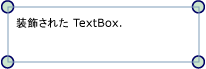

# 装飾の概要
装飾は、特殊な種類の<xref:System.Windows.FrameworkElement>で視覚的な手掛かりをユーザーに提供するために使用されます。 装飾は、要素への機能ハンドル追加やコントロールに関する状態情報の提供など、さまざまな用途に使用できます。  
  
  
  
   
## 装飾について  
 <xref:System.Windows.Documents.Adorner>カスタム<xref:System.Windows.FrameworkElement>にバインドされている、<xref:System.Windows.UIElement>です。 装飾は、 <xref:System.Windows.Documents.AdornerLayer>、装飾される要素、または装飾される要素のコレクションの上には、常にするための描画サーフェイスであります。 装飾のレンダリングがレンダリングから独立して、<xref:System.Windows.UIElement>に装飾がバインドされています。 通常、装飾は、装飾対象の要素の左上に位置する標準の 2 次元座標の原点を使用して、バインド先の要素に対して相対的な位置に配置されます。  
  
 装飾の一般的な用途は、次のとおりです。  
  
-   機能のハンドルへの追加、 <xref:System.Windows.UIElement> (サイズ変更、回転、再配置など) 何らかの方法で要素を操作するユーザーを有効にします。  
  
-   視覚的なフィードバックによって、さまざまな状態を表示し、各種のイベントに応答する。  
  
-   ビジュアルの装飾をオーバーレイ、<xref:System.Windows.UIElement>です。  
  
-   視覚的にマスクまたはの一部またはすべてを上書き、<xref:System.Windows.UIElement>です。  
  
 [!INCLUDE[TLA#tla_winclient](../../../../includes/tlasharptla-winclient-md.md)] は、視覚的要素を装飾する基本的なフレームワークを提供します。 次の表に示すのは、オブジェクトの装飾に使用する主な種類と、その用途の一覧です。 その後に、使用例をいくつか示します。  
  
|||  
|-|-|  
|<xref:System.Windows.Documents.Adorner>|具体的な装飾の実装すべての継承元になる抽象基本クラス。|  
|<xref:System.Windows.Documents.AdornerLayer>|装飾される 1 つ以上の要素に対する、装飾のレンダリング層を表すクラス。|  
|<xref:System.Windows.Documents.AdornerDecorator>|1 つの装飾層を要素のコレクションに関連付けることを可能にするクラス。|  
  
   
## カスタム装飾の実装  
 [!INCLUDE[TLA#tla_winclient](../../../../includes/tlasharptla-winclient-md.md)] が提供する装飾フレームワークは、カスタム装飾の作成をサポートすることを主な目的としています。 カスタムの装飾が抽象から継承するクラスを実装することによって作成された<xref:System.Windows.Documents.Adorner>クラスです。  
  
> [!NOTE]
>  親、<xref:System.Windows.Documents.Adorner>は、<xref:System.Windows.Documents.AdornerLayer>表示するための<xref:System.Windows.Documents.Adorner>装飾される要素ではなく、します。  
  
 次の例では、簡単な装飾を実装するクラスを示します。 例の装飾は、の<xref:System.Windows.UIElement>円でします。  
  
 [!code-csharp[Adorners_SimpleCircleAdorner#_SimpleCircleAdornerBody](../../../../samples/snippets/csharp/VS_Snippets_Wpf/Adorners_SimpleCircleAdorner/CSharp/Window1.xaml.cs#_simplecircleadornerbody)]
 [!code-vb[Adorners_SimpleCircleAdorner#_SimpleCircleAdornerBody](../../../../samples/snippets/visualbasic/VS_Snippets_Wpf/Adorners_SimpleCircleAdorner/VisualBasic/Window1.xaml.vb#_simplecircleadornerbody)]  
  
 次の図に適用される SimpleCircleAdorner、<xref:System.Windows.Controls.TextBox>です。  
  
   
  
   
## 装飾のレンダリング動作  
 装飾自体にはレンダリング動作が備わっていないので、装飾のレンダリングは装飾の実装側の責任で行う必要がある点に、注意が必要です。   レンダリング動作を実装する一般的な方法は、上書きする、<xref:System.Windows.UIElement.OnRender%2A>メソッドと 1 つ以上を使用して<xref:System.Windows.Media.DrawingContext>に応じて (上記の例で示した部分) の装飾のビジュアルを表示するオブジェクト。  
  
> [!NOTE]
>  装飾層に配置されているすべてのものは、設定した他のすべてのスタイルの上に描画されます。 つまり、装飾は常に視覚的に最上位にあり、z オーダーを使用してオーバーライドすることはできません。  
  
   
## イベントおよびヒット テスト  
 ガイドと同じように、他の入力イベントを受信する<xref:System.Windows.FrameworkElement>です。  装飾が入力イベントを受け取る装飾には、常には、adorns 要素よりも高い z オーダーがあるため (など<xref:System.Windows.UIElement.Drop>または<xref:System.Windows.UIElement.MouseMove>) 要素を装飾する、基になるを想定可能性があります。  装飾は、特定の入力イベントをリッスンし、それらのイベントを再度発生させることによって、下位にある装飾対象の要素に渡すことができます。  
  
 装飾の下の要素のパススルー ヒット テストを有効にするには、ヒット テストを設定<xref:System.Windows.UIElement.IsHitTestVisible%2A>プロパティを**false**で装飾します。  ヒット テストの詳細については、次を参照してください。  
  
 [ビジュアル層でのヒット テスト](../../../../docs/framework/wpf/graphics-multimedia/hit-testing-in-the-visual-layer.md)。  
  
   
## 単一の UIElement の装飾  
 特定の装飾にバインドする<xref:System.Windows.UIElement>、これらの手順に従います。  
  
1.  静的メソッドを呼び出す<xref:System.Windows.Documents.AdornerLayer.GetAdornerLayer%2A>を取得する、<xref:System.Windows.Documents.AdornerLayer>オブジェクトに対して、<xref:System.Windows.UIElement>を装飾します。 <xref:System.Windows.Documents.AdornerLayer.GetAdornerLayer%2A> 指定した位置を開始、ビジュアル ツリーを調べて<xref:System.Windows.UIElement>、し、見つかった最初の装飾層を返します。 (装飾層が見つからない場合、メソッドにより null が返されます)。  
  
2.  呼び出す、<xref:System.Windows.Documents.AdornerLayer.Add%2A>装飾をターゲットにバインドするメソッド<xref:System.Windows.UIElement>です。  
  
 次の例に (上記) SimpleCircleAdorner、<xref:System.Windows.Controls.TextBox>という*myTextBox*です。  
  
 [!code-csharp[Adorners_SimpleCircleAdorner#_AdornSingleElement](../../../../samples/snippets/csharp/VS_Snippets_Wpf/Adorners_SimpleCircleAdorner/CSharp/Window1.xaml.cs#_adornsingleelement)]
 [!code-vb[Adorners_SimpleCircleAdorner#_AdornSingleElement](../../../../samples/snippets/visualbasic/VS_Snippets_Wpf/Adorners_SimpleCircleAdorner/VisualBasic/Window1.xaml.vb#_adornsingleelement)]  
  
> [!NOTE]
>  [!INCLUDE[TLA#tla_xaml](../../../../includes/tlasharptla-xaml-md.md)] を使用して、装飾を別の要素にバインドする方法は、現在サポートされていません。  
  
   
## パネルの子の装飾  
 子に装飾をバインドする、 <xref:System.Windows.Controls.Panel>、これらの手順に従います。  
  
1.  呼び出す、`static`メソッド<xref:System.Windows.Documents.AdornerLayer.GetAdornerLayer%2A>子によって実装されている要素の装飾層が見つかりません。  
  
2.  親要素と呼び出しの子を列挙、<xref:System.Windows.Documents.AdornerLayer.Add%2A>装飾を各子要素にバインドするメソッド。  
  
 次の例では、子に (上記) SimpleCircleAdorner、<xref:System.Windows.Controls.StackPanel>という*myStackPanel*です。  
  
 [!code-csharp[Adorners_SimpleCircleAdorner#_AdornChildren](../../../../samples/snippets/csharp/VS_Snippets_Wpf/Adorners_SimpleCircleAdorner/CSharp/Window1.xaml.cs#_adornchildren)]
 [!code-vb[Adorners_SimpleCircleAdorner#_AdornChildren](../../../../samples/snippets/visualbasic/VS_Snippets_Wpf/Adorners_SimpleCircleAdorner/VisualBasic/Window1.xaml.vb#_adornchildren)]  
  
## 関連項目  
 <xref:System.Windows.Media.AdornerHitTestResult>  
 [WPF での図形と基本描画の概要](../../../../docs/framework/wpf/graphics-multimedia/shapes-and-basic-drawing-in-wpf-overview.md)  
 [イメージ、描画、およびビジュアルによる塗りつぶし](../../../../docs/framework/wpf/graphics-multimedia/painting-with-images-drawings-and-visuals.md)  
 [Drawing オブジェクトの概要](../../../../docs/framework/wpf/graphics-multimedia/drawing-objects-overview.md)  
 [方法トピック](../../../../docs/framework/wpf/controls/adorners-how-to-topics.md)
