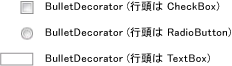

# BulletDecorator
<xref:System.Windows.Controls.Primitives.BulletDecorator>2 つのコンテンツ プロパティがあります:<xref:System.Windows.Controls.Primitives.BulletDecorator.Bullet%2A>と<xref:System.Windows.Controls.Decorator.Child%2A>です。 <xref:System.Windows.Controls.Primitives.BulletDecorator.Bullet%2A>プロパティを定義、<xref:System.Windows.UIElement>行頭文字として使用します。 <xref:System.Windows.Controls.Decorator.Child%2A>プロパティを定義、<xref:System.Windows.UIElement>を視覚的に行頭文字と整合します。  
  
 次の図に、使用するコントロールの例として、<xref:System.Windows.Controls.Primitives.BulletDecorator>です。  
  
   
  
## 参照  
 <xref:System.Windows.Controls.Primitives.BulletDecorator>
