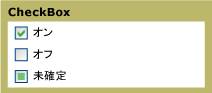

# CheckBox
使用することができます、<xref:System.Windows.Controls.CheckBox>で、[!INCLUDE[TLA#tla_ui](../../../../includes/tlasharptla-ui-md.md)]にアプリケーションをユーザーがオンまたはオフにするオプションを表します。 1 つのチェック ボックスを使用することができますか、2 つ以上のチェック ボックスをグループ化することができます。  
  
 次の図は、別の状態、<xref:System.Windows.Controls.CheckBox>です。  
  
   
さまざまな状態の CheckBox コントロール  
  
## 参照  
 <xref:System.Windows.Controls.CheckBox>  
  <xref:System.Windows.Controls.RadioButton>  
  <xref:System.Windows.Controls.Primitives.ButtonBase>  
  <xref:System.Windows.Controls.Primitives.RepeatButton>  
  
## 関連項目
