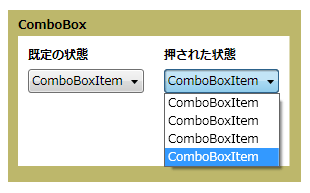

# ComboBox
<xref:System.Windows.Controls.ComboBox>コントロール オプションの一覧をユーザーに対して表示します。 一覧が表示され、コントロールの展開または折りたたむと非表示になります。 既定の状態で一覧が折りたたまれている、のみ 1 つの選択肢を表示します。 オプションの完全な一覧を表示するボタンをクリックします。  
  
 次の図は、<xref:System.Windows.Controls.ComboBox>さまざまな状態にします。  
  
   
展開し、折りたたみ  
  
## このセクションの内容  
 [方法: ComboBoxItem の取得](http://msdn.microsoft.com/library/8a0d2622-64b6-41fc-bf80-9669a1eacb53)  
  
## 参照  
 <xref:System.Windows.Controls.ComboBox>
