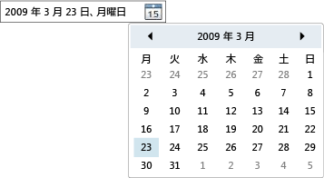

# DatePicker
<xref:System.Windows.Controls.DatePicker> コントロールを使用すると、ユーザーはテキスト フィールドに入力することによって、またはドロップダウン形式の <xref:System.Windows.Controls.Calendar> コントロールを使用して、日付を選択できます。  
  
 次の図は、<xref:System.Windows.Controls.DatePicker> を示しています。  
  
   
DatePicker コントロール  
  
 <xref:System.Windows.Controls.DatePicker> コントロールのプロパティの多くはその組み込み <xref:System.Windows.Controls.Calendar> を管理するためのものであり、<xref:System.Windows.Controls.Calendar> の相当するプロパティと同じように機能します。  特に、<xref:System.Windows.Controls.DatePicker.IsTodayHighlighted%2A?displayProperty=fullName>、<xref:System.Windows.Controls.DatePicker.FirstDayOfWeek%2A?displayProperty=fullName>、<xref:System.Windows.Controls.DatePicker.BlackoutDates%2A?displayProperty=fullName>、<xref:System.Windows.Controls.DatePicker.DisplayDateStart%2A?displayProperty=fullName>、<xref:System.Windows.Controls.DatePicker.DisplayDateEnd%2A?displayProperty=fullName>、<xref:System.Windows.Controls.DatePicker.DisplayDate%2A?displayProperty=fullName>、および <xref:System.Windows.Controls.DatePicker.SelectedDate%2A?displayProperty=fullName> の各プロパティは、<xref:System.Windows.Controls.Calendar> の対応するプロパティと同じように機能します。  詳細については、「<xref:System.Windows.Controls.Calendar>」を参照してください。  
  
 ユーザーは、テキスト フィールドに日付を直接入力することもできます。これによって、<xref:System.Windows.Controls.DatePicker.Text%2A> プロパティが設定されます。  <xref:System.Windows.Controls.DatePicker> が、入力された文字列を有効な日付に変換できない場合は、<xref:System.Windows.Controls.DatePicker.DateValidationError> イベントが発生します。  既定では例外が発生しますが、<xref:System.Windows.Controls.DatePicker.DateValidationError> のイベント ハンドラーで <xref:System.Windows.Controls.DatePickerDateValidationErrorEventArgs.ThrowException%2A> プロパティを `false` に設定すると、例外の発生を回避できます。  
  
## 参照  
 [コントロール](../../../../docs/framework/wpf/controls/index.md)   
 [スタイルとテンプレート](../../../../docs/framework/wpf/controls/styling-and-templating.md)