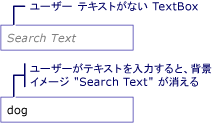

# 方法: TextBox にウォーターマークを追加する
次の例の使いやすさを支援する方法を示しています、<xref:System.Windows.Controls.TextBox>内の説明の背景イメージを表示することによって、<xref:System.Windows.Controls.TextBox>この時点で、イメージを削除するまで、ユーザーがテキストを入力します。 さらに、背景画像は、ユーザー入力を削除する場合、再度復元します。 次の図を参照してください。  
  
   
  
> [!NOTE]
>  背景画像は、この例ではなく、単に操作で使用する理由、<xref:System.Windows.Controls.TextBox.Text%2A>のプロパティ<xref:System.Windows.Controls.TextBox>がある、背景画像は、データ バインディングには影響しません。  
  
## 例  
 [!code-xaml[TextBoxMiscSnippets_snip#TextBoxBackgroundExampleWholePage](../../../../samples/snippets/csharp/VS_Snippets_Wpf/TextBoxMiscSnippets_snip/csharp/textbox_with_background_image.xaml#textboxbackgroundexamplewholepage)]  
  
 [!code-csharp[TextBoxMiscSnippets_snip#TextBoxBackgroundCodeExampleWholePage](../../../../samples/snippets/csharp/VS_Snippets_Wpf/TextBoxMiscSnippets_snip/csharp/textbox_with_background_image.xaml.cs#textboxbackgroundcodeexamplewholepage)]
 [!code-vb[TextBoxMiscSnippets_snip#TextBoxBackgroundCodeExampleWholePage](../../../../samples/snippets/visualbasic/VS_Snippets_Wpf/TextBoxMiscSnippets_snip/visualbasic/textbox_with_background_image.xaml.vb#textboxbackgroundcodeexamplewholepage)]  
  
## 関連項目  
 [TextBox の概要](../../../../docs/framework/wpf/controls/textbox-overview.md)  
 [RichTextBox の概要](../../../../docs/framework/wpf/controls/richtextbox-overview.md)
