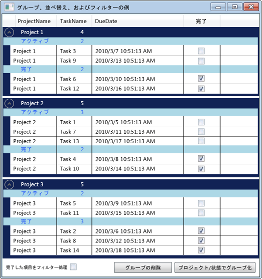

# 方法: グループ、並べ替え、およびデータ グリッド コントロールでデータのフィルター

内のデータを表示すると便利です、<xref:System.Windows.Controls.DataGrid>によってグループ化、並べ替え、およびデータのフィルター処理のさまざまな方法でします。 グループ化、並べ替え、およびデータをフィルター処理、<xref:System.Windows.Controls.DataGrid>にバインドする、<xref:System.Windows.Data.CollectionView>これらの関数をサポートします。 内のデータを操作することができますし、<xref:System.Windows.Data.CollectionView>基になるソース データには影響しません。 コレクション ビューの変更に反映されます、<xref:System.Windows.Controls.DataGrid>ユーザー インターフェイス (UI)。

<xref:System.Windows.Data.CollectionView>クラスには、グループ化および並べ替えを実装するデータ ソースの機能が用意されています、<xref:System.Collections.IEnumerable>インターフェイスです。 <xref:System.Windows.Data.CollectionViewSource>クラスでは、プロパティを設定することができます、 <xref:System.Windows.Data.CollectionView> XAML からです。

この例では、コレクションで`Task`にオブジェクトがバインドされて、<xref:System.Windows.Data.CollectionViewSource>です。 <xref:System.Windows.Data.CollectionViewSource>として使用される、<xref:System.Windows.Controls.ItemsControl.ItemsSource%2A>の<xref:System.Windows.Controls.DataGrid>です。 グループ化、並べ替え、およびフィルター処理を実行、<xref:System.Windows.Data.CollectionViewSource>に表示されると、 <xref:System.Windows.Controls.DataGrid> UI。

データ グリッド内のデータをグループ化

## ItemsSource として、CollectionViewSource を使用します。

グループ、並べ替え、およびデータのフィルター処理する、<xref:System.Windows.Controls.DataGrid>コントロールをバインドする、<xref:System.Windows.Controls.DataGrid>を<xref:System.Windows.Data.CollectionView>これらの関数をサポートします。 この例では、<xref:System.Windows.Controls.DataGrid>にバインドされて、<xref:System.Windows.Data.CollectionViewSource>のこれらの関数を提供する、<xref:System.Collections.Generic.List%601>の`Task`オブジェクト。

### CollectionViewSource に DataGrid をバインドするには

1. 実装するデータ コレクションを作成、<xref:System.Collections.IEnumerable>インターフェイスです。

    使用する場合<xref:System.Collections.Generic.List%601>、コレクションを作成するから継承する新しいクラスを作成する必要があります<xref:System.Collections.Generic.List%601>のインスタンスをインスタンス化ではなく<xref:System.Collections.Generic.List%601>です。 XAML 内のコレクションへのデータ バインドにできます。

    > [!NOTE]
    > コレクション内のオブジェクトを実装する必要があります、<xref:System.ComponentModel.INotifyPropertyChanged>変更されたインターフェイスと<xref:System.ComponentModel.IEditableObject>インターフェイスの順序で、<xref:System.Windows.Controls.DataGrid>プロパティの変更と編集に正しく応答します。 詳細については、「[プロパティの変更通知を実装する](../data/how-to-implement-property-change-notification.md)」を参照してください。

    [!code-csharp[DataGrid_GroupSortFilter#101](~/samples/snippets/csharp/VS_Snippets_Wpf/DataGrid_GroupSortFilter/CS/MainWindow.xaml.cs#101)]
    [!code-vb[DataGrid_GroupSortFilter#101](~/samples/snippets/visualbasic/VS_Snippets_Wpf/DataGrid_GroupSortFilter/VB/MainWindow.xaml.vb#101)]

2. XAML では、コレクション クラスのインスタンスを作成し、設定、 [X:key ディレクティブ](../../../../docs/framework/xaml-services/x-key-directive.md)です。

3. XAML では、インスタンスを作成、<xref:System.Windows.Data.CollectionViewSource>クラスは、設定、 [X:key ディレクティブ](../../../../docs/framework/xaml-services/x-key-directive.md)、としてコレクション クラスのインスタンスを設定し、<xref:System.Windows.Data.CollectionViewSource.Source%2A>です。

    [!code-xaml[DataGrid_GroupSortFilter#201](~/samples/snippets/csharp/VS_Snippets_Wpf/DataGrid_GroupSortFilter/CS/WindowSnips1.xaml#201)]

4. インスタンスを作成、<xref:System.Windows.Controls.DataGrid>クラス、し、設定、<xref:System.Windows.Controls.ItemsControl.ItemsSource%2A>プロパティを<xref:System.Windows.Data.CollectionViewSource>です。

    [!code-xaml[DataGrid_GroupSortFilter#002](~/samples/snippets/csharp/VS_Snippets_Wpf/DataGrid_GroupSortFilter/CS/MainWindow.xaml#002)]

5. アクセスする、 <xref:System.Windows.Data.CollectionViewSource> 、コードから使用して、<xref:System.Windows.Data.CollectionViewSource.GetDefaultView%2A>への参照を取得するメソッド、<xref:System.Windows.Data.CollectionViewSource>です。

    [!code-csharp[DataGrid_GroupSortFilter#102](~/samples/snippets/csharp/VS_Snippets_Wpf/DataGrid_GroupSortFilter/CS/MainWindow.xaml.cs#102)]
    [!code-vb[DataGrid_GroupSortFilter#102](~/samples/snippets/visualbasic/VS_Snippets_Wpf/DataGrid_GroupSortFilter/VB/MainWindow.xaml.vb#102)]

## データ グリッド内の項目をグループ化

項目をグループ化する方法を指定する、<xref:System.Windows.Controls.DataGrid>を使用する、<xref:System.Windows.Data.PropertyGroupDescription>ソース ビュー内の項目をグループ化する型。

### XAML を使用してデータ グリッド内のアイテムをグループ化

1. 作成、<xref:System.Windows.Data.PropertyGroupDescription>グループ化するプロパティを指定します。 XAML またはコードでは、プロパティを指定できます。

   1. XAML では、設定、<xref:System.Windows.Data.PropertyGroupDescription.PropertyName%2A>グループ化するプロパティの名前にします。

   2. コードでは、コンス トラクターにグループ化するプロパティの名前を渡します。

2. 追加、<xref:System.Windows.Data.PropertyGroupDescription>を<xref:System.Windows.Data.CollectionViewSource.GroupDescriptions%2A?displayProperty=nameWithType>コレクション。

3. 追加のインスタンスの追加<xref:System.Windows.Data.PropertyGroupDescription>を<xref:System.Windows.Data.CollectionViewSource.GroupDescriptions%2A>複数レベルのグループ化を追加するコレクション。

    [!code-xaml[DataGrid_GroupSortFilter#012](~/samples/snippets/csharp/VS_Snippets_Wpf/DataGrid_GroupSortFilter/CS/MainWindow.xaml#012)]
    [!code-csharp[DataGrid_GroupSortFilter#112](~/samples/snippets/csharp/VS_Snippets_Wpf/DataGrid_GroupSortFilter/CS/MainWindow.xaml.cs#112)]
    [!code-vb[DataGrid_GroupSortFilter#112](~/samples/snippets/visualbasic/VS_Snippets_Wpf/DataGrid_GroupSortFilter/VB/MainWindow.xaml.vb#112)]

4. グループを削除するには、削除、<xref:System.Windows.Data.PropertyGroupDescription>から、<xref:System.Windows.Data.CollectionViewSource.GroupDescriptions%2A>コレクション。

5. すべてのグループを削除するには、呼び出し、<xref:System.Collections.ObjectModel.Collection%601.Clear%2A>のメソッド、<xref:System.Windows.Data.CollectionViewSource.GroupDescriptions%2A>コレクション。

    [!code-csharp[DataGrid_GroupSortFilter#114](~/samples/snippets/csharp/VS_Snippets_Wpf/DataGrid_GroupSortFilter/CS/MainWindow.xaml.cs#114)]
    [!code-vb[DataGrid_GroupSortFilter#114](~/samples/snippets/visualbasic/VS_Snippets_Wpf/DataGrid_GroupSortFilter/VB/MainWindow.xaml.vb#114)]

項目をグループ化するときに、 <xref:System.Windows.Controls.DataGrid>、定義することができます、<xref:System.Windows.Controls.GroupStyle>各グループの外観を指定します。 適用する、<xref:System.Windows.Controls.GroupStyle>に追加することによって、 <xref:System.Windows.Controls.ItemsControl.GroupStyle%2A> DataGrid のコレクション。 複数のレベルのグループ化した場合は、グループ レベルごとに異なるスタイルを適用できます。 スタイルは定義されている順序で適用されます。 たとえば、2 つのスタイルを定義する場合、最初は最上位レベルの行グループに適用します。 2 番目のスタイルは、第 2 レベルのすべての行グループに適用されると下限になります。 <xref:System.Windows.FrameworkElement.DataContext%2A>の<xref:System.Windows.Controls.GroupStyle>は、<xref:System.Windows.Data.CollectionViewGroup>グループを表すです。

### 行グループ ヘッダーの外観を変更するには

1. 作成、<xref:System.Windows.Controls.GroupStyle>行グループの外観を定義します。

2. Put、<xref:System.Windows.Controls.GroupStyle>内、`<DataGrid.GroupStyle>`タグ。

    [!code-xaml[DataGrid_GroupSortFilter#003](~/samples/snippets/csharp/VS_Snippets_Wpf/DataGrid_GroupSortFilter/CS/MainWindow.xaml#003)]

## DataGrid のアイテムの並べ替え

項目の並べ替え方法を指定する、<xref:System.Windows.Controls.DataGrid>を使用する、<xref:System.ComponentModel.SortDescription>型をソース ビュー内の項目を並べ替えます。

### DataGrid の項目を並べ替える

1. 作成、<xref:System.ComponentModel.SortDescription>で並べ替えを行うプロパティを指定します。 XAML またはコードでは、プロパティを指定できます。

    1. XAML では、設定、<xref:System.ComponentModel.SortDescription.PropertyName%2A>によって並べ替えするプロパティの名前にします。

    2. コードでは、並べ替えるプロパティの名前を渡すと、<xref:System.ComponentModel.ListSortDirection>コンス トラクターにします。

2. 追加、<xref:System.ComponentModel.SortDescription>を<xref:System.Windows.Data.CollectionViewSource.SortDescriptions%2A?displayProperty=nameWithType>コレクション。

3. 追加のインスタンスの追加<xref:System.ComponentModel.SortDescription>を<xref:System.Windows.Data.CollectionViewSource.SortDescriptions%2A>コレクションに追加のプロパティを並べ替えます。

    [!code-xaml[DataGrid_GroupSortFilter#011](~/samples/snippets/csharp/VS_Snippets_Wpf/DataGrid_GroupSortFilter/CS/MainWindow.xaml#011)]
    [!code-csharp[DataGrid_GroupSortFilter#211](~/samples/snippets/csharp/VS_Snippets_Wpf/DataGrid_GroupSortFilter/CS/WindowSnips1.xaml.cs#211)]
    [!code-vb[DataGrid_GroupSortFilter#211](~/samples/snippets/visualbasic/VS_Snippets_Wpf/DataGrid_GroupSortFilter/VB/MainWindow.xaml.vb#211)]

## DataGrid の項目をフィルター処理

項目をフィルター処理で、<xref:System.Windows.Controls.DataGrid>を使用して、<xref:System.Windows.Data.CollectionViewSource>のハンドラーでフィルター処理のロジックを提供する、<xref:System.Windows.Data.CollectionViewSource.Filter?displayProperty=nameWithType>イベント。

### DataGrid の項目をフィルターするには

1. ハンドラーを追加、<xref:System.Windows.Data.CollectionViewSource.Filter?displayProperty=nameWithType>イベント。

2. <xref:System.Windows.Data.CollectionViewSource.Filter>イベント ハンドラー、フィルター処理のロジックを定義します。

    ビューが更新されるたびに、フィルターが適用されます。

    [!code-xaml[DataGrid_GroupSortFilter#013](~/samples/snippets/csharp/VS_Snippets_Wpf/DataGrid_GroupSortFilter/CS/MainWindow.xaml#013)]
    [!code-csharp[DataGrid_GroupSortFilter#113](~/samples/snippets/csharp/VS_Snippets_Wpf/DataGrid_GroupSortFilter/CS/MainWindow.xaml.cs#113)]
    [!code-vb[DataGrid_GroupSortFilter#113](~/samples/snippets/visualbasic/VS_Snippets_Wpf/DataGrid_GroupSortFilter/VB/MainWindow.xaml.vb#113)]

または、内の項目をフィルター処理することができます、<xref:System.Windows.Controls.DataGrid>をフィルター処理のロジックと設定を提供するメソッドを作成することで、<xref:System.Windows.Data.CollectionView.Filter%2A?displayProperty=nameWithType>フィルターを適用するプロパティです。 このメソッドの例を参照してください[のビューのフィルター データ](../data/how-to-filter-data-in-a-view.md)です。

## 例

次の例は、グループ化、並べ替え、およびフィルター処理を示しています。`Task`内のデータ、<xref:System.Windows.Data.CollectionViewSource>と表示、並べ替え、フィルターにグループ化、`Task`内のデータ、<xref:System.Windows.Controls.DataGrid>です。 <xref:System.Windows.Data.CollectionViewSource>として使用される、<xref:System.Windows.Controls.ItemsControl.ItemsSource%2A>の<xref:System.Windows.Controls.DataGrid>です。 グループ化、並べ替え、およびフィルター処理を実行、<xref:System.Windows.Data.CollectionViewSource>に表示されると、 <xref:System.Windows.Controls.DataGrid> UI。

この例をテストするには、プロジェクト名を一致させる DGGroupSortFilterExample 名前を調整する必要があります。 Visual Basic を使用している場合は、クラス名を変更する必要があります。<xref:System.Windows.Window>以下にします。

`<Window x:Class="MainWindow"`

[!code-xaml[DataGrid_GroupSortFilter#000](~/samples/snippets/csharp/VS_Snippets_Wpf/DataGrid_GroupSortFilter/CS/MainWindow.xaml#000)]
[!code-csharp[DataGrid_GroupSortFilter#100](~/samples/snippets/csharp/VS_Snippets_Wpf/DataGrid_GroupSortFilter/CS/MainWindow.xaml.cs#100)]
[!code-vb[DataGrid_GroupSortFilter#100](~/samples/snippets/visualbasic/VS_Snippets_Wpf/DataGrid_GroupSortFilter/VB/MainWindow.xaml.vb#100)]

## 関連項目

[データ バインディングの概要](../data/data-binding-overview.md)  
[ObservableCollection を作成およびバインドする](../data/how-to-create-and-bind-to-an-observablecollection.md)  
[ビュー内のデータをフィルター処理する](../data/how-to-filter-data-in-a-view.md)  
[ビュー内のデータの並べ替え](../data/how-to-sort-data-in-a-view.md)  
[XAML でビューを使用してデータの並べ替えおよびグループ化を行う](../data/how-to-sort-and-group-data-using-a-view-in-xaml.md)  