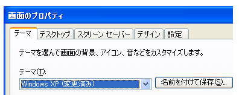

# group1Label
<xref:System.Windows.Controls.Label>コントロールが通常の情報を提供して、[!INCLUDE[TLA#tla_ui](../../../../includes/tlasharptla-ui-md.md)]です。<xref:System.Windows.Controls.Label> controls usually provide information in the [!INCLUDE[TLA#tla_ui](../../../../includes/tlasharptla-ui-md.md)].  従来、<xref:System.Windows.Controls.Label>テキストのみが格納されているが、<xref:System.Windows.Controls.Label>に付属している[!INCLUDE[TLA#tla_winclient](../../../../includes/tlasharptla-winclient-md.md)]は、 <xref:System.Windows.Controls.ContentControl>、いずれかのテキストを含めることができます、または<xref:System.Windows.UIElement>です。Historically, a <xref:System.Windows.Controls.Label> has contained only text, but because the <xref:System.Windows.Controls.Label> that ships with [!INCLUDE[TLA#tla_winclient](../../../../includes/tlasharptla-winclient-md.md)] is a <xref:System.Windows.Controls.ContentControl>, it can contain either text or a <xref:System.Windows.UIElement>.  
  
 A<xref:System.Windows.Controls.Label>アクセス キーの機能や外観の両方のサポートを提供します。A <xref:System.Windows.Controls.Label> provides both functional and visual support for access keys. アクセスを有効にクイック キーボード コントロールなどでよく使用される、<xref:System.Windows.Controls.TextBox>です。It is frequently used to enable quick keyboard access to controls such as a <xref:System.Windows.Controls.TextBox>. 割り当てる、<xref:System.Windows.Controls.Label>を<xref:System.Windows.Controls.Control>、設定されて、<xref:System.Windows.Controls.Label.Target%2A?displayProperty=nameWithType>プロパティをコントロールをユーザーがアクセス キーを押すとフォーカスを取得する必要があります。To assign a <xref:System.Windows.Controls.Label> to a <xref:System.Windows.Controls.Control>, set the <xref:System.Windows.Controls.Label.Target%2A?displayProperty=nameWithType> property to the control that should get focus when the user presses the access key.  
  
 次の図は、 <xref:System.Windows.Controls.Label> 「テーマ」を対象とする、<xref:System.Windows.Controls.ComboBox>です。The following image shows a <xref:System.Windows.Controls.Label> "Themes" that targets a <xref:System.Windows.Controls.ComboBox>.  ユーザーが押すと、<xref:System.Windows.Controls.ComboBox>がフォーカスを取得します。When the user presses , the <xref:System.Windows.Controls.ComboBox> receives focus.  詳細については、次を参照してください。[する方法: ラベルのターゲット プロパティを設定](http://msdn.microsoft.com/en-us/b24c6977-ebcb-4855-a9bb-3fd4435af8f8)です。For more information, see [How to: Set the Target Property of a Label](http://msdn.microsoft.com/en-us/b24c6977-ebcb-4855-a9bb-3fd4435af8f8).  
  
   
  
## このセクションの内容In This Section  
 [方法: ラベルのターゲット プロパティを設定するHow to: Set the Target Property of a Label](http://msdn.microsoft.com/en-us/b24c6977-ebcb-4855-a9bb-3fd4435af8f8)  
  
## 参照Reference  
 <xref:System.Windows.Controls.Label>
