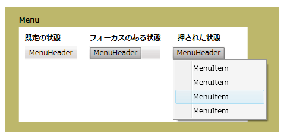

# メニューMenu
A<xref:System.Windows.Controls.Menu>コマンドまたはイベント ハンドラーに関連付けられている要素の階層構造を使用するコントロールです。A <xref:System.Windows.Controls.Menu> is a control that allows hierarchical organization of elements associated with commands or event handlers. 各<xref:System.Windows.Controls.Menu>複数を含めることができる<xref:System.Windows.Controls.MenuItem>コントロール。Each <xref:System.Windows.Controls.Menu> can contain multiple <xref:System.Windows.Controls.MenuItem> controls. 各<xref:System.Windows.Controls.MenuItem>コマンドを呼び出すかを呼び出すことができます、`Click`イベント ハンドラー。Each <xref:System.Windows.Controls.MenuItem> can invoke a command or invoke a `Click` event handler. A<xref:System.Windows.Controls.MenuItem>複数を持つことができますも<xref:System.Windows.Controls.MenuItem>サブメニューを形成する子要素として。A <xref:System.Windows.Controls.MenuItem> can also have multiple <xref:System.Windows.Controls.MenuItem> elements as children, forming a submenu.  
  
 次の図は、メニュー コントロールの 3 つの異なる状態を示します。The following illustration shows the three different states of a menu control. 既定の状態でマウスのポインターなどのデバイスが置かれていない場合、<xref:System.Windows.Controls.Menu>です。The default state is when no device such as a mouse pointer is resting on the <xref:System.Windows.Controls.Menu>. マウス ポインターを置いたときに、フォーカス状態が発生した、<xref:System.Windows.Controls.Menu>上でマウス ボタンがクリックされたときに押された状態が発生して、<xref:System.Windows.Controls.Menu>です。The focus state occurs when the mouse pointer is hovering over the <xref:System.Windows.Controls.Menu> and pressed state occurs when a mouse button is clicked over the <xref:System.Windows.Controls.Menu>.  
  
   
さまざまな状態のメニューMenus in different states  
  
## このセクションの内容In This Section  
 [メニューの概要Menu Overview](../../../../docs/framework/wpf/controls/menu-overview.md)  
  
## 参照Reference  
 <xref:System.Windows.Controls.Menu>  
  <xref:System.Windows.Controls.MenuItem>  
  <xref:System.Windows.Controls.Primitives.MenuBase>  
  <xref:System.Windows.Controls.ContextMenu>  
  
## 関連項目Related Sections
