# ポップアップの配置動作
A<xref:System.Windows.Controls.Primitives.Popup>コントロールは、アプリケーションで別のウィンドウでコンテンツを表示します。 位置を指定する、<xref:System.Windows.Controls.Primitives.Popup>コントロール、マウス、またはを使用して画面を基準とした、 <xref:System.Windows.Controls.Primitives.Popup.PlacementTarget%2A>、<xref:System.Windows.Controls.Primitives.Popup.Placement%2A>、 <xref:System.Windows.Controls.Primitives.Popup.PlacementRectangle%2A>、 <xref:System.Windows.Controls.Primitives.Popup.HorizontalOffset%2A>、および<xref:System.Windows.Controls.Primitives.Popup.VerticalOffset%2A>プロパティです。  これらのプロパティは、柔軟に指定した位置に共同作業、<xref:System.Windows.Controls.Primitives.Popup>します。  
  
> [!NOTE]
>  <xref:System.Windows.Controls.ToolTip>と<xref:System.Windows.Controls.ContextMenu>クラスは、またこれら&5; つのプロパティを定義して、同様に動作します。  
  
 [!INCLUDE[autoOutline](../Token/autoOutline_md.md)]  
  
   
## ポップアップの配置  
 配置、<xref:System.Windows.Controls.Primitives.Popup>基準にすることができます、 <xref:System.Windows.UIElement>または画面全体にします。  次の例は、4 つ作成<xref:System.Windows.Controls.Primitives.Popup>基準となるコントロール、 <xref:System.Windows.UIElement>-この場合は、イメージにします。 すべての<xref:System.Windows.Controls.Primitives.Popup>コントロールがある、 <xref:System.Windows.Controls.Primitives.Popup.PlacementTarget%2A>プロパティに設定`image1`が各<xref:System.Windows.Controls.Primitives.Popup>が配置プロパティの値が異なる。  
  
 [!code-xml[PopupPositionSnippet#3](../../../../samples/snippets/csharp/VS_Snippets_Wpf/PopupPositionSnippet/CS/Window1.xaml#3)]  
  
 次の図は、イメージ、および<xref:System.Windows.Controls.Primitives.Popup>コントロール  
  
   
次の&4; つのポップアップを持つイメージ  
  
 この簡単な例を設定する方法を示しています、 <xref:System.Windows.Controls.Primitives.Popup.PlacementTarget%2A>と<xref:System.Windows.Controls.Primitives.Popup.Placement%2A>プロパティを使用して、 <xref:System.Windows.Controls.Primitives.Popup.PlacementRectangle%2A>、 <xref:System.Windows.Controls.Primitives.Popup.HorizontalOffset%2A>、および<xref:System.Windows.Controls.Primitives.Popup.VerticalOffset%2A>プロパティ、where より詳細に制御がある、<xref:System.Windows.Controls.Primitives.Popup>が配置されています。  
  
   
## 用語の定義: ポップアップの構造  
 次の用語は理解するに役立つ方法、 <xref:System.Windows.Controls.Primitives.Popup.PlacementTarget%2A>、<xref:System.Windows.Controls.Primitives.Popup.Placement%2A>、 <xref:System.Windows.Controls.Primitives.Popup.PlacementRectangle%2A>、 <xref:System.Windows.Controls.Primitives.Popup.HorizontalOffset%2A>、および<xref:System.Windows.Controls.Primitives.Popup.VerticalOffset%2A>プロパティが相互に関連付けると、<xref:System.Windows.Controls.Primitives.Popup>:  
  
-   ターゲット オブジェクト  
  
-   ターゲット領域  
  
-   ターゲットの基準  
  
-   ポップアップ配置ポイント  
  
 これらの用語のさまざまな側面を参照する便利な手段を提供する、<xref:System.Windows.Controls.Primitives.Popup>と関連付けられているコントロール。  
  
### ターゲット オブジェクト  
 *ターゲット オブジェクト*要素を<xref:System.Windows.Controls.Primitives.Popup>に関連付けられています。 場合、 <xref:System.Windows.Controls.Primitives.Popup.PlacementTarget%2A>プロパティが設定されて、ターゲット オブジェクトを指定します。  場合<xref:System.Windows.Controls.Primitives.Popup.PlacementTarget%2A>が設定されていないと、<xref:System.Windows.Controls.Primitives.Popup>親を持つ親は、ターゲット オブジェクト。  ある場合なし<xref:System.Windows.Controls.Primitives.Popup.PlacementTarget%2A>値と、親ターゲット オブジェクトが存在しないと、<xref:System.Windows.Controls.Primitives.Popup>画面を基準に配置します。  
  
 次の例を作成し、<xref:System.Windows.Controls.Primitives.Popup>の子は、<xref:System.Windows.Controls.Canvas>します。  この例では設定しません、 <xref:System.Windows.Controls.Primitives.Popup.PlacementTarget%2A>プロパティを<xref:System.Windows.Controls.Primitives.Popup>します。 既定値<xref:System.Windows.Controls.Primitives.Popup.Placement%2A>は<xref:System.Windows.Controls.Primitives.PlacementMode?displayProperty=fullName>ので、<xref:System.Windows.Controls.Primitives.Popup>の下に表示、<xref:System.Windows.Controls.Canvas>します。  
  
 [!code-xml[PopupPositionSnippet#1](../../../../samples/snippets/csharp/VS_Snippets_Wpf/PopupPositionSnippet/CS/Window1.xaml#1)]  
  
 次の図を表示する、<xref:System.Windows.Controls.Primitives.Popup>に対して相対的な位置、<xref:System.Windows.Controls.Canvas>します。  
  
   
Placementtarget のないポップアップ  
  
 次の例を作成し、<xref:System.Windows.Controls.Primitives.Popup>の子は、<xref:System.Windows.Controls.Canvas>、今度は、 <xref:System.Windows.Controls.Primitives.Popup.PlacementTarget%2A>に設定されている`ellipse1`下に、ポップアップが表示されますので、<xref:System.Windows.Shapes.Ellipse>します。  
  
 [!code-xml[PopupPositionSnippet#2](../../../../samples/snippets/csharp/VS_Snippets_Wpf/PopupPositionSnippet/CS/Window1.xaml#2)]  
  
 次の図を表示する、<xref:System.Windows.Controls.Primitives.Popup>に対して相対的な位置、<xref:System.Windows.Shapes.Ellipse>します。  
  
   
Placementtarget のポップアップ  
  
> [!NOTE]
>  <xref:System.Windows.Controls.ToolTip>、既定値の<xref:System.Windows.Controls.Primitives.Popup.Placement%2A>は<xref:System.Windows.Controls.Primitives.PlacementMode>します。  <xref:System.Windows.Controls.ContextMenu>、既定値の<xref:System.Windows.Controls.Primitives.Popup.Placement%2A>は<xref:System.Windows.Controls.Primitives.PlacementMode>します。 これらの値が「どのようにプロパティの連携します」で、後で説明しました。  
  
### ターゲット領域  
 *ターゲット領*は画面上の領域を<xref:System.Windows.Controls.Primitives.Popup>に相対的であります。 前の例で、<xref:System.Windows.Controls.Primitives.Popup>は場合によっては、ターゲット オブジェクトの境界に揃えられます、<xref:System.Windows.Controls.Primitives.Popup>は他の境界に配置場合でも、<xref:System.Windows.Controls.Primitives.Popup>ターゲット オブジェクトが存在します。  場合、 <xref:System.Windows.Controls.Primitives.Popup.PlacementRectangle%2A>プロパティが設定されて、対象となる領域はターゲット オブジェクトの境界とは異なる、できます。  
  
 次の例では、2 つ作成されます<xref:System.Windows.Controls.Canvas>オブジェクト、1 つを含む、<xref:System.Windows.Shapes.Rectangle>と<xref:System.Windows.Controls.Primitives.Popup>します。  どちらの場合も、対象のオブジェクトを<xref:System.Windows.Controls.Primitives.Popup>は、<xref:System.Windows.Controls.Canvas>します。 <xref:System.Windows.Controls.Primitives.Popup>最初の<xref:System.Windows.Controls.Canvas>が、 <xref:System.Windows.Controls.Primitives.Popup.PlacementRectangle%2A>によって設定、 <xref:System.Windows.Rect.X%2A>、 <xref:System.Windows.Rect.Y%2A>、<xref:System.Windows.Rect.Width%2A>、および<xref:System.Windows.Rect.Height%2A>プロパティがそれぞれ 50 件、50、50 と 100 に設定します。 <xref:System.Windows.Controls.Primitives.Popup>2 番目の<xref:System.Windows.Controls.Canvas>が、 <xref:System.Windows.Controls.Primitives.Popup.PlacementRectangle%2A>を設定します。  その結果、最初の<xref:System.Windows.Controls.Primitives.Popup>の下にある、 <xref:System.Windows.Controls.Primitives.Popup.PlacementRectangle%2A> 、2 番目<xref:System.Windows.Controls.Primitives.Popup>の下にある、<xref:System.Windows.Controls.Canvas>します。 各<xref:System.Windows.Controls.Canvas>も含まれています、<xref:System.Windows.Shapes.Rectangle>と同じ境界を持つ、 <xref:System.Windows.Controls.Primitives.Popup.PlacementRectangle%2A> 、最初の<xref:System.Windows.Controls.Primitives.Popup>します。  注意してください、 <xref:System.Windows.Controls.Primitives.Popup.PlacementRectangle%2A>アプリケーションで表示されている要素を作成できません例を作成し、<xref:System.Windows.Shapes.Rectangle>を表す、 <xref:System.Windows.Controls.Primitives.Popup.PlacementRectangle%2A>します。  
  
 [!code-xml[PopupPositionSnippet#4](../../../../samples/snippets/csharp/VS_Snippets_Wpf/PopupPositionSnippet/CS/Window1.xaml#4)]  
  
 次の図は、前の例の結果を示しています。  
  
   
PlacementRectangle がある (またはない) ポップアップ  
  
### ターゲットの基点とポップアップ配置ポイント  
 *オリジンをターゲット*と*ポップアップ配置ポイント*は、対象となる領域とポップアップで、上の参照点をそれぞれを配置するために使用されています。 使用することができます、 <xref:System.Windows.Controls.Primitives.Popup.HorizontalOffset%2A>と<xref:System.Windows.Controls.Primitives.Popup.VerticalOffset%2A>プロパティを対象となる領域からポップアップをオフセットします。  <xref:System.Windows.Controls.Primitives.Popup.HorizontalOffset%2A>と<xref:System.Windows.Controls.Primitives.Popup.VerticalOffset%2A>はターゲットの基点とポップアップ配置ポイントを基準としています。 値、<xref:System.Windows.Controls.Primitives.Popup.Placement%2A>プロパティは、ターゲットの基準とポップアップ配置ポイントがある場所を決定します。  
  
 次の例を作成し、<xref:System.Windows.Controls.Primitives.Popup>し、設定、 <xref:System.Windows.Controls.Primitives.Popup.HorizontalOffset%2A>と<xref:System.Windows.Controls.Primitives.Popup.VerticalOffset%2A>プロパティを 20 にします。  <xref:System.Windows.Controls.Primitives.Popup.Placement%2A>にプロパティが設定されている<xref:System.Windows.Controls.Primitives.PlacementMode>(既定)、のでターゲットの基準は、対象となる領域の左下隅で、ポップアップ配置ポイントの左上隅、<xref:System.Windows.Controls.Primitives.Popup>します。  
  
 [!code-xml[PopupPositionSnippet#5](../../../../samples/snippets/csharp/VS_Snippets_Wpf/PopupPositionSnippet/CS/Window1.xaml#5)]  
  
 次の図は、前の例の結果を示しています。  
  
 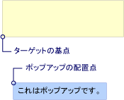  
HorizontalOffset と VerticalOffset を含むポップアップ  
  
   
## プロパティがどのように連携  
 値<xref:System.Windows.Controls.Primitives.Popup.PlacementTarget%2A>、 <xref:System.Windows.Controls.Primitives.Popup.PlacementRectangle%2A>、および<xref:System.Windows.Controls.Primitives.Popup.Placement%2A>か、適切なターゲットの領域、ターゲットの出発地とポップアップ配置ポイントを一緒に考慮する必要があります。  などの場合の値<xref:System.Windows.Controls.Primitives.Popup.Placement%2A>は<xref:System.Windows.Controls.Primitives.PlacementMode>、ターゲット オブジェクトが存在しない、 <xref:System.Windows.Controls.Primitives.Popup.PlacementRectangle%2A>は無視され、対象領域で、マウス ポインターの境界。 その一方で場合、<xref:System.Windows.Controls.Primitives.Popup.Placement%2A>は<xref:System.Windows.Controls.Primitives.PlacementMode>、 <xref:System.Windows.Controls.Primitives.Popup.PlacementTarget%2A>親は、ターゲット オブジェクトを決定したりと<xref:System.Windows.Controls.Primitives.Popup.PlacementRectangle%2A>対象領域を決定します。  
  
 次の表に、対象のオブジェクト、ターゲットの領域、ターゲットの基準、およびポップアップ配置ポイントを説明を示し、かどうか<xref:System.Windows.Controls.Primitives.Popup.PlacementTarget%2A>と<xref:System.Windows.Controls.Primitives.Popup.PlacementRectangle%2A>ごとに使用される<xref:System.Windows.Controls.Primitives.PlacementMode>列挙値。  
  
|PlacementMode|ターゲット オブジェクト|ターゲット領域|ターゲットの基準|ポップアップ配置ポイント|  
|-------------------|-------------------|-----------------|-------------------|---------------------------|  
|<xref:System.Windows.Controls.Primitives.PlacementMode>|該当なし。 <xref:System.Windows.Controls.Primitives.Popup.PlacementTarget%2A>は無視されます。|画面または<xref:System.Windows.Controls.Primitives.Popup.PlacementRectangle%2A>設定されている場合。  <xref:System.Windows.Controls.Primitives.Popup.PlacementRectangle%2A>画面に対する相対パスです。|対象となる領域の左上隅です。|左上隅、<xref:System.Windows.Controls.Primitives.Popup>します。|  
|<xref:System.Windows.Controls.Primitives.PlacementMode>|該当なし。 <xref:System.Windows.Controls.Primitives.Popup.PlacementTarget%2A>は無視されます。|画面または<xref:System.Windows.Controls.Primitives.Popup.PlacementRectangle%2A>設定されている場合。  <xref:System.Windows.Controls.Primitives.Popup.PlacementRectangle%2A>画面に対する相対パスです。|対象となる領域の左上隅です。|左上隅、<xref:System.Windows.Controls.Primitives.Popup>します。|  
|<xref:System.Windows.Controls.Primitives.PlacementMode>|<xref:System.Windows.Controls.Primitives.Popup.PlacementTarget%2A>または親。|ターゲット オブジェクトまたは<xref:System.Windows.Controls.Primitives.Popup.PlacementRectangle%2A>設定されている場合。  <xref:System.Windows.Controls.Primitives.Popup.PlacementRectangle%2A>ターゲット オブジェクトに対する相対パスです。|対象となる領域の左下隅です。|左上隅、<xref:System.Windows.Controls.Primitives.Popup>します。|  
|<xref:System.Windows.Controls.Primitives.PlacementMode>|<xref:System.Windows.Controls.Primitives.Popup.PlacementTarget%2A>または親。|ターゲット オブジェクトまたは<xref:System.Windows.Controls.Primitives.Popup.PlacementRectangle%2A>設定されている場合。  <xref:System.Windows.Controls.Primitives.Popup.PlacementRectangle%2A>ターゲット オブジェクトに対する相対パスです。|対象となる領域の中心です。|中央、<xref:System.Windows.Controls.Primitives.Popup>します。|  
|<xref:System.Windows.Controls.Primitives.PlacementMode>|<xref:System.Windows.Controls.Primitives.Popup.PlacementTarget%2A>または親。|ターゲット オブジェクトまたは<xref:System.Windows.Controls.Primitives.Popup.PlacementRectangle%2A>設定されている場合。  <xref:System.Windows.Controls.Primitives.Popup.PlacementRectangle%2A>ターゲット オブジェクトに対する相対パスです。|定義される、 <xref:System.Windows.Controls.Primitives.CustomPopupPlacementCallback>します。|定義される、 <xref:System.Windows.Controls.Primitives.CustomPopupPlacementCallback>します。|  
|<xref:System.Windows.Controls.Primitives.PlacementMode>|<xref:System.Windows.Controls.Primitives.Popup.PlacementTarget%2A>または親。|ターゲット オブジェクトまたは<xref:System.Windows.Controls.Primitives.Popup.PlacementRectangle%2A>設定されている場合。  <xref:System.Windows.Controls.Primitives.Popup.PlacementRectangle%2A>ターゲット オブジェクトに対する相対パスです。|対象となる領域の左上隅です。|右上隅、<xref:System.Windows.Controls.Primitives.Popup>します。|  
|<xref:System.Windows.Controls.Primitives.PlacementMode>|該当なし。 <xref:System.Windows.Controls.Primitives.Popup.PlacementTarget%2A>は無視されます。|マウス ポインターの境界。 <xref:System.Windows.Controls.Primitives.Popup.PlacementRectangle%2A>は無視されます。|対象となる領域の左下隅です。|左上隅、<xref:System.Windows.Controls.Primitives.Popup>します。|  
|<xref:System.Windows.Controls.Primitives.PlacementMode>|該当なし。 <xref:System.Windows.Controls.Primitives.Popup.PlacementTarget%2A>は無視されます。|マウス ポインターの境界。 <xref:System.Windows.Controls.Primitives.Popup.PlacementRectangle%2A>は無視されます。|対象となる領域の左上隅です。|左上隅、<xref:System.Windows.Controls.Primitives.Popup>します。|  
|<xref:System.Windows.Controls.Primitives.PlacementMode>|<xref:System.Windows.Controls.Primitives.Popup.PlacementTarget%2A>または親。|ターゲット オブジェクトまたは<xref:System.Windows.Controls.Primitives.Popup.PlacementRectangle%2A>設定されている場合。  <xref:System.Windows.Controls.Primitives.Popup.PlacementRectangle%2A>ターゲット オブジェクトに対する相対パスです。|対象となる領域の左上隅です。|左上隅、<xref:System.Windows.Controls.Primitives.Popup>します。|  
|<xref:System.Windows.Controls.Primitives.PlacementMode>|<xref:System.Windows.Controls.Primitives.Popup.PlacementTarget%2A>または親。|ターゲット オブジェクトまたは<xref:System.Windows.Controls.Primitives.Popup.PlacementRectangle%2A>設定されている場合。  <xref:System.Windows.Controls.Primitives.Popup.PlacementRectangle%2A>ターゲット オブジェクトに対する相対パスです。|対象となる領域の左上隅です。|左上隅、<xref:System.Windows.Controls.Primitives.Popup>します。|  
|<xref:System.Windows.Controls.Primitives.PlacementMode>|<xref:System.Windows.Controls.Primitives.Popup.PlacementTarget%2A>または親。|ターゲット オブジェクトまたは<xref:System.Windows.Controls.Primitives.Popup.PlacementRectangle%2A>設定されている場合。  <xref:System.Windows.Controls.Primitives.Popup.PlacementRectangle%2A>ターゲット オブジェクトに対する相対パスです。|対象となる領域の右上隅です。|左上隅、<xref:System.Windows.Controls.Primitives.Popup>します。|  
|<xref:System.Windows.Controls.Primitives.PlacementMode>|<xref:System.Windows.Controls.Primitives.Popup.PlacementTarget%2A>または親。|ターゲット オブジェクトまたは<xref:System.Windows.Controls.Primitives.Popup.PlacementRectangle%2A>設定されている場合。  <xref:System.Windows.Controls.Primitives.Popup.PlacementRectangle%2A>ターゲット オブジェクトに対する相対パスです。|対象となる領域の左上隅です。|左下隅、<xref:System.Windows.Controls.Primitives.Popup>します。|  
  
 次の図に示さ、<xref:System.Windows.Controls.Primitives.Popup>、対象となる領域、ターゲットの基準、およびポップアップ配置ポイントごとに<xref:System.Windows.Controls.Primitives.PlacementMode>値。 各図では、対象となる領域は黄色、および<xref:System.Windows.Controls.Primitives.Popup>は青です。  
  
 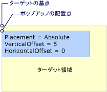  
Absolute または AbsolutePoint 配置が、します。  
  
 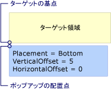  
配置は、下部にあります。  
  
 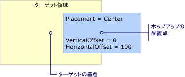  
配置はセンター  
  
 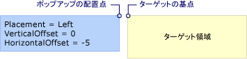  
配置は、左  
  
 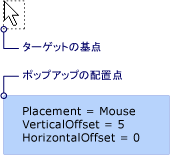  
配置は、マウス  
  
 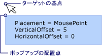  
配置は MousePoint  
  
   
Relative または RelativePoint 配置が、します。  
  
 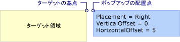  
配置は、右  
  
 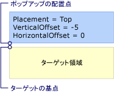  
一番上の配置  
  
   
## ポップアップが画面の端を検出した場合  
 セキュリティ上の理由、<xref:System.Windows.Controls.Primitives.Popup>画面の端で非表示にすることはできません。 次の&3; つのいずれかが発生時に、<xref:System.Windows.Controls.Primitives.Popup>画面の端が発生しました。  
  
-   ポップアップ ウィンドウが隠れてしまわないように画面の端に沿った realigns 自体、<xref:System.Windows.Controls.Primitives.Popup>します。  
  
-   別のポップアップ配置ポイントを使用します。  
  
-   別のターゲットの基準とポップアップ配置ポイントを使用します。  
  
 これらのオプションは、後でするこのセクションで詳しく説明します。  
  
 動作、<xref:System.Windows.Controls.Primitives.Popup>画面の端がの値に依存を見つけたときに、<xref:System.Windows.Controls.Primitives.Popup.Placement%2A>プロパティと画面の端のポップアップが発生しました。 次の表に、動作と、<xref:System.Windows.Controls.Primitives.Popup>各画面の端を検出した<xref:System.Windows.Controls.Primitives.PlacementMode>値。  
  
|PlacementMode|上端|下端|左端|右の端|  
|-------------------|--------------|-----------------|---------------|----------------|  
|<xref:System.Windows.Controls.Primitives.PlacementMode>|上端に揃えます。|下端に揃えます。|左端に揃えます。|右端に揃えます。|  
|<xref:System.Windows.Controls.Primitives.PlacementMode>|上端に揃えます。|左下隅にポップアップ配置ポイントを変更、<xref:System.Windows.Controls.Primitives.Popup>します。|左端に揃えます。|右上隅にポップアップ配置ポイントを変更、<xref:System.Windows.Controls.Primitives.Popup>します。|  
|<xref:System.Windows.Controls.Primitives.PlacementMode>|上端に揃えます。|ターゲットの基準が対象となる領域の左上隅に変更されの左下隅にポップアップ配置ポイントを変更、<xref:System.Windows.Controls.Primitives.Popup>します。|左端に揃えます。|右端に揃えます。|  
|<xref:System.Windows.Controls.Primitives.PlacementMode>|上端に揃えます。|下端に揃えます。|左端に揃えます。|右端に揃えます。|  
|<xref:System.Windows.Controls.Primitives.PlacementMode>|上端に揃えます。|下端に揃えます。|ターゲットの基準を対象となる領域の右上隅に変更し、ポップアップ配置ポイントに変更の左上隅、<xref:System.Windows.Controls.Primitives.Popup>します。|右端に揃えます。|  
|<xref:System.Windows.Controls.Primitives.PlacementMode>|上端に揃えます。|ターゲットの領域 (マウス ポインターの範囲) の左上隅にターゲットの基準が変わりの左下隅にポップアップ配置ポイントを変更、<xref:System.Windows.Controls.Primitives.Popup>します。|左端に揃えます。|右端に揃えます。|  
|<xref:System.Windows.Controls.Primitives.PlacementMode>|上端に揃えます。|左下隅にポップアップ配置ポイントを変更、<xref:System.Windows.Controls.Primitives.Popup>します。|左端に揃えます。|ポップアップの配置は、変更をポップアップの右上隅をポイントします。|  
|<xref:System.Windows.Controls.Primitives.PlacementMode>|上端に揃えます。|下端に揃えます。|左端に揃えます。|右端に揃えます。|  
|<xref:System.Windows.Controls.Primitives.PlacementMode>|上端に揃えます。|左下隅にポップアップ配置ポイントを変更、<xref:System.Windows.Controls.Primitives.Popup>します。|左端に揃えます。|ポップアップの配置は、変更をポップアップの右上隅をポイントします。|  
|<xref:System.Windows.Controls.Primitives.PlacementMode>|上端に揃えます。|下端に揃えます。|左端に揃えます。|ターゲットの基準が対象となる領域の左上隅に変更されの右上隅にポップアップ配置ポイントを変更、<xref:System.Windows.Controls.Primitives.Popup>します。|  
|<xref:System.Windows.Controls.Primitives.PlacementMode>|ターゲットの基準が対象となる領域の左下隅に変更されの左上隅にポップアップ配置ポイントを変更、<xref:System.Windows.Controls.Primitives.Popup>します。 これは有効にする場合と同じ<xref:System.Windows.Controls.Primitives.Popup.Placement%2A>は<xref:System.Windows.Controls.Primitives.PlacementMode>します。|下端に揃えます。|左端に揃えます。|右端に揃えます。|  
  
### 画面の端の整列  
 A<xref:System.Windows.Controls.Primitives.Popup>に揃えて配置できます、画面の端にので自体を再配置して全体<xref:System.Windows.Controls.Primitives.Popup>画面に表示されます。  値からターゲットの基準とポップアップ配置ポイント間の距離が異なる場合がありますこのとき、 <xref:System.Windows.Controls.Primitives.Popup.HorizontalOffset%2A>と<xref:System.Windows.Controls.Primitives.Popup.VerticalOffset%2A>します。 <xref:System.Windows.Controls.Primitives.Popup.Placement%2A>は<xref:System.Windows.Controls.Primitives.PlacementMode>、 <xref:System.Windows.Controls.Primitives.PlacementMode>、または<xref:System.Windows.Controls.Primitives.PlacementMode>、<xref:System.Windows.Controls.Primitives.Popup>自体をすべて画面端に配置します。  たとえば、あると想定して、<xref:System.Windows.Controls.Primitives.Popup>が<xref:System.Windows.Controls.Primitives.Popup.Placement%2A>に設定<xref:System.Windows.Controls.Primitives.PlacementMode>と<xref:System.Windows.Controls.Primitives.Popup.VerticalOffset%2A>を 100 に設定します。  画面の下端の全部または一部を非表示にする場合、<xref:System.Windows.Controls.Primitives.Popup>、<xref:System.Windows.Controls.Primitives.Popup>自体を再配置、画面とターゲットの基準とポップアップの垂直方向の距離の下端に沿って配置ポイントには 100 未満です。 次の図では、これを示します。  
  
 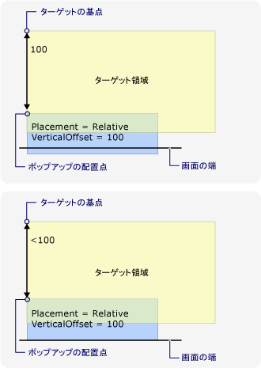  
ポップアップが画面の端に配置します。  
  
### ポップアップ配置ポイントを変更します。  
 場合<xref:System.Windows.Controls.Primitives.Popup.Placement%2A>は<xref:System.Windows.Controls.Primitives.PlacementMode>、 <xref:System.Windows.Controls.Primitives.PlacementMode>、または<xref:System.Windows.Controls.Primitives.PlacementMode>、ポップアップ配置ポイントが下または右側の画面の端を検出すると、ポップアップを変更します。  
  
 ときに、画面の下端の全部または一部を非表示にすると、次の図は、プログラムことを示します、<xref:System.Windows.Controls.Primitives.Popup>、ポップアップ配置ポイントの左下隅は、<xref:System.Windows.Controls.Primitives.Popup>します。  
  
 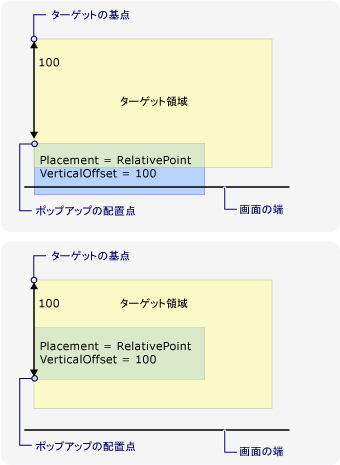  
ポップアップは画面の下端を検出し、ポップアップ配置ポイントを変更  
  
 次の図に示す時に、<xref:System.Windows.Controls.Primitives.Popup>を非表示にポップアップ配置ポイントの右上隅を画面の右端で、<xref:System.Windows.Controls.Primitives.Popup>します。  
  
 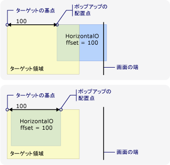  
ポップアップは画面の右端を検出し、ポップアップ配置ポイントを変更  
  
 場合、<xref:System.Windows.Controls.Primitives.Popup>下部と画面の右端のエッジが発生したポップアップ配置ポイントは、の右下隅、<xref:System.Windows.Controls.Primitives.Popup>します。  
  
### ターゲットの基準とポップアップ配置ポイントを変更します。  
 ときに<xref:System.Windows.Controls.Primitives.Popup.Placement%2A>は<xref:System.Windows.Controls.Primitives.PlacementMode>、<xref:System.Windows.Controls.Primitives.PlacementMode>、<xref:System.Windows.Controls.Primitives.PlacementMode>、<xref:System.Windows.Controls.Primitives.PlacementMode>、または<xref:System.Windows.Controls.Primitives.PlacementMode>、特定の画面の端が発生した場合、ターゲットの基準とポップアップの配置が変更をポイントします。  位置を変更すると、画面の端が異なります、 <xref:System.Windows.Controls.Primitives.PlacementMode>値。  
  
 次の図に示す時に<xref:System.Windows.Controls.Primitives.Popup.Placement%2A>は<xref:System.Windows.Controls.Primitives.PlacementMode>と<xref:System.Windows.Controls.Primitives.Popup>下部にある画面の端を検出したターゲットの基準は、対象となる領域の左上隅で、ポップアップ配置ポイントの左下隅、<xref:System.Windows.Controls.Primitives.Popup>します。  
  
 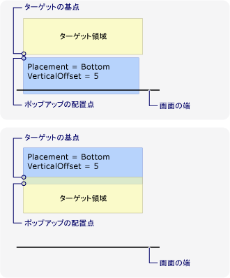  
配置は、下部にあると、ポップアップが画面の下端を検出しました。  
  
 次の図をすることを示しています<xref:System.Windows.Controls.Primitives.Popup.Placement%2A>は<xref:System.Windows.Controls.Primitives.PlacementMode>と<xref:System.Windows.Controls.Primitives.Popup>画面の左端を検出したターゲットの基準は、対象となる領域の右上隅で、ポップアップ配置ポイントの左上隅、<xref:System.Windows.Controls.Primitives.Popup>します。  
  
 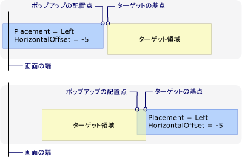  
配置は、左とポップアップが画面の左端を検出しました。  
  
 次の図をすることを示しています<xref:System.Windows.Controls.Primitives.Popup.Placement%2A>は<xref:System.Windows.Controls.Primitives.PlacementMode>と<xref:System.Windows.Controls.Primitives.Popup>画面の右端を検出したターゲットの基準は、対象となる領域の左上隅で、ポップアップ配置ポイントの右上隅、<xref:System.Windows.Controls.Primitives.Popup>します。  
  
 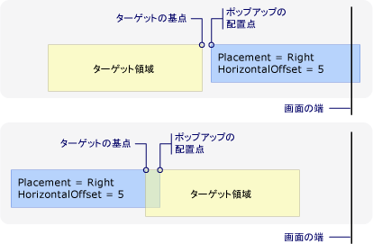  
配置が右で、ポップアップが画面の右端を検出しました。  
  
 次の図をすることを示しています<xref:System.Windows.Controls.Primitives.Popup.Placement%2A>は<xref:System.Windows.Controls.Primitives.PlacementMode>と<xref:System.Windows.Controls.Primitives.Popup>画面の上端を検出したターゲットの基準は、対象となる領域の左下隅で、ポップアップ配置ポイントの左上隅、<xref:System.Windows.Controls.Primitives.Popup>します。  
  
 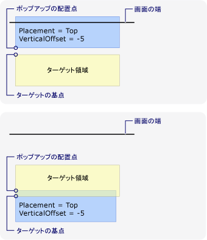  
配置は、上と、ポップアップが画面の上端を検出しました。  
  
 次の図に示す時に<xref:System.Windows.Controls.Primitives.Popup.Placement%2A>は<xref:System.Windows.Controls.Primitives.PlacementMode>と<xref:System.Windows.Controls.Primitives.Popup>下部にある画面の端を検出したターゲットの基準 (マウス ポインターの範囲) の対象となる領域の左上隅で、ポップアップ配置ポイントの左下隅、<xref:System.Windows.Controls.Primitives.Popup>します。  
  
 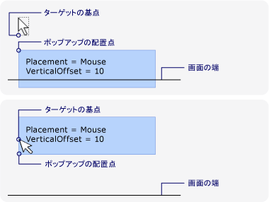  
配置は、マウスとポップアップが画面の下端を検出しました。  
  
### ポップアップの配置をカスタマイズします。  
 ターゲットの基準とポップアップ配置ポイントをカスタマイズするには設定して、<xref:System.Windows.Controls.Primitives.Popup.Placement%2A>プロパティを<xref:System.Windows.Controls.Primitives.PlacementMode>します。 定義し、 <xref:System.Windows.Controls.Primitives.CustomPopupPlacementCallback>のような配置ポイントと (優先順位) でプライマリ軸のセットを返すデリゲート、<xref:System.Windows.Controls.Primitives.Popup>します。 ポイントの最大の部分を示す、<xref:System.Windows.Controls.Primitives.Popup>が選択されています。  位置、<xref:System.Windows.Controls.Primitives.Popup>場合に自動的に調整、<xref:System.Windows.Controls.Primitives.Popup>は画面の端で非表示です。 例については、次を参照してください。[カスタム ポップアップの位置を指定する](../../../../docs/framework/wpf/controls/how-to-specify-a-custom-popup-position.md)です。  
  
## 関連項目  
 [ポップアップの配置のサンプル](http://go.microsoft.com/fwlink/?LinkID=160032)