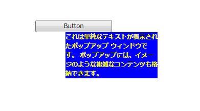

# ポップアップ
<xref:System.Windows.Controls.Primitives.Popup>コントロールは、現在のアプリケーション ウィンドウで別のウィンドウでコンテンツを表示します。  
  
 次の図は、<xref:System.Windows.Controls.Primitives.Popup>に関連する配置されるコントロール、<xref:System.Windows.Controls.Button>親されています。  
  
   
  
## このセクションの内容  
 [ポップアップの概要](../../../../docs/framework/wpf/controls/popup-overview.md)  
 [ポップアップの配置動作](../../../../docs/framework/wpf/controls/popup-placement-behavior.md)  
 [方法トピック](../../../../docs/framework/wpf/controls/popup-how-to-topics.md)  
  
## 参照  
 <xref:System.Windows.Controls.Primitives.Popup>  
  
## 関連項目
