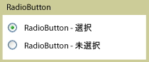

# RadioButton
<xref:System.Windows.Controls.RadioButton> コントロールがいくつかのオプション間で 1 つの選択肢をユーザーに提供を一緒にグループ化通常一度に 1 つだけのボタンを選択することができます。  
  
 次の図の例を示します、<xref:System.Windows.Controls.RadioButton>コントロール。  
  
   
通常の RadioButton  
  
## 参照  
 <xref:System.Windows.Controls.Primitives.ToggleButton>  
  
## 関連項目
