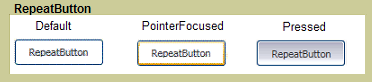

# RepeatButtonRepeatButton
<xref:System.Windows.Controls.Primitives.RepeatButton>に似ていますが、<xref:System.Windows.Controls.Button>です。The <xref:System.Windows.Controls.Primitives.RepeatButton> is similar to a <xref:System.Windows.Controls.Button>. ただし、<xref:System.Windows.Controls.Primitives.RepeatButton>タイミングを制御する要素のこととどのように<xref:System.Windows.Controls.Primitives.ButtonBase.Click>イベントが発生します。However, <xref:System.Windows.Controls.Primitives.RepeatButton> elements give you control over when and how the <xref:System.Windows.Controls.Primitives.ButtonBase.Click> event occurs.  
  
 次の図は、[繰り返し] ボタン コントロール、Default、PointerFocused、および押されましたの 3 つの状態の例を示します。The following graphic shows an example of the three states of a repeat button control, Default, PointerFocused, and Pressed. 最初のボタンの既定の状態を示しています、<xref:System.Windows.Controls.Primitives.RepeatButton>です。The first button shows the default state of the <xref:System.Windows.Controls.Primitives.RepeatButton>. 2 つ目は、フォーカスを与える、マウス ポインターが、ボタン上に置いたときに、ボタンの外観がどのように変化するかを示します。The second shows how the appearance of the button changes when the mouse pointer hovers over the button, giving it focus. 最後のボタンの外観を示しています、<xref:System.Windows.Controls.Primitives.RepeatButton>ユーザーがコントロール上でマウス ボタンを押したときです。The last button shows the appearance of the <xref:System.Windows.Controls.Primitives.RepeatButton> when the user presses the mouse button over the control.  
  
   
一般的な RepeatButtonTypical RepeatButton  
  
## このセクションの内容In This Section  
  
## 参照Reference  
 <xref:System.Windows.Controls.Primitives.RepeatButton>  
  
## 関連項目Related Sections
