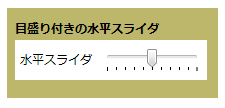

# スライダー
<xref:System.Windows.Controls.Slider>移動することによって、値の範囲から選択できます、<xref:System.Windows.Controls.Primitives.Thumb>に沿って、<xref:System.Windows.Controls.Primitives.Track>です。  
  
 次の図は、水平方向の例を示します<xref:System.Windows.Controls.Slider>コントロール。  
  
   
  
## このセクションの内容  
 [スライダーの目盛りをカスタマイズする](../../../../docs/framework/wpf/controls/how-to-customize-the-ticks-on-a-slider.md)  
  
## 参照  
 <xref:System.Windows.Controls.Slider>  
  <xref:System.Windows.Controls.Primitives.Track>  
  <xref:System.Windows.Controls.Primitives.Thumb>
