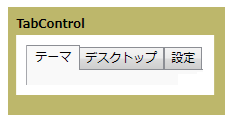

# TabControl
<xref:System.Windows.Controls.TabControl> 要素は、独立した複数のページにコンテンツを表示します。各ページには、それぞれのタブをクリックしてアクセスします。  各タブには、<xref:System.Windows.Controls.TabItem> が含まれます。  
  
 次の図は、<xref:System.Windows.Controls.TabControl> を示しています。  
  
   
典型的な TabControl  
  
## 関連項目  
 <xref:System.Windows.Controls.TabControl>  
 <xref:System.Windows.Controls.TabItem>  
  
## 関連項目