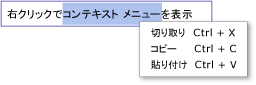

# TextBox の概要
<xref:System.Windows.Controls.TextBox>クラスを使用する書式設定されていないテキストを表示または編集します。 一般的な用途、<xref:System.Windows.Controls.TextBox>形式で書式設定されていないテキストを編集します。 たとえば、ユーザーの名前、電話番号の入力を求めるフォームなど使用<xref:System.Windows.Controls.TextBox>のテキスト入力コントロール。 このトピックでは、<xref:System.Windows.Controls.TextBox>クラスし、両方で使用する方法の例を示します[!INCLUDE[TLA#tla_xaml](../../../../includes/tlasharptla-xaml-md.md)]と C# の場合。  
  
 
  
   
## TextBox か RichTextBox か  
 両方<xref:System.Windows.Controls.TextBox>と<xref:System.Windows.Controls.RichTextBox>テキストを入力するユーザーが、2 つのコントロールは、さまざまなシナリオのために使用します。 A<xref:System.Windows.Controls.TextBox>システム リソースが必要です、<xref:System.Windows.Controls.RichTextBox>ので適してプレーン テキストのみを編集する必要がある場合 (つまり、フォームで使用)。 A<xref:System.Windows.Controls.RichTextBox>は適して場合に書式付きテキスト、画像、テーブル、編集するユーザーの必要があるか、サポートされているその他のコンテンツ。 たとえば、画像、ドキュメント、アーティクル、または書式設定を必要とするブログを編集などの使用が最も適切な<xref:System.Windows.Controls.RichTextBox>します。 次の表の主な機能をまとめたもの<xref:System.Windows.Controls.TextBox>と<xref:System.Windows.Controls.TextBox>です。  
  
|コントロール|リアルタイム スペル チェック|コンテキスト メニュー|ようなコマンドの書式設定<xref:System.Windows.Documents.EditingCommands.ToggleBold%2A>(範囲 + B)|<xref:System.Windows.Documents.FlowDocument> イメージ、段落、テーブルなどのコンテンツ。|  
|-------------|------------------------------|------------------|------------------------------------------------------------------------------------------------------------------------------------------------------------------------------------------------------|--------------------------------------------------------------------------------------------------------------------------------------------------------------------------------------------------|  
|<xref:System.Windows.Controls.TextBox>|[はい]|はい|×|いいえ。|  
|<xref:System.Windows.Controls.RichTextBox>|[はい]|[はい]|はい (「[RichTextBox の概要](../../../../docs/framework/wpf/controls/richtextbox-overview.md)」を参照)|はい (「[RichTextBox の概要](../../../../docs/framework/wpf/controls/richtextbox-overview.md)」を参照)|  
  
> [!NOTE]
>  <xref:System.Windows.Controls.TextBox>のようなコマンドを関連する編集の書式設定をサポートしない機能は<xref:System.Windows.Documents.EditingCommands.ToggleBold%2A>(範囲 + B)、多くの基本的なコマンドがなどの両方のコントロールでサポートされて<xref:System.Windows.Documents.EditingCommands.MoveToLineEnd%2A>です。 詳細については、「<xref:System.Windows.Documents.EditingCommands>」を参照してください。  
  
 サポートされる機能<xref:System.Windows.Controls.TextBox>は以下のセクションで説明します。 詳細については<xref:System.Windows.Controls.RichTextBox>を参照してください[RichTextBox 概要](../../../../docs/framework/wpf/controls/richtextbox-overview.md)です。  
  
### リアルタイム スペル チェック  
 リアルタイムのスペル チェックを有効にすることができます、<xref:System.Windows.Controls.TextBox>または<xref:System.Windows.Controls.RichTextBox>です。 スペル チェックをオンにすると、スペル ミスの語句の下に赤色の線が表示されます (下図を参照)。  
  
   
  
 スペル チェックを有効にする方法については、「[テキスト編集コントロールでスペル チェックを有効にする](../../../../docs/framework/wpf/controls/how-to-enable-spell-checking-in-a-text-editing-control.md)」を参照してください。  
  
### コンテキスト メニュー  
 既定では、両方とも<xref:System.Windows.Controls.TextBox>と<xref:System.Windows.Controls.RichTextBox>コントロール内にユーザーを右クリックしたときに表示されるコンテキスト メニューが表示されます。 コンテキスト メニューでは、切り取り、コピー、または貼り付けをできます (下図を参照)。  
  
   
  
 既定の動作をオーバーライドする独自のカスタム コンテキスト メニューを作成できます。 詳細については、「[TextBox でカスタム コンテキスト メニューを使用する](../../../../docs/framework/wpf/controls/how-to-use-a-custom-context-menu-with-a-textbox.md)」を参照してください。  
  
   
## TextBox の作成  
 A<xref:System.Windows.Controls.TextBox>する 1 つの行の高さまたは複数行を構成することができます。 1 行<xref:System.Windows.Controls.TextBox>(つまり、少量のプレーン テキストの入力に最適な「名前」、「電話番号」などのフォームへの入力)。 次の例は、1 行を作成する方法を示しています。<xref:System.Windows.Controls.TextBox>です。  
  
 [!code-xaml[TextBoxMiscSnippets_snip#BasicTextBoxExampleWholePage](../../../../samples/snippets/csharp/VS_Snippets_Wpf/TextBoxMiscSnippets_snip/csharp/basictextboxexample.xaml#basictextboxexamplewholepage)]  
  
 作成することも、<xref:System.Windows.Controls.TextBox>複数行のテキストを入力することができます。 たとえば、ユーザーの経歴のフォームが要求された場合、使用する、<xref:System.Windows.Controls.TextBox>複数行のテキストをサポートします。 次の例は、使用する方法を示しています。[!INCLUDE[TLA#tla_xaml](../../../../includes/tlasharptla-xaml-md.md)]を定義する、<xref:System.Windows.Controls.TextBox>複数行のテキストに合わせて自動的に拡張するコントロール。  
  
 [!code-xaml[TextBox_MiscCode#_MultilineTextBoxXAML](../../../../samples/snippets/csharp/VS_Snippets_Wpf/TextBox_MiscCode/CSharp/Window1.xaml#_multilinetextboxxaml)]  
  
 設定、<xref:System.Windows.Controls.TextBox.TextWrapping%2A>属性を`Wrap`により新しいをラップするテキストの行の端、<xref:System.Windows.Controls.TextBox>コントロールに達すると、自動的に拡大、<xref:System.Windows.Controls.TextBox>コントロールに必要な場合、新しい行のスペースを含めます。  
  
 設定、<xref:System.Windows.Controls.Primitives.TextBoxBase.AcceptsReturn%2A>属性を`true`RETURN キーを押すと、自動的にもう一度拡張に挿入される新しい行をにより、<xref:System.Windows.Controls.TextBox>に必要な場合、新しい行のスペースを含めます。  
  
 <xref:System.Windows.Controls.Primitives.TextBoxBase.VerticalScrollBarVisibility%2A>属性によって、スクロール バーを表示、追加、<xref:System.Windows.Controls.TextBox>いるための内容、<xref:System.Windows.Controls.TextBox>できますスクロールできる場合は、<xref:System.Windows.Controls.TextBox>フレームまたはそれを囲むウィンドウのサイズよりも大ききます。  
  
 使用してに関連付けられているさまざまなタスクの詳細については、<xref:System.Windows.Controls.TextBox>を参照してください[方法に関するトピック](../../../../docs/framework/wpf/controls/textbox-how-to-topics.md)です。  
  
   
## 内容が変更されたときに検出する  
 通常、<xref:System.Windows.Controls.Primitives.TextBoxBase.TextChanged>を検出するたびにイベントを使用する必要があります内のテキスト、<xref:System.Windows.Controls.TextBox>または<xref:System.Windows.Controls.RichTextBox>変更ではなく<xref:System.Windows.UIElement.KeyDown>想定される場合があります。 例については、「[TextBox のテキストがいつ変更されたかを検出する](../../../../docs/framework/wpf/controls/how-to-detect-when-text-in-a-textbox-has-changed.md)」を参照してください。  
  
## 関連項目  
 [方法トピック](../../../../docs/framework/wpf/controls/textbox-how-to-topics.md)  
 [RichTextBox の概要](../../../../docs/framework/wpf/controls/richtextbox-overview.md)
