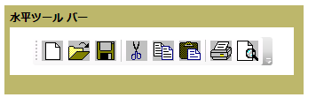
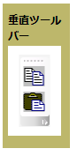

# ToolBar
<xref:System.Windows.Controls.ToolBar>コントロールは、コマンドまたは通常、その機能に関連するコントロールのグループのコンテナーです。  
  
 水平および垂直方向に次の図が示して<xref:System.Windows.Controls.ToolBar>コントロール。  
  
   
水平ツールバー  
  
   
垂直ツールバー  
  
## このセクションの内容  
 [ToolBar の概要](../../../../docs/framework/wpf/controls/toolbar-overview.md)  
  [ToolBar のコントロールのスタイルを設定する](../../../../docs/framework/wpf/controls/how-to-style-controls-on-a-toolbar.md)  
  
## 参照  
 <xref:System.Windows.Controls.ToolBar>  
  <xref:System.Windows.Controls.ToolBarTray>  
  
## 関連項目
