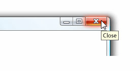

# ヒント
ツールヒントは、ユーザーなどを超えると、要素の上にマウス ポインターを置いたときに表示される小さいポップアップ ウィンドウ、<xref:System.Windows.Controls.Button>です。  
  
 次の図に、マウス ポインターが指す、**閉じる**<xref:System.Windows.Controls.Button>、そのを識別する、次の表示<xref:System.Windows.Controls.ToolTip>です。  
  
 ツールヒントが表示された [閉じる] ボタン  
  
   
  
## このセクションの内容  
 [ToolTip の概要](../../../../docs/framework/wpf/controls/tooltip-overview.md)  
  [方法トピック](../../../../docs/framework/wpf/controls/tooltip-how-to-topics.md)  
  
## 参照  
 <xref:System.Windows.Controls.ToolTip>  
  <xref:System.Windows.Controls.ToolTipService>  
  <xref:System.Windows.Controls.Primitives.Popup>  
  
## 関連項目  
 [ポップアップの概要](../../../../docs/framework/wpf/controls/popup-overview.md)  
  [方法トピック](../../../../docs/framework/wpf/controls/popup-how-to-topics.md)
