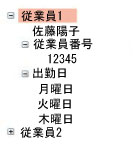

# TreeView
<xref:System.Windows.Controls.TreeView>コントロールは、折りたたみ可能なノードを使用して、階層構造で情報を表示します。  
  
 次の図の例に示します、<xref:System.Windows.Controls.TreeView>に入れ子になったコントロール<xref:System.Windows.Controls.TreeViewItem>コントロール。  
  
   
  
## このセクションの内容  
 [TreeView の概要](../../../../docs/framework/wpf/controls/treeview-overview.md)  
 [方法トピック](../../../../docs/framework/wpf/controls/treeview-how-to-topics.md)  
  
## 参照  
 <xref:System.Windows.Controls.TreeView>  
  <xref:System.Windows.Controls.TreeViewItem>  
  
## 関連項目  
 [データ バインディングの概要](../../../../docs/framework/wpf/data/data-binding-overview.md)  
  [データ テンプレートの概要](../../../../docs/framework/wpf/data/data-templating-overview.md)
