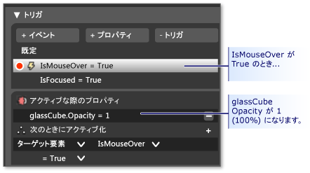

# チュートリアル : Microsoft Expression Blend を使用してボタンを作成する
このチュートリアルでは、[!INCLUDE[TLA2#tla_wpf](../../../../includes/tla2sharptla-wpf-md.md)] のカスタマイズされたボタンを Microsoft Expression Blend を使用して作成する手順について説明します。  
  
> [!IMPORTANT]
>  Microsoft Expression Blend の具体的な動作は [!INCLUDE[TLA#tla_xaml](../../../../includes/tlasharptla-xaml-md.md)] の生成で、これがコンパイルされ、実行可能プログラムが作成されます。  [!INCLUDE[TLA#tla_xaml](../../../../includes/tlasharptla-xaml-md.md)] を直接扱う場合については、[!INCLUDE[TLA#tla_xaml](../../../../includes/tlasharptla-xaml-md.md)] を Blend ではなく [!INCLUDE[vs_current_short](../../../../includes/vs-current-short-md.md)] を使用して、これと同じアプリケーションを作成する別のチュートリアルが用意されています。  詳細については、「[XAML を使用したボタンの作成](../../../../docs/framework/wpf/controls/walkthrough-create-a-button-by-using-xaml.md)」を参照してください。  
  
 これから作成する、カスタマイズされたボタンを次の図に示します。  
  
   
  
## 図形からボタンへの変換  
 このチュートリアルの前半では、カスタム ボタンの独自の外観を作成します。  作成するには、まず四角形をボタンに変換します。  次に、他の図形をボタンのテンプレートに追加し、より複雑な外観のボタンを作成します。  ここでは、通常のボタンを使用してカスタマイズします。  ボタンには今回は使用しない組み込み機能があるので、カスタム ボタンを作成するには、四角形から始める方が簡単です。  
  
#### Expression Blend で新しいプロジェクトを作成するには  
  
1.  Expression Blend を起動します   \(**\[スタート\]** をクリックし、**\[すべてのプログラム\]**、**\[Microsoft Expression\]**、**\[Microsoft Expression Blend\]** の順にポイントします\)。  
  
2.  必要に応じて、アプリケーションを最大化します。  
  
3.  **\[ファイル\]** メニューの **\[新しいプロジェクト\]** をクリックします。  
  
4.  **\[標準アプリケーション \(.exe\)\]** を選択します。  
  
5.  プロジェクトの名前を「`CustomButton`」と指定して、**\[OK\]** をクリックします。  
  
 この時点で、空の [!INCLUDE[TLA2#tla_wpf](../../../../includes/tla2sharptla-wpf-md.md)] プロジェクトができます。  F5 キーを押すと、アプリケーションを実行できます。  予想どおり、アプリケーションは空のウィンドウのみで構成されていることがわかります。  次に、角の丸い四角形を作成し、それをボタンに変換します。  
  
#### 四角形をボタンに変換するには  
  
1.  **ウィンドウの背景プロパティを黒に設定します。**ウィンドウを選択して **\[プロパティ\]** タブをクリックし、<xref:System.Windows.Controls.Control.Background%2A> プロパティを `Black` に設定します。  
  
       
  
2.  **大きさがボタンのサイズに近い四角形をウィンドウ上に描画します。**左側のツール パネルで四角形ツールを選択し、ウィンドウ上でドラッグして四角形を描画します。  
  
       
  
3.  **四角形の四隅を丸めます。**四角形の制御点をドラッグするか、<xref:System.Windows.Shapes.Rectangle.RadiusX%2A> プロパティと <xref:System.Windows.Shapes.Rectangle.RadiusY%2A> プロパティを直接設定します。  <xref:System.Windows.Shapes.Rectangle.RadiusX%2A> と <xref:System.Windows.Shapes.Rectangle.RadiusY%2A> の値を 20 に設定します。  
  
       
  
4.  **四角形をボタンに変換します。**四角形を選択します。  **\[ツール\]** メニューの **\[ボタンの作成\]** をクリックします。  
  
       
  
5.  **スタイル\/テンプレートのスコープを指定します。**次のようなダイアログ ボックスが表示されます。  
  
       
  
     **\[リソース名 \(キー\)\]** で、**\[すべてに適用\]** を選択します。  これにより、生成されるスタイルとボタン テンプレートが、ボタンであるすべてのオブジェクトに適用されます。  **\[定義元\]** で、**\[アプリケーション\]** を選択します。  これにより、生成されるスタイルとボタン テンプレートのスコープが、アプリケーション全体になります。  この 2 つのボックスに値を設定すると、ボタンのスタイルとテンプレートはアプリケーション全体に含まれるすべてのボタンに適用され、アプリケーションで作成するボタンには既定でこのテンプレートが使用されます。  
  
## ボタン テンプレートの編集  
 現在、ボタンに変更された四角形があります。  このセクションでは、ボタンのテンプレートを変更して、外観をさらにカスタマイズします。  
  
#### ボタンの外観を変更するためにボタン テンプレートを編集するには  
  
1.  **テンプレートの表示ビューに移動します。**ボタンの外観をさらにカスタマイズするには、ボタン テンプレートを編集する必要があります。  このテンプレートは、四角形をボタンに変換したときに作成されました。  ボタン テンプレートを編集するには、ボタンを右クリックし、**\[コントロール パーツ \(テンプレート\) の編集\]**、**\[テンプレートの編集\]** の順にクリックします。  
  
       
  
     テンプレート エディターでは、ボタンが <xref:System.Windows.Shapes.Rectangle> と <xref:System.Windows.Controls.ContentPresenter> に分離されています。  <xref:System.Windows.Controls.ContentPresenter> は、ボタン内のコンテンツ \(文字列 "Button" など\) の表示に使用します。  四角形と <xref:System.Windows.Controls.ContentPresenter> はどちらも <xref:System.Windows.Controls.Grid> の内側に配置されます。  
  
       
  
2.  **テンプレート コンポーネントの名前を変更します。**テンプレート インベントリで四角形を右クリックし、<xref:System.Windows.Shapes.Rectangle> 名を "\[Rectangle\]" から "outerRectangle" に変更し、"\[ContentPresenter\]" を "myContentPresenter" に変更します。  
  
       
  
3.  **中が空洞になるよう \(ドーナツのように\) 四角形を変更します。** **\[outerRectangle\]** を選択し、<xref:System.Windows.Shapes.Shape.Fill%2A> を "Transparent" に設定し、<xref:System.Windows.Shapes.Shape.StrokeThickness%2A> を 5 に設定します。  
  
       
  
     次に、<xref:System.Windows.Shapes.Shape.Stroke%2A> にテンプレートの色を設定します。  これを行うには、**\[ストローク\]** の横にある小さな白いボックスをクリックし、**\[CustomExpression\]** を選択し、ダイアログ ボックスに「{TemplateBinding Background}」と入力します。  
  
       
  
4.  **内側の四角形を作成します。**次に、四角形をもう 1 つ作成し \("innerRectangle" という名前を付けます\)、それを **outerRectangle** の内側に対称になるように配置します。  このような場合、ズームを使用して編集領域に表示されるボタンを大きくすると、作業しやすくなります。  
  
    > [!NOTE]
    >  作成している四角形は、図のものと外観が異なっている場合があります \(角が丸くなっているなど\)。  
  
       
  
5.  **ContentPresenter を最前面に移動します。**この時点で、テキスト "Button" が表示されなくなることがあります。  これは、**innerRectangle** が **myContentPresenter** より前面にあるためです。  これを解消するには、**myContentPresenter** を **innerRectangle** の下にドラッグします。  四角形や **myContentPresenter** の位置を変更して、次のようにします。  
  
    > [!NOTE]
    >  また、**myContentPresenter** は、右クリックして **\[前面へ移動\]** をクリックすることで、前面に配置することもできます。  
  
       
  
6.  **innerRectangle の外観を変更します。** <xref:System.Windows.Shapes.Rectangle.RadiusX%2A>、<xref:System.Windows.Shapes.Rectangle.RadiusY%2A>、および <xref:System.Windows.Shapes.Shape.StrokeThickness%2A> の値を 20 に設定します。  また、<xref:System.Windows.Shapes.Shape.Fill%2A> をカスタム式 "{TemplateBinding Background}" を使用してテンプレートの背景に設定し、<xref:System.Windows.Shapes.Shape.Stroke%2A> を "transparent" に設定します。  **innerRectangle** の <xref:System.Windows.Shapes.Shape.Fill%2A> と <xref:System.Windows.Shapes.Shape.Stroke%2A> が **outerRectangle** とは逆になっていることを確認します。  
  
       
  
7.  **グラス レイヤーを前面に追加します。**ボタンの外観変更の最後の手順は、グラス レイヤーを前面に追加することです。  このグラス レイヤーは、3 つ目の四角形です。  グラスはボタン全体を覆うため、グラス四角形のサイズは **outerRectangle** とほとんど同じになります。  したがって、この四角形を作成するには、単純に **outerRectangle** のコピーを作成します。  **outerRectangle** を強調表示し、Ctrl \+ C と Ctrl \+ V でコピーを作成します。  この新しい四角形の名前を "glassCube" と指定します。  
  
8.  **必要に応じて glassCube 位置を変更します。** **glassCube** がボタンを覆う位置にない場合は、覆う位置までドラッグします。  
  
9. **glassCube に outerRectangle とは少しだけ異なる外観を指定します。** **glassCube** のプロパティを変更します。  まず、<xref:System.Windows.Shapes.Rectangle.RadiusX%2A> プロパティと <xref:System.Windows.Shapes.Rectangle.RadiusY%2A> プロパティを 10 に変更し、<xref:System.Windows.Shapes.Shape.StrokeThickness%2A> を 2 に変更します。  
  
       
  
10. **glassCube をグラスのような外観にします。** <xref:System.Windows.Shapes.Shape.Fill%2A> をグラスのような外観にするには、75% 不透明の線形グラデーションを使用し、色は白と透明とをほとんど同じような間隔で 6 回交互に入れ替えます。  グラデーション終了位置の設定値は次のようになります。  
  
    -   グラデーション終了位置 1: 白、アルファ値 75%  
  
    -   グラデーション終了位置 2: 透明  
  
    -   グラデーション終了位置 3: 白、アルファ値 75%  
  
    -   グラデーション終了位置 4: 透明  
  
    -   グラデーション終了位置 5: 白、アルファ値 75%  
  
    -   グラデーション終了位置 6: 透明  
  
     これで、"波打つ" グラスの外観になります。  
  
       
  
11. **グラス レイヤーを非表示にします。**グラスのようなレイヤーの外観はこれで確認できたので、**\[プロパティ\] パネル**の **\[表示\] ペイン**に移動し、\[不透明度\] を 0% にして非表示にします。  ここから先では、グラス レイヤーを操作するのに、プロパティ トリガーとイベントを使用します。  
  
       
  
## ボタン動作のカスタマイズ  
 この時点で、ボタンのプレゼンテーションはテンプレートの変更によってカスタマイズされていますが、マウスオーバーによる外観の変化、フォーカスの受け取り、クリックなどのユーザー操作に対して、通常のボタンのような反応はしません。次の 2 つの手順で、こうした動作をカスタム ボタンに組み込む方法を説明します。  まず、簡単なプロパティ トリガーを使用し、その後にイベント トリガーやアニメーションを追加します。  
  
#### プロパティ トリガーを設定するには  
  
1.  **新しいプロパティ トリガーを作成します。** **\[glassCube\]** が選択された状態で、**\[トリガー\]** パネルで **\[\+ プロパティ\]** をクリックします \(次の手順の下の図を参照してください\)。  これにより、既定のプロパティ トリガーを持つプロパティ トリガーが作成されます。  
  
2.  **IsMouseOver をトリガーによって使用されるプロパティにします。**プロパティを <xref:System.Windows.UIElement.IsMouseOver%2A> に変更します。  これにより、<xref:System.Windows.UIElement.IsMouseOver%2A> プロパティが `true` になる \(ユーザーがマウスでボタンをポイントする\) と、プロパティ トリガーがアクティブになります。  
  
       
  
3.  **IsMouseOver で glassCube の不透明度 100% をトリガーします。** **\[トリガー記録オン\]** と表示されていることを確認します \(前の図を参照\)。  これは、記録がオンの間に **glassCube** のプロパティ値に行われるあらゆる変更が、<xref:System.Windows.UIElement.IsMouseOver%2A> が `true` の場合に実行されるアクションになることを意味します。  記録中に、**glassCube** の <xref:System.Windows.UIElement.Opacity%2A> を 100% に変更します。  
  
       
  
     これで、最初のプロパティ トリガーが作成されました。  エディターの **\[トリガー\]** パネルに、<xref:System.Windows.UIElement.Opacity%2A> が 100% に変更されたことが記録されたことを確認します。  
  
       
  
     F5 キーを押してアプリケーションを実行し、マウス ポインターをボタンに合わせたり、ボタンから離したりします。  ボタンにマウス ポインターを合わせるとグラス レイヤーが現れ、離すと消えることを確認します。  
  
4.  **IsMouseOver でストローク値の変更をトリガーします。**他のアクションを <xref:System.Windows.UIElement.IsMouseOver%2A> トリガーと関連付けてみましょう。  記録が続行されている間、選択を **glassCube** から **outerRectangle** に切り替えます。  次に、**outerRectangle** の <xref:System.Windows.Shapes.Shape.Stroke%2A> をカスタム式 "{DynamicResource {x:Static SystemColors.HighlightBrushKey}}" に設定します。  これにより、<xref:System.Windows.Shapes.Shape.Stroke%2A> が、ボタンによって使用される通常の強調表示色に設定されます。  F5 キーを押し、マウスをボタンに合わせたときの効果を確認します。  
  
       
  
5.  **IsMouseOver でぼやけたテキストをトリガーします。** <xref:System.Windows.UIElement.IsMouseOver%2A> プロパティ トリガーにアクションをもう 1 つ追加します。  グラスがボタンを覆ったときに、ボタンのコンテンツが少しぼやけるようにします。  これを行うには、ぼかしの <xref:System.Windows.Media.Effects.BitmapEffect> を <xref:System.Windows.Controls.ContentPresenter> \(**myContentPresenter**\) に適用します。  
  
       
  
    > [!NOTE]
    >  <xref:System.Windows.Media.Effects.BitmapEffect> を検索する前の状態に **\[プロパティ\]** パネルを戻すには、**\[検索\]** ボックスのテキストをクリアします。  
  
     ここまでの段階では、プロパティ トリガーにいくつかのアクションを関連付けて、マウス ポインターがボタン領域に出入りしたときの強調表示動作を作成しました。  もう 1 つの一般的なボタン動作は、フォーカスがあるとき \(クリックされた後など\) の強調表示です。  このような動作を追加するには、<xref:System.Windows.UIElement.IsFocused%2A> プロパティに別のプロパティ トリガーを追加します。  
  
6.  **IsFocused のプロパティ トリガーを作成します。** <xref:System.Windows.UIElement.IsMouseOver%2A> の場合と同じ手順で \(このセクションの最初の手順を参照\)、<xref:System.Windows.UIElement.IsFocused%2A> プロパティにプロパティ トリガーをもう 1 つ作成します。  **\[トリガー記録オン\]** の間、次のアクションをトリガーに追加します。  
  
    -   **glassCube** の <xref:System.Windows.UIElement.Opacity%2A> を 100% にする。  
  
    -   **outerRectangle** の <xref:System.Windows.Shapes.Shape.Stroke%2A> をカスタム値 "{DynamicResource {x:Static SystemColors.HighlightBrushKey}}" に設定する。  
  
 このチュートリアルの最後の手順として、ボタンにアニメーションを追加します。  ボタンのアニメーションはイベントによりトリガーされます。具体的には <xref:System.Windows.UIElement.MouseEnter> イベントと <xref:System.Windows.Controls.Primitives.ButtonBase.Click> イベントです。  
  
#### イベント トリガーとアニメーションを使用して対話機能を追加するには  
  
1.  **MouseEnter イベント トリガーを作成します。**新しいイベント トリガーを追加し、トリガーで使用するイベントとして <xref:System.Windows.UIElement.MouseEnter> を選択します。  
  
       
  
2.  **アニメーション タイムラインを作成します。**次に、アニメーション タイムラインを <xref:System.Windows.UIElement.MouseEnter> イベントに関連付けます。  
  
       
  
     **\[OK\]** をクリックして新しいタイムラインを作成すると、**\[タイムライン パネル\]** が表示され、"Timeline recording is on" がデザイン パネルに表示されます。  これは、タイムラインでのプロパティ変更の記録を開始できることを示しています \(プロパティ変更のアニメーション化\)。  
  
    > [!NOTE]
    >  この表示を見るために、場合によってはウィンドウやパネルの表示サイズを大きくする必要があります。  
  
       
  
3.  **キーフレームを作成します。**アニメーションを作成するには、アニメーション化するオブジェクトを選択し、タイムライン上に 2 つ以上のキーフレームを作成します。そして、それぞれのキーフレームについて、アニメーションで補間する間隔を示すプロパティ値を設定します。  次の図は、キーフレームの作成過程を示しています。  
  
       
  
4.  **このキーフレームで glassCube を縮小します。**2 番目のキーフレームが選択された状態で、**glassCube** のサイズを **\[サイズ変換\]** を使用して元の大きさの 90% に縮小します。  
  
       
  
     F5 キーを押してアプリケーションを実行します。  マウス ポインターをボタンに合わせます。  ボタン上のグラス レイヤーが縮小することを確認します。  
  
5.  **イベント トリガーをもう 1 つ作成し、別のアニメーションを関連付けます。**アニメーションをもう 1 つ追加します。  前のイベント トリガー アニメーションを作成するために使用した方法と似た手順を使用します。  
  
    1.  新しいイベント トリガーを <xref:System.Windows.Controls.Primitives.ButtonBase.Click> イベントを使用して作成します。  
  
    2.  新しいタイムライン <xref:System.Windows.Controls.Primitives.ButtonBase.Click> イベントに関連付けます。  
  
       
  
    1.  このタイムラインに 2 つのキーフレームを作成します。位置はそれぞれ 0.0 秒と 0.3 秒です。  
  
    2.  0.3 秒の位置のキーフレームが強調表示された状態で、**\[回転角度\]** を 360° に設定します。  
  
       
  
    1.  F5 キーを押してアプリケーションを実行します。  ボタンをクリックします。  グラス レイヤーが回転することを確認します。  
  
## まとめ  
 これで、カスタマイズされたボタンが完成されました。  これには、アプリケーションに存在するすべてのボタンに適用されるボタン テンプレートを使用しました。  テンプレートを編集モードのままにして \(次の図を参照\) 他にもボタンを作成すると、作成されるボタンの動作と外観が、既定のボタンではなくカスタム ボタンに似ていることを確認できます。  
  
   
  
   
  
 F5 キーを押してアプリケーションを実行します。  ボタンをクリックして、どれも動作が同じであることを確認します。  
  
 前の手順において、テンプレートのカスタマイズ中に、**innerRectangle** の <xref:System.Windows.Shapes.Shape.Fill%2A> プロパティと **outerRectangle** の <xref:System.Windows.Shapes.Shape.Stroke%2A> プロパティを、テンプレートの背景 \({TemplateBinding Background}\) に設定しました。  このため、個々のボタンの背景色を設定すると、設定した背景が個々のプロパティで使用されます。  ここで、背景を変更してみます。  次の図では、異なるグラデーションが使用されています。  したがって、テンプレートはボタンのようなコントロールの全体的なカスタマイズには便利ですが、テンプレートを使用したコントロールどうしで外観が異なるように変更することは引き続き可能です。  
  
   
  
 ボタン テンプレートをカスタマイズする過程で、Microsoft Expression Blend で次のことを行う方法を学びました。  
  
-   コントロールの外観をカスタマイズする。  
  
-   プロパティ トリガーを設定する。  プロパティ トリガーは、コントロールに限らずほとんどのオブジェクトでも使用でき、非常に便利です。  
  
-   イベント トリガーを設定する。  イベント トリガーは、コントロールに限らずほとんどのオブジェクトでも使用でき、非常に便利です。  
  
-   アニメーションを作成する。  
  
-   その他 : グラデーションの作成、BitmapEffects の追加、変換の使用、オブジェクトの基本プロパティの設定。  
  
## 参照  
 [XAML を使用したボタンの作成](../../../../docs/framework/wpf/controls/walkthrough-create-a-button-by-using-xaml.md)   
 [スタイルとテンプレート](../../../../docs/framework/wpf/controls/styling-and-templating.md)   
 [アニメーションの概要](../../../../docs/framework/wpf/graphics-multimedia/animation-overview.md)   
 [純色およびグラデーションによる塗りつぶしの概要](../../../../docs/framework/wpf/graphics-multimedia/painting-with-solid-colors-and-gradients-overview.md)   
 [ビットマップ効果の概要](../../../../docs/framework/wpf/graphics-multimedia/bitmap-effects-overview.md)