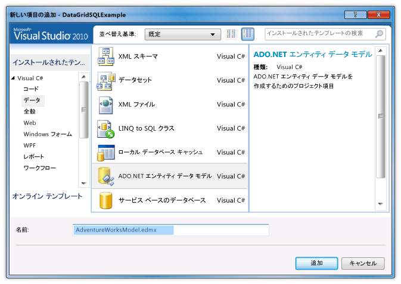
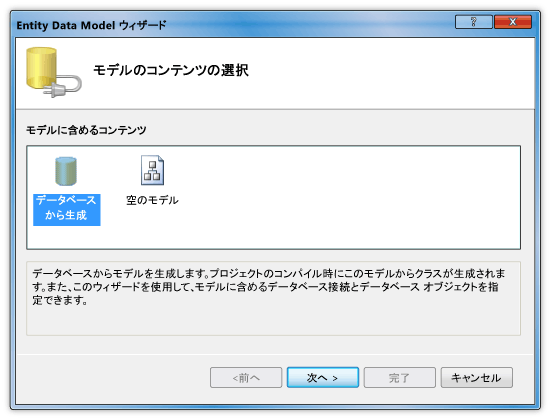
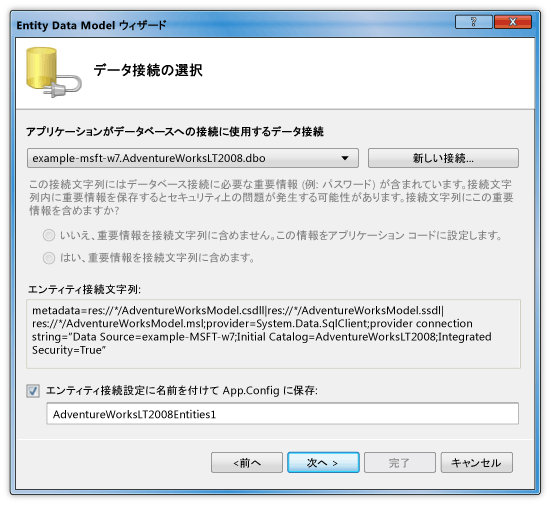
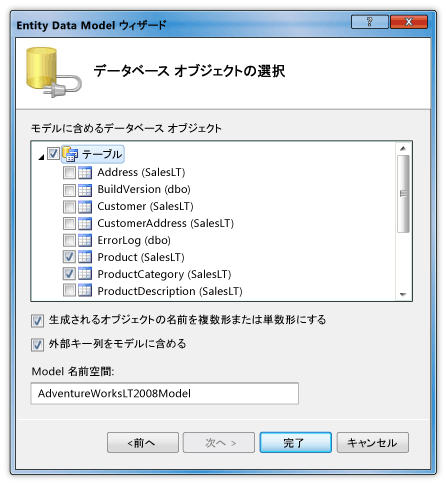
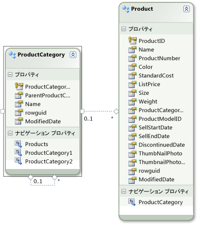
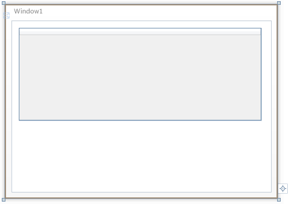

# チュートリアル: DataGrid コントロールで SQL Server データベースのデータを表示する
このチュートリアルでは、SQL Server データベースからデータを取得して、<xref:System.Windows.Controls.DataGrid> コントロールでそのデータを表示します。  ADO.NET Entity Framework を使用して、データを表すエンティティ クラスを作成し、LINQ を使用して、エンティティ クラスから指定したデータを取得するためのクエリを記述します。  
  
## 必須コンポーネント  
 このチュートリアルを実行するには、次のコンポーネントが必要です。  
  
-   [!INCLUDE[vs_dev11_long](../../../../includes/vs-dev11-long-md.md)].  
  
-   AdventureWorksLT2008 サンプル データベースがアタッチされた、SQL Server または SQL Server Express の実行中のインスタンスへのアクセス。  AdventureWorksLT2008 データベースは、[CodePlex の Web サイト](http://go.microsoft.com/fwlink/?linkid=159848)からダウンロードできます。  
  
### エンティティ クラスを作成するには  
  
1.  Visual Basic または C\# で新しい WPF アプリケーション プロジェクトを作成して、「`DataGridSQLExample`」という名前を付けます。  
  
2.  ソリューション エクスプローラーでプロジェクトを右クリックし、**\[追加\]** をポイントして、**\[新しいアイテム\]** をクリックします。  
  
     \[新しい項目の追加\] ダイアログ ボックスが表示されます。  
  
3.  \[インストールされたテンプレート\] ペインで **\[データ\]** を選択し、テンプレートの一覧で **\[ADO.NET エンティティ データ モデル\]** を選択します。  
  
       
  
4.  ファイルに「`AdventureWorksModel.edmx`」という名前を付け、**\[追加\]** をクリックします。  
  
     Entity Data Model ウィザードが表示されます。  
  
5.  \[モデルのコンテンツの選択\] 画面で、**\[データベースから生成\]** をクリックし、**\[次へ\]** をクリックします。  
  
       
  
6.  \[データ接続の選択\] 画面で、AdventureWorksLT2008 データベースへの接続情報を入力します。  詳細については、「[\[データ接続の選択\] ダイアログ ボックス](http://go.microsoft.com/fwlink/?LinkId=160190)」を参照してください。  
  
       
  
7.  名前が「`AdventureWorksLT2008Entities`」であり、**\[エンティティ接続設定に名前を付けて App.Config に保存\]** チェック ボックスがオンになっていることを確認し、**\[次へ\]** をクリックします。  
  
8.  \[データベース オブジェクトの選択\] 画面で、\[テーブル\] ノードを展開し、**Product** テーブルと **ProductCategory** テーブルをクリックします。  
  
     エンティティ クラスはすべてのテーブルについて生成できますが、この例ではこれら 2 つのテーブルのデータのみを取得します。  
  
       
  
9. **\[完了\]** をクリックします。  
  
     Product エンティティと ProductCategory エンティティが Entity Designer に表示されます。  
  
       
  
### データを取得して表示するには  
  
1.  MainWindow.xaml ファイルを開きます。  
  
2.  <xref:System.Windows.Window> 上の <xref:System.Windows.FrameworkElement.Width%2A> プロパティを「450」に設定します。  
  
3.  XAML エディターで、`<Grid>` タグと `</Grid>` タグの間に次の <xref:System.Windows.Controls.DataGrid> タグを追加して、`dataGrid1` という名前の <xref:System.Windows.Controls.DataGrid> を追加します。  
  
     [!code-xml[DataGrid_SQL_EF_Walkthrough#3](../../../../samples/snippets/csharp/VS_Snippets_Wpf/DataGrid_SQL_EF_Walkthrough/CS/MainWindow.xaml#3)]  
  
       
  
4.  <xref:System.Windows.Window> を選択します。  
  
5.  プロパティ ウィンドウまたは XAML エディターを使用して、<xref:System.Windows.FrameworkElement.Loaded> イベントに対し、<xref:System.Windows.Window> のイベント ハンドラーを `Window_Loaded` という名前で作成します。  詳細については、「[方法 : 単純なイベント ハンドラーを作成する](http://msdn.microsoft.com/ja-jp/b1456e07-9dec-4354-99cf-18666b64f480)」を参照してください。  
  
     MainWindow.xaml の XAML を次に示します。  
  
    > [!NOTE]
    >  Visual Basic を使用している場合は、MainWindow.xaml の最初の行で、`x:Class="DataGridSQLExample.MainWindow"` を `x:Class="MainWindow"` で置換します。  
  
     [!code-xml[DataGrid_SQL_EF_Walkthrough#1](../../../../samples/snippets/csharp/VS_Snippets_Wpf/DataGrid_SQL_EF_Walkthrough/CS/MainWindow.xaml#1)]  
  
6.  <xref:System.Windows.Window> の分離コード ファイル \(MainWindow.xaml.vb または MainWindow.xaml.cs\) を開きます。  
  
7.  次のコードを追加して、結合されたテーブルの特定の値のみを取得し、<xref:System.Windows.Controls.DataGrid> の <xref:System.Windows.Controls.ItemsControl.ItemsSource%2A> プロパティを、クエリの結果に設定します。  
  
     [!code-csharp[DataGrid_SQL_EF_Walkthrough#2](../../../../samples/snippets/csharp/VS_Snippets_Wpf/DataGrid_SQL_EF_Walkthrough/CS/MainWindow.xaml.cs#2)]
     [!code-vb[DataGrid_SQL_EF_Walkthrough#2](../../../../samples/snippets/visualbasic/VS_Snippets_Wpf/DataGrid_SQL_EF_Walkthrough/VB/MainWindow.xaml.vb#2)]  
  
8.  例を実行します。  
  
     <xref:System.Windows.Controls.DataGrid> にデータが表示されることを確認します。  
  
       
  
## 次の手順  
  
## 参照  
 <xref:System.Windows.Controls.DataGrid>   
 [操作方法: WPF アプリケーションに Entity Framework で開始します。](http://go.microsoft.com/fwlink/?LinkId=159868)