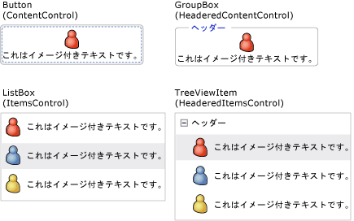
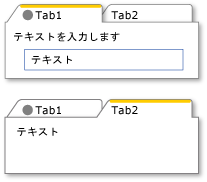
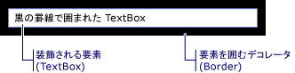

# WPF のコンテンツ モデル
[!INCLUDE[TLA#tla_winclient](../../../../includes/tlasharptla-winclient-md.md)] は、多くのコントロールやコントロールのような型を提供する表示プラットフォームで、その主な目的は、異なる種類のコンテンツを表示することです。 使用するコントロールまたは派生元のコントロールを判断するには、特定のコントロールが最適に表示できるオブジェクトの種類を理解する必要があります。  
  
 このトピックは、[!INCLUDE[TLA2#tla_winclient](../../../../includes/tla2sharptla-winclient-md.md)] コントロールとコントロールのような型に関するコンテンツ モデルのまとめです。 コンテンツ モデルは、どのようなコンテンツをコントロールで使用できるかについて説明します。 このトピックは、各コンテンツ モデルのコンテンツのプロパティもリストします。 コンテンツのプロパティは、オブジェクトのコンテンツの格納に使用されるプロパティです。  
  
 
  
   
## 任意のコンテンツを含むクラス  
 一部のコントロールは、文字列などの任意の型のオブジェクトを含めることができます、<xref:System.DateTime>オブジェクト、または<xref:System.Windows.UIElement>は追加のアイテムのコンテナーです。 たとえば、<xref:System.Windows.Controls.Button>イメージといくつかのテキストを含めることができます、または<xref:System.Windows.Controls.CheckBox>の値を含めることができます<xref:System.DateTime.Now%2A?displayProperty=nameWithType>です。  
  
 [!INCLUDE[TLA2#tla_winclient](../../../../includes/tla2sharptla-winclient-md.md)] には、任意のコンテンツを含めることができる 4 つのクラスがあります。 次の表から継承するクラス<xref:System.Windows.Controls.Control>です。  
  
|任意のコンテンツを含むクラス|Content|  
|-------------------------------------------|-------------|  
|<xref:System.Windows.Controls.ContentControl>|1 つの任意のオブジェクト。|  
|<xref:System.Windows.Controls.HeaderedContentControl>|ヘッダーと 1 つの項目。両方とも任意のオブジェクトです。|  
|<xref:System.Windows.Controls.ItemsControl>|任意のオブジェクトのコレクション。|  
|<xref:System.Windows.Controls.HeaderedItemsControl>|ヘッダーと項目のコレクション。すべて任意のオブジェクトです。|  
  
 これらのクラスから継承するコントロールは、同じ種類のコンテンツを格納でき、同じ方法でコンテンツを処理することができます。 次の図は、イメージおよびテキストを含む各コンテンツ モデルの 1 つのコントロールを示しています。  
  
   
  
### 任意の 1 つのオブジェクトを格納しているコントロール  
 <xref:System.Windows.Controls.ContentControl>クラスには、1 つ任意のコンテンツにはが含まれています。 そのコンテンツ プロパティは<xref:System.Windows.Controls.ContentControl.Content%2A>します。 次のコントロールから継承<xref:System.Windows.Controls.ContentControl>し、そのコンテンツ モデルを使用します。  
  
-   <xref:System.Windows.Controls.Button>  
  
-   <xref:System.Windows.Controls.Primitives.ButtonBase>  
  
-   <xref:System.Windows.Controls.CheckBox>  
  
-   <xref:System.Windows.Controls.ComboBoxItem>  
  
-   <xref:System.Windows.Controls.ContentControl>  
  
-   <xref:System.Windows.Controls.Frame>  
  
-   <xref:System.Windows.Controls.GridViewColumnHeader>  
  
-   <xref:System.Windows.Controls.GroupItem>  
  
-   <xref:System.Windows.Controls.Label>  
  
-   <xref:System.Windows.Controls.ListBoxItem>  
  
-   <xref:System.Windows.Controls.ListViewItem>  
  
-   <xref:System.Windows.Navigation.NavigationWindow>  
  
-   <xref:System.Windows.Controls.RadioButton>  
  
-   <xref:System.Windows.Controls.Primitives.RepeatButton>  
  
-   <xref:System.Windows.Controls.ScrollViewer>  
  
-   <xref:System.Windows.Controls.Primitives.StatusBarItem>  
  
-   <xref:System.Windows.Controls.Primitives.ToggleButton>  
  
-   <xref:System.Windows.Controls.ToolTip>  
  
-   <xref:System.Windows.Controls.UserControl>  
  
-   <xref:System.Windows.Window>  
  
 次の図に 4 つのボタンが<xref:System.Windows.Controls.ContentControl.Content%2A>、文字列に設定されている、<xref:System.DateTime>オブジェクト、 <xref:System.Windows.Shapes.Rectangle>、および<xref:System.Windows.Controls.Panel>を格納している、<xref:System.Windows.Shapes.Ellipse>と<xref:System.Windows.Controls.TextBlock>です。  
  
   
異なる種類のコンテンツを持つ 4 つのボタン  
  
 設定する方法の例については、<xref:System.Windows.Controls.ContentControl.Content%2A>プロパティを参照してください<xref:System.Windows.Controls.ContentControl>です。  
  
### ヘッダーと任意の 1 つのオブジェクトを格納しているコントロール  
 <xref:System.Windows.Controls.HeaderedContentControl>クラスから継承<xref:System.Windows.Controls.ContentControl>し、ヘッダーとコンテンツを表示します。 コンテンツのプロパティを継承<xref:System.Windows.Controls.ContentControl.Content%2A>から<xref:System.Windows.Controls.ContentControl>を定義し、<xref:System.Windows.Controls.HeaderedContentControl.Header%2A>型のプロパティを<xref:System.Object>です。 したがって、どちらも値が、任意のオブジェクト。  
  
 次のコントロールから継承<xref:System.Windows.Controls.HeaderedContentControl>し、そのコンテンツ モデルを使用します。  
  
-   <xref:System.Windows.Controls.Expander>  
  
-   <xref:System.Windows.Controls.GroupBox>  
  
-   <xref:System.Windows.Controls.TabItem>  
  
 次の図は 2 つ<xref:System.Windows.Controls.TabItem>オブジェクト。 最初の<xref:System.Windows.Controls.TabItem>が<xref:System.Windows.UIElement>としてオブジェクトの<xref:System.Windows.Controls.HeaderedContentControl.Header%2A>と<xref:System.Windows.Controls.ContentControl.Content%2A>です。 <xref:System.Windows.Controls.HeaderedContentControl.Header%2A>に設定されている、<xref:System.Windows.Controls.StackPanel>を格納している、<xref:System.Windows.Shapes.Ellipse>と<xref:System.Windows.Controls.TextBlock>です。 <xref:System.Windows.Controls.ContentControl.Content%2A>に設定されている、<xref:System.Windows.Controls.StackPanel>を格納している、<xref:System.Windows.Controls.TextBlock>と<xref:System.Windows.Controls.Label>です。 2 番目<xref:System.Windows.Controls.TabItem>に文字列を持つ、<xref:System.Windows.Controls.HeaderedContentControl.Header%2A>と<xref:System.Windows.Controls.TextBlock>で、<xref:System.Windows.Controls.ContentControl.Content%2A>です。  
  
   
ヘッダー プロパティでさまざまな型を使用する TabControl  
  
 作成する方法の例については<xref:System.Windows.Controls.TabItem>、オブジェクトを参照してください<xref:System.Windows.Controls.HeaderedContentControl>です。  
  
### 任意のオブジェクトのコレクションを格納しているコントロール  
 <xref:System.Windows.Controls.ItemsControl>クラスから継承<xref:System.Windows.Controls.Control>文字列、オブジェクト、またはその他の要素など、複数の項目を含めることができます。 コンテンツ プロパティは<xref:System.Windows.Controls.ItemsControl.ItemsSource%2A>と<xref:System.Windows.Controls.ItemsControl.Items%2A>です。 <xref:System.Windows.Controls.ItemsControl.ItemsSource%2A> 設定に通常使用されます、<xref:System.Windows.Controls.ItemsControl>データ コレクションを使用します。 追加にコレクションを使用しないかどうか、<xref:System.Windows.Controls.ItemsControl>を使用して項目を追加することができます、<xref:System.Windows.Controls.ItemsControl.Items%2A>プロパティです。  
  
 次のコントロールから継承<xref:System.Windows.Controls.ItemsControl>し、そのコンテンツ モデルを使用します。  
  
-   <xref:System.Windows.Controls.Menu>  
  
-   <xref:System.Windows.Controls.Primitives.MenuBase>  
  
-   <xref:System.Windows.Controls.ContextMenu>  
  
-   <xref:System.Windows.Controls.ComboBox>  
  
-   <xref:System.Windows.Controls.ItemsControl>  
  
-   <xref:System.Windows.Controls.ListBox>  
  
-   <xref:System.Windows.Controls.ListView>  
  
-   <xref:System.Windows.Controls.TabControl>  
  
-   <xref:System.Windows.Controls.TreeView>  
  
-   <xref:System.Windows.Controls.Primitives.Selector>  
  
-   <xref:System.Windows.Controls.Primitives.StatusBar>  
  
 次の図は、<xref:System.Windows.Controls.ListBox>この種類のアイテムを格納しています。  
  
-   文字列。  
  
-   <xref:System.DateTime> オブジェクト。  
  
-   <xref:System.Windows.UIElement>。  
  
-   A<xref:System.Windows.Controls.Panel>を格納している、<xref:System.Windows.Shapes.Ellipse>と<xref:System.Windows.Controls.TextBlock>です。  
  
   
複数の種類のオブジェクトを含む ListBox  
  
### ヘッダーと任意のオブジェクトのコレクションを含むコントロール  
 <xref:System.Windows.Controls.HeaderedItemsControl>クラスから継承<xref:System.Windows.Controls.ItemsControl>文字列、オブジェクト、またはその他の要素、およびヘッダーなど、複数の項目を含めることができます。 継承、<xref:System.Windows.Controls.ItemsControl>コンテンツのプロパティ、 <xref:System.Windows.Controls.ItemsControl.ItemsSource%2A>、および<xref:System.Windows.Controls.ItemsControl.Items%2A>を定義して、<xref:System.Windows.Controls.HeaderedItemsControl.Header%2A>プロパティが、任意のオブジェクトがあります。  
  
 次のコントロールから継承<xref:System.Windows.Controls.HeaderedItemsControl>し、そのコンテンツ モデルを使用します。  
  
-   <xref:System.Windows.Controls.MenuItem>  
  
-   <xref:System.Windows.Controls.ToolBar>  
  
-   <xref:System.Windows.Controls.TreeViewItem>  
  
   
## UIElement オブジェクトのコレクションを含むクラス  
 <xref:System.Windows.Controls.Panel>クラスを配置し、子を整列<xref:System.Windows.UIElement>オブジェクト。 そのコンテンツ プロパティは<xref:System.Windows.Controls.Panel.Children%2A>します。  
  
 次のクラスの継承元、<xref:System.Windows.Controls.Panel>クラスし、そのコンテンツ モデルを使用します。  
  
-   <xref:System.Windows.Controls.Canvas>  
  
-   <xref:System.Windows.Controls.DockPanel>  
  
-   <xref:System.Windows.Controls.Grid>  
  
-   <xref:System.Windows.Controls.Primitives.TabPanel>  
  
-   <xref:System.Windows.Controls.Primitives.ToolBarOverflowPanel>  
  
-   <xref:System.Windows.Controls.Primitives.ToolBarPanel>  
  
-   <xref:System.Windows.Controls.Primitives.UniformGrid>  
  
-   <xref:System.Windows.Controls.StackPanel>  
  
-   <xref:System.Windows.Controls.VirtualizingPanel>  
  
-   <xref:System.Windows.Controls.VirtualizingStackPanel>  
  
-   <xref:System.Windows.Controls.WrapPanel>  
  
 詳細については、「[Panels Overview](../../../../docs/framework/wpf/controls/panels-overview.md)」を参照してください。  
  
   
## UIElement の外観に影響を与えるクラス  
 <xref:System.Windows.Controls.Decorator>クラスには、または 1 つの子の周囲の視覚効果が適用されます。<xref:System.Windows.UIElement>です。 そのコンテンツ プロパティは<xref:System.Windows.Controls.Decorator.Child%2A>します。 次のクラスから継承<xref:System.Windows.Controls.Decorator>し、そのコンテンツ モデルを使用します。  
  
-   <xref:System.Windows.Documents.AdornerDecorator>  
  
-   <xref:System.Windows.Controls.Border>  
  
-   <xref:System.Windows.Controls.Primitives.BulletDecorator>  
  
-   <xref:Microsoft.Windows.Themes.ButtonChrome>  
  
-   <xref:Microsoft.Windows.Themes.ClassicBorderDecorator>  
  
-   <xref:System.Windows.Controls.InkPresenter>  
  
-   <xref:Microsoft.Windows.Themes.ListBoxChrome>  
  
-   <xref:Microsoft.Windows.Themes.SystemDropShadowChrome>  
  
-   <xref:System.Windows.Controls.Viewbox>  
  
 次の図は、<xref:System.Windows.Controls.TextBox>を持つ (で装飾されて)、<xref:System.Windows.Controls.Border>周りです。  
  
   
境界がある TextBlock  
  
   
## UIElement についての視覚的なフィードバックを提供するクラス  
 <xref:System.Windows.Documents.Adorner>クラスは、ユーザーに視覚的な手掛かりを提供します。 たとえば、使用して、<xref:System.Windows.Documents.Adorner>機能ハンドル要素を追加またはコントロールの状態情報を提供します。 <xref:System.Windows.Documents.Adorner>クラスが、独自のガイドを作成できるように、フレームワークを提供します。 [!INCLUDE[TLA2#tla_winclient](../../../../includes/tla2sharptla-winclient-md.md)] は実装された装飾は提供しません。 詳しくは、[Adorners Overview](../../../../docs/framework/wpf/controls/adorners-overview.md)をご覧ください。  
  
   
## ユーザーがテキストを入力できるようにするクラス  
 WPF は、ユーザーがテキストを入力できるようにする 3 つの主なコントロールを提供します。 各コントロールは、異なる方法で、テキストを表示します。 次の表は、これら 3 つのテキスト関連のコントロール、テキストを表示するときのそれぞれの機能、およびコントロールのテキストを格納するそれぞれのプロパティの一覧です。  
  
|コントロール|テキストの表示形態|コンテンツのプロパティ|  
|-------------|--------------------------|----------------------|  
|<xref:System.Windows.Controls.TextBox>|プレーンテキスト|<xref:System.Windows.Controls.TextBox.Text%2A>|  
|<xref:System.Windows.Controls.RichTextBox>|書式付きテキスト|<xref:System.Windows.Controls.RichTextBox.Document%2A>|  
|<xref:System.Windows.Controls.PasswordBox>|非表示のテキスト (文字はマスクされます)|<xref:System.Windows.Controls.PasswordBox.Password%2A>|  
  
   
## テキストを表示するクラス  
 いくつかのクラスを使用して、プレーン テキストまたは書式設定されたテキストを表示できます。 使用することができます<xref:System.Windows.Controls.TextBlock>少量のテキストを表示します。 大量のテキストを表示する場合は、使用、 <xref:System.Windows.Controls.FlowDocumentReader>、 <xref:System.Windows.Controls.FlowDocumentPageViewer>、または<xref:System.Windows.Controls.FlowDocumentScrollViewer>コントロール。  
  
 <xref:System.Windows.Controls.TextBlock>は 2 つのコンテンツ プロパティがあります:<xref:System.Windows.Controls.TextBlock.Text%2A>と<xref:System.Windows.Controls.TextBlock.Inlines%2A>です。 一貫した書式を使用するテキストを表示するときに、<xref:System.Windows.Controls.TextBlock.Text%2A>プロパティは、多くの場合、最適な選択肢です。 テキスト全体のさまざまな書式設定を使用する場合は、使用、<xref:System.Windows.Controls.TextBlock.Inlines%2A>プロパティです。 <xref:System.Windows.Controls.TextBlock.Inlines%2A>プロパティのコレクションは、<xref:System.Windows.Documents.Inline>オブジェクトで、テキストの書式設定する方法を指定します。  
  
 次の表のコンテンツ プロパティ<xref:System.Windows.Controls.FlowDocumentReader>、 <xref:System.Windows.Controls.FlowDocumentPageViewer>、および<xref:System.Windows.Controls.FlowDocumentScrollViewer>クラスです。  
  
|コントロール|コンテンツのプロパティ|コンテンツのプロパティの型|  
|-------------|----------------------|---------------------------|  
|<xref:System.Windows.Controls.FlowDocumentPageViewer>|ドキュメント|<xref:System.Windows.Documents.IDocumentPaginatorSource>|  
|<xref:System.Windows.Controls.FlowDocumentReader>|ドキュメント|<xref:System.Windows.Documents.FlowDocument>|  
|<xref:System.Windows.Controls.FlowDocumentScrollViewer>|ドキュメント|<xref:System.Windows.Documents.FlowDocument>|  
  
 <xref:System.Windows.Documents.FlowDocument>を実装する、<xref:System.Windows.Documents.IDocumentPaginatorSource>インターフェイスです。 したがって、すべての 3 つのクラスがかかることができます、<xref:System.Windows.Documents.FlowDocument>コンテンツとして。  
  
   
## テキストを書式設定するクラス  
 <xref:System.Windows.Documents.TextElement> され、その関連クラスでは、テキストの書式設定することができます。 <xref:System.Windows.Documents.TextElement> オブジェクトを含めるし、内のテキストを書式設定<xref:System.Windows.Controls.TextBlock>と<xref:System.Windows.Documents.FlowDocument>オブジェクト。 2 つの基本的な種類<xref:System.Windows.Documents.TextElement>オブジェクトが<xref:System.Windows.Documents.Block>要素および<xref:System.Windows.Documents.Inline>要素。 A<xref:System.Windows.Documents.Block>要素は段落またはリストなどのテキストのブロックを表します。 <xref:System.Windows.Documents.Inline>要素は、ブロック内のテキストの一部を表します。 多く<xref:System.Windows.Documents.Inline>クラスを適用するテキストの書式を指定します。 各<xref:System.Windows.Documents.TextElement>独自のコンテンツ モデルを持ちます。 詳細については、「[TextElement Content Model Overview](../../../../docs/framework/wpf/advanced/textelement-content-model-overview.md)」を参照してください。  
  
## 関連項目  
 [詳細設定](../../../../docs/framework/wpf/advanced/index.md)
