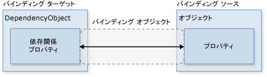
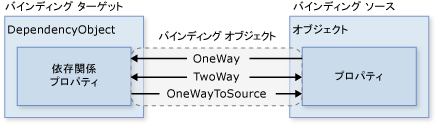
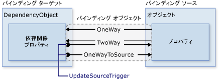
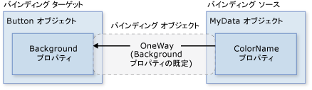
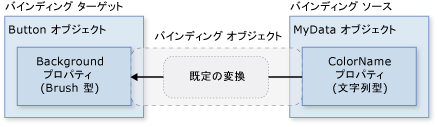
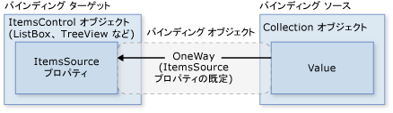

# <a name="data-binding-overview"></a>データ バインディングの概要
[!INCLUDE[TLA#tla_winclient](../../../../includes/tlasharptla-winclient-md.md)] データ バインディングは、データを表示したり操作するための単純で一貫した方法をアプリケーションに提供します。 要素は、[!INCLUDE[TLA#tla_clr](../../../../includes/tlasharptla-clr-md.md)] オブジェクトおよび [!INCLUDE[TLA#tla_xml](../../../../includes/tlasharptla-xml-md.md)] の形式のさまざまなデータ ソースのデータにバインドできます。 <xref:System.Windows.Controls.ContentControl>などの s<xref:System.Windows.Controls.Button>と<xref:System.Windows.Controls.ItemsControl>など s<xref:System.Windows.Controls.ListBox>と<xref:System.Windows.Controls.ListView>を 1 つのデータ項目の柔軟なスタイルまたはデータ項目のコレクションを有効にする機能が組み込まれました。 並べ替えビュー、フィルター ビュー、およびグループ ビューは、データの上に生成できます。  
  
 [!INCLUDE[TLA2#tla_winclient](../../../../includes/tla2sharptla-winclient-md.md)] のデータ バインディング機能には、本質的にデータ バインディングをサポートする広範なプロパティ、データの柔軟な [!INCLUDE[TLA2#tla_ui](../../../../includes/tla2sharptla-ui-md.md)] 表現、[!INCLUDE[TLA2#tla_ui](../../../../includes/tla2sharptla-ui-md.md)] からのビジネス ロジックの明確な分離など、従来のモデルより優れた長所がいくつかあります  
  
 このトピックは最初に基本的な概念をについて説明[!INCLUDE[TLA2#tla_winclient](../../../../includes/tla2sharptla-winclient-md.md)]データのバインドとの使用状況をし、移動、<xref:System.Windows.Data.Binding>クラスとデータ バインディングの他の機能です。  
  
  
<a name="what_is_data_binding"></a>   
## <a name="what-is-data-binding"></a>データ バインディングとは  
 データ バインディングとは、アプリケーション [!INCLUDE[TLA2#tla_ui](../../../../includes/tla2sharptla-ui-md.md)] とビジネス ロジックの間の接続を確立する処理です。 バインドが適切に設定され、データから適切な通知が提供される場合、データの値が変更されると、そのデータにバインドされている要素に変更が自動的に反映されます。 データ バインディングには、要素内のデータの外部表現が変更された場合、基になるデータを自動的に更新して変更を反映できるという意味もあります。 たとえば、ユーザーに値を編集する場合、<xref:System.Windows.Controls.TextBox>要素、基になるデータ値が自動的にその変更を反映するように更新します。  
  
 データ バインディングの一般的な使用は、サーバーまたはローカルの構成データをフォームまたはその他の [!INCLUDE[TLA2#tla_ui](../../../../includes/tla2sharptla-ui-md.md)] コントロールに配置することです。 [!INCLUDE[TLA2#tla_winclient](../../../../includes/tla2sharptla-winclient-md.md)] では、この概念は幅広いプロパティのバインドからさまざまなデータ ソースまで拡張されます。 [!INCLUDE[TLA2#tla_winclient](../../../../includes/tla2sharptla-winclient-md.md)] では、要素の依存関係プロパティは [!INCLUDE[TLA2#tla_clr](../../../../includes/tla2sharptla-clr-md.md)] オブジェクト ([!INCLUDE[TLA#tla_adonet](../../../../includes/tlasharptla-adonet-md.md)] オブジェクトまたは Web サービスおよび Web のプロパティに関連付けられているオブジェクトを含む) および [!INCLUDE[TLA2#tla_xml](../../../../includes/tla2sharptla-xml-md.md)] データにバインドできます。  
  
 データ バインディングの例については、[データ バインディング デモ](http://go.microsoft.com/fwlink/?LinkID=163703)の次のアプリケーション [!INCLUDE[TLA2#tla_ui](../../../../includes/tla2sharptla-ui-md.md)] を参照してください。  
  
   
  
 上記は、オークション品目の一覧を表示するアプリケーションの [!INCLUDE[TLA2#tla_ui](../../../../includes/tla2sharptla-ui-md.md)] です。 このアプリケーションは、データ バインディングの次の機能を示しています。  
  
-   内容、<xref:System.Windows.Controls.ListBox>のコレクションにバインドされた*AuctionItem*オブジェクト。 *AuctionItem* オブジェクトには、*Description*、*StartPrice*、*StartDate*、*Category*、*SpecialFeatures* などのプロパティがあります。  
  
-   データ (*AuctionItem*オブジェクト) に表示される、<xref:System.Windows.Controls.ListBox>がテンプレート化されて、説明と、現在の価格を項目ごとに表示されるようにします。 これを使用して、<xref:System.Windows.DataTemplate>です。 さらに、各項目の外観は、表示されている *AuctionItem* の *SpecialFeatures* の値に依存します。 *AuctionItem* の *SpecialFeatures* の値が *Color* の場合、その項目には青の枠線が付きます。 値が *Highlight* の場合、その項目にはオレンジの枠線と星が付きます。 「[データ テンプレート](#data_templating)」セクションでは、データ テンプレートに関する情報を提供します。  
  
-   グループ化、フィルター処理、またはを使用してデータを並べ替えることができます、ユーザー、 <xref:System.Windows.Controls.CheckBox>es を提供します。 上記の図で、「グループ化のカテゴリ」および「カテゴリと日付で並べ替え」 <xref:System.Windows.Controls.CheckBox>es を選択します。 データが製品のカテゴリに基づいてグループ化され、カテゴリ名がアルファベット順になっていることが分かります。 図では分かりにくいですが、項目は各カテゴリ内での開始日でも並べ替えられています。 これは*コレクション ビュー*を使用して行えます。 コレクション ビューについては、「[コレクションにバインドする](#binding_to_collections)」セクションで説明します。  
  
-   ユーザーが、項目を選択したときに、<xref:System.Windows.Controls.ContentControl>選択された項目の詳細が表示されます。 これは*マスター詳細シナリオ*と呼ばれます。 この種類のバインドのシナリオに関する情報は、「[マスター詳細シナリオ](#master_detail_scenario)」セクションにあります。  
  
-   型、 *StartDate*プロパティは<xref:System.DateTime>、ミリ秒の時刻を含む日付が返されます。 このアプリケーションでは、より短い日付文字列を表示するため、カスタムのコンバーターが使用されています。 コンバーターに関する情報は、「[データ変換](#data_conversion)」セクションにあります。  
  
 ユーザーが [*Add Product (製品の追加)*] ボタンをクリックすると、次のフォームが表示されます。  
  
   
  
 ユーザーは、フォーム内のフィールドを編集して、簡単なプレビューとより詳細なプレビュー ペインを使用して製品の一覧をプレビューしてから [*送信*] をクリックして新しい製品の一覧を追加することができます。 既存のグループ化、フィルター処理および並べ替えの機能は、新しいエントリに適用されます。 この特定のケースでは、上のイメージで入力した項目が *Computer* カテゴリ内の 2 番目の項目として表示されます。  
  
 検証ロジックので提供されるこのイメージに示されていませんが、 *Start Date* <xref:System.Windows.Controls.TextBox>です。 場合は、ユーザー入力に無効な日付 (無効な書式設定、または過去の日付) で、ユーザーに通知する、<xref:System.Windows.Controls.ToolTip>および横に赤い感嘆符、<xref:System.Windows.Controls.TextBox>です。 検証ロジックの作成方法については、「[データの検証](#data_validation)」セクションで説明します。  
  
 上記で説明したデータ バインディングのさまざまな機能の説明に入る前に、最初に [!INCLUDE[TLA2#tla_winclient](../../../../includes/tla2sharptla-winclient-md.md)] データ バインディングの理解に欠かせない基本概念について次のセクションで説明します。  
  
## <a name="basic-data-binding-concepts"></a>基本的なデータ バインディングの概念  
  
 バインドする要素およびデータ ソースの性質に関係なく、各バインドは常に次の図で示したモデルに従います。  
  
   
  
 上の図に示したように、データ バインディングは本質的に、バインディング ターゲットとバインディング ソース間の橋渡しです。 図には、次の基本的な [!INCLUDE[TLA2#tla_winclient](../../../../includes/tla2sharptla-winclient-md.md)] データ バインディングの概念が示されています。  
  
-   通常、各バインディングには、バインディング ターゲット オブジェクト、ターゲット プロパティ、バインディング ソース、および使用するバインディング ソース内の値へのパスの 4 つのコンポーネントがあります。 内容をバインドする場合など、<xref:System.Windows.Controls.TextBox>を*名前*のプロパティ、*従業員*オブジェクトを対象のオブジェクトが、 <xref:System.Windows.Controls.TextBox>、target プロパティが、 <xref:System.Windows.Controls.TextBox.Text%2A>プロパティを使用する値は、*名前*、され、ソース オブジェクトは、*従業員*オブジェクト。  
  
-   ターゲット プロパティは、依存関係プロパティである必要があります。 ほとんど<xref:System.Windows.UIElement>プロパティは、依存関係プロパティと読み取り専用のものを除く、ほとんどの依存関係プロパティが既定ではデータ バインディングをサポートします。 (だけ<xref:System.Windows.DependencyObject>依存関係プロパティとそのすべての種類を定義できます<xref:System.Windows.UIElement>から派生して s <xref:System.Windows.DependencyObject>)。  
  
-   図では指定されていませんが、バインディング ソース オブジェクトはカスタム [!INCLUDE[TLA2#tla_clr](../../../../includes/tla2sharptla-clr-md.md)] オブジェクトに制限されないことに注意してください。 [!INCLUDE[TLA2#tla_winclient](../../../../includes/tla2sharptla-winclient-md.md)] データ バインディングは、[!INCLUDE[TLA2#tla_clr](../../../../includes/tla2sharptla-clr-md.md)] オブジェクトおよび [!INCLUDE[TLA2#tla_xml](../../../../includes/tla2sharptla-xml-md.md)] の形式でデータをサポートします。 いくつかの例を提供する場合、バインディング ソースがあります、 <xref:System.Windows.UIElement>、任意のリスト オブジェクト、[!INCLUDE[TLA2#tla_clr](../../../../includes/tla2sharptla-clr-md.md)]オブジェクトに関連付けられている[!INCLUDE[TLA#tla_adonet](../../../../includes/tlasharptla-adonet-md.md)]データまたは Web サービス、またはを含む XmlNode、[!INCLUDE[TLA2#tla_xml](../../../../includes/tla2sharptla-xml-md.md)]データ。 詳しくは、「[バインディング ソースの概要](../../../../docs/framework/wpf/data/binding-sources-overview.md)」をご覧ください。  
  
 他の [!INCLUDE[TLA#tla_sdk](../../../../includes/tlasharptla-sdk-md.md)] トピックを読みながら、バインディングを確立すると、バインディング ターゲットをバインディング ソース*に*バインドしていることを理解することが重要です。 例では、基になるいくつかを表示する場合の[!INCLUDE[TLA2#tla_xml](../../../../includes/tla2sharptla-xml-md.md)]内のデータ、<xref:System.Windows.Controls.ListBox>バインドしてデータ バインディングを使用して、<xref:System.Windows.Controls.ListBox>を[!INCLUDE[TLA2#tla_xml](../../../../includes/tla2sharptla-xml-md.md)]データ。  
  
 使用するバインディングを確立するために、<xref:System.Windows.Data.Binding>オブジェクト。 このトピックの残りの部分に関連付けられている概念の多くと一部のプロパティの使用状況の説明、<xref:System.Windows.Data.Binding>オブジェクト。  
  
<a name="direction_of_data_flow"></a>   
### <a name="direction-of-the-data-flow"></a>データ フローの方向  
 説明したように、上記の図の矢印によって示される、バインディングのデータ フローできますにバインディング ターゲットからバインディング ソース (ユーザーの値を編集するときに、たとえば、元の値が変更、 <xref:System.Windows.Controls.TextBox>) や、バインディング ソースからバインディング ターゲットへ (たとえば、<xref:System.Windows.Controls.TextBox>バインディング ソースが変更されたコンテンツが更新されます)、バインディング ソースから適切な通知を提供している場合。  
  
 アプリケーションでユーザーがデータを変更してそれをソース オブジェクトに反映できるようにすることができます。 または、ユーザーがソース データを更新できないようにすることもできます。 これを設定して制御することができます、<xref:System.Windows.Data.Binding.Mode%2A>のプロパティ、<xref:System.Windows.Data.Binding>オブジェクト。 次の図は、さまざまなデータ フローの種類を示しています。  
  
   
  
-   <xref:System.Windows.Data.BindingMode.OneWay> バインディング ターゲット プロパティを自動的に更新するソース プロパティへの変更がターゲット プロパティへの変更は、ソース プロパティには反映されません。 この型のバインディングは、バインドされているコントロールが暗黙的な読み取り専用の場合に適しています。 たとえば、株価情報などのソースにバインドしたり、またはターゲット プロパティに、データ バインドされたテーブルの背景色などのように、変更用コントロール インターフェイスがない可能性もあります。 ターゲット プロパティの変更を監視する必要がない場合は、<xref:System.Windows.Data.BindingMode.OneWay> バインディング モードを使うことにより、<xref:System.Windows.Data.BindingMode.TwoWay> バインディング モードのオーバーヘッドを回避できます。  
  
-   <xref:System.Windows.Data.BindingMode.TwoWay> バインディングでは、基になるプロパティまたは他を自動的に更新する対象プロパティのいずれかの変更が発生します。 この型のバインディングは、編集可能なフォームや完全対話型の [!INCLUDE[TLA2#tla_ui](../../../../includes/tla2sharptla-ui-md.md)] シナリオに適しています。 ほとんどのプロパティは既定<xref:System.Windows.Data.BindingMode.OneWay>バインディングがいくつかの依存関係プロパティ (通常はユーザーが編集できるコントロールなどのプロパティ、<xref:System.Windows.Controls.TextBox.Text%2A>のプロパティ<xref:System.Windows.Controls.TextBox>と<xref:System.Windows.Controls.Primitives.ToggleButton.IsChecked%2A>プロパティの<xref:System.Windows.Controls.CheckBox>)の既定値は<xref:System.Windows.Data.BindingMode.TwoWay>バインドします。 依存関係プロパティが既定で一方向と双方向のどちらでバインドされるかをプログラムで判断する 1 つの方法として、<xref:System.Windows.DependencyProperty.GetMetadata%2A> を使用してそのプロパティのプロパティ メタデータを取得してから、<xref:System.Windows.FrameworkPropertyMetadata.BindsTwoWayByDefault%2A> プロパティのブール値を確認することがきます。  
  
-   <xref:System.Windows.Data.BindingMode.OneWayToSource> 逆順になって<xref:System.Windows.Data.BindingMode.OneWay>バインディング; がソース プロパティを更新対象プロパティが変更されたときにします。 1 つのサンプル シナリオは、[!INCLUDE[TLA2#tla_ui](../../../../includes/tla2sharptla-ui-md.md)] からのソース値のみを再評価する必要があるかどうかです。  
  
-   図に示されていませんが<xref:System.Windows.Data.BindingMode.OneTime>バインド、それが原因で、ターゲット プロパティを初期化するために、ソース プロパティが、後続の変更は反映されません。 これは、データ コンテキストが変更されるか、データ コンテキスト内のオブジェクトが変更された場合に、その変更がターゲット プロパティに反映されないことを意味します。 この型のバインディングは、現在の状態のスナップショットが用途に合っている場合や、データが完全に静的である場合に適しています。 また、ソース プロパティの値を使用してターゲット プロパティを初期化するときにデータ コンテキストが事前にわからない場合にも、この型のバインディングは便利です。 基本的に、この型のバインディングは、ソース値が変わらない場合にパフォーマンスを向上させる <xref:System.Windows.Data.BindingMode.OneWay> バインディングを簡易化したものです。  
  
 ソースの変更を検出することに注意してください (に適用できる<xref:System.Windows.Data.BindingMode.OneWay>と<xref:System.Windows.Data.BindingMode.TwoWay>バインド)、ソースがなど、適切なプロパティの変更通知のメカニズムを実装する必要があります<xref:System.ComponentModel.INotifyPropertyChanged>です。 参照してください[実装プロパティの変更通知](../../../../docs/framework/wpf/data/how-to-implement-property-change-notification.md)の例については、<xref:System.ComponentModel.INotifyPropertyChanged>実装します。  
  
 <xref:System.Windows.Data.Binding.Mode%2A>プロパティ ページの詳細については、バインディング モードおよびバインディングの方向を指定する方法の例を提供します。  
  
<a name="what_triggers_source_updates"></a>   
### <a name="what-triggers-source-updates"></a>ソース更新のトリガー  
 バインドを<xref:System.Windows.Data.BindingMode.TwoWay>または<xref:System.Windows.Data.BindingMode.OneWayToSource>ターゲット プロパティの変更をリッスンし、それらをソースに反映します。 これは、ソースの更新と呼ばれます。 たとえば、TextBox のテキストを編集して、基になるソース値を変更できます。 最後のセクションで説明した、データ フローの方向がの値によって決まりますが、<xref:System.Windows.Data.Binding.Mode%2A>バインディングのプロパティです。  
  
 ただし、ソース値が更新されるのは、テキストの編集中またはテキストの編集後にマウス ポインターを TextBox から離した後でしょうか。 <xref:System.Windows.Data.Binding.UpdateSourceTrigger%2A>バインドのプロパティは、ソースの更新トリガーを決定します。 次の図の右側の矢印のドットの役割を示しています、<xref:System.Windows.Data.Binding.UpdateSourceTrigger%2A>プロパティ。  
  
   
  
 場合、<xref:System.Windows.Data.Binding.UpdateSourceTrigger%2A>値は<xref:System.Windows.Data.UpdateSourceTrigger.PropertyChanged>、指す値の右矢印<xref:System.Windows.Data.BindingMode.TwoWay>または<xref:System.Windows.Data.BindingMode.OneWayToSource>バインドはターゲット プロパティの変更と、すぐに更新を取得します。 ただし場合、<xref:System.Windows.Data.Binding.UpdateSourceTrigger%2A>値は<xref:System.Windows.Data.UpdateSourceTrigger.LostFocus>、その値のみを取得更新され、新しい値を持つターゲット プロパティがフォーカスを失ったときにします。  
  
 ような<xref:System.Windows.Data.Binding.Mode%2A>プロパティ、別の依存関係プロパティが別の既定値を持つ<xref:System.Windows.Data.Binding.UpdateSourceTrigger%2A>値。 ほとんどの依存関係プロパティの既定値は <xref:System.Windows.Data.UpdateSourceTrigger.PropertyChanged> です。ただし、<xref:System.Windows.Controls.TextBox.Text%2A> プロパティの既定値は <xref:System.Windows.Data.UpdateSourceTrigger.LostFocus> です。 つまり、ソースの更新通常行われるたびに、ターゲット プロパティが変更された、十分機能である<xref:System.Windows.Controls.CheckBox>es およびその他の単純なコントロールです。 しかし、テキスト フィールドについては、キーストロークのたびに更新すると、パフォーマンスが低下する可能性があり、また、ユーザーが新しい値をコミットする前にいつものようにバックスペースでタイプ ミスを消す機会がなくなります。 だからこそ、<xref:System.Windows.Controls.TextBox.Text%2A>プロパティの既定値を持つ<xref:System.Windows.Data.UpdateSourceTrigger.LostFocus>の代わりに<xref:System.Windows.Data.UpdateSourceTrigger.PropertyChanged>です。  
  
 参照してください、<xref:System.Windows.Data.Binding.UpdateSourceTrigger%2A>プロパティ ページを既定値を検索する方法に関する情報を<xref:System.Windows.Data.Binding.UpdateSourceTrigger%2A>依存関係プロパティの値。  
  
 次の表は、それぞれのシナリオ例を示します<xref:System.Windows.Data.Binding.UpdateSourceTrigger%2A>値を使用して、<xref:System.Windows.Controls.TextBox>例として。  
  
|UpdateSourceTrigger の値|ソース値が更新されるとき|TextBox のサンプル シナリオ|  
|-------------------------------|----------------------------------------|----------------------------------|  
|LostFocus (の既定の<xref:System.Windows.Controls.TextBox.Text%2A?displayProperty=nameWithType>)|TextBox コントロールがフォーカスを失ったとき|A<xref:System.Windows.Controls.TextBox>検証ロジックに関連付けられている (データの検証」セクションを参照してください)|  
|PropertyChanged|入力すると、 <xref:System.Windows.Controls.TextBox>|<xref:System.Windows.Controls.TextBox> チャット ルーム ウィンドウのコントロール|  
|Explicit|アプリケーションを呼び出すと <xref:System.Windows.Data.BindingExpression.UpdateSource%2A>|<xref:System.Windows.Controls.TextBox> (ユーザーが [送信] ボタンをクリックした場合にのみ、ソースの値を更新) 編集可能なフォーム コントロール|  
  
 例については、「[TextBox テキストでソースを更新するタイミングを制御する](../../../../docs/framework/wpf/data/how-to-control-when-the-textbox-text-updates-the-source.md)」を参照してください。  
  
<a name="creating_a_binding"></a>   
## <a name="creating-a-binding"></a>バインディングの作成  
  
 使用してバインドを確立する前のセクションで説明する概念の一部を要約、<xref:System.Windows.Data.Binding>オブジェクト、および各バインディングは、通常は 4 つのコンポーネントがあります。 ターゲット、対象のプロパティ、バインディング ソースとバインド パスを使用する元の値。 このセクションでは、バインドの設定方法について説明します。  
  
 次の例について考えます。この例では、バインディング ソース オブジェクトは、*SDKSample* 名前空間で定義されている *MyData* という名前のクラスです。 デモンストレーション目的のため、*MyData* クラスには、値が "Red" に設定された *ColorName* という名前の文字列プロパティがあります。 したがって、この例では、背景が赤のボタンが生成されます。  
  
 [!code-xaml[BindNonTextProperty#1](../../../../samples/snippets/csharp/VS_Snippets_Wpf/BindNonTextProperty/CS/Page1.xaml#1)]  
  
 バインディング宣言の構文の詳細およびコード内でバインディングを設定する方法の例については、「[バインディング宣言の概要](../../../../docs/framework/wpf/data/binding-declarations-overview.md)」を参照してください。  
  
 この例を基本的な図に適用すると、結果として得られる図は、次のようになります。 これは、<xref:System.Windows.Data.BindingMode.OneWay>背景のプロパティをサポートするためのバインド<xref:System.Windows.Data.BindingMode.OneWay>デフォルトをバインドします。  
  
   
  
 なぜこの動作も不思議に思うかもしれません、 *ColorName*プロパティの型が文字列中に、<xref:System.Windows.Controls.Control.Background%2A>プロパティの型は<xref:System.Windows.Media.Brush>します。 これは作業中の既定の型変換であり、「[データ変換](#data_conversion)」セクションで説明されています。  
  
<a name="specifying_the_binding_source"></a>   
### <a name="specifying-the-binding-source"></a>バインディング ソースの指定  
 前の例では、バインディング ソースが指定されている設定に注意してください、<xref:System.Windows.FrameworkElement.DataContext%2A>プロパティを<xref:System.Windows.Controls.DockPanel>要素。 <xref:System.Windows.Controls.Button>が継承、<xref:System.Windows.FrameworkElement.DataContext%2A>値から、 <xref:System.Windows.Controls.DockPanel>、これは、その親要素です。 繰り返しますが、バインディング ソース オブジェクトは、バインディングの 4 つの必須コンポーネントの 1 つです。 したがって、バインディング ソース オブジェクトが指定されていないと、バインディングは機能しません。  
  
 バインディング ソース オブジェクトを指定するには複数の方法があります。 使用して、<xref:System.Windows.FrameworkElement.DataContext%2A>親要素のプロパティは、複数のプロパティを同じソースにバインドしているときに便利です。 ただし、個々のバインディング宣言でバインディング ソースを指定する方が適切な場合もあります。 使用せずに、前の例については、<xref:System.Windows.FrameworkElement.DataContext%2A>プロパティを設定して、バインディング ソースを指定できます、<xref:System.Windows.Data.Binding.Source%2A>次の例のように、ボタンのバインドの宣言で直接プロパティ。  
  
 [!code-xaml[BindNonTextProperty#BackgroundBindingCompact](../../../../samples/snippets/csharp/VS_Snippets_Wpf/BindNonTextProperty/CS/Page2.xaml#backgroundbindingcompact)]  
  
 以外の値の設定、<xref:System.Windows.FrameworkElement.DataContext%2A>要素を直接にプロパティを継承する、<xref:System.Windows.FrameworkElement.DataContext%2A>先祖 (最初の例のボタン) などの値し、明示的に設定して、バインディング ソースを指定する、 <xref:System.Windows.Data.Binding.Source%2A> プロパティ<xref:System.Windows.Data.Binding>(など、ボタンは最後の例) 使用することも、<xref:System.Windows.Data.Binding.ElementName%2A>プロパティまたは<xref:System.Windows.Data.Binding.RelativeSource%2A>プロパティをバインディング ソースを指定します。 <xref:System.Windows.Data.Binding.ElementName%2A>プロパティは、ボタンの幅を調整し、スライダーを使用する場合など、アプリケーションでその他の要素にバインドするときに便利です。 <xref:System.Windows.Data.Binding.RelativeSource%2A>プロパティは、バインディングがで指定した場合に便利な<xref:System.Windows.Controls.ControlTemplate>または<xref:System.Windows.Style>です。 詳しくは、「[バインディング ソースを指定する](../../../../docs/framework/wpf/data/how-to-specify-the-binding-source.md)」をご覧ください。  
  
<a name="specifying_the_path_to_the_value"></a>   
### <a name="specifying-the-path-to-the-value"></a>値にパスを指定する  
 バインディング ソースがオブジェクトの場合を使用する、<xref:System.Windows.Data.Binding.Path%2A>プロパティに、バインディングに使用する値を指定します。 バインドする場合[!INCLUDE[TLA2#tla_xml](../../../../includes/tla2sharptla-xml-md.md)]、データを使用する、<xref:System.Windows.Data.Binding.XPath%2A>プロパティの値を指定します。 場合によっては、使用に適用可能な場合があります、<xref:System.Windows.Data.Binding.Path%2A>場合でも、データ プロパティ[!INCLUDE[TLA2#tla_xml](../../../../includes/tla2sharptla-xml-md.md)]です。 たとえば、(XPath クエリ) の結果として返される XmlNode の Name プロパティにアクセスする場合は、する必要がありますを使用して、<xref:System.Windows.Data.Binding.Path%2A>プロパティのほか、<xref:System.Windows.Data.Binding.XPath%2A>プロパティです。  
  
 構文と例については、次を参照してください。、<xref:System.Windows.Data.Binding.Path%2A>と<xref:System.Windows.Data.Binding.XPath%2A>プロパティ ページ。  
  
 強調してもなお、<xref:System.Windows.Data.Binding.Path%2A>を使用する値には、全体のオブジェクトへのバインド先となるシナリオで、バインディングの 4 つの必要なコンポーネントの 1 つを使用する値は、バインド ソース オブジェクトと同じになります。 これらの場合に適用を指定しない、<xref:System.Windows.Data.Binding.Path%2A>です。 次に例を示します。  
  
 [!code-xaml[MasterDetail#EmptyBinding](../../../../samples/snippets/csharp/VS_Snippets_Wpf/MasterDetail/CSharp/Page1.xaml#emptybinding)]  
  
 上記の例では、空のバインド構文 {Binding} を使用しています。 ここで、 <xref:System.Windows.Controls.ListBox> DataContext を (この例では表示されません)、親の DockPanel 要素から継承します。 パスが指定されていない場合、既定では、オブジェクト全体にバインドします。 つまり、この例では、パスは省略していますおをバインドするため、<xref:System.Windows.Controls.ItemsControl.ItemsSource%2A>プロパティ オブジェクト全体をします。 (詳しい説明については、「[コレクションにバインドする](#binding_to_collections)」セクションを参照してください)。  
  
 コレクションにバインドする以外に、オブジェクトの 1 つのプロパティだけではなくオブジェクト全体にバインドするときにもこのシナリオは役立ちます。 たとえば、ソース オブジェクトが文字列型で、文字列そのものにバインドしたい場合などです。 もう 1 つの一般的なシナリオは、要素をいくつかのプロパティを持つオブジェクトにバインドする場合です。  
  
 データがバインドされているターゲット プロパティにとって意味のあるものになるように、カスタム ロジックの適用が必要になる場合があることに注意してください。 (既定の型変換が存在しない場合) カスタム ロジックはカスタムのコンバーターの形式になる場合があります。 コンバーターの詳細については、「[データ変換](#data_conversion)」を参照してください。  
  
<a name="binding_bindingexpression"></a>   
### <a name="binding-and-bindingexpression"></a>Binding と BindingExpression  
 他の機能およびデータ バインディングの使用状況に入る前に、重要になります、<xref:System.Windows.Data.BindingExpression>クラスです。 前のセクションで説明したよう、<xref:System.Windows.Data.Binding>クラスは、高度なクラスは、バインディングの宣言、<xref:System.Windows.Data.Binding>クラスは、バインディングの特性を指定することは多くのプロパティを提供します。 関連するクラスでは、<xref:System.Windows.Data.BindingExpression>ソースとターゲット間の接続を維持する基になるオブジェクトです。 バインドには、複数のバインド式の間で共有できるすべての情報が含まれています。 A<xref:System.Windows.Data.BindingExpression>と共有できないインスタンス式は、のすべてのインスタンス情報を含む、<xref:System.Windows.Data.Binding>です。  
  
 たとえば、次のように、 *myDataObject*のインスタンスは、 *MyData*クラス、*いる*ソース<xref:System.Windows.Data.Binding>オブジェクト、および*MyData*クラスは、定義されたクラスをという名前の文字列プロパティを含む*示します*です。 この例のテキスト コンテンツ*mytext*のインスタンス<xref:System.Windows.Controls.TextBlock>を*示します*です。  
  
 [!code-csharp[CodeOnlyBinding#1](../../../../samples/snippets/csharp/VS_Snippets_Wpf/CodeOnlyBinding/CSharp/binding.cs#1)]
 [!code-vb[CodeOnlyBinding#1](../../../../samples/snippets/visualbasic/VS_Snippets_Wpf/CodeOnlyBinding/VisualBasic/App.vb#1)]  
  
 同じ *myBinding* オブジェクトを使用して、他のバインディングを作成できます。 たとえば、*myBinding* オブジェクトを使用して、チェック ボックスのテキストの内容を *MyDataProperty* にバインドすることができます。 シナリオでは、ある 2 つのインスタンスになる<xref:System.Windows.Data.BindingExpression>共有、*いる*オブジェクト。  
  
 A<xref:System.Windows.Data.BindingExpression>オブジェクトを取得するには呼び出し元の戻り値を使用して<xref:System.Windows.Data.BindingOperations.GetBindingExpression%2A>データ バインドされたオブジェクト。 次のトピックでは、点の使用状況を示しています、<xref:System.Windows.Data.BindingExpression>クラス。  
  
-   [バインドされているターゲット プロパティからのバインディング オブジェクトの取得](../../../../docs/framework/wpf/data/how-to-get-the-binding-object-from-a-bound-target-property.md)  
  
-   [TextBox テキストでソースを更新するタイミングを制御する](../../../../docs/framework/wpf/data/how-to-control-when-the-textbox-text-updates-the-source.md)  
  
<a name="data_conversion"></a>   
## <a name="data-conversion"></a>データ変換  
 前の例では、ボタンが赤ためその<xref:System.Windows.Controls.Control.Background%2A>プロパティは、"Red"の値を持つ文字列プロパティにバインドされています。 これが機能に実行する型コンバーターがあるため、<xref:System.Windows.Media.Brush>に変換する文字列値の型、<xref:System.Windows.Media.Brush>です。  
  
 この情報を「[バインディングの作成](#creating_a_binding)」セクションの図に追加すると、図は次のようになります。  
  
   
  
 ただし、場合ではなく、バインド ソース オブジェクトは文字列型のプロパティ、*色*型のプロパティ<xref:System.Windows.Media.Color>しますか? その場合は、バインドが機能するためにする必要があります最初に、*色*ものにプロパティ値を<xref:System.Windows.Controls.Control.Background%2A>プロパティではします。 実装することによって、カスタムのコンバーターを作成する必要がありますが、<xref:System.Windows.Data.IValueConverter>次の例のように、インターフェイス。  
  
 [!code-csharp[ColorPicker_snip#16](../../../../samples/snippets/csharp/VS_Snippets_Wpf/ColorPicker_snip/CSharp/ColorPickerLib/ColorPicker.cs#16)]
 [!code-vb[ColorPicker_snip#16](../../../../samples/snippets/visualbasic/VS_Snippets_Wpf/ColorPicker_snip/visualbasic/colorpickerlib/colorpicker.vb#16)]  
  
 <xref:System.Windows.Data.IValueConverter>リファレンス ページの詳細を提供します。  
  
 これで既定の変換の代わりにカスタムのコンバーターが使用されるようになったので、図はこのようになります。  
  
   
  
 繰り返しますが、バインドされている型に存在する型コンバーターにより、既定の変換が使用できます。 この動作は、ターゲットで利用可能な型コンバーターによって異なります。 独自のコンバーターを作成して、確認してみてください。  
  
 データ コンバーターを実装するのが合理的な典型的なシナリオをいくつか次に示します。  
  
-   カルチャに応じてデータを異なる方法で表示する必要がある場合。 たとえば、特定のカルチャで使用されている値または標準に基づいて、通貨コンバーターまたはカレンダー日付/時刻のコンバーターを実装することができます。  
  
-   使用されているデータが必ずしもプロパティのテキスト値を変更することを意図しているわけではく、イメージのソースや表示テキストの色やスタイルなど、他のいくつかの値を変更することを意図している場合。 この場合、コンバーターを使用して、適切と思われないプロパティのバインディング (テキスト フィールドをテーブルのセルの Background プロパティにバインドするなど) を変換することができます。  
  
-   複数のコントロールまたはコントロールの複数のプロパティが同じデータにバインドされている場合。 この場合、プライマリ バインドがテキストだけを表示する可能性があるのに対し、他のバインドは特定の表示に関する問題を処理しますが、同じバインドをソース情報として使用します。  
  
-   これまで説明していないまだ<xref:System.Windows.Data.MultiBinding>対象のプロパティがバインディングのコレクションがします。 場合、 <xref:System.Windows.Data.MultiBinding>、カスタムを使用する<xref:System.Windows.Data.IMultiValueConverter>のバインディングの値から最終的な値を生成します。 たとえば、色は赤、青、および緑の値から計算できますが、これらは同じまたは異なるバインディング ソース オブジェクトからの値にすることができます。 参照してください、<xref:System.Windows.Data.MultiBinding>例と情報クラスのページです。  
  
<a name="binding_to_collections"></a>   
## <a name="binding-to-collections"></a>コレクションにバインドする  
  
 バインド ソース オブジェクトは、プロパティにデータが含まれている 1 つのオブジェクト、または多くの場合、グループ化されるポリモーフィック型オブジェクト (データベースへのクエリの結果など) のデータ コレクションとして扱うことができます。 ここまでは、1 つのオブジェクトへのバインドだけを説明してきましたが、データ コレクションへのバインドは一般的なシナリオです。 など、一般的なシナリオは、<xref:System.Windows.Controls.ItemsControl>など、 <xref:System.Windows.Controls.ListBox>、 <xref:System.Windows.Controls.ListView>、または<xref:System.Windows.Controls.TreeView>などのように、アプリケーションでは、データ コレクションを表示する、[データ バインディングとは?](#what_is_data_binding)セクションです。  
  
 幸い、基本的な図を引き続き使用できます。 バインドする場合、<xref:System.Windows.Controls.ItemsControl>の図は、次のようなコレクションに。  
  
   
  
 バインドをこのダイアグラムに示すように、<xref:System.Windows.Controls.ItemsControl>コレクション オブジェクトに<xref:System.Windows.Controls.ItemsControl.ItemsSource%2A>プロパティがプロパティを使用します。 考えることができます<xref:System.Windows.Controls.ItemsControl.ItemsSource%2A>プロパティの内容として、<xref:System.Windows.Controls.ItemsControl>です。 バインディングは<xref:System.Windows.Data.BindingMode.OneWay>ため、<xref:System.Windows.Controls.ItemsControl.ItemsSource%2A>プロパティ サポート<xref:System.Windows.Data.BindingMode.OneWay>デフォルトをバインドします。  
  
<a name="how_to_implement_collections"></a>   
### <a name="how-to-implement-collections"></a>コレクションを実装する方法  
 実装する任意のコレクションを列挙することができます、<xref:System.Collections.IEnumerable>インターフェイスです。 ただし、コレクションの挿入や削除を更新できるように動的なバインドを設定する、[!INCLUDE[TLA2#tla_ui](../../../../includes/tla2sharptla-ui-md.md)]コレクションは、自動的に実装する必要があります、<xref:System.Collections.Specialized.INotifyCollectionChanged>インターフェイスです。 このインターフェイスは、基になるコレクションが変更されたときに発生させるイベントを公開します。  
  
 [!INCLUDE[TLA2#tla_winclient](../../../../includes/tla2sharptla-winclient-md.md)] 提供、<xref:System.Collections.ObjectModel.ObservableCollection%601>クラスは、これは組み込みの実装を公開するデータの収集、<xref:System.Collections.Specialized.INotifyCollectionChanged>インターフェイスです。 ソース オブジェクトからターゲットへのデータ値の転送を完全にサポートするには、バインド可能なプロパティをサポートするコレクション内の各オブジェクト必要がありますで実装することに注意してください、<xref:System.ComponentModel.INotifyPropertyChanged>インターフェイスです。 詳しくは、「[バインディング ソースの概要](../../../../docs/framework/wpf/data/binding-sources-overview.md)」をご覧ください。  
  
 独自のコレクションを実装する前に、使用を検討して<xref:System.Collections.ObjectModel.ObservableCollection%601>またはなどの既存のコレクションのいずれかのクラス<xref:System.Collections.Generic.List%601>、 <xref:System.Collections.ObjectModel.Collection%601>、および<xref:System.ComponentModel.BindingList%601>、その他の多くの間でします。 高度なシナリオをした独自のコレクションを実装する場合は、使用を検討して<xref:System.Collections.IList>インデックスとそのため、最適なパフォーマンスで個別にアクセスできるオブジェクトの非ジェネリック コレクションを提供します。  
  
<a name="collection_views"></a>   
### <a name="collection-views"></a>コレクション ビュー  
 1 回、<xref:System.Windows.Controls.ItemsControl>がバインドされているデータのコレクションを並べ替え、フィルター、またはグループのデータをする可能性があります。 コレクション ビューは、実装するクラスを使用する手順を実行する、<xref:System.ComponentModel.ICollectionView>インターフェイスです。  
  
  
#### <a name="what-are-collection-views"></a>コレクション ビューとは  
 コレクション ビューは、基になるソース コレクション自体を変更することなく、並べ替え、フィルター、およびグループのクエリに基づくソース コレクションを移動および表示を可能にするバインディング ソース コレクションの上にある層です。 コレクション ビューには、コレクション内の現在の項目へのポインターも保持されます。 ソース コレクションを実装する場合、<xref:System.Collections.Specialized.INotifyCollectionChanged>によって発生した変更のインターフェイス、<xref:System.Collections.Specialized.INotifyCollectionChanged.CollectionChanged>イベントは、ビューに反映されます。  
  
 ビューは基になるソース コレクションを変更しないため、各ソース コレクションは関連付けられた複数のビューを持つことができます。 たとえば、*Task* オブジェクトのコレクションを持つことができます。 ビューを使用すると、同じデータをさまざまな方法で表示できます。 たとえば、ページの左側に優先度で並べ替えられたタスクを表示し、右側に区分でグループ化されたタスクを表示できます。  
  
<a name="how_to_create_a_view"></a>   
#### <a name="how-to-create-a-view"></a>ビューの作成方法  
 ビューを作成して使用する方法の 1 つは、ビュー オブジェクトを直接インスタンス化して、それをバインディング ソースとして使用することです。 たとえば、「[データ バインディングとは](#what_is_data_binding)」のセクションで示されている[データ バインディング デモ](http://go.microsoft.com/fwlink/?LinkID=163703)を考えてみましょう。 アプリケーションを実装するよう、<xref:System.Windows.Controls.ListBox>データ コレクションの代わりにデータ コレクション経由で直接ビューをバインドします。 次の例は、[データ バインディング デモ](http://go.microsoft.com/fwlink/?LinkID=163703)のアプリケーションから抽出されたものです。 <xref:System.Windows.Data.CollectionViewSource>クラスは、[!INCLUDE[TLA#tla_xaml](../../../../includes/tlasharptla-xaml-md.md)]から継承するクラスのプロキシ<xref:System.Windows.Data.CollectionView>です。 この例では、<xref:System.Windows.Data.CollectionViewSource.Source%2A>のビューにバインドされて、*例*コレクション (型の<xref:System.Collections.ObjectModel.ObservableCollection%601>) の現在のアプリケーション オブジェクトです。  
  
 [!code-xaml[DataBindingLab#WindowResources1](../../../../samples/snippets/csharp/VS_Snippets_Wpf/DataBindingLab/CSharp/MainWindow.xaml#windowresources1)]  
[!code-xaml[DataBindingLab#CollectionViewSource](../../../../samples/snippets/csharp/VS_Snippets_Wpf/DataBindingLab/CSharp/MainWindow.xaml#collectionviewsource)]  
[!code-xaml[DataBindingLab#WindowResources2](../../../../samples/snippets/csharp/VS_Snippets_Wpf/DataBindingLab/CSharp/MainWindow.xaml#windowresources2)]  
  
 リソース*listingDataView*など、アプリケーション内の要素に対するバインディング ソースとして機能し、 <xref:System.Windows.Controls.ListBox>:  
  
 [!code-xaml[DataBindingLab#Master1](../../../../samples/snippets/csharp/VS_Snippets_Wpf/DataBindingLab/CSharp/MainWindow.xaml#master1)]  
[!code-xaml[DataBindingLab#Master2](../../../../samples/snippets/csharp/VS_Snippets_Wpf/DataBindingLab/CSharp/MainWindow.xaml#master2)]  
  
 同じコレクションの別のビューを作成することができますを作成する別<xref:System.Windows.Data.CollectionViewSource>をインスタンス化し、異なる付けます`x:Key`名。  
  
 次の表は、既定のコレクション ビューとまたはするビューのデータ型が作成されます<xref:System.Windows.Data.CollectionViewSource>ソース コレクションの型に基づいています。  
  
|ソース コレクションの型|コレクション ビューの型|メモ|  
|----------------------------|--------------------------|-----------|  
|<xref:System.Collections.IEnumerable>|基づく内部の型 <xref:System.Windows.Data.CollectionView>|項目のグループ化は不可|  
|<xref:System.Collections.IList>|<xref:System.Windows.Data.ListCollectionView>|最も高速|  
|<xref:System.ComponentModel.IBindingList>|<xref:System.Windows.Data.BindingListCollectionView>||  
  
##### <a name="using-a-default-view"></a>既定のビューの使用  
 コレクション ビューを作成して使用する 1 つの方法は、バインディング ソースとしてコレクション ビューを指定することです。 WPF では、バインディング ソースとして使用されるすべてのコレクションに対して既定のコレクション ビューも作成されます。 コレクションに直接バインドすると、WPF はその既定のビューにバインドします。 この既定のビューは、同じコレクションにバインドされているすべてのバインディングで共有されるため、1 つのバインド コントロールまたはコードによる既定のビューへの変更 (後述する並べ替えや現在の項目ポインターへの変更など) は、同じコレクションにバインドされている他のすべてのバインディングに反映されます。  
  
 既定のビューを取得するには、使用して、<xref:System.Windows.Data.CollectionViewSource.GetDefaultView%2A>メソッドです。 例については、「[データ コレクションの既定のビューを取得する](../../../../docs/framework/wpf/data/how-to-get-the-default-view-of-a-data-collection.md)」を参照してください。  
  
##### <a name="collection-views-with-adonet-datatables"></a>コレクション ビューと ADO.NET DataTable  
 コレクション ビューの ADO.NET のパフォーマンスを向上させる<xref:System.Data.DataTable>または<xref:System.Data.DataView>オブジェクトに並べ替えとフィルターの委任、<xref:System.Data.DataView>です。 これにより、並べ替えとフィルター処理がデータ ソースのすべてのコレクション ビューで共有されます。 並べ替えし、別にフィルター処理するには、各コレクション ビューを有効にするには、するには、独自の各コレクション ビューを初期化<xref:System.Data.DataView>オブジェクト。  
  
#### <a name="sorting"></a>並べ替え  
 前述したように、ビューでは並べ替え順序をコレクションに適用できます。 これは基になるコレクション内に存在するため、データに関連性がない場合や、本来の順序ではない場合もあります。 コレクションのビューでは、指定する比較の基準に基づいて、順序を強制したり、既定の順序を変更することができます。 これはデータのクライアント ベースのビューであるため、一般的なシナリオは、ユーザーが列に対応する値ごとに表形式のデータの列を並べ替える場合です。 ビューを使用することで、このようなユーザー主導の並べ替えを適用することができます。この場合も、基になるコレクションを変更したり、コレクションのコンテンツにクエリを再実行する必要はありません。 例については、「[ヘッダーがクリックされたときに GridView 列を並べ替える](../../../../docs/framework/wpf/controls/how-to-sort-a-gridview-column-when-a-header-is-clicked.md)」を参照してください。  
  
 次の例は、「カテゴリと日付で並べ替え」の並べ替えロジック<xref:System.Windows.Controls.CheckBox>アプリケーションの[!INCLUDE[TLA2#tla_ui](../../../../includes/tla2sharptla-ui-md.md)]で、[データ バインディングとは?](#what_is_data_binding)セクション。  
  
 [!code-csharp[DataBindingLab#8](../../../../samples/snippets/csharp/VS_Snippets_Wpf/DataBindingLab/CSharp/MainWindow.xaml.cs#8)]
 [!code-vb[DataBindingLab#8](../../../../samples/snippets/visualbasic/VS_Snippets_Wpf/DataBindingLab/VisualBasic/MainWindow.xaml.vb#8)]  
  
#### <a name="filtering"></a>フィルター処理  
 ビューでは、コレクションにフィルターを適用することもできます。 つまり、項目がコレクションに存在していても、この特定のビューは、コレクション全体の特定のサブセットのみを表示することを意図しています。 データ内の条件をフィルターすることができます。 インスタンスとしてはにおいてアプリケーションによって、[データ バインディングとは?](#what_is_data_binding)セクションで、「表示のみなバーゲン」<xref:System.Windows.Controls.CheckBox>原価が $25 以上である項目をフィルター処理するためのロジックが含まれています。 次のコードが実行を設定する*ShowOnlyBargainsFilter*として、<xref:System.Windows.Data.CollectionViewSource.Filter>イベント ハンドラーとを<xref:System.Windows.Controls.CheckBox>が選択されています。  
  
 [!code-csharp[DataBindingLab#10](../../../../samples/snippets/csharp/VS_Snippets_Wpf/DataBindingLab/CSharp/MainWindow.xaml.cs#10)]
 [!code-vb[DataBindingLab#10](../../../../samples/snippets/visualbasic/VS_Snippets_Wpf/DataBindingLab/VisualBasic/MainWindow.xaml.vb#10)]  
  
 *ShowOnlyBargainsFilter* イベント ハンドラーには、次の実装があります。  
  
 [!code-csharp[DataBindingLab#5](../../../../samples/snippets/csharp/VS_Snippets_Wpf/DataBindingLab/CSharp/MainWindow.xaml.cs#5)]
 [!code-vb[DataBindingLab#5](../../../../samples/snippets/visualbasic/VS_Snippets_Wpf/DataBindingLab/VisualBasic/MainWindow.xaml.vb#5)]  
  
 いずれかを使用している場合、<xref:System.Windows.Data.CollectionView>クラスの直接の代わりに<xref:System.Windows.Data.CollectionViewSource>、使用すると、<xref:System.Windows.Data.CollectionView.Filter%2A>コールバックを指定するプロパティです。 例については、「[ビュー内のデータをフィルター処理する](../../../../docs/framework/wpf/data/how-to-filter-data-in-a-view.md)」を参照してください。  
  
#### <a name="grouping"></a>グループ化  
 ビュー内部のクラスを除く、<xref:System.Collections.IEnumerable>コレクション、コレクションのすべてのビューは、論理グループにコレクション ビュー内のコレクションを分割することができます、グループ化の機能をサポートします。 グループは、明示的 (ユーザーがグループの一覧を提供する) または暗黙的 (グループがデータに応じて動的に生成される) にすることができます。  
  
 次の例は、「カテゴリでグループ」のロジック<xref:System.Windows.Controls.CheckBox>:  
  
 [!code-csharp[DataBindingLab#6](../../../../samples/snippets/csharp/VS_Snippets_Wpf/DataBindingLab/CSharp/MainWindow.xaml.cs#6)]
 [!code-vb[DataBindingLab#6](../../../../samples/snippets/visualbasic/VS_Snippets_Wpf/DataBindingLab/VisualBasic/MainWindow.xaml.vb#6)]  
  
 別のグループ化の例については、「[GridView を実装する ListView の項目をグループ化する](../../../../docs/framework/wpf/controls/how-to-group-items-in-a-listview-that-implements-a-gridview.md)」を参照してください。  
  
#### <a name="current-item-pointers"></a>現在の項目ポインター  
 ビューでは、現在の項目の概念もサポートされています。 コレクション ビュー内のオブジェクト間を移動することができます。 移動するときに、項目のポインターを動かすことで、コレクション内の特定の場所に存在するオブジェクトを取得できます。 例については、「[データ CollectionView のオブジェクト間を移動する](../../../../docs/framework/wpf/data/how-to-navigate-through-the-objects-in-a-data-collectionview.md)」を参照してください。  
  
 WPF はビュー (指定したビュー、またはコレクションの既定のビュー) を使用してコレクションのみにバインドするため、コレクションへのすべてのバインディングには現在の項目のポインターがあります。 ビューにバインドする際に、`Path` 値内のスラッシュ ("/") 文字は、ビューの現在の項目を指定します。 次の例では、データ コンテキストはコレクション ビューです。 最初の行は、コレクションにバインドします。 2 番目の行は、コレクション内の現在の項目にバインドします。 3 番目の行は、コレクション内の現在の項目の `Description` プロパティにバインドします。  
  
```xaml  
<Button Content="{Binding }" />  
<Button Content="{Binding Path=/}" />  
<Button Content="{Binding Path=/Description}" />   
```  
  
 スラッシュとプロパティの構文をスタックして、コレクションの階層をトラバースすることもできます。 次の例では、ソース コレクションの現在の項目のプロパティでである、`Offices` という名前のコレクションの現在の項目にバインドします。  
  
```xaml  
<Button Content="{Binding /Offices/}" />  
```  
  
 現在の項目のポインターは、コレクションに適用されている任意の並べ替えまたはフィルター処理の影響を受ける場合があります。 並べ替えは、現在の項目のポインターを最後に選択した項目に保持しますが、コレクション ビューはそれを中心に再構築されています  (以前はリストの先頭にあった選択した項目が、現在はリストの中ほどにある場合があります)。フィルター処理後に選択した項目がビューに残っている場合、フィルター処理はその項目を保持します。 それ以外の場合は、現在の項目のポインターが、フィルター処理されたコレクション ビューの最初の項目に設定されます。  
  
<a name="master_detail_scenario"></a>   
#### <a name="master-detail-binding-scenario"></a>マスターと詳細のバインディング シナリオ  
 現在の項目の概念は、コレクション内の項目間の移動に役立つだけでなく、マスターと詳細のバインディング シナリオにも役立ちます。 もう一度、「[データ バインディングとは](#what_is_data_binding)」セクションのアプリケーション [!INCLUDE[TLA2#tla_ui](../../../../includes/tla2sharptla-ui-md.md)] を考えてみましょう。 そのアプリケーション内の選択範囲で、<xref:System.Windows.Controls.ListBox>に表示されるコンテンツの決定、<xref:System.Windows.Controls.ContentControl>です。 別の方法で配置するときに、<xref:System.Windows.Controls.ListBox>項目が選択されている、<xref:System.Windows.Controls.ContentControl>選択した項目の詳細を表示します。  
  
 同じビューにバインドされた 2 つ以上のコントロールがあるだけで、マスターと詳細のシナリオを実装できます。 次の例、[データ バインディング デモ](http://go.microsoft.com/fwlink/?LinkID=163703)のマークアップを示しています、<xref:System.Windows.Controls.ListBox>と<xref:System.Windows.Controls.ContentControl>アプリケーションを参照してください[!INCLUDE[TLA2#tla_ui](../../../../includes/tla2sharptla-ui-md.md)]で、[データ バインディングとは?](#what_is_data_binding)セクション。  
  
 [!code-xaml[DataBindingLab#Master1](../../../../samples/snippets/csharp/VS_Snippets_Wpf/DataBindingLab/CSharp/MainWindow.xaml#master1)]  
[!code-xaml[DataBindingLab#Master2](../../../../samples/snippets/csharp/VS_Snippets_Wpf/DataBindingLab/CSharp/MainWindow.xaml#master2)]  
[!code-xaml[DataBindingLab#Detail](../../../../samples/snippets/csharp/VS_Snippets_Wpf/DataBindingLab/CSharp/MainWindow.xaml#detail)]  
  
 両方のコントロールが同じソース *listingDataView* 静的リソース (このリソースの定義は「[ビューの作成方法](#how_to_create_a_view)」セクションを参照してください) にバインドされていることに注目してください。 これが機能ためときに、シングルトン オブジェクト (、<xref:System.Windows.Controls.ContentControl>ここでは) がバインドされてコレクション ビューを自動的にバインドされている、<xref:System.Windows.Data.CollectionView.CurrentItem%2A>ビューのです。 なお<xref:System.Windows.Data.CollectionViewSource>オブジェクトは、通貨および選択範囲に自動的に同期します。 リスト コントロールがバインドされていない場合、<xref:System.Windows.Data.CollectionViewSource>を設定する必要がありますが、この例のようにオブジェクト、<xref:System.Windows.Controls.Primitives.Selector.IsSynchronizedWithCurrentItem%2A>プロパティを`true`これを行います。  
  
 その他の例については、「[コレクションにバインドして選択に基づく情報を表示する](../../../../docs/framework/wpf/data/how-to-bind-to-a-collection-and-display-information-based-on-selection.md)」と「[階層データでマスター詳細パターンを使用する](../../../../docs/framework/wpf/data/how-to-use-the-master-detail-pattern-with-hierarchical-data.md)」を参照してください。  
  
 上記の例では、テンプレートが使用されています。 実際には、データが表示されないよう、テンプレートを使用せず (で明示的に使用される、<xref:System.Windows.Controls.ContentControl>で暗黙的に使用していると、 <xref:System.Windows.Controls.ListBox>)。 次のセクションで、データ テンプレートについて説明します。  
  
<a name="data_templating"></a>   
## <a name="data-templating"></a>データ テンプレート  
 データ テンプレートを使用しないと、「[データ バインディングとは](#what_is_data_binding)」セクションのアプリケーション [!INCLUDE[TLA2#tla_ui](../../../../includes/tla2sharptla-ui-md.md)] は、次のようになります。  
  
   
  
 前のセクションの例で示すように両方、<xref:System.Windows.Controls.ListBox>コントロールと<xref:System.Windows.Controls.ContentControl>のコレクション オブジェクト全体 (またはより具体的には、コレクション オブジェクト上のビュー) にバインドされた*AuctionItem*s。 データ コレクションを表示する方法の具体的な指示せず、<xref:System.Windows.Controls.ListBox>基になるコレクションの各オブジェクトの文字列表現を表示して、<xref:System.Windows.Controls.ContentControl>にバインドされているオブジェクトの文字列表現を表示します。  
  
 アプリケーションの定義に問題を解決する<xref:System.Windows.DataTemplate>s。 前のセクションの例のように、<xref:System.Windows.Controls.ContentControl>を明示的に使用、 *detailsProductListingTemplate*<xref:System.Windows.DataTemplate>です。 <xref:System.Windows.Controls.ListBox>コントロールが暗黙的に、次を使用して<xref:System.Windows.DataTemplate>表示するときに、 *AuctionItem*コレクション内のオブジェクト。  
  
 [!code-xaml[DataBindingLab#AuctionItemDataTemplate](../../../../samples/snippets/csharp/VS_Snippets_Wpf/DataBindingLab/CSharp/DataBindingLabApp.xaml#auctionitemdatatemplate)]  
  
 これら 2 つの使用に<xref:System.Windows.DataTemplate>s、結果として得られる UI に示されている、[データ バインディングとは?](#what_is_data_binding)セクションです。 スクリーン ショットからわかることに加えてに配置するデータ、コントロール<xref:System.Windows.DataTemplate>s を使用して、データの魅力的なビジュアルを定義します。 たとえば、 <xref:System.Windows.DataTrigger>s が上記で使用される<xref:System.Windows.DataTemplate>ように*AuctionItem*を*SpecialFeatures*の値*を強調表示*とともに表示、オレンジ色の罫線と星型。  
  
 データ テンプレートの詳細については、「[データ テンプレートの概要](../../../../docs/framework/wpf/data/data-templating-overview.md)」を参照してください。  
  
<a name="data_validation"></a>   
## <a name="data-validation"></a>データの検証  
  
 ユーザー入力を受け取るほとんどのアプリケーションには、ユーザーが必要な情報を入力していることを確認する検証ロジックが必要です。 検証チェックは、型、範囲、形式、またはその他のアプリケーションに固有の要件に基づいて作成できます。 このセクションでは、[!INCLUDE[TLA2#tla_winclient](../../../../includes/tla2sharptla-winclient-md.md)] でデータ検証がどのように機能するかについて説明します。  
  
### <a name="associating-validation-rules-with-a-binding"></a>検証ルールをバインドに関連付ける  
 [!INCLUDE[TLA2#tla_winclient](../../../../includes/tla2sharptla-winclient-md.md)]データ バインディング モデルを使用すると、関連付ける<xref:System.Windows.Data.Binding.ValidationRules%2A>で、<xref:System.Windows.Data.Binding>オブジェクト。 たとえば、次の例の連結、<xref:System.Windows.Controls.TextBox>という名前のプロパティを`StartPrice`を追加し、<xref:System.Windows.Controls.ExceptionValidationRule>オブジェクトを<xref:System.Windows.Data.Binding.ValidationRules%2A?displayProperty=nameWithType>プロパティです。  
  
 [!code-xaml[DataBindingLab#DefaultValidation](../../../../samples/snippets/csharp/VS_Snippets_Wpf/DataBindingLab/CSharp/AddProductWindow.xaml#defaultvalidation)]  
  
 A<xref:System.Windows.Controls.ValidationRule>オブジェクトでは、プロパティの値が有効かどうかを確認します。 [!INCLUDE[TLA2#tla_winclient](../../../../includes/tla2sharptla-winclient-md.md)] 組み込みの次の 2 種類が<xref:System.Windows.Controls.ValidationRule>オブジェクト。  
  
-   A<xref:System.Windows.Controls.ExceptionValidationRule>バインディング ソース プロパティの更新中にスローされる例外をチェックします。 前述の例では、`StartPrice` は整数型です。 ユーザーが整数に変換できない値を入力すると、例外がスローされ、バインディングが無効としてマークされます。 設定を別の構文、<xref:System.Windows.Controls.ExceptionValidationRule>は明示的に設定する、<xref:System.Windows.Data.Binding.ValidatesOnExceptions%2A>プロパティを`true`上、<xref:System.Windows.Data.Binding>または<xref:System.Windows.Data.MultiBinding>オブジェクト。  
  
-   A<xref:System.Windows.Controls.DataErrorValidationRule>オブジェクトを実装するオブジェクトによって発生するエラーを確認、<xref:System.ComponentModel.IDataErrorInfo>インターフェイスです。 この検証規則を使用しての例は、次を参照してください。<xref:System.Windows.Controls.DataErrorValidationRule>です。 設定を別の構文、<xref:System.Windows.Controls.DataErrorValidationRule>は明示的に設定する、<xref:System.Windows.Data.Binding.ValidatesOnDataErrors%2A>プロパティを`true`上、<xref:System.Windows.Data.Binding>または<xref:System.Windows.Data.MultiBinding>オブジェクト。  
  
 派生することで、独自の検証規則を作成することも、<xref:System.Windows.Controls.ValidationRule>クラスと実装、<xref:System.Windows.Controls.ValidationRule.Validate%2A>メソッドです。 次の例で使用される規則を示しています、*製品の一覧の追加*「開始日」<xref:System.Windows.Controls.TextBox>から、[データ バインディングとは?](#what_is_data_binding)セクション。  
  
 [!code-csharp[DataBindingLab#2](../../../../samples/snippets/csharp/VS_Snippets_Wpf/DataBindingLab/CSharp/FutureDateRule.cs#2)]
 [!code-vb[DataBindingLab#2](../../../../samples/snippets/visualbasic/VS_Snippets_Wpf/DataBindingLab/VisualBasic/FutureDateRule.vb#2)]  
  
 *StartDateEntryForm* <xref:System.Windows.Controls.TextBox>これを使用して*FutureDateRule*次の例のように。  
  
 [!code-xaml[DataBindingLab#CustomValidation](../../../../samples/snippets/csharp/VS_Snippets_Wpf/DataBindingLab/CSharp/AddProductWindow.xaml#customvalidation)]  
  
 注意してください、<xref:System.Windows.Data.Binding.UpdateSourceTrigger%2A>値は<xref:System.Windows.Data.UpdateSourceTrigger.PropertyChanged>、バインディング エンジン更新になってもチェックするすべてのキーストロークで元の値のすべてのルール、<xref:System.Windows.Data.Binding.ValidationRules%2A>すべてキーストロークでのコレクション。 これについては、「検証プロセス」セクションで詳しく説明します。  
  
<a name="invalidation_feedback"></a>   
### <a name="providing-visual-feedback"></a>視覚的なフィードバックを提供する  
 ユーザーが無効な値を入力した場合に、エラーに関する何らかのフィードバックをアプリケーション [!INCLUDE[TLA2#tla_ui](../../../../includes/tla2sharptla-ui-md.md)] に提供することができます。 設定には、このようなフィードバックを提供する 1 つの方法、<xref:System.Windows.Controls.Validation.ErrorTemplate%2A?displayProperty=nameWithType>添付プロパティをカスタムに<xref:System.Windows.Controls.ControlTemplate>です。 以前のサブセクションでは、ように、 *StartDateEntryForm* <xref:System.Windows.Controls.TextBox>を使用して、<xref:System.Windows.Controls.Validation.ErrorTemplate%2A>と呼ばれる*ため*です。 次の例は、*validationTemplate* の定義を示します。  
  
 [!code-xaml[DataBindingLab#1](../../../../samples/snippets/csharp/VS_Snippets_Wpf/DataBindingLab/CSharp/AddProductWindow.xaml#1)]  
  
 <xref:System.Windows.Controls.AdornedElementPlaceholder>要素は、装飾されるコントロールの配置場所を指定します。  
  
 さらに、使用することも、<xref:System.Windows.Controls.ToolTip>エラー メッセージを表示します。 両方の*StartDateEntryForm*と*StartPriceEntryForm*<xref:System.Windows.Controls.TextBox>es スタイルを使用して*textStyleTextBox*を作成する、<xref:System.Windows.Controls.ToolTip>ですエラー メッセージが表示されます。 次の例は、*textStyleTextBox* の定義を示します。 添付プロパティ<xref:System.Windows.Controls.Validation.HasError%2A?displayProperty=nameWithType>は`true`バインドされている要素のプロパティのバインディングの 1 つ以上がエラーにします。  
  
 [!code-xaml[DataBindingLab#14](../../../../samples/snippets/csharp/VS_Snippets_Wpf/DataBindingLab/CSharp/DataBindingLabApp.xaml#14)]  
  
 カスタム<xref:System.Windows.Controls.Validation.ErrorTemplate%2A>と<xref:System.Windows.Controls.ToolTip>、 *StartDateEntryForm* <xref:System.Windows.Controls.TextBox>よう、検証エラーがある場合に、以下。  
  
   
  
 場合、<xref:System.Windows.Data.Binding>検証規則が関連付けられているを指定しないで、<xref:System.Windows.Controls.Validation.ErrorTemplate%2A>バインドされたコントロールで、既定値、<xref:System.Windows.Controls.Validation.ErrorTemplate%2A>検証エラーがある場合にユーザーに通知するために使用されます。 既定値<xref:System.Windows.Controls.Validation.ErrorTemplate%2A>装飾層に赤い枠線を定義するコントロールのテンプレートです。 既定値で<xref:System.Windows.Controls.Validation.ErrorTemplate%2A>と<xref:System.Windows.Controls.ToolTip>、[!INCLUDE[TLA2#tla_ui](../../../../includes/tla2sharptla-ui-md.md)]の*StartPriceEntryForm* <xref:System.Windows.Controls.TextBox>よう、検証エラーがある場合に、次。  
  
   
  
 ダイアログ ボックス内のすべてのコントロールを検証するためのロジックを提供する方法の例については、「[ダイアログ ボックスの概要](../../../../docs/framework/wpf/app-development/dialog-boxes-overview.md)」の「カスタム ダイアログ ボックス」セクションを参照してください。  
  
### <a name="validation-process"></a>検証プロセス  
 検証は通常、ターゲットの値がバインディング ソースのプロパティに転送されるときに発生します。 これで発生<xref:System.Windows.Data.BindingMode.TwoWay>と<xref:System.Windows.Data.BindingMode.OneWayToSource>バインドします。 繰り返しますが、ソースの更新の原因によって異なりますの値、<xref:System.Windows.Data.Binding.UpdateSourceTrigger%2A>プロパティ、」の説明に従って、[どのようなトリガー ソースの更新の](#what_triggers_source_updates)セクションです。  
  
 次に*検証*プロセスを説明します。 このプロセス中の任意の時点で検証エラーまたはその他の種類のエラーが発生すると、プロセスが停止されることに注意してください。  
  
1.  バインディング エンジンは、任意のカスタムがあるかを確認<xref:System.Windows.Controls.ValidationRule>オブジェクトで定義されている<xref:System.Windows.Controls.ValidationRule.ValidationStep%2A>に設定されている<xref:System.Windows.Controls.ValidationStep.RawProposedValue>を<xref:System.Windows.Data.Binding>、呼び出している場合、<xref:System.Windows.Controls.ValidationRule.Validate%2A>メソッドをそれぞれ<xref:System.Windows.Controls.ValidationRule>中にエラーが、それらのいずれかが実行されるまでそれらのすべてに合格するまで、または。  
  
2.  その後、バインディング エンジンがコンバーターを呼び出します (ある場合)。  
  
3.  コンバーターが成功した場合、バインド エンジンか確認任意のカスタム<xref:System.Windows.Controls.ValidationRule>オブジェクトで定義されている<xref:System.Windows.Controls.ValidationRule.ValidationStep%2A>に設定されている<xref:System.Windows.Controls.ValidationStep.ConvertedProposedValue>を<xref:System.Windows.Data.Binding>、呼び出している場合、<xref:System.Windows.Controls.ValidationRule.Validate%2A>メソッドをそれぞれ<xref:System.Windows.Controls.ValidationRule>を持つ<xref:System.Windows.Controls.ValidationRule.ValidationStep%2A> 'éý'<xref:System.Windows.Controls.ValidationStep.ConvertedProposedValue>中にエラーが、それらのいずれかが実行されるまで、またはそれらのすべてに合格するまでです。  
  
4.  バインディング エンジンは、ソース プロパティを設定します。  
  
5.  バインディング エンジンは、任意のカスタムがあるかを確認<xref:System.Windows.Controls.ValidationRule>オブジェクトで定義されている<xref:System.Windows.Controls.ValidationRule.ValidationStep%2A>に設定されている<xref:System.Windows.Controls.ValidationStep.UpdatedValue>を<xref:System.Windows.Data.Binding>、呼び出している場合、<xref:System.Windows.Controls.ValidationRule.Validate%2A>メソッドをそれぞれ<xref:System.Windows.Controls.ValidationRule>を持つ<xref:System.Windows.Controls.ValidationRule.ValidationStep%2A>に設定<xref:System.Windows.Controls.ValidationStep.UpdatedValue>中にエラーが、それらのいずれかが実行されるまで、またはそれらのすべてに合格するまでです。 場合、 <xref:System.Windows.Controls.DataErrorValidationRule> 、バインドに関連付けられて、その<xref:System.Windows.Controls.ValidationRule.ValidationStep%2A>、既定値に設定されている<xref:System.Windows.Controls.ValidationStep.UpdatedValue>では、<xref:System.Windows.Controls.DataErrorValidationRule>がこの時点でチェックします。 これは、ポイントでもときにバインディングを持つ、 <xref:System.Windows.Data.Binding.ValidatesOnDataErrors%2A> 'éý'`true`がチェックされます。  
  
6.  バインディング エンジンは、任意のカスタムがあるかを確認<xref:System.Windows.Controls.ValidationRule>オブジェクトで定義されている<xref:System.Windows.Controls.ValidationRule.ValidationStep%2A>に設定されている<xref:System.Windows.Controls.ValidationStep.CommittedValue>を<xref:System.Windows.Data.Binding>、呼び出している場合、<xref:System.Windows.Controls.ValidationRule.Validate%2A>メソッドをそれぞれ<xref:System.Windows.Controls.ValidationRule>を持つ<xref:System.Windows.Controls.ValidationRule.ValidationStep%2A>に設定<xref:System.Windows.Controls.ValidationStep.CommittedValue>中にエラーが、それらのいずれかが実行されるまで、またはそれらのすべてに合格するまでです。  
  
 場合、<xref:System.Windows.Controls.ValidationRule>渡しませんバインディング エンジンが作成時に、このプロセス全体を通じて、<xref:System.Windows.Controls.ValidationError>オブジェクトを追加して、<xref:System.Windows.Controls.Validation.Errors%2A?displayProperty=nameWithType>バインドされている要素のコレクション。 エンジンは、バインディングの前に、実行、<xref:System.Windows.Controls.ValidationRule>任意指定のステップでは、オブジェクトのいずれかを削除します<xref:System.Windows.Controls.ValidationError>に追加された、<xref:System.Windows.Controls.Validation.Errors%2A?displayProperty=nameWithType>そのステップ中にバインドされている要素のプロパティに接続します。 たとえば場合、<xref:System.Windows.Controls.ValidationRule>が<xref:System.Windows.Controls.ValidationRule.ValidationStep%2A>に設定されている<xref:System.Windows.Controls.ValidationStep.UpdatedValue>に失敗しました次回の検証プロセスが発生すると、バインディング エンジンが削除される<xref:System.Windows.Controls.ValidationError>前にいずれかの呼び出しの直前に<xref:System.Windows.Controls.ValidationRule>を持つ<xref:System.Windows.Controls.ValidationRule.ValidationStep%2A>に設定<xref:System.Windows.Controls.ValidationStep.UpdatedValue>。  
  
 ときに<xref:System.Windows.Controls.Validation.Errors%2A?displayProperty=nameWithType>は空でなく、<xref:System.Windows.Controls.Validation.HasError%2A?displayProperty=nameWithType>接続されている要素のプロパティが`true`です。 また場合、<xref:System.Windows.Data.Binding.NotifyOnValidationError%2A>のプロパティ、<xref:System.Windows.Data.Binding>に設定されている`true`、バインディング エンジンが発生し、<xref:System.Windows.Controls.Validation.Error?displayProperty=nameWithType>要素のイベントをアタッチします。  
  
 どちらの方向 (ソースまたはターゲットをソースにターゲット) に有効な値の転送をクリアするメモも、<xref:System.Windows.Controls.Validation.Errors%2A?displayProperty=nameWithType>添付プロパティ。  
  
 バインディングがいずれかの場合、<xref:System.Windows.Controls.ExceptionValidationRule>に関連付けられているかであった、<xref:System.Windows.Data.Binding.ValidatesOnExceptions%2A>プロパティに設定されている`true`バインディング エンジンが、ソースを設定すると、例外がスローされたバインディング エンジンが確認するかどうかがあると、<xref:System.Windows.Data.Binding.UpdateSourceExceptionFilter%2A>です。 使用するオプションがある、<xref:System.Windows.Data.Binding.UpdateSourceExceptionFilter%2A>コールバックが例外を処理するためのカスタム ハンドラーを提供します。 場合、<xref:System.Windows.Data.Binding.UpdateSourceExceptionFilter%2A>が指定されていない、 <xref:System.Windows.Data.Binding>、バインディング エンジンを作成、<xref:System.Windows.Controls.ValidationError>例外を使用し、それを追加、<xref:System.Windows.Controls.Validation.Errors%2A?displayProperty=nameWithType>バインドされている要素のコレクション。  
  
## <a name="debugging-mechanism"></a>デバッグのメカニズム  
 添付プロパティを設定することができます<xref:System.Diagnostics.PresentationTraceSources.TraceLevel%2A?displayProperty=nameWithType>特定のバインドの状態に関する情報を受信するバインディングに関連するオブジェクト。  
  
## <a name="see-also"></a>関連項目  
 <xref:System.Windows.Controls.DataErrorValidationRule>  
 [WPF Version 4.5 の新機能](../../../../docs/framework/wpf/getting-started/whats-new.md)  
 [LINQ クエリの結果にバインドする](../../../../docs/framework/wpf/data/how-to-bind-to-the-results-of-a-linq-query.md)  
 [データ バインディング](../../../../docs/framework/wpf/advanced/optimizing-performance-data-binding.md)  
 [データ バインディング デモ](http://go.microsoft.com/fwlink/?LinkID=163703)  
 [方法トピック](../../../../docs/framework/wpf/data/data-binding-how-to-topics.md)  
 [ADO.NET データ ソースにバインドする](../../../../docs/framework/wpf/data/how-to-bind-to-an-ado-net-data-source.md)
