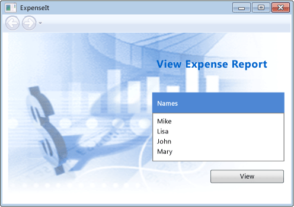
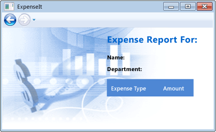
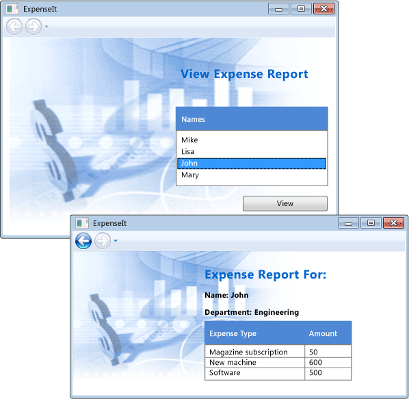

# <a name="walkthrough-my-first-wpf-desktop-application"></a>チュートリアル: 初めての WPF デスクトップ アプリケーション

この記事は、ほとんどの WPF アプリケーションに共通要素を含む簡単な Windows Presentation Foundation (WPF) アプリケーションを開発する方法を示します: Extensible Application Markup Language (XAML) マークアップ、分離コード、アプリケーションの定義コントロール、レイアウト、データ バインディング、およびスタイル。

このチュートリアルには、次の手順が含まれています。

- XAML を使用すると、アプリケーションのユーザー インターフェイス (UI) の外観をデザインできます。

- アプリケーションの動作を構築するコードを記述します。

- アプリケーションを管理するアプリケーション定義を作成します。

- コントロールを追加し、アプリケーションの UI を作成するレイアウトを作成します。

- アプリケーションの UI 全体で一貫した外観のスタイルを作成します。

- UI を両方とデータと同期されている UI をデータから UI を挿入するデータにバインドします。

チュートリアルの目的は、スタンドアロンの Windows アプリケーションを選択したユーザーの経費報告書を表示することができますを構築があります。 アプリケーションは、ブラウザー スタイルのウィンドウでホストされているいくつかの WPF ページで構成されます。

> [!TIP]
> このチュートリアルの構築に使用するサンプル コードは、Visual Basic および c# での使用可能な[Introduction to Building WPF Applications](http://go.microsoft.com/fwlink/?LinkID=160008)です。

## <a name="prerequisites"></a>必須コンポーネント

- Visual Studio 2012 以降

Visual Studio の最新バージョンのインストールに関する詳細については、次を参照してください。 [Visual Studio インストール](/visualstudio/install/install-visual-studio)です。

## <a name="create-the-application-project"></a>アプリケーション プロジェクトを作成します。

最初の手順では、アプリケーション定義、2 つのページとイメージが含まれるアプリケーション インフラストラクチャを作成します。

1. Visual Basic または Visual c# のという名前の新しい WPF アプリケーション プロジェクトを作成する**ExpenseIt**:

   1. Visual Studio を開き、選択**ファイル** > **新規** > **プロジェクト**です。

      **新しいプロジェクト**ダイアログ ボックスが開きます。

   2. 下にある、**インストール**カテゴリで、いずれかを展開、 **Visual c#** または**Visual Basic**ノードをクリックして**Windows クラシック デスクトップ**です。

   3. 選択、 **WPF アプリケーション (.NET Framework)** テンプレート。 名前を入力します**ExpenseIt**し、 **OK**です。

      

      Visual Studio プロジェクトが作成され、既定のアプリケーション ウィンドウをという名前のデザイナーが開きます**MainWindow.xaml**です。

   > [!NOTE]
   > このチュートリアルでは、<xref:System.Windows.Controls.DataGrid>以降、.NET Framework 4 で利用可能であるコントロールです。 プロジェクトの対象 .NET Framework 4 であることを確認して以降であります。 詳細については、「[方法: .NET Framework のバージョンをターゲットにする](/visualstudio/ide/how-to-target-a-version-of-the-dotnet-framework)」を参照してください。

2. 開いている*Application.xaml* (Visual Basic) または*App.xaml* (C# の場合)。

    この XAML ファイルは、WPF アプリケーションとアプリケーション リソースを定義します。 使用することもこのファイルに自動的に表示する UI を指定するアプリケーションを開始します。この場合、 *MainWindow.xaml*です。

    XAML を Visual Basic では次のようになります。

    [!code-xaml[ExpenseIt#1_A](../../../../samples/snippets/visualbasic/VS_Snippets_Wpf/ExpenseIt/VB/ExpenseIt1_A/Application.xaml#1_a)]

    C# では、次のようになります。

    [!code-xaml[ExpenseIt#1](../../../../samples/snippets/csharp/VS_Snippets_Wpf/ExpenseIt/CSharp/ExpenseIt/App.xaml#1)]

3. 開いている*MainWindow.xaml*です。

    この XAML ファイルは、アプリケーションのメイン ウィンドウで、ページに作成されたコンテンツを表示します。 <xref:System.Windows.Window>クラスなど、そのタイトル、サイズ、または、アイコン、ウィンドウのプロパティを定義し、閉じるか、非表示にするなどのイベントを処理します。

4. 変更、<xref:System.Windows.Window>要素を<xref:System.Windows.Navigation.NavigationWindow>xaml を次に示すように、します。

   ```xaml
   <NavigationWindow x:Class="ExpenseIt.MainWindow"
        xmlns="http://schemas.microsoft.com/winfx/2006/xaml/presentation"
        xmlns:x="http://schemas.microsoft.com/winfx/2006/xaml"
        ...
   </NavigationWindow>
   ```

   このアプリは、ユーザーの入力に応じてさまざまなコンテンツに移動します。 その理由は、メイン<xref:System.Windows.Window>に変更する必要があります、<xref:System.Windows.Navigation.NavigationWindow>です。 <xref:System.Windows.Navigation.NavigationWindow> すべてのプロパティを継承<xref:System.Windows.Window>です。 <xref:System.Windows.Navigation.NavigationWindow> XAML ファイル内の要素のインスタンスを作成する、<xref:System.Windows.Navigation.NavigationWindow>クラスです。 詳細については、次を参照してください。[ナビゲーション概要](../../../../docs/framework/wpf/app-development/navigation-overview.md)です。

5. 次のプロパティを変更、<xref:System.Windows.Navigation.NavigationWindow>要素。

    - 設定、<xref:System.Windows.Window.Title%2A>プロパティを"ExpenseIt"です。

    - 設定、<xref:System.Windows.FrameworkElement.Width%2A>プロパティを 500 ピクセルです。

    - 設定、 <xref:System.Windows.FrameworkElement.Height%2A> 350 ピクセル プロパティです。

    - 削除、<xref:System.Windows.Controls.Grid>の間に要素、<xref:System.Windows.Navigation.NavigationWindow>タグ。

    XAML を Visual Basic では次のようになります。

    [!code-xaml[ExpenseIt#2_A](../../../../samples/snippets/visualbasic/VS_Snippets_Wpf/ExpenseIt/VB/ExpenseIt/MainWindow.xaml#2_a)]

    C# では、次のようになります。

    [!code-xaml[ExpenseIt#2](../../../../samples/snippets/csharp/VS_Snippets_Wpf/ExpenseIt/CSharp/ExpenseIt/MainWindow.xaml#2)]

6. 開いている*MainWindow.xaml.vb*または*MainWindow.xaml.cs*です。

    このファイルは、分離コード ファイルで宣言されたイベントを処理するコードを含む*MainWindow.xaml*です。 このファイルには、XAML で定義されたウィンドウの部分クラスが含まれています。

7. C# を使用している場合は、変更、`MainWindow`から派生するクラス<xref:System.Windows.Navigation.NavigationWindow>です。 (Visual basic でこの自動的に行われます XAML でウィンドウを変更するとします。)

   コードは、次のようになります。

   [!code-csharp[ExpenseIt#3](../../../../samples/snippets/csharp/VS_Snippets_Wpf/ExpenseIt/CSharp/ExpenseIt/MainWindow.xaml.cs#3)]
   [!code-vb[ExpenseIt#3](../../../../samples/snippets/visualbasic/VS_Snippets_Wpf/ExpenseIt/VB/ExpenseIt1_A/MainWindow.xaml.vb#3)]

   > [!TIP]
   > C# と Visual Basic のサンプル コードのコードの言語を切り替えることができます、**言語**この記事の上部の右側にドロップダウンします。

## <a name="add-files-to-the-application"></a>ファイルをアプリケーションに追加します。

このセクションでは、アプリケーションに 2 つのページと 1 つのイメージを追加します。

1. プロジェクトに新しい WPF ページを追加し、名前*ExpenseItHome.xaml*:

   1. **ソリューション エクスプ ローラー**を右クリックし、 **ExpenseIt**プロジェクト ノードと選択**追加** > **ページ**です。

   1. **新しい項目の追加**ダイアログ ボックスで、**ページ (WPF)** テンプレートが既に選択されています。 名前を入力します**ExpenseItHome**、し、**追加**です。

    このページは、アプリケーションが起動されるときに表示される最初のページです。 経費報告書を表示するからを選択する人のユーザーの一覧表示されます。

2. *ExpenseItHome.xaml*を開きます。

3. 設定、 <xref:System.Windows.Controls.Page.Title%2A> "ExpenseIt - ホーム"にします。

    XAML を Visual Basic では次のようになります。

    [!code-xaml[ExpenseIt#6_A](../../../../samples/snippets/visualbasic/VS_Snippets_Wpf/ExpenseIt/VB/ExpenseIt1_A/ExpenseItHome.xaml#6_a)]

    C# では、次のようになります。

    [!code-xaml[ExpenseIt#6](../../../../samples/snippets/csharp/VS_Snippets_Wpf/ExpenseIt/CSharp/ExpenseIt2/ExpenseItHome.xaml#6)]

4. 開いている*MainWindow.xaml*です。

5. 設定、<xref:System.Windows.Navigation.NavigationWindow.Source%2A>プロパティを<xref:System.Windows.Navigation.NavigationWindow>"ExpenseItHome.xaml"にします。

    これにより、 *ExpenseItHome.xaml* が、アプリケーションの起動時に最初に開くページになります。 XAML を Visual Basic では次のようになります。

    [!code-xaml[ExpenseIt#7_A](../../../../samples/snippets/visualbasic/VS_Snippets_Wpf/ExpenseIt/VB/ExpenseIt1_A/MainWindow.xaml#7_a)]

    C# では、次のようになります。

    [!code-xaml[ExpenseIt#7](../../../../samples/snippets/csharp/VS_Snippets_Wpf/ExpenseIt/CSharp/ExpenseIt2/MainWindow.xaml#7)]

   > [!TIP]
   > 設定することも、**ソース**プロパティに、 **[その他]** のカテゴリ、**プロパティ**ウィンドウです。
   >
   > 

6. プロジェクトに別の新しい WPF ページを追加し、名前*ExpenseReportPage.xaml*:。

   1. **ソリューション エクスプ ローラー**を右クリックし、 **ExpenseIt**プロジェクト ノードと選択**追加** > **ページ**です。

   1. **新しい項目の追加**ダイアログ ボックスで、**ページ (WPF)** テンプレートが既に選択されています。 名前を入力します**ExpenseReportPage**、し、**追加**です。

    このページで選択されているユーザーの経費報告書に表示されます、 **ExpenseItHome**ページ。

7. *ExpenseReportPage.xaml*を開きます。

8. 設定、 <xref:System.Windows.Controls.Page.Title%2A> "ExpenseIt - 経費の表示"にします。

    XAML を Visual Basic では次のようになります。

    [!code-xaml[ExpenseIt#4_A](../../../../samples/snippets/visualbasic/VS_Snippets_Wpf/ExpenseIt/VB/ExpenseIt1_A/ExpenseReportPage.xaml#4_a)]

    C# では、次のようになります。

    [!code-xaml[ExpenseIt#4](../../../../samples/snippets/csharp/VS_Snippets_Wpf/ExpenseIt/CSharp/ExpenseIt/ExpenseReportPage.xaml#4)]

9. 開いている*ExpenseItHome.xaml.vb*と*ExpenseReportPage.xaml.vb*、または*ExpenseItHome.xaml.cs*と*ExpenseReportPage.xaml.cs*.

    新しいページのファイルを作成すると、Visual Studio は自動的に作成、*コード ビハインド*ファイル。 これらの分離コード ファイルでは、ユーザー入力に対応するためのロジックを処理します。

    コードの次のようになります**ExpenseItHome**:

    [!code-csharp[ExpenseIt#2_5](../../../../samples/snippets/csharp/VS_Snippets_Wpf/ExpenseIt/CSharp/ExpenseIt2/ExpenseItHome.xaml.cs#2_5)]
    [!code-vb[ExpenseIt#2_5](../../../../samples/snippets/visualbasic/VS_Snippets_Wpf/ExpenseIt/VB/ExpenseIt1_A/ExpenseItHome.xaml.vb#2_5)]

    次のように、 **ExpenseReport**:

    [!code-csharp[ExpenseIt#5](../../../../samples/snippets/csharp/VS_Snippets_Wpf/ExpenseIt/CSharp/ExpenseIt/ExpenseReportPage.xaml.cs#5)]
    [!code-vb[ExpenseIt#5](../../../../samples/snippets/visualbasic/VS_Snippets_Wpf/ExpenseIt/VB/ExpenseIt1_A/ExpenseReportPage.xaml.vb#5)]

10. という名前のイメージを追加*watermark.png*をプロジェクトにします。 独自のイメージを作成、サンプル コードからファイルをコピーまたは入手[ここ](https://github.com/dotnet/docs/blob/master/docs/framework/wpf/getting-started/media/watermark.png)です。

   1. プロジェクト ノードを右クリックし **追加** > **既存項目の**、またはキーを押して**shift キーを押し**+**Alt**+ **A**です。

   2. **既存項目の追加**ダイアログ ボックスで、[参照] をクリックしてを使用するイメージ ファイルに**追加**です。

## <a name="build-and-run-the-application"></a>アプリケーションのビルドと実行

1. キーを押して、アプリケーションをビルドして実行、 **f5 キーを押して**または選択**デバッグの開始**から、**デバッグ**メニュー。

    次の図は、アプリケーションに、<xref:System.Windows.Navigation.NavigationWindow>ボタン。

    

2. Visual Studio に戻るには、アプリケーションを閉じます。

## <a name="create-the-layout"></a>レイアウトを作成します。

レイアウトでは、順序付けられた UI 要素を配置する方法を提供し、UI のサイズを変更したときに、それらの要素の位置とサイズも管理します。 通常、レイアウトを作成するには、次のいずれかのレイアウト コントロールを使用します。

- <xref:System.Windows.Controls.Canvas>
- <xref:System.Windows.Controls.DockPanel>
- <xref:System.Windows.Controls.Grid>
- <xref:System.Windows.Controls.StackPanel>
- <xref:System.Windows.Controls.VirtualizingStackPanel>
- <xref:System.Windows.Controls.WrapPanel>

これらの各レイアウト コントロールは、その子要素に対する特別な種類のレイアウトをサポートしています。 ExpenseIt のページはサイズの変更が可能で、各ページの要素は縦にも横にも他の要素と揃えられます。 その結果、<xref:System.Windows.Controls.Grid>アプリケーションに最適なレイアウト要素です。

> [!TIP]
> 詳細については<xref:System.Windows.Controls.Panel>要素を参照してください[パネルの概要](../../../../docs/framework/wpf/controls/panels-overview.md)です。 レイアウトの詳細については、次を参照してください。[レイアウト](../../../../docs/framework/wpf/advanced/layout.md)です。

セクションで、テーブルを作成する、単一列 3 つの行と 10 ピクセルの余白を含む列と行の定義を追加することによって、<xref:System.Windows.Controls.Grid>で*ExpenseItHome.xaml*です。

1. *ExpenseItHome.xaml*を開きます。

2. 設定、<xref:System.Windows.FrameworkElement.Margin%2A>プロパティを<xref:System.Windows.Controls.Grid>「10,0,10,10」は、左、上、右および下余白に対応する要素。

   ```xaml
   <Grid Margin="10,0,10,10">
   ```

   > [!TIP]
   > 設定することも、**余白**の値が、**プロパティ** ウィンドウで、**レイアウト**カテゴリ。
   >
   > ![[プロパティ] ウィンドウの余白の値](media/properties-margin.png)

3. 間に次の XAML を追加、<xref:System.Windows.Controls.Grid>タグ行と列の定義を作成します。

    [!code-xaml[ExpenseIt#8](../../../../samples/snippets/csharp/VS_Snippets_Wpf/ExpenseIt/CSharp/ExpenseIt3/ExpenseItHome.xaml#8)]

    <xref:System.Windows.Controls.RowDefinition.Height%2A> 2 つの行に設定されている<xref:System.Windows.GridLength.Auto%2A>行の内容は、基に、行のサイズが設定されたことを意味します。 既定値<xref:System.Windows.Controls.RowDefinition.Height%2A>は<xref:System.Windows.GridUnitType.Star>サイズ変更は、行の高さが使用可能な領域の加重比率であることを意味します。 たとえば、次の 2 つの行がある場合、<xref:System.Windows.Controls.RowDefinition.Height%2A>の"*"、それぞれがある使用可能な領域の半分の高さ。

    <xref:System.Windows.Controls.Grid>は次の XAML のようになります。

    [!code-xaml[ExpenseIt#9](../../../../samples/snippets/csharp/VS_Snippets_Wpf/ExpenseIt/CSharp/ExpenseIt3/ExpenseItHome.xaml#9)]

## <a name="add-controls"></a>コントロールを追加します。

このセクションで、ホーム ページの経費報告書を表示する、ユーザーが選択できる人のユーザーの一覧を表示する UI を更新します。 コントロールとは、ユーザーがアプリケーションと対話できるようにする UI オブジェクトのことです。 詳しくは、「 [コントロール](../../../../docs/framework/wpf/controls/index.md)」をご覧ください。

この UI を作成するには、次の要素を追加します*ExpenseItHome.xaml*:

- <xref:System.Windows.Controls.ListBox> (用、ユーザーの一覧)。
- <xref:System.Windows.Controls.Label> (リストのヘッダーとして)。
- <xref:System.Windows.Controls.Button> (をクリックして、一覧で選択されているユーザーの経費報告書を表示する)。

行内の各コントロールが配置される、<xref:System.Windows.Controls.Grid>を設定して、<xref:System.Windows.Controls.Grid.Row%2A?displayProperty=nameWithType>添付プロパティ。 添付プロパティの詳細については、次を参照してください。[添付プロパティの概要](../../../../docs/framework/wpf/advanced/attached-properties-overview.md)です。

1. *ExpenseItHome.xaml*を開きます。

2. 次の XAML を追加任意の場所の間、<xref:System.Windows.Controls.Grid>タグ。

   [!code-xaml[ExpenseIt#10](../../../../samples/snippets/csharp/VS_Snippets_Wpf/ExpenseIt/CSharp/ExpenseIt4/ExpenseItHome.xaml#10)]

   > [!TIP]
   > ドラッグしてから、コントロールを作成することも、**ツールボックス**デザイン ウィンドウとでそれらのプロパティを設定 ウィンドウ、**プロパティ**ウィンドウです。

3. アプリケーションをビルドして実行します。

次の図は、作成したコントロールを示しています。


## <a name="add-an-image-and-a-title"></a>イメージとタイトルを追加します。

このセクションでイメージとページ タイトル ホーム ページの UI を更新します。

1. *ExpenseItHome.xaml*を開きます。

2. 別の列を追加、<xref:System.Windows.Controls.Grid.ColumnDefinitions%2A>固定の<xref:System.Windows.Controls.ColumnDefinition.Width%2A>230 ピクセルの。

    [!code-xaml[ExpenseIt#11](../../../../samples/snippets/csharp/VS_Snippets_Wpf/ExpenseIt/CSharp/ExpenseIt5/ExpenseItHome.xaml#11)]

3. 別の行を追加、 <xref:System.Windows.Controls.Grid.RowDefinitions%2A>、4 つの行の合計。

    [!code-xaml[ExpenseIt#11b](../../../../samples/snippets/csharp/VS_Snippets_Wpf/ExpenseIt/CSharp/ExpenseIt5/ExpenseItHome.xaml#11b)]

4. 2 番目の列に設定して、コントロールを移動、 <xref:System.Windows.Controls.Grid.Column%2A?displayProperty=nameWithType> 1 に 3 つのコントロール (境界線、リスト ボックス、およびボタン) の各プロパティ。

5. 下の行をインクリメントして各コントロールを移動するその<xref:System.Windows.Controls.Grid.Row%2A?displayProperty=nameWithType>値を 1 つです。

   3 つのコントロールの XAML は、次のようになります。

    [!code-xaml[ExpenseIt#12](../../../../samples/snippets/csharp/VS_Snippets_Wpf/ExpenseIt/CSharp/ExpenseIt5/ExpenseItHome.xaml#12)]

6. 設定、<xref:System.Windows.Controls.Panel.Background%2A>の<xref:System.Windows.Controls.Grid>する、 *watermark.png*次の XAML 任意の場所の間を追加することで、イメージ ファイル、`<Grid>`と`<\/Grid>`タグ。

    [!code-xaml[ExpenseIt#14](../../../../samples/snippets/csharp/VS_Snippets_Wpf/ExpenseIt/CSharp/ExpenseIt5/ExpenseItHome.xaml#14)]

7. 前に、<xref:System.Windows.Controls.Border>要素を追加、<xref:System.Windows.Controls.Label>コンテンツ経費レポートの表示 を使用します。 これは、ページのタイトルです。

    [!code-xaml[ExpenseIt#13](../../../../samples/snippets/csharp/VS_Snippets_Wpf/ExpenseIt/CSharp/ExpenseIt5/ExpenseItHome.xaml#13)]

8. アプリケーションをビルドして実行します。

次の図は、追加したどのような結果を示しています。



## <a name="add-code-to-handle-events"></a>イベントを処理するコードを追加します。

1. *ExpenseItHome.xaml*を開きます。

2. 追加、<xref:System.Windows.Controls.Primitives.ButtonBase.Click>イベント ハンドラーを<xref:System.Windows.Controls.Button>要素。 詳細については、次を参照してください。[する方法: 単純なイベント ハンドラーを作成](http://msdn.microsoft.com/library/b1456e07-9dec-4354-99cf-18666b64f480)です。

    [!code-xaml[ExpenseIt#15](../../../../samples/snippets/csharp/VS_Snippets_Wpf/ExpenseIt/CSharp/ExpenseIt6/ExpenseItHome.xaml#15)]

3. *ExpenseItHome.xaml.vb* または *ExpenseItHome.xaml.cs*ファイルを開きます。

4. 次のコードを追加、`ExpenseItHome`ボタンを追加するクラス イベント ハンドラー をクリックします。 イベント ハンドラーが表示されます、 **ExpenseReportPage**ページ。

    [!code-csharp[ExpenseIt#16](../../../../samples/snippets/csharp/VS_Snippets_Wpf/ExpenseIt/CSharp/ExpenseIt6/ExpenseItHome.xaml.cs#16)]
    [!code-vb[ExpenseIt#16](../../../../samples/snippets/visualbasic/VS_Snippets_Wpf/ExpenseIt/VB/ExpenseIt6/ExpenseItHome.xaml.vb#16)]

## <a name="create-the-ui-for-expensereportpage"></a>ExpenseReportPage の UI を作成します。

*ExpenseReportPage.xaml*で選択されている人の経費報告書を表示、 **ExpenseItHome**ページ。 このセクションでコントロールをし、UI を作成**ExpenseReportPage**です。 バック グラウンドを追加し、さまざまな UI 要素の色の塗りつぶしもします。

1. *ExpenseReportPage.xaml*を開きます。

2. 間に次の XAML を追加、<xref:System.Windows.Controls.Grid>タグ。

    [!code-xaml[ExpenseIt#17](../../../../samples/snippets/csharp/VS_Snippets_Wpf/ExpenseIt/CSharp/ExpenseIt6/ExpenseReportPage.xaml#17)]

    この UI はのような*ExpenseItHome.xaml*にレポート データが表示される点を除いて、<xref:System.Windows.Controls.DataGrid>です。

3. アプリケーションをビルドして実行します。

    > [!NOTE]
    > エラーを取得する場合、<xref:System.Windows.Controls.DataGrid>が見つかりませんでしたまたは存在しない、プロジェクトの対象 .NET Framework 4 以降であるかどうかを確認します。 詳細については、「[方法: .NET Framework のバージョンをターゲットにする](/visualstudio/ide/how-to-target-a-version-of-the-dotnet-framework)」を参照してください。

4. 選択、**ビュー**ボタンをクリックします。

    経費明細書ページが表示されます。 [戻る] ナビゲーション ボタンが有効になっていることに注意してください。

次の図に、UI に要素が追加*ExpenseReportPage.xaml*です。



## <a name="style-controls"></a>スタイル コントロール

さまざまな要素の外観は、多くの場合、UI に同じ型のすべての要素に同じです。 UI を使用して[スタイル](../../../../docs/framework/wpf/controls/styling-and-templating.md)複数の要素で外観を再利用できるようにします。 スタイルの再利用性は、XAML の作成と管理を簡略化するのに役立ちます。 このセクションでは、これまでの手順で定義した要素ごとの属性を、スタイルに置き換えます。

1. 開いている*Application.xaml*または*App.xaml*です。

2. 間に次の XAML を追加、<xref:System.Windows.Application.Resources%2A?displayProperty=nameWithType>タグ。

    [!code-xaml[ExpenseIt#18](../../../../samples/snippets/csharp/VS_Snippets_Wpf/ExpenseIt/CSharp/ExpenseIt7/App.xaml#18)]

    この XAML は、次のスタイルを追加します。

    - `headerTextStyle`: ページ タイトル <xref:System.Windows.Controls.Label>の書式を設定します。

    - `labelStyle`: <xref:System.Windows.Controls.Label> コントロールの書式を設定します。

    - `columnHeaderStyle`: <xref:System.Windows.Controls.Primitives.DataGridColumnHeader>の書式を設定します。

    - `listHeaderStyle`: リスト ヘッダーの <xref:System.Windows.Controls.Border> コントロールの書式を設定します。

    - `listHeaderTextStyle`: 一覧のヘッダーを書式設定するには<xref:System.Windows.Controls.Label>です。

    - `buttonStyle`: 書式設定するには<xref:System.Windows.Controls.Button>ExpenseItHome.xaml にします。

    スタイルがリソースとの子であることを確認、<xref:System.Windows.Application.Resources%2A?displayProperty=nameWithType>プロパティ要素。 ここでは、スタイルはアプリケーション内のすべての要素に適用されます。 .NET Framework アプリケーションでリソースの使用の例は、次を参照してください。[アプリケーション リソースの使用](../../../../docs/framework/wpf/advanced/how-to-use-application-resources.md)です。

3. *ExpenseItHome.xaml*を開きます。

4. 間のすべてのものを置き換える、<xref:System.Windows.Controls.Grid>を次の XAML 要素。

    [!code-xaml[ExpenseIt#19](../../../../samples/snippets/csharp/VS_Snippets_Wpf/ExpenseIt/CSharp/ExpenseIt7/ExpenseItHome.xaml#19)]

    各コントロールの外観を定義する <xref:System.Windows.VerticalAlignment> や <xref:System.Windows.Media.FontFamily> などのプロパティは、これらのスタイルを適用することで、削除されて置き換えられます。 たとえば、 `headerTextStyle` 、支出レポートの表示 に適用される<xref:System.Windows.Controls.Label>です。

5. *ExpenseReportPage.xaml*を開きます。

6. 間のすべてのものを置き換える、<xref:System.Windows.Controls.Grid>を次の XAML 要素。

    [!code-xaml[ExpenseIt#20](../../../../samples/snippets/csharp/VS_Snippets_Wpf/ExpenseIt/CSharp/ExpenseIt7/ExpenseReportPage.xaml#20)]

    これにより、スタイルが <xref:System.Windows.Controls.Label> と <xref:System.Windows.Controls.Border> の要素に追加されます。

## <a name="bind-data-to-a-control"></a>データをコントロールにバインドします。

このセクションでは、さまざまなコントロールにバインドされている XML データを作成します。

1. *ExpenseItHome.xaml*を開きます。

2. 開始後に<xref:System.Windows.Controls.Grid>要素を作成する次の XAML を追加、<xref:System.Windows.Data.XmlDataProvider>個人ごとにデータを格納しています。

    [!code-xaml[ExpenseIt#21](../../../../samples/snippets/csharp/VS_Snippets_Wpf/ExpenseIt/CSharp/ExpenseIt8/ExpenseItHome.xaml#21)]
    [!code-xaml[ExpenseIt#23](../../../../samples/snippets/csharp/VS_Snippets_Wpf/ExpenseIt/CSharp/ExpenseIt8/ExpenseItHome.xaml#23)]
    [!code-xaml[ExpenseIt#22](../../../../samples/snippets/csharp/VS_Snippets_Wpf/ExpenseIt/CSharp/ExpenseIt8/ExpenseItHome.xaml#22)]

    データとして作成、<xref:System.Windows.Controls.Grid>リソース。 通常、これはファイルとして読み込まれますが、説明を簡単にするため、データをインラインで追加します。

3. 内で、`<Grid.Resources>`要素では、次の追加<xref:System.Windows.DataTemplate>、データを表示する方法を定義する、 <xref:System.Windows.Controls.ListBox>:

    [!code-xaml[ExpenseIt#21](../../../../samples/snippets/csharp/VS_Snippets_Wpf/ExpenseIt/CSharp/ExpenseIt8/ExpenseItHome.xaml#21)]
    [!code-xaml[ExpenseIt#24](../../../../samples/snippets/csharp/VS_Snippets_Wpf/ExpenseIt/CSharp/ExpenseIt8/ExpenseItHome.xaml#24)]
    [!code-xaml[ExpenseIt#22](../../../../samples/snippets/csharp/VS_Snippets_Wpf/ExpenseIt/CSharp/ExpenseIt8/ExpenseItHome.xaml#22)]

    データ テンプレートの詳細については、次を参照してください。[データ テンプレートの概要](../../../../docs/framework/wpf/data/data-templating-overview.md)です。

4. 既存の置換<xref:System.Windows.Controls.ListBox>を次の XAML:

    [!code-xaml[ExpenseIt#25](../../../../samples/snippets/csharp/VS_Snippets_Wpf/ExpenseIt/CSharp/ExpenseIt8/ExpenseItHome.xaml#25)]

    次の XAML バインド、<xref:System.Windows.Controls.ItemsControl.ItemsSource%2A>のプロパティ、<xref:System.Windows.Controls.ListBox>データ ソースに、データ テンプレートとして適用されると、<xref:System.Windows.Controls.ItemsControl.ItemTemplate%2A>です。

## <a name="connect-data-to-controls"></a>コントロールにデータを接続します。

次で選択されている名前を取得するコードを追加します、 **ExpenseItHome**ページし、のコンス トラクターに渡す**ExpenseReportPage**です。 **ExpenseReportPage** 、渡された項目は、コントロールが定義されている場合は、そのデータ コンテキストを設定で*ExpenseReportPage.xaml*にバインドします。

1. *ExpenseReportPage.xaml.vb* または *ExpenseReportPage.xaml.cs*を開きます。

2. オブジェクトを取得するコンストラクターを追加して、選択した個人の経費報告書データを渡せるようにします。

    [!code-csharp[ExpenseIt#26](../../../../samples/snippets/csharp/VS_Snippets_Wpf/ExpenseIt/CSharp/ExpenseIt8/ExpenseReportPage.xaml.cs#26)]
    [!code-vb[ExpenseIt#26](../../../../samples/snippets/visualbasic/VS_Snippets_Wpf/ExpenseIt/VB/ExpenseIt8/ExpenseReportPage.xaml.vb#26)]

3. *ExpenseItHome.xaml.vb* または *ExpenseItHome.xaml.cs*ファイルを開きます。

4. 変更、<xref:System.Windows.Controls.Primitives.ButtonBase.Click>選択したユーザーの経費報告書データを渡す新しいコンス トラクターを呼び出すイベント ハンドラー。

    [!code-csharp[ExpenseIt#27](../../../../samples/snippets/csharp/VS_Snippets_Wpf/ExpenseIt/CSharp/ExpenseIt8/ExpenseItHome.xaml.cs#27)]
    [!code-vb[ExpenseIt#27](../../../../samples/snippets/visualbasic/VS_Snippets_Wpf/ExpenseIt/VB/ExpenseIt8/ExpenseItHome.xaml.vb#27)]

## <a name="style-data-with-data-templates"></a>データ テンプレートを使用して形式のデータ

このセクションでは、データ テンプレートを使用してデータ バインド リスト内の各項目の UI を更新します。

1. *ExpenseReportPage.xaml*を開きます。

2. 「名前」と"Department"の内容をバインド<xref:System.Windows.Controls.Label>要素を適切なデータ ソースのプロパティです。 データ バインディングの詳細については、次を参照してください。[データ バインディングの概要](../../../../docs/framework/wpf/data/data-binding-overview.md)です。

    [!code-xaml[ExpenseIt#31](../../../../samples/snippets/csharp/VS_Snippets_Wpf/ExpenseIt/CSharp/ExpenseIt9/ExpenseReportPage.xaml#31)]

3. オープン後<xref:System.Windows.Controls.Grid>要素、経費報告書データを表示する方法を定義する次のデータ テンプレートを追加。

    [!code-xaml[ExpenseIt#30](../../../../samples/snippets/csharp/VS_Snippets_Wpf/ExpenseIt/CSharp/ExpenseIt9/ExpenseReportPage.xaml#30)]

4. テンプレートを適用する、<xref:System.Windows.Controls.DataGrid>経費を表示する列がデータを報告します。

    [!code-xaml[ExpenseIt#32](../../../../samples/snippets/csharp/VS_Snippets_Wpf/ExpenseIt/CSharp/ExpenseIt9/ExpenseReportPage.xaml#32)]

5. アプリケーションをビルドして実行します。

6. ユーザーを選択し、選択、**ビュー**ボタンをクリックします。

次の図は、コントロール、レイアウト、スタイル、データ バインディング、およびデータ テンプレートが適用された ExpenseIt アプリケーションの両方のページを示しています。



> [!NOTE]
> このサンプルでは、WPF の特定の機能について説明し、セキュリティ、ローカリゼーション、およびユーザー補助機能などのすべてのベスト プラクティスに従っていません。 WPF および .NET Framework アプリケーションの開発のベスト プラクティスの包括的なカバレッジは、次のトピックを参照してください。
>
> - [ユーザー補助](../../../../docs/framework/ui-automation/accessibility-best-practices.md)
>
> - [セキュリティ](../../../../docs/framework/wpf/security-wpf.md)
>
> - [WPF のグローバリゼーションとローカライズ](../../../../docs/framework/wpf/advanced/wpf-globalization-and-localization-overview.md)
>
> - [WPF のパフォーマンス](../../../../docs/framework/wpf/advanced/optimizing-wpf-application-performance.md)

## <a name="next-steps"></a>次の手順

このチュートリアルでは、いくつかの Windows Presentation Foundation (WPF) を使用して UI を作成するための手法について説明しました。 これで、データ バインド、.NET Framework アプリケーションのビルド ブロックの基本的な知識が必要です。 WPF のアーキテクチャおよびプログラミング モデルの詳細については、次のトピックを参照してください。

- [WPF アーキテクチャ](../../../../docs/framework/wpf/advanced/wpf-architecture.md)
- [XAML の概要 (WPF)](../../../../docs/framework/wpf/advanced/xaml-overview-wpf.md)
- [依存関係プロパティの概要](../../../../docs/framework/wpf/advanced/dependency-properties-overview.md)
- [レイアウト](../../../../docs/framework/wpf/advanced/layout.md)

アプリケーションの作成の詳細については、次のトピックを参照してください。

- [アプリケーションの開発](../../../../docs/framework/wpf/app-development/index.md)
- [コントロール](../../../../docs/framework/wpf/controls/index.md)
- [データ バインディングの概要](../../../../docs/framework/wpf/data/data-binding-overview.md)
- [グラフィックスとマルチ メディア](../../../../docs/framework/wpf/graphics-multimedia/index.md)
- [WPF のドキュメント](../../../../docs/framework/wpf/advanced/documents-in-wpf.md)

## <a name="see-also"></a>関連項目

- [パネルの概要](../../../../docs/framework/wpf/controls/panels-overview.md)
- [データ テンプレートの概要](../../../../docs/framework/wpf/data/data-templating-overview.md)
- [WPF アプリケーションを構築します。](../../../../docs/framework/wpf/app-development/building-a-wpf-application-wpf.md)
- [スタイルおよびテンプレート](../../../../docs/framework/wpf/controls/styles-and-templates.md)
