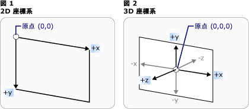
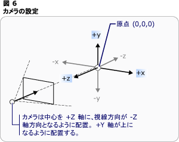
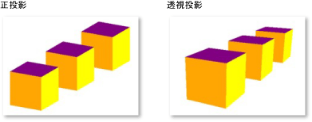

# 3-D グラフィックスの概要
 [!INCLUDE[TLA#tla_winclient](../../../../includes/tlasharptla-winclient-md.md)] の [!INCLUDE[TLA2#tla_3d](../../../../includes/tla2sharptla-3d-md.md)] 機能を使うと、マークアップと手続き型コード両方の 3-D グラフィックスを描画、変換、およびアニメーション化することができます。 開発者は [!INCLUDE[TLA#tla_2d](../../../../includes/tlasharptla-2d-md.md)] グラフィックスと [!INCLUDE[TLA2#tla_3d](../../../../includes/tla2sharptla-3d-md.md)] グラフィックスを組み合わせて、リッチなコントロールを作成したり、データの複雑なイラストを提供したり、アプリケーションのインターフェイスのユーザー エクスペリエンスを拡張したりすることができます。 [!INCLUDE[TLA2#tla_winclient](../../../../includes/tla2sharptla-winclient-md.md)] での [!INCLUDE[TLA2#tla_3d](../../../../includes/tla2sharptla-3d-md.md)] のサポートは、フル機能のゲーム開発プラットフォームを提供するようには設計されていません。 このトピックでは、[!INCLUDE[TLA2#tla_winclient](../../../../includes/tla2sharptla-winclient-md.md)] グラフィックス システムでの [!INCLUDE[TLA#tla_3d](../../../../includes/tlasharptla-3d-md.md)] 機能の概要について説明します。  
 
  
   
## 2-D コンテナー内の 3-D  
 [!INCLUDE[TLA2#tla_3d](../../../../includes/tla2sharptla-3d-md.md)] グラフィックでコンテンツ[!INCLUDE[TLA2#tla_winclient](../../../../includes/tla2sharptla-winclient-md.md)]要素内にカプセル化<xref:System.Windows.Controls.Viewport3D>、2 次元の要素の構造に含まれることができます。 グラフィックス システム処理<xref:System.Windows.Controls.Viewport3D>内にあるその他の多くのような 2 次元の visual 要素として[!INCLUDE[TLA2#tla_winclient](../../../../includes/tla2sharptla-winclient-md.md)]です。 <xref:System.Windows.Controls.Viewport3D> ウィンドウとして機能-ビューポート-3 次元シーンにします。 より正確には、[!INCLUDE[TLA2#tla_3d](../../../../includes/tla2sharptla-3d-md.md)] シーンが投影されるサーフェイスです。  
  
 従来の[!INCLUDE[TLA2#tla_2d](../../../../includes/tla2sharptla-2d-md.md)]アプリケーションでは、使用<xref:System.Windows.Controls.Viewport3D>グリッドまたはキャンバスのような別のコンテナー要素と同様です。  使用できますが<xref:System.Windows.Controls.Viewport3D>他[!INCLUDE[TLA2#tla_2d](../../../../includes/tla2sharptla-2d-md.md)]シーンで同じグラフにオブジェクトを描画することはできませんめり込んで[!INCLUDE[TLA2#tla_2d](../../../../includes/tla2sharptla-2d-md.md)]と[!INCLUDE[TLA2#tla_3d](../../../../includes/tla2sharptla-3d-md.md)]内のオブジェクトは、<xref:System.Windows.Controls.Viewport3D>です。  このトピックの内容にどのように描画する焦点[!INCLUDE[TLA2#tla_3d](../../../../includes/tla2sharptla-3d-md.md)]内にあるグラフィック、<xref:System.Windows.Controls.Viewport3D>です。  
  
   
## 3-D 座標空間  
 [!INCLUDE[TLA2#tla_2d](../../../../includes/tla2sharptla-2d-md.md)] グラフィックス用の [!INCLUDE[TLA2#tla_winclient](../../../../includes/tla2sharptla-winclient-md.md)] 座標系の原点は、レンダリング領域 (通常は画面) の左上にあります。 [!INCLUDE[TLA2#tla_2d](../../../../includes/tla2sharptla-2d-md.md)] システムでは、x 軸の正の値は右に向かって大きくなり、y 軸の正の値は下に向かって大きくなります。  一方、[!INCLUDE[TLA2#tla_3d](../../../../includes/tla2sharptla-3d-md.md)] 座標系では、原点はレンダリング領域の中央にあり、x 軸の正の値は右に向かって大きくなりますが、y 軸の正の値は上に向かって大きくなり、z 軸の正の値は原点から手前に向かって大きくなります。  
  
   
従来の 2-D および 3-D 座標系の表現  
  
 これらの軸によって定義される空間は、[!INCLUDE[TLA2#tla_winclient](../../../../includes/tla2sharptla-winclient-md.md)] 内の [!INCLUDE[TLA2#tla_3d](../../../../includes/tla2sharptla-3d-md.md)] オブジェクトのための静止した基準枠です。 この空間内にモデルを構築し、それらを表示するためのライトとカメラを作成するときは、この静止した基準枠 ("ワールド空間") と、モデルに変換を適用するときにモデルごとに作成するローカルな基準枠を区別することをお勧めします。 また、ワールド空間内のオブジェクトは、ライトとカメラの設定により、まったく違って見えたり、またはまったく見えなくなることがありますが、カメラの位置によってワールド空間内のオブジェクトの場所が変化することはないことに注意してください。  
  
   
## カメラと投影  
 [!INCLUDE[TLA2#tla_2d](../../../../includes/tla2sharptla-2d-md.md)] で作業する開発者は、2 次元の画面に描画プリミティブを配置することに慣れています。 [!INCLUDE[TLA2#tla_3d](../../../../includes/tla2sharptla-3d-md.md)] シーンを作成するときは、実際には [!INCLUDE[TLA2#tla_3d](../../../../includes/tla2sharptla-3d-md.md)] オブジェクトの [!INCLUDE[TLA2#tla_2d](../../../../includes/tla2sharptla-2d-md.md)] 表現を作成しているということを忘れないようにすることが重要です。 [!INCLUDE[TLA2#tla_3d](../../../../includes/tla2sharptla-3d-md.md)] シーンは観察者の視点によって見え方が異なるので、その視点を指定する必要があります。 <xref:System.Windows.Media.Media3D.Camera>クラスでは、このポイントのビューを指定することができます、[!INCLUDE[TLA2#tla_3d](../../../../includes/tla2sharptla-3d-md.md)]シーンです。  
  
 [!INCLUDE[TLA2#tla_3d](../../../../includes/tla2sharptla-3d-md.md)] シーンが [!INCLUDE[TLA2#tla_2d](../../../../includes/tla2sharptla-2d-md.md)] サーフェイス上でどのように表現されるかを理解するもう 1 つの方法は、表示サーフェイスへの投影としてシーンを記述することです。 <xref:System.Windows.Media.Media3D.ProjectionCamera>さまざまな予測と観察の表示を変更するには、そのプロパティを指定することができます[!INCLUDE[TLA2#tla_3d](../../../../includes/tla2sharptla-3d-md.md)]モデル。 A<xref:System.Windows.Media.Media3D.PerspectiveCamera>シーンを foreshortens 投影を指定します。  言い換えると、<xref:System.Windows.Media.Media3D.PerspectiveCamera>消失点透視投影を提供します。  シーンの座標空間内でのカメラの位置、カメラの方向と視野、およびシーン内での "上" の方向を定義するベクトルを指定できます。 次の図は、<xref:System.Windows.Media.Media3D.PerspectiveCamera>のプロジェクション。  
  
 <xref:System.Windows.Media.Media3D.ProjectionCamera.NearPlaneDistance%2A>と<xref:System.Windows.Media.Media3D.ProjectionCamera.FarPlaneDistance%2A>プロパティの<xref:System.Windows.Media.Media3D.ProjectionCamera>カメラの投影の範囲を制限します。 カメラはシーン内の任意の場所に配置できるため、カメラをモデルの内部またはモデルの非常に近くに実際に配置することができ、オブジェクトを正しく識別するのが困難になる場合があります。  <xref:System.Windows.Media.Media3D.ProjectionCamera.NearPlaneDistance%2A> これを超えるオブジェクトが描画しないカメラからの最小距離を指定できます。  これに対し、<xref:System.Windows.Media.Media3D.ProjectionCamera.FarPlaneDistance%2A>を認識できる離れすぎてオブジェクトをシーンに含まれるしないことを実行できるようにこれを超えるオブジェクトは描画されません、カメラからの距離を指定することができます。  
  
   
カメラの位置  
  
 <xref:System.Windows.Media.Media3D.OrthographicCamera> 正の射影を指定します、[!INCLUDE[TLA2#tla_3d](../../../../includes/tla2sharptla-3d-md.md)]モデルを[!INCLUDE[TLA2#tla_2d](../../../../includes/tla2sharptla-2d-md.md)]ビジュアル サーフェイスです。 他のカメラと同じように、位置、視線方向、および "上" の向きを指定します。 異なり<xref:System.Windows.Media.Media3D.PerspectiveCamera>、ただし、<xref:System.Windows.Media.Media3D.OrthographicCamera>パースペクティブの短縮を含まない射影について説明します。 つまり、<xref:System.Windows.Media.Media3D.OrthographicCamera>辺が並列ではなくいずれかの辺を満たす、カメラにある点で、表示ボックスについて説明します。 次の図に、同じモデルを使用して表示<xref:System.Windows.Media.Media3D.PerspectiveCamera>と<xref:System.Windows.Media.Media3D.OrthographicCamera>です。  
  
   
透視投影と正投影  
  
 次のコードでは、カメラの一般的な設定を示します。  
  
 [!code-csharp[3dgallery_procedural_snip#Basic3DShapeCodeExampleInline1](../../../../samples/snippets/csharp/VS_Snippets_Wpf/3DGallery_procedural_snip/CSharp/Basic3DShapeExample.cs#basic3dshapecodeexampleinline1)]
 [!code-vb[3dgallery_procedural_snip#Basic3DShapeCodeExampleInline1](../../../../samples/snippets/visualbasic/VS_Snippets_Wpf/3DGallery_procedural_snip/visualbasic/basic3dshapeexample.vb#basic3dshapecodeexampleinline1)]  
  
   
## モデルとメッシュ プリミティブ  
  
 <xref:System.Windows.Media.Media3D.Model3D> ジェネリック型を表す抽象基本クラスは、[!INCLUDE[TLA2#tla_3d](../../../../includes/tla2sharptla-3d-md.md)]オブジェクト。 構築する、[!INCLUDE[TLA2#tla_3d](../../../../includes/tla2sharptla-3d-md.md)]シーン、一部のオブジェクトを表示する必要があり、シーンのグラフを構成するオブジェクトから派生して<xref:System.Windows.Media.Media3D.Model3D>です。 現時点では、[!INCLUDE[TLA2#tla_winclient](../../../../includes/tla2sharptla-winclient-md.md)]のジオメトリをモデリングをサポートしている<xref:System.Windows.Media.Media3D.GeometryModel3D>です。 <xref:System.Windows.Media.Media3D.GeometryModel3D.Geometry%2A>このモデルのプロパティにプリミティブ メッシュはします。  
  
 モデルを構築するには、最初にプリミティブ (メッシュ) を作成します。 [!INCLUDE[TLA2#tla_3d](../../../../includes/tla2sharptla-3d-md.md)] のプリミティブは、1 つの [!INCLUDE[TLA2#tla_3d](../../../../includes/tla2sharptla-3d-md.md)] エンティティを形成する頂点の集合です。 ほとんどの [!INCLUDE[TLA2#tla_3d](../../../../includes/tla2sharptla-3d-md.md)] システムでは、最も簡単な閉じた図形 (3 つの頂点で定義された三角形) でモデル化されたプリミティブが提供されます。  三角形の 3 つの頂点は同一平面上にあるため、三角形の追加を続けて、メッシュと呼ばれる複雑な図形をモデル化できます。  
  
 [!INCLUDE[TLA2#tla_winclient](../../../../includes/tla2sharptla-winclient-md.md)] [!INCLUDE[TLA2#tla_3d](../../../../includes/tla2sharptla-3d-md.md)]システムは、現在、<xref:System.Windows.Media.Media3D.MeshGeometry3D>クラス、任意のジオメトリを指定することができます以外の場合は現在サポートしていません定義済み[!INCLUDE[TLA2#tla_3d](../../../../includes/tla2sharptla-3d-md.md)]球体や立方フォームなどのプリミティブです。 作成を開始、<xref:System.Windows.Media.Media3D.MeshGeometry3D>として三角形の頂点の一覧を指定することによってその<xref:System.Windows.Media.Media3D.MeshGeometry3D.Positions%2A>プロパティです。 各頂点として指定されて、<xref:System.Windows.Media.Media3D.Point3D>です。  ([!INCLUDE[TLA#tla_xaml](../../../../includes/tlasharptla-xaml-md.md)] では、各頂点の座標を表す 3 組の数値のリストとして、このプロパティを指定します)。ジオメトリによっては、メッシュが多くの三角形で構成され、その一部が同じ角 (頂点) を共有する可能性があります。 [!INCLUDE[TLA2#tla_winclient](../../../../includes/tla2sharptla-winclient-md.md)] でメッシュを正しく描画するには、どの頂点がどの三角形によって共有されているのかということに関する情報が必要です。 三角形のインデックスの一覧を指定することでこの情報を提供する、<xref:System.Windows.Media.Media3D.MeshGeometry3D.TriangleIndices%2A>プロパティです。 この一覧で、ポイントが指定された順序を指定する、<xref:System.Windows.Media.Media3D.MeshGeometry3D.Positions%2A>一覧の三角形が決定されます。  
  
 [!code-xaml[basic3d#Basic3DXAML3DN3](../../../../samples/snippets/xaml/VS_Snippets_Wpf/Basic3D/XAML/Window1.xaml#basic3dxaml3dn3)]  
  
 前の例で、<xref:System.Windows.Media.Media3D.MeshGeometry3D.Positions%2A>リストを定義するキューブの形のメッシュに 8 個の頂点を指定します。 <xref:System.Windows.Media.Media3D.MeshGeometry3D.TriangleIndices%2A>プロパティは、3 つのインデックスの 12 個のグループの一覧を指定します。  リスト内の個々 の数がオフセットを指す、 <xref:System.Windows.Media.Media3D.MeshGeometry3D.Positions%2A>  ボックスの一覧です。  指定された最初の 3 つの頂点など、 <xref:System.Windows.Media.Media3D.MeshGeometry3D.Positions%2A>  ボックスの一覧が (1,1,0) (0,1,0) (0,0,0) とします。 指定された最初の 3 つのインデックス、<xref:System.Windows.Media.Media3D.MeshGeometry3D.TriangleIndices%2A>一覧は、0、2、および 1、第 3 に、最初に対応し、2 番目のポイントで、 <xref:System.Windows.Media.Media3D.MeshGeometry3D.Positions%2A>  ボックスの一覧です。 つまり、この立方体モデルを構成する最初の三角形は、(1,1,0)、(0,1,0)、(0,0,0) から作成されます。残りの 11 個の三角形も同じようにして決定されます。  
  
 値を指定して、モデルの定義を続行することができます、<xref:System.Windows.Media.Media3D.MeshGeometry3D.Normals%2A>と<xref:System.Windows.Media.Media3D.MeshGeometry3D.TextureCoordinates%2A>プロパティです。  グラフィックス システムがモデルのサーフェイスをレンダリングするには、特定の三角形において面が向いている方向に関する情報が必要です。 この情報を使って、モデルの照明の計算が行われます。光源に正対しているサーフェイスは、光源に対して角度のあるサーフェスより明るくなります。 [!INCLUDE[TLA2#tla_winclient](../../../../includes/tla2sharptla-winclient-md.md)]は位置座標を使って既定の法線ベクトルを決定できますが、曲面の外観を近似する別の法線ベクトルを指定することもできます。  
  
 <xref:System.Windows.Media.Media3D.MeshGeometry3D.TextureCoordinates%2A>プロパティのコレクションを指定する<xref:System.Windows.Point>グラフィックス システム メッシュの頂点にテクスチャを描画する方法を決定する座標をマップする方法を指示する秒です。 <xref:System.Windows.Media.Media3D.MeshGeometry3D.TextureCoordinates%2A> 0 ~ 1 の値として指定されます。  同様、<xref:System.Windows.Media.Media3D.MeshGeometry3D.Normals%2A>プロパティ、グラフィックス システムは既定で、テクスチャ座標が、繰り返しのパターンの一部を含むテクスチャのマッピングを制御するさまざまなテクスチャ座標を設定することもできますを計算できます。 テクスチャ座標について詳しくは、マネージ Direct3D SDK の後続のトピックをご覧ください。  
  
 次の例では、手続き型コードで立方体モデルの 1 つの面を作成する方法を示します。 立方体全体を単一の GeometryModel3D として描画できることに注意してください。この例では、後で各面に異なるテクスチャを適用するため、個別のモデルとして立方体の面を描画します。  
  
 [!code-csharp[3doverview#3DOverview3DN6](../../../../samples/snippets/csharp/VS_Snippets_Wpf/3DOverview/CSharp/Window1.xaml.cs#3doverview3dn6)]
 [!code-vb[3doverview#3DOverview3DN6](../../../../samples/snippets/visualbasic/VS_Snippets_Wpf/3DOverview/visualbasic/window1.xaml.vb#3doverview3dn6)]  
  
 [!code-csharp[3doverview#3DOverview3DN7](../../../../samples/snippets/csharp/VS_Snippets_Wpf/3DOverview/CSharp/Window1.xaml.cs#3doverview3dn7)]
 [!code-vb[3doverview#3DOverview3DN7](../../../../samples/snippets/visualbasic/VS_Snippets_Wpf/3DOverview/visualbasic/window1.xaml.vb#3doverview3dn7)]  
  
   
## モデルへのマテリアルの適用  
  
 メッシュが 3 次元のオブジェクトのように見えるには、頂点と三角形によって定義されたサーフェイスをカバーするようにテクスチャを適用し、カメラで照明および投影できるようにする必要があります。 [!INCLUDE[TLA2#tla_2d](../../../../includes/tla2sharptla-2d-md.md)]を使用する、<xref:System.Windows.Media.Brush>画面の領域に色、パターン、グラデーション、またはその他の visual のコンテンツを適用するクラス。  ただし、[!INCLUDE[TLA2#tla_3d](../../../../includes/tla2sharptla-3d-md.md)] オブジェクトの見た目は、オブジェクトに適用された色またはパターンだけでなく、照明モデルの関数になります。 現実世界のオブジェクトは、サーフェイスの質によって光の反射が異なります。光沢のあるサーフェイスの見た目は荒くて艶のないサーフェイスとは異なり、光を吸収するオブジェクトや反射するオブジェクトがあります。 [!INCLUDE[TLA2#tla_2d](../../../../includes/tla2sharptla-2d-md.md)] オブジェクトに適用できるものと同じすべてのブラシを [!INCLUDE[TLA2#tla_3d](../../../../includes/tla2sharptla-3d-md.md)] オブジェクトにも適用できますが、直接適用することはできません。  
  
 モデルのサーフェスの特性を定義する[!INCLUDE[TLA2#tla_winclient](../../../../includes/tla2sharptla-winclient-md.md)]を使用して、<xref:System.Windows.Media.Media3D.Material>抽象クラスです。 Material の具象サブクラスでは、モデルのサーフェイスの一部の外観特性が決まり、SolidColorBrush、TileBrush、または VisualBrush を渡すことができる Brush プロパティも提供されます。  
  
-   <xref:System.Windows.Media.Media3D.DiffuseMaterial> そのモデルがディフューズ点灯している場合と同様に、ブラシ、モデルに適用されることを指定します。 DiffuseMaterial を使うことは、[!INCLUDE[TLA2#tla_2d](../../../../includes/tla2sharptla-2d-md.md)] モデルにブラシを直接使うことと最もよく似ています。モデルのサーフェイスは光沢があるようにはライトを反射しません。  
  
-   <xref:System.Windows.Media.Media3D.SpecularMaterial> モデルのサーフェスのハードまたは光沢のある、重要なポイントを反映できるようにブラシをモデルに適用されることを指定します。 値を指定してする、テクスチャは提示この反射の品質評価、または「輝き、」度を設定することができます、<xref:System.Windows.Media.Media3D.SpecularMaterial.SpecularPower%2A>プロパティです。  
  
-   <xref:System.Windows.Media.Media3D.EmissiveMaterial> 使用すると、モデルがブラシの色に等しい光を生成した場合と同様に、テクスチャが適用されるように指定できます。 これによってモデルが明るくなることはありませんが、DiffuseMaterial または SpecularMaterial のテクスチャとは異なるシャドウになります。  
  
 背面パフォーマンス向上のため、<xref:System.Windows.Media.Media3D.GeometryModel3D>シーンからカリング (それらの面見えない、カメラからのモデルの反対側にあるため)。  指定する、<xref:System.Windows.Media.Media3D.Material>平面などのモデルの背面に適用する、設定、モデルの<xref:System.Windows.Media.Media3D.GeometryModel3D.BackMaterial%2A>プロパティです。  
  
 光彩効果や反射効果など、ある種のサーフェイス品質を実現するには、複数の異なるブラシを連続してモデルに適用することが必要な場合があります。 適用しを使用して複数のマテリアルを再利用、<xref:System.Windows.Media.Media3D.MaterialGroup>クラスです。 MaterialGroup の子は、複数のレンダリング パスの最初から最後まで適用されます。  
  
 次のコード例では、単色と描画をブラシとして [!INCLUDE[TLA2#tla_3d](../../../../includes/tla2sharptla-3d-md.md)] モデルに適用する方法を示します。  
  
 [!code-xaml[basic3d#Basic3DXAML3DN5](../../../../samples/snippets/xaml/VS_Snippets_Wpf/Basic3D/XAML/Window1.xaml#basic3dxaml3dn5)]  
  
 [!code-xaml[3doverview#3DOverview3DN9](../../../../samples/snippets/csharp/VS_Snippets_Wpf/3DOverview/CSharp/app.xaml#3doverview3dn9)]  
  
 [!code-csharp[3doverview#3DOverview3DN8](../../../../samples/snippets/csharp/VS_Snippets_Wpf/3DOverview/CSharp/Window1.xaml.cs#3doverview3dn8)]
 [!code-vb[3doverview#3DOverview3DN8](../../../../samples/snippets/visualbasic/VS_Snippets_Wpf/3DOverview/visualbasic/window1.xaml.vb#3doverview3dn8)]  
  
   
## シーンの照明  
 [!INCLUDE[TLA2#tla_3d](../../../../includes/tla2sharptla-3d-md.md)] グラフィックスのライトは、現実でのライトと同じように働いて、サーフェイスを見えるようにします。 さらに重要なことは、ライトによって投影に含まれるシーンの部分が決まります。 [!INCLUDE[TLA2#tla_winclient](../../../../includes/tla2sharptla-winclient-md.md)] の Light オブジェクトは、さまざまなライト効果とシャドウ効果を作成し、現実世界のさまざまな照明の動作に従ってモデル化されます。 シーンには少なくとも 1 つのライトを含める必要があり、含めないとモデルは見えません。  
  
 次のライトが基底クラスから派生<xref:System.Windows.Media.Media3D.Light>:  
  
-   <xref:System.Windows.Media.Media3D.AmbientLight>: の場所または印刷の向きに一様に関係なくすべてのオブジェクトが点灯周囲の照明を提供します。  
  
-   <xref:System.Windows.Media.Media3D.DirectionalLight>: 離れている光源などが点灯します。  ディレクショナル ライトが、 <xref:System.Windows.Media.Media3D.DirectionalLight.Direction%2A> Vector3D がない指定の場所として指定します。  
  
-   <xref:System.Windows.Media.Media3D.PointLight>: 近くの光源などが点灯します。 PointLight には位置があり、その位置から光を投射します。 シーン内のオブジェクトは、その位置および光源からの距離に応じて照らされます。 <xref:System.Windows.Media.Media3D.PointLightBase> 公開、<xref:System.Windows.Media.Media3D.PointLightBase.Range%2A>プロパティで、これを超えるモデルいない点灯するライトによって距離を決定します。 また、PointLight には減衰プロパティもあり、距離によって光の強度がどの程度低下するかを指定します。 光の減衰には、一定、線形、または 2 次補間を指定できます。  
  
-   <xref:System.Windows.Media.Media3D.SpotLight>: から継承<xref:System.Windows.Media.Media3D.PointLight>です。 SpotLight は PointLight と同じように照らし、位置と方向の両方を持ちます。 によって設定円錐形の領域部分は薄いに投影する<xref:System.Windows.Media.Media3D.SpotLight.InnerConeAngle%2A>と<xref:System.Windows.Media.Media3D.SpotLight.OuterConeAngle%2A>度で指定したプロパティ。  
  
 ライトが<xref:System.Windows.Media.Media3D.Model3D>オブジェクトを変換して、位置、色、方向、および範囲を含む、ライトのプロパティをアニメーション化できるようにします。  
  
 [!code-xaml[hittest3d#HitTest3D3DN6](../../../../samples/snippets/csharp/VS_Snippets_Wpf/HitTest3D/CSharp/Window1.xaml#hittest3d3dn6)]  
  
 [!code-csharp[basic3d#Basic3D3DN11](../../../../samples/snippets/csharp/VS_Snippets_Wpf/Basic3D/CSharp/Window1.xaml.cs#basic3d3dn11)]
 [!code-vb[basic3d#Basic3D3DN11](../../../../samples/snippets/visualbasic/VS_Snippets_Wpf/Basic3D/visualbasic/window1.xaml.vb#basic3d3dn11)]  
  
 [!code-csharp[basic3d#Basic3D3DN12](../../../../samples/snippets/csharp/VS_Snippets_Wpf/Basic3D/CSharp/Window1.xaml.cs#basic3d3dn12)]
 [!code-vb[basic3d#Basic3D3DN12](../../../../samples/snippets/visualbasic/VS_Snippets_Wpf/Basic3D/visualbasic/window1.xaml.vb#basic3d3dn12)]  
  
 [!code-csharp[basic3d#Basic3D3DN13](../../../../samples/snippets/csharp/VS_Snippets_Wpf/Basic3D/CSharp/Window1.xaml.cs#basic3d3dn13)]
 [!code-vb[basic3d#Basic3D3DN13](../../../../samples/snippets/visualbasic/VS_Snippets_Wpf/Basic3D/visualbasic/window1.xaml.vb#basic3d3dn13)]  
  
   
## モデルの変換  
 モデルを作成するとき、モデルにはシーン内で特定の位置があります。 モデルをシーン内で移動したり、回転したり、そのサイズを変更したりするのに、モデル自体を定義する頂点を変更するのは実用的ではありません。  そのような場合は、[!INCLUDE[TLA2#tla_2d](../../../../includes/tla2sharptla-2d-md.md)] と同じように、モデルに変換を適用します。  
  
 各モデル オブジェクトには、<xref:System.Windows.Media.Media3D.Model3D.Transform%2A>プロパティを使用することができますを移動、向きを変更、またはモデルのサイズを変更します。  変換を適用するときは、ベクトルにより、または変換で指定する値により、モデルのすべてのポイントをオフセットします。 つまり、モデルが定義されている座標空間 ("モデル空間") を変換するのであって、シーン全体の座標系 ("ワールド空間") 内でモデルのジオメトリを構成する値を変更するのではありません。  
  
 モデルの変換について詳しくは、「[3-D 変換の概要](../../../../docs/framework/wpf/graphics-multimedia/3-d-transformations-overview.md)」をご覧ください。  
  
   
## モデルのアニメーション化  
 [!INCLUDE[TLA2#tla_winclient](../../../../includes/tla2sharptla-winclient-md.md)] [!INCLUDE[TLA2#tla_3d](../../../../includes/tla2sharptla-3d-md.md)] の実装は、[!INCLUDE[TLA2#tla_2d](../../../../includes/tla2sharptla-2d-md.md)] グラフィックスと同じタイミングおよびアニメーション システムに参加しています。 つまり、3-D シーンをアニメーション化するには、そのモデルのプロパティをアニメーション化します。 プリミティブのプロパティを直接アニメーション化することもできますが、通常は、モデルの位置や外観を変更する変換をアニメーション化する方が簡単です。 変換に適用できるため<xref:System.Windows.Media.Media3D.Model3DGroup>オブジェクト個々 のモデル、および、Model3DGroup の子をセットから別の子オブジェクトのグループへのアニメーションのアニメーションの 1 つのセットを適用することはできます。 また、シーンの照明のプロパティをアニメーション化することにより、さまざまな視覚効果を実現できます。 最後に、カメラの位置または視野をアニメーション化することで、投影自体をアニメーション化することもできます。 [!INCLUDE[TLA2#tla_winclient](../../../../includes/tla2sharptla-winclient-md.md)] のタイミングおよびアニメーション システムの背景情報については、「[アニメーションの概要](../../../../docs/framework/wpf/graphics-multimedia/animation-overview.md)」、「[ストーリーボードの概要](../../../../docs/framework/wpf/graphics-multimedia/storyboards-overview.md)」、および「[Freezable オブジェクトの概要](../../../../docs/framework/wpf/advanced/freezable-objects-overview.md)」の各トピックをご覧ください。  
  
 [!INCLUDE[TLA2#tla_winclient](../../../../includes/tla2sharptla-winclient-md.md)] のオブジェクトをアニメーション化するには、タイムラインを作成し、アニメーションを定義して (時間経過と共に一部のプロパティの値を実際に変更します)、アニメーションを適用するプロパティを指定します。 のすべてのオブジェクト、[!INCLUDE[TLA2#tla_3d](../../../../includes/tla2sharptla-3d-md.md)]シーンの子である<xref:System.Windows.Controls.Viewport3D>シーンに適用するすべてのアニメーションの対象となるプロパティは、Viewport3D のプロパティのプロパティです。  
  
 その場で揺れるように見えるモデルを作成したいものとします。 適用することもできます、<xref:System.Windows.Media.Media3D.RotateTransform3D>モデルに回転軸の 1 つのベクトルから別のアニメーション化します。 次のコード例では、RotateTransform3D が TransformGroup でモデルに適用される複数の変換の 1 つであるものとして、変換の Rotation3D の Axis プロパティに Vector3DAnimation を適用する方法を示します。  
  
 [!code-csharp[3doverview#3DOverview3DN1](../../../../samples/snippets/csharp/VS_Snippets_Wpf/3DOverview/CSharp/Window1.xaml.cs#3doverview3dn1)]
 [!code-vb[3doverview#3DOverview3DN1](../../../../samples/snippets/visualbasic/VS_Snippets_Wpf/3DOverview/visualbasic/window1.xaml.vb#3doverview3dn1)]  
  
 [!code-csharp[3doverview#3DOverview3DN3](../../../../samples/snippets/csharp/VS_Snippets_Wpf/3DOverview/CSharp/Window1.xaml.cs#3doverview3dn3)]
 [!code-vb[3doverview#3DOverview3DN3](../../../../samples/snippets/visualbasic/VS_Snippets_Wpf/3DOverview/visualbasic/window1.xaml.vb#3doverview3dn3)]  
  
 [!code-csharp[3doverview#3DOverview3DN4](../../../../samples/snippets/csharp/VS_Snippets_Wpf/3DOverview/CSharp/Window1.xaml.cs#3doverview3dn4)]
 [!code-vb[3doverview#3DOverview3DN4](../../../../samples/snippets/visualbasic/VS_Snippets_Wpf/3DOverview/visualbasic/window1.xaml.vb#3doverview3dn4)]  
  
 [!code-csharp[3doverview#3DOverview3DN5](../../../../samples/snippets/csharp/VS_Snippets_Wpf/3DOverview/CSharp/Window1.xaml.cs#3doverview3dn5)]
 [!code-vb[3doverview#3DOverview3DN5](../../../../samples/snippets/visualbasic/VS_Snippets_Wpf/3DOverview/visualbasic/window1.xaml.vb#3doverview3dn5)]  
  
   
## ウィンドウへの 3-D コンテンツの追加  
 シーンを表示するためにモデルとが点灯を追加、 <xref:System.Windows.Media.Media3D.Model3DGroup>、し、設定、<xref:System.Windows.Media.Media3D.Model3DGroup>として、<xref:System.Windows.Media.Media3D.ModelVisual3D.Content%2A>の<xref:System.Windows.Media.Media3D.ModelVisual3D>です。 追加、<xref:System.Windows.Media.Media3D.ModelVisual3D>を<xref:System.Windows.Controls.Viewport3D.Children%2A>のコレクション、<xref:System.Windows.Controls.Viewport3D>です。 カメラの追加、<xref:System.Windows.Controls.Viewport3D>を設定してその<xref:System.Windows.Controls.Viewport3D.Camera%2A>プロパティです。  
  
 最後に、追加、<xref:System.Windows.Controls.Viewport3D>ウィンドウにします。 ときに、<xref:System.Windows.Controls.Viewport3D>キャンバスのようなレイアウト要素の内容を設定して、Viewport3D のサイズの指定として含まれているその<xref:System.Windows.FrameworkElement.Height%2A>と<xref:System.Windows.FrameworkElement.Width%2A>プロパティ (から継承された<xref:System.Windows.FrameworkElement>)。  
  
 [!code-xaml[hostingwpfusercontrolinwf#1](../../../../samples/snippets/csharp/VS_Snippets_Wpf/HostingWpfUserControlInWf/CSharp/HostingWpfUserControlInWf/ConeControl.xaml#1)]  
  
## 関連項目  
 <xref:System.Windows.Controls.Viewport3D>  
 <xref:System.Windows.Media.Media3D.PerspectiveCamera>  
 <xref:System.Windows.Media.Media3D.DirectionalLight>  
 <xref:System.Windows.Media.Media3D.Material>  
 [3-D 変換の概要](../../../../docs/framework/wpf/graphics-multimedia/3-d-transformations-overview.md)  
 [WPF の 3D パフォーマンスの最大化](../../../../docs/framework/wpf/graphics-multimedia/maximize-wpf-3d-performance.md)  
 [方法トピック](../../../../docs/framework/wpf/graphics-multimedia/3-d-graphics-how-to-topics.md)  
 [WPF での図形と基本描画の概要](../../../../docs/framework/wpf/graphics-multimedia/shapes-and-basic-drawing-in-wpf-overview.md)  
 [イメージ、描画、およびビジュアルによる塗りつぶし](../../../../docs/framework/wpf/graphics-multimedia/painting-with-images-drawings-and-visuals.md)
