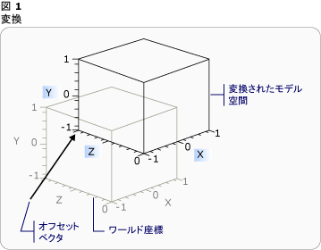
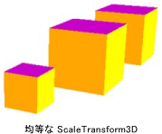
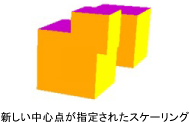
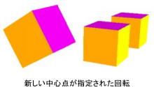
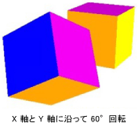

# 3-D 変換の概要3-D Transformations Overview
このトピックでは、[!INCLUDE[TLA#tla_winclient](../../../../includes/tlasharptla-winclient-md.md)] グラフィックス システムで 3-D モデルに変換を適用する方法について説明します。This topic describes how to apply transformations to 3-D models in the [!INCLUDE[TLA#tla_winclient](../../../../includes/tlasharptla-winclient-md.md)] graphics system. 変換を使うと、モデルを定義する基本の値を変更することなく、モデルの位置、サイズ、向きを変更できます。Transformations allow the developer to reposition, resize, and reorient models without changing the base values that define them.  
  

  
## 3-D 座標空間3-D Coordinate Space  
 3-D グラフィックスでコンテンツ[!INCLUDE[TLA#tla_winclient](../../../../includes/tlasharptla-winclient-md.md)]要素内にカプセル化<xref:System.Windows.Controls.Viewport3D>、2 次元の要素の構造に含まれることができます。3-D graphics content in [!INCLUDE[TLA#tla_winclient](../../../../includes/tlasharptla-winclient-md.md)] is encapsulated in an element, <xref:System.Windows.Controls.Viewport3D>, that can participate in the two-dimensional element structure. グラフィックス システムは、Viewport3D を、[!INCLUDE[TLA#tla_winclient](../../../../includes/tlasharptla-winclient-md.md)] 内の他の多くの要素と同じ 2 次元のビジュアル要素として処理します。The graphics system treats Viewport3D as a two-dimensional visual element like many others in [!INCLUDE[TLA#tla_winclient](../../../../includes/tlasharptla-winclient-md.md)]. Viewport3D は、3 次元シーンのウィンドウ (ビューポート) として機能します。Viewport3D functions as a window—a viewport—into a three-dimensional scene. より正確には、3-D シーンが投影されるサーフェイスです。More accurately, it is a surface on which a 3-D scene is projected.  同じシーン グラフ内で他の 2-D 描画オブジェクトと共に Viewport3D を使うことができますが、Viewport3D 内の 2-D オブジェクトと 3-D オブジェクトを相互に貫通させることはできません。Although you can use Viewport3D with other 2-D drawing objects in the same scene graph, you cannot interpenetrate 2-D and 3-D objects within a Viewport3D. 以下の説明で、座標空間は Viewport3D 要素に含まれています。In the following discussion, the coordinate space described is contained by the Viewport3D element.  
  
 2-D グラフィックス用の [!INCLUDE[TLA#tla_winclient](../../../../includes/tlasharptla-winclient-md.md)] 座標系の原点は、レンダリング サーフェイスの (通常は画面) の左上にあります。The [!INCLUDE[TLA#tla_winclient](../../../../includes/tlasharptla-winclient-md.md)] coordinate system for 2-D graphics locates the origin in the upper left of the rendering surface (typically the screen). 2-D システムでは、x 軸の正の値は右に向かって大きくなり、y 軸の正の値は下に向かって大きくなります。In the 2-D system, positive x-axis values proceed to the right and positive y-axis values proceed downward. 一方、3-D 座標系では、原点は画面の中央にあり、x 軸の正の値は右に向かって大きくなりますが、y 軸の正の値は上に向かって大きくなり、z 軸の正の値は原点から手前に向かって大きくなります。In the 3-D coordinate system, however, the origin is located in the center of the screen, with positive x-axis values proceeding to the right but positive y-axis values proceeding upward instead, and positive z-axis values proceeding outward from the origin, toward the viewer.  
  
   
座標系の比較Coordinate System Comparison  
  
 これらの軸によって定義される空間は、[!INCLUDE[TLA#tla_winclient](../../../../includes/tlasharptla-winclient-md.md)] 内の 3-D オブジェクトのための静止した基準枠です。The space defined by these axes is the stationary frame of reference for 3-D objects in [!INCLUDE[TLA#tla_winclient](../../../../includes/tlasharptla-winclient-md.md)]. この空間内にモデルを構築し、それらを表示するためのライトとカメラを作成するときは、この静止した基準枠 ("ワールド空間") と、モデルに変換を適用するときにモデルごとに作成するローカルな基準枠を区別することをお勧めします。As you build models in this space and create lights and cameras to view them, it's helpful to distinguish this stationary frame of reference, or "world space," from the local frame of reference you create for each model when you apply transformations to it. また、ワールド空間内のオブジェクトは、ライトとカメラの設定により、まったく違って見えたり、またはまったく見えなくなることがありますが、カメラの位置によってワールド空間内のオブジェクトの場所が変化することはないことに注意してください。Remember also that objects in world space might look entirely different, or not be visible at all, depending on light and camera settings, but the position of the camera does not change the location of objects in world space.  
  
## モデルの変換Transforming Models  
 モデルを作成するとき、モデルにはシーン内で特定の位置があります。When you create models, they have a particular location in the scene. モデルをシーン内で移動したり、回転したり、そのサイズを変更したりするのに、モデル自体を定義する頂点を変更するのは実用的ではありません。To move those models around in the scene, to rotate them, or to change their size, it's not practical to change the vertices that define the models themselves. そのような場合は、2-D と同じように、モデルに変換を適用します。Instead, just as in 2-D, you apply transformations to models.  
  
 各モデル オブジェクトには、<xref:System.Windows.Media.Media3D.Model3D.Transform%2A>プロパティを使用することができますを移動、向きを変更、またはモデルのサイズを変更します。Each model object has a <xref:System.Windows.Media.Media3D.Model3D.Transform%2A> property with which you can move, re-orient, or resize the model. 変換を適用するときは、ベクトルにより、または変換で指定する値により、モデルのすべてのポイントをオフセットします。When you apply a transform, you effectively offset all the points of the model by whatever vector or value is specified by the transform. つまり、モデルが定義されている座標空間 ("モデル空間") を変換するのであって、シーン全体の座標系 ("ワールド空間") 内でモデルのジオメトリを構成する値を変更するのではありません。In other words, you've transformed the coordinate space in which the model is defined ("model space"), but you haven't changed the values that make up the model's geometry in the coordinate system of the entire scene ("world space").  
  
## 平行移動変換Translation Transformations  
 3-D 変換は、抽象基本クラスから継承<xref:System.Windows.Media.Media3D.Transform3D>; アフィン変換クラスが含まれます<xref:System.Windows.Media.Media3D.TranslateTransform3D>、 <xref:System.Windows.Media.Media3D.ScaleTransform3D>、および<xref:System.Windows.Media.Media3D.RotateTransform3D>です。3-D transformations inherit from the abstract base class <xref:System.Windows.Media.Media3D.Transform3D>; these include the affine transform classes <xref:System.Windows.Media.Media3D.TranslateTransform3D>, <xref:System.Windows.Media.Media3D.ScaleTransform3D>, and <xref:System.Windows.Media.Media3D.RotateTransform3D>. [!INCLUDE[TLA#tla_winclient](../../../../includes/tlasharptla-winclient-md.md)] 3-D システムも用意されています、<xref:System.Windows.Media.Media3D.MatrixTransform3D>できるようにするクラスより簡潔なマトリックスの操作で同じ変換を指定します。The [!INCLUDE[TLA#tla_winclient](../../../../includes/tlasharptla-winclient-md.md)] 3-D system also provides a <xref:System.Windows.Media.Media3D.MatrixTransform3D> class that lets you specify the same transformations in more concise matrix operations.  
  
 <xref:System.Windows.Media.Media3D.TranslateTransform3D>指定したオフセットのベクターの方向に Model3D 内のすべてのポイントを移動、 <xref:System.Windows.Media.Media3D.TranslateTransform3D.OffsetX%2A>、 <xref:System.Windows.Media.Media3D.TranslateTransform3D.OffsetY%2A>、および<xref:System.Windows.Media.Media3D.TranslateTransform3D.OffsetZ%2A>プロパティです。<xref:System.Windows.Media.Media3D.TranslateTransform3D> moves all the points in the Model3D in the direction of the offset vector you specify with the <xref:System.Windows.Media.Media3D.TranslateTransform3D.OffsetX%2A>, <xref:System.Windows.Media.Media3D.TranslateTransform3D.OffsetY%2A>, and <xref:System.Windows.Media.Media3D.TranslateTransform3D.OffsetZ%2A> properties. たとえば、立方体の 1 つの頂点が (2,2,2) にあるものとすると、オフセット ベクトル (0,1.6,1) により頂点 (2,2,2) は (2,3.6,3) に移動します。For example, given one vertex of a cube at (2,2,2), an offset vector of (0,1.6,1) would move that vertex (2,2,2) to (2,3.6,3). モデル空間内での立方体の頂点はまだ (2,2,2) にありますが、モデル空間の (2,2,2) がワールド空間では (2,3.6,3) になるように、モデル空間とワールド空間の関係が変更されています。The cube's vertex is still (2,2,2) in model space, but now that model space has changed its relationship to world space so that (2,2,2) in model space is (2,3.6,3) in world space.  
  
   
オフセットでの平行移動Translation with Offset  
  
 次のコード例は、平行移動を適用する方法を示しています。The following code examples show how to apply a translation.  
  
 [!code-xaml[animation3dgallery_snip#Translation3DAnimationExampleWholePage](../../../../samples/snippets/csharp/VS_Snippets_Wpf/Animation3DGallery_snip/CS/Translation3DAnimationExample.xaml#translation3danimationexamplewholepage)]  
  
## スケール変換Scale Transformations  
 <xref:System.Windows.Media.Media3D.ScaleTransform3D>中心点を参照するよう指定したスケール ベクターでモデルのスケールを変更します。<xref:System.Windows.Media.Media3D.ScaleTransform3D> changes the model's scale by a specified scale vector with reference to a center point. 一様なスケールを指定すると、モデルは X、Y、Z 軸の方向に同じ比率だけ拡大縮小され、それに比例してモデルのサイズが変化します。Specify a uniform scale, which scales the model by the same value in the X, Y, and Z axes, to change the model's size proportionally. たとえば、変換のプロパティ設定<xref:System.Windows.Media.ScaleTransform.ScaleX%2A>、 <xref:System.Windows.Media.ScaleTransform.ScaleY%2A>、および<xref:System.Windows.Media.Media3D.ScaleTransform3D.ScaleZ%2A>を 0.5 にプロパティが、モデルのサイズを半分以外の場合は、次の 3 つすべての軸のスケールを 2 倍に同じプロパティを 2 に設定します。For example, setting the transform's <xref:System.Windows.Media.ScaleTransform.ScaleX%2A>, <xref:System.Windows.Media.ScaleTransform.ScaleY%2A>, and <xref:System.Windows.Media.Media3D.ScaleTransform3D.ScaleZ%2A> properties to 0.5 halves the size of the model; setting the same properties to 2 doubles its scale in all three axes.  
  
   
ScaleVector の例ScaleVector Example  
  
 一様ではないスケール変換 (X、Y、Z すべての値が同じではないスケール変換) を指定すると、3 つの方向をそれぞれ独立して拡大または縮小できます。By specifying a non-uniform scale transformation—a scale transformation whose X, Y, and Z values are not all the same—you can cause a model to stretch or contract in one or two dimensions without affecting the others. たとえば、設定<xref:System.Windows.Media.ScaleTransform.ScaleX%2A>を 1 に<xref:System.Windows.Media.ScaleTransform.ScaleY%2A>2 と<xref:System.Windows.Media.Media3D.ScaleTransform3D.ScaleZ%2A>を 1 になる倍高さには、X、Z 軸に沿った変化に変換されたモデルです。For example, setting <xref:System.Windows.Media.ScaleTransform.ScaleX%2A> to 1, <xref:System.Windows.Media.ScaleTransform.ScaleY%2A> to 2, and <xref:System.Windows.Media.Media3D.ScaleTransform3D.ScaleZ%2A> to 1 would cause the transformed model to double in height but remain unchanged along the X and Z axes.  
  
 既定では、ScaleTransform3D では原点 (0,0,0) を基準にして頂点が拡大または縮小します。By default, ScaleTransform3D causes vertices to expand or contract about the origin (0,0,0). ただし、変換するモデルが原点から描画されていない場合は、原点からモデルを拡大縮小すると、モデルのスケールは "その場" では変化しません。If the model you want to transform is not drawn from the origin, however, scaling the model from the origin will not scale the model "in place." 代わりに、モデルの頂点がスケール ベクトルで乗算されて、スケール演算にはモデルの平行移動と拡大縮小の効果があります。Instead, when the model's vertices are multiplied by the scale vector, the scale operation will have the effect of translating the model as well as scaling it.  
  
   
スケールの中心点の例Scale Center Example  
  
 「インプレース」モデルを拡張するには、ScaleTransform3D の設定によって、モデルの中心を指定します。 <xref:System.Windows.Media.ScaleTransform.CenterX%2A>、 <xref:System.Windows.Media.ScaleTransform.CenterY%2A>、および<xref:System.Windows.Media.Media3D.ScaleTransform3D.CenterZ%2A>プロパティです。To scale a model "in place," specify the center of the model by setting the ScaleTransform3D's <xref:System.Windows.Media.ScaleTransform.CenterX%2A>, <xref:System.Windows.Media.ScaleTransform.CenterY%2A>, and <xref:System.Windows.Media.Media3D.ScaleTransform3D.CenterZ%2A> properties. これにより、グラフィックス システムがモデル領域のスケールを設定し、中央に指定した変換<xref:System.Windows.Media.Media3D.Point3D>です。This ensures that the graphics system scales the model space and then translates it to center on the specified <xref:System.Windows.Media.Media3D.Point3D>. 逆に、原点を基準にモデルを構築し、異なる中心点を指定すると、モデルは原点から離れるように平行移動されます。Conversely, if you've built the model about the origin and specify a different center point, expect to see the model translated away from the origin.  
  
## 回転変換Rotation Transformations  
 3-D のモデルは複数の方法で回転できます。You can rotate a model in 3-D in several different ways. 一般的な回転変換では、軸と、その軸の周りの回転角度を指定します。A typical rotation transformation specifies an axis and an angle of rotation around that axis. <xref:System.Windows.Media.Media3D.RotateTransform3D>クラスでは、定義することができます、<xref:System.Windows.Media.Media3D.Rotation3D>でその<xref:System.Windows.Media.Media3D.RotateTransform3D.Rotation%2A>プロパティです。The <xref:System.Windows.Media.Media3D.RotateTransform3D> class allows you to define a <xref:System.Windows.Media.Media3D.Rotation3D> with its <xref:System.Windows.Media.Media3D.RotateTransform3D.Rotation%2A> property. 指定する<xref:System.Windows.Media.Media3D.AxisAngleRotation3D.Axis%2A>と<xref:System.Windows.Media.Media3D.AxisAngleRotation3D.Angle%2A>ここでは、Rotation3D のプロパティ、<xref:System.Windows.Media.Media3D.AxisAngleRotation3D>変換を定義します。You then specify <xref:System.Windows.Media.Media3D.AxisAngleRotation3D.Axis%2A> and <xref:System.Windows.Media.Media3D.AxisAngleRotation3D.Angle%2A> properties on the Rotation3D, in this case an <xref:System.Windows.Media.Media3D.AxisAngleRotation3D>, to define the transformation. 次の例では、Y 軸を中心に 60 度だけモデルを回転します。The following examples rotate a model by 60 degrees around the Y axis.  
  
 [!code-xaml[animation3dgallery_snip#Rotate3DUsingAxisAngleRotation3DExampleWholePage](../../../../samples/snippets/csharp/VS_Snippets_Wpf/Animation3DGallery_snip/CS/Rotat3DUsingAxisAngleRotation3DExample.xaml#rotate3dusingaxisanglerotation3dexamplewholepage)]  
  
 注: [!INCLUDE[TLA#tla_winclient](../../../../includes/tlasharptla-winclient-md.md)] の 3-D は右手座標系であり、正の回転角度を指定するとモデルは軸を中心に反時計方向に回転します。Note:[!INCLUDE[TLA#tla_winclient](../../../../includes/tlasharptla-winclient-md.md)] 3-D is a right-handed system, which means that a positive angle value for a rotation results in a counter-clockwise rotation about the axis.  
  
 値が指定されていない場合、軸角度回転と原点を中心に回転、 <xref:System.Windows.Media.Media3D.RotateTransform3D.CenterX%2A>、 <xref:System.Windows.Media.Media3D.RotateTransform3D.CenterY%2A>、および<xref:System.Windows.Media.Media3D.RotateTransform3D.CenterZ%2A>RotateTransform3D のプロパティです。Axis-angle rotations assume rotation about the origin if a value is not specified for the <xref:System.Windows.Media.Media3D.RotateTransform3D.CenterX%2A>, <xref:System.Windows.Media.Media3D.RotateTransform3D.CenterY%2A>, and <xref:System.Windows.Media.Media3D.RotateTransform3D.CenterZ%2A> properties on RotateTransform3D. 拡大縮小と同様に、回転でもモデルの座標空間全体が変換されることを憶えておくと役に立ちます。As with scaling, it's helpful to remember that the rotation transforms the model's entire coordinate space. モデルが原点を中心として作成されていない場合、または前に平行移動されている場合は、その場での回転ではなく、原点を中心とする "ピボット" になる可能性があります。If the model was not created about the origin, or has been translated previously, the rotation might "pivot" about the origin instead of rotating in place.  
  
   
指定された新しい中心による回転Rotation with new center specified  
  
 モデルを "その場で" 回転するには、モデルの実際の中心を回転の中心として指定します。To rotate the model "in place," specify the model's actual center as the center of rotation. 通常、ジオメトリは原点を中心にモデル化されるので、ほとんどの場合は、最初にモデルのサイズを変更し (スケーリング)、次に向きを設定し (回転)、最後に目的の位置に移動することにより (平行移動)、変換のセットで意図した結果が得られます。Because geometry is typically modeled about the origin, you can most often get the expected result of a set of transformations by first sizing the model (scaling it), then setting its orientation (rotating it), and finally moving it to the desired location (translating it).  
  
   
回転の例Rotation Example  
  
 軸角度の回転は、静的な変換と一部のアニメーションで問題なく行われます。Axis-angle rotations work well for static transformations and some animations. ただし、立方体モデルを X 軸を中心に 60 度回転してから、Z 軸を中心に 45 度回転する場合を考えてみてください。However, consider rotating a cube model 60 degrees around the X axis, then 45 degrees around the Z axis. この変換は、2 つの個別のアフィン変換として、または行列として記述できます。You can describe this transformation as two discrete affine transformations, or as a matrix. しかし、この方法で定義された回転をスムーズにアニメーション化するのは難しい場合があります。However, it might be difficult to smoothly animate a rotation defined this way. どちらの方法で計算してもモデルの最初と最後の位置は同じですが、モデルの中間の位置は計算上は不確定です。Although the beginning and ending positions of the model computed by either approach are the same, the intermediate positions taken by the model are computationally uncertain. 四元数は、回転の開始と終了の間の補間を計算する別の方法を表します。Quaternions represent an alternative way to compute the interpolation between the start and end of a rotation.  
  
 四元数では、3-D 空間内の軸と、その軸を中心とする回転が表されます。A quaternion represents an axis in 3-D space and a rotation around that axis. たとえば、四元数では、(1,1,2) の軸と 50 度の回転といったように表されます。For example, a quaternion might represent a (1,1,2) axis and a rotation of 50 degrees. 回転の定義における四元数の威力は、合成と補間という 2 つの操作を実行できることです。Quaternions’ power in defining rotations comes from the two operations that you can perform on them: composition and interpolation. ジオメトリに適用される 2 つの四元数の合成とは、"ジオメトリを、axis2 を中心に rotation2 だけ回転した後、axis1 を中心に rotation1 だけ回転する" ことを意味します。The composition of two quaternions applied to a geometry means "rotate the geometry around axis2 by rotation2, then rotate it around axis1 by rotation1." 合成を使うと、ジオメトリに対する 2 つの回転を組み合わせて、結果を表す 1 つの四元数を得ることができます。By using composition, you can combine the two rotations on the geometry to get a single quaternion that represents the result. 四元数の補間では、ある軸と向きから別の軸と向きへの滑らかで適切なパスを計算できるので、オリジナルから合成された四元数への補間を行うことで、ある状態から別の状態へのスムーズな移行を実現して、変換をアニメーション化できます。Because quaternion interpolation can calculate a smooth and reasonable path from one axis and orientation to another, you can interpolate from the original to the composed quaternion to achieve a smooth transition from one to the other, enabling you to animate the transformation. アニメーション化するモデルの場合は、変換先を指定できます<xref:System.Windows.Media.Media3D.Quaternion>の回転を使用して、<xref:System.Windows.Media.Media3D.QuaternionRotation3D>の<xref:System.Windows.Media.Media3D.RotateTransform3D.Rotation%2A>プロパティです。For models that you want to animate, you can specify a destination <xref:System.Windows.Media.Media3D.Quaternion> for the rotation by using a <xref:System.Windows.Media.Media3D.QuaternionRotation3D> for the <xref:System.Windows.Media.Media3D.RotateTransform3D.Rotation%2A> property.  
  
## 変換のコレクションの使用Using Transformation Collections  
 シーンを作成する場合、通常はモデルに複数の変換を適用します。When building a scene, it's common to apply more than one transformation to a model. 追加するための変換、<xref:System.Windows.Media.Media3D.Transform3DGroup.Children%2A>のコレクション、<xref:System.Windows.Media.Media3D.Transform3DGroup>シーン内のさまざまなモデルに適用するグループ化するクラスを簡単に変換します。Add transforms to the <xref:System.Windows.Media.Media3D.Transform3DGroup.Children%2A> collection of the <xref:System.Windows.Media.Media3D.Transform3DGroup> class to group transforms conveniently to apply to various models in the scene. 各インスタンスに異なる変換セットを適用することでモデルを再利用できるように、多くの場合、複数の異なるグループで変換を再利用すると便利です。It's often convenient to reuse a transformation in several different groups, in much the way that you can reuse a model by applying a different set of transforms to each instance. 変換をコレクションに追加する順序が重要であることに注意してください。コレクション内の変換は、最初から最後まで順番に適用されます。Note that order in which the transformations are added to the collection is significant: transforms in the collection are applied from first to last.  
  
## 変換のアニメーション化Animating Transformations  
 [!INCLUDE[TLA#tla_winclient](../../../../includes/tlasharptla-winclient-md.md)] の 3-D の実装は、2-D グラフィックスと同じタイミングおよびアニメーション システムに参加しています。The [!INCLUDE[TLA#tla_winclient](../../../../includes/tlasharptla-winclient-md.md)] 3-D implementation participates in the same timing and animation system as 2-D graphics. つまり、3-D シーンをアニメーション化するには、そのモデルのプロパティをアニメーション化します。In other words, to animate a 3-D scene, animate the properties of its models. プリミティブのプロパティを直接アニメーション化することもできますが、通常は、モデルの位置や外観を変更する変換をアニメーション化する方が簡単です。It's possible to animate properties of primitives directly, but it's typically easier to animate transformations that change the position or appearance of models. 変換に適用できるため<xref:System.Windows.Media.Media3D.Model3DGroup>オブジェクト個々 のモデル、および、Model3Dgroup の子をセットから別のオブジェクトのグループにアニメーションをアニメーションの 1 つのセットを適用することはできます。Because transformations can be applied to <xref:System.Windows.Media.Media3D.Model3DGroup> objects as well as individual models, it's possible to apply one set of animations to the children of a Model3Dgroup and another set of animations to a group of objects.  [!INCLUDE[TLA#tla_winclient](../../../../includes/tlasharptla-winclient-md.md)] のタイミングおよびアニメーション システムの背景情報については、「[アニメーションの概要](../../../../docs/framework/wpf/graphics-multimedia/animation-overview.md)」および「[ストーリーボードの概要](../../../../docs/framework/wpf/graphics-multimedia/storyboards-overview.md)」トピックをご覧ください。For background information on the [!INCLUDE[TLA#tla_winclient](../../../../includes/tlasharptla-winclient-md.md)] timing and animation system, see [Animation Overview](../../../../docs/framework/wpf/graphics-multimedia/animation-overview.md) and [Storyboards Overview](../../../../docs/framework/wpf/graphics-multimedia/storyboards-overview.md).  
  
 [!INCLUDE[TLA#tla_winclient](../../../../includes/tlasharptla-winclient-md.md)] のオブジェクトをアニメーション化するには、タイムラインを作成し、アニメーションを定義して (時間経過と共に一部のプロパティの値を実際に変更します)、アニメーションを適用するプロパティを指定します。To animate an object in [!INCLUDE[TLA#tla_winclient](../../../../includes/tlasharptla-winclient-md.md)], create a timeline, define an animation (which is really a change in some property value over time), and specify the property to which to apply the animation. このプロパティは、FrameworkElement のプロパティである必要があります。This property must be a property of a FrameworkElement. 3-D シーンのすべてのオブジェクトは Viewport3D の子なので、シーンに適用するアニメーションの対象となるプロパティは、Viewport3D のプロパティのプロパティです。Because all the objects in a 3-D scene are children of Viewport3D, the properties targeted by any animation you want to apply to the scene are properties of properties of Viewport3D. 構文が冗長になる場合があるので、アニメーションのプロパティ パスを慎重に検討することが重要です。It's important to work out the property path for the animation carefully, because the syntax can be verbose.  
  
 オブジェクトをその場で回転させ、さらに揺れる動作を適用してオブジェクトの多くの部分が見えるようにしたいものとします。Suppose you want to rotate an object in place, but also to apply a swinging motion to expose more of the object to view. そのためには、RotateTransform3D をモデルに適用し、回転軸をあるベクトルから別のベクトルにアニメーション化します。You might choose to apply a RotateTransform3D to the model, and animate the axis of its rotation from one vector to another. 次のコード例では、適用することを示しています、 <xref:System.Windows.Media.Animation.Vector3DAnimation> 、軸のプロパティに、変換の Rotation3D、前提を使用してモデルに適用されたいくつかの変換のいずれかに RotateTransform3D、<xref:System.Windows.Media.TransformGroup>です。The following code example demonstrates applying a <xref:System.Windows.Media.Animation.Vector3DAnimation> to the Axis property of the transformation's Rotation3D, assuming the RotateTransform3D to be one of several transforms applied to the model with a <xref:System.Windows.Media.TransformGroup>.  
  
 [!code-csharp[3doverview#3DOverview3DN1](../../../../samples/snippets/csharp/VS_Snippets_Wpf/3DOverview/CSharp/Window1.xaml.cs#3doverview3dn1)]
 [!code-vb[3doverview#3DOverview3DN1](../../../../samples/snippets/visualbasic/VS_Snippets_Wpf/3DOverview/visualbasic/window1.xaml.vb#3doverview3dn1)]  
  
 [!code-csharp[3doverview#3DOverview3DN3](../../../../samples/snippets/csharp/VS_Snippets_Wpf/3DOverview/CSharp/Window1.xaml.cs#3doverview3dn3)]
 [!code-vb[3doverview#3DOverview3DN3](../../../../samples/snippets/visualbasic/VS_Snippets_Wpf/3DOverview/visualbasic/window1.xaml.vb#3doverview3dn3)]  
  
 オブジェクトを移動または拡大縮小するには、他の変換プロパティを対象に同様の構文を使います。Use a similar syntax to target other transformation properties to move or scale the object.  たとえば、適用する場合があります、<xref:System.Windows.Media.Animation.Point3DAnimation>によりその図形をスムーズに変形するモデルにスケール変換 ScaleCenter プロパティにします。For example, you might apply a <xref:System.Windows.Media.Animation.Point3DAnimation> to the ScaleCenter property on a scale transform to cause a model to smoothly distort its shape.  
  
 上記の例では、変換のプロパティが<xref:System.Windows.Media.Media3D.GeometryModel3D>シーン内の他のモデルのプロパティを変換することもできます。Although the preceding examples transform the properties of <xref:System.Windows.Media.Media3D.GeometryModel3D>, it’s also possible to transform the properties of other models in the scene.  Light オブジェクトに適用される変換をアニメーション化することで、モデルの外観を劇的に変えることができる、移動する照明効果とシャドウ効果を作成できます。By animating translations applied to Light objects, for example, you can create moving light and shadow effects that can dramatically change the appearance of your models.  
  
 カメラもモデルなので、カメラのプロパティを変換することもできます。Because cameras are also models, it’s possible to transform camera properties as well.  カメラの位置または平面距離を変換することにより (実際には、シーン全体の投影を変換して) シーンの外観を変更できますが、この方法で得られる効果の多くは、シーン内のモデルの場所や位置に適用される変換ほど大きな "視覚的意味" を見ている人に与えられない場合があることに注意してください。While you can certainly change the appearance of the scene by transforming the camera location or plane distances—in effect, transforming the entire scene projection—note that many of the effects you achieve this way may not make as much "visual sense" to the viewer as transformations applied to the location or position of the models in the scene.  
  
## 参照See Also  
 [3-D グラフィックスの概要3-D Graphics Overview](../../../../docs/framework/wpf/graphics-multimedia/3-d-graphics-overview.md)  
 [変換の概要Transforms Overview](../../../../docs/framework/wpf/graphics-multimedia/transforms-overview.md)  
 [2-D 変換のサンプル2-D Transforms Sample](http://go.microsoft.com/fwlink/?LinkID=158252)
