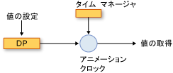
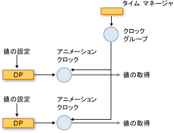
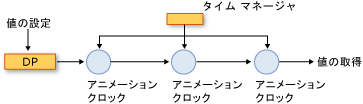

# アニメーションとタイミング システムの概要
このトピックでは、タイミング システムが、アニメーションを使用する方法について説明<xref:System.Windows.Media.Animation.Timeline>、および<xref:System.Windows.Media.Animation.Clock>プロパティをアニメーション化するクラス。  
  
   
## 必須コンポーネント  
 このトピックを理解するには、「[アニメーションの概要](../../../../docs/framework/wpf/graphics-multimedia/animation-overview.md)」で説明されているように、[!INCLUDE[TLA2#tla_winclient](../../../../includes/tla2sharptla-winclient-md.md)] のアニメーションを使ってプロパティをアニメーション化できる必要があります。 依存関係プロパティの理解も役に立ちます。詳しくは、「[依存関係プロパティの概要](../../../../docs/framework/wpf/advanced/dependency-properties-overview.md)」をご覧ください。  
  
   
## タイムラインとクロック  
 [アニメーションの概要](../../../../docs/framework/wpf/graphics-multimedia/animation-overview.md)方法の説明、<xref:System.Windows.Media.Animation.Timeline>時間、およびアニメーションのセグメントでは、種類の<xref:System.Windows.Media.Animation.Timeline>出力値を生成します。 単独で、 <xref:System.Windows.Media.Animation.Timeline>、何もしない以外の時間のセグメントを記述するだけです。 これは、タイムラインの<xref:System.Windows.Media.Animation.Clock>実際の処理を行うオブジェクト。 同様に、アニメーションが実際にアニメーション化プロパティ: アニメーション クラスは、出力値を計算する方法について説明しますが、<xref:System.Windows.Media.Animation.Clock>アニメーションの出力を駆動し、それをプロパティに適用されるアニメーションの作成されました。  
  
 A<xref:System.Windows.Media.Animation.Clock>は特殊な種類の実行時のタイミングに関連する状態を保持するオブジェクトの<xref:System.Windows.Media.Animation.Timeline>です。 アニメーションおよびタイミング システムに不可欠な情報の 3 つのビットを提供します。 <xref:System.Windows.Media.Animation.Clock.CurrentTime%2A>、 <xref:System.Windows.Media.Animation.Clock.CurrentProgress%2A>、および<xref:System.Windows.Media.Animation.Clock.CurrentState%2A>です。 A<xref:System.Windows.Media.Animation.Clock>で示されるタイミング動作を使用して、現在の時刻、進捗、および状態が指定の<xref:System.Windows.Media.Animation.Timeline>: <xref:System.Windows.Media.Animation.Timeline.Duration%2A>、 <xref:System.Windows.Media.Animation.Timeline.RepeatBehavior%2A>、<xref:System.Windows.Media.Animation.Timeline.AutoReverse%2A>のようにします。  
  
 ほとんどの場合、<xref:System.Windows.Media.Animation.Clock>タイムラインのスペースを自動的に作成されます。 使用してアニメーション化するときに、<xref:System.Windows.Media.Animation.Storyboard>または<xref:System.Windows.Media.Animation.Animatable.BeginAnimation%2A>メソッド、クロックが自動的にタイムラインとアニメーションを作成し、その対象となるプロパティに適用します。 作成することも、<xref:System.Windows.Media.Animation.Clock>を使用して明示的に、<xref:System.Windows.Media.Animation.Timeline.CreateClock%2A>のメソッド、<xref:System.Windows.Media.Animation.Timeline>です。 <xref:System.Windows.Media.MediaTimeline.CreateClock%2A?displayProperty=nameWithType>メソッドは、対応する型の時計を作成、<xref:System.Windows.Media.Animation.Timeline>これが呼び出されるときです。 場合、<xref:System.Windows.Media.Animation.Timeline>子タイムラインを含む作成<xref:System.Windows.Media.Animation.Clock>もそれらのオブジェクト。 結果として得られる<xref:System.Windows.Media.Animation.Clock>オブジェクトがツリーの構造に合ったで配置された、<xref:System.Windows.Media.Animation.Timeline>オブジェクト ツリーから作成されます。  
  
 異なる型のタイムラインに対して異なる型のクロックがあります。 次の表に、 <xref:System.Windows.Media.Animation.Clock> 、別の一部に対応する型<xref:System.Windows.Media.Animation.Timeline>型です。  
  
|タイムラインの型|クロックの型|クロックの目的|  
|-------------------|----------------|-------------------|  
|アニメーション (から継承<xref:System.Windows.Media.Animation.AnimationTimeline>)|<xref:System.Windows.Media.Animation.AnimationClock>|依存関係プロパティの出力値を生成します。|  
|<xref:System.Windows.Media.MediaTimeline>|<xref:System.Windows.Media.MediaClock>|メディア ファイルを処理します。|  
|<xref:System.Windows.Media.Animation.ParallelTimeline>|<xref:System.Windows.Media.Animation.ClockGroup>|グループ化し、その子を制御<xref:System.Windows.Media.Animation.Clock>オブジェクト|  
|<xref:System.Windows.Media.Animation.Storyboard>|<xref:System.Windows.Media.Animation.ClockGroup>|グループ化し、その子を制御<xref:System.Windows.Media.Animation.Clock>オブジェクト|  
  
 適用することができます<xref:System.Windows.Media.Animation.AnimationClock>オブジェクトを使用して互換性のある依存関係プロパティを作成する、<xref:System.Windows.Media.Animation.IAnimatable.ApplyAnimationClock%2A>メソッドです。  
  
 多数の類似オブジェクトをアニメーション化するなど、パフォーマンス重視のシナリオで管理する独自<xref:System.Windows.Media.Animation.Clock>を使用して、パフォーマンスが向上します。  
  
   
## クロックとタイム マネージャー  
 内のオブジェクトをアニメーション化するときに[!INCLUDE[TLA2#tla_winclient](../../../../includes/tla2sharptla-winclient-md.md)]を管理するタイム マネージャーは、<xref:System.Windows.Media.MediaPlayer.Clock%2A>タイムラインに作成されたオブジェクト。 タイム マネージャーは <xref:System.Windows.Media.MediaPlayer.Clock%2A> オブジェクトのツリーのルートで、そのツリー内の時間の流れを制御します。  タイム マネージャーは各 [!INCLUDE[TLA2#tla_winclient](../../../../includes/tla2sharptla-winclient-md.md)] アプリケーションに自動的に作成され、アプリケーション開発者には表示されません。 タイム マネージャーは 1 秒間に何度も "タイマーを刻み" ます。1 秒ごとに刻まれるタイマーの実際の数は、使用可能なシステム リソースによって異なります。 これらの各 1 時に、タイム マネージャーがすべての状態を計算<xref:System.Windows.Media.Animation.ClockState.Active><xref:System.Windows.Media.Animation.Clock>タイミング ツリー内のオブジェクト。  
  
 次の図に、タイム マネージャー間のリレーションシップと<xref:System.Windows.Media.Animation.AnimationClock>、およびアニメーションの依存関係プロパティです。  
  
   
プロパティのアニメーション化  
  
 時刻が更新、タイム マネージャー、タイマーを刻むときにすべて<xref:System.Windows.Media.Animation.ClockState.Active><xref:System.Windows.Media.Animation.Clock>アプリケーションにします。 場合、<xref:System.Windows.Media.Animation.Clock>は、<xref:System.Windows.Media.Animation.AnimationClock>を使用して、<xref:System.Windows.Media.Animation.AnimationTimeline.GetCurrentValue%2A>のメソッド、<xref:System.Windows.Media.Animation.AnimationTimeline>から作成された出力するのには、現在の計算値です。 <xref:System.Windows.Media.Animation.AnimationClock>提供、<xref:System.Windows.Media.Animation.AnimationTimeline>現在の現地時刻、入力値、一般的にこれは、プロパティのベース値、および、既定値は変換先を使用します。 アニメーションの値を取得するプロパティを使用して、<xref:System.Windows.DependencyObject.GetValue%2A>の出力を取得するメソッドまたはその CLR アクセサーの場合は、その<xref:System.Windows.Media.Animation.AnimationClock>です。  
  
#### クロック グループ  
 前のセクションでは、さまざまな種類の方法が説明されている<xref:System.Windows.Media.Animation.Clock>タイムラインのさまざまな種類のオブジェクト。 次の図に、タイム マネージャー間のリレーションシップ、 <xref:System.Windows.Media.Animation.ClockGroup>、 <xref:System.Windows.Media.Animation.AnimationClock>、およびアニメーションの依存関係プロパティです。 A<xref:System.Windows.Media.Animation.ClockGroup>など他のタイムラインをグループ化のタイムラインを作成、<xref:System.Windows.Media.Animation.Storyboard>クラスは、アニメーションやその他のタイムラインをグループ化します。  
  
   
ClockGroup  
  
#### コンポジション  
 複数のクロックを 1 つのプロパティと関連付けることができます。その場合、各クロックは前のクロックの出力値を基本値として使います。 次の図は 3 つ<xref:System.Windows.Media.Animation.AnimationClock>同じプロパティに適用されるオブジェクト。 Clock1 は、アニメーション化されたプロパティの基本値を入力として使って、出力を生成します。 Clock2 は、Clock1 の出力を入力として受け取り、それを使って出力を生成します。 Clock3 は、Clock2 の出力を入力として受け取り、それを使って出力を生成します。 複数のクロックが同じプロパティに同時に影響を与える場合、それらはコンポジション チェーン内にあると言います。  
  
   
コンポジション チェーン  
  
 入力と出力の間のリレーションシップは作成されますが、なお、<xref:System.Windows.Media.Animation.AnimationClock>複合チェーン内のオブジェクトのタイミング動作が影響を受けません。<xref:System.Windows.Media.Animation.Clock>オブジェクト (含む<xref:System.Windows.Media.Animation.AnimationClock>オブジェクト)、親に階層型依存関係がある<xref:System.Windows.Media.Animation.Clock>オブジェクト。  
  
 同じプロパティに複数の時計を適用するには、使用、 <xref:System.Windows.Media.Animation.HandoffBehavior.Compose> <xref:System.Windows.Media.Animation.HandoffBehavior>適用するときに、 <xref:System.Windows.Media.Animation.Storyboard>、アニメーション、または<xref:System.Windows.Media.Animation.AnimationClock>です。  
  
#### ティックとイベントの統合  
 出力値を計算するだけでなく、タイム マネージャーはティックのたびに他の処理を行います。つまり、クロックの状態を判断し、必要に応じてイベントを発生させます。  
  
 ティックは頻繁に発生しますが、各ティックの間には多くのことが起こる可能性があります。 たとえば、<xref:System.Windows.Media.Animation.Clock>停止、開始、および後者停止もう一度、可能性があります、<xref:System.Windows.Media.Animation.Clock.CurrentState%2A>値は 3 回変更しました。 理論上は、<xref:System.Windows.Media.Animation.Clock.CurrentStateInvalidated>イベントは、単一のティックを複数回発生でしたさせるです。 ただし、タイミング エンジンはイベントを統合します。 できるように、<xref:System.Windows.Media.Animation.Clock.CurrentStateInvalidated>ティックあたり最大で 1 つはイベントを発生させることができます。 これは、すべてのタイミング イベントの場合は true。: の各型の最大で 1 つのイベントが発生した、指定された<xref:System.Windows.Media.Animation.Clock>オブジェクト。  
  
 ときに、<xref:System.Windows.Media.Animation.Clock>の状態が切り替わるし、ティック間を元の状態に戻します (からの変更など<xref:System.Windows.Media.Animation.ClockState.Active>に<xref:System.Windows.Media.Animation.ClockState.Stopped>およびへ<xref:System.Windows.Media.Animation.ClockState.Active>)、関連イベントが引き続き発生します。  
  
 タイミング イベントについて詳しくは、「[タイミング イベントの概要](../../../../docs/framework/wpf/graphics-multimedia/timing-events-overview.md)」をご覧ください。  
  
   
## プロパティの現在値と基本値  
 アニメーション化可能なプロパティは、基本値と現在値の 2 つの値を持つことができます。 その CLR アクセサーを使用してプロパティを設定すると、または<xref:System.Windows.DependencyObject.SetValue%2A>メソッド、その基本値を設定します。 プロパティがアニメーション化されない場合は、基本値と現在値は同じです。  
  
 プロパティをアニメーション化するときに、<xref:System.Windows.Media.Animation.AnimationClock>プロパティの設定*現在*値。 その CLR アクセサーを使用して、プロパティの値を取得する、または<xref:System.Windows.DependencyObject.GetValue%2A>メソッドの出力が返されます、<xref:System.Windows.Media.Animation.AnimationClock>ときに、<xref:System.Windows.Media.Animation.AnimationClock>は<xref:System.Windows.Media.Animation.ClockState.Active>または<xref:System.Windows.Media.Animation.ClockState.Filling>です。 使用して、プロパティのベース値を取得することができます、<xref:System.Windows.Media.Animation.IAnimatable.GetAnimationBaseValue%2A>メソッドです。  
  
## 関連項目  
 [アニメーションの概要](../../../../docs/framework/wpf/graphics-multimedia/animation-overview.md)  
 [タイミング イベントの概要](../../../../docs/framework/wpf/graphics-multimedia/timing-events-overview.md)  
 [タイミング動作の概要](../../../../docs/framework/wpf/graphics-multimedia/timing-behaviors-overview.md)
