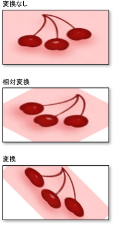

# ブラシの変換の概要Brush Transformation Overview
ブラシ クラスには、次の 2 つの変換のプロパティが用意されています:<xref:System.Windows.Media.Brush.Transform%2A>と<xref:System.Windows.Media.Brush.RelativeTransform%2A>です。The Brush class provides two transformation properties: <xref:System.Windows.Media.Brush.Transform%2A> and <xref:System.Windows.Media.Brush.RelativeTransform%2A>. これらのプロパティを使うと、ブラシの内容を回転、拡大縮小、傾斜、移動できます。The properties enable you to rotate, scale, skew, and translate a brush's contents. このトピックでは、これら 2 つのプロパティの違いについて説明し、それらの使用例を示します。This topic describes the differences between these two properties and provides examples of their usage.  
  
   
## 必須コンポーネントPrerequisites  
 このトピックを理解するには、変換するブラシの機能を理解している必要があります。To understand this topic, you should understand the features of the brush that you are transforming. <xref:System.Windows.Media.LinearGradientBrush>と<xref:System.Windows.Media.RadialGradientBrush>を参照してください、[純色、グラデーションの概要でペイント](../../../../docs/framework/wpf/graphics-multimedia/painting-with-solid-colors-and-gradients-overview.md)です。For <xref:System.Windows.Media.LinearGradientBrush> and <xref:System.Windows.Media.RadialGradientBrush>, see the [Painting with Solid Colors and Gradients Overview](../../../../docs/framework/wpf/graphics-multimedia/painting-with-solid-colors-and-gradients-overview.md). <xref:System.Windows.Media.ImageBrush>、 <xref:System.Windows.Media.DrawingBrush>、または<xref:System.Windows.Media.VisualBrush>を参照してください[イメージ、図形、およびビジュアルの描画](../../../../docs/framework/wpf/graphics-multimedia/painting-with-images-drawings-and-visuals.md)です。For <xref:System.Windows.Media.ImageBrush>, <xref:System.Windows.Media.DrawingBrush>, or <xref:System.Windows.Media.VisualBrush>, see  [Painting with Images, Drawings, and Visuals](../../../../docs/framework/wpf/graphics-multimedia/painting-with-images-drawings-and-visuals.md). また、「[変換の概要](../../../../docs/framework/wpf/graphics-multimedia/transforms-overview.md)」で説明されている 2D 変換についても理解しておく必要があります。You should also be familiar with the 2D transforms described in the  [Transforms Overview](../../../../docs/framework/wpf/graphics-multimedia/transforms-overview.md).  
  
   
## Transform プロパティと RelativeTransform プロパティの違いDifferences between the Transform and RelativeTransform Properties  
 ブラシの変換を適用する<xref:System.Windows.Media.Brush.Transform%2A>プロパティ、中心の周りのブラシのコンテンツを変換する場合は、塗りつぶされる領域のサイズを確認する必要があります。When you apply a transform to a brush's <xref:System.Windows.Media.Brush.Transform%2A> property, you need to know the size of the painted area if you want to transform the brush contents about its center. 描画領域の幅が 200 デバイス独立ピクセル、高さが 150 ピクセルであるものとします。Suppose the painted area is 200 device independent pixels wide and 150 tall.  使用した場合、<xref:System.Windows.Media.RotateTransform>ブラシの回転の中心の周り 45 度を出力、指定、 <xref:System.Windows.Media.RotateTransform> 、 <xref:System.Windows.Media.RotateTransform.CenterX%2A> 100 と<xref:System.Windows.Media.RotateTransform.CenterY%2A>75 です。If you used a <xref:System.Windows.Media.RotateTransform> to rotate the brush's output 45 degrees about its center, you'd give the <xref:System.Windows.Media.RotateTransform> a <xref:System.Windows.Media.RotateTransform.CenterX%2A> of 100 and a <xref:System.Windows.Media.RotateTransform.CenterY%2A> of 75.  
  
 ブラシの変換を適用するときに<xref:System.Windows.Media.Brush.RelativeTransform%2A>プロパティ、その出力が塗りつぶされる領域にマップする前に、ブラシにその変換を適用します。When you apply a transform to a brush's <xref:System.Windows.Media.Brush.RelativeTransform%2A> property, that transform is applied to the brush before its output is mapped to the painted area. 次の一覧では、ブラシの内容が処理および変換される順序を説明します。The following list describes the order in which a brush’s contents are processed and transformed.  
  
1.  ブラシの内容を処理します。Process the brush’s contents. <xref:System.Windows.Media.GradientBrush>、これにはグラデーションの領域を決定することを意味します。For a <xref:System.Windows.Media.GradientBrush>, this means determining the gradient area. <xref:System.Windows.Media.TileBrush>、<xref:System.Windows.Media.TileBrush.Viewbox%2A>にマップされて、<xref:System.Windows.Media.TileBrush.Viewport%2A>です。For a <xref:System.Windows.Media.TileBrush>, the <xref:System.Windows.Media.TileBrush.Viewbox%2A> is mapped to the <xref:System.Windows.Media.TileBrush.Viewport%2A>. これがブラシの出力になります。This becomes the brush’s output.  
  
2.  ブラシの出力を 1 x 1 の変換四角形に投影します。Project the brush’s output onto the 1 x 1 transformation rectangle.  
  
3.  ブラシの適用<xref:System.Windows.Media.Brush.RelativeTransform%2A>されている場合、します。Apply the brush’s <xref:System.Windows.Media.Brush.RelativeTransform%2A>, if it has one.  
  
4.  変換された出力を描画領域に投影します。Project the transformed output onto the area to paint.  
  
5.  ブラシの適用<xref:System.Windows.Media.Transform>されている場合、します。Apply the brush’s <xref:System.Windows.Media.Transform>, if it has one.  
  
 <xref:System.Windows.Media.Brush.RelativeTransform%2A>ブラシの出力が 1 x 1 サイズの四角形、変換の中心にマップされているし、は相対オフセット値が表示される状態に適用します。Because the <xref:System.Windows.Media.Brush.RelativeTransform%2A> is applied while the brush’s output is mapped to a 1 x 1 rectangle, transform center and offset values appear to be relative. たとえば、使用する場合、<xref:System.Windows.Media.RotateTransform>ブラシの回転の中心の周り 45 度を出力、指定、 <xref:System.Windows.Media.RotateTransform> 、 <xref:System.Windows.Media.RotateTransform.CenterX%2A> 0.5 のおよび<xref:System.Windows.Media.RotateTransform.CenterY%2A>0.5 のです。For example, if you used a <xref:System.Windows.Media.RotateTransform> to rotate the brush's output 45 degrees about its center, you'd give the <xref:System.Windows.Media.RotateTransform> a <xref:System.Windows.Media.RotateTransform.CenterX%2A> of 0.5 and a <xref:System.Windows.Media.RotateTransform.CenterY%2A> of 0.5.  
  
 次の図を使用して 45 度回転されたいくつかのブラシの出力、<xref:System.Windows.Media.Brush.RelativeTransform%2A>と<xref:System.Windows.Media.Brush.Transform%2A>プロパティです。The following illustration shows the output of several brushes that have been rotated by 45 degrees using the <xref:System.Windows.Media.Brush.RelativeTransform%2A> and <xref:System.Windows.Media.Brush.Transform%2A> properties.  
  
   
  
   
## TileBrush での RelativeTransform の使用Using RelativeTransform with a TileBrush  
 タイル ブラシが他のブラシより複雑なため、適用、<xref:System.Windows.Media.Brush.RelativeTransform%2A>いずれかに予期しない結果が生じる可能性があります。Because tile brushes are more complex than other brushes, applying a <xref:System.Windows.Media.Brush.RelativeTransform%2A> to one might produce unexpected results. たとえば、次のようなイメージについて考えます。For example, take the following image.  
  
   
  
 次の例で、<xref:System.Windows.Media.ImageBrush>前イメージと四角形の領域を描画します。The following example uses an <xref:System.Windows.Media.ImageBrush> to paint a rectangular area with the preceding image. 適用される、<xref:System.Windows.Media.RotateTransform>を<xref:System.Windows.Media.ImageBrush>オブジェクトの<xref:System.Windows.Media.Brush.RelativeTransform%2A>プロパティ、およびセットをその<xref:System.Windows.Media.TileBrush.Stretch%2A>プロパティを<xref:System.Windows.Media.Stretch.UniformToFill>、四角形を完全にいっぱいに拡大する際に、画像の縦横比を保持する必要があります。It applies a <xref:System.Windows.Media.RotateTransform> to the <xref:System.Windows.Media.ImageBrush> object's <xref:System.Windows.Media.Brush.RelativeTransform%2A> property, and sets its <xref:System.Windows.Media.TileBrush.Stretch%2A> property to <xref:System.Windows.Media.Stretch.UniformToFill>, which should preserve the image's aspect ratio when it is stretched to completely fill the rectangle.  
  
 [!code-xaml[BrushOverviewExamples_snip#GraphicsMMRelativeTransformExample2Inline](../../../../samples/snippets/xaml/VS_Snippets_Wpf/BrushOverviewExamples_snip/XAML/RelativeTransformIllustration.xaml#graphicsmmrelativetransformexample2inline)]  
  
 この例を実行すると、次の出力が生成されます。This example produces the following output:  
  
   
  
 ある画像がゆがんで、たとえに注意してください。 ブラシの<xref:System.Windows.Media.TileBrush.Stretch%2A>に設定された<xref:System.Windows.Media.Stretch.UniformToFill>です。Notice that the image is distorted, even though the brush's <xref:System.Windows.Media.TileBrush.Stretch%2A> was set to <xref:System.Windows.Media.Stretch.UniformToFill>. ブラシの後に相対変換が適用されるためである<xref:System.Windows.Media.TileBrush.Viewbox%2A>にマップされてその<xref:System.Windows.Media.TileBrush.Viewport%2A>です。That's because the relative transform is applied after the brush's <xref:System.Windows.Media.TileBrush.Viewbox%2A> is mapped to its <xref:System.Windows.Media.TileBrush.Viewport%2A>. 次の一覧では、処理の各ステップについて説明します。The following list describes each step of the process:  
  
1.  プロジェクトのブラシのコンテンツ (<xref:System.Windows.Media.TileBrush.Viewbox%2A>) 基本タイルに (<xref:System.Windows.Media.TileBrush.Viewport%2A>) を使用するブラシの<xref:System.Windows.Media.TileBrush.Stretch%2A>設定します。Project the brush's contents (<xref:System.Windows.Media.TileBrush.Viewbox%2A>) onto its base tile (<xref:System.Windows.Media.TileBrush.Viewport%2A>) using the brush's <xref:System.Windows.Media.TileBrush.Stretch%2A> setting.  
  
       
  
2.  基本タイルを 1 x 1 の変換四角形に投影します。Project the base tile onto the 1 x 1 transformation rectangle.  
  
       
  
3.  適用、<xref:System.Windows.Media.RotateTransform>です。Apply the <xref:System.Windows.Media.RotateTransform>.  
  
       
  
4.  変換された基本タイルを描画領域に投影します。Project the transformed base tile onto the area to paint.  
  
       
  
   
## 例: ImageBrush を 45 度回転するExample: Rotate an ImageBrush 45 Degrees  
 次の例に適用されます、<xref:System.Windows.Media.RotateTransform>を<xref:System.Windows.Media.Brush.RelativeTransform%2A>のプロパティ、<xref:System.Windows.Media.ImageBrush>です。The following example applies a <xref:System.Windows.Media.RotateTransform> to the <xref:System.Windows.Media.Brush.RelativeTransform%2A> property of an <xref:System.Windows.Media.ImageBrush>. <xref:System.Windows.Media.RotateTransform>オブジェクトの<xref:System.Windows.Media.RotateTransform.CenterX%2A>と<xref:System.Windows.Media.RotateTransform.CenterY%2A>プロパティに設定されて 0.5、ポイントのコンテンツの中央の相対座標です。The <xref:System.Windows.Media.RotateTransform> object's <xref:System.Windows.Media.RotateTransform.CenterX%2A> and <xref:System.Windows.Media.RotateTransform.CenterY%2A> properties are both set to 0.5, the relative coordinates of the content's center point. その結果、ブラシの内容は中心の周りに回転されます。As a result, the brush's contents are rotated about its center.  
  
 [!code-csharp[BrushesIntroduction_snip#ImageBrushRelativeTransformExample](../../../../samples/snippets/csharp/VS_Snippets_Wpf/BrushesIntroduction_snip/CSharp/BrushTransformExample.cs#imagebrushrelativetransformexample)]
 [!code-vb[BrushesIntroduction_snip#ImageBrushRelativeTransformExample](../../../../samples/snippets/visualbasic/VS_Snippets_Wpf/BrushesIntroduction_snip/visualbasic/brushtransformexample.vb#imagebrushrelativetransformexample)]
 [!code-xaml[BrushesIntroduction_snip#ImageBrushRelativeTransformExample](../../../../samples/snippets/xaml/VS_Snippets_Wpf/BrushesIntroduction_snip/XAML/BrushTransformExample.xaml#imagebrushrelativetransformexample)]  
  
 次の例も適用されます、<xref:System.Windows.Media.RotateTransform>を<xref:System.Windows.Media.ImageBrush>が使用して、<xref:System.Windows.Media.Brush.Transform%2A>プロパティの代わりに、<xref:System.Windows.Media.Brush.RelativeTransform%2A>プロパティです。The next example also applies a <xref:System.Windows.Media.RotateTransform> to an <xref:System.Windows.Media.ImageBrush>, but uses the <xref:System.Windows.Media.Brush.Transform%2A> property instead of the <xref:System.Windows.Media.Brush.RelativeTransform%2A> property. ブラシ中心の周りの回転、<xref:System.Windows.Media.RotateTransform>オブジェクトの<xref:System.Windows.Media.RotateTransform.CenterX%2A>と<xref:System.Windows.Media.RotateTransform.CenterY%2A>絶対座標を設定する必要があります。To rotate the brush about its center, the <xref:System.Windows.Media.RotateTransform> object's <xref:System.Windows.Media.RotateTransform.CenterX%2A> and <xref:System.Windows.Media.RotateTransform.CenterY%2A> must be set to absolute coordinates. ブラシによって描画される四角形は 175 x 90 ピクセルなので、その中心点は (87.5, 45) です。Because the rectangle being painted by the brush is 175 by 90 pixels, its center point is (87.5, 45).  
  
 [!code-csharp[BrushesIntroduction_snip#ImageBrushTransformExample](../../../../samples/snippets/csharp/VS_Snippets_Wpf/BrushesIntroduction_snip/CSharp/BrushTransformExample.cs#imagebrushtransformexample)]
 [!code-vb[BrushesIntroduction_snip#ImageBrushTransformExample](../../../../samples/snippets/visualbasic/VS_Snippets_Wpf/BrushesIntroduction_snip/visualbasic/brushtransformexample.vb#imagebrushtransformexample)]
 [!code-xaml[BrushesIntroduction_snip#ImageBrushTransformExample](../../../../samples/snippets/xaml/VS_Snippets_Wpf/BrushesIntroduction_snip/XAML/BrushTransformExample.xaml#imagebrushtransformexample)]  
  
 次の図は、ブラシに適用される変換を使用して、変換せず、<xref:System.Windows.Media.Brush.RelativeTransform%2A>プロパティに適用される変換を使用して、<xref:System.Windows.Media.Brush.Transform%2A>プロパティです。The following illustration shows the brush without a transform, with the transform applied to the <xref:System.Windows.Media.Brush.RelativeTransform%2A> property, and with the transform applied to the <xref:System.Windows.Media.Brush.Transform%2A> property.  
  
   
  
 この例は、さらに大きなサンプルの一部です。This example is part of a larger sample. 完全なサンプルについては、「[ブラシのサンプル](http://go.microsoft.com/fwlink/?LinkID=159973)」をご覧ください。For the complete sample, see the [Brushes Sample](http://go.microsoft.com/fwlink/?LinkID=159973). ブラシについて詳しくは、「[WPF のブラシの概要](../../../../docs/framework/wpf/graphics-multimedia/wpf-brushes-overview.md)」をご覧ください。For more information about brushes, see the  [WPF Brushes Overview](../../../../docs/framework/wpf/graphics-multimedia/wpf-brushes-overview.md).  
  
## 関連項目See Also  
 <xref:System.Windows.Media.Brush.Transform%2A>  
 <xref:System.Windows.Media.Brush.RelativeTransform%2A>  
 <xref:System.Windows.Media.Transform>  
 <xref:System.Windows.Media.Brush>  
 [純色およびグラデーションによる塗りつぶしの概要Painting with Solid Colors and Gradients Overview](../../../../docs/framework/wpf/graphics-multimedia/painting-with-solid-colors-and-gradients-overview.md)  
 [イメージ、描画、およびビジュアルによる塗りつぶしPainting with Images, Drawings, and Visuals](../../../../docs/framework/wpf/graphics-multimedia/painting-with-images-drawings-and-visuals.md)  
 [変換の概要Transforms Overview](../../../../docs/framework/wpf/graphics-multimedia/transforms-overview.md)
