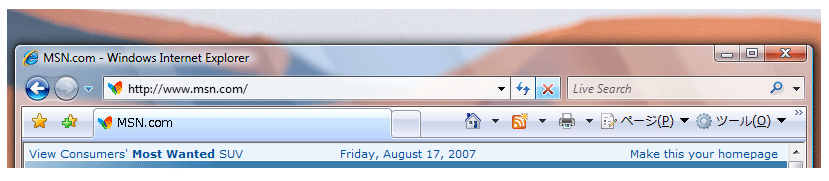

# <a name="extend-glass-frame-into-a-wpf-application"></a><span data-ttu-id="624b8-102">WPF アプリケーションへのグラス フレームの拡張</span><span class="sxs-lookup"><span data-stu-id="624b8-102">Extend Glass Frame Into a WPF Application</span></span>
<span data-ttu-id="624b8-103">このトピックの内容を拡張する方法を示しています、 [!INCLUDE[TLA#tla_winvista](../../../../includes/tlasharptla-winvista-md.md)] Windows Presentation Foundation (WPF) アプリケーションのクライアント領域にグラス フレーム。</span><span class="sxs-lookup"><span data-stu-id="624b8-103">This topic demonstrates how to extend the [!INCLUDE[TLA#tla_winvista](../../../../includes/tlasharptla-winvista-md.md)] glass frame into the client area of a Windows Presentation Foundation (WPF) application.</span></span>  
  
> [!NOTE]
>  <span data-ttu-id="624b8-104">この例は、グラスが有効なデスクトップ ウィンドウ マネージャー (DWM) を実行している [!INCLUDE[TLA2#tla_winvista](../../../../includes/tla2sharptla-winvista-md.md)] コンピューターでしか動作しません。</span><span class="sxs-lookup"><span data-stu-id="624b8-104">This example will only work on a [!INCLUDE[TLA2#tla_winvista](../../../../includes/tla2sharptla-winvista-md.md)] machine running the Desktop Window Manager (DWM) with glass enabled.</span></span> [!INCLUDE[TLA2#tla_winvista](../../../../includes/tla2sharptla-winvista-md.md)]<span data-ttu-id="624b8-105"> Home Basic エディションは、透明グラス効果をサポートしていません。</span><span class="sxs-lookup"><span data-stu-id="624b8-105"> Home Basic edition does not support the transparent glass effect.</span></span> <span data-ttu-id="624b8-106">[!INCLUDE[TLA2#tla_winvista](../../../../includes/tla2sharptla-winvista-md.md)] の他のエディションで通常透明グラス効果がレンダリングされる領域は、不透明でレンダリングされます。</span><span class="sxs-lookup"><span data-stu-id="624b8-106">Areas that would typically render with the transparent glass effect on other editions of [!INCLUDE[TLA2#tla_winvista](../../../../includes/tla2sharptla-winvista-md.md)] are rendered opaque.</span></span>  
  
## <a name="example"></a><span data-ttu-id="624b8-107">例</span><span class="sxs-lookup"><span data-stu-id="624b8-107">Example</span></span>  
 <span data-ttu-id="624b8-108">次の図は、Internet Explorer 7 のアドレス バーに拡張されたグラス フレームを示しています。</span><span class="sxs-lookup"><span data-stu-id="624b8-108">The following image illustrates the glass frame extended into the address bar of Internet Explorer 7.</span></span>  
  
 <span data-ttu-id="624b8-109">**アドレス バーの背後にグラス フレームが拡張された Internet Explorer。**</span><span class="sxs-lookup"><span data-stu-id="624b8-109">**Internet Explorer with extended glass frame behind address bar.**</span></span>  
  
 <span data-ttu-id="624b8-110"></span><span class="sxs-lookup"><span data-stu-id="624b8-110"></span></span>  
  
 <span data-ttu-id="624b8-111">[!INCLUDE[TLA2#tla_wpf](../../../../includes/tla2sharptla-wpf-md.md)] アプリケーションにグラス フレームを拡張するには、アンマネージ [!INCLUDE[TLA#tla_api](../../../../includes/tlasharptla-api-md.md)] へのアクセスが必要です。</span><span class="sxs-lookup"><span data-stu-id="624b8-111">To extend the glass frame on a [!INCLUDE[TLA2#tla_wpf](../../../../includes/tla2sharptla-wpf-md.md)] application, access to unmanaged [!INCLUDE[TLA#tla_api](../../../../includes/tlasharptla-api-md.md)] is needed.</span></span> <span data-ttu-id="624b8-112">次のコード例では、クライアント領域にフレームを拡張するために必要な 2 つの [!INCLUDE[TLA2#tla_api](../../../../includes/tla2sharptla-api-md.md)] のプラットフォーム呼び出し (pinvoke) を行っています。</span><span class="sxs-lookup"><span data-stu-id="624b8-112">The following code example does a Platform Invoke (pinvoke) for the two [!INCLUDE[TLA2#tla_api](../../../../includes/tla2sharptla-api-md.md)] needed to extend the frame into the client area.</span></span> <span data-ttu-id="624b8-113">これらの各 [!INCLUDE[TLA2#tla_api](../../../../includes/tla2sharptla-api-md.md)] は、**NonClientRegionAPI** という名前のクラスで宣言されています。</span><span class="sxs-lookup"><span data-stu-id="624b8-113">Each of these [!INCLUDE[TLA2#tla_api](../../../../includes/tla2sharptla-api-md.md)] are declared in a class called **NonClientRegionAPI**.</span></span>  
  
```csharp  
[StructLayout(LayoutKind.Sequential)]  
public struct MARGINS  
{  
    public int cxLeftWidth;      // width of left border that retains its size  
    public int cxRightWidth;     // width of right border that retains its size  
    public int cyTopHeight;      // height of top border that retains its size  
    public int cyBottomHeight;   // height of bottom border that retains its size  
};  
  
[DllImport("DwmApi.dll")]  
public static extern int DwmExtendFrameIntoClientArea(  
    IntPtr hwnd,  
    ref MARGINS pMarInset);  
```  
  
```vb  
<StructLayout(LayoutKind.Sequential)>  
        Public Structure MARGINS  
            Public cxLeftWidth As Integer ' width of left border that retains its size  
            Public cxRightWidth As Integer ' width of right border that retains its size  
            Public cyTopHeight As Integer ' height of top border that retains its size  
            Public cyBottomHeight As Integer ' height of bottom border that retains its size  
        End Structure  
  
        <DllImport("DwmApi.dll")>  
        Public Shared Function DwmExtendFrameIntoClientArea(ByVal hwnd As IntPtr, ByRef pMarInset As MARGINS) As Integer  
        End Function  
```  
  
 <span data-ttu-id="624b8-114">[DwmExtendFrameIntoClientArea](https://msdn.microsoft.com/library/aa969512.aspx) は、クライアント領域にフレームを拡張する DWM 関数です。</span><span class="sxs-lookup"><span data-stu-id="624b8-114">[DwmExtendFrameIntoClientArea](https://msdn.microsoft.com/library/aa969512.aspx) is the DWM function that extends the frame into the client area.</span></span> <span data-ttu-id="624b8-115">ウィンドウ ハンドルと [MARGINS](https://msdn.microsoft.com/library/bb773244.aspx) 構造体の 2 つのパラメーターを受け取ります。</span><span class="sxs-lookup"><span data-stu-id="624b8-115">It takes two parameters; a window handle and a [MARGINS](https://msdn.microsoft.com/library/bb773244.aspx) structure.</span></span> <span data-ttu-id="624b8-116">[MARGINS](https://msdn.microsoft.com/library/bb773244.aspx) は、フレームがクライアント領域に余分に拡張する量を DWM に通知するために使われます。</span><span class="sxs-lookup"><span data-stu-id="624b8-116">[MARGINS](https://msdn.microsoft.com/library/bb773244.aspx) is used to tell the DWM how much extra the frame should be extended into the client area.</span></span>  
  
## <a name="example"></a><span data-ttu-id="624b8-117">例</span><span class="sxs-lookup"><span data-stu-id="624b8-117">Example</span></span>  
 <span data-ttu-id="624b8-118">[DwmExtendFrameIntoClientArea](https://msdn.microsoft.com/library/aa969512.aspx) 関数を使うには、ウィンドウ ハンドルを取得する必要があります。</span><span class="sxs-lookup"><span data-stu-id="624b8-118">To use the [DwmExtendFrameIntoClientArea](https://msdn.microsoft.com/library/aa969512.aspx) function, a window handle must be obtained.</span></span> <span data-ttu-id="624b8-119">[!INCLUDE[TLA2#tla_wpf](../../../../includes/tla2sharptla-wpf-md.md)]から、ウィンドウのハンドルを取得できます、<xref:System.Windows.Interop.HwndSource.Handle%2A>のプロパティ、<xref:System.Windows.Interop.HwndSource>です。</span><span class="sxs-lookup"><span data-stu-id="624b8-119">In [!INCLUDE[TLA2#tla_wpf](../../../../includes/tla2sharptla-wpf-md.md)], the window handle can be obtained from the <xref:System.Windows.Interop.HwndSource.Handle%2A> property of an <xref:System.Windows.Interop.HwndSource>.</span></span> <span data-ttu-id="624b8-120">次の例では、クライアント領域に、フレームを拡張で、<xref:System.Windows.FrameworkElement.Loaded>ウィンドウのイベントです。</span><span class="sxs-lookup"><span data-stu-id="624b8-120">In the following example, the frame is extended into the client area on the <xref:System.Windows.FrameworkElement.Loaded> event of the window.</span></span>  
  
```csharp  
void OnLoaded(object sender, RoutedEventArgs e)  
{  
   try  
   {  
      // Obtain the window handle for WPF application  
      IntPtr mainWindowPtr = new WindowInteropHelper(this).Handle;  
      HwndSource mainWindowSrc = HwndSource.FromHwnd(mainWindowPtr);  
      mainWindowSrc.CompositionTarget.BackgroundColor = Color.FromArgb(0, 0, 0, 0);  
  
      // Get System Dpi  
      System.Drawing.Graphics desktop = System.Drawing.Graphics.FromHwnd(mainWindowPtr);  
      float DesktopDpiX = desktop.DpiX;  
      float DesktopDpiY = desktop.DpiY;  
  
      // Set Margins  
      NonClientRegionAPI.MARGINS margins = new NonClientRegionAPI.MARGINS();  
  
      // Extend glass frame into client area  
      // Note that the default desktop Dpi is 96dpi. The  margins are  
      // adjusted for the system Dpi.  
      margins.cxLeftWidth = Convert.ToInt32(5 * (DesktopDpiX / 96));  
      margins.cxRightWidth = Convert.ToInt32(5 * (DesktopDpiX / 96));  
      margins.cyTopHeight = Convert.ToInt32(((int)topBar.ActualHeight + 5) * (DesktopDpiX / 96));  
      margins.cyBottomHeight = Convert.ToInt32(5 * (DesktopDpiX / 96));  
  
      int hr = NonClientRegionAPI.DwmExtendFrameIntoClientArea(mainWindowSrc.Handle, ref margins);  
      //  
      if (hr < 0)  
      {  
         //DwmExtendFrameIntoClientArea Failed  
      }  
   }  
   // If not Vista, paint background white.  
   catch (DllNotFoundException)  
   {  
      Application.Current.MainWindow.Background = Brushes.White;  
   }  
}  
```  
  
## <a name="example"></a><span data-ttu-id="624b8-121">例</span><span class="sxs-lookup"><span data-stu-id="624b8-121">Example</span></span>  
 <span data-ttu-id="624b8-122">次の例では、クライアント領域にフレームが拡張される簡単なウィンドウを示します。</span><span class="sxs-lookup"><span data-stu-id="624b8-122">The following example shows a simple window in which the frame is extended into the client area.</span></span> <span data-ttu-id="624b8-123">フレームは、2 つを含む上罫線の内側に<xref:System.Windows.Controls.TextBox>オブジェクト。</span><span class="sxs-lookup"><span data-stu-id="624b8-123">The frame is extended behind the top border that contains the two <xref:System.Windows.Controls.TextBox> objects.</span></span>  
  
```xaml  
<Window x:Class="SDKSample.Window1"  
    xmlns="http://schemas.microsoft.com/winfx/2006/xaml/presentation"  
    xmlns:x="http://schemas.microsoft.com/winfx/2006/xaml"  
    Title="Extended Glass in WPF" Height="300" Width="400"   
    Loaded="OnLoaded" Background="Transparent"  
    >  
  <Grid ShowGridLines="True">  
    <DockPanel Name="mainDock">  
      <!-- The border is used to compute the rendered height with margins.  
           topBar contents will be displayed on the extended glass frame.-->  
      <Border Name="topBar" DockPanel.Dock="Top" >  
        <Grid Name="grid">  
          <Grid.ColumnDefinitions>  
            <ColumnDefinition MinWidth="100" Width="*"/>  
            <ColumnDefinition Width="Auto"/>  
          </Grid.ColumnDefinitions>  
          <TextBox Grid.Column="0" MinWidth="100" Margin="0,0,10,5">Path</TextBox>  
          <TextBox Grid.Column="1" MinWidth="75" Margin="0,0,0,5">Search</TextBox>  
        </Grid>  
      </Border>  
      <Grid DockPanel.Dock="Top" >  
        <Grid.ColumnDefinitions>  
          <ColumnDefinition/>  
        </Grid.ColumnDefinitions>  
        <TextBox Grid.Column="0" AcceptsReturn="True"/>  
      </Grid>  
    </DockPanel>  
  </Grid>  
</Window>  
```  
  
 <span data-ttu-id="624b8-124">次の図は、[!INCLUDE[TLA2#tla_wpf](../../../../includes/tla2sharptla-wpf-md.md)] アプリケーションに拡張されたグラス フレームを示しています。</span><span class="sxs-lookup"><span data-stu-id="624b8-124">The following image illustrates the glass frame extended into a [!INCLUDE[TLA2#tla_wpf](../../../../includes/tla2sharptla-wpf-md.md)] application.</span></span>  
  
 <span data-ttu-id="624b8-125">**拡張されたグラス フレーム、**[!INCLUDE[TLA2#tla_wpf](../../../../includes/tla2sharptla-wpf-md.md)]**アプリケーションです。**</span><span class="sxs-lookup"><span data-stu-id="624b8-125">**Glass Frame Extended into a**  [!INCLUDE[TLA2#tla_wpf](../../../../includes/tla2sharptla-wpf-md.md)]  **Application.**</span></span>  
  
 <span data-ttu-id="624b8-126"></span><span class="sxs-lookup"><span data-stu-id="624b8-126"></span></span>  
  
## <a name="see-also"></a><span data-ttu-id="624b8-127">関連項目</span><span class="sxs-lookup"><span data-stu-id="624b8-127">See Also</span></span>  
 [<span data-ttu-id="624b8-128">デスクトップ ウィンドウ マネージャーの概要</span><span class="sxs-lookup"><span data-stu-id="624b8-128">Desktop Window Manager Overview</span></span>](https://msdn.microsoft.com/library/aa969540.aspx)  
 [<span data-ttu-id="624b8-129">デスクトップ ウィンドウ マネージャーぼかしの概要</span><span class="sxs-lookup"><span data-stu-id="624b8-129">Desktop Window Manager Blur Overview</span></span>](https://msdn.microsoft.com/library/aa969537.aspx)  
 [<span data-ttu-id="624b8-130">DwmExtendFrameIntoClientArea</span><span class="sxs-lookup"><span data-stu-id="624b8-130">DwmExtendFrameIntoClientArea</span></span>](https://msdn.microsoft.com/library/aa969512.aspx)
