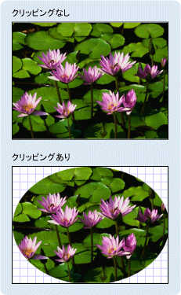

# ジオメトリの概要
この概要で説明を使用する方法、 [!INCLUDE[TLA#tla_winclient](../../../../includes/tlasharptla-winclient-md.md)] <xref:System.Windows.Media.Geometry>図形を記述するクラス。 このトピックでは、間の相違点も対照的<xref:System.Windows.Media.Geometry>オブジェクトおよび<xref:System.Windows.Shapes.Shape>要素。  
  
  
   
## ジオメトリとは  
 <xref:System.Windows.Media.Geometry>クラスおよびなど、そこから派生するクラス<xref:System.Windows.Media.EllipseGeometry>、 <xref:System.Windows.Media.PathGeometry>、および<xref:System.Windows.Media.CombinedGeometry>、2-d 図形のジオメトリを記述できます。 これらの幾何学的な記述には、画面を塗りつぶす図形を定義したり、ヒット テストやクリップ領域を定義するなど、多くの用途があります。 ジオメトリを使用して、アニメーション パスを定義することもできます。  
  
 <xref:System.Windows.Media.Geometry> オブジェクトは、四角形、円、または複合では、2 つ以上の geometry オブジェクトから作成されたなど、単純な場合、指定できます。  使用してより複雑なジオメトリを作成することができます、<xref:System.Windows.Media.PathGeometry>と<xref:System.Windows.Media.StreamGeometry>円弧と曲線の説明を可能にするクラス。  
  
 <xref:System.Windows.Media.Geometry>の種類は、 <xref:System.Windows.Freezable>、<xref:System.Windows.Media.Geometry>オブジェクトはいくつかの特別な機能を提供: として宣言できます[リソース](../../../../docs/framework/wpf/advanced/xaml-resources.md)、読み取り専用に複製すると、パフォーマンスを向上させるために、複数のオブジェクト間で共有し、スレッド セーフで行われます。 によって提供されるさまざまな機能の詳細については<xref:System.Windows.Freezable>、オブジェクトを参照してください、 [Freezable オブジェクトの概要](../../../../docs/framework/wpf/advanced/freezable-objects-overview.md)です。  
  
   
## ジオメトリと図形  
 <xref:System.Windows.Media.Geometry>と<xref:System.Windows.Shapes.Shape>クラス似たような点で、2 次元の図形が記述 (比較<xref:System.Windows.Media.EllipseGeometry>と<xref:System.Windows.Shapes.Ellipse>など) が重要な違いがあります。  
  
 1 つの<xref:System.Windows.Media.Geometry>クラスから継承、<xref:System.Windows.Freezable>中にクラス、<xref:System.Windows.Shapes.Shape>クラスから継承<xref:System.Windows.FrameworkElement>です。 要素であるため<xref:System.Windows.Shapes.Shape>オブジェクト自体を表示して、レイアウト システムに参加中に<xref:System.Windows.Media.Geometry>オブジェクトことはできません。  
  
 <xref:System.Windows.Shapes.Shape>オブジェクトがより簡単に使用可能な<xref:System.Windows.Media.Geometry>オブジェクト、<xref:System.Windows.Media.Geometry>オブジェクトは、汎用性が高いです。 中に、<xref:System.Windows.Shapes.Shape>オブジェクトが 2 次元グラフィックスを表示するために使用される、 <xref:System.Windows.Media.Geometry> 2 D グラフィックスの幾何学的領域を定義、クリッピング、用の領域を定義またはたとえばヒット テスト用の領域を定義するオブジェクトを使用できます。  
  
### パス図形  
 1 つ<xref:System.Windows.Shapes.Shape>、<xref:System.Windows.Shapes.Path>クラスを使用して実際には、<xref:System.Windows.Media.Geometry>その内容を記述します。 設定して、<xref:System.Windows.Shapes.Path.Data%2A>のプロパティ、<xref:System.Windows.Shapes.Path>で、<xref:System.Windows.Media.Geometry>と設定、<xref:System.Windows.Shapes.Shape.Fill%2A>と<xref:System.Windows.Shapes.Shape.Stroke%2A>プロパティを表示するには、<xref:System.Windows.Media.Geometry>です。  
  
   
## ジオメトリを使用する一般的なプロパティ  
 これまでのセクションでは、図形の描画、アニメーション、クリッピングなどのさまざまな目的で、ジオメトリ オブジェクトを他のオブジェクトと共に使用できることを説明しました。 次の表に、いくつかのクラスを使用するプロパティを持つ、<xref:System.Windows.Media.Geometry>オブジェクト。  
  
|型|プロパティ|  
|----------|--------------|  
|<xref:System.Windows.Media.Animation.DoubleAnimationUsingPath>|<xref:System.Windows.Media.Animation.DoubleAnimationUsingPath.PathGeometry%2A>|  
|<xref:System.Windows.Media.DrawingGroup>|<xref:System.Windows.Media.DrawingGroup.ClipGeometry%2A>|  
|<xref:System.Windows.Media.GeometryDrawing>|<xref:System.Windows.Media.GeometryDrawing.Geometry%2A>|  
|<xref:System.Windows.Shapes.Path>|<xref:System.Windows.Shapes.Path.Data%2A>|  
|<xref:System.Windows.UIElement>|<xref:System.Windows.UIElement.Clip%2A>|  
  
   
## 単純なジオメトリの種類  
 すべてのジオメトリの基本クラスは抽象クラス<xref:System.Windows.Media.Geometry>です。  派生するクラス、<xref:System.Windows.Media.Geometry>クラスは 3 つのカテゴリにほぼ同じ分類できます: 単純なジオメトリ、パス ジオメトリ、および複合ジオメトリ。  
  
 単純なジオメトリ クラスに含まれる<xref:System.Windows.Media.LineGeometry>、 <xref:System.Windows.Media.RectangleGeometry>、および<xref:System.Windows.Media.EllipseGeometry>線、四角形、および円などの基本的な幾何学図形を作成に使用するとします。  
  
-   A<xref:System.Windows.Media.LineGeometry>行と終了位置の開始位置を指定することによって定義されます。  
  
-   A<xref:System.Windows.Media.RectangleGeometry>で定義された、<xref:System.Windows.Rect>構造の相対的な位置とその高さと幅を指定します。 角の丸い四角形を作成するには設定して、<xref:System.Windows.Media.RectangleGeometry.RadiusX%2A>と<xref:System.Windows.Media.RectangleGeometry.RadiusY%2A>プロパティです。  
  
-   <xref:System.Windows.Media.EllipseGeometry>中心点、x 半径と y 半径によって定義されます。  レンダリングとクリッピング用の単純ジオメトリの作成方法を次の例に示します。  
  
 使用して、これら同じ図形は、できるだけでなく、複雑な図形を作成できる、<xref:System.Windows.Media.PathGeometry>または geometry オブジェクトを一緒ですがこれらのクラスを組み合わせることによってこれらの基本的な幾何学図形を生成するためより簡単に手段を提供します。  
  
 次の例は、作成して表示する方法を示しています、<xref:System.Windows.Media.LineGeometry>です。  前述した、<xref:System.Windows.Media.Geometry>オブジェクトはため、この例では、自身で描画することはありません、<xref:System.Windows.Shapes.Path>図形、線を表示するためにします。  行に領域があるないために設定、<xref:System.Windows.Shapes.Shape.Fill%2A>のプロパティ、<xref:System.Windows.Shapes.Path>効果はありません。 代わりに、のみ、<xref:System.Windows.Shapes.Shape.Stroke%2A>と<xref:System.Windows.Shapes.Shape.StrokeThickness%2A>プロパティが指定されています。 この例からの出力を次の図に示します。  
  
   
(10,20) から (100,130) まで描画された LineGeometry  
  
 [!code-xaml[GeometryOverviewSamples_snip#GraphicsMMLineGeometryExample](../../../../samples/snippets/csharp/VS_Snippets_Wpf/GeometryOverviewSamples_snip/CS/GeometryExamples.xaml#graphicsmmlinegeometryexample)]  
  
 [!code-csharp[GeometryOverviewSamples_procedural_snip#GraphicsMMLineGeometryExample](../../../../samples/snippets/csharp/VS_Snippets_Wpf/GeometryOverviewSamples_procedural_snip/CSharp/GeometryExamples.cs#graphicsmmlinegeometryexample)]
 [!code-vb[GeometryOverviewSamples_procedural_snip#GraphicsMMLineGeometryExample](../../../../samples/snippets/visualbasic/VS_Snippets_Wpf/GeometryOverviewSamples_procedural_snip/visualbasic/geometryexamples.vb#graphicsmmlinegeometryexample)]  
  
 次の例では、作成して表示する方法、<xref:System.Windows.Media.EllipseGeometry>です。  例のセット、<xref:System.Windows.Media.EllipseGeometry.Center%2A>の<xref:System.Windows.Media.EllipseGeometry>、ポイントに設定されている`50,50`x 半径と y 半径に設定されてと`50`100 の直径の円を作成します。  ここでは、パス要素の塗りつぶしのプロパティに値を割り当てることによって、楕円の内部を描画する<xref:System.Windows.Media.Brushes.Gold%2A>です。 この例からの出力を次の図に示します。  
  
   
(50,50) に描画された EllipseGeometry  
  
 [!code-xaml[GeometryOverviewSamples_snip#GraphicsMMEllipseGeometryExample](../../../../samples/snippets/csharp/VS_Snippets_Wpf/GeometryOverviewSamples_snip/CS/GeometryExamples.xaml#graphicsmmellipsegeometryexample)]  
  
 [!code-csharp[GeometryOverviewSamples_procedural_snip#GraphicsMMEllipseGeometryExample](../../../../samples/snippets/csharp/VS_Snippets_Wpf/GeometryOverviewSamples_procedural_snip/CSharp/GeometryExamples.cs#graphicsmmellipsegeometryexample)]
 [!code-vb[GeometryOverviewSamples_procedural_snip#GraphicsMMEllipseGeometryExample](../../../../samples/snippets/visualbasic/VS_Snippets_Wpf/GeometryOverviewSamples_procedural_snip/visualbasic/geometryexamples.vb#graphicsmmellipsegeometryexample)]  
  
 次の例は、作成して表示する方法を示しています、<xref:System.Windows.Media.RectangleGeometry>です。  位置と四角形の寸法がによって定義されている、<xref:System.Windows.Rect>構造体。 位置は `50,50`、高さと幅は両方とも `25` で、正方形が作成されます。 この例からの出力を次の図に示します。  
  
   
50,50 に描画された RectangleGeometry  
  
 [!code-xaml[GeometryOverviewSamples_snip#GraphicsMMRectangleGeometryExample](../../../../samples/snippets/csharp/VS_Snippets_Wpf/GeometryOverviewSamples_snip/CS/GeometryExamples.xaml#graphicsmmrectanglegeometryexample)]  
  
 [!code-csharp[GeometryOverviewSamples_procedural_snip#GraphicsMMRectangleGeometryExample](../../../../samples/snippets/csharp/VS_Snippets_Wpf/GeometryOverviewSamples_procedural_snip/CSharp/GeometryExamples.cs#graphicsmmrectanglegeometryexample)]
 [!code-vb[GeometryOverviewSamples_procedural_snip#GraphicsMMRectangleGeometryExample](../../../../samples/snippets/visualbasic/VS_Snippets_Wpf/GeometryOverviewSamples_procedural_snip/visualbasic/geometryexamples.vb#graphicsmmrectanglegeometryexample)]  
  
 次の例を使用する方法を示しています、<xref:System.Windows.Media.EllipseGeometry>イメージのクリップ領域とします。  <xref:System.Windows.Controls.Image>でオブジェクトが定義されている、 <xref:System.Windows.FrameworkElement.Width%2A> 200 と<xref:System.Windows.FrameworkElement.Height%2A>150。  <xref:System.Windows.Media.EllipseGeometry>で、 <xref:System.Windows.Media.EllipseGeometry.RadiusX%2A> 100 の値、<xref:System.Windows.Media.EllipseGeometry.RadiusY%2A>値の 75、および<xref:System.Windows.Media.EllipseGeometry.Center%2A>100,75 の値に設定されて、<xref:System.Windows.UIElement.Clip%2A>イメージのプロパティです。  イメージの楕円の領域内の部分だけが表示されます。 この例からの出力を次の図に示します。  
  
   
イメージ コントロールのクリップに使用される EllipseGeometry  
  
 [!code-xaml[GeometryOverviewSamples_snip#GraphicsMMImageClipGeometryExample](../../../../samples/snippets/csharp/VS_Snippets_Wpf/GeometryOverviewSamples_snip/CS/GeometryExamples.xaml#graphicsmmimageclipgeometryexample)]  
  
 [!code-csharp[GeometryOverviewSamples_procedural_snip#GraphicsMMImageClipGeometryExample](../../../../samples/snippets/csharp/VS_Snippets_Wpf/GeometryOverviewSamples_procedural_snip/CSharp/GeometryExamples.cs#graphicsmmimageclipgeometryexample)]
 [!code-vb[GeometryOverviewSamples_procedural_snip#GraphicsMMImageClipGeometryExample](../../../../samples/snippets/visualbasic/VS_Snippets_Wpf/GeometryOverviewSamples_procedural_snip/visualbasic/geometryexamples.vb#graphicsmmimageclipgeometryexample)]  
  
   
## パス ジオメトリ  
 <xref:System.Windows.Media.PathGeometry>クラス、軽量等価、<xref:System.Windows.Media.StreamGeometry>クラス、円弧、曲線、および行ので構成される複数の複雑な図形を記述するための手段を提供します。  
  
 中心に、<xref:System.Windows.Media.PathGeometry>のコレクションは、<xref:System.Windows.Media.PathFigure>という名前は、各図形には、個別の図形がについて説明します、オブジェクト、<xref:System.Windows.Media.PathGeometry>です。 各<xref:System.Windows.Media.PathFigure>はそれ自体から成る 1 つ以上の<xref:System.Windows.Media.PathSegment>図のセグメントを記述するの各オブジェクトです。  
  
 多くの種類のセグメントがあります。  
  
|セグメントの種類|説明|例|  
|------------------|-----------------|-------------|  
|<xref:System.Windows.Media.ArcSegment>|2 つの点を結ぶ楕円の円弧を作成します。|[楕円の円弧を作成する](../../../../docs/framework/wpf/graphics-multimedia/how-to-create-an-elliptical-arc.md)。|  
|<xref:System.Windows.Media.BezierSegment>|2 つの点を結ぶ 3 次ベジエ曲線を作成します。|[3 次ベジエ曲線を作成する](../../../../docs/framework/wpf/graphics-multimedia/how-to-create-a-cubic-bezier-curve.md)。|  
|<xref:System.Windows.Media.LineSegment>|2 つの点を結ぶ直性を作成します。|[PathGeometry で LineSegment を作成する](../../../../docs/framework/wpf/graphics-multimedia/how-to-create-a-linesegment-in-a-pathgeometry.md)|  
|<xref:System.Windows.Media.PolyBezierSegment>|一続きの 3 次ベジエ曲線を作成します。|参照してください、<xref:System.Windows.Media.PolyBezierSegment>の種類 ページ。|  
|<xref:System.Windows.Media.PolyLineSegment>|一続きの直線を作成します。|参照してください、<xref:System.Windows.Media.PolyLineSegment>の種類 ページ。|  
|<xref:System.Windows.Media.PolyQuadraticBezierSegment>|一続きの 2 次ベジエ曲線を作成します。|参照してください、<xref:System.Windows.Media.PolyQuadraticBezierSegment>ページ。|  
|<xref:System.Windows.Media.QuadraticBezierSegment>|2 次ベジエ曲線を作成します。|[2 次ベジエ曲線を作成する](../../../../docs/framework/wpf/graphics-multimedia/how-to-create-a-quadratic-bezier-curve.md)。|  
  
 内のセグメントを<xref:System.Windows.Media.PathFigure>次のセグメントの始点をされている各セグメントの終了点の 1 つの幾何学図形に結合されます。 <xref:System.Windows.Media.PathFigure.StartPoint%2A>のプロパティ、<xref:System.Windows.Media.PathFigure>最初のセグメントを描画する元となるポイントを指定します。 後続の各セグメントは、前のセグメントの終点から始まります。 などの垂直線がから`10,50`に`10,150`設定で定義されていることができます、<xref:System.Windows.Media.PathFigure.StartPoint%2A>プロパティを`10,50`を作成して、<xref:System.Windows.Media.LineSegment>で、<xref:System.Windows.Media.LineSegment.Point%2A>プロパティの設定`10,150`です。  
  
 次の例では、単純な<xref:System.Windows.Media.PathGeometry>、1 つから成る<xref:System.Windows.Media.PathFigure>で、<xref:System.Windows.Media.LineSegment>使用して、表示、<xref:System.Windows.Shapes.Path>要素。 <xref:System.Windows.Media.PathFigure>オブジェクトの<xref:System.Windows.Media.PathFigure.StartPoint%2A>に設定されている`10,20`と<xref:System.Windows.Media.LineSegment>の終点で定義された`100,130`です。 次の図は、<xref:System.Windows.Media.PathGeometry>この例で作成します。  
  
   
単一の LineSegment を含む PathGeometry  
  
 [!code-xaml[GeometryOverviewSamples_snip#GraphicsMMPathGeometryLineExample](../../../../samples/snippets/csharp/VS_Snippets_Wpf/GeometryOverviewSamples_snip/CS/GeometryExamples.xaml#graphicsmmpathgeometrylineexample)]  
  
 [!code-csharp[GeometryOverviewSamples_procedural_snip#GraphicsMMPathGeometryLineExample](../../../../samples/snippets/csharp/VS_Snippets_Wpf/GeometryOverviewSamples_procedural_snip/CSharp/GeometryExamples.cs#graphicsmmpathgeometrylineexample)]
 [!code-vb[GeometryOverviewSamples_procedural_snip#GraphicsMMPathGeometryLineExample](../../../../samples/snippets/visualbasic/VS_Snippets_Wpf/GeometryOverviewSamples_procedural_snip/visualbasic/geometryexamples.vb#graphicsmmpathgeometrylineexample)]  
  
 この例を前は<xref:System.Windows.Media.LineGeometry>例です。  使用する構文、<xref:System.Windows.Media.PathGeometry>は、単純なを使用するよりもはるかに詳細<xref:System.Windows.Media.LineGeometry>を使用する方が簡単にし、<xref:System.Windows.Media.LineGeometry>の冗語構文が、ここでは、クラス、<xref:System.Windows.Media.PathGeometry>により、非常に複雑で複雑な幾何学的領域。  
  
 複雑なジオメトリの組み合わせを使用して作成できます<xref:System.Windows.Media.PathSegment>オブジェクト。  
  
 次の例では、 <xref:System.Windows.Media.BezierSegment>、 <xref:System.Windows.Media.LineSegment>、および<xref:System.Windows.Media.ArcSegment>図形を作成します。 例では、まずを作成、3 次ベジエ曲線は 4 つのポイントを定義することで、: 終点、前のセグメントの終了点は、始点 (<xref:System.Windows.Media.BezierSegment.Point3%2A>) と 2 つのコントロール ポイント (<xref:System.Windows.Media.BezierSegment.Point1%2A>と<xref:System.Windows.Media.BezierSegment.Point2%2A>)。  3 次ベジエ曲線の 2 つの制御点は磁石のように動作し、本来は直線になる部分を制御点の方へ引き寄せ、曲線を生成します。 最初の制御点<xref:System.Windows.Media.BezierSegment.Point1%2A>、先頭に影響を与える曲線の部分です。 2 番目の制御点<xref:System.Windows.Media.BezierSegment.Point2%2A>、曲線の終了部分に影響します。  
  
 この例で追加し、 <xref:System.Windows.Media.LineSegment>、上記の終了点の間で描画される<xref:System.Windows.Media.BezierSegment>で指定された地点をそれに先行するその<xref:System.Windows.Media.LineSegment>プロパティです。  
  
 この例で追加し、 <xref:System.Windows.Media.ArcSegment>、上記の終点からが描画される<xref:System.Windows.Media.LineSegment>で指定された地点をその<xref:System.Windows.Media.ArcSegment.Point%2A>プロパティです。 この例では、円弧の x 半径と y 半径も指定します (<xref:System.Windows.Media.ArcSegment.Size%2A>)、回転角度 (<xref:System.Windows.Media.ArcSegment.RotationAngle%2A>)、結果として得られる円弧の角度は大きさべきかを示すフラグ (<xref:System.Windows.Media.ArcSegment.IsLargeArc%2A>)、および、円弧が描画される方向を示す値 (<xref:System.Windows.Media.ArcSegment.SweepDirection%2A>). この例で作成した図形を次の図に示します。  
  
   
PathGeometry  
  
 [!code-xaml[GeometryOverviewSamples_snip#GraphicsMMPathGeometryComplexExample](../../../../samples/snippets/csharp/VS_Snippets_Wpf/GeometryOverviewSamples_snip/CS/GeometryExamples.xaml#graphicsmmpathgeometrycomplexexample)]  
  
 [!code-csharp[GeometryOverviewSamples_procedural_snip#GraphicsMMPathGeometryComplexExample](../../../../samples/snippets/csharp/VS_Snippets_Wpf/GeometryOverviewSamples_procedural_snip/CSharp/GeometryExamples.cs#graphicsmmpathgeometrycomplexexample)]
 [!code-vb[GeometryOverviewSamples_procedural_snip#GraphicsMMPathGeometryComplexExample](../../../../samples/snippets/visualbasic/VS_Snippets_Wpf/GeometryOverviewSamples_procedural_snip/visualbasic/geometryexamples.vb#graphicsmmpathgeometrycomplexexample)]  
  
 複数を使用して、さらに複雑なジオメトリを作成することができます<xref:System.Windows.Media.PathFigure>内のオブジェクトは、<xref:System.Windows.Media.PathGeometry>です。  
  
 次の例を作成、 <xref:System.Windows.Media.PathGeometry> 、2 つ<xref:System.Windows.Media.PathFigure>オブジェクト、複数含まれている各<xref:System.Windows.Media.PathSegment>オブジェクト。  <xref:System.Windows.Media.PathFigure>上の例と<xref:System.Windows.Media.PathFigure>で、<xref:System.Windows.Media.PolyLineSegment>と<xref:System.Windows.Media.QuadraticBezierSegment>使用されます。  A<xref:System.Windows.Media.PolyLineSegment>点の配列で定義された、<xref:System.Windows.Media.QuadraticBezierSegment>が管理ポイントと終了ポイントで定義されてです。 この例で作成した図形を次の図に示します。  
  
   
複数の図形を使用する PathGeometry  
  
 [!code-xaml[GeometryOverviewSamples_snip#GraphicsMMPathGeometryComplexMultiExample](../../../../samples/snippets/csharp/VS_Snippets_Wpf/GeometryOverviewSamples_snip/CS/GeometryExamples.xaml#graphicsmmpathgeometrycomplexmultiexample)]  
  
 [!code-csharp[GeometryOverviewSamples_procedural_snip#GraphicsMMPathGeometryComplexMultiExample](../../../../samples/snippets/csharp/VS_Snippets_Wpf/GeometryOverviewSamples_procedural_snip/CSharp/GeometryExamples.cs#graphicsmmpathgeometrycomplexmultiexample)]
 [!code-vb[GeometryOverviewSamples_procedural_snip#GraphicsMMPathGeometryComplexMultiExample](../../../../samples/snippets/visualbasic/VS_Snippets_Wpf/GeometryOverviewSamples_procedural_snip/visualbasic/geometryexamples.vb#graphicsmmpathgeometrycomplexmultiexample)]  
  
### StreamGeometry  
 同様に、<xref:System.Windows.Media.PathGeometry>クラス、<xref:System.Windows.Media.StreamGeometry>曲線を円弧、および行を含む可能性のある複雑な幾何学図形を定義します。 異なり、<xref:System.Windows.Media.PathGeometry>の内容、<xref:System.Windows.Media.StreamGeometry>データ バインディング、アニメーション、または変更をサポートしていません。 使用して、<xref:System.Windows.Media.StreamGeometry>複合ジオメトリを記述する必要がある場合は、サポートするオーバーヘッドのデータ バインディング、アニメーション、または変更しません。 その効率のため、<xref:System.Windows.Media.StreamGeometry>クラスは、装飾を記述するための適切な選択です。  
  
 例については、「[方法 : StreamGeometry を使用して図形を作成する](../../../../docs/framework/wpf/graphics-multimedia/how-to-create-a-shape-using-a-streamgeometry.md)」をご覧ください。  
  
### パス マークアップ構文  
 <xref:System.Windows.Media.PathGeometry>と<xref:System.Windows.Media.StreamGeometry>サポートの種類、[!INCLUDE[TLA#tla_xaml](../../../../includes/tlasharptla-xaml-md.md)]属性構文は特殊な一連の移動を使用して、コマンドを描画します。 詳しくは、「[パス マークアップ構文](../../../../docs/framework/wpf/graphics-multimedia/path-markup-syntax.md)」をご覧ください。  
  
   
## 複合ジオメトリ  
 使用して複合ジオメトリ オブジェクトを作成する、 <xref:System.Windows.Media.GeometryGroup>、 <xref:System.Windows.Media.CombinedGeometry>、または、静的なを呼び出すことによって<xref:System.Windows.Media.Geometry>メソッド<xref:System.Windows.Media.Geometry.Combine%2A>です。  
  
-   <xref:System.Windows.Media.CombinedGeometry>オブジェクトおよび<xref:System.Windows.Media.Geometry.Combine%2A>メソッドが 2 つのジオメトリで定義される領域を結合するブール演算を実行します。 <xref:System.Windows.Media.Geometry> 領域がオブジェクトは破棄されません。 2 つしか<xref:System.Windows.Media.Geometry>(ただし、これら 2 つのジオメトリは、複合ジオメトリもあります)、オブジェクトを組み合わせることができます。  
  
-   <xref:System.Windows.Media.GeometryGroup>クラスは一緒になったものを作成、<xref:System.Windows.Media.Geometry>せず、その領域を組み合わせることが含まれているオブジェクトします。 任意の数の<xref:System.Windows.Media.Geometry>オブジェクトに追加することができます、<xref:System.Windows.Media.GeometryGroup>です。 例については、「[方法 : 複合図形を作成する](../../../../docs/framework/wpf/graphics-multimedia/how-to-create-a-composite-shape.md)」をご覧ください。  
  
 使用して、結合操作は実行されないため<xref:System.Windows.Media.GeometryGroup>オブジェクトが使用する場合よりパフォーマンス上の利点を提供<xref:System.Windows.Media.CombinedGeometry>オブジェクトまたは<xref:System.Windows.Media.Geometry.Combine%2A>メソッドです。  
  
   
## 結合したジオメトリ  
 前のセクションが記載されている、<xref:System.Windows.Media.CombinedGeometry>オブジェクトおよび<xref:System.Windows.Media.Geometry.Combine%2A>メソッドが含まれているジオメトリで定義される領域を結合します。 <xref:System.Windows.Media.GeometryCombineMode>列挙体は、ジオメトリを結合する方法を指定します。 値は、使用可能な<xref:System.Windows.Media.CombinedGeometry.GeometryCombineMode%2A>プロパティには: <xref:System.Windows.Media.GeometryCombineMode.Union>、 <xref:System.Windows.Media.GeometryCombineMode.Intersect>、 <xref:System.Windows.Media.GeometryCombineMode.Exclude>、および<xref:System.Windows.Media.GeometryCombineMode.Xor>です。  
  
 次の例で、<xref:System.Windows.Media.CombinedGeometry>共用体の組み合わせモードで定義されています。  両方<xref:System.Windows.Media.CombinedGeometry.Geometry1%2A>と<xref:System.Windows.Media.CombinedGeometry.Geometry2%2A>50 センター オフセットを含むが、同じの半径の円として定義されます。  
  
 [!code-xaml[GeometrySample#23](../../../../samples/snippets/csharp/VS_Snippets_Wpf/GeometrySample/CS/combininggeometriesexample.xaml#23)]  
  
   
  
 次の例で、<xref:System.Windows.Media.CombinedGeometry>の組み合わせモードで定義された<xref:System.Windows.Media.GeometryCombineMode.Xor>です。  両方<xref:System.Windows.Media.CombinedGeometry.Geometry1%2A>と<xref:System.Windows.Media.CombinedGeometry.Geometry2%2A>50 センター オフセットを含むが、同じの半径の円として定義されます。  
  
 [!code-xaml[GeometrySample#24](../../../../samples/snippets/csharp/VS_Snippets_Wpf/GeometrySample/CS/combininggeometriesexample.xaml#24)]  
  
   
  
 その他の例については、「[方法 : 複合図形を作成する](../../../../docs/framework/wpf/graphics-multimedia/how-to-create-a-composite-shape.md)」と「[方法 : 結合したジオメトリを作成する](../../../../docs/framework/wpf/graphics-multimedia/how-to-create-a-combined-geometry.md)」をご覧ください。  
  
   
## Freezable 機能  
 継承しているため、<xref:System.Windows.Freezable>クラス、<xref:System.Windows.Media.Geometry>クラスがいくつかの特別な機能を提供:<xref:System.Windows.Media.Geometry>オブジェクトとして宣言できます[XAML リソース](../../../../docs/framework/wpf/advanced/xaml-resources.md)を向上させるのには読み取り専用に、複数のオブジェクト間で共有パフォーマンスが複製され、スレッド セーフです。 によって提供されるさまざまな機能の詳細については<xref:System.Windows.Freezable>、オブジェクトを参照してください、 [Freezable オブジェクトの概要](../../../../docs/framework/wpf/advanced/freezable-objects-overview.md)です。  
  
   
## その他のジオメトリ機能  
 <xref:System.Windows.Media.Geometry>クラスには、次などの便利なユーティリティ メソッドも用意されています。  
  
-   <xref:System.Windows.Media.Geometry.GetArea%2A> -の領域を取得、<xref:System.Windows.Media.Geometry>です。  
  
-   <xref:System.Windows.Media.Geometry.FillContains%2A> は、ジオメトリが別であるかどうかを決定<xref:System.Windows.Media.Geometry>です。  
  
-   <xref:System.Windows.Media.Geometry.StrokeContains%2A> 指定するかどうかの線、<xref:System.Windows.Media.Geometry>指定したポイントが含まれています。  
  
 参照してください、<xref:System.Windows.Media.Geometry>クラスのメソッドの完全な一覧についてはします。  
  
## 関連項目  
 <xref:System.Windows.Media.Geometry>  
 <xref:System.Windows.Media.PathGeometry>  
 <xref:System.Windows.Shapes.Path>  
 <xref:System.Windows.Media.GeometryDrawing>  
 [2D グラフィックスとイメージング](../../../../docs/framework/wpf/advanced/optimizing-performance-2d-graphics-and-imaging.md)  
 [パス マークアップ構文](../../../../docs/framework/wpf/graphics-multimedia/path-markup-syntax.md)  
 [方法トピック](../../../../docs/framework/wpf/graphics-multimedia/geometries-how-to-topics.md)  
 [アニメーションの概要](../../../../docs/framework/wpf/graphics-multimedia/animation-overview.md)  
 [WPF での図形と基本描画の概要](../../../../docs/framework/wpf/graphics-multimedia/shapes-and-basic-drawing-in-wpf-overview.md)  
 [Drawing オブジェクトの概要](../../../../docs/framework/wpf/graphics-multimedia/drawing-objects-overview.md)
