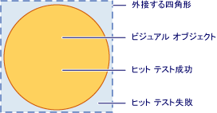
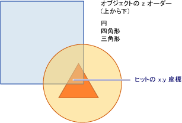

# ビジュアル層でのヒット テストHit Testing in the Visual Layer
ここでは、ビジュアル層で提供されるヒット テスト機能の概要について説明します。This topic provides an overview of hit testing functionality provided by the visual layer. ヒット テストのサポートでは、geometry 型またはポイントの値の表示内容内かどうかを確認することができます、 <xref:System.Windows.Media.Visual>、複数のオブジェクトを選択する四角形を描くなどのユーザー インターフェイスの動作を実装することができます。Hit testing support allows you to determine whether a geometry or point value falls within the rendered content of a <xref:System.Windows.Media.Visual>, allowing you to implement user interface behavior such as a selection rectangle to select multiple objects.  
  
 
  
   
## ヒット テストのシナリオHit Testing Scenarios  
 <xref:System.Windows.UIElement>クラスを提供、<xref:System.Windows.UIElement.InputHitTest%2A>メソッドで、指定された座標の値を使用して、要素に対してヒット テストすることができます。The <xref:System.Windows.UIElement> class provides the <xref:System.Windows.UIElement.InputHitTest%2A> method, which allows you to hit test against an element using a given coordinate value. 多くの場合、<xref:System.Windows.UIElement.InputHitTest%2A>要素のテストのヒットを実装するメソッドが必要な機能を提供します。In many cases, the <xref:System.Windows.UIElement.InputHitTest%2A> method provides the desired functionality for implementing hit testing of elements. ただし、ビジュアル層でのヒット テストを実装する必要があるシナリオもいくつか存在します。However, there are several scenarios in which you may need to implement hit testing at the visual layer.  
  
-   非に対するヒット テスト<xref:System.Windows.UIElement>オブジェクト: これ以外のテストがヒットする場合に当てはまります<xref:System.Windows.UIElement>などのオブジェクト<xref:System.Windows.Media.DrawingVisual>またはグラフィックス オブジェクト。Hit testing against non-<xref:System.Windows.UIElement> objects: This applies if you are hit testing non-<xref:System.Windows.UIElement> objects, such as <xref:System.Windows.Media.DrawingVisual> or graphics objects.  
  
-   ジオメトリを使用したヒット テスト: ポイントの座標値ではなくジオメトリ オブジェクトを使用してヒット テストを行う必要がある場合に適用されます。Hit testing using a geometry: This applies if you need to hit test using a geometry object rather than the coordinate value of a point.  
  
-   複数のオブジェクトに対するヒット テスト: 重なっているオブジェクトなどの複数のオブジェクトに対してヒット テストを行う必要がある場合に適用されます。Hit testing against multiple objects: This applies when you need to hit test against multiple objects, such as overlapping objects. 最初のビジュアルだけでなく、ジオメトリまたはポイントと交差するすべてのビジュアルの結果を取得できます。You can get results for all visuals intersecting a geometry or point, not just the first one.  
  
-   無視<xref:System.Windows.UIElement>ヒット テスト ポリシー: を無視する必要がある場合にこれが適用されます、<xref:System.Windows.UIElement>ヒット テスト ポリシーで、要素が無効になっているかどうかまたは非表示としてなどの条件を考慮します。Ignoring <xref:System.Windows.UIElement> hit testing policy: This applies when you need to ignore the <xref:System.Windows.UIElement> hit testing policy, which takes into consideration such factors as whether an element is disabled or invisible.  
  
> [!NOTE]
>  ビジュアル層でのテスト ヒットを示すコード サンプル全体については、「[DrawingVisuals を使用したヒット テストのサンプル](http://go.microsoft.com/fwlink/?LinkID=159994)」と「[Win32 相互運用によるヒット テストのサンプル](http://go.microsoft.com/fwlink/?LinkID=159995)」を参照してください。For a complete code sample illustrating hit testing at the visual layer, see [Hit Test Using DrawingVisuals Sample](http://go.microsoft.com/fwlink/?LinkID=159994) and [Hit Test with Win32 Interoperation Sample](http://go.microsoft.com/fwlink/?LinkID=159995).  
  
   
## ヒット テストのサポートHit Testing Support  
 目的、<xref:System.Windows.Media.VisualTreeHelper.HitTest%2A>内のメソッド、<xref:System.Windows.Media.VisualTreeHelper>クラスは、geometry 型またはポイント座標の値がコントロールのグラフィック要素など、特定のオブジェクトの描画された内容内かどうかを決定します。The purpose of the <xref:System.Windows.Media.VisualTreeHelper.HitTest%2A> methods in the <xref:System.Windows.Media.VisualTreeHelper> class is to determine whether a geometry or point coordinate value is within the rendered content of a given object, such as a control or graphic element. たとえば、ヒット テストを使用することで、オブジェクトの外接する四角形内でのマウス クリックが、円のジオメトリ内にあるかどうかを確認できます。For example, you could use hit testing to determine whether a mouse click within the bounding rectangle of an object falls within the geometry of a circle. また、ヒット テストの既定の実装をオーバーライドして、独自のカスタム ヒット テスト計算を実行することもできます。You can also choose to override the default implementation of hit testing to perform your own custom hit test calculations.  
  
 四角形以外のオブジェクトの領域と外接する四角形の関係を次の図に示します。The following illustration shows the relationship between a non-rectangular object's region and its bounding rectangle.  
  
   
有効なヒット テスト領域のダイアグラムDiagram of valid hit test region  
  
   
## ヒット テストと z オーダーHit Testing and Z-Order  
 [!INCLUDE[TLA#tla_winclient](../../../../includes/tlasharptla-winclient-md.md)] のビジュアル層は、最上位のオブジェクトだけでなく、ポイントまたはジオメトリの下にあるすべてのオブジェクトに対するヒット テストをサポートします。The [!INCLUDE[TLA#tla_winclient](../../../../includes/tlasharptla-winclient-md.md)] visual layer supports hit testing against all objects under a point or geometry, not just the top-most object. 結果は z オーダーで返されます。Results are returned in z-order. ただし、ビジュアル オブジェクトをパラメーターとして渡す、<xref:System.Windows.Media.VisualTreeHelper.HitTest%2A>のどの部分を決定するメソッドがヒットするビジュアル ツリーのテストします。However, the visual object that you pass as the parameter to the <xref:System.Windows.Media.VisualTreeHelper.HitTest%2A> method determines which portion of the visual tree that will be hit test. ヒット テストは、ビジュアル ツリー全体またはその一部に対して実行できます。You can hit test against the entire visual tree, or any portion of it.  
  
 次の図では、四角形と三角形の両方のオブジェクト上に円オブジェクトがあります。In the following illustration, the circle object is on top of both the square and triangle objects. ヒット z オーダー値がある最上位のビジュアル オブジェクトをテストに興味のみ場合は、返されるビジュアル ヒット テスト列挙型を設定できます<xref:System.Windows.Media.HitTestResultBehavior.Stop>から、<xref:System.Windows.Media.HitTestResultCallback>を最初の項目の後にヒット テストの検査を停止します。If you are only interested in hit testing the visual object whose z-order value is top-most, you can set the visual hit test enumeration to return <xref:System.Windows.Media.HitTestResultBehavior.Stop> from the <xref:System.Windows.Media.HitTestResultCallback> to stop the hit test traversal after the first item.  
  
   
ビジュアル ツリーの z オーダーのダイアグラムDiagram of the z-order of a visual tree  
  
 特定の時点または geometry 下にあるすべてのビジュアル オブジェクトを列挙する場合は、返す<xref:System.Windows.Media.HitTestResultBehavior.Continue>から、<xref:System.Windows.Media.HitTestResultCallback>です。If you want to enumerate all visual objects under a specific point or geometry, return <xref:System.Windows.Media.HitTestResultBehavior.Continue> from the <xref:System.Windows.Media.HitTestResultCallback>. つまり、完全に隠されているものも含めて、他のオブジェクトの下にあるすべてのビジュアル オブジェクトに対してヒット テストを行うことができます。This means you can hit test for visual objects that are beneath other objects, even if they are wholly obscured. 詳細については、「ヒット テスト結果のコールバックの使用」のサンプル コードを参照してください。See the sample code in the section "Using a Hit Test Results Callback" for more information.  
  
> [!NOTE]
>  透明なビジュアル オブジェクトのヒット テストも実行できます。A visual object that is transparent can also be hit test.  
  
   
## 既定のヒット テストの使用Using Default Hit Testing  
 ポイントを使用してビジュアル オブジェクトのジオメトリ内かどうかを識別することができます、 <xref:System.Windows.Media.VisualTreeHelper.HitTest%2A> visual オブジェクトと、ポイント座標と比較する値を指定します。You can identify whether a point is within the geometry of a visual object, by using the <xref:System.Windows.Media.VisualTreeHelper.HitTest%2A> method to specify a visual object and a point coordinate value to test against. ビジュアル オブジェクトのパラメーターは、ヒット テストの検索のためのビジュアル ツリー内の開始点を識別します。The visual object parameter identifies the starting point in the visual tree for the hit test search. 設定されているジオメトリには、目的の座標が含まれています。 ビジュアル ツリーで visual オブジェクトが見つかった場合、<xref:System.Windows.Media.HitTestResult.VisualHit%2A>のプロパティ、<xref:System.Windows.Media.HitTestResult>オブジェクト。If a visual object is found in the visual tree whose geometry contains the coordinate, it is set to the <xref:System.Windows.Media.HitTestResult.VisualHit%2A> property of a <xref:System.Windows.Media.HitTestResult> object. <xref:System.Windows.Media.HitTestResult>からは返され、<xref:System.Windows.Media.VisualTreeHelper.HitTest%2A>メソッドです。The <xref:System.Windows.Media.HitTestResult> is then returned from the <xref:System.Windows.Media.VisualTreeHelper.HitTest%2A> method. ポイントがヒット テストは visual のサブツリーに含まれていない場合<xref:System.Windows.Media.VisualTreeHelper.HitTest%2A>返します`null`です。If the point is not contained with the visual sub-tree you are hit testing, <xref:System.Windows.Media.VisualTreeHelper.HitTest%2A> returns `null`.  
  
> [!NOTE]
>  既定のヒット テストでは、常に z オーダーで最上位のオブジェクトが返されます。Default hit testing always returns the top-most object in the z-order. 部分的または完全に隠されているものも含めて、すべてのビジュアル オブジェクトを識別するには、ヒット テストの結果のコールバックを使用します。In order to identify all visual objects, even those that may be partly or wholly obscured, use a hit test result callback.  
  
 座標の値のポイントのパラメーターとして渡す、<xref:System.Windows.Media.VisualTreeHelper.HitTest%2A>への座標空間に対するテストがヒットしたビジュアル オブジェクトの相対的なメソッドには。The coordinate value you pass as the point parameter for the <xref:System.Windows.Media.VisualTreeHelper.HitTest%2A> method has to be relative to the coordinate space of the visual object you are hit testing against. たとえば、入れ子になったビジュアル オブジェクトが親の座標空間の (100, 100) に定義されている場合、(0, 0) での子のビジュアルのヒット テストは、親の座標空間の (100, 100) でのヒット テストと同じになります。For example, if you have nested visual objects defined at (100, 100) in the parent's coordinate space, then hit testing a child visual at (0, 0) is equivalent to hit testing at (100, 100) in the parent's coordinate space.  
  
 次のコードのマウス イベントのハンドラーを設定する方法を示しています、<xref:System.Windows.UIElement>ヒット テストのためのイベントをキャプチャするために使用できるオブジェクト。The following code shows how to set up mouse event handlers for a <xref:System.Windows.UIElement> object that is used to capture events used for hit testing.  
  
 [!code-csharp[HitTestingOverview#100](../../../../samples/snippets/csharp/VS_Snippets_Wpf/HitTestingOverview/CSharp/Window1.xaml.cs#100)]
 [!code-vb[HitTestingOverview#100](../../../../samples/snippets/visualbasic/VS_Snippets_Wpf/HitTestingOverview/visualbasic/window1.xaml.vb#100)]  
  
### ヒット テストに対するビジュアル ツリーの影響How the Visual Tree Affects Hit Testing  
 ビジュアル ツリー内の開始点によって、ヒット テストによるオブジェクトの列挙時に返されるオブジェクトが決定されます。The starting point in the visual tree determines which objects are returned during the hit test enumeration of objects. ヒット テストの対象となるオブジェクトが複数存在する場合、ビジュアル ツリー内の開始点として使用されるビジュアル オブジェクトは、対象となるすべてのオブジェクトの共通の先祖である必要があります。If you have multiple objects you want to hit test, the visual object used as the starting point in the visual tree must be the common ancestor of all objects of interest. たとえば、次の図のボタン要素と描画ビジュアルの両方のヒット テストを行う場合、ビジュアル ツリー内の開始点を、その両方の共通の先祖に設定する必要があります。For example, if you were interested in hit testing both the button element and drawing visual in the following diagram, you would have to set the starting point in the visual tree to the common ancestor of both. この場合、キャンバス要素がボタン要素と描画ビジュアルの両方の共通の先祖になります。In this case, the canvas element is the common ancestor of both the button element and the drawing visual.  
  
   
ビジュアル ツリー階層のダイアグラムDiagram of a visual tree hierarchy  
  
> [!NOTE]
>  <xref:System.Windows.UIElement.IsHitTestVisible%2A>プロパティを取得またはを宣言する値を設定するかどうか、 <xref:System.Windows.UIElement>-、表示される内容の一部から派生したオブジェクトがヒット テストの結果として返される可能性のあることができます。The <xref:System.Windows.UIElement.IsHitTestVisible%2A> property gets or sets a value that declares whether a <xref:System.Windows.UIElement>-derived object can possibly be returned as a hit test result from some portion of its rendered content. これにより、ビジュアル ツリーを選択的に変更し、ヒット テストの対象となるビジュアル オブジェクトを決定することができます。This allows you to selectively alter the visual tree to determine which visual objects are involved in a hit test.  
  
   
## ヒット テスト結果のコールバックの使用Using a Hit Test Result Callback  
 ジオメトリに指定した座標値が含まれるビジュアル ツリーのすべてのビジュアル オブジェクトを列挙できます。You can enumerate all visual objects in a visual tree whose geometry contains a specified coordinate value. これにより、他のビジュアル オブジェクトによって部分的または完全に隠されているものも含めて、すべてのビジュアル オブジェクトを識別することができます。This allows you to identify all visual objects, even those that may be partly or wholly obscured by other visual objects. ビジュアル ツリーを使用してビジュアル オブジェクトを列挙する、<xref:System.Windows.Media.VisualTreeHelper.HitTest%2A>ヒット テストのコールバック関数を持つメソッドです。To enumerate visual objects in a visual tree use the <xref:System.Windows.Media.VisualTreeHelper.HitTest%2A> method with a hit test callback function. ヒット テスト コールバック関数は、指定した座標値がビジュアル オブジェクトに含まれている場合にシステムによって呼び出されます。The hit test callback function is called by the system when the coordinate value you specify is contained in a visual object.  
  
 ヒット テストの結果の列挙時には、ビジュアル ツリーを変更する操作を実行しないでください。During the hit test results enumeration, you should not perform any operation that modifies the visual tree. 走査中のビジュアル ツリーに対してオブジェクトの追加または削除を行うと、予測不可能な動作を招く可能性があります。Adding or removing an object from the visual tree while it is being traversed can result in unpredictable behavior. 安全に後のビジュアル ツリーを変更することができます、<xref:System.Windows.Media.VisualTreeHelper.HitTest%2A>メソッドを返します。You can safely modify the visual tree after the <xref:System.Windows.Media.VisualTreeHelper.HitTest%2A> method returns. など、データ構造を提供することも、 <xref:System.Collections.ArrayList>、ヒット テスト結果の列挙中に値を格納します。You may want to provide a data structure, such as an <xref:System.Collections.ArrayList>, to store values during the hit test results enumeration.  
  
 [!code-csharp[HitTestingOverview#101](../../../../samples/snippets/csharp/VS_Snippets_Wpf/HitTestingOverview/CSharp/Window1.xaml.cs#101)]
 [!code-vb[HitTestingOverview#101](../../../../samples/snippets/visualbasic/VS_Snippets_Wpf/HitTestingOverview/visualbasic/window1.xaml.vb#101)]  
  
 ヒット テストのコールバック メソッドは、ビジュアル ツリーの特定のビジュアル オブジェクトでヒット テストが識別されたときに、ユーザーが実行するアクションを定義します。The hit test callback method defines the actions you perform when a hit test is identified on a particular visual object in the visual tree. 操作を実行した後に戻す、<xref:System.Windows.Media.HitTestResultBehavior>を他のビジュアル オブジェクトの列挙を続行するかどうかを決定する値。After you perform the actions, you return a <xref:System.Windows.Media.HitTestResultBehavior> value that determines whether to continue the enumeration of any other visual objects or not.  
  
 [!code-csharp[HitTestingOverview#102](../../../../samples/snippets/csharp/VS_Snippets_Wpf/HitTestingOverview/CSharp/Window1.xaml.cs#102)]
 [!code-vb[HitTestingOverview#102](../../../../samples/snippets/visualbasic/VS_Snippets_Wpf/HitTestingOverview/visualbasic/window1.xaml.vb#102)]  
  
> [!NOTE]
>  ヒットしたビジュアル オブジェクトの列挙の順序は、z オーダー順です。The order of enumeration of hit visual objects is by z-order. z オーダーの最上位のビジュアル オブジェクトが最初に列挙されます。The visual object at the top-most z-order level is the first object enumerated. その他のビジュアル オブジェクトは、z オーダーの上位から順に列挙されます。Any other visual objects enumerated are at decreasing z-order level. この列挙の順序は、ビジュアルの描画順序に対応します。This order of enumeration corresponds to the rendering order of the visuals.  
  
 ヒット テストのコールバック関数でいつでもビジュアル オブジェクトの列挙を停止するには、返すを<xref:System.Windows.Media.HitTestResultBehavior.Stop>です。You can stop the enumeration of visual objects at any time in the hit test callback function by returning <xref:System.Windows.Media.HitTestResultBehavior.Stop>.  
  
 [!code-csharp[HitTestingOverview#103](../../../../samples/snippets/csharp/VS_Snippets_Wpf/HitTestingOverview/CSharp/Window1.xaml.cs#103)]
 [!code-vb[HitTestingOverview#103](../../../../samples/snippets/visualbasic/VS_Snippets_Wpf/HitTestingOverview/visualbasic/window1.xaml.vb#103)]  
  
   
## ヒット テスト フィルターのコールバックの使用Using a Hit Test Filter Callback  
 オプションのヒット テスト フィルターを使用して、ヒット テストの結果に渡されるオブジェクトを制限できます。You can use an optional hit test filter to restrict the objects that are passed on to the hit test results. これにより、ヒット テストの結果でビジュアル ツリーの一部を処理する必要がない場合、その部分を無視できます。This allows you to ignore parts of the visual tree that you are not interested in processing in your hit test results. ヒット テスト フィルターを実装するヒット テスト フィルターのコールバック関数を定義して呼び出すときにパラメーター値として渡す、、<xref:System.Windows.Media.VisualTreeHelper.HitTest%2A>メソッドです。To implement a hit test filter, you define a hit test filter callback function and pass it as a parameter value when you call the <xref:System.Windows.Media.VisualTreeHelper.HitTest%2A> method.  
  
 [!code-csharp[HitTestingOverview#104](../../../../samples/snippets/csharp/VS_Snippets_Wpf/HitTestingOverview/CSharp/Window1.xaml.cs#104)]
 [!code-vb[HitTestingOverview#104](../../../../samples/snippets/visualbasic/VS_Snippets_Wpf/HitTestingOverview/visualbasic/window1.xaml.vb#104)]  
  
 省略可能なヒット テスト フィルターのコールバック関数を指定しない場合、`null`とそのパラメーターの値、<xref:System.Windows.Media.VisualTreeHelper.HitTest%2A>メソッドです。If you do not want to supply the optional hit test filter callback function, pass a `null` value as its parameter for the <xref:System.Windows.Media.VisualTreeHelper.HitTest%2A> method.  
  
 [!code-csharp[HitTestingOverview#105](../../../../samples/snippets/csharp/VS_Snippets_Wpf/HitTestingOverview/CSharp/Window1.xaml.cs#105)]
 [!code-vb[HitTestingOverview#105](../../../../samples/snippets/visualbasic/VS_Snippets_Wpf/HitTestingOverview/visualbasic/window1.xaml.vb#105)]  
  
   
ビジュアル ツリーの簡略化Pruning a visual tree  
  
 ヒット テスト フィルターのコールバック関数を使用すると、描画されるコンテンツに指定した座標が含まれるすべてのビジュアルを列挙できます。The hit test filter callback function allows you to enumerate through all the visuals whose rendered content contains the coordinates you specify. ただし、ヒット テストの結果のコールバック関数で、ビジュアル ツリーの一部の分岐を処理する必要がない場合、これらの分岐を無視できます。However, you may want to ignore certain branches of the visual tree that you are not interested in processing in your hit test results callback function. ヒット テスト フィルターのコールバック関数の戻り値によって、ビジュアル オブジェクトの列挙体が実行するアクションの種類が決定されます。The return value of the hit test filter callback function determines what type of action the enumeration of the visual objects should take. たとえば、次の値を返す<xref:System.Windows.Media.HitTestFilterBehavior.ContinueSkipSelfAndChildren>、ヒット テスト結果の列挙体から現在の visual オブジェクトとその子を削除することができます。For example, if you return the value, <xref:System.Windows.Media.HitTestFilterBehavior.ContinueSkipSelfAndChildren>, you can remove the current visual object and its children from the hit test results enumeration. つまり、ヒット テストの結果のコールバック関数は、列挙体でこれらのオブジェクトを認識しなくなります。This means that the hit test results callback function will not see these objects in its enumeration. オブジェクトのビジュアル ツリーから余分なものを取り除くと、ヒット テストの結果の列挙体が渡されるときの処理を減らすことができます。Pruning the visual tree of objects decreases the amount of processing during the hit test results enumeration pass. 次のコード例では、フィルターはラベルとその子孫をスキップし、他のすべてのヒット テストを行います。In the following code example, the filter skips labels and their descendants and hit tests everything else.  
  
 [!code-csharp[HitTestingOverview#106](../../../../samples/snippets/csharp/VS_Snippets_Wpf/HitTestingOverview/CSharp/Window1.xaml.cs#106)]
 [!code-vb[HitTestingOverview#106](../../../../samples/snippets/visualbasic/VS_Snippets_Wpf/HitTestingOverview/visualbasic/window1.xaml.vb#106)]  
  
> [!NOTE]
>  ヒット テスト フィルターのコールバックは、ヒット テストの結果のコールバックが呼び出されない場合に呼び出されることがあります。The hit test filter callback will sometimes be called in cases where the hit test results callback is not called.  
  
   
## 既定のヒット テストのオーバーライドOverriding Default Hit Testing  
 オーバーライドすることでサポートをテストしてビジュアル オブジェクトの既定のヒットをオーバーライドすることができます、<xref:System.Windows.Media.Visual.HitTestCore%2A>メソッドです。You can override a visual object’s default hit testing support by overriding the <xref:System.Windows.Media.Visual.HitTestCore%2A> method. つまりを呼び出すときは、<xref:System.Windows.Media.VisualTreeHelper.HitTest%2A>メソッドは、のオーバーライドされた実装<xref:System.Windows.Media.Visual.HitTestCore%2A>と呼びます。This means that when you invoke the <xref:System.Windows.Media.VisualTreeHelper.HitTest%2A> method, your overridden implementation of <xref:System.Windows.Media.Visual.HitTestCore%2A> is called. 座標がビジュアル オブジェクトの描画されるコンテンツの外側にあっても、ビジュアル オブジェクトの外接する四角形内でヒット テストが実行されると、オーバーライドされたメソッドが呼び出されます。Your overridden method is called when a hit test falls within the bounding rectangle of the visual object, even if the coordinate falls outside the rendered content of the visual object.  
  
 [!code-csharp[HitTestingOverview#107](../../../../samples/snippets/csharp/VS_Snippets_Wpf/HitTestingOverview/CSharp/Window1.xaml.cs#107)]
 [!code-vb[HitTestingOverview#107](../../../../samples/snippets/visualbasic/VS_Snippets_Wpf/HitTestingOverview/visualbasic/window1.xaml.vb#107)]  
  
 ビジュアル オブジェクトの外接する四角形と描画されるコンテンツの両方に対してヒット テストを行う必要が生じる場合もあります。There may be times when you want to hit test against both the bounding rectangle and the rendered content of a visual object. 使用して、 `PointHitTestParameters` 、オーバーライドのパラメーター値<xref:System.Windows.Media.Visual.HitTestCore%2A>基本メソッドにパラメーターとしてメソッド<xref:System.Windows.Media.Visual.HitTestCore%2A>、ビジュアル オブジェクトの外接する四角形のヒットに基づいてアクションを実行してに対して 2 つ目のヒット テストを実行しますビジュアル オブジェクトのコンテンツをレンダリングします。By using the `PointHitTestParameters` parameter value in your overridden <xref:System.Windows.Media.Visual.HitTestCore%2A> method as the parameter to the base method <xref:System.Windows.Media.Visual.HitTestCore%2A>, you can perform actions based on a hit of the bounding rectangle of a visual object, and then perform a second hit test against the rendered content of the visual object.  
  
 [!code-csharp[HitTestingOverview#108](../../../../samples/snippets/csharp/VS_Snippets_Wpf/HitTestingOverview/CSharp/Window1.xaml.cs#108)]
 [!code-vb[HitTestingOverview#108](../../../../samples/snippets/visualbasic/VS_Snippets_Wpf/HitTestingOverview/visualbasic/window1.xaml.vb#108)]  
  
## 関連項目See Also  
 <xref:System.Windows.Media.VisualTreeHelper.HitTest%2A>  
 <xref:System.Windows.Media.HitTestResult>  
 <xref:System.Windows.Media.HitTestResultCallback>  
 <xref:System.Windows.Media.HitTestFilterCallback>  
 <xref:System.Windows.UIElement.IsHitTestVisible%2A>  
 [ヒット テスト DrawingVisuals サンプルの使用Hit Test Using DrawingVisuals Sample](http://go.microsoft.com/fwlink/?LinkID=159994)  
 [ヒット テストの Win32 相互運用性サンプルHit Test with Win32 Interoperation Sample](http://go.microsoft.com/fwlink/?LinkID=159995)  
 [ビジュアル内のジオメトリのヒット テストを実行するHit Test Geometry in a Visual](../../../../docs/framework/wpf/graphics-multimedia/how-to-hit-test-geometry-in-a-visual.md)  
 [Win32 ホスト コンテナーを使用してヒット テストを実行するHit Test Using a Win32 Host Container](../../../../docs/framework/wpf/graphics-multimedia/how-to-hit-test-using-a-win32-host-container.md)
