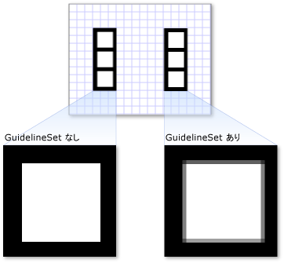

# 方法 : 描画に GuidelineSet を適用する
この例では、<xref:System.Windows.Media.GuidelineSet> を <xref:System.Windows.Media.DrawingGroup> に適用する方法を示します。  
  
 <xref:System.Windows.Media.DrawingGroup> クラスは、<xref:System.Windows.Media.DrawingGroup.GuidelineSet%2A> プロパティを持つ <xref:System.Windows.Media.Drawing> の唯一の型です。  <xref:System.Windows.Media.GuidelineSet> を <xref:System.Windows.Media.Drawing> の別の型に適用するには、その型を <xref:System.Windows.Media.DrawingGroup> に追加した後、<xref:System.Windows.Media.GuidelineSet> を <xref:System.Windows.Media.DrawingGroup> に適用します。  
  
## 使用例  
 次の例では、<xref:System.Windows.Media.DrawingGroup> オブジェクトを 2 つ作成します。両者はほとんど同じですが、唯一異なっているのは、2 番目の <xref:System.Windows.Media.DrawingGroup> が <xref:System.Windows.Media.GuidelineSet> を持っているのに対し、1 番目は持っていないことです。  
  
 この例からの出力を次の図に示します。  2 つの <xref:System.Windows.Media.DrawingGroup> オブジェクトのレンダリングの違いはごくわずかなので、描画の一部を拡大してあります。  
  
   
  
 [!code-csharp[DrawingMiscSnippets_snip#GraphicsMMDrawingGroupGuidelineSetExampleWholePage](../../../../samples/snippets/csharp/VS_Snippets_Wpf/DrawingMiscSnippets_snip/CSharp/DrawingGroupGuidelineSetExample.cs#graphicsmmdrawinggroupguidelinesetexamplewholepage)]
 [!code-xml[DrawingMiscSnippets_snip#GraphicsMMDrawingGroupGuidelineSetExampleWholePage](../../../../samples/snippets/xaml/VS_Snippets_Wpf/DrawingMiscSnippets_snip/XAML/DrawingGroupGuidelineSetExample.xaml#graphicsmmdrawinggroupguidelinesetexamplewholepage)]  
  
## 参照  
 <xref:System.Windows.Media.DrawingGroup>   
 <xref:System.Windows.Media.GuidelineSet>   
 [Drawing オブジェクトの概要](../../../../docs/framework/wpf/graphics-multimedia/drawing-objects-overview.md)