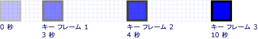
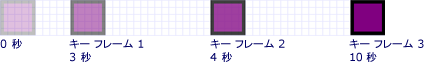
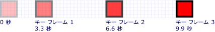
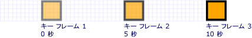

# 方法 : キー フレーム アニメーションのタイミングを制御する
この例では、キー フレーム アニメーション内のキー フレームのタイミングを制御する方法を示します。  他のアニメーションと同様に、キー フレーム アニメーションにも <xref:System.Windows.Media.Animation.Timeline.Duration%2A> プロパティがあります。  アニメーションの継続時間の指定に加えて、その継続時間のどの部分を各キー フレームに割り当てるかを指定する必要があります。  継続時間を割り当てるには、アニメーションの各キー フレームの <xref:System.Windows.Media.Animation.KeyTime> を指定します。  
  
 各キー フレームの <xref:System.Windows.Media.Animation.KeyTime> は、キー フレームが終了するタイミングを指定します \(キー フレームの再生時間は指定しません\)。  <xref:System.Windows.Media.Animation.KeyTime> は、<xref:System.TimeSpan> 値として、パーセンテージとして、または特殊な <xref:System.Windows.Media.Animation.KeyTime.Uniform%2A> 値や <xref:System.Windows.Media.Animation.KeyTime.Paced%2A> 値として指定できます。  
  
## 使用例  
 <xref:System.Windows.Media.Animation.DoubleAnimationUsingKeyFrames> を使用して、画面を横切るように四角形をアニメーション化する例を次に示します。  キー フレームのキー時刻は、<xref:System.TimeSpan> 値で設定します。  
  
 [!code-csharp[keyframes_snip#KeyTimesTimeSpanExample](../../../../samples/snippets/csharp/VS_Snippets_Wpf/keyframes_snip/CSharp/KeyTimesExample.cs#keytimestimespanexample)]
 [!code-vb[keyframes_snip#KeyTimesTimeSpanExample](../../../../samples/snippets/visualbasic/VS_Snippets_Wpf/keyframes_snip/visualbasic/keytimesexample.vb#keytimestimespanexample)]
 [!code-xml[keyframes_snip#KeyTimesTimeSpanExample](../../../../samples/snippets/xaml/VS_Snippets_Wpf/keyframes_snip/XAML/KeyTimesExample.xaml#keytimestimespanexample)]  
  
 各キー フレームの値に達したときの図を次に示します。  
  
   
  
 キー フレームのキー時刻をパーセンテージの値で設定する以外は前と同一であるアニメーションの例を次に示します。  
  
 [!code-csharp[keyframes_snip#KeyTimesPercentageExample](../../../../samples/snippets/csharp/VS_Snippets_Wpf/keyframes_snip/CSharp/KeyTimesExample.cs#keytimespercentageexample)]
 [!code-vb[keyframes_snip#KeyTimesPercentageExample](../../../../samples/snippets/visualbasic/VS_Snippets_Wpf/keyframes_snip/visualbasic/keytimesexample.vb#keytimespercentageexample)]
 [!code-xml[keyframes_snip#KeyTimesPercentageExample](../../../../samples/snippets/xaml/VS_Snippets_Wpf/keyframes_snip/XAML/KeyTimesExample.xaml#keytimespercentageexample)]  
  
 各キー フレームの値に達したときの図を次に示します。  
  
   
  
 <xref:System.Windows.Media.Animation.KeyTime.Uniform%2A> キー時刻の値を使用する例を次に示します。  
  
 [!code-csharp[keyframes_snip#KeyTimesUniformExample](../../../../samples/snippets/csharp/VS_Snippets_Wpf/keyframes_snip/CSharp/KeyTimesExample.cs#keytimesuniformexample)]
 [!code-vb[keyframes_snip#KeyTimesUniformExample](../../../../samples/snippets/visualbasic/VS_Snippets_Wpf/keyframes_snip/visualbasic/keytimesexample.vb#keytimesuniformexample)]
 [!code-xml[keyframes_snip#KeyTimesUniformExample](../../../../samples/snippets/xaml/VS_Snippets_Wpf/keyframes_snip/XAML/KeyTimesExample.xaml#keytimesuniformexample)]  
  
 各キー フレームの値に達したときの図を次に示します。  
  
   
  
 最後の例では、<xref:System.Windows.Media.Animation.KeyTime.Paced%2A> キー時刻の値を使用します。  
  
 [!code-csharp[keyframes_snip#KeyTimesPacedExample](../../../../samples/snippets/csharp/VS_Snippets_Wpf/keyframes_snip/CSharp/KeyTimesExample.cs#keytimespacedexample)]
 [!code-vb[keyframes_snip#KeyTimesPacedExample](../../../../samples/snippets/visualbasic/VS_Snippets_Wpf/keyframes_snip/visualbasic/keytimesexample.vb#keytimespacedexample)]
 [!code-xml[keyframes_snip#KeyTimesPacedExample](../../../../samples/snippets/xaml/VS_Snippets_Wpf/keyframes_snip/XAML/KeyTimesExample.xaml#keytimespacedexample)]  
  
 各キー フレームの値に達したときの図を次に示します。  
  
   
  
 この例のコードでは、単純化するためにストーリーボードではなくローカル アニメーションを使用しています。1 つのアニメーションだけが 1 つのプロパティに適用されるためですが、代わりにストーリーボードを使用するように変更することもできます。  コードでストーリーボードを宣言する方法の例については、「[ストーリーボードを使ってプロパティをアニメーション化する](../../../../docs/framework/wpf/graphics-multimedia/how-to-animate-a-property-by-using-a-storyboard.md)」を参照してください。  
  
 サンプル全体については、[キー フレーム アニメーションのサンプル](http://go.microsoft.com/fwlink/?LinkID=160012)を参照してください。  キー フレーム アニメーションの詳細については、「[キー フレーム アニメーションの概要](../../../../docs/framework/wpf/graphics-multimedia/key-frame-animations-overview.md)」を参照してください。  
  
## 参照  
 [キー フレーム アニメーションの概要](../../../../docs/framework/wpf/graphics-multimedia/key-frame-animations-overview.md)   
 [アニメーションの概要](../../../../docs/framework/wpf/graphics-multimedia/animation-overview.md)   
 [方法のトピック](../../../../docs/framework/wpf/graphics-multimedia/animation-and-timing-how-to-topics.md)