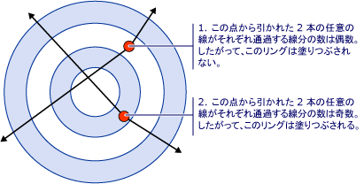
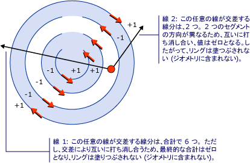
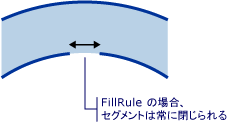

# 方法 : 複合図形の塗りつぶしを制御する
<xref:System.Windows.Media.GeometryGroup.FillRule%2A>のプロパティ、 <xref:System.Windows.Media.GeometryGroup>または<xref:System.Windows.Media.PathGeometry>、複合図形を使用して、指定された点のジオメトリの一部であるかどうかを決定する「ルール」を指定します。 2 つの値がある<xref:System.Windows.Media.FillRule>: <xref:System.Windows.Media.FillRule>と<xref:System.Windows.Media.FillRule>します。 次のセクションでは、これら&2; つのルールを使用する方法を説明します。  
  
 **EvenOdd:**このルールは、そのポイントからの任意の方向に無制限に光線を描画し、その光線が交差する特定の形状のパス セグメントの数をカウントして、ポイントは、塗りつぶし領域の内側かどうかを確認します。 この数値が偶数の場合は、ポイントは内側にあります。偶数の場合は、ポイントは外側にあります。  
  
 たとえば、次の XAML で一連同心円リング (ターゲット) の複合図形を作成します.、 <xref:System.Windows.Media.GeometryGroup.FillRule%2A>設定<xref:System.Windows.Media.FillRule>します。  
  
 [!code-xml[GeometriesMiscSnippets_snip#FillRuleEvenOddValue](../../../../samples/snippets/xaml/VS_Snippets_Wpf/GeometriesMiscSnippets_snip/XAML/FillRuleExample.xaml#fillruleevenoddvalue)]  
  
 次の図は、前の例で作成した図形を示します。  
  
   
  
 上の図の中心と 3 番目のリングが入力されていないことを確認します。 これら&2; つのリングのいずれかの任意の点から描画光線が偶数個のセグメントを通過するためです。 次の図を参照してください。  
  
   
  
 **0 以外。**このルールは、ポイントがそのポイントからの任意の方向に無制限に光線を描画して、図形のセグメントが光線と交差する場所を調べることが、パスの塗りつぶし領域の内側かどうかを確認します。 以降、カウントが&0;、1 つずつを追加回のセグメントが左から右、およびそれぞれに&1; を減算に光線を越えるパス セグメントでは、右から左に、ray と交差します。 交差のカウント後、結果が&0; の場合は、ポイントは、パスの外側にあります。 それ以外の場合は、内側にあります。  
  
 [!code-xml[GeometriesMiscSnippets_snip#FillRuleNonZeroValueEllipseGeometry](../../../../samples/snippets/xaml/VS_Snippets_Wpf/GeometriesMiscSnippets_snip/XAML/FillRuleExample.xaml#fillrulenonzerovalueellipsegeometry)]  
  
 上記の値の例を使用して<xref:System.Windows.Media.FillRule>の<xref:System.Windows.Media.GeometryGroup.FillRule%2A>次の図は、その結果。  
  
   
  
 ご覧のように、すべてのリングに格納されます。 これは、任意の時点から描画光線が交差&1; つまたは複数のセグメントと、超過の合計が&0; と等しくないので、すべてのセグメントが同じ方向に実行されているためです。 たとえば、次の図で赤の矢印セグメントが描かれる方向を表し、白い矢印は、最も内側の輪にポイントから実行する任意の光線を表します。 1 つの値は&0;、光線と交差する、各セグメントの値で始まる、セグメントが左から右に光線を越えるために追加されます。  
  
   
  
 動作を詳しく説明するために<xref:System.Windows.Media.FillRule>規則さまざまな方向に実行しているセグメントを持つより複雑な図形が必要です。 次の XAML コードで作成する点を除いて前の例と類似した図形を作成、 <xref:System.Windows.Media.PathGeometry>ではなく、 <xref:System.Windows.Media.EllipseGeometry>の同心円を完全に閉じている&4; つの同心円円弧を作成し、します。  
  
 [!code-xml[GeometriesMiscSnippets_snip#FillRuleNonZeroValuePathGeometry](../../../../samples/snippets/xaml/VS_Snippets_Wpf/GeometriesMiscSnippets_snip/XAML/FillRuleExample.xaml#fillrulenonzerovaluepathgeometry)]  
  
 次の図は、前の例で作成した図形を示します。  
  
   
  
 センターから&3; 番目の円弧が入力されていないことを確認します。 次の図は、これは、理由を示します。 図では、赤の矢印は、セグメントが描かれる方向を表します。 2 つの白い矢印は、「塗りつぶされていない」地域でのポイントから外に移動する&2; つの任意の光線を表しています。 図からわかるように、指定したパス セグメントの境界を越える光線から値の合計は&0; です。 上記で定義した、合計が&0;、ポイントはないということ geometry (塗りつぶしの一部ではない) の一部である合計中に*いない*0、負の値を含む、ジオメトリの一部であります。  
  
   
  
 **注:**の目的で<xref:System.Windows.Media.FillRule>、すべての図形は終了と見なされます。 セグメント内の欠落がある場合を閉じるには、架空の線を描画します。 上記の例では、輪に小規模の欠落があります。 そのため、いずれかの想像し、異なる結果を得るための間隔で実行される ray、別の方向に伸びるします。 この間隙と「虚数セグメント」のいずれかの拡大した例を次に示します (セグメントの適用のために描画される、 <xref:System.Windows.Media.FillRule>) を終了します。  
  
   
  
## 例  
  
## 関連項目  
 [複合図形を作成します。](../../../../docs/framework/wpf/graphics-multimedia/how-to-create-a-composite-shape.md)   
 [ジオメトリの概要](../../../../docs/framework/wpf/graphics-multimedia/geometry-overview.md)