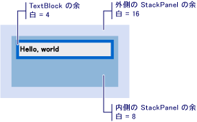

# 方法 : ビジュアルのオフセットを取得する
これらの例では、その親または先祖、または子孫に対応するビジュアル オブジェクトのオフセット値を取得する方法を示します。  
  
## 例  
 次のマークアップの例は、<xref:System.Windows.Controls.TextBlock>で定義されている<xref:System.Windows.FrameworkElement.Margin%2A>4 の値。  
  
 [!code-xaml[VisualSnippets#VisualSnippet1](../../../../samples/snippets/csharp/VS_Snippets_Wpf/VisualSnippets/CSharp/Window1.xaml#visualsnippet1)]  
  
 次のコード例を使用する方法を示しています、<xref:System.Windows.Media.VisualTreeHelper.GetOffset%2A>のオフセットを取得する方法を<xref:System.Windows.Controls.TextBlock>です。 オフセット値が含まれている、返された内<xref:System.Windows.Vector>値。  
  
 [!code-csharp[VisualSnippets#VisualSnippet2](../../../../samples/snippets/csharp/VS_Snippets_Wpf/VisualSnippets/CSharp/Window1.xaml.cs#visualsnippet2)]
 [!code-vb[VisualSnippets#VisualSnippet2](../../../../samples/snippets/visualbasic/VS_Snippets_Wpf/VisualSnippets/visualbasic/window1.xaml.vb#visualsnippet2)]  
  
 オフセットは考慮に入れて、<xref:System.Windows.FrameworkElement.Margin%2A>値。 ここでは、<xref:System.Windows.Vector.X%2A>は、4、および<xref:System.Windows.Vector.Y%2A>は 4 です。  
  
 返されたオフセット値は、親の<xref:System.Windows.Media.Visual>です。 親を基準にはないオフセット値を取得する場合、<xref:System.Windows.Media.Visual>を使用して、<xref:System.Windows.Media.Visual.TransformToAncestor%2A>メソッドです。  
  
## 先祖に相対的なオフセットの取得  
 次のマークアップの例は、 <xref:System.Windows.Controls.TextBlock> 2 内で入れ子になっている<xref:System.Windows.Controls.StackPanel>オブジェクト。  
  
 [!code-xaml[VisualSnippets#VisualSnippet7](../../../../samples/snippets/csharp/VS_Snippets_Wpf/VisualSnippets/CSharp/Window2.xaml#visualsnippet7)]  
  
 次の図は、マークアップの結果を示します。  
  
   
2 つの StackPanels 内で入れ子になった TextBlock  
  
 次のコード例を使用する方法を示しています、<xref:System.Windows.Media.Visual.TransformToAncestor%2A>のオフセットを取得する方法を<xref:System.Windows.Controls.TextBlock>を含む、に対して相対的<xref:System.Windows.Window>です。 オフセット値が含まれている、返された内<xref:System.Windows.Media.GeneralTransform>値。  
  
 [!code-csharp[VisualSnippets#VisualSnippet5](../../../../samples/snippets/csharp/VS_Snippets_Wpf/VisualSnippets/CSharp/Window1.xaml.cs#visualsnippet5)]
 [!code-vb[VisualSnippets#VisualSnippet5](../../../../samples/snippets/visualbasic/VS_Snippets_Wpf/VisualSnippets/visualbasic/window1.xaml.vb#visualsnippet5)]  
  
 オフセットは考慮に入れて、<xref:System.Windows.FrameworkElement.Margin%2A>を含む、すべてのオブジェクトの値<xref:System.Windows.Window>です。 この場合、 <xref:System.Windows.Vector.X%2A> 28 (16 + 8 + 4)、および<xref:System.Windows.Vector.Y%2A>28 です。  
  
 返されたオフセット値の先祖、<xref:System.Windows.Media.Visual>です。 子に対して相対的なオフセット値を取得する場合、<xref:System.Windows.Media.Visual>を使用して、<xref:System.Windows.Media.Visual.TransformToDescendant%2A>メソッドです。  
  
## 子に相対的なオフセットの取得  
 マークアップ例を次に、<xref:System.Windows.Controls.TextBlock>内に含まれているが、<xref:System.Windows.Controls.StackPanel>オブジェクト。  
  
 [!code-xaml[VisualSnippets#VisualSnippet4](../../../../samples/snippets/csharp/VS_Snippets_Wpf/VisualSnippets/CSharp/Window1.xaml#visualsnippet4)]  
  
 次のコード例を使用する方法を示しています、<xref:System.Windows.Media.Visual.TransformToDescendant%2A>のオフセットを取得する方法を<xref:System.Windows.Controls.StackPanel>その子の基準とした<xref:System.Windows.Controls.TextBlock>です。 オフセット値が含まれている、返された内<xref:System.Windows.Media.GeneralTransform>値。  
  
 [!code-csharp[VisualSnippets#VisualSnippet9](../../../../samples/snippets/csharp/VS_Snippets_Wpf/VisualSnippets/CSharp/Window1.xaml.cs#visualsnippet9)]
 [!code-vb[VisualSnippets#VisualSnippet9](../../../../samples/snippets/visualbasic/VS_Snippets_Wpf/VisualSnippets/visualbasic/window1.xaml.vb#visualsnippet9)]  
  
 オフセットは考慮に入れて、<xref:System.Windows.FrameworkElement.Margin%2A>すべてのオブジェクトの値。 この場合、 <xref:System.Windows.Vector.X%2A> -4、および<xref:System.Windows.Vector.Y%2A>-4 です。 オフセットの値は負の値は、親オブジェクトは、子オブジェクトに対してオフセット悪影響を及ぼすためです。  
  
## 関連項目  
 <xref:System.Windows.Media.Visual>  
 <xref:System.Windows.Media.VisualTreeHelper>  
 [WPF グラフィックス レンダリングの概要](../../../../docs/framework/wpf/graphics-multimedia/wpf-graphics-rendering-overview.md)
