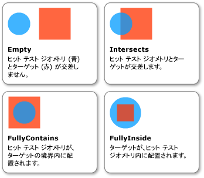

# 方法 : パラメーターとしてジオメトリを使用してヒット テストを実行する
この例を使用してビジュアル オブジェクトに対してヒット テストを実行する方法を示しています、<xref:System.Windows.Media.Geometry>ヒットとしてパラメーターをテストします。  
  
## 例  
 次の例を使用して、ヒット テストを設定する方法を示しています。<xref:System.Windows.Media.GeometryHitTestParameters>の、<xref:System.Windows.Media.VisualTreeHelper.HitTest%2A>メソッドです。 <xref:System.Windows.Point>に渡される値、`OnMouseDown`メソッドの使用を作成、<xref:System.Windows.Media.Geometry>ヒット テストの範囲を拡張するためにオブジェクト。  
  
 [!code-csharp[HitTestingOverview#HitTestingOverviewSnippet10](../../../../samples/snippets/csharp/VS_Snippets_Wpf/HitTestingOverview/CSharp/GeometryHitTest.cs#hittestingoverviewsnippet10)]
 [!code-vb[HitTestingOverview#HitTestingOverviewSnippet10](../../../../samples/snippets/visualbasic/VS_Snippets_Wpf/HitTestingOverview/visualbasic/geometryhittest.vb#hittestingoverviewsnippet10)]  
  
 <xref:System.Windows.Media.GeometryHitTestResult.IntersectionDetail%2A>プロパティ<xref:System.Windows.Media.GeometryHitTestResult>を使用するヒット テストの結果に関する情報を提供、<xref:System.Windows.Media.Geometry>ヒットとしてパラメーターをテストします。 ヒット テストのジオメトリ (青い円) と対象のビジュアル オブジェクト (赤い正方形) の描画されるコンテンツとの関係を次の図に示します。  
  
   
ヒット テストのジオメトリと対象のビジュアル オブジェクトの交差部分  
  
 次の例は、ヒット テストのコールバックを実装する方法を示しています。 ときに、<xref:System.Windows.Media.Geometry>ヒット テスト パラメーターとして使用されます。 `result`にパラメーターをキャスト、<xref:System.Windows.Media.GeometryHitTestResult>の値を取得するために、<xref:System.Windows.Media.GeometryHitTestResult.IntersectionDetail%2A>プロパティです。 プロパティの値を使用すると、かどうかを<xref:System.Windows.Media.Geometry>ヒット テスト パラメーターの完全または部分的に含まれるヒット テスト対象の描画された内容。 ここに示すサンプル コードでは、完全に対象の境界内に含まれるビジュアルについてのみ、ヒット テストの結果をリストに追加しています。  
  
 [!code-csharp[HitTestingOverview#HitTestingOverviewSnippet11](../../../../samples/snippets/csharp/VS_Snippets_Wpf/HitTestingOverview/CSharp/GeometryHitTest.cs#hittestingoverviewsnippet11)]
 [!code-vb[HitTestingOverview#HitTestingOverviewSnippet11](../../../../samples/snippets/visualbasic/VS_Snippets_Wpf/HitTestingOverview/visualbasic/geometryhittest.vb#hittestingoverviewsnippet11)]  
  
> [!NOTE]
>  <xref:System.Windows.Media.HitTestResult>交差部分の詳細はときに、コールバックを呼び出すことはできません<xref:System.Windows.Media.IntersectionDetail.Empty>です。  
  
## 関連項目  
 [ビジュアル層でのヒット テスト](../../../../docs/framework/wpf/graphics-multimedia/hit-testing-in-the-visual-layer.md)  
 [ビジュアル内のジオメトリのヒット テストを実行する](../../../../docs/framework/wpf/graphics-multimedia/how-to-hit-test-geometry-in-a-visual.md)
